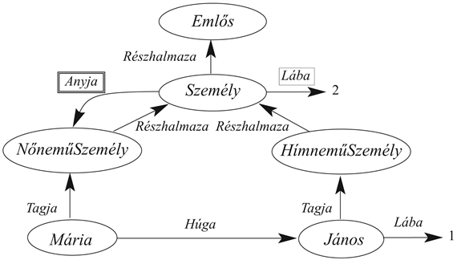
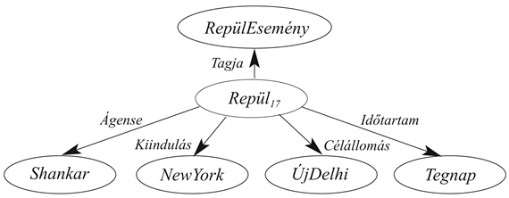
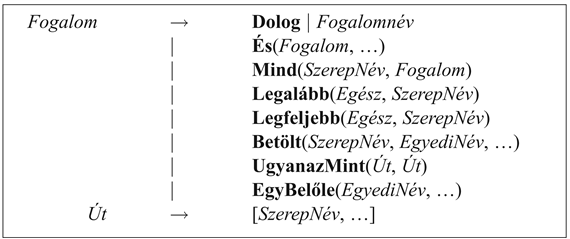

<?xml version="1.0" encoding="UTF-8" standalone="no"?>
<!DOCTYPE html PUBLIC "-//W3C//DTD XHTML 1.1//EN" "http://www.w3.org/TR/xhtml11/DTD/xhtml11.dtd">
<html xmlns="http://www.w3.org/1999/xhtml"><head><meta name="generator" content="DocBook XSL Stylesheets V1.76.1"/></head><body>

<h1 class="title"><a id="id630686"/>Következtető rendszerek kategóriák számára</h1>

Láttuk, hogy a kategóriák alapvető építőkockái bármely nagyobb méretű reprezentációs sémának. Ebben az alfejezetben a kategóriák szervezéséhez és a kategóriákkal való következtetéshez célzottan megtervezett rendszereket mutatjuk be. Két szoros kapcsolatban lévő rendszercsaládról beszélhetünk. A <strong>szemantikus háló</strong>k (<strong>semantic network</strong>) grafikus segítséget nyújtanak a tudásbázis vizualizálásában, és hatékony algoritmusokat biztosítanak, hogy egy objektum tulajdonságait a kategóriához való tartozásából kikövetkeztessük. A <strong>leíró</strong> <strong>logikák</strong> (<strong>description logics</strong>) formális nyelvet adnak a kategóriadefiníciók konstruálásához és kombinálásához, valamint hatékony algoritmusokat annak eldöntéséhez, hogy a kategóriák között fennáll-e a részhalmaz- és a szuperhalmaz-reláció.

<h2 class="title"><a id="id630716"/>Szemantikus hálók</h2>

1909-ben Charles Peirce egy <strong>egzisztenciális gráf</strong>oknak (<strong>existential graph</strong>s) elnevezett grafikus jelölésrendszert javasolt, ami az ő elnevezése szerint a „jövő logikája”. Ezzel kezdetét vette a „logika” és a „szemantikus hálók” szószólóinak hosszú vitája. Sajnos a vita elfedte azt a tényt, hogy a szemantikus hálók – legalább a jól definiált szemantikával ellátottak – a logika <em>egy formáját </em>jelentik. Bizonyosfajta állítások számára a szemantikus hálók nyújtotta jelölés gyakran kényelmesebb, azonban ha az „emberi interfész” problémáktól eltekintünk, a mögötte felsorakozó fogalmak – az objektumok, a relációk, a kvantifikálás stb. – mind ugyanazok.

A szemantikus hálóknak több változata van, mindegyik képes azonban az egyedi objektumokat, az objektumok kategóriáit és az objektumok közötti relációkat reprezentálni. A tipikus grafikus jelölés objektumok, illetve kategóriák neveit ovális keretekben vagy dobozokban mutatja, címkézett élekkel összekapcsolva. A 10.9. ábrán például a <em>Mária</em> és a <em>NőneműSzemély</em> között <em>Tagja</em> kapcsolat van, ami annak a logikai állításnak felel meg, hogy <em>Mária</em> ∈ <em>NőneműSzemély</em>. Hasonlóan a <em>Mária</em> és a <em>János</em> közötti <em>Húga</em> kapcsolat annak az állításnak felel meg, hogy <em>Húga</em>(<em>Mária</em>, <em>János</em>). A kategóriákat a <em>Részhalmaza</em> éllel kapcsolhatjuk össze. A krumplik és a nyilak rajzolása annyira szórakoztató, hogy könnyű kísértésbe esni. Tudjuk például, hogy minden személy anyja egy nőnemű személy, szabad-e akkor a <em>Személy</em>-től a <em>NőneműSzemély</em>-ig egy <em>Anyja</em> élt húzni? A válasz nem, merthogy az <em>Anyja</em> egy reláció egy személy és az anyja között, a kategóriáknak viszont nincsen anyjuk.[<a id="id630795" href="#ftn.id630795" class="footnote">101</a>] Emiatt a kapcsolatra a 10.9. ábrán egy külön jelölést használtunk – egy kettős vonallal történő bekeretezést. Ez a kapcsolat azt állítja, hogy:

<code class="code">∀<em>x</em>  <em>x</em> ∈ <em>Személy</em> ⇒ [∀<em>y</em> <em>Anyja</em>(<em>x</em>, <em>y</em>) ⇒ <em>y</em> ∈ <em>NőneműSzemély</em>]</code>

Esetleg azt is állíthatnánk, hogy egy személynek két lába van, azaz:

<code class="code">∀<em>x </em> <em>x </em>∈ <em>Személy</em> ⇒ <em>Lába</em>(<em>x</em>, 2)</code>

Mint korábban, most is óvatosnak kell lennünk, nehogy azt állítsuk, hogy kategóriának van két lába. A 10.9. ábra egyszeres vonallal végzett keretezése jelzi az egy kategória minden tagjának tulajdonságaira vonatkozó állítást.

A szemantikus háló jelölésrendszere igen alkalmas a 10.2. alfejezetben bevezetett típusú <strong>öröklődés</strong>es (<strong>inheritance</strong>) következtetés végrehajtására. Így személy révén, Mária örökli azt a tulajdonságot, hogy két lába van. Ahhoz, hogy kitaláljuk, hány lába van Máriának, az öröklődéses algoritmus követi a <em>Tagja</em> élt a <em>Máriá</em>-tól az őt tartalmazó kategóriáig, majd a <em>Részhalmaza</em> élt a hierarchiába felfelé, amíg egy olyan kategóriát nem talál meg, amelyhez létezik egy bekeretezett <em>Lába</em> él – ebben ez esetben ez <em>Személy</em> kategória lesz. Ennek az öröklődéses algoritmusnak az egyszerűsége és hatékonysága a logikai tételbizonyítóhoz képest, a szemantikus hálók egyik fő vonzereje volt.

Az öröklődés komplikálódik, amikor egy objektum egyszerre több kategóriához tartozhat, vagy pedig amikor egy kategória több kategória részhalmaza. Ezt az esetet <strong>többszörös öröklődés</strong>nek (<strong>multiple inheritance</strong>) nevezzük. Az ilyen helyzetben a öröklődéses algoritmus esetleg két vagy több, egymással ellentétes választ talál a felkérésre. Ennél fogva a többszörös öröklődés bizonyos <strong>objektumorientált programozás</strong>i (<strong>object-oriented programming</strong>, <strong>OOP</strong>) nyelvekből, mint amilyen például a Java, ami az osztályhierarchiában öröklődést használ, ki van zárva. Szemantikus hálókban a többszörös öröklődést általában megengedjük, de ennek részletes tárgyalását a 10.7. alfejezetre hagyjuk. 

<a id="id630926"/>
<strong>10.9. ábra - Egy szemantikus háló négy objektummal (János, Mária, 1 és 2) és négy kategóriával. A relációkat a címkézett élek jelölik</strong>

A következtetés másik közönséges formája az <strong>inverz kapcsolat</strong>ok (<strong>inverse link</strong>s) használata. Például a <em>VanHúga</em> a <em>Húga</em> inverze, azaz:

<code class="code">∀<em>p</em>, <em>s</em>  <em>VanHúga</em>(<em>p</em>, <em>s</em>) ⇔ <em>Húga</em>(<em>s</em>, <em>p</em>)</code>

Ezt az állítást megfogalmazhatjuk szemantikus hálóval, feltéve hogy a kapcsolatok <strong>reifikált</strong>ak (<strong>reified</strong>), azaz önálló objektumnak tekinthetők. Így például <em>VanHúga</em> objektumot az <em>Inverze</em> éllel lehetne összekapcsolni a <em>Húga</em> objektummal. Ha egy lekérdezés azt firtatná, hogy ki Jánosnak a <em>Húga</em>, az öröklődéses algoritmus felfedezheti, hogy a <em>VanHúga</em> a <em>Húga</em> inverze, és a lekérdezést úgy megválaszolhatja, hogy a <em>VanHúga</em> kapcsolatot <em>János-</em>tól <em>Máriá</em>-ig követi végig. Az inverz információ nélkül esetleg szükséges lehetne az összes nőnemű személyt megvizsgálni, van-e netán <em>Húga</em> kapcsolata Jánossal. Ez amiatt van így, mert a szemantikus háló közvetlen indexelést csak az objektumok, a kategóriák és a belőlük induló kapcsolatok esetén biztosít. Az elsőrendű logika nyelvében ez annak felel meg, mintha a tudásbázist a predikátumok csakis első argumentumai szerint indexelnénk.

Az olvasó talán felfedezte már a szemantikus háló jelölésnek egy nyilvánvaló hátrányát az elsőrendű logikához képest. A krumplik közötti élek csak <em>bináris</em> relációkat reprezentálnak. A <em>Repül</em>(<em>Shankar</em>,<em> NewYork</em>,<em> Újdelhi</em>,<em> Tegnap</em>) állítást a hálóban közvetlenül megfogalmazni nem tudjuk. Az <em>n</em> értékű állítások hatását megkaphatjuk azonban, ha az állítást magát egy, az események megfelelő kategóriájához tartozó eseményként reifikáljuk (lásd 10.3. alfejezet). A 10.10. ábra ehhez a konkrét eseményhez tartozó szemantikus hálóstruktúrát mutat. Jegyezzük meg, hogy a bináris relációkra vonatkozó korlátozás a reifikált fogalmak gazdag ontológiáját teszi szükségessé. Az ebben a fejezetben kifejlesztett ontológia zöme ténylegesen a szemantikus hálós rendszerekben gyökerezik.

<a id="id632017"/>
<strong>10.10. ábra - A szemantikus háló egy részlete, amely a <em>Repül</em>(<em>Shankar</em>,<em> NewYork</em>,<em> Újdelhi</em>,<em> Tegnap</em>) logikai állítás reprezentációját valósítja meg</strong>

Állítások reifikálása lehetővé teszi, hogy az elsőrendű logika minden rögzített, függvénymentes atomi állítása reprezentálható szemantikus hálós jelöléssel. Univerzálisan kvantifikált állítások bizonyos típusai reprezentálhatók a kategóriákra alkalmazott inverz kapcsolatok, valamint egyszeresen és kétszeresen bekeretezett élek alkalmazásával, ettől még persze az elsőrendű logikától messze vagyunk. A negálás, a diszjunkció, a beágyazott függvényszimbólumok és az egzisztenciális kvantifikálás mind hiányzik. Manapság lehetséges a jelölés kiterjesztése, hogy az az elsőrendű logikával ekvivalens legyen – ilyenek például a Pierce-féle egzisztenciális gráfok vagy Hendrix-féle particionált szemantikus hálók (Hendrix, 1975) – ez viszont a szemantikus hálók fő előnyét – az öröklődéses folyamat egyszerűségét és átláthatóságát – semmisíti meg. A tervezők nagy hálókat építhetnek, és még mindig lehetnek jó ötleteik, hogy mely lekérdezések lesznek hatékonyak, mert (a) az öröklődéses eljárás lépéseit könnyű vizualizálni, (b) egyes esetekben a lekérdezés nyelve olyan egyszerű, hogy bonyolult lekérdezéseket feltenni nem is lehet. Azokban az esetekben, amikor a kifejezőerő túlságosan korlátozott, számos szemantikus hálórendszer a <strong>procedurális kiegészítés</strong>hez (<strong>procedural attachment</strong>) folyamodik, hogy a hiányokat kitöltse. A procedurális kiegészítés egy olyan módszer, amikor egy bizonyos relációra vonatkozó lekérdezés (néha állítás) egy, a relációhoz megtervezett speciális eljárás, és nem egy általános öröklődéses algoritmus meghívását eredményezi.

A szemantikus hálók egyik legfontosabb aspektusa, hogy képesek a kategóriák számára az <strong>alapértelmezett érték</strong>eket (<strong>default value</strong>s) reprezentálni. A 10.9. ábra gondos végignézésével észrevehetjük, hogy Jánosnak egy lába van annak ellenére, hogy ő egy személy, és minden személynek két lába van. Egy tisztán logikai tudásbázisban ez egy ellentmondás lenne, de a szemantikus hálóban az az állítás, hogy minden személynek két lába van, egy alapeseti állítás, azaz egy személyről feltételezzük, hogy két lába van, ha nincs ezzel ellentmondó specifikusabb információ. Az alapeseti szemantikát természetesen az öröklődéses következtetés kényszeríti ki, mert a kapcsolatokat magától az objektumtól (itt Jánostól) felfelé követi, és megáll, hacsak egy értéket meg nem talál. Azt mondjuk, hogy az alapeseti értéket egy specifikusabb érték <strong>felülír</strong>hatja (<strong>over</strong><strong>ridden</strong>). Vegyük észre, hogy lábak számát felül tudnánk írni egy <em>EgyLábúSzemély</em> kategória létesítésével, ami a <em>Személy</em> <em>Részhalmaza</em> lenne, és amelynek <em>János</em> lenne a tagja.

A háló szigorúan logikai szemantikáját megtarthatjuk, ha azt mondjuk, hogy a <em>Lába</em> állítás a <em>Jánosra</em> vonatkozó kivételt tartalmazza:

<code class="code">∀<em>x</em>  <em>x</em> ∈ <em>Személy</em> ∧ <em>x</em> ≠ <em>János </em>⇒ <em>Lába</em>(<em>x</em>, 2)</code>

Egy rögzített háló esetén ez szemantikusan megfelelő, azonban ha sok kivételünk lesz, kevésbé tömör lesz a felírásunk, mint a hálós jelölés maga. Több állítással frissített háló esetén az ilyen megközelítés sajnos kudarcra van ítélve – amit valójában mondani szeretnénk az az, hogy minden, egyelőre még ismeretlen egylábú személy szintén kivételnek számít. Ezzel a témával és az alapeseti következtetéssel általában bővebben a 10.7. alfejezet foglalkozik.

<h2 class="title"><a id="id632138"/>Leíró logikák</h2>

Az elsőrendű logika szintaxisát úgy tervezték, hogy egyszerű legyen objektumokról kijelentéseket tenni. A <strong>leíró logiká</strong>k (<strong>description logic</strong>s) olyan jelölések, amelyeket a kategóriák definícióinak és tulajdonságainak könnyebb leírására terveztek. A leíró logikák a szemantikus hálókból alakultak ki, válaszul arra a nyomásra, hogy a hálók jelentését formalizáljuk, hangsúlyozva emellett a taxonómia szervezési elvként való használatát. 

A leíró logika alapvető következtetési feladata a <strong>részvizsgálat</strong> (<strong>subsumption</strong>) – annak ellenőrzése, hogy egy kategória része-e egy másiknak a definícióik alapján – és az <strong>osztályozás</strong> (<strong>classification</strong>) – annak ellenőrzése, hogy egy objektum egy kategóriába tartozik-e. Bizonyos rendszerek egy kategóriadefiníció <strong>konzisztenciavizsgálat</strong>át (<strong>consistency</strong>) is tartalmazzák arra, hogy a tagsági kritérium logikailag kielégíthető-e. 

<a id="id632185"/>
<strong>10.11. ábra - A leírások szintaxisa a <code class="code">CLASSIC</code> nyelv egy részhalmazában</strong>

A <code class="code">CLASSIC</code> nyelv (Borgida és társai, 1989) egy tipikus leíró logika. A 10.11. ábra mutatja a <code class="code">CLASSIC</code> leírások szintaxisát (az érthetőség kedvéért a nyelv kulcsszavait magyar fordításban adjuk meg – <em>a ford.</em>).[<a id="id632211" href="#ftn.id632211" class="footnote">102</a>] Azt az állítást például, hogy az agglegények nőtlen, felnőtt férfiak, következőképpen írhatnánk le:

<code class="code"><em>Agglegény</em> = <em>És</em>(<em>Nőtlen</em>, <em>Felnőtt</em>, <em>Férfi</em>)</code>

Ennek elsőrendű logikai ekvivalense a következő lenne:

<code class="code"><em>Agglegény</em>(<em>x</em>) ⇔ <em>Nőtlen</em>(<em>x</em>) ∧ <em>Felnőtt</em>(<em>x</em>) ∧ <em>Férfi</em>(<em>x</em>)</code>

Vegyük észre, hogy a leíró logika hatékonyan teszi lehetővé azt, hogy a predikátumokon direkt logikai műveleteket hajtsunk végre anélkül, hogy először mondatokat alkotnánk, amiket azután összekapcsolunk kötőszavakkal. Bármilyen leírás a <code class="code">CLASSIC</code>-ban kifejezhető elsőrendű logikával, de bizonyos leírások a <code class="code">CLASSIC</code>-ban sokkal világosabbak. Például az emberek egy olyan halmazának leírásához, akiknek legalább három fiuk van, és a fiúk mind munkanélküliek, és a feleségeik orvosok, valamint maximum két lányuk van, akik vagy fizika, vagy matematika tanszéken professzorok, azt használnánk, hogy:

<code class="code"><em>És</em>(<em>Férfi</em>, <em>Legalább</em>(3, <em>Fiú</em>), <em>Legfeljebb</em>(2, <em>Lány</em>),</code>

<code class="code">	<em>Mind</em>(<em>Fiú</em>, <em>És</em>(<em>Munkanélküli</em>, <em>Házas</em>, <em>Mind</em>(<em>Feleség</em>, <em>Orvos</em>))),</code>

<code class="code">	<em>Mind</em>(<em>Lány</em>, <em>És</em>(<em>Professzor</em>, <em>Betölt</em>(<em>Tanszék</em>, <em>Fizika</em>, <em>Matematika</em>))))</code>

Gyakorlatként meghagyjuk ennek lefordítását elsőrendű logikára.

A leíró logikák talán egyik legfontosabb aspektusa a következtetés nyomon követhetőségére tett hangsúly. Egy problémaeset megoldása a leírásával kezdődik, majd annak megkérdezésével folytatódik, hogy része-e a lehetséges megoldás a kategóriák egyikének. Standard elsőrendű logikában a válasz idejének megjóslása gyakran lehetetlen. Gyakran a felhasználóra vár a reprezentáció olyan átalakítása, hogy kikerülje azokat a mondathalmazokat, amelyek miatt úgy tűnik, hogy a rendszernek több hétbe telik a probléma megoldása. A leíró logikák viszont azt biztosítják, hogy a részvizsgálat megoldható legyen polinomiális idő alatt a probléma leírásától függően.[<a id="id632379" href="#ftn.id632379" class="footnote">103</a>]

Ez a gyakorlatban csodálatosan hangzik, míg az ember rá nem jön, hogy a következő két konzekvencia valamelyike lehetséges csak: a nehéz problémákat vagy nem lehet kifejezni, vagy exponenciálisan nagy leírást igényelnek! Mindenesetre a kezelhetőség eredményei vetnek némi fényt arra, hogy milyen konstrukciók okoznak bajt, és így segítik a felhasználót annak megértésében, hogyan viselkednek különböző reprezentációk. Például a leíró logikákból általában hiányzik a <em>negálás</em> és a <em>diszjunkció</em>. Ezek mindketten arra kényszerítik az elsőrendű logikai rendszert, hogy lényegében egy exponenciális eset analízisen menjen keresztül a teljesség biztosítása érdekében. A negálás és a diszjunkció ugyanezen ok miatt van kizárva a Prolog nyelvből is. A <code class="code">CLASSIC</code> csak egy korlátozott formájú diszjunkciót engedélyez a <em>Kitölt</em> és az <em>EgyBelőle</em> szerkezetekben, ami lehetővé tesz diszjunkciót explicit módon megszámolt egyedek felett, de nem a leírások felett. Diszjunktív leírással az egymásba ágyazott definíciók könnyen exponenciális számú alternatív úthoz vezethetnek, amelyekben az egyik kategória könnyen része lehet egy másiknak.

 

[<a id="ftn.id630795" href="#id630795" class="para">101</a>]  Bizonyos rendszerek nem tudtak különbséget tenni egy kategória tagjának tulajdonságai és kategória mint egész tulajdonságai között. Ez egyenes úton vezethet inkonzisztenciákhoz, ahogy ezt Drew McDermott kiemelte az „Artificial Intelligence Meets Natural Stupidity” című cikkében (McDermott, 1976). Más gyakori probléma volt a részhalmaz és a tagság kapcsolatoknál alkalmazott <em>IsA</em> választással, az angol használatnak megfelelően: „a cat is a mammal” (a macska egy emlős) és „Fifi is a cat” (Fifi egy macska). E témákról többet lásd 10.25. feladat.

[<a id="ftn.id632211" href="#id632211" class="para">102</a>]  Vegyük észre, hogy a nyelv <em>nem </em>engedi meg annak állítását, hogy az egyik fogalom vagy kategória egy másiknak a része. Ez egy átgondolt irányvonal: a kategóriák közötti részviszonyt a kategóriák bizonyos aspektusaiból kell tudni levezetni. Ha ez nem sikerül, akkor valami hiányzik a leírásból.

[<a id="ftn.id632379" href="#id632379" class="para">103</a>]  A <code class="code">CLASSIC</code> nyelv a gyakorlatban hatékony részvizsgálatot biztosít, a legrosszabb eset azonban exponenciális futásidejű.

</body></html>
