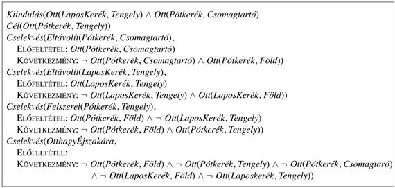

<?xml version="1.0" encoding="UTF-8" standalone="no"?>
<!DOCTYPE html PUBLIC "-//W3C//DTD XHTML 1.1//EN" "http://www.w3.org/TR/xhtml11/DTD/xhtml11.dtd">
<html xmlns="http://www.w3.org/1999/xhtml"><head><meta name="generator" content="DocBook XSL Stylesheets V1.76.1"/></head><body>

<h1 class="title"><a id="id637367"/>11. fejezet - Tervkészítés</h1>

<em>Ebben a fejezetben láthatjuk, hogy hogyan használhatja ki egy ágens a probléma szerkezetét egy összetett cselekvési terv kialakításához.</em>

Egy cél elérésére irányuló cselekvéssorozat kialakítását <strong>tervkészítés</strong>nek (<strong>planning</strong>) nevezzük. Tervkészítő ágensekre eddig két példát láttunk: a 3. fejezet keresésalapú problémamegoldó ágensét és a<em> </em>10. fejezetben bemutatott logikai tervkészítő ágenst. Ez a fejezet elsősorban az olyan nagyobb bonyolultságú tervezési feladatokra való felskálázással foglalkozik, melyek meghaladják az eddig ismertetett megközelítések képességeit.

A 11.1. fejezet egy kifejező, de mégis megfelelően korlátozott nyelvet mutat be az állapotokat és cselekvéseket tartalmazó tervkészítési feladatok leírására. Ez a nyelv szoros kapcsolatban áll a 7. és 10. fejezetben szereplő ítéletlogikai, illetve elsőrendű leírásokkal. A 11.2. fejezet megmutatja, hogy az előre- és a hátrafelé kereső algoritmusok hogyan tudják előnyösen kihasználni ezt a reprezentációt, elsősorban a leírás szerkezetéből automatikusan levezethető heurisztikák segítségével. (Ez analóg az 5. fejezetben bemutatott, a kényszerkielégítési problémához kialakított heurisztika elkészítésével.) A 11.3–11.5. alfejezetben olyan tervkészítő algoritmusok kerülnek bemutatásra, amelyek felhasználva a probléma reprezentációját, képességeikben túlmutatnak az előre-, illetve hátrafelé keresésen. Nevezetesen olyan eljárásokat vizsgálunk meg, amelyek nem csak teljesen rendezett cselekvések sorozatát képesek figyelembe venni.

Ebben a fejezetben csak olyan környezetekre szorítkozunk, melyek teljesen megfigyelhetők, determinisztikusak, végesek, statikusak (azaz ahol változások csak akkor történnek, amikor az ágens cselekszik), diszkrétek (időben, cselekvésekben, objektumokban és hatásokban). Ezeket <strong>klasszikus tervkészítés</strong>i (<strong>classical planning</strong>) környezeteknek nevezzük. Ezzel ellentétben a nem klasszikus tervkészítés a részben megfigyelhető vagy a sztochasztikus környezetek kezelésére szolgál, és itt megjelennek eltérő, a 12. és 17. fejezetben bemutatott, algoritmusok és ágenstervek.

<h1 class="title"><a id="id637405"/>A tervkészítési probléma</h1>

Fontoljuk meg, hogy mi történne, ha egy közönséges, a standard keresési algoritmusokat – mélységi keresés, A* stb.– használó problémamegoldó ágens valós nagyméretű problémákkal kerülne szembe. Ez segíthet abban, hogy jobb tervkészítő ágenseket tervezzünk.

A legkézenfekvőbb nehézség, hogy a problémamegoldó ágenst lebéníthatnák a szükségtelen cselekvések. Vegyük például a <em>Mesterséges intelligencia modern megközelítésben</em> c. könyv internetes megvásárlásának a feladatát. Tegyük fel, hogy minden egyes 10 jegyű ISBN szám megvásárlása egy-egy cselekvés, ez összesen 10 milliárd cselekvést jelent. A keresési algoritmusnak mind a 10 milliárd cselekvés végállapotát meg kellene vizsgálnia, hogy megtalálja a célnak megfelelőt, nevezetesen, hogy birtokoljuk a 9635454112 ISBN számú könyvet. Másrészről egy értelmes tervkészítő ágensnek képesnek kell lenni arra, hogy a pontos cél <em>Birtokol</em>(<em>ISBN9635454112</em>) leírásából visszafelé dolgozva közvetlenül eljusson a <em>Vásárol</em>(<em>ISBN9635454112</em>) cselekvéshez. Hogy ezt megtehesse, az ágensnek arra az általános tudásra van szüksége, hogy a <em>Vásárol</em>(<em>x</em>) következménye a <em>Birtokol</em>(<em>x</em>). Ha adott ez a tudás, a tervező egy egyszerűsítési lépésben el tudja dönteni, hogy a <em>Vásárol</em>(<em>ISBN9635454112</em>) a helyes cselekvés.

A következő nehézség, egy jó <strong>heurisztika</strong> (<strong>heuristic function</strong>) meghatározása. Tegyük fel, hogy az ágens feladata négy különböző könyv megvásárlása. Ebből 1040 négylépéses terv adódik, azaz nem kérdéses, hogy egy megfelelő heurisztika nélküli keresés értelmetlen. Az ember számára egy állapot költségének becslésére kézenfekvő heurisztika a továbbiakban még megvásárolandó könyvek száma. Sajnos ez nem nyilvánvaló egy problémamegoldó ágens számára, hisz az a céltesztet egy fekete dobozként látja, mely minden állapotra mindössze egy igaz-hamis értéket ad vissza. Ennek következményeképp a problémamegoldó ágens nem autonóm; azaz emberi beavatkozást igényel minden új problémánál az alkalmazható heurisztika megadására. Másrészről, ha az ágensnek rendelkezésére áll a cél leírása, mint részcélok konjunkciója, akkor használhat egy egyszerű feladatfüggetlen heurisztikát: a még nem teljesített részcélok számát. A könyvvásárlási feladat esetén a cél <em>Birtokol</em>(<em>A</em>) ∧ <em>Birtokol</em>(<em>B</em>) ∧ <em>Birtokol</em>(<em>C</em>) ∧ <em>Birtokol</em>(<em>D</em>) lenne, és a <em>Birtokol</em>(<em>A</em>) ∧ <em>Birtokol</em>(<em>C</em>) állapot költsége 2. Így az ágens számára automatikusan elérhető a helyes heurisztika erre és más problémákra is. A fejezet későbbi részében látni fogjuk, hogy hogyan lehet létrehozni olyan kifinomultabb heurisztikákat, ami a célstruktúráján túl számba veszi a végrehajtható cselekvéseket is.

Végül a problémamegoldó ágens nem hatékony, mert nem tudja kihasználni a <strong>problémadekompozíció</strong> (<strong>problem decomposition</strong>) lehetőségét. Vegyük például a következő feladatot: több csomagot kell kiszállítanunk a megfelelő címekre, melyek Ausztrália különböző pontjain találhatók. Jó megközelítés, ha megkeressük a célpontokhoz legközelebb eső reptereket, és felosztjuk a teljes problémát több részfeladatra; repterenként egyre. Az egy reptéren keresztül irányított csomagok esetén a további dekompozíció lehetősége a célvárostól függ. Az 5. fejezetben láttuk, hogy egy ilyen felbontás képessége hozzájárul a kényszerkielégítési feladatmegoldók hatékonyságához. A tervkészítőkre ugyanez igaz: a legrosszabb esetben <em>n</em> csomag legjobb kiszállítási tervének elkészítése <em>O</em>(<em>n</em>!), míg ha a feladat <em>k</em> egyenlő részre bontható ez mindössze <em>O</em>((<em>n</em>/<em>k</em>)! × <em>k</em>) komplexitású feladat<em>.</em>

Ahogy az 5. fejezetben megjegyeztük, a teljesen dekomponálható problémák jók, de ritkák.[<a id="id637561" href="#ftn.id637561" class="footnote">111</a>] A legtöbb tervkészítő rendszer felépítése – különösen a 11.3. fejezetben bemutatásra kerülő részben rendezett tervkészítő felépítése – azon a feltételezésen alapul, mely szerint a legtöbb valós, életszerű probléma <strong>majdnem dekomponálható</strong> (<strong>nearly decomposable</strong>). Ez annyit jelent, hogy a tervkészítő dolgozhat független részcélokon, de a résztervek összekombinálása további feladatokat eredményezhet. Néhány feladat esetén ez a feltételezés nem helytálló, mert az egyik részcél kidolgozása gyakran megbontja a másik részcélt. Ezek a részcélok közötti kölcsönhatások azok, amelyek a fejtörőket (mint a nyolcas kirakó) valójában fejtörővé teszik.

<h2 class="title"><a id="id637576"/>A tervkészítési problémák nyelve</h2>

A fent leírtak alapján a tervkészítési problémák reprezentációjának – ami az állapotokat, cselekvéseket és célokat jelenti – lehetőséget kellene biztosítania a tervkészítő algoritmus számára, hogy a feladat logikai struktúráját kihasználhassa. Ennek kulcsa, hogy olyan nyelvet találjunk, ami kellően kifejező ahhoz, hogy a problémák egy széles körét leírja, ugyanakkor kellően szigorú ahhoz, hogy a leírásokon hatékony algoritmusok működhessenek. Ebben a fejezetben először körvonalazzuk a klasszikus tervkészítők által használt alapnyelvet, ami <code class="code">STRIPS</code> néven ismert.[<a id="id637587" href="#ftn.id637587" class="footnote">112</a>] Később rámutatunk a számos módosítási lehetőségből néhányra a <code class="code">STRIPS</code>-szerű nyelvekben.

<strong>Az állapotok leírása. </strong>A tervkészítők a világot logikai feltételekre dekomponálják, és az állapotokat a pozitív literálok konjunkciójaként írják le. Tekintsük az ítéletlogikai literálokat; például a <em>Szegény </em>∧ <em>Ismeretlen</em> reprezentálhatja egy szerencsétlen ágens állapotát. Elsőrendű literálokat is felhasználunk; például <em>Ott</em>(<em>Repülő</em>1, <em>Melbourne</em>) ∧<em> Ott</em>(<em>Repülő</em>2, <em>Sydney</em>) a csomagszállítási feladat egy állapotát írhatja le. Az elsőrendű logikai állapotleírások literáljainak <strong>alap</strong>- és <strong>függvénymentes</strong> <strong>literál</strong>nak (<strong>ground and function-free</strong>) kell lenniük. Az olyan literálok, mint az <em>Ott</em>(<em>x</em>, <em>y</em>) vagy az <em>Ott</em>(<em>Apja</em>(<em>Ferenc</em>), <em>Sydney</em>) nem megengedettek. A <strong>zárt világ feltételezés</strong>t (<strong>closed-world assumption</strong>) használjuk, ami annyit tesz, hogy a nem felsorolt állításokat hamisnak vesszük.

<strong>A célok leírása.</strong> A cél egy részlegesen definiált állapot, melyet pozitív alapliterálok konjunkciója reprezentál, mint <em>Gazdag</em> ∧<em> Híres</em> vagy <em>Ott</em>(<em>P</em>2, <em>Tahiti</em>). Az <em>s</em> ítéletlogikai állapot <strong>kielégíti a</strong> <em>c</em> <strong>célt</strong> (<strong>goal satisfiction</strong>), ha <em>s</em> tartalmazza a <em>c</em>-ben szereplő összes atomot (és esetleg még továbbiakat). Például a <em>Gazdag</em> ∧ <em>Híres </em>∧ <em>Szomorú </em>állapot kielégíti a<em> Gazdag </em>∧ <em>Híres</em> célt.

<strong>A cselekvések leírása.</strong> A cselekvést a következő két állapot határozza meg: az előfeltétel, aminek teljesülni kell az akció végrehajtásához, és a következmény, ami a végrehajtás eredményeként lép fel. Például két állomás közötti repülés leírása az alábbi:

<code class="code"><em>Cselekvés</em>(<em>Repül</em>(<em>p</em>, <em>honnan</em>, <em>hova</em>),</code>

<code class="code">     Előfeltétel: <em>Ott</em>(<em>p</em>, <em>honnan</em>) ∧ <em>Repülő</em>(<em>p</em>) ∧ <em>Repülőtér</em>(<em>honnan</em>) ∧ <em>Repülőtér</em>(<em>hova</em>)</code>

<code class="code">     Következmény: ¬<em>Ott</em>(<em>p</em>, <em>honnan</em>) ∧<em>Ott</em>(<em>p</em>, <em>hova</em>))</code>

Ezt pontosabban <strong>cselekvési sémá</strong>nak (<strong>action schema</strong>) nevezzük, ami azt takarja, hogy ez számos különböző cselekvést reprezentál, ami a <em>p</em>, <em>honnan</em> és a <em>hova</em> változók különböző behelyettesítéseivel származtatható. Általánosságban a cselekvési séma három fő részből áll:

<ul class="itemizedlist"><li class="listitem">
A cselekvés megnevezése és paraméterlistája – például a <em>Repül</em>(<em>p</em>, <em>honnan</em>, <em>hova</em>) – a cselekvés azonosítására szolgál.
</li><li class="listitem">
Az <strong>előfeltétel</strong> (<strong>precondition</strong>), függvényektől mentes pozitív literálok konjunkciója, azt mutatva, hogy milyen feltételeknek kell előzetesen teljesülni a cselekvés végrehajtásához.
</li><li class="listitem">
A <strong>következmény</strong> (<strong>effect</strong>), függvényektől mentes literálok konjunkciója, ami leírja, hogy az állapot hogyan változik, amikor a cselekvés végrehajtásra kerül. A cselekmény eredményeképp adódó következményrészben szereplő<em> P</em> pozitív literál igaz értéket kap, míg a ¬<em>P</em> hamis értéket vesz fel. A következményrészben szereplő változóknak a cselekvés előfeltételei között is szerepelni kell.
</li></ul>

Az olvashatóság javítása érdekében néhány tervkészítő következményrészt szétválasztja egy <strong>hozzáadás listá</strong>ra (<strong>add list</strong>) a pozitív és egy <strong>törlés listá</strong>ra (<strong>delete list</strong>) a negatív literáloknak.

Most hogy a tervkészítők reprezentációjának szintaxisát definiáltuk, adjuk meg a szemantikát is. Ennek legegyszerűbb módja, ha leírjuk, hogy a cselekvések hogyan módosítják az állapotot. (Egy másik lehetséges módszer, hogy egy direkt fordítást specifikálunk a következő állapot axiómákra, melyek szemantikája az elsőrendű logikából származik. Lásd 11.3. feladat.) Először is azt mondjuk, hogy egy cselekvés <strong>alkalmazható</strong> (<strong>applicable</strong>) minden állapotban, ami kielégíti az előfeltételeket; egyébként a cselekvés hatástalan. Egy elsőrendű séma esetében az alkalmazhatóság elérése az előfeltételek egy <em>θ</em> behelyettesítését vonja maga után. Tegyük fel például, hogy a jelen állapot leírása:

<code class="code"><em>Ott</em>(<em>P</em>1, <em>JFK</em>) ∧ <em>Ott</em>(<em>P</em>2, <em>SFO</em>) ∧ <em>Repülő</em>(<em>P</em>1) ∧ <em>Repülő</em>(<em>P</em>2)</code>

<code class="code">∧<em> Repülőtér</em>(<em>JFK</em>) ∧ <em>Repülőtér</em>(<em>SFO</em>)</code>

Ez teljesíti az

<code class="code"><em>Ott</em>(<em>p</em>, <em>honnan</em>) ∧  <em>Repülő</em>(<em>p</em>) ∧ <em>Repülőtér</em>(<em>honnan</em>) ∧ <em>Repülőtér</em>(<em>hova</em>)</code>

előfeltételt a {<em>p</em>/<em>P</em>1,<em> honnan</em>/<em>JFK</em>,<em> hova</em>/<em>SFO</em>} behelyettesítésekkel (és másokkal is – lásd 11.2. feladat). Így a konkrét <em>Repül</em>(<em>P</em>1, <em>JFK</em>, <em>SFO</em>) cselekvés alkalmazható.

Az <em>s</em> állapotból kiindulva az alkalmazható <em>a</em> cselekvés végrehajtásának <em>eredménye</em> az <em>s</em>' állapot, ami azonos<em> s</em>-sel, kivéve, hogy az <em>a</em> cselekvés következményrészében szereplő pozitív <em>P</em> literálokat az <em>s</em>’-höz adjuk, míg bármilyen ¬<em>P</em> negatív literált eltávolítjuk <em>s</em>’-ből. Így a <em>Repül</em>(<em>P</em>1, <em>JFK</em>, <em>SFO</em>) cselekvés után az állapot a következő:

<code class="code"><em>Ott</em>(<em>P</em>1, <em>SFO</em>) ∧ <em>Ott</em>(<em>P</em>2, <em>SFO</em>) ∧ <em>Repülő</em>(<em>P</em>1) ∧ <em>Repülő</em>(<em>P</em>2)</code>

<code class="code">∧ <em>Repülőtér</em>(<em>JFK</em>) ∧ <em>Repülőtér</em>(<em>SFO</em>)</code>

Vegyük észre, hogy a már szereplő pozitív következményeket nem szúrjuk be még egyszer, illetve ha egy negatív literál nem szerepel az állapotleírásban, akkor a következmény ezen része figyelmen kívül hagyható. Ez a definíció testesíti meg az úgynevezett <code class="code">STRIPS</code> <strong>feltételezés</strong>t (<strong>assumption</strong>): minden a következményben nem szereplő literál változatlan marad. Így a <code class="code">STRIPS</code> elkerüli a 10. fejezetben bemutatott <strong>reprezentációs keret problémá</strong>t (<strong>representional frame problem</strong>).

Végezetül definiálhatjuk a tervkészítési probléma <strong>megoldás</strong>át (<strong>solution</strong>). Legegyszerűbb formájában ez csak egy cselekvéssorozat, melyet a kiindulási állapotból végrehajtva a célállapotot eredményezi. A fejezet további részeiben a megoldások cselekvések részben rendezett sorozatai is lehetnek, amennyiben minden cselekvéssorozat, ami megfelel ennek a részben rendezésnek, megoldás.

<h2 class="title"><a id="id640011"/>Kifejezőképesség és kiterjesztések</h2>

A sokféle megkötés, korlátozás amit a <code class="code">STRIPS</code> nyelv tartalmaz, abban a reményben került beépítésre, hogy a tervkészítő algoritmusok egyszerűbbek és hatékonyabbak lehessenek, anélkül hogy a valós problémák leírását megnehezítenék. Egyike a legfontosabb megkötéseknek, hogy a literáloknak <em>függvénymenteseknek</em> kell lenniük. Ezzel a megkötéssel biztosíthatjuk, hogy egy adott problémához tartozó bármely akció séma ítéletkalkulus formára, azaz változómentes ítéletlogikai cselekvés reprezentációk véges halmazára hozható. (A téma bővebb leírását lásd a 9. fejezetben.) Például a légi szállítási problémakörben 10 repülő és 5 repülőtér esetén a <em>Repül</em>(<em>p</em>, <em>honnan</em>, <em>hova</em>) séma 10 × 5 × 5 = 250 ítéletlogikai cselekvésre fordítható. A 11.4. és 11.5. alfejezet tervkészítői közvetlenül az ítéletkalkulusra hozott leírással dolgoznak. Ha függvényszimbólumokat is megengedünk, akkor végtelen sok állapot és cselekvés határozható meg.

<a id="id640039"/>
<strong>11.1. ábra - A <em>Strips</em> és az ADL nyelv összehasonlítása a tervkészítési feladatok reprezentációjának szempontjából. Mindkét esetben a célok úgy viselkednek, mint egy paraméterek nélküli cselekvés előfeltételei.</strong>

Napjainkra, nyilvánvalóvá vált, hogy a <code class="code">STRIPS</code> nem eléggé kifejező néhány valós problémakörhöz. Ennek eredményeképpen számos nyelvváltozatot dolgoztak ki. A 11.1. ábra röviden összefoglalja az egyik legfontosabbat, a <strong>cselekvésleíró nyelv</strong>et (<strong>Action Description Language</strong> – <strong>ADL</strong>) úgy, hogy összehasonlítja azt a <code class="code">STRIPS</code> alapverziójával. ADL nyelven a <em>Repülés</em> leírása az alábbi:

<code class="code"><em>Cselekvés</em>(<em>Repül</em>(<em>p </em>:<em> Repülő</em>,<em> honnan </em>:<em> Repülőtér</em>,<em> hova </em>:<em> Repülőtér</em>),</code>

<code class="code">		Előfeltétel: <em>Ott</em>(<em>p</em>,<em> honnan</em>) ∧ (<em>honnan</em> ≠ <em>hova</em>)</code>

<code class="code">		Következmény: ¬<em>Ott</em>(<em>p</em>, <em>honnan</em>) ∧ <em>Ott</em>(<em>p</em>, <em>hova</em>))</code>

A <em>p</em> :<em> Repülő</em> írásmód az előfeltételek a paraméterlistájában a <em>Repülő</em>(<em>p</em>) egy rövidítése, ami nem növeli a kifejezőképességet, de javítja az olvashatóságot. (Mindemellett redukálja a létrehozható ítéletlogikai cselekvések számát.) A (<em>honnan</em> ≠ <em>hova</em>) előfeltétel azt a tényt fejezi ki, hogy egy repülőút kiindulási és célállomása nem lehet azonos. Ezt a <code class="code">STRIPS</code> nyelvben nem lehetne tömören kifejezni.

A mesterséges intelligenciában használt változatos tervkészítő formalizmusokat egy szabványos szintaxisba rendszerezik, amit <strong>tervkészítési terület definíciós nyelv</strong>nek (<strong>Planning Domain Definition Language</strong> – <strong>PDDL</strong>) neveznek. Ez a nyelv lehetővé teszi a kutatók számára, hogy benchmark problémákat cseréljenek ki egymás között, és összevessék az eredményeket. A PDDL résznyelveket tartalmaz az ADL és a 12. fejezetben bemutatásra kerülő hierarchikus feladathálózatok számára.

A <code class="code">STRIPS</code> és az ADL jelölésrendszere számos valós problémakörre megfelelő. A következő alfejezetek néhány egyszerű példát mutatnak be. Néhány számottevő megkötés azért még megmaradt. A legnyilvánvalóbb, hogy közvetlenül nem tartalmazzák a cselekvések <strong>véghatás</strong>ait (<strong>ramifications</strong>). Például ha vannak emberek, csomagok vagy porcicák egy repülőn, akkor mindannyian helyet változtatnak egy repülés során. Ezeket a változásokat leírhatjuk, mint a repülés egyenes következményeit, így természetesebbnek tűnik a repülőgép tartalmának helyét, mint a gép helyének logikai következményét ábrázolni. Az ilyen <strong>állapotmegkötés</strong>ekre (<strong>state constraint</strong>s) a 11.5. alfejezet tartalmaz példákat. A hagyományos tervkészítő rendszerek meg sem próbálják megoldani a <strong>kvalifikációs problémá</strong>t (<strong>qualification problem</strong>), azaz a nem reprezentált körülmények problémáját, melyek a cselekvés meghiúsulását okozhatják. A 12. fejezetben látni fogjuk, hogy a kvalifikációs probléma hogyan közelíthető meg.

<h2 class="title"><a id="id640240"/>Példa: Légi teherszállítás</h2>

A 11.2. ábra egy teherszállítási problémát mutat be, ami a teher be-, illetve kirakodását és állomások közötti légi szállítását tartalmazza. A probléma három cselekvéssel írható le: <em>Berakodás</em>, <em>Kirakodás</em> és <em>Repülés</em>. A cselekvések két predikátumot érintenek: a <em>Benne</em>(<em>c</em>, <em>p</em>) jelentése, hogy a <em>c</em> teher a <em>p</em> repülőgépben van, és az <em>Ott</em>(<em>x</em>, <em>a</em>) jelentése, hogy az <em>x</em> objektum (teher vagy repülőgép) az <em>a</em> repülőtéren található. Vegyük észre, hogy a teher nincs <em>Ott</em> sehol, ha <em>Benne</em> van egy repülőgépben, azaz az <em>Ott</em> valójában azt jelenti, hogy az objektum „elérhető a megadott helyen”. Tapasztalattal kell rendelkezni a cselekvésdefiníciók területén, ahhoz hogy az ilyen részleteket konzisztensen ábrázoljuk. A következő terv megoldása a feladatnak:

<code class="code">[<em>Berakodás</em>(<em>C</em>1, <em>P</em>1, <em>SFO</em>),<em> Repülés</em>(<em>P</em>1, <em>SFO</em>, <em>JFK</em>, <em>Kirakodás</em>(<em>C</em>1, <em>P</em>1, <em>JFK</em>)</code>

<code class="code"><em>     Berakodás</em>(<em>C</em>2, <em>P</em>2, <em>JFK</em>),<em> Repülés</em>(<em>P</em>2, <em>JFK</em>, <em>SFO</em>, <em>Kirakodás</em>(<em>C</em>2, <em>P</em>2, <em>SFO</em>)]</code>

<a id="id640426"/>
<strong>11.2. ábra - A <code class="code">STRIPS</code>-probléma repülőterek közötti légi teherszállítási feladathoz</strong>

A mi reprezentációnk tisztán <code class="code">STRIPS</code> nyelvű. Nevezetesen ez engedélyezi, hogy egy repülő kiinduló és célállomása azonos repülőtér legyen. Az ADL egyenlőtlenség operátorai ezt kizárhatnák.

<h2 class="title"><a id="id640445"/>Példa: A pótkerék probléma</h2>

Vegyük a kerékcsere problémáját. Pontosabban a célunk az, hogy egy jó pótkerék legyen felszerelve az autó tengelyére, ahol a kiinduló állapotban egy lapos kerék van felszerelve, míg a jó pótkerék a csomagtartóban található. Az egyszerűség kedvéért a mi feladatunk elég absztrakt, azaz nincsenek beragadt csavarok vagy egyéb más nehézségek. Csak négy cselekvés van: a pótkerék kivétele a csomagtartóból, a lapos kerék eltávolítása a tengelyről, a pótkerék felszerelése és az autó magára hagyása reggelig. Feltételezzük, hogy az autó egy igen rossz környéken áll, ahol az autó magára hagyása azt eredményezi, hogy reggelre eltűnnek a kerekek.

A 11.3. ábra a feladat ADL leírását tartalmazza. Vegyük észre, hogy ez a megadás pusztán ítéletlogikai. A <code class="code">STRIPS</code> nyelven túlmutat, hogy a <em>TeddFel</em>(<em>Pótkerék</em>, <em>Tengely</em>) cselekvéshez a ¬<em>Ott</em>(<em>Pótkerék</em>, <em>Tengely</em>) negált előfeltétel tartozik. Ezt elkerülhetnénk egy <em>SzabaddáTesz</em>(<em>Tengely</em>) használatával, amint azt a következő példában látni fogjuk.

<a id="id640489"/>
<strong>11.3. ábra - Az egyszerű pótkerék probléma</strong>

<h2 class="title"><a id="id640499"/>Példa: A kockavilág</h2>

Az egyik leghíresebb tervkészítési terület a <strong>kockavilág</strong> (<strong>blocks world</strong>) probléma. A terület asztallapon elhelyezett kockákból áll.[<a id="id640516" href="#ftn.id640516" class="footnote">113</a>] A kockákat egymásra rakhatjuk, de egy kockán közvetlenül mindig csak egyetlen másik helyezhető el. A kockákat egy robotkarral mozgathatjuk, amely fel tud venni egy kockát, majd azt vagy az asztalra, vagy egy másik kocka tetejére le tudja tenni. A robotkar egyszerre csak egy kockát tud felemelni, vagyis olyat nem, amelynek a tetején egy másik kocka van. A cél mindig egy vagy több kockaoszlop építése, amelyekben a kockák egymáshoz képesti elhelyezkedése meghatározott. A cél lehet például két oszlop építése, amelyek közül az egyikben az <em>A</em> kocka a <em>B</em> tetején van, a másikban pedig a <em>C</em> kocka van a <em>D</em> tetején.

A <em>Rajta</em>(<em>b</em>, <em>x</em>) jelölést használjuk annak leírására, hogy a <em>b</em> kocka az <em>x</em>-en van, ahol az <em>x</em> egy másik kockát vagy az asztallapot jelenti. A <em>Mozgat</em>(<em>b</em>, <em>x</em>, <em>y</em>)<em> </em>cselekvés a <em>b</em> kockát a <em>x</em> tetejéről az <em>y</em> tetejére mozgatja. A <em>b</em> kocka mozgatásának előfeltétele, hogy rajta semmi ne legyen. Ennek leírása az elsőrendű logikában a ¬∃<em>x Rajta</em>(<em>x</em>, <em>b</em>) vagy ∀<em>x </em>¬<em>Rajta</em>(<em>x</em>, <em>b</em>). Az ADL nyelvben ezek előfeltételek lehetnének. A <code class="code">STRIPS</code> nyelv keretei között maradhatunk az <em>Üres</em>(<em>x</em>)<em> </em>predikátum bevezetésével, ami akkor igaz, ha semmi nincs <em>x</em>-en. 

A <em>Mozgat</em> cselekvés a <em>b</em> kockát az <em>x</em>-ről az <em>y</em>-ra mozgatja, ha mind a <em>b</em>, mind pedig az <em>y</em> üres. A mozgatás után az <em>x</em> üres, de az <em>y</em> már nem. A <em>Mozgat</em> formális leírása <code class="code">STRIPS</code>-ben a következő:

<code class="code"><em>Cselekvés</em>(<em>Mozgat</em>(<em>b</em>, <em>x</em>, <em>y</em>),</code>

<code class="code">	Előfeltétel: <em>Rajta</em>(<em>b</em>, <em>x</em>) ∧ <em>Üres</em>(<em>b</em>) ∧ <em>Üres</em>(<em>y</em>)</code>

<code class="code">	Következmény: <em>Rajta</em>(<em>b</em>, <em>y</em>) ∧ <em>Üres</em>(<em>x</em>) ∧ ¬<em>Rajta</em>(<em>b</em>, <em>x</em>) ∧ ¬<em>Üres</em>(<em>y</em>))</code>

Sajnos ez a cselekvés nem kezeli jól az <em>Üres</em> predikátumot, ha az <em>x</em> vagy az <em>y</em> az asztalon van. 

Ha <em>x</em> = <em>Asztal</em>, a cselekvés következményei között szerepel az <em>Üres</em>(<em>Asztal</em>) is, de az asztalnak nem kell kiürülnie a mozgatás után, ha pedig <em>y</em> = <em>Asztal</em>, megjelenik az <em>Üres</em>(<em>Asztal</em>) előfeltétel, holott az asztalnak nem kell üresnek lenni ahhoz, hogy bármit is tehessünk rá. Ennek kiküszöbölésére két dolgot tehetünk. Először is bevezetünk egy új cselekvést, amellyel egy <em>b</em> kockát az asztalra tehetünk:

<code class="code"><em>Cselekvés</em>(<em>AsztalraTesz</em>(<em>b</em>, <em>x</em>, <em>y</em>),</code>

<code class="code">	Előfeltétel: <em>Rajta</em>(<em>b</em>, <em>x</em>) ∧ <em>Üres</em>(<em>b</em>)</code>

<code class="code">	Következmény: <em>Rajta</em>(<em>b</em>, <em>Asztal</em>) ∧ <em>Üres</em>(<em>x</em>) ∧ ¬<em>Rajta</em>(<em>b</em>, <em>x</em>))</code>

Másodszor az <em>Üres</em>(<em>b</em>) predikátumot úgy értelmezhetjük, hogy „<em>b</em> tetején van elég szabad hely, ahová a kockát letehetjük”. Ezek szerint az <em>Üres</em>(<em>Asztal</em>) mindig igaz. Az egyetlen probléma, hogy semmi nem gátolja a tervkészítőt abban, hogy a <em>Mozgat</em>(<em>b</em>, <em>x</em>, <em>Asztal</em>) cselekvést alkalmazza az <em>AsztalraTesz</em>(<em>b</em>, <em>x</em>) helyett. Vagy együtt élünk ezzel a problémával (amely egyébként a szükségesnél nagyobb keresési teret eredményez, de nem vezet hibás válaszokhoz), vagy bevezethetjük a <em>Kocka</em> predikátumot, és a <em>Mozgat</em> cselekvés előfeltételeihez hozzátehetjük a <em>Kocka</em>(<em>x</em>) ∧ <em>Kocka</em>(<em>b</em>) részt.

<a id="id640963"/>
<strong>11.4. ábra - A kockavilág tervkészítési problémája: egy három kockából álló torony építése. A [<em>Mozgat</em>(<em>B, Asztal, C</em>),<em> Mozgat</em>(<em>A</em>,<em> Asztal</em>,<em> B</em>)] cselekvéssor egy lehetséges megoldás.</strong>

Végül itt van még az olyan hibás műveletek esete, mint a <em>Mozgat</em>(<em>B</em>, <em>C</em>, <em>C</em>), amely hatástalan kellene legyen, ehelyett azonban ellentmondó következményekhez vezet. Általában nem foglalkozunk az ilyen jellegű problémákkal, mert nemigen vannak hatással az előállított tervekre. A helyes megközelítés, hogy egyenlőtlenségi előfeltételeket vezetünk be, amint azt a 11.4. ábra mutatja.

 

[<a id="ftn.id637561" href="#id637561" class="para">111</a>]  Vegyük észre, hogy még a csomagkiszállítási feladat sem teljesen dekomponálható. Vannak esetek, amikor jobb a csomagokat mégis egy távolabbi reptérre irányítani, ha ezzel megspórolhatunk egy külön repülőjáratot a közelire. Mindemellett a legtöbb szállítócég inkább a már bejáratott dekomponált megoldásokhoz ragaszkodik, hogy csökkentse a számítási és szervezési nehézségeket.

[<a id="ftn.id637587" href="#id637587" class="para">112</a>]  A <code class="code">STRIPS</code> a STandford Research Institute Problem Solver rövidítése.

[<a id="ftn.id640516" href="#id640516" class="para">113</a>]  A tervkészítés kutatásában használt kockavilág sokkal egyszerűbb, mint az <code class="code">SHRDLU</code> verzió, amit az <a class="xref" href="ch01s03.md#ID_52_oldal">„Korai lelkesedés, nagy elvárások (1952–1969)”</a> részben mutattunk be.

</body></html>
