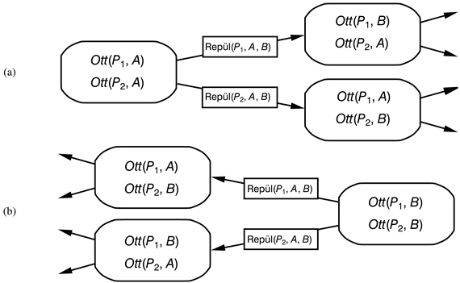

<?xml version="1.0" encoding="UTF-8" standalone="no"?>
<!DOCTYPE html PUBLIC "-//W3C//DTD XHTML 1.1//EN" "http://www.w3.org/TR/xhtml11/DTD/xhtml11.dtd">
<html xmlns="http://www.w3.org/1999/xhtml"><head><meta name="generator" content="DocBook XSL Stylesheets V1.76.1"/></head><body>

<h1 class="title"><a id="id641013"/>Tervkészítés állapottér-kereséssel</h1>

Most fordítsuk figyelmünket a tervkészítő algoritmusok felé. A legkézenfekvőbb megközelítés az állapottér-keresés. Mivel a tervkészítési problémák cselekvéseinek leírása tartalmazza az előfeltételeket és a következményeket, a keresés mindkét irányban végrehajtható: vagy előrefelé egy kiindulási állapotból, vagy visszafelé a céltól, amint azt a 11.5. ábra is mutatja. Mindezeken túl felhasználhatjuk az explicit cselekvés- és célreprezentációkat, hogy automatikusan hatékony heurisztikákat származtassunk.

<h2 class="title"><a id="id641020"/>Előrefelé keresés az állapottérben</h2>

Ez előrefelé kereséssel történő tervkészítés hasonlít a 3. fejezetben bemutatott problémamegoldó megközelítéshez. Ezt progresszív tervkészítésnek nevezzük, mert előrefelé haladva dolgozik. 

A feladat kiinduló állapotából indulva végignézzük a lehetséges cselekvéssorozatokat, amíg olyat nem találunk, ami a célállapothoz vezet. A tervkészítési probléma állapottér-keresési problémaként formalizálva a következő:

<ul class="itemizedlist"><li class="listitem">
A keresés <strong>kiindulási állapot</strong>a (<strong>initial state</strong>) megegyezik a tervkészítési probléma kiindulási állapotával. Általánosságban minden állapot pozitív alapliterálok egy halmaza; az itt nem szereplő literálok hamisak.
</li><li class="listitem">
Egy állapotban minden olyan <strong>cselekvés</strong> (<strong>action</strong>) alkalmazható, aminek az előfeltételei teljesülnek. A cselekvés végrehajtása után következő állapotot úgy állítjuk elő, hogy a következményrész pozitív literáljait hozzáadjuk, negatív literáljait pedig töröljük. (Elsőrendű logika esetén az előfeltételekből az egyesítőt alkalmazni kell a következményliterálokra.) Megjegyezzük, hogy annak következményeként, hogy egy explicit cselekvés reprezentációt használunk, egyetlen állapotátmenet-függvény működik az összes tervkészítő problémára.
</li><li class="listitem">
A <strong>célteszt</strong> (<strong>goal test</strong>) ellenőrzi, hogy az adott állapot kielégíti-e a tervkészítési probléma célját.
</li><li class="listitem">
A <strong>lépésköltség</strong> (<strong>step cost</strong>) minden cselekvésre tipikusan 1. Habár könnyű lenne a különböző cselekvésekhez különböző költségeket hozzárendelni, ezt a <code class="code">STRIPS</code> tervkészítőkben nagyon ritkán alkalmazzák.
</li></ul>

<a id="id641092"/>
<strong>11.5. ábra - A tervkészítés két megközelítése. (a) Előrefelé (progresszív) állapottér-keresés, a kiinduló állapotból indulva és a probléma cselekvéseit használva halad a cél felé. (b) Visszafelé (regressziós) állapottér-keresés: valószínűségi állapot keresés (lásd <a class="xref" href="ch03s06.md#ID_124_oldal">„Szenzor nélküli problémák”</a> részben) a célállapot(ok)ból indulva a cselekvések inverzét alkalmazva keresi visszafelé a kezdeti állapotot.</strong>

Emlékezzünk vissza, hogy a függvényszimbólumok hiányában a tervkészítési probléma állapottere véges, ezért teljes gráf keresési algoritmusok, mint például az A* keresés, egyben teljes tervkészítő algoritmusok is.

A tervkészítők kutatásának korai napjaitól (kb. 1961-től) egészen mostanáig (kb. 1998-ig) az a feltételezés élt, hogy az előrefelé kereső algoritmusok nem eléggé hatékonyak a gyakorlati alkalmazásra. Ma már, tekintsünk csak vissza a 11.1. alfejezetre, ezt nem nehéz megindokolni. Először is az előrefelé keresés nem foglalkozik a lényegtelen cselekvések problémájával, mivel minden állapotban minden alkalmazható cselekvést figyelembe vesz. Másodszor pedig ez a megközelítés gyorsan elakad egy jó heurisztika nélkül. Vegyük például a légi csomagszállítási problémát 10 repülőtérrel, egyenként 5-5 repülővel és 20 darab csomaggal. A cél, hogy az <em>A</em> repülőtér összes terhét a <em>B</em> repülőtérre szállítsuk. Van egy egyszerű megoldása a feladatnak: tegyük be mind a 20 csomagot az egyik <em>A</em>-beli repülőgépbe, ezzel repüljünk <em>B</em>-be, és ott rakodjunk ki. A megoldás megkeresése ellenben nagyon nehéz lehet, hiszen az átlagos elágazási faktor óriási: mind az 50 repülő 9 másik reptérre tud repülni, míg mind a 200 csomag kirakható (ha be volt rakva), vagy berakható a reptér bármelyik repülőjébe. Átlagosan mondjuk 1000 lehetséges cselekvés hajtható végre, így a keresési fában a kézenfekvő megoldás mélységéig közel 100041 csomópont van. Ebből nyilvánvaló, hogy egy megfelelő heurisztikára lesz szükség, hogy ezt a keresést hatékonnyá tegyük. A hátrafelé keresés áttekintése után néhány lehetséges heurisztikát mutatunk be.

<h2 class="title"><a id="id641130"/>Hátrafelé keresés az állapottérben</h2>

Az állapottérben történő hátrafelé keresést a kétirányú keresés egy részeként a 3. fejezetben röviden már bemutattuk. Ott megjegyeztük, hogy a hátrafelé keresés megvalósítása nagyon nehéz lehet, ha a célállapotokat az explicit megadás helyett megkötésekkel határozzuk meg. Nevezetesen nem mindig nyilvánvaló, hogy hogyan generáljuk le a célállapotok halmazának a lehetséges <strong>elődállapot</strong>ait (<strong>predecessor</strong>s). Látjuk majd, hogy a <code class="code">STRIPS</code> reprezentáció esetén ez meglehetősen egyszerű, mert az állapothalmazokat azokkal a literálokkal írhatjuk le, amelyeknek igaz értékűeknek kell lenni az adott állapotokban.

A hátrafelé keresés fő előnye az, hogy lehetővé teszi számunkra, hogy csak a <strong>releváns</strong> (<strong>relevant</strong>) cselekvéseket vegyük figyelembe. Egy cselekvés releváns egy konjunktív cél szempontjából, ha eléri a cél egy konjunktját. Például a 10-repülőteres légi csomagszállítási problémánk esetében a cél az, hogy a 20 csomag a <em>B</em> repülőtéren legyen, vagy pontosabban 

<code class="code"><em>Ott</em>(<em>C</em>1, <em>B</em>) ∧ <em>Ott</em>(<em>C</em>2, <em>B</em>) ∧ … ∧ <em>Ott</em>(<em>C</em>20, <em>B</em>)</code>

Vegyük az <em>Ott</em>(<em>C</em>1, <em>B</em>) literált. Hátrafelé dolgozva, olyan cselekvéseket kereshetünk, melyeknek ez a következménye. Ilyen csak egy van: <em>Kirakodás</em>(<em>C</em>1, <em>p</em>, <em>B</em>), ahol a <em>p</em> repülőgép meghatározatlan. 

Vegyük észre, hogy számos <em>irreleváns</em> cselekvés is van, ami szintén a célállapotra vezet. Például elrepíthetünk egy üres gépet a <em>JFK</em> repülőtérről (John Fitzgerald Kennedy repülőtér New Yorkban) az <em>SFO</em>-ra (San Francisco repülőtere), ami a célállapothoz vezet egy olyan elődállapotból, melyben a repülőgép a <em>JFK</em>-n van, és minden célfeltétel teljesül. Egy hátrafelé keresés, ami megengedi a hatástalan cselekvéseket még teljes, de sokkal kevésbé hatékony. Ha létezik megoldás, akkor azt egy olyan hátrafelé keresés is megtalálja, amely csak releváns cselekvéseket enged meg. A hátrafelé keresés szűkítése a releváns cselekvésekre, gyakran jóval alacsonyabb elágazási tényezőt eredményez, mint az előrefelé keresés. Például a légi szállítási problémánk esetén a kiindulási állapotból előrefelé közel 1000 cselekvés hajtható végre, míg a célból visszafelé indulva mindössze 20.

A visszafelé keresést <strong>regresszió</strong>s (<strong>regression</strong>) tervkészítésnek is nevezik. A regressziós keresés meghatározó kérdése a következő: melyek azok az állapotok, amelyekből egy adott cselekvés a célhoz vezet? Ezen állapotok leírásának számítását a cél adott állapoton keresztüli <strong>regresszálás</strong>ának (<strong>regressing</strong>) nevezzük. Hogy lássuk ennek menetét, vegyük a légi szállítási feladatot. Adott a cél az

<code class="code"><em>Ott</em>(<em>C</em>1, <em>B</em>) ∧ <em>Ott</em>(<em>C</em>2, <em>B</em>) ∧ … ∧ <em>Ott</em>(<em>C</em>20, <em>B</em>)</code>

és a releváns cselekvés<em> a Kirakodás</em>(<em>C</em>1, <em>p</em>, <em>B</em>), ami az első literált adja. A cselekvés csak akkor működik, ha az előfeltételei teljesülnek. Ebből kifolyólag az elődállapotnak tartalmaznia kell a <em>Benne</em>(<em>C</em>1, <em>p</em>) ∧ <em>Ott</em>(<em>p</em>, <em>B</em>) előfeltételeket. Mindezeken túl az <em>Ott</em>(<em>C</em>1, <em>B</em>) részcél nem lehet igaz a megelőző állapotban.[<a id="id641383" href="#ftn.id641383" class="footnote">114</a>] Így a megelőző állapot leírása az alábbi:

<code class="code"><em>Benne</em>(<em>C</em>1, <em>p</em>) ∧ <em>Ott</em>(<em>p</em>, <em>B</em>) ∧ <em>Ott</em>(<em>C</em>2, <em>B</em>) ∧ … ∧ <em>Ott</em>(<em>C</em>20, <em>B</em>)</code>

Ennek tetejébe, ha elvárjuk, hogy egy cselekvés kielégítsen egy literált, azt is biztosítanunk kell, hogy nem <em>ront el</em> egy másikat. Az olyan cselekvést, ami megfelel ennek az elvárásnak <strong>konzisztens</strong>nek (<strong>consistent</strong>) nevezzük. Például a <em>Berakodás</em>(<em>C</em>2, <em>p</em>) cselekvés nem lenne konzisztens az aktuális céllal, mert negálja az <em>Ott</em>(<em>C</em>2, <em>B</em>) literált.

Most, hogy a relevanciát és a konzisztenciát definiáltuk, megadhatunk egy általános módszert a hátrafelé keresés elődállapotának kereséséhez. Adott egy <em>G</em> cél leírása. Legyen az <em>A</em> cselekvés releváns és konzisztens. A megfelelő elődállapot a következő:

<ul class="itemizedlist"><li class="listitem">
Az <em>A</em> minden pozitív következményét, ami szerepel <em>G</em>-ben, töröljük.
</li><li class="listitem">
Az <em>A</em> minden, még nem szereplő előfeltételét hozzáadjuk.
</li></ul>

A standard keresési algoritmusok bármelyike felhasználható a keresésre. A leállási feltétel, hogy a generált elődállapot leírását a keresés kiindulási állapota kielégítse. Az elsőrendű esetben, ehhez néhány változó behelyettesítésére is szükség lehet az elődállapotának leírásában. Például az előző bekezdés elődállapotának leírását a

<code class="code"><em>Benne</em>(<em>C</em>1, <em>P</em>12) ∧ <em>Ott</em>(<em>P</em>12, <em>B</em>) ∧ <em>Ott</em>(<em>C</em>2, <em>B</em>) ∧ … ∧ <em>Ott</em>(<em>C</em>20, <em>B</em>)</code>

kiindulási állapot a {<em>p</em>/<em>P</em>12} behelyettesítéssel teljesíti. A behelyettesítéseket arra a cselekvésre kell végrehajtani, ami az állapottól a célhoz vezet, így eredményezve a [<em>Kirakodás</em>(<em>C</em>1, <em>P</em>12, <em>B</em>)] megoldást.

<h2 class="title"><a id="id641610"/>Állapottér-keresési heurisztikák</h2>

Sem az előre-, sem pedig a hátrafelé keresés nem hatékony egy jó heurisztika nélkül. Emlékezzünk vissza a 4. fejezetből, hogy egy heurisztikus függvény egy állapot célállapottól való távolságát becsli; a <code class="code">STRIPS</code> esetén minden cselekvés költsége 1, így a távolság az alkalmazandó cselekvések száma. Az alapötlet, hogy nézzük a cselekvés következményeit és a célokat, és becsüljük meg, hogy hány lépésre van szükség a célok elérésére. A pontos szám meghatározása NP-teljes probléma, de a legtöbb esetben találhatók kellően pontos becslők, melyek nem nagyon számításigényesek. Szintén képesek lehetünk egy <strong>elfogadható</strong> (<strong>admissable</strong>) heurisztika származtatására, azaz olyanra, ami nem becsül túl. Ez az A* kereséssel együtt használható  optimális megoldások megkeresésére.

Két megközelítést lehet kipróbálni. Az egyik, hogy a megadott feladatleírásból egy <strong>relaxált problémá</strong>t (<strong>relaxed problem</strong>) származtatunk, ahogy azt a 4. fejezetben bemutattuk. A relaxált problémára (ami várhatóan könnyen megoldható) adott optimális megoldás költsége elfogadható heurisztikát ad az eredeti problémára. A második megközelítés során feltételezzük, hogy a tiszta „oszd meg és uralkodj” algoritmus működni fog. Ezt nevezzük a <strong>részcélfüggetlenség</strong> (<strong>subgoal independence</strong>) feltételezésnek: a részcélok konjunkciójának megoldási költségét, az egymástól <em>függetlenül</em> megoldott részcélok költségeinek összegével becsüljük. A részcélfüggetlenség feltételezés lehet optimista vagy pesszimista. Akkor optimista, hogyha vannak negatív kölcsönhatások a részcélokhoz készített résztervek között (például amikor az egyik részterv egy cselekvése töröl egy célt, melyet egy másik részterv ért el). Akkor pesszimista és egyben elfogadhatatlan is, ha a résztervek redundáns cselekvéseket tartalmaznak (például két cselekvés eggyel helyettesíthető az összefésült tervben).

Vizsgáljuk meg, hogyan származtathatunk relaxált tervkészítési problémákat. Mivel az előfeltételek és a következmények explicit megadásai rendelkezésre állnak, az eljárás ezeket a reprezentációkat módosítja. (Vessük össze ezt a megközelítést a keresési feladatokkal, ahol az állapotátmenet-függvény egy fekete doboz.) A legegyszerűbb ötlet, hogy lazítsuk a problémát úgy, hogy <em>eltávolítjuk az összes előfeltételt</em> a cselekvésekből. Ekkor minden cselekvés mindig alkalmazhatóvá válik, és minden literál elérhető egy lépésben (ha van alkalmazható cselekvés, egyébként a cél elérése lehetetlen). Úgy tűnhet, ez azt jelenti, hogy a célok konjunkciójához vezető lépésszám azonos a kielégítetlen célliterálok számával, de nem egészen; (1) lehet két cselekvés, melyek kölcsönösen törlik a másik által teljesített célliterált, (2) néhány cselekvés több célt is elérhet. Ha kombináljuk a relaxált problémát és a részcél függetlenségi feltételezést, mindkét problémát kiküszöböltnek vehetjük, és az előálló heurisztika pontosan a még kielégítetlen célok száma. 

Sokszor pontosabb heurisztika nyerhető, ha legalább a több célt kielégítő cselekvések pozitív kölcsönhatásait figyelembe vesszük. Először tovább relaxáljuk a problémát azáltal, hogy <em>eltávolítjuk a negatív következményeket</em> (lásd 11.6. feladat). Ezután kiszámítjuk, hogy mennyi az a minimális cselekvésszám, melyek pozitív következményeinek uniója kielégíti a célt. Vegyük például a

<code class="code"><em>Cél</em>(<em>A</em> ∧ <em>B </em>∧ <em>C</em>)</code>

<code class="code"><em>Cselekvés</em>(<em>X</em>, Következmény:<em> A</em> ∧ <em>P</em>)</code>

<code class="code"><em>Cselekvés</em>(<em>Y</em>, Következmény:<em> B </em>∧ <em>C </em>∧ <em>Q</em>)</code>

<code class="code"><em>Cselekvés</em>(<em>Z</em>, Következmény:<em> B</em> ∧ <em>P </em>∧ <em>Q</em>)</code>

A minimális halmaz az {<em>X</em>, <em>Y</em>} cselekvés, ami az {<em>A</em>, <em>B</em>, <em>C</em>} célt kielégíti, így a fedőhalmaz-heurisztika szerinti költség 2. Ez javít a részcél függetlenség feltételezésen, ami 3-as költséget adna. Egyetlen apró probléma van: a fedőhalmaz probléma NP-teljes. Az egyszerű fedőhalmaz-keresési algoritmus garantáltan visszaad egy értéket, ami egy log<em> n</em>-es faktor pontossággal az igazi minimumérték, ahol <em>n</em> a cél literáljainak száma, és a gyakorlatban rendszerint ennél sokkal pontosabb. Sajnos a mohó algoritmus elveszíti a heurisztika elfogadhatóságának garanciáját.

Az is lehetséges, hogy a relaxált problémát a negatív következmények eltávolításával állítjuk elő anélkül, hogy az előfeltételeket elhagynánk. Ez annyit tesz, hogy ha egy cselekvés következménye <em>A </em>∧ ¬<em>B</em> az eredeti problémában, akkor <em>A</em> a relaxált problémában. Ez annyit tesz, hogy nem kell foglalkoznunk a résztervek közötti negatív kölcsönhatásokkal, mert egyetlen cselekvés sem törölhet egy másik által előállított literált. Az így előálló relaxált feladat megoldásának költsége az <strong>üres-törlési-lista</strong> (<strong>empty-delete-list</strong>) heurisztikát adja. A heurisztika meglehetősen pontos, de kiszámítása egy (egyszerű) tervkészítő algoritmus futtatását igényli. A gyakorlatban a relaxált probléma megoldása elég gyors ahhoz, hogy megérje alkalmazni.

Az itt bemutatott heurisztika mind a progresszív (előrefelé), mind pedig a regresszív (hátrafelé) irányba használható. A könyv írásának pillanatában az üres-törlési-lista heurisztikát használó előrefelé keresők a listavezetők. Ez valószínűleg változik, ahogy újabb heurisztikák és keresési technikák jelennek meg. Mivel a tervkészítés exponenciális komplexitású,[<a id="id641796" href="#ftn.id641796" class="footnote">115</a>] nincs olyan algoritmus, amely minden problémára hatékony lesz, de számos gyakorlati feladat oldható meg ezen fejezet heurisztikáival – sokkal több, mint ami néhány éve megoldható volt.

 

[<a id="ftn.id641383" href="#id641383" class="para">114</a>]  Ha a részcél igaz lenne az elődállapotban, akkor a cselekvés még mindig a célállapothoz vezetne. Ellenben az ilyen cselekvések hatástalanok (irrelevánsak), mivel nem <em>teszik</em> igazzá a célt.

[<a id="ftn.id641796" href="#id641796" class="para">115</a>]  Technikailag a <code class="code">STRIPS</code>-alapú tervkészítés PSPACE-teljes, kivéve, ha a cselekvéseknek csak pozitív előfeltételei vannak egy következmény literállal (Bylander, 1994).

</body></html>
