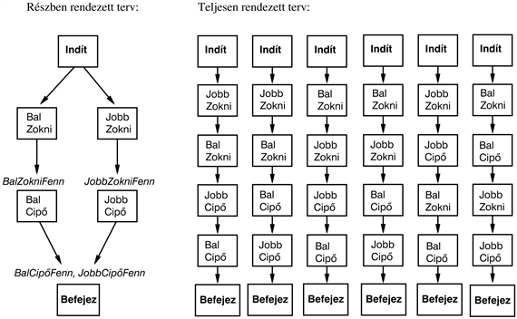
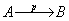
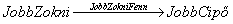
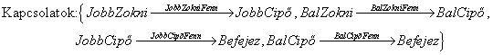
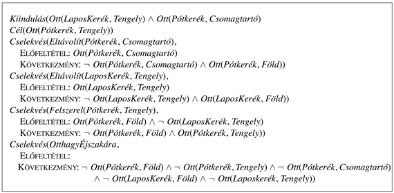
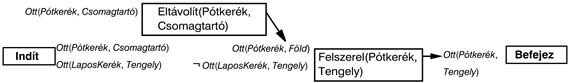
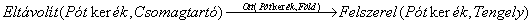
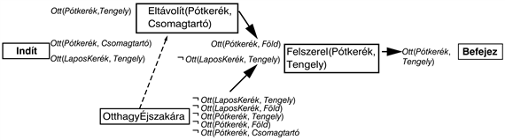
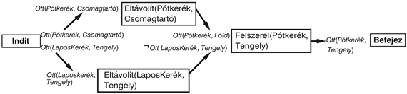
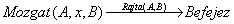

<?xml version="1.0" encoding="UTF-8" standalone="no"?>

<html xmlns="http://www.w3.org/1999/xhtml"><head><meta name="generator" content="DocBook XSL Stylesheets V1.76.1"/></head><body>

<h1 class="title"><a id="id641806"/>Részben rendezett tervkészítés</h1>

Az előre- és hátrafelé keresés a <em>teljesen rendezett</em> terv keresés speciális fajtái. Ezek a cselekvéseknek csak szigorúan lineáris sorozatait tárják fel, melyek közvetlenül kapcsolódnak a kiinduláshoz vagy a célhoz. Ez annyit tesz, hogy nem használhatják ki a problémadekompozíció lehetőségeit. Ahelyett hogy a részproblémákon külön dolgoznának, mindig arról kell dönteniük, hogy hogyan sorrendezzék a részproblémák cselekvéseinek összességét. Előnyösebb lenne egy olyan megközelítés, ami több részcélon dolgozik függetlenül, ezeket több résztervvel megoldja, majd összerakja a részterveket.

Egy ilyen megközelítésnek megvan az az előnye is, hogy rugalmas a terv <em>összeállításának</em> sorrendjében. A tervkészítő így nem kényszerül arra, hogy a lépéseken időrendi sorrendben dolgozzon, hanem először inkább a „nyilvánvaló” vagy „fontos” döntéseken dolgozhat. Például egy Berkeleyben lévő tervkészítő ágens, amely Monte Carlóba igyekszik, először egy San Francisco–Párizs járatot vizsgál meg, majd amikor ismeri a pontos indulási és érkezési dátumokat, foglalkozhat a reptérre kijutás, illetve az onnan továbbjutás problémájával.

Azt az általános stratégiát, mely szerint egy választást késleltetünk egy keresés során, <strong>legkisebb megkötés</strong> (<strong>least commitment</strong>) stratégiának nevezzük. A legkisebb megkötésnek nincs formális definíciója, és nyilvánvaló, hogy valamennyi megkötés szükséges, különben a keresés nem haladna. Az informális definíció ellenére a legkisebb megkötés nagyon hasznos megközelítés annak meghatározására, hogy a döntéseket mikor kell meghozni egy keresési problémában. Az első példánk jóval egyszerűbb, mint egy nyaralás megtervezése. Vegyük a cipőfelvétel egyszerű esetét. Ezt formálisan a következő tervkészítési problémával írhatjuk le:

<code class="code"><em>Cél</em>(<em>JobbCipőFenn </em>∧ <em>BalCipőFenn</em>)</code>

<code class="code"><em>Kiindulás</em>()</code>

<code class="code"><em>Cselekvés</em>(<em>JobbCipő</em>, Előfeltétel: <em>JobbZokniFenn</em>, Következmény:<em> JobbCipőFenn</em>)</code>

<code class="code"><em>Cselekvés</em>(<em>JobbZokni</em>, Következmény:<em> JobbZokniFenn</em>)</code>

<code class="code"><em>Cselekvés</em>(<em>BalCipő</em>, Előfeltétel: <em>BalZokniFenn</em>, Következmény:<em> BalCipőFenn</em>)</code>

<code class="code"><em>Cselekvés</em>(<em>BalZokni</em>, Következmény:<em> BalZokniFenn</em>)</code>

A tervkészítőnek két cselekvéssorozattal kell előállnia, a <em>JobbZokni-</em>t a <em>JobbCipő</em> követi, hogy a cél első konjunktját elérjük és a <em>BalZokni-</em>t a <em>BalCipő</em> követi a második konjunkthoz. A két cselekvéssorozat kombinálható, hogy teljes tervet nyerjünk. Így a tervkészítő a két részsorozatot egymástól függetlenül kezelheti anélkül, hogy felállítana bármi megkötést arra, hogy az egyik sorozat egy cselekvése a másikéhoz képest előbb vagy később következik. Bármely olyan tervkészítő algoritmust, ami két cselekvést be tud illeszteni egy tervbe anélkül, hogy meghatározná azok sorrendjét, <strong>részben rendezett tervkészítő</strong>nek nevezünk (<strong>partial-order planner</strong>). A 11.6. ábra a cipő és zokni felvételére készített részben rendezett tervet szemlélteti. Vegyük észre, hogy a megoldást a cselekvések gráfja ábrázolja, nem egy szekvencia. Érdemes megfigyelni az <em>Indít</em> és a <em>Befejez</em> „technikai” cselekvéseket, melyek a terv kezdetét, illetve végét jelölik. Ezeket cselekvésnek nevezni egyszerűsíti a dolgokat, mert így a terv minden lépése egy cselekvés. A részben rendezett megoldás hat teljesen rendezett megoldásnak felel meg, melyek mindegyike a részben rendezett megoldásnak egy <strong>sorba rendezése</strong> (<strong>linearization</strong>).

<a id="id642815"/>
<strong>11.6. ábra - Egy részben rendezett terv a zokni és a cipő felvételéhez, és a hat lehetséges sorba rendezés a teljesen rendezett tervhez</strong>

A részben rendezett tervkészítés megvalósítható, mint egy keresés a részben rendezett tervek terében. (Ezentúl ezeket egyszerűen csak „terv”-nek nevezzük.) Egy üres tervvel indulunk. Ezután a terv finomításának módjait keressük egészen addig, míg elő nem állunk a teljes tervvel, ami megoldása a problémának. A cselekvések ebben a keresésben nem a való világ cselekvései, hanem terveken végrehajtott műveletek: egy lépés hozzáadása a tervhez, a cselekvésekhez egy sorrend rendelése, ami egy cselekvést egy másik elé helyez és így tovább.

A továbbiakban definiálni fogjuk az RRT algoritmust a részben rendezett tervkészítéshez. Hagyományosan az RRT-t mint egy önálló programot szokás bemutatni, ehelyett mi a részben rendezett tervkészítést, mint a keresési probléma egy példányát fogjuk megfogalmazni. Ez lehetővé teszi, hogy az alkalmazható tervfinomító lépésekre koncentráljunk ahelyett, hogy azt vizsgálnánk, hogyan térképezi fel a keresési teret az algoritmus. Valójában, ha a keresési feladatot megfogalmaztuk a nem informált vagy heurisztikus keresési módszerek széles választéka áll rendelkezésre.

Emlékezzünk vissza, hogy a keresésünk állapotai (többnyire még befejezetlen) tervek lesznek. Hogy elkerüljük a valós cselekvésekkel való keveredést, itt tervekről és nem állapotokról fogunk beszélni. Minden terv a következő négy komponensből áll, ahol az első kettő a terv lépéseit definiálja, míg az utolsó kettő naplózásra szolgál, hogy abból meghatározzuk, hogyan bővíthetők a tervek:

<ul class="itemizedlist"><li class="listitem">
<strong>Cselekvés</strong>ek (<strong>action</strong>s) halmaza, amelyek a terv lépéseit adják. Ezeket a tervkészítési probléma cselekvéshalmazából vesszük. Egy „üres” terv csak az <em>Indít</em> és a <em>Befejez </em>cselekvéseket tartalmazza. Az <em>Indít</em>-nak nincsenek előfeltételei, míg a következményrésze a tervkészítési feladat kiindulási állapotának literáljait tartalmazza. A <em>Befejez </em>cselekvésnek nincsen következmény része, míg előfeltételei megegyeznek a célállapot literáljaival.
</li><li class="listitem">
<strong>Rendezési kényszer</strong>ek (<strong>ordering constraint</strong>s). Minden rendezési kényszer <em>A</em> ≺ <em>B</em> alakú, amit „<em>B</em> előtt <em>A</em>”-nak olvasunk, és azt jelenti, hogy az <em>A</em>-t valamikor a <em>B</em> előtt kell végrehajtani, de nem feltétlenül közvetlen előtte. A rendezési kényszerek egy megfelelő részben rendezést kell leírjanak. Bármilyen ciklus (mint az<em> A</em> ≺ <em>B </em>és a <em>B</em> ≺ <em>A</em>) ellentmondást jelent, ezért olyan rendezési kényszer nem adható a tervhez, amely ciklust hozna létre.
</li><li class="listitem">
<strong>Okozati kapcsolatok</strong> (<strong>causal link</strong>s). Az <em>A</em> és <em>B</em> cselekvések közötti okozati kapcsolatot -vel jelöljük és úgy olvassuk, hogy „<em>A</em> teljesíti <em>p</em>-t <em>B</em>-hez”. Például a  okozati kapcsolat jelentése, hogy a <em>JobbZokniFenn</em> egy következménye a <em>JobbZokni</em> cselekvésnek és előfeltétele<em> </em>a <em>JobbCipő</em>-nek. Tartalmazza azt a megkötést is, hogy a <em>JobbZokniFenn</em>-nek igaznak kell maradnia a <em>JobbZokni</em> cselekvéstől a <em>JobbCipő</em> cselekvésig. Más szavakkal, a terv nem mindig bővíthető egy új <em>C</em> cselekvéssel, ami <strong>ütközik</strong> egy okozati kapcsolattal. Egy <em>C</em> cselekvés ütközik az -vel, ha <em>C</em> következménye a ¬<em>p</em>, és ha <em>C</em> az <em>A</em> után és <em>B</em> előtt jöhet (a rendezési kényszereknek megfelelően). Néhány szerző az okozati kapcsolatokat <strong>védett tartomány</strong>oknak (<strong>protection interval</strong>s) nevezi, mert az  megvédi <em>p</em>-t a negálástól az <em>A</em>–<em>B</em> intervallumban.
</li><li class="listitem">
<strong>Nyitott előfeltétel</strong>ek (<strong>open precondition</strong>s). Egy előfeltétel nyitott, ha nem teljesül a terv egy akciójának hatására. A tervkészítők feladata, hogy a nyitott előfeltételek halmazát üres halmazra csökkentse, ellentmondások bevezetése nélkül.
</li></ul>

Például a 11.6. ábrán bemutatott teljes terv a következő komponenseket tartalmazza (nem tüntettük fel a rendezési kényszereket, amelyek minden cselekvést az <em>Indít</em> után és a <em>Befejez</em> elé helyeznek):

<code class="code">Cselekvések:{<em>JobbZokni</em>,<em> JobbCipő</em>,<em> BalZokni</em>,<em> BalCipő</em>,<em> Indít</em>,<em> Befejez</em>}</code>

<code class="code">Rendezések: {<em>JobbZokni</em> ≺ <em>JobbCipő</em>,<em> BalZokni</em> ≺ <em>BalCipő</em>}</code>

<code class="code"></code>

<code class="code">Nyitott előfeltételek: {}</code>

<h3 class="title">Fontos</h3>
<strong>Konzisztens terv</strong>nek (<strong>consistent plan</strong>) nevezzük azt a tervet, amelyben nincsenek ciklusok a rendezési megkötésekben és nincsenek ellentmondások az okozati kapcsolatokkal. Egy konzisztens terv, mely nyitott előfeltételektől mentes, a <strong>megoldás </strong>(<strong>solution</strong>). Rövid gondolkodással belátható: <em>egy részben rendezett megoldás minden sorba rendezése egy teljesen rendezett megoldás</em>,<em> melynek végrehajtása az induló állapotból egy célállapotra vezet. </em>Ez annyit tesz, hogy a „terv végrehajtását” a teljesen rendezett tervekről kiterjeszthetjük a részben rendezett tervekre. Egy részben rendezett terv végrehajtása során ismétlődően mindig választunk egy következő cselekvést, a lehetséges következő cselekvések <em>bármelyikét</em>. A 12. fejezetben látni fogjuk, hogy az ágens számára a terv végrehajtásának rugalmassága nagyon hasznos lehet, ha a környezet nem az elvártaknak megfelelően működik. A rugalmas sorrendezés egyszerűsíti a kisebb tervek összekombinálását nagyobbakká, mert minden részterv átrendezheti a cselekvéseinek sorrendjét, hogy elkerülje a más tervekkel való ütközést.

Most már készen állunk arra, hogy formalizáljuk azt a keresési problémát, amit az RRT megold. Egy olyan formalizálással kezdünk, ami az ítéletlogikai tervkészítési problémákra alkalmas, az elsőrendű logikai megoldással járó komplikációkat későbbre hagyjuk. Mint rendszerint, a definíció tartalmazza a kiinduló állapotot, a cselekvéseket és a céltesztet.

<ul class="itemizedlist"><li class="listitem">
A kiindulási terv egy <em>Indít</em> és egy <em>Befejez </em>cselekvést, egy <em>Indít </em>≺ <em>Befejez</em> rendezést tartalmaz, és nincsenek okozati kapcsolatok. A <em>Befejez </em>minden előfeltétele nyitott.
</li><li class="listitem">
Az állapotátmenet-függvény önkényesen kiválasztja <em>B</em> egy <em>p</em> nyitott előfeltételét és legenerál egy következő tervet egy <em>A</em> cselekvés minden olyan lehetséges konzisztens megválasztásához, mely teljesíti <em>p</em>-t. A konzisztenciát a következőképp biztosítjuk:

<ol class="orderedlist"><li class="listitem">
Az  okozati kapcsolatot és az <em>A</em> ≺ <em>B</em> rendezési megkötést hozzáadjuk a tervhez. Az <em>A</em> cselekvés lehet a terv egy már létező vagy egy új cselekvése. Amennyiben új, hozzáadjuk a tervhez az <em>Indít </em>≺ <em>A</em> és az <em>A</em> ≺ <em>Befejez</em>  megkötésekkel.
</li><li class="listitem">
Feloldunk minden konfliktust, az új okozati kapcsolat és az összes létező cselekvés, valamint az <em>A</em> cselekvés (ha új) és minden létező okozati kapcsolat között. Egy az  és <em>C</em> között fennálló konfliktust azáltal oldunk fel, hogy <em>C</em>-t valamikor kívül helyezzük a védett intervallumon a <em>B</em> ≺ <em>C</em> vagy a <em>C </em>≺ <em>A </em>hozzáadásával. Amennyiben konzisztens tervet adnak, beszúrjuk a követő állapotokat, valamelyikhez vagy akár mindkettőhöz.
</li></ol>
</li><li class="listitem">
A célteszt ellenőrzi, hogy a terv megoldása-e az eredeti tervkészítési problémának. Mivel csak konzisztens terveket állítunk elő, a céltesztnek csak azt kell ellenőrizni, hogy vannak-e nem nyitott előfeltételek.
</li></ul>

Emlékezzünk, hogy keresési algoritmus által vizsgált cselekvések ebben a felírásban sokkal inkább tervfinomító lépések, mint valós cselekvések a feladattérből. Az út költsége ezért szigorú értelembe véve irreleváns, hiszen az egyetlen ami fontos, az azon terv valós cselekvéseinek költsége, amire ez az út vezetett. Mindazonáltal <em>lehetséges</em> egy útvonalköltség-függvény specifikálása, ami a valós terv költségeit tükrözi: minden valós cselekvésnek a tervhez való hozzáadását egységnyi költséggel, míg a finomító lépéseket 0 költséggel vesszük figyelembe. Így <em>g</em>(<em>n</em>), ahol <em>n</em> a terv, egyenlő lesz a tervben található valós cselekvések számával. Egy heurisztikus <em>h</em>(<em>n</em>) becslés szintén alkalmazható.

Első ránézésre azt gondolhatjuk, hogy az állapotátmenet-függvénynek <em>minden</em> nyitott <em>p</em>-hez tartalmaznia kellene egy következő állapotot, nem csak egyhez. Ez azonban, redundáns lenne és nem lenne hatékony, ugyanazon okból, amiért a kényszerkielégítési algoritmusok nem szúrnak be minden lehetséges változóhoz utódot: a nyitott előfeltételek kezelési sorrendje (csakúgy, mint a kényszerkielégítési probléma változóinak kezelési sorrendje) kommutatív. (Lásd <a class="xref" href="ch05s02.md#ID_187_oldal">„A visszalépéses keresés alkalmazása kényszerkielégítési problémákra”</a> részben.) Így tetszőleges sorrendet választhatunk, és az algoritmusaink még mindig teljesek. A helyes rendezés megválasztása gyorsabb kereséshez vezethet, de minden sorrendezés ugyanazokra a megoldásjelöltekre vezet.

<h2 class="title"><a id="id643337"/>Példa a részben rendezett tervkészítésre</h2>

<a id="ID_468_oldal"/>
Most nézzük meg, hogy az RRT hogyan oldja meg a 11.1. alfejezetben szereplő pótkerék problémát. A probléma a leírását a 11.7. ábrán megismételjük.

<a id="id643347"/>
<strong>11.7. ábra - Az egyszerű kerékcsere probléma</strong>

A megoldás keresése egy kezdeti tervből indul, ami egy <em>Indít</em> cselekvést tartalmaz az  <em>Ott</em>(<em>Pótkerék</em>, <em>Csomagtartó</em>) ∧ <em>Ott</em>(<em>LaposKerék</em>, <em>Tengely</em>)<em> </em>következménnyel és egy <em>Befejez</em> cselekvést az <em>Ott</em>(<em>Pótkerék</em>, <em>Tengely</em>) előfeltétellel. Ezután követő állapotokat állítunk elő úgy, hogy egy nyitott előfeltételt választunk a munkához (visszavonhatatlanul), majd választunk az ehhez vezető lehetséges cselekvések közül. Most nem foglalkozunk a heurisztikákkal, amik segíthetik ezt a döntést; látszólag véletlenszerű döntést hozunk. Az események sorrendje a következő:

<ol class="orderedlist"><li class="listitem">
Vegyük az egyetlen nyitott előfeltételt, a <em>Befejez</em> cselekvés <em>Ott</em>(<em>Pótkerék</em>, <em>Tengely</em>) feltételét. Válasszuk ki az egyetlen alkalmazható cselekvést, a<em> Felszerel</em>(<em>Pótkerék</em>, <em>Tengely</em>)-t.
</li><li class="listitem">
Vegyük a <em>Felszerel</em>(<em>Pótkerék</em>, <em>Tengely</em>)<em> </em>cselekvés <em>Ott</em>(<em>Pótkerék</em>, <em>Föld</em>)<em> </em>előfeltételét. Válasszuk az <em>Eltávolít</em>(<em>Pótkerék</em>, <em>Csomagtartó</em>)<em> </em>cselekvést, ami az egyetlen alkalmazható cselekvés az előfeltétel biztosításához. A végső terv a 11.8. ábrán látható.
</li></ol>

<a id="id643481"/>
<strong>11.8. ábra - A nem teljes részben rendezett terv a kerékcsere problémához, miután megválasztottuk a cselekvéseket az első két nyitott előfeltételhez. A dobozok cselekvéseket testesítenek meg, a bal oldalon az előfeltételekkel, a jobb oldalon pedig a következményekkel. (Az <em>Indít</em> cselekvést kivéve a következményeket elhagytuk.) A fekete nyilak az okozati kapcsolatokat mutatják, melyek a nyíl fejénél szereplő állítást védik.</strong>

<ol class="orderedlist"><li class="listitem">
	Vegyük a <em>Felszerel</em>(<em>Pótkerék</em>, <em>Tengely</em>) cselekvés ¬<em>Ott</em>(<em>LaposKerék</em>, <em>Tengely</em>) előfeltételét. Hogy ellenkezzünk egy kicsit, válasszuk az <em>OtthagyÉjszakára</em> cselekvést, a kézenfekvő <em>Eltávolít</em>(<em>LaposKerék</em>, <em>Tengely</em>) helyett. Vegyük észre, hogy az <em>OtthagyÉjszakára</em> cselekvésnek szintén következménye a ¬<em>Ott</em>(<em>Pótkerék</em>, <em>Föld</em>), ami ütközik az
</li></ol>

	okozati kapcsolattal. Hogy feloldjuk ezt az ütközést, egy rendezési megkötést illesztünk be, ami az <em>OtthagyÉjszakára</em> cselekvést az <em>Eltávolít</em>(<em>Pótkerék</em>, <em>Csomagtartó</em>) elé rendeli. Az így előálló terv a 11.9. ábrán látható. (Miért oldja ez fel az ütközést és miért nincs erre más lehetőség?)

<ol class="orderedlist"><li class="listitem">
	Most az egyetlen fennmaradó nyitott előfeltétel az <em>Ott</em>(<em>Pótkerék</em>, <em>Csomagtartó</em>), ami az <em>Eltávolít</em>(<em>Pótkerék</em>, <em>Csomagtartó</em>) cselekvés előfeltétele. Az egyetlen cselekvés, ami ezt elérheti, a meglévő <em>Indít</em> cselekvés, de az <em>Indít</em> és az <em>Eltávolít</em>(<em>Pótkerék</em>, <em>Csomagtartó</em>) közötti okozati kapcsolat ütközik az <em>OtthagyÉjszakára</em> cselekvés ¬<em>Ott</em>(<em>Pótkerék</em>, <em>Csomagtartó</em>) következményével. Most nincs mód arra, hogy feloldjuk az ütközést az <em>OtthagyÉjszakára</em> cselekvéssel: nem sorolhatjuk az <em>Indít</em> elé (mert semmi nem kerülhet az <em>Indít</em> elé), és nem rendelhető az <em>Eltávolít</em>(<em>Pótkerék</em>, <em>Csomagtartó</em>) után (mert már van egy rendezés, ami elé helyezi). Ezért muszáj visszalépnünk, törölnünk az <em>Eltávolít</em>(<em>Pótkerék</em>, <em>Csomagtartó</em>) cselekvést és a két utolsó okozati kapcsolatot, és visszalépnünk a 11.8. ábrán bemutatott állapothoz. 
</li></ol>

<a id="id643677"/>
<strong>11.9. ábra - A terv alakulása, az <em>OtthagyÉjszakára</em> választása után, amit a ¬O<em>tt</em>(<em>LaposKerék</em>, <em>Tengely</em>)<em> </em>eléréséhez választottunk. Hogy elkerüljük az ütközést az <em>Ott</em>(<em>Pótkerék</em>, <em>Csomagtartó</em>)-t védő, az <em>Eltávolít</em>(<em>Pótkerék</em>, <em>Csomagtartó</em>)-ból induló okozati kapcsolattal, az <em>OtthagyÉjszakára</em> cselekvést egy rendezési megkötéssel az <em>Eltávolít</em>(<em>Pótkerék</em>, <em>Csomagtartó</em>) elé helyeztük, amit a szaggatott nyíllal jelöltünk.</strong>

Összefoglalva, a tervkészítő bebizonyította, hogy az <em>OtthagyÉjszakára</em> nem használható fel kerékcserére.

<ol class="orderedlist"><li class="listitem">
	Vegyük újra a <em>Felszerel</em>(<em>Pótkerék</em>, <em>Tengely</em>) cselekvés ¬<em>Ott</em>(<em>LaposKerék</em>, <em>Tengely</em>) előfeltételét. Ez alkalommal válasszuk az <em>Eltávolít</em>(<em>LaposKerék</em>, <em>Tengely</em>) cselekvést. 
</li><li class="listitem">
	Vegyük újra az <em>Eltávolít</em>(<em>Pótkerék</em>, <em>Csomagtartó</em>) cselekvés <em>Ott</em>(<em>Pótkerék</em>, <em>Csomagtartó</em>) előfeltételét, és válasszuk az <em>Indít</em> cselekvést, hogy ezt elérjük. Ez alkalommal nincsenek ütközések.
</li><li class="listitem">
	Vegyük az <em>Eltávolít</em>(<em>LaposKerék</em>, <em>Tengely</em> cselekvés<em> Ott</em>(<em>LaposKerék</em>, <em>Tengely</em>) előfeltételét, valamint ennek eléréséhez az <em>Indít</em> cselekvést. Ez egy teljes és konzisztens tervet ad, vagy más szavakkal egy megoldást, amint azt a 11.10. ábra mutatja.
</li></ol>

<a id="id643847"/>
<strong>11.10. ábra - A kerékcsere probléma végső megoldása. Vegyük észre, hogy az <em>Eltávolít</em>(<em>Pótkerék</em>, <em>Csomagtartó</em>) és az <em>Eltávolít</em>(<em>LaposKerék</em>, <em>Tengely</em>) tetszőleges sorrendben végrehajtható a <em>Felszerel</em>(<em>Pótkerék</em>, <em>Tengely</em>) előtt.</strong>

Bár ez a példa nagyon egyszerű, jól szemlélteti a részben rendezett tervkészítés erősségét. Először is az okozati kapcsolatok a keresési tér (fa) egy korai szűkítéséhez metszéséhez vezettek, mert kizártak olyan területeket, amelyek a feloldhatatlan ütközések miatt nem tartalmaznak megoldásokat. Másodszor a 11.10. ábra megoldása egy részben rendezett terv. Ebben az esetben ennek előnye nem nagy, mert csak két lehetséges sorba rendezés létezik, mégis egy ágens számára előnyös lehet ez a rugalmasság, például ha a kereket sűrű forgalomban kellene lecserélni.

A példa szintén rámutat néhány javítási lehetőségre. Például egy próbálkozás duplán történt: az <em>Indít</em> az <em>Eltávolít</em>(<em>Pótkerék</em>, <em>Csomagtartó</em>) cselekvéshez kapcsolódik még mielőtt az ütközés visszalépést váltana ki, és a visszalépés hatására a kapcsolat felbomlik, bár nem vesz részt az ütközésben. A keresés folytatásakor a kapcsolat újra létrejön. Ez tipikus az időrendi visszalépés esetén és elkerülhető, ha függőségvezérelt visszalépést használunk.

<h2 class="title"><a id="id643908"/>Részben rendezett tervkészítés kötetlen változókkal</h2>

Ebben a fejezetben a változókat tartalmazó elsőrendű cselekvés reprezentációra alkalmazott részben rendezett tervkészítés során felmerülő komplikációkkal foglalkozunk. Tegyük fel, hogy a kockavilág (lásd 11.4. ábra) problémát kell megoldani a <em>Rajta</em>(<em>A</em>, <em>B</em>) nyitott előfeltétellel és a

<code class="code"><em>Cselekvés</em>(<em>Mozgat</em>(<em>b</em>, <em>x</em>, <em>y</em>),</code>

<code class="code">Előfeltétel: <em>Rajta</em>(<em>b</em>, <em>x</em>) ∧ <em>Üres</em>(<em>x</em>) ∧ <em>Üres</em>(<em>y</em>)</code>

<code class="code">Következmény: <em>Rajta</em>(<em>b</em>, <em>y</em>) ∧ <em>Üres</em>(<em>x</em>) ∧ ¬<em>Rajta</em>(<em>b</em>, <em>x</em>) ∧ ¬<em>Üres</em>(<em>y</em>))</code>

cselekvéssel. Ez a cselekvés teljesíti a <em>Rajta</em>(<em>A</em>, <em>B</em>) literált, mert a <em>Rajta</em>(<em>b</em>, <em>u</em>) következmény egyesíthető a <em>Rajta</em>(<em>A</em>, <em>B</em>)-vel a {<em>b</em>/<em>A</em>,<em> y</em>/<em>B</em>} behelyettesítéssel. Alkalmazzuk tehát ezt a behelyettesítést a cselekvésre, aminek az eredménye a

<code class="code"><em>Cselekvés</em>(<em>Mozgat</em>(<em>A</em>, <em>x</em>, <em>B</em>),</code>

<code class="code">Előfeltétel: <em>Rajta</em>(<em>A</em>, <em>x</em>) ∧ <em>Üres</em>(<em>x</em>) ∧ <em>Üres</em>(<em>B</em>)</code>

<code class="code">Következmény: <em>Rajta</em>(<em>A</em>, <em>B</em>) ∧ <em>Üres</em>(<em>x</em>) ∧ ¬<em>Rajta</em>(<em>b</em>, <em>x</em>) ∧ ¬<em>Üres</em>(<em>B</em>))</code>

Ez az <em>x</em> változót kötetlenül hagyja. Ez annyit tesz, hogy a cselekvés annyit mond, hogy mozgasd <em>A</em>-t <em>valahonnan</em>, de azt nem, hogy honnét. Ez egy másik példa a legkisebb megkötés elvre: elhalaszthatjuk a döntéseket egészen addig, amíg a terv egy másik lépése ezt meghozza nekünk. Tegyük fel például, hogy a <em>Rajta</em>(<em>A</em>, <em>D</em>) a kiinduló állapotunk. Az <em>x</em>-et <em>D</em>-vel behelyettesítve az<em> Indít</em> cselekvés használható fel, hogy elérjük a <em>Rajta</em>(<em>A</em>, <em>x</em>)-et. A módszer, hogy több információt kivárunk, mielőtt megválasztjuk <em>x</em>-et, gyakran sokkal hatékonyabb, mint az <em>x</em> minden értékének kipróbálása és a visszalépés, ha ez sikertelen.

A változók jelenléte az előfeltételekben és a cselekvésekben nehezíti az ütközések detektálását és feloldását. Például amikor a <em>Mozgat</em>(<em>A</em>, <em>x</em>, <em>B</em>) a terv része lesz, a

okozati kapcsolatra is szükség van. Ha van egy <em>M</em>2 cselekvés ¬<em>Rajta</em>(<em>A</em>, <em>z</em>) következménnyel, akkor ez csak akkor okoz ütközést, ha a <em>z </em>értéke <em>B</em>. Hogy kezeljük ezt a lehetőséget, kiterjesztjük a tervek reprezentációját, hogy tartalmazzanak <em>z</em> ≠ <em>X </em>alakú <strong>egyenlőtlenségi kényszer</strong>eket (<strong>inequality constraint</strong>s), ahol <em>z</em> egy változó és <em>X</em> egy változó vagy egy konstansszimbólum. Ebben az esetben az ütközést a <em>z </em>≠ <em>B</em> hozzáadásával oldhatjuk fel, ami azt jelenti hogy a terv később <em>B</em> kivételével bármire behelyettesítheti <em>z</em>-t. Bármikor amikor egy behelyettesítést hajtunk végre a tervben, ellenőriznünk kell, hogy az nem ellenkezik-e az egyenlőtlenségi korlátokkal. Például egy <em>x</em>/<em>y</em> behelyettesítés ütközik az <em>x </em>≠ <em>y</em> kényszerrel. Az ilyen ellentétek nem oldhatók fel, ezért a tervkészítő visszalépésre kényszerül.

A 12.6. alfejezetben egy bővebb példát adunk a részben rendezett tervkészítésre, ami a változókat tartalmazó kockavilág probléma.

<h2 class="title"><a id="id644314"/>Heurisztikák a részben rendezett tervkészítésre</h2>

A teljesen rendezett tervkészítéssel összehasonlítva a részben rendezett tervkészítés egyértelmű előnye, hogy a probléma részfeladatokra bontható. A hátránya, hogy nem reprezentálja megfelelően az állapotokat, így nehezebb megbecsülni, hogy a részben rendezett terv milyen messze van a céltól. Jelenleg jóval kevesebb az ismeretanyag arról, hogy hogyan adható pontos heurisztika a részben rendezett tervkészítéshez, mint a teljesen rendezett tervkészítések esetén.

A legkézenfekvőbb heurisztika, hogy megszámoljuk az eltérő nyitott előfeltételeket. Ez javítható azáltal, ha kivonjuk azon nyitott előfeltételek számát, melyek illeszkednek az <em>Indít</em> állapot egy literáljaival. Hasonlóan a teljesen rendezett esethez ez túlbecsüli a költséget, ha vannak cselekvések, melyek több célt érnek el, és alulbecsül, ha negatív kölcsönhatások vannak a terv lépései között. A következő alfejezet egy olyan megközelítést mutat be, ami lehetővé teszi, hogy sokkal pontosabb heurisztikákat kapjunk egy relaxált problémából.

A heurisztikus függvényt arra használjuk, hogy kiválasszuk a tovább finomítandó tervet. Ezzel a választással az algoritmus követő állapotokat generál egyetlen kiválasztott nyitott előfeltételből kiindulva. Mint a változókiválasztás a kényszerkielégítési algoritmusban, ez a választás nagy hatással van a hatékonyságra. A kényszerkielégítési probléma <strong>legjobban-korlátozott-változó</strong> (<strong>most-constrained-variable</strong>) heurisztikája alkalmazható a tervkészítő algoritmusokra, és látszólag jól működik. Az alapötlet, hogy válasszuk azt a nyitott feltételt, mely a <em>lehető legkevesebb</em> módon elégíthető ki. Ennek a heurisztikának két speciális esete van. Először, ha egy nyitott feltétel nem érhető el egyetlen cselekvéssel sem, akkor a heurisztika kiválasztja. Ez jó ötlet, hiszen a teljesíthetetlenség korai érzékelése sok munkát megspórolhat. Másodszor, ha egy nyitott feltétel csak egyféleképp teljesíthető, akkor célszerű kiválasztani, hiszen ez egy elkerülhetetlen döntés, ami további megkötéseket eredményezhet a későbbi választásokhoz. Habár minden nyitott feltételhez meglehetősen költséges kiszámolni, hogy azok hányféleképpen teljesíthetők, és ez nem is mindig éri meg, a kísérletek azt mutatják, hogy a két speciális eset kezelése jelentős gyorsulást eredményezhet.

</body></html>
