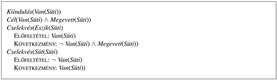
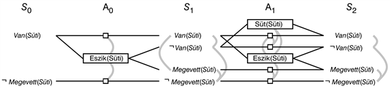
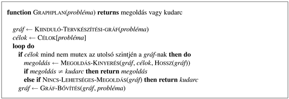
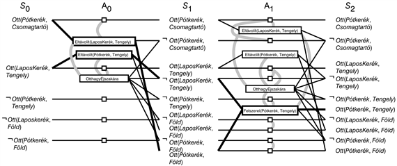

<?xml version="1.0" encoding="UTF-8" standalone="no"?>

<html xmlns="http://www.w3.org/1999/xhtml"><head><meta name="generator" content="DocBook XSL Stylesheets V1.76.1"/></head><body>

<h1 class="title"><a id="id644341"/>Tervkészítési gráfok</h1>

Az összes javasolt heurisztika a teljesen rendezett és a részben rendezett tervkészítésre pontatlanságokkal terhelt. Ez a fejezet bemutatja, hogy egy speciális adatszerkezet a <strong>tervkészítési gráf</strong> (<strong>planning graph</strong>) felhasználható, hogy jobb heurisztikus becsléseket nyerjünk. Ezek a heurisztikák bármely eddig tárgyalt keresési technikával használhatók. Egy másik lehetőség, hogy a megoldást közvetlenül a tervkészítési gráfból nyerjük ki egy erre kiélezett algoritmussal, mint amilyen például a <code class="code">GRAPHPLAN</code>.

A tervkészítési gráf a terv időrendi lépéseinek megfelelő szintekből áll, ahol a 0-dik szint a kiinduló állapot. Minden szint egy literálhalmazt és egy cselekvéshalmazt tartalmaz. A literálok durván azok, melyek igazak <em>lehetnek</em> az adott lépésnél, az addig végrehajtott cselekvések függvényében. Ismét durván fogalmazva, a cselekvések azok, melyeknek az előfeltételei teljesülhetnek az adott időlépésben attól függően, hogy aktuálisan mely literálok teljesülnek. Azért mondjuk, hogy „durván”, mert a tervkészítési gráf csak a cselekvések közötti lehetséges negatív kölcsönhatások egy korlátozott részhalmazát tartalmazza, ezért a tervkészítési gráf optimista lehet a literál teljesítéséhez szükséges minimális lépések számával kapcsolatban. Mindazonáltal a tervkészítési gráfban ez a lépésszám egy jó becslés arra, hogy milyen nehéz egy literált teljesíteni a kiindulási állapotból. Még fontosabb, hogy a tervkészítési gráfot úgy definiáltuk, hogy könnyen elkészíthető legyen.

A tervkészítési gráf csak ítéletlogikai tervkészítési problémákra alkalmazható – olyanokra, melyek nem tartalmaznak változókat. Ahogy a 11.1. alfejezetben említettük, mind a <code class="code">STRIPS</code>, mind az ADL reprezentáció ítéletlogikára alakítható. A nagyszámú entitást tartalmazó problémákat ez jelentősen felduzzaszthatja a cselekvéssémák számában. Ennek ellenére a tervkészítési gráfok hatékony eszköznek bizonyultak a nehéz tervkészítési problémák megoldásában.

A tervkészítési gráfokat egy egyszerű példán mutatjuk be. (Az összetettebb feladatok olyan gráfhoz vezetnek, amelyek nem férnének ki egy oldalra.) A 11.11. ábra a feladatot, míg a 11.12. ábra az ehhez tartozó gráfot mutatja. Az <em>S</em>0 állapotszintről indulunk, ami a probléma kiinduló állapotának felel meg. Ezt az <em>A</em>0 cselekvésszinttel folytatjuk, amibe azokat a cselekvéseket helyezzük, melyek előfeltételei az előző szinten teljesülnek. Minden cselekvés össze van kötve az <em>S</em>0-ban található előfeltételeivel, illetve az <em>S</em>1-ben található következményeivel, ami ebben az esetben az <em>S</em>0-ban nem szereplő literálok bevezetését jelenti <em>S</em>1-ben.

<a id="id644413"/>
<strong>11.11. ábra - A „legyen süti és együnk is” probléma</strong>

A tervkészítési gráfnak a nem cselekvést ugyanúgy kell reprezentálni, mint a cselekvéseket. Ez annyit tesz, hogy a szituációkalkulus keretaxiómáinak megfelelő működésre van szükség, ami alapján egy literál két állapon keresztül igaz maradhat, ha nincs ezt módosító cselekvés. Egy tervkészítési gráfban ezt <strong>megőrző cselekvés</strong>ekkel (<strong>persistence action</strong>s) oldjuk meg. Minden pozitív és negatív <em>C</em> literálhoz egy megőrző cselekvést szúrunk be <em>C</em> előfeltétellel és <em>C</em> következménnyel. A 11.12. ábra az <em>A</em>0 szinten egyetlen „valós” cselekvést az <em>Eszik</em>(<em>Süti</em>)-t tartalmazza, két megőrző cselekvéssel, amit kicsi négyzetek jelölnek.

Az <em>A</em>0 tartalmazza az összes cselekvést, ami az <em>S</em>0 állapotban előfordulhat, de ugyanilyen fontos, hogy rögzíti a cselekvések közötti ütközéseket is, amelyek megakadályozzák, hogy egyszerre történjenek. A 11.12. ábra szürke vonalai ezeket a <strong>kölcsönös kizárás</strong>i (<strong>mutual exclusion</strong>s vagy <strong>mutex</strong>) kapcsolatokat jelölik. Például az <em>Eszik</em>(<em>Süti</em>) kölcsönös kizárásban van a <em>Van</em>(<em>Süti</em>) vagy a ¬<em>Megevett</em>(<em>Süti</em>)<em> </em>megőrzésével. Hamarosan látjuk, hogy a mutex kapcsolatokat hogyan számíthatjuk.

<a id="id644515"/>
<strong>11.12. ábra - A „legyen süti és együnk is” probléma tervkészítési gráfja az <em>S</em>2 szintig. A téglalapok az akciókat jelentik (a kicsi négyzetek a megőrző cselekvések), az egyenesek az előfeltételeket és a következményeket jelölik. A kölcsönös kizárásokat ívelt szürke vonalak jelölik.</strong>

Az <em>S</em>1 az összes olyan literált tartalmazza, ami az <em>A</em>0 szint akcióinak bármely részhalmazát választva elérhető. Szintén tartalmaz mutex kapcsolatokat (szürke vonalakat) jelölve az olyan literálokat, melyek nem teljesülhetnek egyszerre, a választott cselekvésektől függetlenül. Például a <em>Van</em>(<em>Süti</em>)<em> </em>és a<em> Megevett</em>(<em>Süti</em>) kölcsönösen kizárják egymást. Az <em>A</em>0 kiválasztott cselekvéseitől függően az eredmény vagy az egyik vagy a másik lehet, de a kettő egyszerre nem. Más szavakkal az <em>S</em>1, csakúgy, mint a regressziós állapottér-keresés, több állapotot reprezentál, a kizárási kapcsolatok pedig kényszerek, melyek a lehetséges állapotok halmazát definiálják.

És ez így megy tovább. Az <em>Si </em>állapot- és az <em>Ai</em> cselekvésszintek között mozgunk, egészen addig, míg elérünk egy szintet, ahol két egymást követő szint azonos. Ekkor azt mondjuk, hogy a gráf <strong>kiegyenlítődött</strong> (<strong>leveled off</strong>). Minden egymást követő szint azonos, így további kiterjesztésre nincsen szükség.

Egy olyan struktúrát kaptunk, ahol az <em>Ai</em> szint tartalmaz minden <em>Si</em>-ben alkalmazható cselekvést, a kényszerekkel együtt, melyek megmondják, hogy melyik cselekvéspár nem hajtható végre egyidejűleg. Minden <em>Si</em> szint tartalmazza az összes literált, ami az <em>A</em><em>i</em>–1 összes lehetséges cselekvéshalmazának hatására teljesül, a kényszerekkel együtt, amelyek a nem lehetséges literálpárokat jelölik ki. Fontos megjegyezni, hogy a tervkészítési gráf elkészítési folyamatához <em>nem</em> kell választanunk a cselekvések között, ami kombinatorikus keresést eredményezne. Ezzel szemben, a tervkészítési gráf konstrukciója csak a lehetetlen választásokat rögzíti, mutex kapcsolatok felhasználásával. Egy ilyen tervkészítési gráf elkészítésének bonyolultsága egy alacsonyrendű polinomiális komplexitás a cselekvések számát tekintve, ahol az állapottér exponenciális a literálok számában.

Most mutex kapcsolatokat definiálunk, mind a cselekvések, mind a literálok számára. Egy adott szinten, a mutex kapcsolat akkor érvényes két <em>cselekvés</em> között, ha a következő három feltétel valamelyike fennáll:

<ul class="itemizedlist"><li class="listitem">
<em>Inkonzisztens hatások:</em> egy cselekvés negálja egy másik következményét. Például az <em>Eszik</em>(<em>Süti</em>) és a <em>Van</em>(<em>Süti</em>) megőrzése inkonzisztens hatású, mert a <em>Van</em>(<em>Süti</em>)<em> </em>következmény tekintetében ellentétesek.
</li><li class="listitem">
<em>Interferencia:</em> egy cselekvés egyik következménye a negálása egy másik cselekvés előfeltételének. Például az <em>Eszik</em>(<em>Süti</em>) interferál a <em>Van</em>(<em>Süti</em>)<em> </em>megőrzésével, mert negálja az előfeltételét.
</li><li class="listitem">
<em>Versenyhelyzet:</em> egy cselekvés előfeltétele kölcsönösen kizáró egy másik előfeltételével. Például a <em>Süt</em>(<em>Süti</em>) és az <em>Eszik</em>(<em>Süti</em>) mutexek, mert versenyeznek a <em>Van</em>(<em>Süti</em>) előfeltétel tekintetében.
</li></ul>

Két azonos szineten lévő <em>literál</em> között mutex kapcsolat áll fenn, ha az egyik a másik negáltja, vagy bármely lehetséges cselekvéspár, amely a két literált elérheti, egymást kölcsönösen kizáró. Ezt az állapotot <em>inkonzisztens háttérnek</em> nevezzük. Például a <em>Van</em>(<em>Süti</em>) és a <em>Megevett</em>(<em>Süti</em>) kizárják egymást <em>S</em>1-ben, mert az egyetlen mód a <em>Van</em>(<em>Süti</em>) teljesítésére egy megőrző cselekvés, ami mutex a <em>Megevett</em>(<em>Süti</em>)<em> </em>egyetlen elérési lehetőségével, nevezetesen az <em>Eszik</em>(<em>Süti</em>) cselekvéssel. Az <em>S</em>2 szinten a két literál már nem mutex, mert új elérési lehetőségek vannak hozzájuk, mint a <em>Süt</em>(<em>Süti</em>) és a <em>Megevett</em>(<em>Süti</em>) megőrző cselekvése, melyek nem zárják ki egymást.

<h2 class="title"><a id="id644809"/>Tervkészítési gráfok heurisztikus becslésekre</h2>

<h3 class="title">Fontos</h3>
A tervkészítési gráf, ha egyszer már létrehoztuk, nagyon gazdag információforrás a problémáról. Például <em>egy literál</em>,<em> ami nem található meg az utolsó szinten</em>,<em> egyetlen tervvel sem érhető el</em>. Ez a megfigyelés a visszafelé keresésben használható a következőképp: bármely elérhetetlen literált tartalmazó állapot költsége <em>h</em>(<em>n</em>) = ∞. Hasonlóan a részben rendezett tervkészítésnél bármely tervnek a költsége egy elérhetetlen nyitott előfeltétellel, <em>h</em>(<em>n</em>) = ∞.

Ez az ötlet tovább általánosítható. Minden cél literál elérési költségét becsülhetjük azzal a szinttel, ahol először megjelenik a tervkészítési gráfban. Ezt a cél <strong>szint költségé</strong>nek (<strong>level cost</strong>) nevezzük. A 11.12. ábrán a <em>Van</em>(<em>Süti</em>) szint költsége 0, a <em>Megevett</em>(<em>Süti</em>) szint költsége 1. Könnyű megmutatni (lásd 11.9. feladat), hogy ezek a közelítések elfogadhatók az egyedülálló célokra. A becslés azonban lehet, hogy nem túl jó, mert a tervkészítési gráfok több cselekvést megengednek szintenként, míg a heurisztika csak a szintek számát tartalmazza, és nem a cselekvések számát. Ebből kifolyólag a heurisztikák számításában, gyakori a <strong>soros tervkészítési gráf</strong> (<strong>serial planning graph</strong>) használata. A soros gráf szerint egy adott időpillanatban csak egyetlen cselekvés hajtható végre, ami mutexekkel érhető el úgy, hogy a megőrző cselekvések kivételével, minden cselekvés közé mutex kapcsolatot teszünk. A soros tervkészítő gráfból kinyert szintköltségek gyakran egész elfogadható közelítését adják a valós költségeknek.

Három egyszerű megközelítés létezik, hogy célliterálok konjunkcióihoz költséget becsüljünk. A <strong>maximális szint</strong> (<strong>max-level</strong>) heurisztika egyszerűen a célok közüli maximális szintköltségét veszi, ami elfogadható, de nem feltétlen nagyon pontos. A <strong>szintösszeg</strong> (<strong>level sum</strong>) heurisztika a részcél függetlenségi feltételezésből a célok szintköltségeinek összegét adja. Ez nem elfogadható, de nagyon jól működik olyan gyakorlati problémákra, amelyek nagymértékben részekre bonthatók. Ez sokkal pontosabb, mint a 11.2. alfejezetben bemutatott nem-kielégített-célok-heurisztika. A mi feladatunkban a <em>Van</em>(<em>Süti</em>) ∧ <em>Megevett</em>(<em>Süti</em>) konjunktív célhoz rendelhető heurisztikus becslés 0 + 1 = 1, míg a helyes válasz 2. Mindezeken túl, ha eltávolítjuk a <em>Süt</em>(<em>Süti</em>)<em> </em>cselekvést, a becslés még mindig 1, de a konjunktív cél ekkor már elérhetetlen. Végezetül, a <strong>halmazszint</strong> (<strong>set-level</strong>) heurisztika azt a szintet keresi meg, ahol a konjunktív cél összes literálja megjelenik a tervkészítési gráfban, és nincsenek közöttük kölcsönösen kizáró párok. A heurisztika a korrekt 2 értéket adja az eredeti feladatra és végtelent a <em>Süt</em>(<em>Süti</em>) nélküli feladatra. Ez előnyben van a maximális szint heurisztikával szemben, és kimagaslóan jól működik azon feladatokban, ahol sok kölcsönhatás van a résztervek között.

Lévén egy pontos heurisztika készítésére szolgáló eszköz, a tervkészítési gráf tekinthető úgy, mint egy relaxált probléma, ami hatékonyan megoldható. Hogy a relaxált probléma természetét megértsük, pontosan meg kell értenünk, hogy mit jelent, ha egy <em>g</em> literál megjelenik a tervkészítési gráf <em>Si</em> szintjén. Ideális esetben garanciát szeretnénk arra, hogy létezik egy terv <em>i</em> cselekvés szinttel, ami eléri <em>g</em>-t, illetve ha <em>g</em> nem jelenik meg, akkor nincs is ilyen terv. Sajnos ezt garantálni majdnem ugyanolyan nehéz, mint megoldani az eredeti tervkészítési problémát. A tervkészítési gráf a garancia második részéről gondoskodik (ha <em>g</em> nem jelenik meg, akkor nincs terv), de ha <em>g</em> megjelenik, akkor a tervkészítési gráf csak annyit ígér, hogy van egy terv, ami <em>várhatóan</em> eléri <em>g</em>-t, nincsenek „nyilvánvaló” hibák. Egy nyilvánvaló hiba definíció szerint egy olyan hiba, ami úgy detektálható, hogy két cselekvést vagy két literált tekintünk egyszerre, vagy más szavakkal a mutex relációkat vizsgáljuk. Lehetnek összetettebb hibák, melyek három, négy vagy több cselekvést tartalmaznak, de a tapasztalatok azt mutatják, hogy nem éri meg ezekkel foglalkozni. Ez hasonló a kényszerkielégítési problémáknál tanultakkal, hogy a megoldás megkeresése előtt gyakran megéri a 2-konzisztencia számítás, de a 3- vagy a magasabb konzisztencia kiszámítása ritkábban kifizetődő (lásd 5.2. alfejezet).

<h2 class="title"><a id="id647105"/>A Graphplan algoritmus</h2>

Ez a fejezet bemutatja, hogy hogyan nyerhető ki közvetlenül a terv a tervkészítési gráfból, ahelyett hogy azt csak a heurisztikákhoz használjuk. A <code class="code">GRAPHPLAN</code> algoritmusnak (11.13. ábra) két fő lépése van, melyek ciklikusan váltakoznak. Először ellenőrzi, hogy minden célliterál jelen van-e az adott szinten anélkül, hogy mutex kapcsolatok lennének közöttük. Ebben az esetben, az aktuális gráfban<em> létezhet</em> megoldás, így az algoritmus megpróbálja azt kinyerni. Ellenkező esetben bővíti a gráfot úgy, hogy az aktuális szinthez a cselekvéseket, a következőhöz az állapotliterálokat adja: ez a folyamat folytatódik addig, amíg megtaláljuk a megoldást, vagy bebizonyosodik, hogy nem létezik megoldás.

<a id="id647120"/>
<strong>11.13. ábra - A <code class="code">GRAPHPLAN</code> algoritmus. A <code class="code">GRAPHPLAN</code> algoritmus egy megoldás kinyerő és egy gráf-bővítő lépés között alternál. A <code class="code">MEGOLDÁS-KINYERÉS</code> a befejezéstől visszafelé keresve ellenőrzi, hogy található-e megoldás. A <code class="code">GRÁF-BŐVÍTÉS</code> adja a cselekvéseket az adott szinthez és az állapotliterálokat a következőhöz.</strong>

Kövessük végig a <code class="code">GRAPHPLAN</code> működését a 11.1. alfejezet kerékcsere problémáján! A teljes gráf a 11.14. ábrán látható. A <code class="code">GRAPHPLAN</code> első lépésben inicializálja a tervkészítési gráfot egy egyszintű (<em>S</em>0 szint) gráfra, ami a kiindulási állapot öt literálját tartalmazza. Az<em> Ott</em>(<em>Pótkerék</em>, <em>Tengely</em>)<em> </em>célliterál nincs jelen az <em>S</em>0-ban, ezért nem kell meghívnunk a <code class="code">MEGOLDÁS-KINYERÉST</code>, hiszen biztosak vagyunk benne, hogy még nincs megoldás. Ehelyett a <code class="code">GRÁF-BŐVÍTÉS</code> hozzáad három cselekvést, melyeknek az előfeltétele már teljesül az <em>S</em>0 szinten (például az összes cselekvés, kivéve a <em>Felszerel</em>(<em>Pótkerék</em>, <em>Tengely</em>) – cselekvést). Hozzáadja továbbá a megőrző-cselekvéseket <em>S</em>0 összes literáljához. A cselekvések következményeit az <em>S</em>1<em> </em>szinthez adjuk hozzá. A <code class="code">GRÁF-BŐVÍTÉS</code> ezek után mutex kapcsolatokat keres, és hozzáadja ezeket a gráfhoz.

<a id="id647224"/>
<strong>11.14. ábra - A kerékcsere probléma tervkészítési gráfja az S2 szintre bővítés után. A mutex kapcsolatokat szürke vonalak jelölik. Csak néhány fontos mutexet mutatunk, mert az ábra olvashatatlanná válna, ha az összeset jelölnénk. A megoldást megvastagított vonalak és kiemelések jelölik.</strong>

Az <em>Ott</em>(<em>Pótkerék</em>, <em>Tengely</em>)<em> </em>cselekvés még mindig nincs jelen az <em>S</em>1 állapotban, ezért most sem hívjuk meg a <code class="code">MEGOLDÁS-KINYERÉS</code> lépést. A <code class="code">GRÁF-BŐVÍTÉS</code> hívással a 11.14. ábrán látható tervkészítési gráfot kapjuk. Most, hogy a cselekvések teljes skálája rendelkezésre áll, ideje néhány példát nézni a mutex kapcsolatokra és a hatásaikra:

<ul class="itemizedlist"><li class="listitem">
<em>Nem konzisztens hatások:</em> az <em>Eltávolít</em>(<em>Pótkerék</em>,<em> Csomagtartó</em>)<em> </em>mutex kapcsolatban van az <em>OtthagyÉjszakára</em> cselekvéssel, mert az egyik következménye az <em>Ott</em>(<em>Pótkerék</em>,<em> Föld</em>), míg a másiké ennek negáltja.
</li><li class="listitem">
<em>Interferencia:</em> az<em> Eltávolít</em>(<em>Pótkerék</em>, <em>Tengely</em>) mutex az <em>OtthagyÉjszakára</em> cselekvéssel, mert az egyiknek előfeltétele az <em>Ott</em>(<em>Laposkerék</em>, <em>Tengely</em>), míg a másiknak ennek negáltja a következménye.
</li><li class="listitem">
<em>Versenyhelyzet:</em> a <em>Felszerel</em>(<em>Pótkerék</em>, <em>Tengely</em>) mutex az <em>Eltávolít</em>(<em>Laposkerék</em>, <em>Tengely</em>) cselekvéssel, mert az egyiknek előfeltétele az <em>Ott</em>(<em>Laposkerék</em>, <em>Tengely</em>), míg a másiké ennek negáltja.
</li><li class="listitem">
<em>Inkonzisztens tartó:</em> az <em>Ott</em>(<em>Pótkerék</em>, <em>Tengely</em>) és az <em>Ott</em>(<em>Laposkerék</em>, <em>Tengely</em>) kölcsönösen kizáróak az <em>S</em>2-ben, mert az <em>Ott</em>(<em>Pótkerék</em>, <em>Tengely</em>) csak a <em>Felszerel</em>(<em>Pótkerék</em>, <em>Tengely</em>) cselekvéssel érhető el, ami mutex a megőrző cselekvéssel, mely az <em>Ott</em>(<em>Laposkerék</em>, <em>Tengely</em>) egyetlen elérése. A mutex kapcsolatok így azonnal érzékelik a konfliktust, ami abból adódik, hogy két objektumot ugyanazon időpontban azonos helyre próbálunk tenni.
</li></ul>

Ez alkalommal visszamegyünk a ciklus kezdetére. A cél minden literálja jelen van <em>S</em>2-ben, és egyik sem áll kölcsönös kizárásban egyetlen másikkal sem. Ez azt jelenti, hogy egy megoldás létezhet, és a <code class="code">MEGOLDÁS-KINYERÉS</code>megtalálhatja. Lényegében a <code class="code">MEGOLDÁS-KINYERÉS</code> egy kétértékű kényszerkielégítési problémát old meg, melynek változói a szintek cselekvései, és az értékeik pedig azt jelzik, hogy <em>benne vannak-e</em> vagy <em>nincsenek benne</em> a tervben. Ehhez egy egyszerű kényszerkielégítési algoritmust használhatunk, vagy definiálhatjuk a <code class="code">MEGOLDÁS-KINYERÉS</code>-t mint egy keresési problémát. Itt a keresés minden állapota a kielégítetlen célok egy halmazát tartalmazza, valamint egy mutatót a tervkészítési gráf egy szintjére. Ezt a keresési problémát a következőképpen definiáljuk:

<ul class="itemizedlist"><li class="listitem">
A kiindulási állapot a tervkészítési gráf utolsó szintje (<em>Sn</em>) a tervkészítési probléma céljaival egyetemben.
</li><li class="listitem">
Az <em>S</em><em>i</em> szint állapotában rendelkezésre álló cselekvések összessége, az <em>A</em><em>i</em>–1 cselekvéseinek azon konfliktusmentes részhalmaza, melyek következményei elérik az állapotban lévő célokat. Az eredményként előálló állapot szintje <em>S</em><em>i</em>–1, céljai pedig a kiválasztott cselekvések előfeltételei. A „konfliktusmentességen” olyan cselekvések halmazát értjük, amelyek között nincs kettő, amelyek kölcsönösen kizárnák egymást, és az előfeltételeik között sem szerepelnek kölcsönösen kizáró párok. 
</li><li class="listitem">
A cél, hogy elérjünk az <em>S</em>0 szinten egy állapotot úgy, hogy minden cél teljesüljön. 
</li><li class="listitem">
Minden cselekvés költsége 1.
</li></ul>

Ehhez a problémához az <em>S</em>2<em> </em>szintről indulunk, az<em> Ott</em>(<em>Pótkerék</em>, <em>Tengely</em>) céllal. Az egyetlen választásunk, hogy elérjük ezt a célt, a<em> Felszerel</em>(<em>Pótkerék</em>, <em>Tengely</em>) cselekvés. Ez az <em>S</em>1 keresési állapothoz visz minket, melynek céljai az<em> Ott</em>(<em>Pótkerék</em>, <em>Föld</em>) és az ¬<em>Ott</em>(<em>Laposkerék</em>, <em>Tengely</em>). Az előbbit az<em> Eltávolít</em>(<em>Pótkerék</em>, <em>Csomagtartó</em>) cselekvéssel érhetjük el, míg a későbbit az <em>Eltávolít</em>(<em>Laposkerék</em>, <em>Tengely</em>) vagy az <em>OtthagyÉjszakára</em> cselekvések egyikével. Az <em>OtthagyÉjszakára </em>kölcsönösen kizáró kapcsolatban van a <em>Eltávolít</em>(<em>Pótkerék</em>, <em>Csomagtartó</em>)-val, ezért az egyetlen megoldás, hogy az <em>Eltávolít</em>(<em>Pótkerék</em>, <em>Csomagtartó</em>)<em> </em>és az <em>Eltávolít</em>(<em>Laposkerék</em>, <em>Tengely</em>)<em> </em>cselekvéseket választjuk. Ez az <em>S</em>0 keresési állapotra vezet, az <em>Ott</em>(<em>Pótkerék</em>, <em>Csomagtartó</em>)<em> </em>és az <em>Ott</em>(<em>Laposkerék</em>, <em>Tengely</em>)<em> </em>célokkal. Mindkettő jelen van az állapotban, így megvan a megoldásunk: az<em> Eltávolít</em>(<em>Pótkerék</em>, <em>Csomagtartó</em>) cselekvés és az <em>Eltávolít</em>(<em>Laposkerék</em>, <em>Tengely</em>)<em> </em>az <em>A</em>0 szinten, melyet az <em>A</em>1-ben a <em>Felszerel</em>(<em>Pótkerék</em>, <em>Tengely</em>) követ.

Tudjuk, hogy a tervkészítés polinomiális helyigényű, és hogy a tervkészítési gráf elkészítése polinomiális idejű, ezért tudjuk, hogy a megoldás kinyerése legrosszabb esetben kezelhetetlen. Ebből kifolyólag valamifajta heurisztika segítségére lesz szükségünk, hogy a cselekvések közül válasszunk a visszafelé keresés során. A gyakorlatban jól működik egy mohó algoritmus, mely a literálok között a szintköltség alapján választ. Bármely célhalmazra a következő sorrendben járunk el:

<ol class="orderedlist"><li class="listitem">
Elsőként a legmagasabb szintköltségű literált választjuk.
</li><li class="listitem">
Hogy teljesítsük ezt a literált, válasszuk először a legegyszerűbb előfeltételekkel rendelkező cselekvést, azaz válasszuk azt az akciót, melynek előfeltételeire a szintköltségek összege (vagy maximuma) a legkisebb!
</li></ol>

<h2 class="title"><a id="id647755"/>A Graphplan algoritmus leállása</h2>

Eddig átsiklottunk a leállás kérdése fölött. Lehetünk-e biztosak abban, hogy amennyiben egy problémának nincs megoldása, a <code class="code">GRAPHPLAN</code> algoritmus nem kerül végtelen ciklusba, iterációnként bővítve a tervkészítési gráfot? A válasz igen, de ennek bizonyítása túlmutat ennek a könyvnek a keretein. Itt csak a fő ötleteket körvonalazzuk, különösen azokat, melyek a tervkészítési gráfok általános tulajdonságaira világítanak rá.

Az első lépés, hogy észrevegyük, hogy a tervkészítési gráfok bizonyos tulajdonságai monoton növekvők vagy csökkenők. „X monoton növekvő” azt jelenti, hogy az X-ek halmaza az <em>i</em>-edik szinten az i + 1-edik szint halmazának (nem feltétlenül valódi) részhalmaza. A tulajdonságok a következők: 

<ul class="itemizedlist"><li class="listitem">
<em>Monoton növekvő literálok.</em> Ha egy literál megjelenik egy adott szinten, akkor az ezt követő összes szinten megjelenik. Ez a megőrző cselekvések miatt van, azaz, ha egy literál megjelenik, a megőrző cselekvések hatására örökké megmarad.
</li><li class="listitem">
<em>Monoton növekvő cselekvések.</em> Ha egy cselekvés megjelenik egy adott szinten, akkor az ezt követő összes szinten megjelenik. Ez a literálok növekedésének a következménye, azaz, ha egy cselekvés előfeltételei megjelennek egy szinten, akkor az összes ezt követő szinten rendelkezésre állnak, így a cselekvés is.
</li><li class="listitem">
<em>A kölcsönös kizárások monoton csökkenése.</em> Ha két cselekvés kölcsönösen kizárja egymást az <em>Ai</em> szinten, akkor az összes ezt <em>megelőző </em>szinten, ahol mindketten megjelennek, szintén kölcsönösen kizárják egymást. Ugyanez igaz a literálok közötti kölcsönös kizárásokra. Ez az ábrákon nem mindig látható, mert ezek a következő egyszerűsítést használják: nem ábrázolják sem azokat a literálokat, melyek egy adott <em>Si </em>szinten nem teljesülnek, sem azokat a cselekvéseket, amelyek egy adott <em>Ai</em> szinten nem végrehajthatók. Láthatjuk, hogy a kölcsönös kizárások monoton csökkenése igaz, ha figyelembe vesszük, hogy a nem látható literálok és cselekvések minden mással kölcsönösen kizárják egymást. 
</li></ul>

	A bizonyítás egy kicsit összetett, de a következő esetekkel kezelhető: ha az <em>A</em> és <em>B</em> cselekvések kölcsönösen kizárják egymást az <em>Ai</em> szinten, akkor ezt csak a háromféle kizárás egyike okozhatja. Az első kettő – az inkonzisztens hatások, illetve a következtetések – a cselekvések tulajdonságai, így, ha a cselekvések kölcsönösen kizárják egymást az <em>Ai</em> szinten, akkor minden szinten kizárók lesznek. A harmadik eset a versenyhelyzet, az <em>Si </em>szint feltételeitől függ: ennek a szintnek tartalmaznia kell az <em>A</em>1 olyan előfeltételét, amely kölcsönösen kizáró a <em>B</em>1 előfeltétellel. Ez a két előfeltétel akkor lehet kölcsönösen kizáró, ha egymás negáltjai (amely esetben minden szinten kölcsönösen kizárók), vagy ha minden cselekvés, amely teljesíti az egyiket, kölcsönösen kizáró az összes cselekvéssel, mely a másikat érheti el. Mi már tudjuk, hogy a rendelkezésre álló cselekvések monoton növekednek, így indukcióval bizonyítható, hogy a kölcsönös kizárások csökkenők. 

Mivel a cselekvések és a literálok növekednek, a kölcsönös kizárások csökkennek, és mivel csak véges számú cselekvés és literál van, minden tervkészítési gráf szükségszerűen kiegyenlítődik – azaz minden egymást követő szint azonos lesz. Ha hiányzik a probléma egy célja, vagy a célok között vannak kölcsönösen kizárók, miután a gráf kiegyenlítődött, akkor a probléma soha nem oldható meg, így leállíthatjuk a <code class="code">GRAPHPLAN</code> algoritmust, és hibával térhetünk vissza. Ha a gráf kiegyenlítődik, és minden cél jelen van kizárások nélkül, de a <code class="code">MEGOLDÁS-KINYERÉS</code> sikertelen a megoldás megtalálásában, akkor lehet, hogy véges lépésszámban bővítenünk kell a gráfot, de végezetül megállhatunk. A megállás problémaköre ennél összetettebb, amit itt nem tárgyalunk. 

</body></html>
