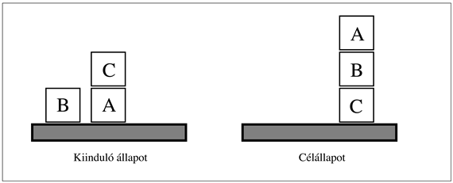
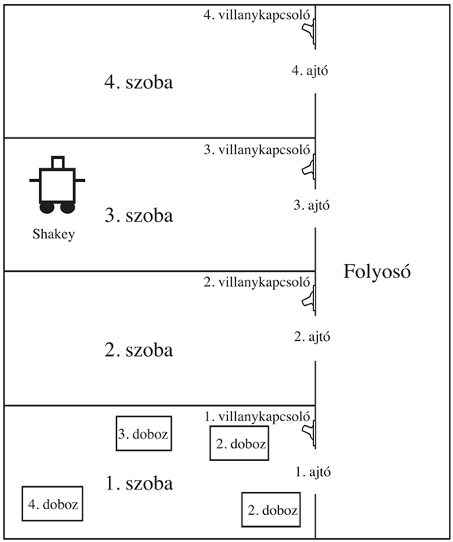

<?xml version="1.0" encoding="UTF-8" standalone="no"?>

<html xmlns="http://www.w3.org/1999/xhtml"><head><meta name="generator" content="DocBook XSL Stylesheets V1.76.1"/></head><body>

<h1 class="title"><a id="id650678"/>Összefoglalás</h1>

Ebben a fejezetben a tervkészítési feladatot determinisztikus és teljesen megfigyelhető környezetek esetén definiáltuk. Bemutattuk a tervkészítési feladatok leírására használt főbb reprezentációkat, valamint számos algoritmikus megközelítést a megoldásukra. Idézzük fel a fontosabb állításokat:

<ul class="itemizedlist"><li class="listitem">
A tervkészítő rendszerek olyan problémamegoldó algoritmusok, melyek állapotok és cselekvések explicit ítéletlogikai (vagy elsőrendű) reprezentációin működnek. Ezek a leírások lehetővé teszik hatékony heurisztikák származtatását, valamint erős és rugalmas algoritmusok kifejlesztését a problémamegoldáshoz. 
</li><li class="listitem">
A <code class="code">STRIPS</code> nyelv az előfeltételek és következmények segítségével írja le a cselekvéseket, valamint a kiindulási és célállapotokat pozitív literálok konjunkciójaként adja meg. Az ADL nyelv lazít ezeken a megkötéseken, megengedi a diszjunkciót, a negálást és a kvantorokat. 
</li><li class="listitem">
Az állapottér-keresés történhet előrefelé: <strong>progreszív</strong> (<strong>progression</strong>) vagy hátrafelé: <strong>regresszív</strong> (<strong>regression</strong>). Hatékony heurisztikák származtathatók a részcélok függetlenségét feltételezve és a tervkészítési feladat különböző gyengítéseivel. 
</li><li class="listitem">
A részben rendezett tervkészítő (RRT) algoritmusok a tervek terében keresnek anélkül, hogy cselekvések teljesen rendezett sorozatára jutnának. A céltól visszafelé működnek a részcélok eléréséhez szükséges cselekvéseknek a tervhez való hozzáadásával. Ezek az algoritmusok különösen hatékonyak az „oszd meg és uralkodj” megközelítéssel kezelhető problémákra. 
</li><li class="listitem">
Egy <strong>tervkészítési gráf</strong> (<strong>planning graph</strong>) megalkotható inkrementálisan a kiinduló állapotból elindulva. Minden egyes réteg az adott időpillanatban végrehajtható öszszes cselekvés és literál halmazát tartalmazza, rögzíti a kölcsönös kizárásokat vagy mutexeket, azaz olyan literálok és cselekvések közötti relációkat, melyek egyszerre nem következhetnek be. A tervkészítési gráfok hasznos heurisztikákra vezetnek az állapottér és a részben rendezett tervkészítők esetén, és közvetlenül felhasználhatók a <code class="code">GRAPHPLAN</code> algoritmusban. 
</li><li class="listitem">
A <code class="code">GRAPHPLAN</code> algoritmus a tervkészítési gráfot dolgozza fel visszafelé keresést alkalmazva a terv kinyeréséhez. Lehetőséget biztosít továbbá még a cselekvések között bizonyos részben rendezésekre. 
</li><li class="listitem">
A <code class="code">SATPLAN</code> algoritmus a tervkészítési problémát ítéletlogikai axiómákra fordítja, és egy kielégíthetőségi algoritmust használ a helyes tervnek megfelelő modell megtalálására. Számos különböző ítéletlogikai reprezentációt fejlesztettek ki különböző mértékű tömörséggel és hatékonysággal. 
</li><li class="listitem">
A tervkészítés fő megközelítései mindegyikének vannak nehézségei, és egyelőre nincs egyetértés abban, hogy melyik a legjobb. A versengés és a módszerek ötvözése komoly előrehaladást eredményezett a tervkészítő rendszerek hatékonyságában.
</li></ul>

<h2 class="title"><a id="id650761"/>Irodalmi és történeti megjegyzések</h2>

A mesterséges intelligenciában a tervezés az állapottér-keresések vizsgálatából, tételbizonyításból, szabályozástechnikából, illetve a robotika, ütemezés és más területek gyakorlati szükségleteiből ered. Az első számottevő tervkészítő rendszer a <code class="code">STRIPS</code> (Fikes and Nilsson, 1971), ezen hatások kölcsönhatását példázza. A <code class="code">STRIPS</code>-et, az SRI-ben zajló Shakey robot projekt szoftverének tervkészítő komponenseként fejlesztették ki. Ennek teljes szabályozási struktúráját egy eszköz-cél analízist használó állapottér-kereső rendszer, a GPS, azaz az általános problémamegoldó (general problem solver) (Newell és Simon, 1961) mintájára készítették. A <code class="code">STRIPS</code> a QA3 tételbizonyító rendszer egy verzióját (Green, 1969b) használta fel a cselekvések előfeltételeinek teljesítésére. Lifschitz a <code class="code">STRIPS</code> precíz definícióit és elemzéseit adja meg (Lifschitz, 1986). Bylander bizonyította, hogy az egyszerű <code class="code">STRIPS</code> tervkészítés PSPACE-teljes (Bylander, 1992). Fikes és Nilsson történelmi áttekintést adnak a <code class="code">STRIPS</code> projektről, és feltárják ennek kapcsolatait az újabb tervkészítési törekvésekkel (Fikes és Nilsson, 1993).

A <code class="code">STRIPS</code>-ben használt cselekvésreprezentációnak sokkal nagyobb hatása volt, mint algoritmikus megközelítésének. Ezt követően majdnem minden tervkészítő rendszer használta a <code class="code">STRIPS</code> nyelv ilyen vagy olyan módosításait. Sajnos a különböző változatok elburjánzása szükségtelenül megnehezítette az összehasonlításokat. Az idő múlásával jobban megértettük az egyes formalizmusok korlátait és hátrányait. A cselekvésleíró nyelv (Action Description Language – ADL) (Pednault, 1986) lazította a <code class="code">STRIPS</code> nyelv néhány megkötését, és lehetővé tette a valósághoz közelibb problémák leírását. Nebel  az ADL leírást <code class="code">STRIPS</code> leírásra fordító sémákat vizsgálja (Nebel, 2000). A problématér leíró nyelvet (Problem Domain Description Language – PDDL) (Ghallab és társai, 1998) egy számítógép által érthető szabványos szintaxisként vezették be a <code class="code">STRIPS</code>, az ADL és egyéb nyelvek leírására. A PDDL-t 1998-tól az AIPS konferencián zajló tervkészítési versenyek szabványos nyelveként használták.

Az 1970-es évek elejének tervkészítői általában teljesen rendezett cselekvéssorokkal dolgoztak. A problémadekompozíciót úgy érték el, hogy minden részcélhoz egy résztervet készítettek, majd ezeket valamilyen sorrendben összefűzték. Hamarosan felfedezték, hogy ez a megközelítést, melyet Sacerdoti <strong>lineáris tervkészítés</strong>nek (<strong>linear </strong><strong>planning</strong>) nevezett (Sacerdoti, 1975), nem teljes. Nem képes megoldani néhány nagyon egyszerű problémát, mint pédául a Sussman-anomáliát (lásd 11.11. feladat), amit Allen Brown a <code class="code">HACKER</code> rendszerrel végzett kutatásai során fedezett fel (Sussman, 1975). Egy teljes tervkészítőnek meg kell engedni egy mondatban a különböző résztervekből származó cselekvések <strong>összefésülés</strong>ét (<strong>interleaving</strong>). A sorrendezhető részcélok alapötlete (Korf, 1987) pontosan megfeleltethető azon problémák halmazának, melyekre az öszszefésülésre nem alkalmas tervkészítők teljesek.

Az összefésülési probléma egyik megoldása a célregressziós tervkészítés volt, ami egy olyan technika, melyben egy teljesen rendezett terv lépéseit a részcélok közötti konfliktusok elkerülése érdekében újrarendezzük. Ezt Waldinger vezette be (Waldinger, 1975), és Warren <code class="code">WARPLAN</code> rendszerében (Warren, 1974) szintén felhasználták. A <code class="code">WARPLAN</code>-nel kapcsolatban szintén kiemelendő, hogy ez volt az első tervkészítő, melyet logikai programozási nyelven (Prolog) írtak, valamint az egyik legjobb példa arra a kiemelkedő gazdaságosságra, ami a logikai programozással nyerhető: a <code class="code">WARPLAN</code> összesen száz kódsor, azaz csak töredéke az abban az időben ismert hasonló tervkészítők méretének. Az <code class="code">INTERPLAN</code> (Tate, 1975a; 1975b) a Sussman-anomália és hasonló problémák elkerülése érdekében, szintén megengedte a tervlépések tetszőleges összefésülését.

A részben rendezett tervkészítés alapötletei tartalmazzák az ütközések érzékelését (Tate, 1975a) és az elért feltételek kölcsönhatásoktól való védelmét (Sussman, 1975). A részben rendezett tervek (melyeket akkor <strong>feladatháló</strong>knak – <strong>task network</strong> – neveztek) készítését a <code class="code">NOAH</code> tervkészítő (Sacerdoti, 1975; 1977) és Tate <code class="code">NONLIN</code> rendszere vezette be (Tate, 1975b; 1977).[<a id="id650876" href="#ftn.id650876" class="footnote">117</a>]

A következő húsz év kutatásaiban a részben rendezett tervkészítés dominált, mialatt azonban a problémakört széles körben nem értették. A <code class="code">TWEAK</code> (Chapman, 1987) ezen időszak tervkészítési munkájának logikai reprezentációja és egyszerűsítése volt. Chapman felírása eléggé tiszta volt ahhoz, hogy bizonyítható legyen a tervkészítési problémák különböző megfogalmazásainak teljessége és követhetetlensége (NP-nehézsége és -eldönthetetlensége). Chapman munkája egy teljes részben rendezett tervkészítő első egyszerű és olvasható leírására vezetett (McAllester és Rosenblitt, 1991). A McAllester és Rosenblitt SNLP-nek (Soderland és Weld, 1991) nevezett algoritmusának implementációja széles körben elterjedt, és elsőként tette számos kutató számára lehetővé a részben rendezett tervkészítők megértését és kutatását. Az ebben fejezetben korábban bemutatott RRT algoritmus az SNLP-n alapul.

Weld csoportja fejlesztette ki az UCPOP-ot is (Penberthy és Weld, 1992), az első tervkészítőt ADL-ben kifejezett problémákra. Az UCPOP a kielégítetlen-célok-száma heurisztikát alkalmazta. Valamivel gyorsabban futott, mint az SNLP, de nagyon ritkán volt képes néhány tucat lépésnél többet tartalmazó tervek megtalálására. Bár javított heurisztikákat is kifejlesztettek az UCPOP módszerhez (Joslin és Pollack, 1994); (Gerevini és Schubert, 1996) az 1990-es években, a gyorsabb módszerek megjelenésével a részben rendezett tervkészítők háttérbe szorultak. Nguyen és Kambhampati a módszer visszatérését javasolták (Nguyen és Kambhampati, 2001): a tervkészítési gráfból megfelelő heurisztikák származtatásával a <code class="code">REPOP</code> tervkészítőjük jobban skálázható, mint a <code class="code">GRAPHPLAN</code>, továbbá ez vetélytársa lett a leggyorsabb állapottér-tervkészítőknek is.

Avrim Blum és Merrick Furst felpezsdítette a tervkészítés területét <code class="code">GRAPHPLAN</code> rendszerével (Blum és Furst, 1995; 1997), ami több nagyságrenddel gyorsabb volt az akkori részben rendezett tervkészítőknél. Más gráftervező rendszerek, mint az IPP (Koehler és társai, 1997), a <code class="code">STAN</code> (Fox és Long, 1998) és az SGP (Weld és társai, 1998) hamarosan követték. Egy kicsivel korábban Ghallab és Laurelle a tervkészítő gráfhoz nagyon hasonló adatstruktúrát fejlesztettek ki (Ghallab és Laurelle, 1994). Az <code class="code">IXTET</code> részben rendező tervkészítőjük az adatstruktúrát a keresés irányítására szolgáló heurisztikák kinyerésére alkalmazta. Nguyen és társai a tervkészítő gráfokból származtatott heurisztikák nagyon alapos áttekintését adták (Nguyen és társai, 2001). A mi tervkészítő gráfokról szóló leírásunk részben ezen, részben pedig Subbarao Kambhampati jegyzetein alapul. Ahogyan már a fejezetben említettük, többféle módon használható a tervezési gráf a megoldás keresésének irányítására. A 2002-es AIPS tervkészítő győztese, az LPG (Gerevini és Serina, 2002), a <code class="code">WALKSAT</code> által ösztönözve lokális keresési technikát használt a tervkészítési gráf keresésére.

A tervkészítés mint kielégíthetőség és a <code class="code">SATPLAN</code> algoritmus Kautz és Selman javaslata, akiket a kielégíthetőségi problémákra alkalmazott mohó lokális keresés meglepő sikere inspirált (Kautz és Selman, 1992) (lásd 7. fejezet). Kautz és társai szintén kutatták a STRIPS axiómák ítéletlogikai reprezentációjának különböző módjait, és azt találták, hogy a legtömörebb alakok nem feltétlenül vezettek a leggyorsabb megoldásokra (Kautz és társai, 1996). Ernst és társai szisztematikus elemzést hajtottak végre (Ernst és társai, 1997), valamint kifejlesztettek egy automatikus fordítót PDDL problémák ítéletlogikai megadásának generálására. A Kautz és Selman  által kifejlesztett <code class="code">BLACKBOX</code> tervkészítő (Kautz és Selman, 1998) a <code class="code">GRAPHPLAN</code> és <code class="code">SATPLAN</code> alapötleteit kombinálja.

Az állapottér-tervkészítőkkel kapcsolatos érdeklődés újjáéledésének úttörője Drew McDermott <code class="code">UNPOP</code> programja (McDermott, 1996), amely elsőként javasolta a törlési listát figyelmen kívül hagyó egyszerűsített problémán alapuló távolság heurisztikát. Az <code class="code">UNPOP</code> név a részben rendezett tervkészítőket illető túlzott figyelem egyik reakciója volt; McDermott szerint más megközelítések nem kapták meg a megérdemelt figyelmet. Bonet és Geffner heurisztikus kereső tervkészítője (Heuristic Search Planner – HSP) és ennek későbbi leszármazottjai (Bonet és Geffner, 1999) elsőként tették az állapottér-keresést alkalmazhatóvá nagyméretű tervkészítési feladatokra. A mai napig legsikeresebb állapottér-kereső Hoffmann <code class="code">FASTFORWARD</code> vagy FF keresője, az AIPS 2000 tervkészítő versenyének győztese (Hoffmann, 2000). Az FF egyszerűsített tervkészítési gráf heurisztikát használ egy nagyon gyors, az előrefelé és a lokális keresést újszerűen ötvöző algoritmussal.

Napjainkban a tervek <strong>bináris döntési diagram</strong> (<strong>binary decision diagram</strong>) alakú reprezentációja hódít, ami egy véges automata tömör leírási módja, melyet a hardververifikációval foglalkozó közösség részletesen tanulmányozott (Clarke és Grumberg, 1987; McMillan, 1993). A bináris döntési diagramok jellemzőinek mint egy tervkészítési probléma megoldásának való megfelelés tulajdonságának bizonyítására számos technika elérhető. Cimatti és társai egy ezen a megközelítésen alapuló tervkészítőt mutattak be (Cimatti és társai, 1998). Más reprezentációkat szintén felhasználtak; például Vossen és társai az egész programozás tervkészítésre való felhasználhatóságát vizsgálja (Vossen és társai, 2001).

A döntőbizotság még nem döntött, de a különböző tervkészítési algoritmusok néhány nagyon érdekes összevetése már elérhető. Helmert a tervkészítési problémák számos osztályát vizsgálja, és megmutatja, hogy az NP-nehéz problémakörökben a megkötésalapú megközelítések, mint a <code class="code">GRAPHPLAN</code> és a <code class="code">SATPLAN</code> bizonyulnak a legjobbnak, míg a keresésalapú megközelítések azon problémakörökben hasznosak, ahol visszalépések nélkül elérhető egy megfelelő megoldás (Helmert, 2001). A <code class="code">GRAPHPLAN</code> és <code class="code">SATPLAN</code> algoritmusoknak nehézséget okoznak a sok objektumot tartalmazó problémák, mert ezek miatt sok cselekvésre van szükségük. Az esetek egy részében a probléma elkerülhető vagy elodázható, ha a cselekvések bizonyos részét csak szükség esetén generáljuk le dinamikusan, ahelyett hogy már a keresés előtt példányosítanánk mindegyiket. Weld a modern tervkészítő algoritmusok két kitűnő áttekintését adja (Weld, 1994; 1999). Érdekes látni az eltelt öt év változásait az áttekintésekben: az első a részben rendezett tervkészítésre fókuszál, míg a második a <code class="code">GRAPHPLAN</code> és <code class="code">SATPLAN</code> algoritmusokra. A <em>Readings in Planning </em>(Allen és társai, 1990) a terület legjobb korábbi cikkeinek minden részletre kiterjedő antológiája, beleértve néhány áttekintést is. Yang a részben rendezett tervkészítők könyv méretű áttekintését adja (Yang, 1997).

A tervkészítés kutatása a megjelenésétől kezdve központi kérdése a mesterséges intelligencia kutatásának, így a tervkészítésről született cikkek is számottevő részét képezik a folyóiratok és konferenciák anyagának. Specializált konferenciákat is rendeznek, mint az International Conference on AI Planning Systems (AIPS), az International Workshop on Planning and Scheduling for Space vagy a European Conference on Planning.

<h2 class="title"><a id="id650995"/>Feladatok</h2>

<strong>11.1.</strong>

Írja le a különbségeket és hasonlóságokat a problémamegoldás és a tervkészítés között. 

<strong>11.2.</strong>

Adottak a 11.2. ábra axiómái. Melyek az alkalmazható konkrét példányai a <em>Repül</em>(<em>p</em>,<em> honnan</em>,<em> hova</em>) cselekvésnek a következő állapotban:

<code class="code"><em>Ott</em>(<em>P</em>1, <em>JFK</em>) ∧ <em>Ott</em>(<em>P</em>2,<em> SFO</em>) ∧ <em>Repülő</em>(<em>P</em>1) ∧ <em>Repülő</em>(<em>P</em>1)</code>

<code class="code">∧ <em>Repülőtér</em>(<em>JFK</em>) ∧ <em>Repülőtér</em>(<em>SFO</em>)</code>

<strong>11.3.</strong>

Nézzük meg, hogyan fordíthatunk le egy STRIPS sémahalmazt a szituációkalkulus követő állapot axiómáira (lásd 10. fejezet).

<ul class="itemizedlist"><li class="listitem">
Vegyük a <em>Repül</em>(<em>p</em>,<em> honnan</em>,<em> hová</em>) sémát. Írja le a <em>RepülElőfeltétel</em>(<em>p</em>, <em>honnan</em>, <em>hová</em>, <em>s</em>) predikátum logikai definícióját, ami igaz, ha a <em>Repül</em>(<em>p</em>, <em>honnan</em>, <em>hová</em>) előfeltételei teljesülnek az <em>s</em> szituációban.
</li><li class="listitem">
Ezután írjuk fel a <em>Ott</em>(<em>p</em>, <em>x</em>, <em>s</em>) követő állapot axiómáját, ami a cselekvéssémával azonos információt tartalmazza, feltételezve, hogy a <em>Repül</em>(<em>p</em>,<em> honnan</em>,<em> hová</em>) az ágens számára rendelkezésre álló egyetlen cselekvésséma.
</li><li class="listitem">
Most feltételezzük, hogy van egy további utazási lehetőség: <em>Teleportálás</em>(<em>p</em>,<em> honnan</em>,<em> hová</em>). Ennek egy további előfeltétele a ¬<em>Torzult</em>(<em>p</em>), extra következménye pedig a <em>Torzult</em>(<em>p</em>). Magyarázza meg, hogyan kell módosítani a szituációkalkulus tudásbázisát.
</li><li class="listitem">
Végezetül fejlesszen ki egy általános és pontosan specifikált megoldást egy <code class="code">STRIPS</code> sémahalmaz követő állapot axióma halmazra való lefordításához.
</li></ul>

<strong>11.4.</strong>

Egy majom a „majom-és-banán” feladattal találkozik egy laboratóriumban, ahol elérhetetlen banánfürtök lógnak a plafonról. Van egy doboz, ami lehetővé teszi a majom számára a banán elérését, amennyiben felmászik rá. Kiindulásképp a majom az <em>A</em>-ban van, a banánok a <em>B</em> helyen és a doboz a <em>C</em>-n. A majom és a doboz magassága <em>Alacsony</em>, de ha a majom a dobozra mászik, magassága <em>Magas</em> lesz, megegyezik a banánok magasságával. A majom számára elérhető cselekvések tartalmazzák a <em>Menj</em> egyik helyről a másikra, a <em>Tol</em> egy tárgyat egyik helyről a másikra, a <em>Felmászik</em> egy tárgyra, illetve <em>Lemászik</em> egy tárgyról, és a <em>Megfog</em>, illetve <em>Elenged</em> egy tárgyat cselekvéseket. A megmarkolás a tárgy megfogását eredményezi, ha a majom és a tárgy ugyanazon a helyen és ugyanabban a magasságban vannak. 

<ol class="orderedlist"><li class="listitem">
Írja fel a kiinduló állapotot.
</li><li class="listitem">
Írja le a hat cselekvés definícióját <code class="code">STRIPS</code> alakban.
</li><li class="listitem">
Tegyük fel, hogy a majom meg akarja tréfálni a tudósokat, akik teázni mentek, azáltal hogy megragadja a banánokat, de a dobozt az eredeti helyén hagyja. Írja fel ezt mint általános célt (például nem feltételezve, hogy a doboz szükségszerűen a <em>C</em> helyen van) a szituációkalkulus nyelvén. Megoldható ez egy <code class="code">STRIPS</code>-szerű rendszerrel?
</li><li class="listitem">
A tolási axiómája valószínűleg helytelen, mert a tárgy túl nehéz, így a pozíció azonos marad, ha a <em>Tol</em> operátort alkalmazzuk. Ez elágazási vagy értékelési feladatra ad példát? Javítsa ki a feladat leírását, hogy figyelembe vegye a nehéz tárgyakat.
</li></ol>

<strong>11.5.</strong>

Magyarázza meg, hogy a hátrafelé keresésben a megelőző állapotok generálásának folyamata miért nem igényli, hogy a cselekvés negatív következményeinek megfelelő literálokat is szerepeltessük.

<strong>11.6.</strong>

Magyarázza meg, miért vezet relaxált problémára a negatív következmények eldobása egy <code class="code">STRIPS</code> probléma minden cselekvés sémájából. 

<strong>11.7.</strong>

Vizsgálja meg a 3. fejezetben szereplő <strong>kétirányú keresés</strong> (<strong>bidirectional search</strong>) definícióját. 

<ol class="orderedlist"><li class="listitem">
A kétirányú állapottér-keresés használata jó ötlet lenne tervkészítéshez?
</li><li class="listitem">
És a részben rendezett tervek terében történő kétirányú keresés?
</li><li class="listitem">
Tervezze meg a részben rendezett tervkészítő azon verzióját, melyben egy cselekvés akkor adható hozzá a tervhez, ha az előfeltételei elérhetők a tervben már szereplő cselekvések következményein keresztül. Magyarázza meg, hogyan kezeljük a konfliktusokat és a rendezési megkötéseket. Szükségszerűen azonos ez az algoritmus az állapottérben történő előrefelé kereséssel?
</li><li class="listitem">
Vegyünk egy részben rendezett tervkészítőt, ami kombinálja a c) részfeladat módszerét azzal az általános módszerrel, ahol a nyitott feltételek eléréséhez cselekvéseket adunk a tervhez. Azonos lesz az így előálló algoritmus a b) részfeladattal?
</li></ol>

<strong>11.8.</strong>

Készítse el a 11.2. ábrán szereplő probléma tervkészítési gráfjának 0., 1. és 2. szintjét.

<strong>11.9.</strong>

Bizonyítsa be az alábbi tervkészítő gráfokra vonatkozó állításokat:

<ul class="itemizedlist"><li class="listitem">
Az a literál, ami nem jelenik meg a gráf utolsó szintjén, nem érhető el.
</li><li class="listitem">
Egy soros gráfban szereplő literál szintköltsége nem lehet nagyobb, mint az őt elérő optimális terv költsége.
</li></ul>

<strong>11.10.</strong>

Összevetettük az állapottérben előre- és hátrafelé kereső tervkészítőket a részben rendezett tervkészítőkkel úgy, hogy az utóbbit egy tervtérkeresőnek vettük. Magyarázza meg, hogyan tekinthető az előre- és hátrafelé történő állapottér-keresés tervtérkeresőnek, és mondja meg, mik a tervfinomító operátorok.

<strong>11.11.</strong>

A 11.16. ábra a kockavilág problémát mutatja, ami Sussman-anomáliaként (Sussman anomaly) ismert. A problémát azért tekintették anomáliának, mert az 1970-es évek nem összefésülős tervkészítői nem tudták megoldani. Írjuk fel a probléma definícióját <code class="code">STRIPS</code> alakban, és oldjuk meg, kézzel vagy egy tervkészítő programmal. A nemösszefésülő tervkészítő egy olyan tervkészítő, ami ha két <em>G</em>1 és <em>G</em>2 részcélt kap, akkor vagy egy <em>G</em>1 elérésére szolgáló tervet fűz hozzá egy <em>G</em>2 elérésére szolgáló tervhez, vagy fordítva. Magyarázza meg, hogy egy nem összefésülő tervkészítő miért nem tudja megoldani a kockavilág problémát. 

<strong>11.12.</strong>

Vegyük a cipő és zokni felvételének problémáját, ahogy a 11.3. alfejezetben definiáltuk. Alkalmazzuk a <code class="code">GRAPHPLAN</code> algoritmust erre a problémára, és mutassuk meg, hogyan áll elő a megoldás. Adjuk hozzá a kabát és a kalap felvételére szolgáló cselekvéseket. Adjuk meg azt a részben rendezett tervet, ami megoldás, és mutassuk meg, hogy ennek 180 különböző sorrendezése van. Mi a 180 különböző sorrendezés reprezentációjához szükséges különböző tervkészítő gráf megoldások minimális száma?

<a id="id651444"/>
<strong>11.16. ábra - A Sussman-anomália kockavilág tervkészítési probléma</strong>

<a id="id651453"/>
<strong>11.17. ábra - Shakey világa. Shakey képes egy szobán belül mozogni, át tud menni a szobák közötti ajtókon, fel tud mászni tárgyakra, el tudja tolni a mozdítható tárgyakat, valamint a villanyt tudja kapcsolni.</strong>

<strong>11.13.</strong>

Az eredeti <code class="code">STRIPS</code> programot a Shakey robot irányítására készítették. A 11.17. ábra a Shakey világának egy változatát mutatja, melyben négy szoba sorakozik egy folyosó mentén, melyek mindegyikének van egy ajtaja és van benne egy villanykapcsoló.

Shakey világának cselekvései tartalmazzák az egyik helyről a másikra való mozgást, mozgatható tárgyak (mint dobozok) eltolását, szilárd testekre (mint dobozokra) való fel- és lemászást, és villanykapcsolók fel-, illetve lekapcsolását. A robot önmagában soha nem volt elég ügyes ahhoz, hogy egy dobozra másszon vagy egy kapcsolót átkapcsoljon, de a <code class="code">STRIPS</code> tervkészítő képes a robot képességein túlmutató terveket találni és megadni. Shakey hat cselekvése a következő:

<ul class="itemizedlist"><li class="listitem">
A <em>Megy</em>(<em>x</em>, <em>y</em>), ami feltételezi, hogy Shakey <em>x</em>-ben van, valamint az <em>x </em>és<em> y </em>helyek ugyanazon szobában vannak. Konvenció alapján a két szoba közötti ajtó mindkét szobában benne van.
</li><li class="listitem">
A <em>b</em> doboz eltolása <em>x</em> pozícióból ugyanazon szoba <em>y</em> pozíciójába: <em>Tol</em>(<em>p</em>, <em>x</em>, <em>y</em>). Szükségünk lesz a <em>Doboz</em> predikátumra és konstansokra a dobozokhoz.
</li><li class="listitem">
Dobozra felmászás: <em>Felmászik</em>(<em>b</em>); dobozról lemászás:<em> Lemászik</em>(<em>b</em>). Szükségünk lesz a <em>Rajta</em> predikátumra és a <em>Padló</em> konstansra. 
</li><li class="listitem">
A villany felkapcsolása: <em>Felgyújt</em>(<em>s</em>); lekapcsolása: <em>Leolt</em>(<em>s</em>). A lámpa fel-, illetve lekapcsolásához Shakey-nek egy dobozon kell állnia a villanykapcsoló mellett. 
</li></ul>

A 11.17. ábra alapján írja fel Shakey hat cselekvését és a kiinduló állapotot <code class="code">STRIPS</code> jelölésekkel. Készítsen tervet Shakey számára, hogy a <em>Doboz</em>2 dobozt a <em>Szoba</em>2 szobába mozgassa.

<strong>11.14.</strong>

Láttuk, hogy a tervkészítési gráfok, csak ítéletlogikai cselekvéseket képesek kezelni. Mi van, hogyha a tervkészítő gráfokat a célban változókat is tartalmazó problémákra kívánjuk alkalmazni, mint az <em>Ott</em>(<em>P</em>1, <em>x</em>) ∧ <em>Ott</em>(<em>P</em>2, <em>x</em>), ahol <em>x</em> egy véges terület pozícióiból kerül ki? Hogyan tudna egy ilyen problémát átkódolni, hogy tervkészítő gráfokkal dolgozhasson? (<em>Segítség:</em> emlékezzen a részben rendezett tervkészítés <em>Vége</em> cselekvésére. Ehhez milyen előfeltételeknek kellene tartozni?)

<strong>11.15.</strong>

Egészen eddig feltételeztük, hogy a cselekvések csak a megfelelő helyzetekben kerülnek végrehajtásra. Nézzük, hogy az ítéletlogikai követő állapot axiómák (mint a 11.1 egyenlet axiómája) mit mondanak az olyan cselekvésekről, melyek előfeltételei nem teljesülnek. 

<ol class="orderedlist"><li class="listitem">
Mutassa meg, hogy az axiómák azt jósolják, hogy semmi sem történik, amikor egy cselekvést olyan állapotban hajtunk végre, melyben az előfeltételei nem teljesülnek. 
</li><li class="listitem">
Vegyünk egy<em> p</em> tervet, ami tartalmazza a cél eléréséhez szükséges cselekvéseket és illegális cselekvéseket is. Igaz, hogy ebben az esetben 
</li></ol>

<code class="code"><em>kiinduló állapot </em>∧ <em>követő állapot axiómák</em> ∧ <em>p </em>⊨ <em>cél</em></code>

<ol class="orderedlist"><li class="listitem">
Egy szituációkalkulusban elsőrendű követő állapot axiómák esetén (mint a 10. fejezetben) lehetséges bizonyítani, hogy egy illegális cselekvéseket tartalmazó terv elérje a célt? 
</li></ol>

<strong>11.16.</strong>

A repülőtér problémakörből adott példákkal magyarázza meg, hogy a szimbólumszétválasztás hogyan csökkenti az előfeltétel és a cselekvéskizárási axiómák méretét. Származtasson egy általános képletet, mely az axiómahalmazok méretét adja meg az időlépések száma, a cselekvéssémák száma, ezek aritása, valamint a tárgyak száma függvényében.

<strong>11.17.</strong>

A 11.15. ábrán szereplő <code class="code">SATPLAN</code> algoritmusban a minden kielégíthetőségi algoritmus hívás egy további <em>gT</em> célt eredményez, ahol a <em>T</em> értékkészlete 0 … <em>T</em>max<em>. </em>Tegyük fel, hogy ehelyett a kielégíthetőségi algoritmust csak egyszer hívjuk meg a <em>g</em>0 ∨ <em>g</em>1 ∨ ... ∨ <em>gT</em>max céllal.

<ol class="orderedlist"><li class="listitem">
Ez mindig ad vissza tervet, amennyiben létezik egy <em>T</em>max hosszúságú vagy annál rövidebb terv?
</li><li class="listitem">
Eredményez ez a módszer új hibás megoldásokat?
</li><li class="listitem">
Vizsgáljuk meg, hogy hogyan lehetne módosítani egy kielégíthetőségi algorimust, például a <code class="code">WALKSAT</code> algoritmust, hogy az (amennyiben létezik) rövid megoldásokat találjon, amennyiben hasonló diszjunktív célt kap.
</li></ol>

 

[<a id="ftn.id650876" href="#id650876" class="para">117</a>]  A terminológia kissé zavaros. Sok szerző a <strong>nemlineáris</strong> (<strong>nonlinear</strong>) jelzőt a „részben rendezett” értelemben használja. Ez kissé különbözik Sacerdotti eredeti szóhasználatától, aki ezt az összefésült tervekre használta.

</body></html>
