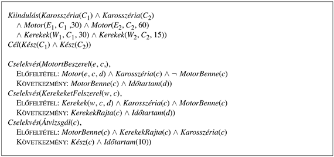
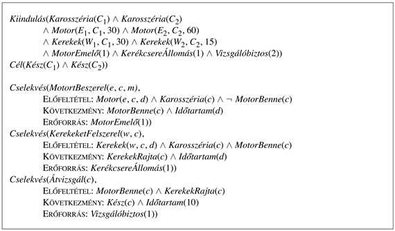
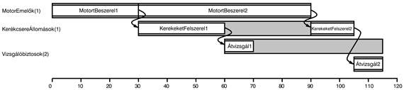

<?xml version="1.0" encoding="UTF-8" standalone="no"?>

<html xmlns="http://www.w3.org/1999/xhtml"><head><meta name="generator" content="DocBook XSL Stylesheets V1.76.1"/></head><body>

<h1 class="title"><a id="id651777"/>12. fejezet - Tervkészítés és cselekvés a való világban</h1>

<em>Ebben a fejezetben láthatjuk, hogy a kifejezőbb reprezentáció és az interaktívabb ágensarchitektúrák hogyan vezetnek a valós világban is használható tervkészítőkhöz.</em>

Az előző fejezet a tervkészítés legalapvetőbb fogalmait, reprezentációit és algoritmusait vezette be. A való világ feladataihoz, mint a Hubble-űrteleszkóp megfigyeléseinek ütemezésére, gyárak működtetésére vagy hadműveletek logisztikai kezelésére jóval összetettebb tervkészítőket használnak. Ezek kiterjesztik az alaptípusokat mind a reprezentációs nyelv, mind pedig a tervkészítés és a környezet együttműködésének szempontjából. Ez a fejezet bemutatja hogyan. A 12.1. alfejezet az idő- és erőforráskorláttal rendelkező tervkészítést mutatja be. A 12.2. alfejezet az előre definiált résztervekhez történő tervkészítést írja le. A 12.3–12.6. alfejezet olyan ágensarchitektúrákat mutat be, melyeket a bizonytalan környezet kezelésére terveztek. A 12.7. alfejezet bemutatja, hogyan tervezzünk, amikor a környezet más ágenseket is tartalmaz.

<h1 class="title"><a id="id651787"/>Idő, ütemezés és erőforrások</h1>

A <code class="code">STRIPS</code> reprezentáció azt írja le, hogy <em>mit</em> csinálnak a cselekvések, de mivel a reprezentáció a szituációkalkuluson alapul, nem tartalmazza, hogy <em>milyen hosszú</em> egy cselekvés, sem azt, hogy <em>mikor</em> következik be, kivéve azt, hogy egy másik cselekvés előtt vagy után jön. Néhány feladatkörben azt szeretnénk tudni, hogy a cselekvések mikor kezdődnek és végződnek. A teherszállítási problémakörben például, azt szeretnénk tudni, hogy egy adott csomagot hordozó repülőgép mikor érkezik, nem csak azt, hogy megérkezik, amikor a repülésnek vége. 

Az alkalmazások egy általános családjának, az <strong>ütemezési feladat</strong>ok (<strong>job shop scheduling</strong>) családjának a lényege az idő. Az ilyen feladatok munkák elvégzését igénylik, melyek mindegyike cselekvések sorozatából áll, ahol minden cselekvés adott időtartamú és bizonyos erőforrásokat igényelhet. A probléma, hogy egy olyan ütemezést határozzunk meg, ami – az erőforráskorlátok figyelembevétele mellett – minimalizálja az összes feladat elvégzéséhez szükséges összidőt.

A 12.1. ábrán egy ütemezési feladatra láthatunk példát. Ez egy nagyon leegyszerűsített autó-összeszerelési feladat. Két munkánk van, a <em>C</em>1 és a <em>C</em>2 autó összeszerelése. Minden munka három cselekvésből áll: a motor beszerelése, a kerekek felszerelése, valamint az eredmény végső ellenőrzése. Először a motort kell berakni (mivel az első kerekek beszerelése megakadályozná, hogy hozzáférjünk a motortérhez), a vizsgálatot pedig értelemszerűen utoljára kell végrehajtani. 

<a id="id651835"/>
<strong>12.1. ábra - A két autó összeszerelését tartalmazó ütemezési feladat. A jelölésben az <em>Időtartam</em>(<em>d</em>) jelentése, hogy egy cselekvés <em>d</em> percet vesz igénybe. A <em>Motor</em>(<em>E</em>1,<em> C</em>1,<em> </em>60) jelentése az, hogy az <em>E</em>1 egy motor, ami a <em>C</em>1 alvázba illeszthető és 60 perc alatt szerelhető be.</strong>

A 12.1. ábrán látható probléma bármely eddig látott tervkészítővel megoldható. A 12.2. ábra (ha a számokkal nem törődünk) a részben rendezett tervkészítő megoldását mutatja. Hogy az inkább egy ütemezési, mintsem egy tervkészítési feladat legyen, minden cselekvéshez meg kell határoznunk, hogy mikor kezdődjön és mikor végződjön. Ez azt jelenti, hogy figyelnünk kell minden cselekvés hosszára, csakúgy, mint a sorrendjére. Az <em>Időtartam</em>(<em>d</em>)<em> </em>jelölés egy cselekvés kapcsán (ahol <em>d</em> csak egy számmal helyettesíthető be) azt jelenti, hogy egy cselekvés elvégzéséhez <em>d</em> percre van szükség.

Ha adott a cselekvések egy részleges rendezése az időtartamokkal, ahogy a 12.2. ábra is mutatja, akkor a <strong>kritikus útvonal módszer </strong>(<strong>critical path method </strong>– <strong>CPM</strong>) felhasználható az egyes cselekvések lehetséges kezdési és befejezési időpontjainak meghatározására. Egy részben rendezett tervben található <strong>útvonal</strong>, cselekvések egy lineárisan rendezett sorozata, ami az <em>Indít-</em>ból indul és a <em>Befejez-</em>ben fejeződik be (például a 12.2. ábra részben rendezett tervében két út található).

A <strong>kritikus útvonal</strong> (<strong>critical path</strong>) az az út, amelynek a teljes ideje a leghosszabb; az útvonal „kritikus”, mert meghatározza a teljes terv hosszát. Más utak rövidítése nem rövidíti a terv egészét, de a kritikus útvonalon lévő bármely cselekvés kezdetének elhalasztása a teljes tervet lassítja. Az ábrán a kritikus útvonal vonalát vastag vonallal jelöljük. Hogy a teljes tervet minimális idő alatt hajtsuk végre, a kritikus útvonal cselekvéseit úgy kell végrehajtani, hogy köztük ne legyen késleltetés. A kritikus útvonalon kívül eső cselekvéseknek van valamennyi mozgásterük — egy időablak, amelyben végrehajthatók. Ezt az időablakot a kezdeti időpont lehető legkorábbi (<em>ES</em>) és a lehető legkésőbbi (<em>LS</em>) értékével definiáljuk. Az <em>LS </em>– <em>ES</em> mérőszámot, a <strong>cselekvés mozgáster</strong>ének (<strong>slack</strong>) nevezzük. A 12.2. ábrán láthatjuk, hogy a teljes terv 85 percet vesz igénybe, a kritikus útvonal minden cselekvésének a mozgástere 0 (ez mindig igaz), és a <em>C</em>1 összeszerelésének minden cselekvése egy 15 perces ablakban indítható. A cselekvések <em>ES</em> és <em>LS</em> idői a probléma <strong>ütemterv</strong>ét (<strong>schedule</strong>) adják.

<a id="id651996"/>
<strong>12.2. ábra - A 12.1. ábrán szereplő ütemezési probléma megoldása. Az ábra tetején a részben rendezett terv megoldása látható. Minden cselekvés hozza a téglalap alján látható, a legkorábbi és a legkésőbbi kezdési időkkel [<em>ES</em>,<em> LS</em>] a bal felső sarokban. A két szám között különbség a cselekvés mozgástere, a 0 mozgásterű cselekvések a kritikus útvonalon vannak, melyeket vastag vonallal jelölünk. Az ábra alján ugyanezen megoldás időrendjét láthatjuk. A szürke téglalapok azt az intervallumot jelölik, ami alatt a cselekvés végrehajtható, feltételezve, hogy a sorrendezési megkötéseket betartjuk. A szürke téglalapok nem felhasznált, nem kitöltött területei a mozgásteret jelölik.</strong>

A következő kifejezések az <em>ES</em> és <em>LS</em> definícióiként szolgálnak, és egyúttal a kiszámításukra szolgáló dinamikus programozási algoritmust is körvonalazzák:

<code class="code"><em>ES</em>(<em>Indít</em>) = 0</code>

<code class="code"><em>ES</em>(<em>B</em>) = max<em>A </em>≺ <em>B</em><em> ES</em>(<em>A) + Időtartam</em>(<em>A</em>)</code>

<code class="code"><em>LS</em>(<em>Befejez</em>) = <em>ES</em>(<em>Befejez</em>)</code>

<code class="code"><em>LS</em>(<em>A</em>) = min<em>A </em>≺ <em>B</em> <em>LS</em>(<em>B</em>)<em> </em>–<em> Időtartam</em>(<em>A</em>)</code>

Az ötlet az, hogy az <em>ES</em>(<em>Indít</em>) értékének 0-ra állításával indítunk. Ezután, amint elérünk egy olyan <em>B</em> cselekvést, hogy minden cselekvés, ami közvetlenül <em>B</em> előtt jön, már rendelkezik <em>ES</em> értékekkel, az <em>ES</em>(<em>B</em>) értéket a közvetlenül megelőző cselekvések közül a legkorábbi befejezési idő maximumára állítjuk be, ahol a legkorábbi befejezési időt úgy definiáljuk, mint a cselekvés kezdési időpontja plusz a cselekvés időtartama. A folyamat addig folytatódik, amíg minden cselekvéshez egy <em>ES</em> értéket rendelünk. Az <em>LS</em> értékeket hasonlóképpen számítjuk ki a <em>Befejez</em> cselekvéstől visszafelé haladva. A részleteket egy későbbi feladat tartalmazza. 

A kritikus útvonal algoritmus komplexitása csak <em>O</em>(<em>Nb</em>), ahol <em>N</em> a cselekvések száma és <em>b</em> az egy cselekvésbe be-, illetve kimenő maximális elágazások száma. (Ennek megértéséhez vegyük észre, hogy az <em>LS</em> és <em>ES</em> számításokat minden cselekvésre csak egyszer hajtjuk végre, és minden számítás legfeljebb <em>b</em> másik cselekvésen megy végig.) Ezért, <em>ha adott a cselekvések egy részben rendezése,</em> a minimális időtartamú ütemezés megtalálása elég könnyedén elvégezhető.

<h2 class="title"><a id="id652184"/>Ütemezés erőforráskorlátokkal</h2>

A valós ütemezési problémákat az <strong>erőforrás</strong>okra (<strong>resource</strong>s) vonatkozó korlátozások jelenléte megbonyolítja. Például egy motornak az autóba szereléséhez egy motoremelőre van szükség. Ha csak egyetlen emelőnk van, akkor nem tudjuk egyszerre beszerelni az <em>E</em>1 motort, a <em>C</em>1 és az <em>E</em>2 motort a <em>C</em>2 autóba, így a 12.2. ábrán bemutatott ütemezés végrehajthatatlan. A motoremelő példa egy <strong>újrahasznosítható erőforrás</strong>ra (<strong>reusable resource</strong>). Az erőforrás foglalt, amíg a cselekvés tart, de újra használhatóvá válik annak befejezése után. Vegyük észre, hogy az újrahasznosítható erőforrásokat nem tudjuk a hagyományos előfeltétel és következmény alakú cselekvésleírásokkal kezelni, mert a rendelkezésre álló erőforrás-mennyiség nem változik, miután egy cselekvést lezártunk.[<a id="id652233" href="#ftn.id652233" class="footnote">118</a>] Ezért kiterjesztjük a leírásunkat, hogy egy <code class="code">ERŐFORRÁS</code>: <em>R</em>(<em>k</em>)-t is tartalmazzon, amelynek jelentése, hogy <em>k</em> egység <em>R</em> típusú erőforrásra van szükség a cselekvéshez. Az erőforrás-szükséglet mind előfeltétel (a cselekvés nem hajtható végre, ha az erőforrás nem érhető el), mind pedig <em>átmeneti</em> következmény, abban az értelemben, hogy az <em>R</em> erőforrás rendelkezésre állása <em>k</em>-val csökken a cselekvés időtartama alatt. A 12.3. ábra mutatja, hogyan lehet a motorbeszerelés problémáját kiterjeszteni, hogy az három erőforrást is tartalmazzon: egy motoremelőt a motorok beszereléséhez, egy kerékállomást a kerekek felszereléséhez és két vizsgálóbiztost. A 12.4. ábra a legrövidebb szerelési idejű megoldást mutatja, ez 115 percet igényel. Ez hosszabb, mint az erőforrás-megkötések nélküli 85 perces ütemezés. Vegyük észre, hogy nincs olyan időpillanat, amikor mindkét vizsgálóbiztosra szükség van, ezért az egyik vizsgálóbiztost azonnal egy termelékenyebb posztra helyezhetjük.

Az erőforrások numerikus mennyiségekként történő leírása mint a <em>Vizsgálóbiztosok</em>(2), a megnevezett entitások használata helyett, mint a <em>Vizsgálóbiztos</em>(<em>I</em>1) és a <em>Vizsgálóbiztos</em>(<em>I</em>2), jó példa a nagyon általánosan használt <strong>aggregáció</strong>s (<strong>aggregation</strong>) technikára. Az aggregáció központi ötlete, hogy egyedi objektumokat csoportosítsunk mennyiségekké, amikor maguk az objektumok nem megkülönböztethetők a cél szempontjából. Az összeszerelési problémánkban nem számít, hogy <em>melyik</em> vizsgálóbiztos vizsgálja az autót, ezért nincs szükség különbségtételre. (Ugyanez az ötlet működik a 3.9. feladat misszionáriusok és kannibálok problémájára.) Az aggregáció a komplexitás csökkentéséhez elengedhetetlen. Vizsgáljuk meg, mi történik, ha egy ütemezés 10 konkurrens <em>Vizsgálat</em> cselekvést tartalmaz, de csak 9 vizsgálóbiztos áll rendelkezésre. Ha a vizsgálóbiztosokat mint mennyiségeket reprezentáljuk, a bukást az algoritmus azonnal detektálja, és visszalép, hogy egy másik ütemezéssel próbálkozzon. Ha a vizsgálóbiztosokat önálló személyekként reprezentáljuk, akkor az algoritmus feleslegesen mind a 10! vizsgálóbiztos-kiosztás kipróbálásához visszalép. 

<a id="id652320"/>
<strong>12.3. ábra - Két autó összeszerelésének ütemezési feladata erőforrásokkal. Egy összeszerelő állomás, egy kerékszerelő-állomás és két vizsgálóbiztos az összes elérhető erőforrás. Az <code class="code">ERŐFORRÁS</code>:<em>r</em> jelölés jelentése, hogy az <em>r</em> erőforrást egy cselekvés végrehajtása alatt használjuk, de a cselekvés befejezése után újra szabad.</strong>

<a id="id652341"/>
<strong>12.4. ábra - A 12.3. ábra erőforrásokat is tartalmazó ütemezési feladatának megoldása. Az ábra bal széle az erőforrásokat sorolja fel, a cselekvések az általuk használt erőforrásokkal egy sorban jelennek meg. Attól függően, hogy melyik összeszerelés használja a motorszerelő-állomást először, két lehetséges ütemezés létezik. Mi az optimális megoldást ábrázoltuk, ami 115 percet vesz igénybe.</strong>

Az előnyök ellenére, az erőforrás-megkötések nagyon megbonyolítják az ütemezési feladatokat azáltal, hogy a cselekvések közé további kölcsönhatásokat vezetnek be. Habár a megkötések nélküli ütemezés a kritikus útvonal módszer felhasználásával könnyű, a legkorábbi befejezési idejű erőforrás-megkötéseket tartalmazó ütemezés megtalálása NP-nehéz. Ez a komplexitás gyakran mind a gyakorlatban, mind az elméletben látható. Az 1963-ban közzétett nagy kihívást jelentő feladat – egy optimális ütemezés megtalálása egy 10 gépet, 10 munkát és 100 cselekvést tartalmazó problémához – 23 évig megoldatlan maradt (Lawler és társai, 1993). Sok megközelítést kipróbáltak, köztük az elágazásos megkötést, a szimulált lehűtést, a tabu keresést, a kényszerkielégítést és számos más, a II. részben szereplő technikát. A legegyszerűbb, de népszerű heurisztika a <strong>minimális tartalék</strong> (<strong>minimum slack</strong>) algoritmus. Ez a cselekvéseket mohó jelleggel ütemezi. Minden iterációban megnézi azokat a cselekvéseket, amelyeknek az összes előzményét már ütemeztük, és azt ütemezi, amelyiknek a legkevesebb tartalék ideje van a legkorábbi lehetséges kezdéshez. Ezután frissíti az <em>ES</em> és <em>LS</em> időértékeket minden egyes érintett cselekvésre, és ezt ismétli. 

A heurisztika ugyanazon az ötleten alapul, mint a legjobban korlátozott változó heurisztika a kényszerkielégítésnél. Ez a gyakorlatban gyakran jól működik, de a mi összeszerelési problémánkra egy 130 perces megoldást ad, nem pedig a 12.4.<em> </em>ábrán bemutatott 115 perceset. 

Az ebben a fejezetben bemutatott megközelítés a „tervezzünk először, ütemezzünk később” megközelítés: azaz a teljes problémát egy <em>tervkészítési</em> fázisra és egy <em>ütemezési</em> fázisra bontjuk. A tervezési fázisban a cselekvéseket részben rendezzük, hogy elérjük a probléma céljait, az ütemezési fázisban pedig az időinformációkat illesztjük a tervhez, ezzel biztosítva, hogy a terv kielégítse az erőforrás- és a határidőkorlátokat. Ez a megközelítés nagyon gyakori a valós idejű gyártási és logisztikai problémákban, ahol a tervkészítési fázist leggyakrabban emberi szakértők végzik. Ellenben, amikor sok erőforrás-megkötés van, adódhat, hogy néhány érvényes terv sokkal jobb ütemezéshez vezet, mint mások. Ebben az esetben, a tervkészítési és ütemezési fázist célszerű <em>integrálni</em> úgy, hogy a részben rendezett tervkészítés során figyelembe vesszük a cselekvések időtartamait és átfedéseit. A 11.<em> </em>fejezetben bemutatott számos tervkészítő algoritmus kiterjeszthető úgy, hogy ezt az információt is kezelje. Például a részben rendezett tervkészítők az okozati kapcsolatok konfliktusainak detektálásához hasonlóan az erőforráskorlát megsértéseit is detektálni tudják. A heurisztikák módosíthatók, hogy a cselekvések teljes költségén túl, a tervek teljes végrehajtási idejét is becsüljék. Ez napjainkban a kutatás egy aktív területe. 

 

[<a id="ftn.id652233" href="#id652233" class="para">118</a>]  Ezzel szemben a<strong> fogyóeszköz-erőforrás</strong>ok (<strong>consumable resource</strong>s), mint az autó-összeszereléshez használt csavarok, az eredeti keretrendszeren belül kezelhetők; lásd 12.2. feladat.

</body></html>
