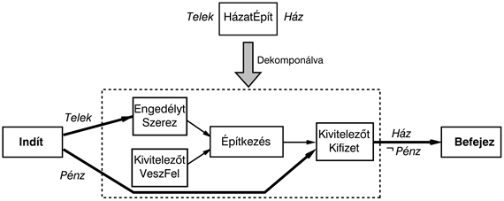
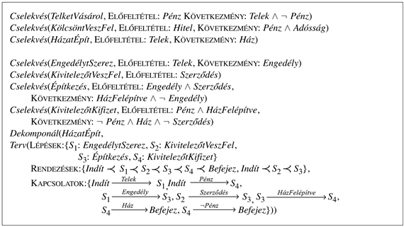
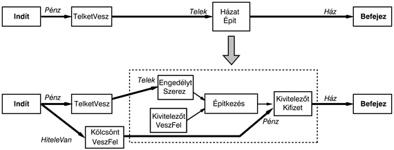
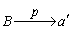
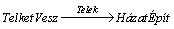
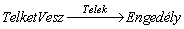
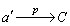
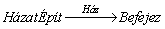
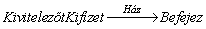
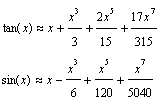

<?xml version="1.0" encoding="UTF-8" standalone="no"?>
<!DOCTYPE html PUBLIC "-//W3C//DTD XHTML 1.1//EN" "http://www.w3.org/TR/xhtml11/DTD/xhtml11.dtd">
<html xmlns="http://www.w3.org/1999/xhtml"><head><meta name="generator" content="DocBook XSL Stylesheets V1.76.1"/></head><body>

<h1 class="title"><a id="id652393"/>Hierarchikus feladatháló tervkészítés</h1>

Az egyik legelterjedtebb módszer a komplexitás kezelésére a <strong>hierarchikus dekompozíció</strong> (<strong>hierarchical decomposition</strong>). Az összetett szoftvereket szubrutinok vagy objektum osztályok hierarchiájából építik fel, a hadseregek különböző egységek hierarchiái, a kormányok és cégek igazgatóságokból, osztályokból és alosztályokból állnak. A hierarchikus struktúra fő előnye, hogy a hierarchia minden szintjén egy számítási feladat, egy hadművelet vagy egy adminisztratív feladat az eggyel alatta lévő szint néhány cselekvésére épül, így e cselekvések megfelelő elrendezése a magasabb szinten lévő feladat megoldásához <em>kis</em> számítási költséggel jár. Másrészről a nem hierarchikus módszerek a feladatot <em>nagy</em>számú, független cselekvésre bontják fel, ami nagy léptékű feladatok esetén egyáltalán nem praktikus. A legjobb esetben – amikor a magas szintű megoldásokhoz mindig kielégítő alacsony szintű megvalósítás tartozik – a hierarchikus megoldások az exponenciális idejű tervkészítő algoritmusokkal szemben lineáris időre vezetnek. 

Ez az alfejezet a <strong>hierarchikus feladatháló</strong>kon vagy <strong>HFH</strong>-kon (<strong>hierarchical task </strong><strong>networks</strong> – <strong>HTN</strong>) alapuló tervkészítési módszert mutatja be. A megközelítésünk ötvözi a részben rendezett tervkészítés (11.3.<em> </em>alfejezet) alapötleteit, illetve a „HFH-tervkészítés” területét. A HFH-tervkészítésben a kiinduló problémát, amely a feladatot írja le, a végrehajtandó feladat egy nagyon magas szintű leírásának tekintjük, például: építsünk egy házat. A terveket <strong>cselekvésdekompozíció</strong>kkal (<strong>action decompositions</strong>) finomítjuk. Minden cselekvésdekompozíció a magas szintű cselekvést alacsonyabb szintű cselekvések részben rendezett halmazára bontja. A cselekvésdekompozíció ezért a cselekvések megvalósítására vonatkozó ismereteket testesíti meg. Például egy ház felépítése az engedélyek megszerzésére, a kivitelező megbízására, az építkezés elvégzésére és a kivitelező kifizetésére redukálható. (A 12.5.<em> </em>ábra egy ilyen dekompozícióra mutat példát.) A folyamat addig folytatódik, amíg csak az <strong>egyszerű cselekvés</strong>ek (<strong>primitive action</strong>s) maradnak a tervben. Az egyszerű cselekvések tipikusan azok a cselekvések, amelyeket az ágens automatikusan végre tud hajtani. Egy általános kivitelezőre a „kertépítés” egy egyszerű cselekvés lehet, mert egyszerűen csak egy kertépítő bevonását jelenti. Egy kertépítő számára azonban az olyan cselekvések tekinthetők egyszerűnek, mint az „ültessen rododendront ide”.

A „tiszta” HFH-tervkészítésben a terveket <em>csak</em> egymást követő cselekvésdekompozíciókkal állítjuk elő. A HFH ezért a tervkészítést a cselekvésleírások <em>konkretizálásának</em> tekinti, szemben az üres cselekvésből kiinduló cselekvésleírás <em>elkészítésének</em> folyamatával (ami az állapottér-keresésre és a részben rendezett tervkészítésre is igaz). Végezetül kiderül, hogy minden <code class="code">STRIPS</code> cselekvésleírás egy cselekvésdekompozícióra írható át (lásd 12.6.<em> </em>feladat), és a részben rendezett tervkészítés a tiszta HFH-tervkészítés egy speciális esetének tekinthető. Bizonyos feladatokra azonban – különösen „szokatlan” konjunktív célokra — a tiszta HFH-nézőpont eléggé természetellenes, így egy <em>hibrid</em> megközelítést részesítünk előnyben, ahol a cselekvésdekompozíciókat mint a részben rendezett tervkészítés tervfinomításait használjuk fel, a nyitott előfeltételek teljesítése és az ütközés feloldásra szolgáló rendezési megkötések hozzáadása mellett. (Annak, hogy a HFH-tervkészítést a részben rendezett tervkészítés kiterjesztésének tekintjük, további előnye, hogy egy teljesen új jelölésrendszer bevezetése helyett ugyanaz használható.) Kezdésként a cselekvések dekomponálását mutatjuk be részletesebben, majd elmagyarázzuk, hogy a részben rendezett tervkészítést hogyan kell módosítani a dekompozíciók kezeléséhez. Végezetül a teljesség, a komplexitás és a használhatóság kérdéseit tárgyaljuk.

<h2 class="title"><a id="id654430"/>A cselekvésdekompozíciók reprezentációja</h2>

A cselekvésdekompozíciós módszerek általános leírásait egy <strong>tervkönyvtár</strong>ban (<strong>plan libary</strong>) tároljuk, ahonnan kinyerhetők és a készülő terv igényeinek megfelelően felhasználhatók. Minden módszer egy <em>Dekomponál</em>(<em>a</em>, <em>d</em>) formájú kifejezés, amelynek jelentése, hogy egy <em>a</em> cselekvés dekomponálható a <em>d</em> tervbe, mely egy – a 11.3.<em> </em>alfejezetben leírtaknak megfelelő – részben rendezett tervként van megadva. 

A házépítés egy szép, konkrét példa, ezért ezt használjuk fel a cselekvésdekompozíció bemutatására. A 12.5.<em> </em>ábra a <em>HázatÉpít</em> cselekvés egy lehetséges dekompozícióját mutatja négy alacsonyabb szintű cselekvésre. A 12.6.<em> </em>ábra néhány cselekvés leírását tartalmazza erre a feladatkörre, valamint a házépítés dekompozícióját, ahogyan az a tervkönyvtárban megjelenne. A könyvtárban más lehetséges dekompozíciók is szerepelhetnek. 

A dekompozíció <em>Indít</em> cselekvése szolgáltatja a terv cselekvéseinek összes olyan előfeltételét, melyet más cselekvés nem állít elő. Ezeket <strong>külső előfeltétel</strong>eknek (<strong>external precondition</strong>s) nevezzük. Példánkban a dekompozíció külső előfeltételei a <em>Telek</em> és a <em>Pénz</em>. Hasonlóképp a <em>Befejez</em> előfeltételei a <strong>külső következmény</strong>ek (<strong>external effect</strong>s). Ezek a terv cselekvéseinek összes olyan következményét jelentik, melyeket más cselekvések nem negálnak. Példánkban a <em>HázatÉpít</em> külső következményei a <em>Ház</em> és a ¬<em>Pénz</em>. Néhány HFH-tervkészítő szintén különbséget tesz az <strong>elsődleges</strong><strong> következmény</strong>ek (<strong>primary effect</strong>s), mint a <em>Ház</em>, és a <strong>másodlagos következmény</strong>ek (<strong>secondary effect</strong>s), mint a ¬<em>Pénz</em> között. Mivel mindkét típusú következmény felhasználása ütközésekhez vezethet más cselekvésekkel, csak az elsődleges következményeket használhatjuk a célok elérésére, ami nagymértékben csökkenti a keresési teret.[<a id="id654561" href="#ftn.id654561" class="footnote">119</a>]

<a id="id654573"/>
<strong>12.5. ábra - A <em>HázatÉpít</em> cselekvés egy lehetséges dekompozíciója</strong>

A dekompozíciónak a cselekvés egy <em>korrekt</em> megvalósításának kell lennie. A <em>d</em> terv egy <em>a</em> cselekvést korrekten valósít meg, ha <em>d</em> egy teljes és konzisztens részben rendezett terv arra a problémára, ahol <em>a</em> előfeltételeiből <em>a</em> következményeit kell elérnünk. Ha a dekompozíció egy helyesen működő részben rendezett tervkészítő futásának eredménye, akkor nyilvánvalóan korrekt.

Bármely magas szintű cselekvéshez a tervkönyvtár számos dekompozíciót tartalmazhat, például a <em>HázatÉpít</em>-nek lehet egy másik dekompozíciója, amely a folyamatot úgy írja le, hogy a házat az ágens saját kezűleg építi kövekből és malterből. Minden dekompozíciónak egy korrekt tervnek kell lennie, de a magas szintű cselekvésleírásban szereplőkön túl további előfeltételeket és következményeket is tartalmazhat. Például a <em>HázatÉpít </em>12.5.<em> </em>ábrán látható dekompozíciója a <em>Telek</em> mellett a <em>Pénz-</em>t is megköveteli, és következménye a ¬<em>Pénz</em>. Másrészről a saját kezű építés nem igényel pénzt, de szükséges hozzá egy felhasználásra váró <em>Kő</em> és <em>Malter</em> készlet, valamint eredménye lehet egy <em>FájósHát</em>.

Mivel egy magas szintű cselekvésnek, mint amilyen a <em>HázatÉpít</em>, számos lehetséges dekompozíciója lehet, elkerülhetetlen, hogy a <code class="code">STRIPS</code> cselekvésleírása elrejtse ezen dekompozíciók néhány előfeltételét vagy következményét. A magas szintű cselekvés előfeltételeit a dekompozícióiban szereplő külső előfeltételek <em>metszete,</em> míg a következményit a dekompozíciók külső következményeinek metszete adja. Másképpen, a magas szintű előfeltételek és következmények garantáltan részhalmazai minden egyszerű implementáció valós előfeltételeinek és következményeinek. 

<a id="id654658"/>
<strong>12.6. ábra - A házépítési probléma cselekvéseinek leírása és a <em>HázatÉpít</em> cselekvés részletes dekompozíciója. A leírások a pénzzel kapcsolatban egy egyszerűsített, az építőkkel kapcsolatban egy optimista nézetet alkalmaznak.</strong>

Az információ elrejtésének két másik formáját is meg kell említenünk. Először, a magas szintű leírás teljes mértékben figyelmen kívül hagyja a dekompozíciók <strong>összes belső követ</strong><strong>kezmény</strong>ét (<strong>internal effect</strong>s). Például a <em>HázatÉpít </em>általunk javasolt dekompozíciójának ideiglenes belső következménye az <em>Engedély</em> és a <em>Szerződés.[<a id="id654696" href="#ftn.id654696" class="footnote">120</a>]</em> Másodszor, a magas szintű leírás nem specifikálja a cselekvésen belüli időintervallumot, ami alatt a magas szintű előfeltételeknek és következményeknek teljesülniük kell. Például a <em>Telek</em> előfeltételnek csak addig kell teljesülnie (a közelítő modellünkben), amíg az <em>EngedélytSzerez </em>nem hajtódik végre, és a <em>Ház</em> csak a <em>KivitelezőtKifizet </em>végrehajtása után igaz.

Az információ elrejtésének ez a módja szükségszerű, ha a hierachikus tervezés célja a komplexitás csökkentése. Szükséges, hogy a magas szintű cselekvésekről anélkül dönthessünk, hogy a számtalan implementációs részlet miatt aggódnánk. Ennek azonban ára van. Konfliktusok léphetnek fel, például egy magas szintű cselekvés belső feltételei, valamint egy másik magas szintű cselekvés belső cselekvései között, miközben a magas szintű leírások alapján nincs mód ezek detektálására. Ennek a problémának komoly hatásai vannak a HFH-tervkészítő algoritmusokra. Dióhéjban, míg a tervkészítő algoritmus az atomi cselekvéseket, mint pontszerű eseményeket kezelheti, a magas szintű cselekvéseknek időbeli kiterjedése van, ami alatt minden mehet tovább.

<h2 class="title"><a id="id654738"/>A tervkészítő módosítása a dekompozíciók kezeléséhez</h2>

Most megmutatjuk, hogyan módosítható a részben rendezett tervkészítő, hogy egy HFH-tervkészítőt is tartalmazzon. Ehhez a részben rendezett tervkészítő állapotátmenet-függvényét (lásd <a class="xref" href="ch11s03.md#ID_468_oldal">„Példa a részben rendezett tervkészítésre”</a> részben) módosítsuk úgy, hogy lehetővé tegye a <em>T</em> aktuális részleges terven a dekompozíciós módszerek alkalmazását. Az új következő terveket úgy alakítjuk ki, hogy először kiválasztunk néhány nem-atomi <em>a</em>’ cselekvést a <em>T</em>-ből, majd a tervkönyvtár minden <em>Dekomponál</em>(<em>a</em>, <em>d</em>) metódusára, amelyben a <em>θ </em>behelyettesítéssel az <em>a</em> és <em>a</em>’ egyenlővé válik, az <em>a</em>’<em>-</em>t behelyettesítjük a <em>d</em>’ = <code class="code">SUBST</code> (<em>θ</em>, <em>d</em>)-vel.

A 12.7.<em> </em>ábrán egy példa látható. Az ábra tetején egy ház megszerzésére vezető <em>T</em> terv található. Az <em>a</em>’ = <em>HázatÉpít </em>magas szintű cselekvést választottuk a dekompozícióra. A 12.5.<em> </em>ábráról a <em>d</em> dekompozíciót választottuk, és a <em>HázatÉpít </em>cselekvést ezzel helyettesítettük. A dekompozíciós lépés által létrehozott <em>Pénz</em> nyitott feltétel teljesítésére a <em>KölcsöntVeszFel </em>járulékos lépést vezettük be. Egy cselekvés helyettesítése annak dekompozíciójával egy kicsit hasonlít a szervátültetéses műtétekhez. Az új résztervet ki kell bontanunk a csomagolásából (az <em>Indít</em> és <em>Befejez</em> lépések közül), be kell illesztenünk és mindent megfelelően le kell zárnunk. Ezt többféleképpen is megtehetjük. Hogy pontosabbak legyünk, minden lehetséges <em>d</em>’ dekompozícióhoz az alábbiakat kell megtennünk:

<ol class="orderedlist"><li class="listitem">
Először is az <em>a</em>’ cselekvést el kell távolítani a <em>T</em> tervből. Ezután a <em>d</em>’ minden <em>s </em>lépésére ki kell választanunk egy cselekvést, amely kitölti az <em>s</em> szerepét, és hozzá kell adnunk a tervhez. Ez lehet az <em>s</em> egy új példányosítása vagy egy meglévő <em>s</em>’ lépés a <em>T</em>-ből, ami <em>s</em>-sel azonos. A <em>Borkészítés</em> cselekvésdekompozíciója például megkövetelheti a <em>TelketVesz</em> cselekvést, de várhatóan használhatjuk ugyanazt a <em>TelketVesz</em> cselekvést, mely már szerepel a tervben. Ezt <strong>részfeladat-megosztás</strong>nak (<strong>subtask sharing</strong>) nevezzük. 
</li></ol>

	A 12.7.<em> </em>ábrán nincsenek megosztási lehetőségek, ezért új cselekvéspéldányokat hoztunk létre. Ha egy cselekvést kiválasztottunk, <em>d</em>’ minden belső előfeltételét átmásoljuk. Például az <em>EngedélytSzerez </em>cselekvés, az építkezés elé rendelt, és létezik egy okozati kapcsolat ezen lépések között, mely szerint az <em>Engedély</em> előfeltétele az <em>Építkezés-</em>nek. Ez lezárja az <em>a</em>’ helyettesítését a <em>dθ</em> példányosításával.

<a id="id654936"/>
<strong>12.7. ábra - Egy magas szintű cselekvés dekompozíciója egy létező tervben. A <em>HázatÉpít</em> cselekvést a 12.5.<em> </em>ábra dekompozíciójával helyettesítjük. A <em>Telek</em> külső előfeltételt a már létező <em>TelketVesz</em>-ből kiinduló okozati kapcsolat biztosítja. A <em>Pénz</em> külső előfeltétel nyitott marad a dekompozíciós lépés után, ezért a <em>KölcsöntVeszFel</em> cselekvést szúrjuk be.</strong>

<ol class="orderedlist"><li class="listitem">
A következő lépés, hogy az eredeti tervben szereplő <em>a</em>’ sorrendezési megkötéseit megfelelően átvezessük a <em>d</em>’ lépéseihez. Először vegyük <em>T B </em>≺<em> a</em>’ alakú sorrendezési megkötéseit. Hogyan kellene <em>B-</em>t rendezni a <em>d</em>’ lépéseinek megfelelően? A legkézenfekvőbb megoldás, hogy <em>B</em> az összes <em>d</em>’<em>-</em>ben szereplő lépés előtt jöjjön, amit úgy érhetünk el, hogy <em>d</em>’ minden <em>Indít </em>≺<em> s</em> alakú megkötését a <em>B </em>≺<em> s</em> megkötéssel helyettesítjük. Másrészről ez a megközelítés túlzottan szigorú lehet! Például a <em>TelketVesz</em> a <em>HázatÉpít</em> előtt kell következzen, de nincsen szükség arra, hogy a <em>TelketVesz</em> a <em>KivitelezőtVeszFel</em> előtt jöjjön a kiterjesztett tervben. Egy túlzottan szigorú rendezés felállítása lehetetlenné teheti néhány megoldás megtalálását. Ezért minden rendezési megkötésre a legjobb megoldás, hogy rögzítsük a megkötés <em>okát</em>. Ha ezután egy magas szintű cselekvést kibontunk, az új rendezési megkötések a lehető leglazábbra vehetők az eredeti megkötés okával összhangban. Ugyanezek a megfontolások alkalmazhatók, amikor az <em>a</em>’<em> </em>≺<em> C</em> alakú megkötéseket helyettesítjük. 
</li></ol>

<ol class="orderedlist"><li class="listitem">
Az utolsó lépés, hogy az okozati kapcsolatokat átvezessük. Ha a<em> </em> az eredeti terv egy okozati kapcsolata volt, helyettesítsük azt egy okozati kapcsolathalmazzal, amely <em>B-</em>ből <em>d</em>’ összes olyan lépéséhez vezet, amelynek előfeltétele a <em>d</em> dekompozíció <em>Indít</em> lépése által előállított <em>p </em>(például <em>d</em>’ összes lépése, melyekre <em>p</em> egy külső előfeltétel). A példában a  okozati kapcsolatot a  kapcsolattal helyettesítjük. (A dekompozícióban szereplő <em>KivitelezőtKifizet</em>,<em> Pénz</em> előfeltétele nyitott feltétellé válik, mert az eredeti tervben nincs olyan cselekvés, ami a <em>Pénz</em>-t biztosítja a <em>HázatÉpít</em>-hez.) Hasonlóképpen a terv összes  okozati kapcsolatát helyettesítsük <em>d</em>’ bármely, a <em>d</em> dekompozíció <em>Vége</em> lépéséhez <em>p-</em>t szolgáltató lépésből <em>C-</em>be mutató okozati kapcsolathalmazzal (például <em>d</em>’ <em>p-</em>t külső következményként tartalmazó lépéséből). Példánkban a  kapcsolatot a  kapcsolattal helyettesítjük. 
</li></ol>

Ez lezárja a részben rendezett tervkészítőknél alkalmazott, a dekompozíciók elkészítéséhez szükséges kiterjesztéseket.[<a id="id655186" href="#ftn.id655186" class="footnote">121</a>]

A részben rendezett tervkészítő algoritmushoz további módosítások szükségesek, mert a magas szintű cselekvések <em>elrejtik az információt </em>a végső elemi megvalósításukról. Nevezetesen az eredeti részben rendezett tervkészítő algoritmus hibával lép vissza, ha az aktuális terv feloldhatatlan ütközést tartalmaz, vagyis ha egy cselekvés ütközik egy okozati kapcsolattal, de nem helyezhető sem elé, sem pedig mögé. (Erre a 11.9.<em> </em>ábra mutat példát.) Másrészről, a magas szintű cselekvések esetén a feloldhatatlan ütközések néha feloldhatók az ütköző cselekvések <em>dekompozíciójával</em> és lépéseik összerendezésével. Erre a 12.8.<em> </em>ábra mutat be egy példát. Így előfordulhat olyan eset, ahol dekompozícióval egy teljes és konzisztens alapterv nyerhető, <em>még akkor is, hogyha nem létezik teljes és konzisztensen magas szintű terv</em>. Ez a lehetőség azt jelenti, hogy egy teljes HFH-tervkészítőnek végig kell tekintenie az eredeti részben rendezett tervkészítőhöz található számos metszési lehetőséget. Egyébként használhatjuk bármely metszési eljárást, remélve, hogy nem hagyunk figyelmen kívül lehetséges megoldást.

<a id="id655210"/>
<strong>12.8. ábra - Az O. Henrik történetből kiragadott <em>Mágusok ajándéka</em> probléma egy inkonzisztens absztrakt tervet mutat, ami azonban dekomponálható egy konzisztens megoldásra. Az (a) ábra a problémát mutatja be: egy szegény házaspárnak csak két értékes tulajdona van. A férfinek egy aranyórája, a nőnek pedig a gyönyörű hosszú haja. Mindketten azt tervezik, hogy ajándékot vásárolnak a másiknak, hogy az boldog legyen. A férfi úgy dönt, hogy az óráját egy ezüstfésűre cseréli be, míg a nő eladja a haját, hogy aranyláncot vegyen az órához. (Feltételezzük, hogy a „Fésűt ad” cselekvés előfeltétele a <em>Haj</em>, mivel ha a feleségnek nincs hosszú haja, a cselekvés nem éri el a kívánt hatást, hogy boldoggá tegye; és hasonlóképpen a „Láncot ad” cselekvésre.) A (b) ábrán szereplő részleges terv inkonzisztens, mert a „Fésűt ad” és „Láncot ad” absztrakt lépések nem sorrendezhetők konfliktus nélkül. (c) Dekomponáljuk a „Fésűt ad” lépést egy „beilleszt terv” metódussal. A dekompozíció első lépésében a férj megszerzi a fésűt, és odaadja feleségének, miközben az órát egy későbbi időpontban adja oda fizetségül. A második lépésben az órát átadja, és a kötelezettséget teljesíti. Egy hasonló módszer dekomponálja a „Láncot ad” lépést. Amíg mindkét odaadó lépést a szállítási lépés elé sorrendezzük, ez a dekompozíció megoldja a feladatot. (Vegyük észre, hogy ez azon múlik, hogy a lánc használata az órához vagy a fésű használata a hajhoz boldogságot okoz még akkor is, ha a tulajdonjogot már elvesztették.)</strong>

<h2 class="title"><a id="id655227"/>Elemzés</h2>

Kezdjük a rossz hírrel: a tiszta HFH-tervkészítés (ahol az egyetlen megengedett tervfinomítás a dekompozíció), <em>a véges állapottér ellenére is,</em> eldönthetetlen! Ez nagyon elszomorítónak tűnhet, mivel a HFH-tervkészítés lényege, hogy növeljük a hatékonyságot. Ez a nehézség azért lép fel, mert a cselekvésdekompozíciók <strong>rekurzív</strong>ak (<strong>recursive</strong>) (például a sétálás implementálható egy lépés megtételével és utána egy sétálással), így a HFH-tervek tetszőlegesen hosszúra nyúlhatnak. Nevezetesen a legrövidebb HFH-megoldás is tetszőlegesen hosszú lehet, így nincs arra lehetőség, hogy a keresést egy megadott idő után leállítsuk. Ennek ellenére azonban legalább három okunk van a bizakodásra:

<ol class="orderedlist"><li class="listitem">
Kizárhatjuk a rekurziót, amit csak nagyon kevés tervkészítési feladat igényel meg. Ebben az esetben az összes HFH-terv véges vagy megszámlálható hosszúságú. 
</li><li class="listitem">
Korlátozhatjuk azon megoldások hosszát, amelyekre kíváncsiak vagyunk. Mivel az állapottér véges, az olyan terv, amelynek több lépése van, mint az állapottér állapotainak száma, <em>mindenképpen</em> tartalmaz ciklust, ami ugyanabba az állapotba többször lép be. Az ilyen HFH-megoldások kizárásával nagyon picit vesztünk, de uraljuk a keresést. 
</li><li class="listitem">
Létrehozhatunk egy hibrid megközelítést, ami a részben rendezett és a HFH-tervkészítőket kombinálja. A részben rendezett tervkészítés önmagában elegendő, hogy eldöntsük, létezik-e terv, így a hibrid feladat is nyilvánvalóan eldönthető. 
</li></ol>

A harmadik megoldással egy kicsit óvatosan kell bánnunk. A részben rendezett tervkészítő különböző módokon tud elemi cselekvéseket összehuzalozni, így olyan megoldásokkal találhatjuk magunkat szembe, amelyek nagyon nehezen érhetők, és amelyeknek nincs meg a HFH-tervek szép hierarchikus rendezése. Egy megfelelő kompromisszum, hogy a hibrid keresést úgy szabályozzuk, hogy a cselekvésdekompozíciókat előnyben részesítjük az új cselekvések hozzáadása előtt, de nem olyan mértékben, hogy tetszőlegesen hosszú HFH-tervek jöjjenek létre, mielőtt egy elemi cselekvést hozzáadnánk. A megvalósítás egyik lehetséges módja egy költségfüggvény alkalmazása, amely engedményt ad a dekompozíció által bevezetett cselekvésekre. Minél nagyobb az engedmény, a keresés annál inkább a tiszta HFH-tervkészítésre hasonlít, és a megoldás annál inkább hierarchikus. A hierarchikus tervek rendszerint sokkal könnyebben végrehajthatók a valós helyzetekben, és könnyebben javíthatók, ha valami elromlik.

A HFH-tervek egy másik fontos tulajdonsága a részfeladat-megosztás lehetősége. Emlékezzünk vissza, hogy a részfeladat-megosztás azt jelenti, hogy ugyanazt a cselekvést használjuk fel a tervdekompozícióban szereplő két különböző lépéshez. Ha megtiltjuk az alfeladat megosztását, akkor a <em>d</em>’ dekompozíció minden példányosítása csak egyetlen módon hajtható végre, nem pedig sokféleképp, így jelentősen szűkítjük a keresési teret. Rendszerint ez a szűkítés időt spórol, és a legrosszabb esetben is az optimálisnál csak kicsivel hosszadalmasabb megoldásra vezet. Néhány esetben azonban több problémát is okozhat. Vegyük például az „élvezzük a mézesheteket, és neveljünk fel egy családot” célt. A tervkönyvtár a „házasodj és menj Hawaiira” tervvel állhat elő az első részcélra és a „házasodj és legyenek gyermekeid” tervvel a másodikra. A részfeladat megosztás nélkül a terv két különálló házasodás cselekvést tartalmaz, ami nagymértékben kerülendő. 

Egy érdekes példa a részfeladat-megosztás költségeire és előnyeire a fordítók optimalizálásánál fordul elő. Vegyük a tan(<em>x</em>) – sin(<em>x</em>) kifejezés fordításának problémáját. A legtöbb fordító ezt két külön szubrutin triviális összeolvasztásával éri el: a tan lépések a sin lépések előtt következnek. Vegyük azonban a sin és tan alábbi Taylor soros közelítéseit:

Egy részfeladat-megosztást tartalmazó HFH-tervkészítő sokkal hatékonyabb megoldásokat készíthet, mert a sin kiszámításának számos lépésére választhatja a tan meglévő lépéseit. A legtöbb fordító nem alkalmazza ezt a fajta procedúrák közötti megosztást, mert az összes lehetséges megosztott terv figyelembevétele túl sok időt venne igénybe. Ehelyett a legtöbb fordító minden résztervet függetlenül készít el, majd esetleg módosítja az eredményt egy <strong>optimalizáló</strong> használatával.

A cselekvésdekompozíció által bevezetett járulékos bonyolítások tudatában miért hisszük mégis, hogy a HFH-tervkészítés hatékony lehet? A komplexitás valós forrásai a gyakorlatban nehezen analizálhatók, ezért vegyünk egy idealizált esetet. Tegyük fel például, hogy egy <em>n</em> cselekvésből álló tervet akarunk létrehozni. Egy nemhierarchikus előrefelé haladó állapottér-tervező költsége, minden állapotban <em>b</em> megengedett cselekvéssel, <em>O</em>(<em>bn</em>). A HFH-tervkészítő esetén feltételezzünk egy nagyon általános dekompozíciós formát: minden nem elemi cselekvésnek, <em>d</em> lehetséges dekompozíciója van, mindegyik a következő alacsonyabb szinten <em>k</em> cselekvésből áll. Tudni szeretnénk, hogy ebben a struktúrában hány különböző dekompozíciós fa létezik. Ha a kiindulási szinten <em>n</em> cselekvés van, akkor a gyökér alatti szintek száma log<em>kn</em>, így a belső dekompozíciós csomópontok száma 1 + <em>k </em> + <em>k2</em> + … <em>k</em>log k n–1 = (<em>n </em>– 1)/(<em>k</em> – 1). Minden belső csomópontnak <em>d</em> lehetséges dekompozíciója van, így összesen <em>d</em>(<em>n</em>–1)/(<em>k</em>–1)<em> </em>lehetséges dekompozíciós fa alkotható. Ezt a képletet megvizsgálva láthatjuk, hogy <em>d</em> alacsonyan tartása nagy <em>k</em> mellett óriási megtakarításokat eredményezhet. Ha <em>b</em> és <em>d</em> összemérhető, akkor gyakorlatilag a nemhierarchikus költség <em>k</em>-adik gyökét vesszük. Másrészről azonban egy kisszámú, de hosszú dekompozíciót tartalmazó tervkönyvtár megalkotása, bár lehetővé teszi bármely probléma megoldását, nem mindig lehetséges. Másképp mondva, a hosszú makrók, amelyek problémák széles körén alkalmazhatók, kiemelten értékesek.

Egy másik és talán jobb ok arra, hogy a HFH-tervkészítő hatékonyságában higgyünk, az, hogy a gyakorlatban működik. A nagyméretű alkalmazásokhoz használt tervkészítők majdnem mindegyike HFH-tervkészítő, mert a HFH-tervkészítés lehetőséget ad az emberi szakértő számára, hogy a komplex feladatok végrehajtásához szükséges elengedhetetlen tudást átadhassák, hogy a nagy tervek kicsi számítási ráfordítással elkészíthetők legyenek. Például a HFH-tervkészítést az ütemezéssel ötvöző O-<code class="code">PLAN</code>-t (Bell és Tate, 1985) arra használták, hogy a Hitachi számára készítsen gyártási terveket. Egy tipikus gyártási sor probléma 350 különböző terméket, 35 összeszerelő gépet és több mint 2000 különböző műveletet tartalmaz. A tervkészítő egy 30 napos ütemezést készít, naponta három 8 órás műszakkal és több millió lépéssel. 

A HFH-tervkészítés kulcsa így egy tervkönyvtár megalkotása, amely a komplex magas szintű cselekvések megvalósításához tartalmazza az ismert módszereket. A könyvtár megalkotásának egyik módja, hogy a problémamegoldások tapasztalataiból <em>tanuljunk</em> módszereket. Egy terv elkészítésének gyötrelmes tapasztalatai után az ágens elmentheti a tervet a könyvtárba mint egy a <em>feladat (task)</em> által definiált magas szintű cselekvés megvalósítási módját. Ily módon az ágens egyre kifinomultabbá válik, ahogy a régi módszerekre alapozva új módszerek épülnek. Ennek a tanulási folyamatnak egyik fontos szempontja, hogy az elkészített módszereket <em>általánosítani</em> tudja, a tervből csak a kulcslépéseket megtartva, azaz a probléma példányainak specifikus részleteit elhagyva (például az építő nevének és címének elhagyása a tervekről). Az ilyen általánosításra alkalmas módszereket a 19.<em> </em>fejezetben mutatjuk be. Számunkra elképzelhetetlen, hogy hasonló mechanizmusok nélkül az emberek olyan kompetensek lehetnek, mint amilyenek.

 

[<a id="ftn.id654561" href="#id654561" class="para">119</a>]  Ez néhány nem várt terv előállítását is megakadályozhatja. Például egy csődeljárás előtt álló személy minden ingó vagyonát eltüntetheti (a ¬<em>Pénz</em> elérésével) egy ház megvásárlásával vagy megépítésével. Ez a terv hasznos, mert az aktuális törvény kizárja az elsődleges lakóhely hitelezők általi lefoglalását (legalábbis az USA-ban – <em>a szerk.</em>).

[<a id="ftn.id654696" href="#id654696" class="para">120</a>]  Az <em>Építkezés</em> negálja az <em>Engedély</em>-t, egyébként ugyanazon engedély több ház megépítéséhez is használható lenne. Sajnos az <em>Építkezés</em> nem zárja le a <em>Szerződés</em>-t, mert előbb a <em>KivitelezőtKifizet</em>-et kell végrehajtanunk.

[<a id="ftn.id655186" href="#id655186" class="para">121</a>]  Vannak további apró módosítások a magas szintű cselekvések konfliktusfeloldásának kezelésére. Az érdeklődő olvasó ezeknek a fejezet végén hivatkozott irodalmakban nézhet utána.

</body></html>
