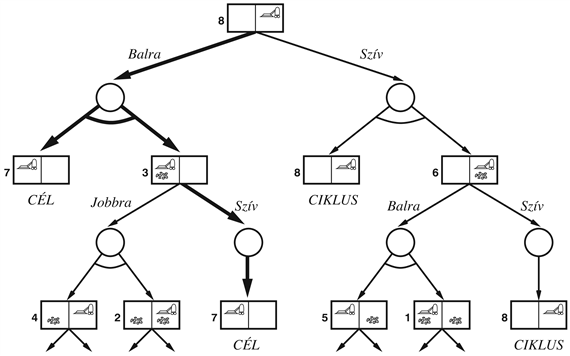
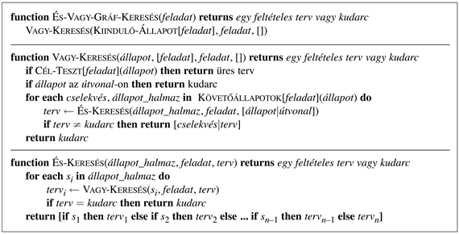
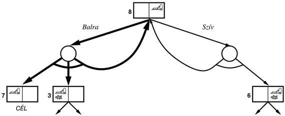
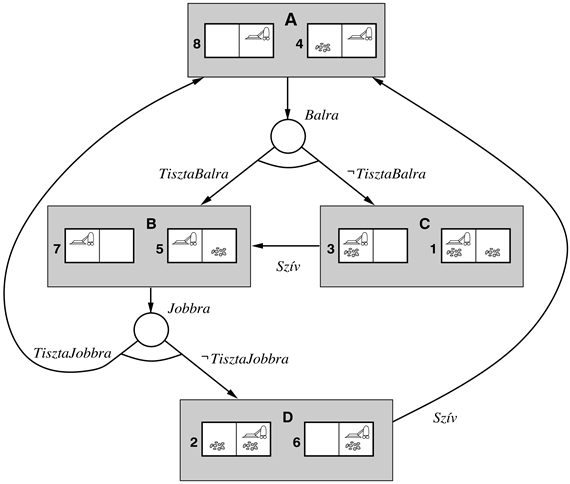

<?xml version="1.0" encoding="UTF-8" standalone="no"?>
<!DOCTYPE html PUBLIC "-//W3C//DTD XHTML 1.1//EN" "http://www.w3.org/TR/xhtml11/DTD/xhtml11.dtd">
<html xmlns="http://www.w3.org/1999/xhtml"><head><meta name="generator" content="DocBook XSL Stylesheets V1.76.1"/></head><body>

<h1 class="title"><a id="id655703"/>Feltételes tervkészítés</h1>

Feltételes tervkészítés a bizonytalanság kezelésének egy módja. Módszere, hogy a terv előre meghatározott pontjain ellenőrzi, hogy valójában mi is történik a környezetben. A feltételes tervkészítés bemutatása a teljesen megfigyelhető környezetek esetén a legegyszerűbb, így ezzel az esettel kezdünk. A részlegesen megfigyelhető eset jóval nehezebb, de egyben jóval érdekesebb is. 

<h2 class="title"><a id="id655709"/>Feltételes tervkészítés teljesen megfigyelhető környezetekben</h2>

A teljes megfigyelhetőség jelentése, hogy az ágens mindig ismeri az aktuális állapotot. Nemdeterminisztikus környezet esetén azonban, az ágens nem képes megjósolni a cselekvéseinek <em>kimenetelét</em>. A feltételes tervkészítő ágens a nemdeterminisztikusságot úgy kezeli, hogy a tervekbe feltételes lépéseket épít be (tervkészítési időben), amelyek ellenőrzik a környezet állapotát (futási időben), hogy a továbbiakról dönthessen. A kérdés tehát, hogyan készíthetők el az ilyen feltételes tervek. 

Példaként a <strong>porszívóvilág</strong> (<strong>vacuum word</strong>) problémakört használjuk, amelynek állapotterét a determinisztikus esetre a <a class="xref" href="ch03s02.md#ID_103_oldal">„Példaproblémák”</a> részben fektettük le. Emlékezzünk vissza, hogy a <em>Balra</em>, a <em>Jobbra</em> és a <em>Szív</em> a rendelkezésre álló cselekvések. Szükségünk lesz néhány propozícióra, hogy definiáljuk az állapotokat: legyen az <em>OttBal </em>(<em>OttJobb</em>) igaz, ha az ágens a bal (jobb) állapotban van, és legyen a <em>TisztaBal </em>(<em>TisztaJobb</em>) igaz, ha a bal (jobb) állapot tiszta.[<a id="id655760" href="#ftn.id655760" class="footnote">122</a>] Az első feladatunk a <code class="code">STRIPS</code> nyelv kiterjesztése, hogy megengedje a nemdeterminisztikusságot. Ennek érdekében megengedjük a cselekvésekben a <strong>diszjunktív következmények</strong>et (<strong>disjunctive effects</strong>), ami azt jelenti, hogy egy cselekvést bármikor végrehajtva annak kettő vagy több különböző kimenetele is lehet. Tegyük fel például, hogy a <em>Balra</em> lépés néha sikertelen. Ekkor a 

<code class="code"><em>Cselekvés</em>(<em>Balra</em>, Előfeltétel:<em>OttJobb</em>, Következmény:<em>OttBal </em>∧ ¬<em>OttJobb</em>)</code>

normál cselekvésleírást módosítanunk kell, hogy diszjunktív következményt is tartalmazzon:

<code class="code"><em>Cselekvés</em>(<em>Balra</em>, Előfeltétel:<em>OttJobb</em>, Következmény:<em>OttBal</em> ∨ <em>OttJobb</em>)	(12.1)</code>

Szintén hasznosnak találjuk a <strong>feltételes következmény</strong>eket (<strong>conditional effect</strong>s), amikor is egy cselekmény következménye függ attól az állapottól, amelyben végrehajtjuk. A feltételes következmények a cselekvés <code class="code">KÖVETKEZMÉNY</code> részében jelennek meg a „<strong>when </strong>&lt;<em>feltétel</em>&gt;: &lt;<em>következmény</em>&gt;” szintaxissal. Például a <em>Szív</em> cselekvés modellezésére a 

<code class="code"><em>Cselekvés</em>(<em>Szív</em>, Előfeltétel:, Következmény:(<em>when</em> <em>OttBal</em>: <em>TisztaBal</em>)</code>

<code class="code"><em>	</em>∧ (<em>when OttJobb</em>: <em>TisztaJobb</em>))]</code>

kifejezést írnánk fel. A feltételes következmények nem vezetik be a nemdeterminisztikusságot, de segítséget nyújtanak annak modellezésében. Tegyük fel például, hogy egy körmönfont porszívónk van, ami néha, ha mozog, piszkot szór a célnégyzetre, de csak akkor, ha az tiszta. Ez a 

<code class="code"><em>Cselekvés</em>(<em>Balra</em>, Előfeltétel:<em>OttJobb</em>, Következmény:<em>OttBal</em></code>

<code class="code">	∨ (<em>OttBal</em> ∧ (<em>when TisztaBal</em>: ¬<em>TisztaBal</em>))</code>

leírással modellezhető, ami mind diszjunktív, mind pedig feltételes.[<a id="id655937" href="#ftn.id655937" class="footnote">123</a>] Hogy feltételes terveket készíthessünk, <strong>feltételes lépés</strong>ekre (<strong>conditional step</strong>s) van szükségünk. Ezeket az „<strong>if</strong> &lt;<em>teszt</em>&gt; <strong>then</strong> <em>terv_A</em> <strong>else</strong> <em>terv_B</em>” szintaxis használatával írjuk le, ahol a &lt;<em>teszt</em>&gt; egy kétértékű függvénye az állapotváltozóknak. Az „<strong>if</strong> <em>OttBal</em> ∧ <em>TisztaBal</em> <strong>then</strong> <em>Jobbra</em> <strong>else</strong> <em>Szív</em>” például a porszívóvilág egy feltételes lépése lehet. Egy ilyen lépés végrehajtása a kézenfekvő módon történik. A feltételes lépések egymásba ágyazásaival a tervek fák lesznek. 

A feltételes tervektől elvárjuk, hogy működjenek, <em>függetlenül attól, hogy valójában a cselekvés mely kimenetele következik be</em>. Ezzel a problémával egy másik köntösbe bújtatva már találkoztunk korábban. A kétszemélyes játékokban (lásd 6.<em> </em>fejezet) olyan lépéseket szeretnénk, amelyek <em>az ellenfél lépéseitől függetlenül</em> győzelemhez vezetnek. A nemdeterminisztikus tervkészítési problémákat ezért gyakran <strong>természet elleni játék</strong>oknak (<strong>games against nature</strong>) nevezik.

Vegyük a porszívóvilág egy speciális példáját. A kiinduló állapotban a robot a tiszta világ jobb oldali négyzetén van. Mivel a környezet teljesen megfigyelhető, az ágens ismeri a teljes <em>OttJobb</em> ∧ <em>TisztaBal</em> ∧ <em>TisztaJobb</em> állapotleírást. A célállapotban a robot a tiszta világ bal oldali négyzetén van. Ez a feladat elég triviális lenne, ha nem a „dupla-Murphy” porszívóval lenne dolgunk, amely néha piszkot hagy maga után, amikor egy tiszta célnégyzetre lép, és néha bepiszkolja a tiszta négyzetet, ha a <em>Szívás</em> cselekvés végrehajtódik. 

Ennek a környezetnek a „játékfáját” a 12.9.<em> </em>ábrán mutatjuk be. A cselekvéseket a robot a fa „állapot” csomópontjaiban hajtja végre, majd a körrel jelölt „valószínűségi” csomópontokban a természet dönt a cselekvés kimeneteléről. A megoldás egy részfa, mely (1) minden levelében egy cél csomópontot tartalmaz, (2) minden „állapot” csomóponthoz egy cselekvést specifikál, és (3) minden „valószínűségi” csomópontban tartalmazza az összes kimenetelhez tartozó ágat. Az ábrán a megoldást vastag vonallal jelöltük, ami a [<em>Balra</em>,<em> </em><strong>if</strong> <em>OttBal </em>∧ <em>TisztaBal </em>∧ <em>TisztaJobb</em> <strong>then</strong> [] <strong>else</strong> <em>Szív</em>] tervnek felel meg. (Mivel állapottér-tervkészítőt használunk, a feltételes lépésekben használt tesztek egyelőre teljes állapot leírások.)

<a id="id656123"/>
<strong>12.9. ábra - A „dupla-Murphy” porszívóvilág keresési fájának első két szintje. Az állapotcsomópontokban és a <code class="code">VAGY</code> csomópontokban cselekvéseket kell választani. A valószínűségi csomópontok, amelyeket körökkel jelöltünk <code class="code">ÉS</code> csomópontok, ahol, ahogy azt a kimenő ágakon szereplő ív is jelöli, minden kimenetelt kezelni kell. A megoldást vastag vonallal jelöltük.</strong>

A játékok pontos megoldásához a <strong>minimax algoritmus</strong>t használjuk (lásd 6.3.<em> </em>ábra). Ehhez a feltételes tervkészítésben tipikusan két módosítás tartozik. Először is, a <code class="code">MAX</code> és a <code class="code">MIN</code> csomópontok <code class="code">VAGY</code> és <code class="code">ÉS</code> csomópontokká válhatnak. Nyilvánvalóan a tervnek minden elért állapotban választania kell <em>valamilyen</em> cselekvést, de kezelnie kell ezen cselekvés <em>minden</em> kimenetelét. Másodszor, az algoritmusnak nemcsak egy lépést kell megadnia, hanem egy feltételes tervet kell készítenie. Egy <code class="code">VAGY</code> csomópontban a terv egyszerűen a választott cselekvés, amelyet bármi követhet. Egy <code class="code">ÉS</code> csomópontban a terv <em>if-then-else</em> lépések egymásba ágyazott sorozata, melyek minden lehetséges kimenetelhez egy résztervet adnak meg. Ezen lépésekben a feltétel vizsgálatokban teljes állapotleírások szerepelnek.[<a id="id656183" href="#ftn.id656183" class="footnote">124</a>]

<a id="id656194"/>
<strong>12.10. ábra - Egy algoritmus a nemdeterminisztikus környezetek által generált <code class="code">ÉS-VAGY</code> gráfok keresésére. Feltételezzük, hogy az <code class="code">ÁLLAPOTÁTMENET</code> függvény a cselekvések egy listáját adja vissza, melyek mindegyike egy lehetséges kimenetel <em>halmazhoz</em> tartozik. A cél egy feltételes terv megtalálása, ami bármilyen körülmények között elér egy célállapotot.</strong>

Formálisan az eddig definiált keresési tér egy <code class="code"><em>és-vagy</em></code> <strong>gráf</strong>. Az <code class="code">ÉS-VAGY</code> gráfok korábban a 7.<em> </em>fejezetben az ítéletlogikai Horn-klóz következtetésben jelentek meg. Itt az ágak logikai következtető lépések helyett cselekvések, de az algoritmus azonos. A 12.10.<em> </em>ábra az <code class="code">ÉS-VAGY</code> gráfok keresésére egy rekurzív, mélységi kereső algoritmust ad meg.

A bemutatott algoritmusban kulcsfontosságú a nemdeterminisztikus tervkészítési problémákban gyakran felmerülő ciklusok kezelésének módja (például ha egy cselekvésnek néha nincs következménye vagy egy helytelen következmény kijavítható). Ha az aktuális állapot azonos a gyökértől idáig vezető útvonal egy állapotával, akkor hibával tér vissza. Ez nem jelenti, hogy <em>nincs</em> megoldás az aktuális állapotból, egyszerűen annyit jelent, hogy <em>van</em> egy nemciklikus megoldás, ami elérhető az aktuális állapot korábbi előfordulásából, így az állapot újabb bekövetkezése kihagyható. Ezzel az ellenőrzéssel biztosítjuk, hogy az algoritmus minden véges állapottér esetén leálljon, mivel minden útvonal célt ér, zsákutcába jut, vagy egy állapot ismétlése. Vegyük észre, hogy az algoritmus nem ellenőrzi, hogy az aktuális állapot egy <em>másik</em> útvonalon szereplő állapot ismétlése-e. A 12.15.<em> </em>feladat ezt a kérdést járja körül.

<a id="id656258"/>
<strong>12.11. ábra - A „tripla-Murphy” porszívóvilág keresési gráfjának első szintje, ahol a ciklusokat explicit megjelöltük. A probléma összes megoldása ciklikus terv.</strong>

Az <code class="code">ÉS-VAGY-GRÁF-KERESÉS</code> által visszaadott tervek feltételes lépéseket tartalmaznak, melyek a teljes állapotleírást megvizsgálják, hogy egy ágról döntsenek. A legtöbb esetben ennél jóval kevésbé kimerítő ellenőrzésekkel is megúszhatjuk. Például a 12.9.<em> </em>ábrán látható megoldás a [<em>Balra</em>, <strong>if</strong> <em>TisztaBal</em> <strong>then</strong> [] <strong>else</strong> <em>Szív</em>] megadással egyszerűen leírható. Ennek oka, hogy a <em>TisztaBal</em> teszt elegendő, hogy az <code class="code">ÉS</code> csomópont állapotait két egyelemű halmazba sorolja úgy, hogy a tesztek után az ágens pontosan ismerje az állapotát. Valójában az egyváltozós if-then-else tesztek sorozata mindig elegendő, hogy állapotok egy halmazát egyelemű halmazokra ossza,<em> feltéve, </em>hogy<em> </em>az állapot teljesen megfigyelhető. Ezért az általánosság teljes megőrzése mellett a teszteket egyváltozós tesztekre szűkíthetjük.

Az utolsó nehézség, ami gyakran felmerül a nemdeterminisztikus feladatkörökben,  a következő: a dolgok nem mindig működnek elsőre, így újra kell próbálkozni. Vegyük például a „tripla-Murphy” porszívó példáját, mely (a korábban bemutatott szokások mellett) néha nem mozdul az utasítás ellenére. Például csakúgy, mint a (12.1)<em> </em>egyenletben, a <em>Balra</em> cselekvés tartalmazhatja a <em>OttBal</em> ∨ <em>OttJobb</em> diszjunktív hatást. Ekkor a [<em>Balra</em>, <strong>if</strong> <em>TisztaBal</em> <strong>then</strong> [] <strong>else</strong> <em>Szív</em>] terv már nem garantált, hogy működik. A 12.11.<em> </em>ábra a keresési gráf egy részletét mutatja. Tisztán látható, hogy a továbbiakban nincsenek ciklusmentes megoldások, és az <code class="code">ÉS-VAGY-GRÁF-KERESÉS</code> hibával térne vissza. Létezik azonban egy <strong>ciklikus megoldás</strong> (<strong>cyclic solution</strong>), ami addig próbálgatja a <em>Balra</em> lépést, mígnem egyszer működik. Ez a megoldás könnyebben kifejezhető, ha a terv egy részét egy <strong>címké</strong>vel (<strong>label</strong>) jelöljük meg, és a terv ismételgetése helyett erre a címkére hivatkozunk. Így a ciklikus megoldásunk 

<code class="code">[<em>L</em>1 : <em>Balra</em>, <em>if</em> <em>OttJobb</em> <em>then</em> <em>L</em>1 <em>else</em> <em>if TisztaBal </em><em>then</em> [] <em>else</em> <em>Szív</em>]</code>

alakú. (A „<strong>while</strong> <em>OttJobb</em> <strong>do</strong> <em>Balra</em>” kifejezés egy jobb szintaxis a terv ciklikus részére.) Az <code class="code">ÉS-VAGY-GRÁF-KERESÉS</code>-ben szükséges módosításokat a 12.16.<em> </em>feladat dolgozza fel. A megvalósítás kulcsa, hogy az állapottérben egy <em>L</em> állapotba visszalépő hurok a tervben egy arra a pontra visszamutató hurkot jelent, ahol az <em>L</em> állapotba vezető résztervet végrehajtjuk.

Így már képesek vagyunk feltételeket és ciklusokat tartalmazó programokhoz hasonlatos összetett tervek létrehozására. Sajnos ezek a ciklusok <em>végtelen</em> ciklusok lehetnek. Például a tripla-Murphy világ cselekvés reprezentációjában a semmi jelentése, hogy a <em>Balra</em> szükségszerűen sikeres. A ciklikus tervek ezért kevésbé előnyösek, mint a ciklus nélküliek, de megoldásnak tekinthetők, amennyiben minden levél egy célállapot, és a terv minden pontjából elérhető egy levél.

<h2 class="title"><a id="id656481"/>Feltételes tervkészítés részlegesen megfigyelhető környezetekben</h2>

Az előző alfejezet teljesen megfigyelhető környezetekkel foglalkozott, amelyek előnye, hogy a feltételes ellenőrzések bármit kérdezhetnek, és biztosak lehetnek a választ kapnak. A valódi világban a részleges megfigyelhetőség jóval gyakoribb. Egy részlegesen megfigyelhető tervkészítési feladat kiinduló állapotában az ágens csak bizonyos dolgokat tud az aktuális állapotról. Ennek a helyzetnek a legegyszerűbb modellezése, ha a kiinduló állapotról annyit mondunk, hogy egy <strong>állapothalmaz</strong>ba tartozik. Az állapothalmaz az ágens kiinduló <strong>hiedelmi állapot</strong>át (<strong>belief state</strong>) írja le.[<a id="id656501" href="#ftn.id656501" class="footnote">125</a>]

Tegyük fel, hogy a porszívóvilág ágens tudja, hogy a jobb oldali négyzeten van, és az tiszta, de nem tudja érzékelni a piszok jelenlétét vagy hiányát a többi négyzeten. Ekkor, <em>legjobb ismeretei szerint</em> két állapotban lehet: a bal oldali négyzet vagy piszkos, vagy tiszta. Ezt a hiedelmi állapotot a 12.12.<em> </em>ábrán <em>A</em>-val jelöltük. Az ábra a „váltakozó dupla-Murphy” porszívóvilág <code class="code">ÉS-VAGY</code> gráfjának egy részét mutatja be, melyben a tiszta négyzetet elhagyó ágens piszkot hagyhat maga után.[<a id="id656523" href="#ftn.id656523" class="footnote">126</a>] Ha a világ teljesen megfigyelhető volna, az ágens egy „Mozogj balra és jobbra, és szívd fel a piszkot, amennyiben találsz, amíg mindkét kocka tiszta nem lesz, és a bal oldali kockán vagyok” formájú ciklikus megoldást készíthetne (lásd 12.16.<em> </em>feladat). Sajnos csak lokális szemétérzékeléssel ez a terv végrehajthatatlan, hiszen a „mindkét kocka tiszta” teszt igazságértéke nem határozható meg.

Figyeljük meg az <code class="code">ÉS-VAGY</code> gráf felépítését. Az <em>A</em> hiedelmi állapotból a <em>Balra</em> mozgás kimenetelét mutatjuk. (A többi cselekvésnek nincs értelme.) Mivel az ágens piszkot hagyhat maga után, a két kiinduló világból négy lehetséges világ adódhat, ahogy az a <em>B</em> és <em>C</em> állapotokban látható. A rendelkezésre álló érzékelő információk alapján a világ két különálló hiedelmi állapotra osztható.[<a id="id656553" href="#ftn.id656553" class="footnote">127</a>] A <em>B</em>-ben, az ágens tudása a <em>TisztaBal</em>, míg <em>C</em>-ben a ¬<em>TisztaBal</em>. A piszok feltakarítása <em>C</em>-ben az ágenst a <em>B</em>-be mozgatja. A <em>B</em>-ből a jobbra mozgás vagy hagy piszkot maga után, vagy nem, így az ágensnek azon tudása alapján, hogy <em>TisztaJobb</em> igaz (vissza az <em>A</em>-ra) vagy hamis (<em>D</em> hiedelmi állapot), ismét négy lehetséges világ adódik.

Összegezve a nemdeterminisztikus, részben megfigyelhető környezetek a hiedelmi állapotok egy <code class="code">ÉS-VAGY</code> gráfját eredményezik. Ebből adódóan feltételes tervek találhatók pontosan ugyanazon algoritmusokkal, mint a teljesen megfigyelhető esetben, nevezetesen az <code class="code">ÉS-VAGY-GRÁF-KERESÉS</code>-sel. Ez abból is könnyen megérhető, ha belátjuk, hogy az ágens <em>hiedelmi</em> állapota <em>mindig</em> teljesen megfigyelhető, azaz mindig tudja, hogy mit tud. A „hagyományos” teljesen megfigyelhető problémamegoldás csak egy speciális eset, melyben minden hiedelmi állapot egy egyelemű halmaz, pontosan egy fizikai állapottal. 

<a id="id657787"/>
<strong>12.12. ábra - A „váltakozó dupla-Murphy” porszívóvilág <code class="code">ÉS-VAGY</code> gráfjának egy részét mutatja be, melyben a tiszta négyzetet elhagyó ágens piszkot hagyhat maga után. Az ágens nem tudja érzékelni a más négyzetben levő piszkot.</strong>

Ezzel készen vagyunk? Nem egészen! Még meg kell határoznunk, hogy hogyan reprezentáljuk a hiedelmi állapotokat, hogyan működik az érzékelés, és hogy ebben az új helyzetben hogyan írjuk le a cselekvéseket. 

A hiedelmi állapotok esetén alapvetően három választásunk van:

<ol class="orderedlist"><li class="listitem">
 Teljes állapotleírások halmazai. Például a 12.12.<em> </em>ábra kiinduló hiedelmi állapota az 
</li></ol>

<code class="code">{(<em>OttJobb</em> ∧ <em>TisztaJobb</em> ∧ <em>TisztaBal</em>), (<em>OttJobb</em> ∧ <em>TisztaJobb</em> ∧ ¬<em>TisztaBal</em>)}</code>

Ezzel a leírással könnyű dolgozni, de nagyon költséges: ha <em>n</em> kétértékű ítéletállítás definiál egy állapotot, akkor a hiedelmi állapot <em>O</em>(2n) fizikai állapotleírást tartalmazhat, melyek mindegyike <em>O</em>(<em>n</em>) méretű. Ha az ágens az ítéletállításoknak csak egy töredékét ismeri, exponenciálisan nagy hiedelmi állapotok adódnak — minél kevesebbet tud, annál több lehetséges állapotban lehet. 

<ol class="orderedlist"><li class="listitem">
Logikai mondatok, melyek pontosan leírják a hiedelmi állapotban lehetséges világok halmazát. Például a kiinduló állapot az
</li></ol>

<code class="code"><em>OttJobb</em> ∧ <em>TisztaJobb</em></code>

formában adható meg. Nyilvánvaló, hogy bármely hiedelmi állapot pontosan befoglalható egyetlen logikai mondatba. Ha akarjuk, az összes konjuktív állapotleírás diszjunkcióját vehetjük, de a példánk mutatja, hogy ennél tömörebb mondatok létezhetnek.

Az általános logikai mondatok egyik hátulütője, hogy mivel sok ekvivalens, de különböző logikai mondat írhatja le ugyanazt a hiedelmi állapotot, az ismétlődő állapotok ellenőrzése általános tételbizonyító képességeket vár el a gráfkereső algoritmustól. Ezért a mondatok egy <em>kanonikus</em> reprezentációját szeretnénk, amelyben minden hiedelmi állapot pontosan ugyanannak a mondatnak felel meg.[<a id="id657887" href="#ftn.id657887" class="footnote">128</a>] Egy ilyen reprezentáció, azaz ítéletállítások nevei alapján rendezett literálok konjukcióját használja, melynek egy példája a ¬<em>OttJobb</em> ∧ <em>TisztaJobb</em>. Ez a 11.<em> </em>fejezet <strong>nyílt világ feltételezés</strong>ében (<strong>open-world assumption</strong>) egy egyszerű állapotleírás. Nem minden logikai mondat írható fel ilyen alakban (például nincs mód az <em>OttBal</em> ∨ <em>TisztaJobb</em> felírására), de számos probléma kezelhető.

<ol class="orderedlist"><li class="listitem">
<strong>Tudás ítéletállítás</strong>ok (<strong>knowledge proposition</strong>s), amelyek az ágens ismereteit írják le. (Ugyanezt lásd a 7.7.<em> </em>alfejezetben.) A kiinduló állapotunk: 
</li></ol>

<code class="code"><em>K</em>(<em>OttJobb</em>) ∧ <em>K</em>(<em>TisztaJobb</em>)</code>

ahol <em>K</em> jelentése „tudja” és <em>K</em>(<em>P</em>) jelentése, hogy az ágens tudja, hogy <em>P</em> igaz.[<a id="id657995" href="#ftn.id657995" class="footnote">129</a>] A tudás ítéletállításokkal zárt világ feltételezést használunk, azaz ha egy állítás nem jelenik meg a listában, akkor hamisnak feltételezzük. Például a ¬<em>K</em>(<em>TisztaBal</em>) és a ¬<em>K</em>(¬<em>TisztaBal</em>) implicit szerepelnek a fenti mondatban, így az rögzíti a tényt, hogy az ágens érzéketlen a <em>TisztaBal</em> igazságértékére.

Kimutatható, hogy a második és harmadik lehetőségek durván azonosak, de mi a harmadik tudás, az ítéletállítás lehetőséget használjuk, mert ez az érzékelés egy erősebb leírását adja, és mert már tudjuk, hogy hogyan írhatunk a <strong>zárt</strong><strong> </strong><strong>világ feltételezés</strong> (<strong>closed-world assumption</strong>) mellett <code class="code">STRIPS</code> kifejezéseket.

<h3 class="title">Fontos</h3>
Mindkét esetben, minden ítéletszimbólum háromféleképpen jelenhet meg: lehet pozitív, negált vagy ismeretlen. Ezért így pontosan 3n lehetséges hiedelmi állapot adható meg. A hiedelmi állapotok halmaza így a hatványhalmaza (az összes részhalmaz halmaza) a fizikai állapotoknak. Összesen 2n fizikai állapot van, ezért 2^2n<em> </em>hiedelmi állapot, ami sokkal több, mint 3n, így a 2. és 3. választás eléggé korlátozottan alkalmas a hiedelmi állapotok leírására. Ez jelenleg használhatatlannak tűnik, hiszen <em>bármely séma</em>,<em> ami képes minden lehetséges hiedelmi állapot reprezentálására</em>, <em>O</em>(log2(2^2n)) = <em>O</em>(2n) <em>bitet igényel</em>,<em> hogy legrosszabb esetben mindegyiket leírhassa</em>. A mi egyszerű sémánk csak <em>O</em>(<em>n</em>) bitet igényel a hiedelmi állapotok leírásához, mert a kifejezőképességet a tömörségre cseréltük. Nevezetesen, ha egy cselekvés megjelenik, amelynek az előfeltételei ismeretlenek, akkor az eredményként kapott hiedelmi állapot nem lesz pontosan reprezentálható, és a cselekvés kimenetele ismeretlen lesz.

Most arról kell döntenünk, hogy az érzékelés hogyan működik. Itt két választásunk van. Használhatunk <strong>automatikus érzékelés</strong>t (<strong>automatic sensing</strong>), ami annyit tesz, hogy az ágens minden időlépésben az összes elérhető érzetet megkapja. A 12.12.<em> </em>ábrán látható példa a helyzet és a helyi tisztaság meghatározására automatikus érzékelést feltételez. Használhatunk ellenben <strong>aktív érzékelés</strong>t (<strong>active sensing</strong>), ami annyit jelent, hogy az érzékelt információk csak megadott <strong>érzékelési cselekvés</strong>ek (<strong>sensory action</strong>s), (mint <em>TisztaságEllenőrzés</em> és <em>PozícióEllenőrzés</em>) végrehajtásával nyerhetők. Az érzékelési típusokat sorban tárgyalni fogjuk. 

Most használjunk tudás állításokat a cselekvések leírásához. Tegyük fel, hogy az automatikus helyi tisztaságérzékeléssel felruházott váltakozó-dupla-Murphy világ problémában az ágens <em>Balra</em> lép. Az erre a világra vonatkozó szabályoknak megfelelően az ágens hagy, vagy talán nem hagy piszkot maga után, ha a négyzet tiszta volt. Mint <em>fizikai</em> következmény, ez <em>diszjunktív</em> lenne, de mint <em>tudás</em> következmény ez egyszerűen törli az ágens <em>TisztaJobb</em> tudását. Emellett az ágens a helyi piszokérzékelés miatt így vagy úgy tudni fogja, hogy vajon a <em>TisztaBal</em> igaz-e, és tudni fogja, hogy a pozíciója <em>OttBal</em>:

<code class="code"><em>Cselekvés</em>(<em>Balra</em>, Előfeltétel:<em>OttJobb</em>, </code>

<code class="code">	Következmény:<em>K</em>(<em>OttBal</em>) ∧ ¬<em>K</em>(<em>OttJobb</em>) ∧</code>

<code class="code">	<em>when TisztaJobb</em>: ¬<em>K</em>(<em>TisztaJobb</em>) ∧</code>

<code class="code">	<em>when TisztaBal</em>:<em> K</em>(<em>TisztaBal</em>) ∧</code>

<code class="code">	 <em>when </em>¬<em>TisztaBal</em>:<em> K</em>(¬<em>TisztaBal</em>)			(12.2)</code>

Vegyük észre, hogy az előfeltételek és a <strong>when</strong> feltételek egyszerű állítások és nem tudás állítások. Ez úgy van, ahogy lennie kell, hiszen a cselekvések kimenetele függ az aktuális világtól, de hogyan ellenőrizhetnénk ezen feltételek igazságértékét csupán a hiedelmi állapot alapján? Ha az ágens az aktuális hiedelmi állapotban <em>tudja</em> mondjuk a <em>K</em>(<em>OttJobb</em>)<em> </em>állítást, akkor az állításnak igaznak kell lennie az aktuális fizikai állapotban, így egyben a cselekvés is alkalmazható. Ha az ágens nem ismeri az állítást (például <em>TisztaBal</em> az <strong>if</strong> feltételt), akkor a hiedelmi állapotnak tartalmaznia kell olyan világokat, melyekben a <em>TisztaBal</em> igaz, és olyan világokat, amelyekben a <em>TisztaBal</em> hamis. Pontosan ez az, ami miatt egy cselekvés többszörös hiedelmi állapotokat eredményez. Így, ha a kiinduló állapot a  (<em>K</em>(<em>OttJobb</em>) ∧ <em>K</em>(<em>TisztaJobb</em>)), akkor a <em>Balra</em> lépés után a (<em>K</em>(<em>OttBal</em>) ∧ <em>K</em>(<em>TisztaBal</em>))<em> </em>és a (<em>K</em>(<em>OttBal</em>) ∧ <em>K</em>(¬<em>TisztaBal</em>)) a két lehetséges hiedelmi állapot. Mindkét esetben ismert a <em>TisztaBal</em> értéke, így a <em>TisztaBal</em> teszt felhasználható a tervben. 

Aktív érzékelés (mint az automatikus érzékelés ellentettje) esetén, az ágens csak kérésre kap új megfigyeléseket. Így a <em>Balra</em> lépés után az ágens nem tudja, hogy a bal oldali négyzet piszkos-e, ezért a (12.2)<em> cselekvésleíró </em>egyenletben az utolsó két feltételes következmény már nem jelenik meg. Az ágens a <em>TisztaságEllenőrzés</em> cselekvéssel derítheti ki, hogy a négyzet piszkos-e:

<code class="code"><em>Cselekvés</em>(<em>TisztaságEllenőrzés</em>, Következmény: <em>when</em> <em>OttBal</em> ∧ <em>TisztaBal</em>:<em> K</em>(<em>TisztaBal</em>) ∧</code>

<code class="code">			<em>when OttBal</em> ∧ ¬<em>TisztaBal</em>:<em> K</em>(¬<em>TisztaBal</em>) ∧</code>

<code class="code">			<em>when OttBal</em> ∧ <em>TisztaJobb</em>:<em> K</em>(<em>TisztaJobb</em>) ∧	</code>

<code class="code">			<em>when OttBal</em> ∧ ¬<em>TisztaJobb</em>:<em> K</em>(¬<em>TisztaJobb</em>)		(12.3)</code>

Könnyű megmutatni, hogy aktív érzékelés esetén a <em>Balra </em>lépéssel követett <em>TisztaságEllenőrzés</em> cselekvés ugyanazt a két hiedelmi állapotot eredményezi, amit az automatikus érzékelés esetén a <em>Balra</em> adott. Aktív érzékelés esetén a fizikai cselekvések egy hiedelmi állapotot mindig egyetlen követő hiedelmi állapotra képeznek le. A többszörös hiedelmi állapotok csak az érzékelő cselekvések által jöhetnek létre, melyek specifikus tudást adnak, s ezért lehetővé teszik a feltételvizsgálatok használatát a tervekben. 

Az eddigiekben az állapottér <code class="code">ÉS-VAGY</code> keresésén alapuló feltételes tervkészítésre mutattunk be egy általános megközelítést. Ez a megközelítés néhány tesztproblémán elég hatékonynak bizonyult, de más feladatokra alkalmatlan. Bizonyítható, hogy a feltételes tervkészítés nagyobb algoritmikus komplexitású, mint a hagyományos. Emlékezzünk vissza, hogy az <em>NP</em> osztály definíciója alapján egy megoldásról ellenőrizhető, hogy polinomiális idejű-e. Ez a hagyományos tervekre (legalábbis a polinomiális méretűekre) igaz, így a hagyományos tervkészítés az <em>NP</em> osztályba tartozik. A feltételes tervkészítés esetén egy jelöltre ellenőrizni kell, hogy az <em>összes</em> lehetséges állapotra a tervben létezik-e <em>valamilyen,</em> a célt kielégítő útvonal. Az „összes/valamilyen” összeállítás nem ellenőrizhető polinomiális időben, így a feltételes tervkészítés nehezebb, mint <em>NP</em>. Ez csak úgy kerülhető el, hogy a tervkészítési fázisban figyelmen kívül hagyunk néhány lehetséges eshetőséget, és ezeket csak akkor kezeljük, ha valójában fellépnek. A következő alfejezetben ezt a megközelítést elemezzük. 

 

[<a id="ftn.id655760" href="#id655760" class="para">122</a>]  Nyilvánvalóan az <em>OttJobb</em> akkor és csak akkor igaz, ha a ¬<em>OttBal</em> igaz, és fordítva. A két állítás használatának oka főként az olvashatóság javítása.

[<a id="ftn.id655937" href="#id655937" class="para">123</a>]  A <strong>when</strong> <em>TisztaBal</em>:<em> </em>¬<em>TisztaBal</em> feltételes következmény egy kicsit furcsának tűnhet. Emlékezzünk vissza azonban, hogy itt a <em>TisztaBal</em> a cselekvés <em>előtti,</em> míg a ¬<em>TisztaBal</em> a cselekvés végrehajtása <em>utáni</em> helyzetre vonatkozik.

[<a id="ftn.id656183" href="#id656183" class="para">124</a>]  Az ilyen terveket <strong>case</strong> szerkezettel is leírhatnánk.

[<a id="ftn.id656501" href="#id656501" class="para">125</a>]  Ezeket a fogalmakat a 3.6. alfejezetben vezettük be, így az olvasó ezt átismételheti a továbblépés előtt.

[<a id="ftn.id656523" href="#id656523" class="para">126</a>]  A kisgyermekes szülők jól ismerhetik ezt a jelenséget. Tisztelet a kivételnek.

[<a id="ftn.id656553" href="#id656553" class="para">127</a>]  Vegyük észre, hogy ezek nem aszerint kerülnek osztályzásra, hogy az ágens piszkot hagy-e maga után, amikor mozdul. A hiedelmi állapottérbeli elágazásokat a különböző tudáslehetőségek, és nem a különböző fizikai kimenetelek okozzák.

[<a id="ftn.id657887" href="#id657887" class="para">128</a>]  Az általános ítéletlogikai mondatok legjobb kanonikus reprezentációja a <strong>bináris döntési diagram</strong> (<strong>binary</strong><strong> decision diagram</strong>) vagy <strong>BDD </strong>(Bryant, 1992).

[<a id="ftn.id657995" href="#id657995" class="para">129</a>]  Ez a jelölés ugyanaz, mint amit a 7. fejezetben az áramköralapú ágenseknél használtunk. Néhány szerző ezt a „tudja, hogy <em>P</em> igaz-e” értelemben használja. A két értelmezés közötti fordítás kézenfekvő.

</body></html>
