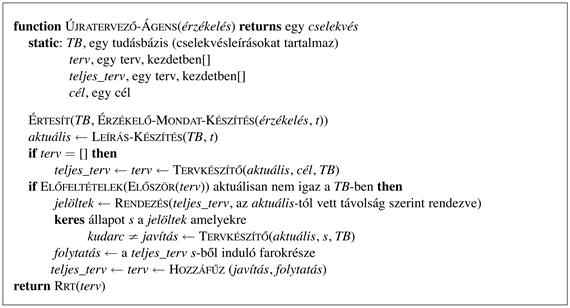

<?xml version="1.0" encoding="UTF-8" standalone="no"?>
<!DOCTYPE html PUBLIC "-//W3C//DTD XHTML 1.1//EN" "http://www.w3.org/TR/xhtml11/DTD/xhtml11.dtd">
<html xmlns="http://www.w3.org/1999/xhtml"><head><meta name="generator" content="DocBook XSL Stylesheets V1.76.1"/></head><body>

<h1 class="title"><a id="id658482"/>Végrehajtás monitorozása és újratervezése</h1>

<a id="ID_520_521_oldal"/>
A <strong>végrehajtás-monitorozó</strong> (<strong>execution monitoring</strong>) ágens érzékelőivel ellenőrzi, hogy minden a terv szerint megy-e. Murphy törvénye alapján az egereknek, embereknek és a feltételes tervkészítő ágenseknek még a legjobban elkészített tervei is gyakran sikertelenek. A probléma a nem korlátos nemdeterminisztikusság, azaz néhány váratlan körülmény mindig felmerül, melyre az ágens cselekvés leírásai helytelenek. A valós környezetekben ezért a végrehajtás-monitorozás elengedhetetlen. Kétféle végrehajtás-monitorozást veszünk számba: az egyszerű, de gyenge <strong>cselekvésmonitorozás</strong>t (<strong>action monitoring</strong>), ahol az ágens a környezet vizsgálatával ellenőrzi, hogy a következő cselekvés működni fog, és az összetettebb, de hatékonyabb <strong>tervmonitorozás</strong>t (<strong>plan monitoring</strong>), melyben az ágens a terv teljes hátralevő részét ellenőrzi. 

Az <strong>újratervező</strong> (<strong>replanning</strong>) ágens tudja, hogy váratlan események esetén mit kell tennie: újra meghívja a tervkészítőt, hogy a cél eléréséhez egy új tervet biztosítson. Annak elkerülésére, hogy túl sok időt töltsünk tervkészítéssel, ez rendszerint a régi terv javításával történik, azaz utat keresünk a fennálló nem várt állapotból vissza, a meglévő tervhez. 

Példaként térjünk vissza a 12.9.<em> </em>ábra dupla-Murphy porszívóvilágához. Ebben a világban egy tiszta cellára lépés néha bepiszkolja azt. De mi történik, ha az ágens ezt nem tudja vagy nem foglalkozik vele? Akkor egy nagyon egyszerű megoldással áll elő: [<em>Balra</em>]. Ha a terv végrehajtásánál érkezéskor nem történik piszkítás, akkor az ágens a cél elérését detektálja. Ellenkező esetben azonban, mivel az implicit <em>Befejez</em> lépés <em>TisztaBal</em> előfeltétele nem teljesül, az ágens új tervet készít: [<em>Szív</em>]. Ennek a tervnek a végrehajtása mindig sikeres.

A végrehajtás-monitorozás és újratervezés együttesen egy általános stratégia, ami mind a teljesen, mind pedig a részben megfigyelhető környezetekre alkalmazható a tervkészítési reprezentációk széles körén, beleértve az állapottér-, a részben rendezett és a feltételes terveket. A 12.13.<em> </em>ábra az állapottér-tervkészítésre mutat be egy egyszerű megközelítést. A tervkészítő ágens egy céllal indít, és kiinduló tervet készít ennek eléréséhez. Ellentétben más tervkészítő ágensekkel, az újratervező ágens követi mind a hátralevő, még végrehajtatlan <em>terv</em> részletet, valamint a teljes eredeti tervet <em>teljes_terv-</em>et. <strong>Cselekvésmonitorozás</strong>t (<strong>action monitoring</strong>) használ: a <em>terv</em> következő cselekvésének végrehajtása előtt az ágens megvizsgálja az érzékelőit, hogy megbizonyosodjon arról, hogy a terv előfeltételei nem váltak-e váratlanul kielégítetlenné. Ha igen, akkor az ágens egy cselekvéssorozat újratervezésével megpróbál a <em>teljes_terv</em> egy pontjára visszajutni.

<a id="id658582"/>
<strong>12.13. ábra - Egy cselekvésmonitorozó és -újratervező ágens. Ez szubrutinként a <code class="code">TERVKÉSZÍTŐ</code> teljes állapottér tervkészítő algoritmust használja. Ha a következő cselekvés előfeltételei nem teljesülnek, az ágens a <em>teljes_terv</em> lehetséges <em>p</em> pontjain iterál olyat keresve, amelyhez a <code class="code">TERVKÉSZÍTŐ</code> útvonalat tud tervezni. Ezt az útvonalat hívjuk <em>javításnak</em>. Ha a <code class="code">TERVKÉSZÍTŐ</code> sikeres a javításban, az új terv készítéséhez összefűzi a javítást és a terv <em>p</em> utáni részét. Az ágens ezután a terv első lépését adja vissza.</strong>

A 12.14.<em> </em>ábra a folyamat sematikus illusztrációja. Az újratervező észreveszi, hogy a <em>terv</em> első cselekvésének előfeltételeit az aktuális állapot nem elégíti ki. Ezután meghívja a tervkészítőt, hogy készítsen egy új <em>javítás</em>-nak nevezett résztervet, amely az aktuális állapotból a <em>teljes_terv</em> valamely <em>s</em> állapotába vezet vissza. Ebben a példában az <em>s</em> történetesen egylépésnyi visszalépést jelent az aktuális hátralévő <em>terv</em>-ből. (Ez az oka, hogy a hátralévő terv helyett a teljes tervet figyeljük.) Általánosságban <em>s</em>-et a jelen állapothoz a lehető legközelebbre választjuk. Az új terv a <em>javítás</em> és a <em>teljes_terv</em> <em>s</em>-től hátralevő része — amit <em>folytatás</em>-nak nevezünk — összefűzéséből adódik, mellyel az ágens készen áll a végrehajtás folytatására.

Térjünk vissza az asztal és a szék azonos színűre festésének problémájához, ez alkalommal újratervezéssel. Feltételezzük a teljesen megfigyelhető környezetet. A kiinduló állapotban a szék kék, az asztal zöld, valamint 1 doboz kék és 1 doboz zöld festék áll rendelkezésünkre. Ez a következő probléma definícióhoz vezet: 

<a id="id658664"/>
<strong>12.14. ábra - A végrehajtás előtt a tervkészítő egy <em>teljes_terv</em>-nek nevezett tervet készít, mely <em>S</em>-ből <em>G</em>-be vezet. Az ágens az <em>E</em>-vel jelölt pontig végrehajtja a tervet. A <em>terv</em> hátralevő részének végrehajtása előtt a szokásos módon ellenőrzi az előfeltételeket, és azt találja, hogy valójában az <em>O</em> állapotban van, és nem az <em>E</em>-ben. Ezután meghívja a tervkészítő algoritmust, hogy készítsen egy <em>javítás</em>-t, mely egy terv az <em>O</em>-ból az eredeti <em>teljes_terv</em> egy <em>P</em> pontjához. Az új <em>terv</em> ezután a <em>javítás</em> és a <em>folytatás</em> (az eredeti <em>teljes_terv</em> maradék része) összefűzéséből adódik.</strong>

<table border="0"><colgroup><col width="11.1pt" class="col1"/><col width="237.0pt" class="col2"/></colgroup><tbody><tr><td colspan="2" style="text-align: justify" valign="top">
<code class="code">Kiindulás(Színe(Szék, Kék) ∧ Színe(Asztal, Zöld)</code>
</td></tr><tr><td style="text-align: justify" valign="top"> </td><td style="text-align: justify" valign="top">
<code class="code">∧ SzíntTartalmaz(BC, Kék) ∧ FestékDoboz (BC) </code>
</td></tr><tr><td style="text-align: justify" valign="top"> </td><td style="text-align: justify" valign="top">
<code class="code">∧ SzíntTartalmaz(RC, Piros) ∧ FestékDoboz (RC)</code>
</td></tr><tr><td colspan="2" style="text-align: justify" valign="top">
<code class="code">Cél(Színe(Szék, x) ∧ Színe(Asztal, x))</code>
</td></tr><tr><td colspan="2" style="text-align: justify" valign="top">
<code class="code">Cselekvés(Fest(tárgy, szín),</code>
</td></tr><tr><td style="text-align: justify" valign="top"> </td><td style="text-align: justify" valign="top">
<code class="code">Előfeltétel:VanFesték(szín)</code>
</td></tr><tr><td style="text-align: justify" valign="top"> </td><td style="text-align: justify" valign="top">
<code class="code">Következmény:Színe(tárgy, szín))</code>
</td></tr><tr><td colspan="2" style="text-align: justify" valign="top">
<code class="code">Cselekvés(Nyit(doboz),</code>
</td></tr><tr><td style="text-align: justify" valign="top"> </td><td style="text-align: justify" valign="top">
<code class="code">Előfeltétel:FestékDoboz(doboz) ∧ Színe(doboz, szín)</code>
</td></tr><tr><td style="text-align: justify" valign="top"> </td><td style="text-align: justify" valign="top">
<code class="code">Következmény:Színe(szín))</code>
</td></tr></tbody></table>

Az ágens <code class="code">TERVKÉSZÍTŐ</code>-jének a következő tervvel kellene előállnia:

<code class="code">[<em>Indít</em>; <em>Nyit</em>(<em>BC</em>); <em>Fest</em>(<em>Asztal</em>, <em>Kék</em>); <em>Befejez</em>]</code>

Az ágens most készen áll a terv végrehajtására. Tegyük fel, hogy minden jól megy, és az ágens kinyitja a kék festéket és az asztalra keni. Az előző alfejezet ágensei a terv lépésének befejezése után győzelmet kiáltanának. A végrehajtás-monitorozó ágensnek ellenben először ellenőriznie kell a <em>Befejez</em> lépés előfeltételét, ami azt mondja, hogy a két bútornak azonos színűnek kell lennie. Tegyük fel, hogy az ágens azt érzékeli, hogy a bútorok nem azonos színűek, mivel a festés hiányossága miatt az asztalon egy zöld folt maradt. Az ágensnek ezután keresnie kell egy célpontot a <em>teljes_terv</em>-ben, amelyet megcélozhat, és egy javító cselekvéssorozatot kell kidolgoznia, hogy ide jusson. Az ágens észreveszi, hogy az aktuális állapot azonos a <em>Fest</em> cselekvés előfeltételeivel, így a <em>javító</em> egy üres sorozat, és a <em>terv</em> azonos az épp végrehajtott [<em>Fest</em>,<em> Befejez</em>] sorozattal. Ezzel az új tervvel a monitorozás végrehajtása folytatódik, és a <em>Fest</em> cselekvés újra végrehajtásra kerül. Ez a viselkedés addig ismétlődik, amíg az asztalt teljesen lefestettnek nem érzékeljük. Vegyük észre, hogy a ciklus a terv–végrehajtás–újratervezés folyamat során alakult ki, nem pedig egy explicit ciklus az eredeti tervben.
<a id="ID_523_524_oldal"/>
A cselekvésmonitorozás a végrehajtás-monitorozás nagyon egyszerű módszere, de néha kevésbé intelligens viselkedéshez vezethet. Például tegyük fel, hogy az ágens olyan tervet készít, amelyben az asztalt és a széket is pirosra festi. Ekkor kinyitja a piros festéket, és azt találja, hogy nincs elegendő festék a székhez. A cselekvésmonitorozás nem érzékelné ezt a sikertelenséget, csak <em>miután</em> a széket befestettük, amikor is a <em>VanFesték</em>(<em>Piros</em>) hamissá válik. Amire valójában szükségünk van, az az, hogy akkor érzékeljük a hibát, amikor olyan állapotba jutunk, ahonnan a terv hátralevő része már nem működik. A <strong>tervmonitorozás</strong> (<strong>plan monitoring</strong>) ezt úgy éri el, hogy a teljes hátralevő tervben szereplő előfeltételek sikerességét ellenőrzi, azaz a terv minden lépésének előfeltételeit, kivéve azokat, amelyeket a hátralévő terv egy másik lépésével ér el. A tervmonitorozás a hibás terv végrehajtását a lehető leghamarabb megszakítja, azaz nem várja meg, míg a hiba valójában fellép.[<a id="id659026" href="#ftn.id659026" class="footnote">130</a>] Néhány esetben ez az ágenst a teljes bukástól mentheti meg, amikor a hibás terv egy olyan zsákutcába vezetne, melyből a cél már elérhetetlen.

Elég kézenfekvő a tervkészítő algoritmus módosítása, hogy az a terv minden pontján tartalmazza a hátralevő terv sikeréhez szükséges előfeltételeket. Ha a tervmonitorozást kiterjesztjük, hogy az aktuális pont helyett az összes jövőbeni pontra ellenőrizze, hogy az aktuális állapot kielégíti-e a terv előfeltételeit, akkor a tervmonitorozás kihasználhatja a <strong>szerencsés rábukkanás</strong>t (<strong>serendipity</strong>), azaz a véletlenszerű sikert. Ha valaki arra jártában pirosra festi az asztalt ugyanabban az időben, amikor az ágens a széket festi pirosra, akkor a végső terv előfeltételei teljesülnek (a cél teljesül), és az ágens korábban megpihenhet.

Eddig a monitorozást és újratervezést a teljesen megfigyelhető környezetek esetére mutattuk be. A részlegesen megfigyelhető környezetek esetén jóval komplikáltabb problémák léphetnek fel. Először is olyan hibák léphetnek fel, amelyet az ágens nem tud érzékelni. Másodszor „az előfeltételek ellenőrzése” érzékelő cselekvések végrehajtását teheti szükségessé, amelyet tervezni kell vagy a tervkészítési időben, ami a feltételes tervkészítéshez vezet vissza, vagy a végrehajtási időben. A legrosszabb esetben az érzékelési cselekvések végrehajtása összetett tervet igényel, melyhez monitorozás, így további érzékelési cselekvések szükségesek. És ez így megy tovább. Ha az ágens ragaszkodik minden előfeltétel ellenőrzéséhez, akkor elképzelhető, hogy sohasem jut hozzá, hogy valójában <em>tegyen</em> is valamit. Az ágensnek csak a fontos változók ellenőrzését kellene szem előtt tartani, melyek jó eséllyel okoznak hibát, és nem túl drága a megfigyelésük. Ez lehetőséget ad az ágensnek, hogy megfelelőképpen reagáljon a fontos fenyegetésekre, de ne vesztegessen időt annak ellenőrizgetésére, hogy összeomlik-e az ég. 

Miután bemutattuk a monitorozás és újratervezés módszerét, meg kell kérdeznünk: „Működik?” Ez meglepően becsapós kérdés. Ha a kérdést úgy értelmezzük, hogy „Garantálni tudjuk-e, hogy az ágens mindig, még nem korlátos nemdeterminisztikusság esetén is célt ér?”, akkor a válasz nem, hiszen az ágens figyelmetlenségből zsákutcába juthat, csakúgy, mint a 4.5.<em> </em>alfejezetben bemutatott online keresés. Például lehet, hogy a porszívóágens nem tudja, hogy az elemei kifogyhatnak. Zárjuk ki a zsákutcákat, azaz tételezzük fel, hogy az ágens olyan tervet tud létrehozni, amelyben a célt a környezet <em>bármely</em> állapotából eléri. Ha feltételezzük, hogy a környezet valóban nemdeterminisztikus, abban az értelemben, hogy egy ilyen tervnek egy adott végrehajtása esetén mindig van <em>valamekkora</em> esélye a sikerre, akkor az ágens szükségszerűen célt ér. Az újratervező ágens képességei ezért megfelelnek a feltételes tervkészítő ágens képességeinek. Valójában módosíthatjuk a feltételes tervkészítőt, hogy csak részleges megoldást készítsen, amely „<strong>if</strong> &lt;<em>teszt</em>&gt; <strong>then</strong> <em>terv_A </em><strong>else</strong> <em>újratervez</em>” formájú lépéseket tartalmaz. Az említett korlátozásokkal egy ilyen terv megfelelő megoldása lehet az eredeti problémának, és elkészítése szintén sokkal olcsóbb lehet, mint a teljes feltételes tervnek. 

Hiba akkor lép fel, ha az ágens ismételt kísérletei is sikertelenek a cél elérésében, azaz valamilyen, számára ismeretlen előfeltétel vagy következmény blokkolja. Például ha az ágens rossz kulcskártyát kap a hotelszobájához, akkor nincs az a beillesztési és eltávolítási próbálkozás, ami kinyitná az ajtót.[<a id="id659092" href="#ftn.id659092" class="footnote">131</a>] Egy megoldás, hogy ugyanazon terv ismételgetése helyett véletlenszerűen választunk egy lehetséges javítóterv halmazból. Ebben az esetben egy új kulcskártya kérése a recepcióról hasznos alternatív javító terv. Mivel nem biztos, hogy az ágens képes a valóban nemdeterminisztikus esetet és a hiábavalóság esetét megkülönböztetni, egy kis változatosság a javításban általánosságban is jó ötlet. 

A helytelen cselekvés problémájára egy másik megoldás a <strong>tanulás</strong>. Néhány próbálkozás után a tanuló ágensnek képesnek kell lennie a cselekvésleírás módosítására, hogy az igényelje, hogy a kulcs nyissa az ajtót. Ezen a ponton az újratervező automatikusan egy új tervvel áll elő, mint egy új kulcs megszerzése. A 21.<em> </em>fejezet ezt a fajta tanulást mutatja be.

Az újratervező ágensnek még ezekkel a lehetséges javításokkal is vannak további hátrányai. Nem hatékony a valós idejű környezetekben, és nincs korlát az újratervezési időre, ezáltal nincs korlát a cselekvésről való döntés idejére sem. Szintén képtelen saját célokat kialakítani vagy a meglévő célokhoz új célokat fogadni, azaz nem lehet hosszú életű egy összetett környezetben. Ezeket a hátrányokat kezeljük a következő fejezetben.

 

[<a id="ftn.id659026" href="#id659026" class="para">130</a>]  A tervmonitorozás okosabbá teszi az ágensünket egy ganajtúró bogárnál (lásd <a class="xref" href="ch02s02.md#ID_71_oldal">„Mindentudás, tanulás és autonómia”</a> részben). Az ágensünk észrevenné, hogy a ganaj már nincs a lábainál, újratervezne, hogy szerezzen egy másikat, és azzal zárná le a lyukat.

[<a id="ftn.id659092" href="#id659092" class="para">131</a>]  A tervjavítás hatástalan ismétlése pontosan megfelel a szöcskeölő darázs viselkedésének (lásd <a class="xref" href="ch02s02.md#ID_72_oldal">„Mindentudás, tanulás és autonómia”</a> részben).

</body></html>
