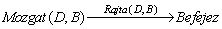
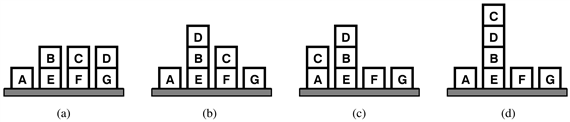
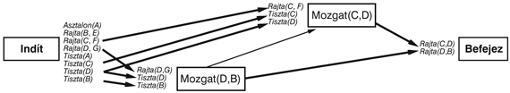
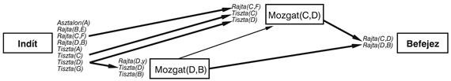
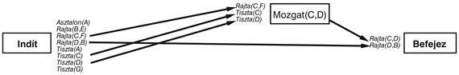
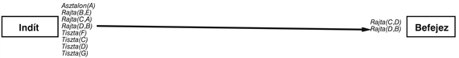
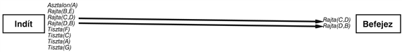
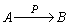
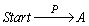
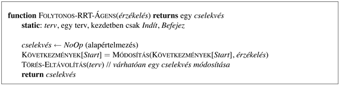

<?xml version="1.0" encoding="UTF-8" standalone="no"?>

<html xmlns="http://www.w3.org/1999/xhtml"><head><meta name="generator" content="DocBook XSL Stylesheets V1.76.1"/></head><body>

<h1 class="title"><a id="id659114"/>Folytonos tervkészítés</h1>

Ebben az alfejezetben olyan ágenst tervezünk, amely meghatározatlanul sokáig kitart egy környezetben. Így ez nem egy „problémamegoldó”, ami egyetlen célt szeretne elérni és ezt tervezi, és addig cselekszik, amíg a célt el nem éri, hanem folyamatosan változó célok, tervkészítési és cselekvési fázisok sorozatát éli meg. Ahelyett hogy a tervkészítőt és a cselekvésmonitorozót mint különálló, de egymásnak eredményeket szolgáltató folyamatokat tekintetnénk, a <strong>folytonos tervkészítő ágens</strong>ben (<strong>continuous planning agent</strong>) ezeket egyetlen folyamatként képzeljük el.
<a id="ID_525_oldal"/>
Az ágensre mindig úgy gondolunk, mint ami <em>része egy terv</em> végrehajtásának, az élete nagy tervének. Cselekvései tartalmazzák a végrehajtásra készen álló terv lépéseinek végrehajtását, a nyitott előfeltételek kielégítésére vagy a konfliktusok feloldására szolgáló tervfinomítást, a végrehajtás során nyert új információk fényében a terv módosítását. Nyilvánvaló, hogy amikor először új célt formál, az ágensnek nincsenek végrehajtásra kész cselekvései, ezért egy kis időt a részleges terv elkészítésével tölt. Nagyon is lehetséges azonban, hogy az ágens a terv teljes befejezése előtt elkezdi a végrehajtást, különösen ha független részcélokat kell elérni. A folytonos tervkészítő ágens folyamatosan monitorozza a világot, az új megfigyelések alapján módosítja ennek modelljét, még akkor is, ha elképzelései még mindig változnak.

Először egy példán haladunk végig, majd bemutatjuk az ágens programját, amelyet <code class="code">FOLYTONOS-RRT-ÁGENS</code>-nek nevezünk, mivel a tervezett cselekvések reprezentálására részben rendezett terveket használ. Hogy a leírást egyszerűsítsük, teljesen megfigyelhető környezetet feltételezünk. Ugyanezen technikák kiterjeszthetők a részben megfigyelhető esetre is.

A példánk a kockavilág problémakörből származik (lásd 11.1.<em> </em>alfejezet). A kiinduló állapot a 12.15. (a) ábrán látható. A <em>Mozgat</em>(<em>x</em>,<em> y</em>) cselekvésre van szükségünk, ami az <em>x</em> kockát az <em>y</em> kockára mozgatja, amennyiben mindketten szabadok. A cselekvés sémája:

<code class="code"><em>Cselekvés</em>(<em>Mozgat</em>(<em>x</em>, <em>y</em>),</code>

<code class="code">	Előfeltétel:<em>Tiszta</em>(<em>x</em>) ∧ <em>Tiszta</em>(<em>y</em>) ∧ <em>Rajta</em>(<em>x</em>, <em>z</em>)</code>

<code class="code">	Következmény:<em>Rajta</em>(<em>x</em>, <em>y</em>) ∧ <em>Tiszta</em>(<em>z</em>) ∧ ¬<em>Rajta</em>(<em>x</em>, <em>z</em>) ∧ ¬<em>Tiszta</em>(<em>y</em>)</code>

Az ágensnek először egy célt kell megfogalmaznia. Itt nem tárgyaljuk a célkialakítást, helyette feltételezzük, hogy az ágensnek valahogy megmondták (vagy saját maga eldöntötte), hogy a <em>Rajta</em>(<em>C</em>,<em> D</em>) ∧ <em>Rajta</em>(<em>D</em>,<em> B</em>) célt kell elérnie. Az ágens ehhez a célhoz kezdi a tervezést. Ellentétben minden másik ágensünkkel, amelyek lekapcsolják érzékelőiket, amíg a tervkészítő egy teljes megoldást nem ad a problémára, a folytonos tervkészítő ágens inkrementálisan épít egy tervet, ahol a terv minden bővítése egy korlátos időtartamot vehet igénybe. Minden bővítés után az ágens egy <em>NoOp</em> cselekvést ad vissza, és ellenőrzi az érzékeléseit. Feltételezzük, hogy az érzékelt adatok nem változnak, és az ágens gyorsan megalkotja a 12.16.<em> </em>ábrán látható tervet. Vegyük észre, hogy bár mindkét cselekvés előfeltételeit teljesíti az <em>Indít</em> állapot, van egy követési megkötés, ami a <em>Mozgat</em>(<em>D</em>,<em> B</em>) cselekvést a <em>Mozgat</em>(<em>C</em>,<em> D</em>) elé helyezi. Erre azért van szükség, hogy a <em>Tiszta</em>(<em>D</em>) igaz maradjon, amíg a <em>Mozgat</em>(<em>D</em>, <em>B</em>) befejeződik. A folytonos tervkészítési folyamat alatt az <em>Indít</em> mindig az aktuális állapot címkéje. Az ágens minden cselekvés után módosítja az állapotot.

A terv készen áll a végrehajtásra, de még mielőtt az ágens cselekedhetne, a környezet közbeszól. Egy külső ágens (talán az ágens tanítója vált türelmetlenné) a (d) kockát a (b)-re helyezi, a világ most a 12.15.<em> </em>ábra (b) állapotának felel meg. Az ágens ezt érzékeli, észreveszi, hogy a <em>Tiszta</em>(<em>B</em>) és a <em>Rajta</em>(<em>D</em>,<em> G</em>) már nem igaz az aktuális állapotban, és ennek megfelelően módosítja az aktuális állapot modelljét. Az okozati kapcsolatok, amelyek a <em>Mozgat</em>(<em>D</em>,<em> B</em>) cselekvés <em>Tiszta</em>(<em>B</em>) és <em>Rajta</em>(<em>D</em>, <em>G</em>) előfeltételeit adták, már nem helyesek, el kell távolítani őket a tervből. Az új tervet a 12.17.<em> </em>ábra mutatja. Minden pillanatban az <em>Indít</em> az aktuális állapotot reprezentálja, így ez az <em>Indít</em> különbözik az előző ábra hasonló állapotától. Vegyük észre, hogy a terv most nem teljes: a <em>Mozgat</em>(<em>D</em>,<em> B</em>) előfeltételei közül kettő nyitott, és a <em>Rajta</em>(<em>D</em>,<em> y</em>) most nem példányosított, mert már nincs okunk feltételezni, hogy a lépés a <em>G</em>-ről indul.

Az ágens most kihasználhatja a „segítő” közbeavatkozást, észrevéve, hogy a  okozati kapcsolat helyettesíthető az <em>Indít</em>-ból a <em>Befejez</em> állapotba mutató direkt kapcsolattal. Ezt a folyamatot az okozati kapcsolat <strong>kiterjesztés</strong>ének (<strong>extension</strong>) nevezzük, és akkor alkalmazzuk, amikor egy feltétel egy későbbi helyett egy korábbi lépéssel biztosítható, új ütközés okozása nélkül.

<a id="id659449"/>
<strong>12.15. ábra - Az állapotok sora, amint a folytonos tervkészítő ágens megpróbálja a (d)-nek megfelelő <em>Rajta</em>(<em>C</em>,<em> D</em>) ∧<em> Rajta</em>(<em>D</em>,<em> B</em>) célállapotot elérni. A kiinduló állapot az (a). A (b) állapotnál egy másik ágens közbelépett és (d)-t (b)-re helyezte. A (c) állapotban az ágens a <em>Mozgat</em>(<em>C</em>,<em> D</em>) cselekvést hajtotta végre, ami sikertelen volt, (c)-t az (a)-ra ejtette. Újrapróbálja a<em> Mozgat</em>(<em>C</em>,<em> D</em>) cselekvést, amivel eléri a (d) célállapotot.</strong>

<a id="id659502"/>
<strong>12.16. ábra - A folytonos tervkészítő ágens által készített kiinduló terv. A terv egyelőre nem különbözik egy átlagos részben rendezett tervkészítő által készítettől.</strong>

<a id="id659512"/>
<strong>12.17. ábra - Miután valaki más elmozdította a <em>D</em> kockát a <em>B</em>-re, a <em>Tiszta</em>(<em>B</em>) és a <em>Rajta</em>(<em>D</em>, <em>G</em>) biztosítására szolgáló kapcsolatokat eldobjuk, ami ezt a tervet eredményezi</strong>

Miután a régi<em> Mozgat</em>(<em>D</em>,<em> B</em>) és <em>Befejez</em> közötti okozati kapcsolatot eltávolítottuk, a <em>Mozgat</em>(<em>D</em>,<em> B</em>) továbbiakban nem forrása egyetlen okozati kapcsolatnak sem. Ez most egy <strong>redundáns lépés</strong> (<strong>redundant step</strong>). Minden redundáns lépést és bármely ezt biztosító kapcsolatot kitörlünk a tervből. Ez a 12.18.<em> </em>ábrán látható tervet eredményezi.

Most a <em>Mozgat</em>(<em>C</em>,<em> D</em>)<em> </em>lépés készen áll a végrehajtásra, hiszen az <em>Indít</em> lépés kielégíti minden előfeltételét, nincs szükség más megelőző lépésre, és nem ütközik a terv egyetlen másik kapcsolatával sem. A lépést eltávolítjuk a tervből, és végrehajtjuk. Sajnos az ágens ügyetlen, és a <em>C</em>-t az <em>A</em>-ra ejti a <em>B</em> helyett, ami a 12.15.<em> </em>ábra (c) állapotát eredményezi. Az új tervállapotot a 12.19.<em> </em>ábra mutatja. Vegyük észre, hogy bár most nincsenek cselekvések a tervben, a <em>Befejez</em> lépésnek még mindig van egy nyitott feltétele.

Az ágens úgy dönt, hogy a nyitott feltételhez készít tervet. Újra a <em>Mozgat</em>(<em>C</em>,<em> D</em>) elégíti ki a célfeltételt. Ennek előfeltételeit az <em>Indít</em> lépésből induló új okozati kapcsolatok teljesítik. Az új tervet a 12.20.<em> </em>ábra mutatja.

<a id="id659650"/>
<strong>12.18. ábra - A <em>Mozgat</em>(<em>C</em>,<em> D</em>) által létrehozott kapcsolatot helyettesítettük az <em>Indít </em>kapcsolatával, a most már redundáns <em>Mozgat</em>(<em>D</em>,<em> B</em>)<em> </em>lépést pedig elhagytuk</strong>

<a id="id659688"/>
<strong>12.19. ábra - A <em>Mozgat</em>(<em>C</em>,<em> D</em>)<em> </em>végrehajtása és a tervből való eltávolítása után az <em>Indít</em> lépés következményei azt a tényt tükrözik, hogy a <em>C </em>a várt <em>D</em> helyett az <em>A</em> kockára került. A <em>Rajta</em>(<em>C</em>,<em> D</em>)<em> </em>cél előfeltétel még minding nyitott.</strong>

<a id="id659741"/>
<strong>12.20. ábra - A nyitott előfeltételt a <em>Mozgat</em>(<em>C</em>, <em>D</em>)<em> </em>ismételt hozzáadásával oldjuk fel. Vegyük észre az előfeltételekhez szükséges új kapcsolatokat.</strong>

A <em>Mozgat</em>(<em>C</em>,<em> D</em>) újra készen áll a végrehajtásra. Ez alkalommal működik, ami a célállapotot eredményezi, melyet a 12.15.<em> </em>ábra (d) része mutat. Miután egy lépést elhagyunk a tervből, a <em>Rajta</em>(<em>C</em>,<em> D</em>) célfeltétel újra nyitottá válik. Mivel az <em>Indít</em> lépést frissítettük, hogy tükrözze az új állapotot, a célfeltétel azonnal kielégíthető egy kapcsolattal az <em>Indít</em> lépésből. Ez az események normális folyása, ha egy cselekvés sikeres. A végleges tervállapotot a 12.21.<em> </em>ábra mutatja. Mivel az <em>Indít</em> lépés az összes célfeltételt kielégíti, és nincsenek hátralevő cselekvések, az ágens szabadon eltávolíthatja a <em>Befejez</em> állapot céljait, és új célokat fogalmazhat meg.

<a id="id659810"/>
<strong>12.21. ábra - A <em>Mozgat</em>(<em>C</em>,<em> D</em>) végrehajtása és tervből eltávolítása után a <em>Rajta</em>(<em>C</em>,<em> D</em>) megmaradt nyitott feltételt az <em>Indít</em> lépésből induló okozati kapcsolat hozzáadásával oldjuk fel. A terv most teljes.</strong>

Ebből a példából látható, hogy a folytonos tervkészítés nagyban hasonlít a részben rendezett tervkészítéshez. Minden iterációban az algoritmus talál valami <strong>tervsérülés</strong>nek (<strong>plan flaw</strong>) nevezett javítanivalót a tervben, és megjavítja. A részben rendezett tervkészítő algoritmus egy sérüléseltávolító algoritmusnak tekinthető, ahol a kétféle sérülés a nyílt előfeltétel és az okozati ütközés lehet. A folytonos tervkészítő ágens másrészről sérülések egy jóval szélesebb körét kezeli:

<ul class="itemizedlist"><li class="listitem">
<em>Hiányzó cél:</em> az ágens eldöntheti, új célt vagy célokat ad a <em>Befejez</em> állapothoz. (Folytonos tervkészítésben értelmesebb lenne a <em>Befejez </em>állapot nevét <em>Örökkévalóság</em>-ra és az <em>Indít</em>-ét <em>Aktuális</em>-ra változtatni, de ragaszkodunk a hagyományokhoz.)
</li><li class="listitem">
<em>Nyílt előfeltétel:</em> egy okozati kapcsolatot ad a nyílt előfeltételhez, egy meglévő vagy egy új cselekvést választva (mint a részben rendezett tervkészítőben).
</li><li class="listitem">
<em>Okozati ütközések:</em> adott az  ok-okozati kapcsolat és a ¬<em>p</em> következményű <em>C</em> cselekvés. Válasszunk az ütközés feloldásához egy rendezési megkötést vagy egy változómegkötést (mint a részben rendezett tervkészítésben).
</li><li class="listitem">
<em>Nem támogatott kapcsolat:</em> ha van egy  ok-okozati kapcsolat, ahol a <em>p</em> nem igaz az <em>Indít</em> állapotban, akkor távolítsuk el a kapcsolatot. (Ez megóv minket attól, hogy végrehajtsunk egy olyan cselekvést, melynek előfeltételei hamisak.)
</li><li class="listitem">
<em>Redundáns cselekvések:</em> ha egy <em>A</em> cselekvés nem eredményez ok-okozati kapcsolatokat, akkor távolítsuk el a kapcsolataival együtt. (Ez lehetővé teszi számunkra, hogy kihasználjuk a szerencsés helyzeteket.)
</li><li class="listitem">
<em>Végrehajtatlan cselekvés:</em> ha egy (a <em>Befejez-</em>től eltérő) <em>A</em> cselekvésnek, melynek az előfeltételeit az <em>Indít</em> kielégíti, nincs (az <em>Indít-</em>tól eltérő) cselekvés elé sorolva, és nem ütközik okozati kapcsolatokkal, akkor távolítsuk el <em>A</em>-t és ok-okozati kapcsolatait, majd adjuk vissza mint a végrehajtandó cselekvést. 
</li><li class="listitem">
<em>Szükségtelen történelmi cél:</em> ha nincsenek nyílt előfeltételek és nincsenek a tervben cselekvések (azaz minden ok-okozati kapcsolat közvetlen az <em>Indít-</em>ból a <em>Befejez</em> állapotba mutat), akkor elértük az aktuális célhalmazt. Távolítsuk el a célokat és az ezekbe mutató kapcsolatokat, hogy új célokat tegyünk lehetővé. 
</li></ul>

A 12.22.<em> </em>ábra a <code class="code">Folytonos<em>-</em>RRT<em>-</em>Ágens</code>-t mutatja be. Ennek ciklusa az „érzékelés, eltávolítás a folyamatból, cselekvés”. Tudásbázisában egy állandó tervet tart, és minden lépésben eltávolít egy folyamatot ebből a tervből. Ezután cselekszik (bár gyakran ez a cselekvés a <em>NoOp</em>) és ismétli a ciklust. Ez az ágens az <a class="xref" href="ch12s05.md#ID_523_524_oldal">„Végrehajtás monitorozása és újratervezése”</a> részben tárgyalt újratervező ágenshez felsorolt problémák nagy részét képes kezelni. Nevezetesen valós időben cselekszik, kezeli a kedvező helyzeteket, saját célokat fogalmaz meg, és kezeli a váratlan eseményeket, melyek a jövőbeli terveket érintik.

<a id="id660816"/>
<strong>12.22. ábra - A <code class="code">FOLYTONOS-RRT-ÁGENS</code>, egy folytonos, részben rendezett tervkészítő ágens. Egy érzékelés után az ágens eltávolít egy lépéssorozatot a folytonosan javított tervéből, és visszaad egy cselekvést. Gyakran számos cselekvéssor-eltávolító tervkészítési lépésre van szükség, mialatt csak a <em>NoOp</em>-ot adja vissza, mielőtt készen állna egy valós cselekvés végrehajtására.</strong>

</body></html>
