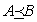

<?xml version="1.0" encoding="UTF-8" standalone="no"?>
<!DOCTYPE html PUBLIC "-//W3C//DTD XHTML 1.1//EN" "http://www.w3.org/TR/xhtml11/DTD/xhtml11.dtd">
<html xmlns="http://www.w3.org/1999/xhtml"><head><meta name="generator" content="DocBook XSL Stylesheets V1.76.1"/></head><body>

<h1 class="title"><a id="id660833"/>Multiágens tervkészítés</h1>

Eddig <strong>egyágenses környezet</strong>ekkel (<strong>single-agent enviroment</strong>s) foglalkoztunk, amelyben az ágensünk egyedül van. Amikor más ágensek is jelen vannak a környezetben, az ágensünk egyszerűen hozzáveheti őket a környezetről alkotott modelljéhez, az alapvető algoritmusainak módosítása nélkül. Sok esetben azonban ez gyenge teljesítményhez vezetne, mert többi ágenssel való foglalkozás nem azonos a környezet kezelésével. Nevezetesen, a természet (feltételezhetően) közömbös az ágens szándékait illetően, míg más ágensek nem.[<a id="id660848" href="#ftn.id660848" class="footnote">132</a>] Ez az alfejezet ezen kérdések kezelésére a multiágens tervkészítést mutatja be. 

A 2. fejezetben láthattuk, hogy a multiágens környezetek lehetnek <strong>együttműködő</strong>k (<strong>cooperative</strong>) vagy <strong>versengő</strong>k (<strong>competitive</strong>). Egy nagyon egyszerű kooperatív példával kezdünk: egy páros teniszcsapat tervkészítésével. Olyan tervek alkothatók, amelyek a csapat mindkét játékosának a cselekvéseit meghatározzák. Az ilyen tervek hatékony elkészítéséhez használható technikákat mutatjuk be. A hatékony tervkészítés hasznos, de nem garantálja a sikert. Az ágenseknek egyet kell érteniük a felhasznált tervben! Ez valamilyen <strong>koordináció</strong>t (<strong>coordination</strong>) feltételez, amit valószínűleg <strong>kommunikáció</strong>val (<strong>communication</strong>) érhetünk el. 

<h2 class="title"><a id="id660895"/>Kooperáció: közös célok és tervek </h2>

A páros teniszt játszó ágenscsapatoknak közös céljuk van, a meccs megnyerése, ami különböző részcélokat eredményez. Tegyük fel, hogy a játék egy pontján a közös céljuk az átütött labda visszaadása úgy, hogy legalább egyikőjük a hálót védi. Ezt a gondolatot egy <strong>multiágens tervkészítés</strong>i (<strong>multiagent planning</strong>) problémával írhatjuk le, amint azt a 12.23.<em> </em>ábra is mutatja.

<a id="id660914"/>
<strong>12.23. ábra - A páros tenisz probléma. Két ágens együtt játszik, és négy pozíció egyikében lehetnek: [<em>Bal</em>, <em>Alapvonal</em>], [<em>Jobb</em>, <em>Alapvonal</em>], [<em>Bal</em>, <em>Háló</em>] és [<em>Jobb</em>, <em>Háló</em>]. A labda visszaadható, ha pontosan egy játékos van a megfelelő helyen.</strong>

<a id="ID_530_oldal"/>
Ez a jelölésrendszer két újdonságot vezet be. Először az <em>Ágens</em>(<em>A</em>, <em>B</em>) deklarálja, hogy két ágensünk van, <em>A</em> és <em>B</em>, akik a tervben szerepelnek. (Ebben a problémában a szemben álló játékosokat nem ágensnek vesszük.) Másodszor minden cselekvés az ágenst explicit módon, mint egy paramétert említi, mert pontosan követnünk kell, melyik ágens mit csinál. 

A multiágens tervkészítési probléma megoldása egy <strong>együttes terv</strong> (<strong>joint plan</strong>), amely minden ágenshez tartalmaz cselekvéseket. Az együttes terv egy megoldás, ha a célt elérjük azáltal, hogy mindegyik ágens végrehajtja a számára kijelölt cselekvéseket. A következő terv a tenisz probléma egy megoldása : 

<code class="code">Terv1:</code>

<code class="code">   <em>A</em>: [<em>Megy</em>(<em>A</em>, [<em>Jobb</em>, <em>Alapvonal</em>]), <em>Üt</em>(<em>A</em>, <em>Labda</em>)]</code>

<code class="code">   <em>B</em>: [<em>NoOp</em>(<em>B</em>), <em>NoOp</em>(<em>B</em>)]</code>

Ha mindkét ágens ugyanazzal a tudásbázissal rendelkezne, és ez lenne az egyetlen megoldás, akkor minden rendben lenne; minden ágens meghatározná a megoldást, és együttesen végrehajtanák. Az ágensek számára sajnálatos (és hamarosan látni fogjuk, hogy ez miért sajnálatos), hogy van egy másik terv is, ami az elsőhöz hasonlóan kielégíti a célt: 

<code class="code">Terv 2:</code>

<code class="code">   <em>A</em>: [<em>Megy</em>(<em>A</em>, [<em>Bal</em>, <em>Háló</em>]),<em> NoOp</em>(<em>A</em>)]</code>

<code class="code">   <em>B</em>: [<em>Megy</em>(<em>B</em>, [<em>Jobb</em>, <em>Alapvonal</em>]),<em> Üt</em>(<em>B</em>, <em>Labda</em>)]</code>

Ha az <em>A</em> a 2. tervet választja, és <em>B</em> az 1-et, akkor senki sem fogja visszaadni a labdát. Fordítva, ha <em>A</em> az 1-et és <em>B</em> a 2-t választja, akkor várhatóan összeütköznek egymással, senki nem adja vissza a labdát, és a háló is fedezetlenül marad. Ezért a helyes együttes terv létezése nem jelenti, hogy a célt el is érjük. Az ágenseknek szükségük van egy <strong>koordináció</strong>s (<strong>coordination</strong>) mechanizmusra, hogy <em>ugyanazt</em> az együttes tervet érjék el, sőt mi több, az ágensek közös tudással is kell rendelkezzenek (lásd 10. fejezet) arról, hogy melyik együttes tervet hajtják végre.

<h2 class="title"><a id="id661144"/>Többtestű tervezés</h2>

Ez az alfejezet a megfelelő együttes tervek megalkotására fókuszál, elodázva egyelőre a koordinációs kérdéskört. Ezt <strong>többtestű tervkészítés</strong>nek (<strong>multibody plannining</strong>) nevezzük, és tulajdonképpen az a tervkészítési probléma, mellyel egy egyedülálló centralizált ágens áll szemben, mely cselekvéseket diktálhat minden fizikai entitásnak. Egy valóban multiágens esetben ez lehetővé teszi minden ágens számára, hogy felderítse melyek a lehetséges együttes tervek, melyek együttes végrehajtása sikeres lenne.

Megközelítésünkben a többtestű tervkészítést a 11.3.<em> </em>alfejezetben bemutatott részben rendezett tervkészítésre alapozzuk. Az egyszerűség kedvéért teljes megfigyelhetőséget feltételezünk. Van még egy kérdés, ami nem merül fel az egyedülálló ágens esetén: a környezet a továbbiakban nem igazán <strong>statikus</strong> (<strong>static</strong>), mert a többi ágens cselekedhet, amíg egy bizonyos ágens gondolkozik. Ezért foglalkoznunk kell a <strong>szinkronizáció</strong>val (<strong>synchronization</strong>). Az egyszerűség kedvéért feltételezzük, hogy minden cselekvés végrehajtási ideje azonos, illetve hogy az összetett terv minden pontján a cselekvések végrehajtása szimultán történik. 

Bármely időpontban minden ágens pontosan egy cselekvést hajt végre (beleértve a <em>NoOp</em>(<em>Üres</em>) <em>operátor</em>t is). Ezen konkurens cselekvések halmazát <strong>együttes cselek</strong><strong>vés</strong>nek (<strong>joint action</strong>) nevezzük. A tenisz problémában (<a class="xref" href="ch12s07.md#ID_530_oldal">„Kooperáció: közös célok és tervek ”</a> részben) például a 〈<em>NoOp</em>(<em>A</em>),<em> Üt</em>(<em>B</em>, <em>Labda</em>)〉 az <em>A</em> és <em>B</em> ágenseknek egy együttes cselekvése. Egy együttes terv együttes cselekvések részben rendezett gráfja. Például a tenisz probléma második terve az együttes cselekvések következő sorozatával írható le:

<code class="code">〈<em>Megy</em>(<em>A</em>, [<em>Bal</em>,<em> Háló</em>]), <em>Megy</em>(<em>B</em>, [<em>Jobb</em>, <em>Alapvonal</em>])〉</code>

<code class="code">〈<em>NoOp</em>(<em>A</em>),<em> Üt</em>(<em>B</em>, <em>Labda</em>)〉</code>

<em>Végrehajthatnánk</em> a tervkészítést a hagyományos részben rendezett tervkészítő algoritmussal, azt az összes lehetséges együttes cselekvés halmazára futtatva. Az egyetlen probléma a halmaz mérete: 10 cselekvéssel és 5 ágenssel 105 együttes cselekvést kapunk. Elég unalmas lenne az összes cselekvés előfeltételét és következményét helyesen definiálni, és nem lenne hatékony egy ilyen nagy halmazzal tervezni.

Egy másik lehetőség az együttes cselekvések implicit definiálása úgy, hogy minden egyes cselekvéshez leírjuk, hogy milyen kölcsönhatásban áll a többi lehetséges cselekvéssel. Ez egyszerűbb lenne, hiszen a legtöbb cselekvés független a legtöbb másiktól, ezért csak azon néhány cselekvést kellene listáznunk, amelyek valójában kölcsönhatásban vannak. Ezt a hagyományos <code class="code">STRIPS</code> vagy ADL cselekvésleírások egy új tulajdonsággal való kiterjesztésével tehetjük meg: ez a <strong>konkurens cselekvések listája</strong> (<strong>concurrent action list</strong>). Ez nagyon hasonlít a cselekvés leírásában szereplő előfeltételhez, kivéve, hogy az állapotváltozók leírása helyett ez cselekvéseket ír le, amelyeket egyszerre kell, vagy éppen nem szabad egyszerre végrehajtani. Például a <em>Találat</em> cselekvés a következőképpen írható le:

<code class="code"><em>Cselekvés</em>(<em>Üt</em>(<em>A</em>,<em> Labda</em>),</code>

<code class="code"><em>		</em>Konkurens:¬<em>Üt</em>(<em>B</em>,<em> Labda</em>)</code>

<code class="code"><em>		</em>Előfeltétel:<em>Megközelít</em>(<em>Labda</em>,<em> </em>[<em>x</em>,<em> y</em>]) ∧ <em>Ott</em>(<em>A</em>,<em> </em>[<em>x</em>,<em> y</em>])</code>

<code class="code"><em>		</em>Következmény:<em>Visszaadott</em>(<em>Labda</em>))</code>

Itt egy tiltó egyidejűségi megkötésünk van, azaz az <em>Üt</em> cselekvés végrehajtása alatt egy másik ágens nem hajthat végre egy másik <em>Üt</em> cselekvést. Hasonlóképpen <em>megkövetelhetünk</em> egyidejű cselekvést. Például amikor két ágensre van szükség egy üdítőkkel teli hűtőtáska teniszpályához cipeléséhez. Ezen cselekvés leírása azt fejezi ki, hogy az <em>A</em> ágens nem hajthatja végre a <em>Cipel</em> cselekvést, hacsak nincs egy másik <em>B</em> ágens, aki egyidejűleg egy <em>Cipel</em> cselekvést hajt végre ugyanazon hűtőtáskával: 

<code class="code"><em>Cselekvés</em>(<em>Cipel</em>(<em>A</em>, <em>hűtőtáska</em>,<em> itt</em>,<em> ott</em>),</code>

<code class="code"><em>	</em>Konkurens:<em>Cipel</em>(<em>B</em>, <em>hűtőtáska</em>,<em> itt</em>,<em> ott</em>)</code>

<code class="code"><em>	</em>Előfeltétel:<em>Ott</em>(<em>A</em>,<em> itt</em>) ∧ <em>Ott</em>(<em>Hűtőtáska</em>,<em> itt</em>) ∧ <em>Hűtőtáska</em>(<em>hűtőtáska</em>)</code>

<code class="code"><em>	</em>Következmény:<em>Ott</em>(<em>A</em>,<em> ott</em>) ∧ <em>Ott</em>(<em>hűtőtáska</em>,<em> ott</em>)</code>

<code class="code">			    ∧ ¬<em>Ott</em>(<em>A</em>,<em> itt</em>) ∧ ¬<em>Ott</em>(<em>hűtőtáska</em>,<em> itt</em>))</code>

Ezen reprezentáció segítéségével a részben rendezett tervkészítőhöz nagyon közeli tervkészítő hozható létre. Mindössze három különbség van:

<ol class="orderedlist"><li class="listitem">
Az <em>A</em> ≺ <em>B</em> temporális rendezési relációt kiegészítendő megengedjük az <em>A</em> =<em> B</em>-t és az -t, ami „egyidejűséget”, illetve „megelőzőséget vagy egyidejűséget” jelent.
</li><li class="listitem">
Amikor egy új cselekvés egyidejű cselekvéseket igényel, példányosítani kell ezen cselekvéseket a terv új vagy létező cselekvéseinek felhasználásával. 
</li><li class="listitem">
A tiltottan egyidejű cselekvések a megkötések újabb forrásai. Minden megkötést fel kell oldani az ütköző cselekvések egymás elé vagy mögé rendelésével.
</li></ol>

Ez a reprezentáció a többtörzsű problémakörökhöz alkalmazott, részben rendezett tervkészítővel ekvivalens. Kiterjeszthetnénk ezt a megközelítést az utolsó két fejezet finomításaival – HFH-ek részleges megfigyelhetőség, feltételek, végrehajtás-monitorozás és újratervezés –, de ez túlmutat a könyv célkitűzésein.

<h2 class="title"><a id="id661620"/>Koordináló mechanizmusok</h2>

A legegyszerűbb módszer, amivel ágensek egy csoportja biztosíthatja az egyetértést egy együttes tervben, hogy egy <strong>konvenció</strong>t (<strong>convention</strong>) fogadnak el az együttes cselekvés megkezdése előtt. A konvenció az együttes tervek közötti választásra vonatkozó bármely olyan megkötés, amely túlmutat az alapmegkötésen, amely szerint egy együttes tervnek működni kell, ha minden ágens alkalmazza. Például a „maradj a saját térfeleden” konvenció a páros partnereket a második terv kiválasztására sarkallja, míg az „egy játékos mindig a hálónál marad” konvenció az egyes tervhez vezetné őket. Néhány konvenció, mint az út megfelelő oldalán való vezetés, olyan széles körben elterjedt, hogy ezeket már <strong>társadalmi törvényszerűség</strong>ekként (<strong>social law</strong>s) kezeljük. Az emberi nyelvek szintén konvencióknak tekinthetők. 

Az előző alfejezet konvenciói alkalmazási terület specifikusak és a cselekvésleírások megkötéseivel implementálhatók, amelyekkel kizárjuk a konvenciók megszegéseit. Egy általánosabb megközelítés, hogy problémakör-független konvenciókat használjunk. Például ha mindegyik ágens ugyanazon többtestű tervkészítő algoritmust futtatja ugyanazon bemenetekkel, követi azt a konvenciót, miszerint az elsőként megtalált, használható összetett tervet hajtsa végre, miközben biztos benne, hogy a többi ágens ugyanezzel a választással él. Egy sokkal robusztusabb, de jóval költségesebb stratégia lenne az összes összetett terv elkészítése, majd az ebből való választás (mondjuk annak kiválasztása, amelynek leírt reprezentációja ábécé-sorrendben az első).

Konvenciók szintén adódhatnak a folyamatok evolúciós fejlődésével. Például a közösségben élő rovarok nagyon kidolgozott összetett terveket hajtanak végre, melyeket a kolónia egyedeinek közös genetikus összeállítása biztosít. Az azonosságot szintén nyomatékosítja a tény, hogy a konvencióktól való eltérés csökkenti az evolúciós alkalmasságot, így bármely alkalmazható összetett terv stabil egyensúlyi helyzetet eredményezhet. Hasonló megfontolások alkalmazhatók az emberi nyelv fejlődésére, ahol nem az a fontos, hogy egyes személyek milyen nyelvet beszélnek, hanem az a tény, hogy minden személy ugyanazt a nyelvet beszéli. 

Egy utolsó példa a madarak gyülekezési viselkedése. Megfelelő szimulációt nyerhetünk, ha minden egyes madár ágens (melyet néha madaroidnak vagy <strong>roid</strong>nak (<strong>boid</strong>) nevezünk) a következő három szabályt követi valamilyen kombináció alapján:

<ol class="orderedlist"><li class="listitem">
Különválás: távolodjunk el a szomszédoktól, amikor túl közel kerülünk;
</li><li class="listitem">
Kohézió: kerüljünk átlagos távolságra a szomszédainktól;
</li><li class="listitem">
Irányultság: kerüljünk a szomszédokhoz képest átlagos orientációba (haladási irányba).
</li></ol>
<a id="ID_533_oldal"/>
Ha minden madár azonos szabályrendszert hajt végre, a csapat repülése egy <strong>kialakuló </strong><strong>viselkedés</strong>t (<strong>emergent behavior</strong>) mutat, hasonlóan egy nagyjából azonos sűrűségű pszeudomerev test viselkedéséhez, amely nem bomlik fel az idő során. Mint a bogaraknál, itt sincs szükség arra, hogy minden ágens ismerje a teljes összetett tervet, ami a többi ágens cselekvését modellezi. 

A konvenciók ahelyett, hogy minden egyes új problémához kifejlesztenénk őket, tipikusan egyedi multiágens tervkészítő problémák egy egész csoportjához készülnek. Ez rugalmatlansághoz és hibához vezethet, amit néha láthatunk, ha a páros tenisz játszmában a labda nagyjából azonos távolságra van a két partner között. Egy alkalmazható konvenció hiányában az ágensek <strong>kommunikál</strong>hatnak (<strong>communication</strong>), hogy egy közös tudást érjenek el az alkalmazható összetett tervből. Például a teniszpáros egy játékosa felkiálthat „Enyém!” vagy „Tiéd!”, hogy jelezze a preferált tervet. A kommunikációs mechanizmusokat nagyobb mélységben a 22.<em> </em>fejezetben tárgyaljuk, ahol megfigyelhetjük, hogy a kommunikáció nem szükségszerűen szóbeli információcserét jelent. Például egy játékos úgy is közölheti az általa előnyben részesített összetett tervét a másikkal, hogy végrehajtja annak kezdő részletét. A teniszjátszma problémánkban, ha az <em>A</em> ágens elindul a hálóhoz, akkor a <em>B</em> ágens rákényszerül, hogy visszamenjen az alapvonalhoz megütni a labdát, mivel a második terv az egyetlen összetett terv, ami <em>A</em> hálóhoz mozgásával kezdődik. Ez az irányítási megközelítés, amelyet gyakran a <strong>terv felismerésé</strong>nek (<strong>plan recognition</strong>) nevezünk, akkor működik, ha egyetlen cselekvés (vagy cselekvések rövid sorozata) elegendő, hogy egyértelműen azonosítsuk az összetett tervet. 

Azt a terhet, amely biztosítja, hogy az ágensek egy sikeres összetett tervhez jussanak, vagy az ágensek készítőire, vagy magukra az ágensekre helyezhetjük. Az első esetben mielőtt az ágensek tervezni kezdenének, az ágens készítőjének bizonyítania kell, hogy az ágensek szabályai és stratégiái sikeresek lesznek. Az ágensek önmagukban lehetnek reaktívak, amennyiben ez működik az őket körülvevő környezetben, valamint ha nem kell, hogy pontos modelljük legyen a többi ágensről. Az utóbbi esetben az ágensek megfontoltak: bizonyítaniuk vagy demonstrálniuk kell, hogy a tervük hatékony lesz, figyelembe véve a többi ágens megfontolásait. Például egy <em>A</em> és <em>B</em> logikai ágenst tartalmazó környezetben mindketten rendelkezhetnek a következő definícióval:

<code class="code">∀<em>p</em>, <em>s    Megfelelő</em>(<em>p</em>, <em>s</em>) ⇔ <em>KözösTudás</em>({<em>A</em>, <em>B</em>}, <em>Eléri</em>(<em>p</em>, <em>s</em>, <em>Cél</em>))</code>

Ez azt mondja, hogy bármely <em>s</em> szituációban, a <em>p</em> terv egy alkalmazható összetett terv, ha az ágensek közösen tudják, hogy a <em>p</em> eléri a célt. További axiómákra van szükségünk, hogy biztosítsuk egy adott összetett terv végrehajtására vonatkozó <strong>közös szándék</strong> (<strong>joint intention</strong>) együttes ismeretét. Az ágensek csak ebben az esetben kezdhetnek cselekedni.

<h2 class="title"><a id="id661808"/>Versengés</h2>

A többágenses környezeteknek nem mindegyike áll együttműködő ágensekből. Az egymásnak ellentmondó működésű ágensek <strong>verseny</strong>ben (<strong>competition</strong>) vannak egymással. Erre egy példát jelentenek a két játékost igénylő, de zérus összegű játékok, mint amilyen a sakk. A 6.<em> </em>fejezetben láthattuk, hogy a sakkozó ágensnek figyelembe kell vennie az ellenfél következő néhány lehetséges lépését is. Azaz egy versengő környezetben levő ágensnek (a) fel kell ismernie, hogy vannak más ágensek, (b) meg kell határoznia a többi ágens lehetséges terveit, (c) meg kell határoznia, hogy a többi ágens hogyan tervezi a saját terveivel való kölcsönhatást, és (d) el kell döntenie, hogy ezek fényében mi a legjobb cselekvés. A versengés, hasonlóan az együttműködéshez, a többi ágens tervének modelljét igényli. Másrészről, egy versengő környezetben nincs elhatározás egy összetett terv mellett. 

A 12.4.<em> </em>alfejezet felvázolta a játékok és a feltételes tervkészítési problémák közötti analógiát. A 12.10.<em> </em>ábrán szereplő feltételes tervkészítő algoritmus olyan tervet készít, amely a környezetről a legrosszabb esetet feltételezve is működik, így olyan versenyhelyzetekben is alkalmazható, ahol az ágenst csak a siker vagy a bukás érdekli. Amikor az ágens és ellenfelei a terv <em>költségeivel</em> is foglalkoznak, akkor a minimax megoldás a helyénvaló. Eddig nagyon kevés munkát fordítottak a minimax módszer olyan módszerekkel való kombinálására, mint a részben rendezett tervkészítés vagy a HFH-tervkészítés, ami túlmutat a 6.<em> </em>fejezetben használt állapottér-keresési modellen. A versengés kérdésére a játékelmélettel foglalkozó 17.6.<em> </em>alfejezetben még visszatérünk.

 

[<a id="ftn.id660848" href="#id660848" class="para">132</a>]  Nem biztos, hogy az Egyesült Királyság lakói, ahol egy pikniknek már pusztán a tervezése is esőt garantál, egyetértenek ezzel.

</body></html>
