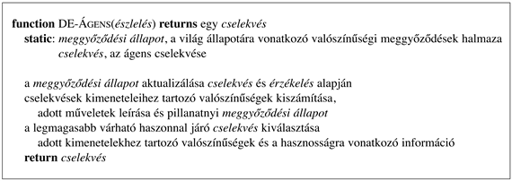

<?xml version="1.0" encoding="UTF-8" standalone="no"?>
<!DOCTYPE html PUBLIC "-//W3C//DTD XHTML 1.1//EN" "http://www.w3.org/TR/xhtml11/DTD/xhtml11.dtd">
<html xmlns="http://www.w3.org/1999/xhtml"><head><meta name="generator" content="DocBook XSL Stylesheets V1.76.1"/></head><body>

<h1 class="title"><a id="id662856"/>13. fejezet - Bizonytalanság</h1>

<em>Ebben a fejezetben meglátjuk, mit kell egy ágensnek tennie, ha nem minden kristálytiszta.</em>

<h1 class="title"><a id="id662863"/>Cselekvés bizonytalan tudás esetén</h1>

<h3 class="title">Fontos</h3>
A III. és IV. részben leírt logikai ágensek ismeretelméleti kijelentéseket tesznek az állítások igaz, hamis vagy ismeretlen voltáról. Ha egy ágens elegendő mennyiségű tényt ismer a környezetére vonatkozóan, akkor a logikai megközelítés révén olyan terveket tud származtatni, amelyek biztosítják a sikert. Ami nagyon jó. Sajnos azonban <em>az ágensek szinte soha nem férnek hozzá a környezetüket érintő teljes igazsághoz. </em>Vagyis az ágenseknek <strong>bizonytalanság</strong> (<strong>uncertainty</strong>) közepette kell működniük. A 7. fejezet wumpus világának ágense például csak olyan szenzorokkal rendelkezik, amelyek lokális információt szolgáltatnak; a világ nagy része nem figyelhető meg közvetlenül. A wumpus ágens gyakran képtelen felfedezni, hogy két négyzet közül melyik tartalmaz csapdát. Ha a két négyzet az aranyhoz vezető úton van, akkor az ágensnek kockáztatnia kell, és rá kell lépnie az egyikre.

A világ a valóságban nagyságrendekkel bonyolultabb a wumpus világnál. Egy logikai ágens nem biztos, hogy képes kimerítő és helyes leírást adni arról, hogy a cselekedetei mennyire lesznek eredményesek. Tegyük fel például, hogy az ágens ki szeretne vinni valakit a repülőtérre egy bizonyos járathoz. Ehhez egy <em>A</em>90 nevű tervet tekint, amely szerint a járat indulása előtt 90 perccel kell elindulnia otthonról és normális sebességgel kell vezetnie. Mindemellett, még ha a repülőtér csak 15 kilométerre van is, az ágens nem juthat a következő határozott kijelentésre: az <em>A</em>90 terv alapján időben kiérünk a repülőtérre, hanem csak egy gyengébb következtetésre: az <em>A</em>90 terv alapján időben kiérünk a repülőtérre, ha az autóm nem romlik el vagy nem fogy ki belőle az üzemanyag, továbbá, ha nem történik velünk baleset, valamint a hídon sem lesz baleset, és a gép nem száll fel korábban, továbbá ha nem lesz földrengés… E feltételek egyike sem vezethető le, így a terv sikere sem következtethető ki biztosan. Mindez a 10. fejezetben említett <strong>minősítési problémá</strong>ra (<strong>qualification problem</strong>) mutat példát.

Ha egy logikai ágens nem tud arra a következtetésre jutni, hogy valamely cselekvéssorozat eléri a célját, akkor képtelen lesz cselekedni. A feltételes tervezés bizonyos mértékben úrrá lehet a bizonytalanságon, de csak akkor, ha az ágens érzékelési tevékenységei képesek megszerezni a szükséges információt, továbbá ha nincs túl sok különböző eshetőség. Egy másik lehetőség az lehetne, ha az ágenst egy egyszerű, de hibás elmélettel ruháznánk fel, amely <em>biztosan</em> lehetővé tenné valamely terv származtatását; egy ilyen terv az esetek <em>többségében </em>valóban működik is, ugyanakkor problémák lépnek fel, ha az események az ágens elméletének ellentmondanak. Sőt az ágens elméletének pontossága és használhatósága közötti egyensúly kezelése maga is megköveteli a bizonytalanság végiggondolását. Összegezve, egyetlen tisztán logikai ágens sem lesz képes arra a következtetésre jutni, hogy az <em>A</em>90 tervet kell követnie.

<h3 class="title">Fontos</h3>
Mindazonáltal tegyük fel, hogy az <em>A</em>90 ténylegesen a helyes és követendő terv. De mit is értünk ezen a kijelentésen? Ahogy már a 2. fejezetben kifejtettük, ez a kijelentés azt takarja, hogy a végrehajtható összes lehetséges terv közül az <em>A</em>90 az, amelyik a környezetre vonatkozó adott információ mellett várhatóan az ágens teljesítményének legnagyobb mértékét biztosítja. A teljesítmény foka magában foglalja a járathoz időben való kiérést a repülőtérre, továbbá a repülőtéren való hosszú, értelmetlen várakozás és a gyorshajtás miatti megbírságolás elkerülését. Az ágens rendelkezésére álló információ ezen kimenetelek közül egyiket sem szavatolja az <em>A</em>90 esetén, de bizonyos mértékű hihetőségét nyújtja annak, hogy azok be fognak következni. Más tervek, mint például az <em>A</em>120, megnövelné az ágens hitét abban, hogy időben kiérnek a repülőtérre, de egyben megnövelné a hosszú várakozás valószínűségét is. <em>A helyes cselekedet – az <strong>ésszerű döntés</strong> (<strong>rational decision</strong>) – ezért függ mind a különböző célok viszonylagos fontosságától, mind pedig a megvalósulásuk valószínűségétől és mértékétől.</em> Az alfejezet hátralevő részében ezeket a gondolatokat szeretnénk hangsúlyozni, előkészítvén az ebben és a következő fejezetekben bemutatott bizonytalan következtetés és az ésszerű döntés általános elméleteinek a kifejlesztését.

<h2 class="title"><a id="id665239"/>Bizonytalan tudás kezelése</h2>

Ebben az alfejezetben a bizonytalan tudás természetét vizsgáljuk meg közelebbről. Egy egyszerű diagnosztikai példán keresztül mutatjuk be az érintett fogalmakat. A diagnosztika – legyen az orvosi, gépjármű-javítási vagy bármi egyéb – olyan feladat, amely szinte mindig tartalmaz bizonytalanságot. Hogy lássuk a logikai megközelítés sikertelenségét, próbáljuk meg egy fogorvosi diagnosztikai rendszer szabályait meghatározni elsőrendű logika segítségével. Tekintsük a következő szabályokat:

<code class="code">∀<em>p</em>  <em>Tünet</em>(<em>p</em>, <em>Fogfájás</em>) ⇒<em> Betegség</em>(<em>p</em>, <em>Lyuk</em>)</code>

A gond az, hogy ez a szabály rossz. Nincs minden fogfájós betegnek lyukas foga; néhányuknak lehet ínysorvadása vagy tályoga, vagy valamilyen más problémája.

<code class="code">∀<em>p</em>  <em>Tünet</em>(<em>p</em>, <em>Fogfájás</em>) ⇒ <em>Betegség</em>(<em>p</em>, <em>Lyuk</em>) ∨ <em>Betegség</em>(<em>p</em>, <em>Ínysorvadás</em>) ∨ <em>Betegség</em>(<em>p</em>, <em>Tályog</em>)…</code>

Sajnos, ahhoz, hogy igazzá tegyük a szabályt, közel végtelen sok okot kellene hozzátennünk. Megpróbálhatjuk a szabályt ok-okozati szabállyá formálni:

<code class="code">∀<em>p</em>  <em>Betegség</em>(<em>p</em>, <em>Lyuk</em>) ⇒ <em>Tünet</em>(<em>p</em>, <em>Fogfájás</em>)</code>

De még ez a szabály sem lesz helyes, hiszen nem minden lyukas fog okoz fájdalmat. Az egyetlen módja, hogy kijavítsuk a szabályt, az az, hogy logikailag teljessé tesszük: a bal oldalt ki kell bővíteni minden olyan lehetséges okkal, amely lyukas fogak esetén fogfájást okoz. De még ebben az esetben is figyelembe kell venni a diagnózis megállapításánál annak lehetőségét, hogy a betegnek egymástól teljesen függetlenül is lehet fogfájása és lyukas foga.

Próbálkozásaink az elsőrendű logika alkalmazására olyan területeken, mint az orvosi diagnosztika, három fő okból is kudarcot vallanak:

<ul class="itemizedlist"><li class="listitem">
<strong>Lustaság</strong> (<strong>laziness</strong>): túl nagy munkát jelent az ok és okozatok teljes eseményhalmazának felsorolása, amely elengedhetetlenül szükséges annak biztosítására, hogy egy szabály mindig érvényes legyen. Ezenkívül túl körülményes az eredményül kapott hatalmas méretű szabályok használata.
</li><li class="listitem">
Az <strong>elméleti tudatlanság</strong> (<strong>theoretical ignorance</strong>): az orvosi tudományterület elmélete nem teljes.
</li><li class="listitem">
A <strong>gyakorlati tudatlanság</strong> (<strong>practical ignorance</strong>): még ha ismerjük is a teljes szabályrendszert, egy bizonyos beteggel kapcsolatban akkor is lehetünk bizonytalanok, mert előfordulhat, hogy még nem fejeződött be, vagy egyáltalán nem végezhető el az összes szükséges vizsgálat.
</li></ul>

Arról van szó, hogy a fogfájás és a lyuk közötti kapcsolat egyik irányban sem feltétlen logikai következmény. Ez jellemző az orvosi területekre, valamint más szakértői területekre (jog, üzlet, tervezés, autójavítás, kertészkedés, időpontok összeegyeztetése stb.). Az ágens tudása legjobb esetben is csak egy <strong>bizonyos mértékű meggyőződés</strong>t vagy <strong>hiedelmet</strong> (<strong>degree of belief</strong>) nyújthat az adott kijelentésekkel kapcsolatban. A meggyőződési értékek kezelésére az elsődleges eszközünk a <strong>valószínűség-számítás</strong> (<strong>probability theory</strong>) lesz, amely egy 0 és 1 közötti számszerű meggyőződési mértéket rendel az egyes mondatokhoz. (A bizonytalan következtetésre alkalmas néhány más lehetséges módszerről a 14.7. alfejezetben olvashatunk.)

<h3 class="title">Fontos</h3>
<em>A valószínűség lehetőséget nyújt a lustaságunkból vagy tudáshiányunkból fakadó bizonytalanság kifejezésére (<strong>összegzésére</strong>). </em>Nem lehetünk biztosak abban, hogy mi kínoz egy bizonyos beteget, ugyanakkor hihetjük, hogy mondjuk 80% az esély arra – azaz 0,8 a valószínűsége annak –, hogy a betegnek van lyukas foga, ha fogfájásra panaszkodik. Azaz, várakozásaink szerint az összes, az ágens tudása alapján a jelenlegi szituációtól megkülönböztethetetlen eset 80%-ában a páciensnek van lyukas foga. Ezt a valószínűséget statisztikai adatokból vonhatjuk le – az eddig vizsgált fogfájós betegek 80%-ának lyukas volt a foga –, vagy valamilyen általános szabályból, illetve tények kombinációjából származtathatjuk. A 80% azokat az eseteket foglalja magában, amikor minden olyan tényező jelen van, amely hatására a lyuk fogfájással jár, valamint amikor a betegeknek teljesen függetlenül van fogfájása és lyukas foga is. A hiányzó 20%-ban pedig a fogfájás összes többi lehetséges oka található, amelyek megerősítéséhez vagy tagadásához túl lusták vagy tudatlanok vagyunk.

Egy adott kijelentéshez rendelt 0 valószínűség annak az egyértelmű meggyőződésnek felel meg, hogy a mondat állítása hamis, míg az 1 valószínűség egyenértékű azzal a határozott meggyőződéssel, hogy a mondat állítása igaz. A 0 és 1 közötti valószínűségek a mondat igazságtartalmában való hit közbenső mértékeinek felelnek meg. Az állítás <em>valójában</em> persze<em> </em>vagy igaz, vagy hamis. Fontos tehát megjegyeznünk, hogy a meggyőződés mértéke és az igazságtartalom mértéke különböző fogalmak. A 0,8 valószínűség nem jelent „80%-ban igaz”-at, hanem egy 80%-os mértékű meggyőződést – vagyis egy igen erős elvárást (reményt) az állítás igazságával szemben. Következésképpen a valószínűség-számítás a logikával azonos lételméleti állásfoglalást hordoz – nevezetesen, hogy a világban a tények vagy érvényesek, vagy nem. Az igazság mértéke, mint a meggyőződés mértékének az ellentéte, a <strong>fuzzy logika</strong> (<strong>fuzzy logic</strong>) tárgya, amelyet a 14.7. alfejezetben tárgyalunk.

A logikában egy olyan állítás, mint „a páciensnek van lyukas foga” az interpretációjától és a világtól függően vagy igaz, vagy hamis; csak akkor igaz, ha az a tény, amelyre hivatkozik, megfelel a tényállásnak. A valószínűség-számításban egy olyan mondat, mint „0,8 annak a valószínűsége, hogy a betegnek lyukas a foga” az ágens meggyőződését fejezi ki, és nem közvetlenül a valóságra vonatkozik. Ez a meggyőződés az ágens addigi észleléseitől függ. Az észlelések alkotják azt a <strong>tény</strong>t vagy<strong> tényállás</strong>t (<strong>evidence</strong>), amelyen a valószínűségi kijelentések alapulnak. Tegyük fel például, hogy az ágens kihúz egy lapot egy megkevert kártyapakliból. Mielőtt ránéz a lapra, 1/52 valószínűséget kell rendelnie a mellé az állítás mellé, hogy a kihúzott lap a pikk ász. Megnézés után ugyanennek a valószínűsége vagy 0, vagy 1. Vagyis, egy kijelentéshez rendelt valószínűség inkább annak felel meg, hogy egy logikai állítás (vagy annak tagadása) következik-e a tudásbázisból, mint annak, hogy igaz-e vagy sem. Ahogy a tudásbázishoz hozzáadott állítások megváltoztatják az abból levonható következtetéseket, ugyanúgy a valószínűség is megváltozik, amikor több tény birtokába jutunk.[<a id="id665480" href="#ftn.id665480" class="footnote">133</a>]

Ebből következően minden valószínűségi kijelentésnek hivatkoznia kell azokra a tényekre, amelyek alapján az adott valószínűség az állításhoz lett rendelve. Amint egy ágens új észlelések birtokába jut, ezek figyelembevételével módosítja a valószínűségek becslését. Mielőtt tények birtokába jutunk, <strong>előzetes</strong>, illetve <strong>a priori</strong> (<strong>prior</strong>) vagy <strong>feltétel nélküli</strong> (<strong>unconditional</strong>) valószínűségről beszélünk, a tények birtokában pedig <strong>utólagos</strong>, illetve <strong>a posteriori</strong> (<strong>posterior</strong>) vagy <strong>feltételes</strong> (<strong>conditional</strong>) valószínűségről. Az ágens a legtöbb esetben rendelkezni fog bizonyos tényekkel az érzékelései hatására, és érdekelt lesz az általa felügyelt kimenetelek a posteriori valószínűségeinek kiszámításában.

<h2 class="title"><a id="id665535"/>Bizonytalanság és racionális döntések</h2>

A bizonytalanság megjelenése gyökeresen megváltoztatja azt a módot, ahogy az ágens a döntéseit meghozza. Egy logikai ágensnek általában van valamilyen célja, és bármely tervet végrehajt, amely biztosítja a cél elérését. Azon az alapon választ ki vagy utasít vissza egy cselekvést, hogy az eléri a célt vagy sem, függetlenül attól, hogy más cselekvések mire vezetnek. Más lesz a helyzet azonban, amint a bizonytalanság belép a képbe. Gondoljuk végig újra az <em>A</em>90 tervet a repülőtérre jutás szempontjából. Tegyük fel, hogy ez 95%-os valószínűséggel biztosítja a sikert. Ésszerű döntést jelent ez? Nem feltétlenül: lehetnek más tervek, például az <em>A</em>120, amelynek nagyobb esélye van a sikerre. Ha életbevágó az, hogy ne késsük le a járatot, akkor célszerűbb megkockáztatni egy hosszabb várakozást a repülőtéren. Mi a helyzet például az <em>A</em>1440 tervvel, amely a felszállás előtt 24 órával való indulást javasolja. A legtöbb esetben ez nem jó választás, mert bár majdnem biztosra vehetjük az időben való érkezést, sajnos a tűrhetetlenül hosszú várakozást is.

Ilyen típusú döntések meghozatala előtt az ágensnek fel kell állítania egy <strong>preferencia-sorrend</strong>et (<strong>preferences</strong>) a különböző tervek lehetséges <strong>kimenetel</strong>ei (<strong>outcome</strong>) között. Egy adott kimenetel teljesen határozott állapotot jelent, magában foglalva, hogy az ágens időben érkezik a repülőtérre vagy sem, és hogy milyen hosszú lesz a repülőtéri várakozás. A preferenciák figyelembevételével történő leírásra és következtetésre a <strong>hasznosságelmélet</strong>et (<strong>utility theory</strong>) fogjuk használni. (A <strong>hasznosság</strong> – <strong>utility</strong> – fogalmán a továbbiakban az értendő, hogy „milyen a haszon minősége”, és nem valamifajta közhasznúság, mint az elektromos művek vagy vízművek esetében.) A hasznosságelmélet szerint minden állapotnak van egy hasznavehetőségi mértéke vagy haszna az ágens számára, és az a számára több hasznot hozó állapotokat fogja előnyben részesíteni.

Egy állapot hasznossága viszonylagos az ágens számára, akinek preferencia-sorrendjét a hasznosságfüggvény hivatott képviselni. A 6. fejezet játszmáiban szereplő jutalmak például hasznosságfüggvények. Sakkozás közben annak az állapotnak a hasznossága, amelyben Fehér játszmát nyer, nyilvánvalóan igen magas a fehér bábukkal játszó ágens számára, ugyanakkor igen alacsony a feketével játszó számára. Vagy bizonyos játékosok (beleértve a szerzőket is) igen elégedettek lehetnek egy világbajnok elleni döntetlennel, ugyanakkor más játékosok (beleértve a korábbi világbajnokot) nem. Az ízlést vagy a személyes választást nem lehet megindokolni: azt gondolhatjuk, hogy egy ágens, aki a műfagyit előnyben részesíti a csokireszelékkel szemben különös, sőt félre van vezetve, de azt nem mondhatjuk, hogy irracionális. A hasznosságelmélet még az önzetlenséget is megengedi, egyszerűen azáltal, hogy az ágens a saját hasznosságát növelő tényezők közé beleveszi mások jólétét.

A preferenciák sorrendje, amit a hasznossággal fejezhetünk ki, az ésszerű döntések általános elméletében valószínűségekkel van kombinálva. Ezt hívjuk <strong>döntéselmélet</strong>nek (<strong>decision theory</strong>):

<code class="code"><em>döntéselmélet</em> = <em>valószínűség-elmélet</em> + <em>hasznosságelmélet</em></code>

<h3 class="title">Fontos</h3>
A döntéselmélet alapgondolata szerint <em>egy ágens akkor és csak akkor racionális, ha olyan cselekvést választ, amely az adott cselekvés összes lehetséges kimenetelére átlagolt legmagasabb várható hasznot hozza. </em>Ezt hívják a <strong>Maximális Várható Haszon</strong> (<strong>MVH</strong>, <strong>Maximum Expected Utility</strong>, <strong>MEU</strong>) elvének. Az elv működését a 6. fejezetben láthattuk, amikor az ostáblajáték optimális lépését vizsgáltuk röviden. A későbbiekben látni fogjuk, hogy ez az elv teljesen általános érvényű.

<h2 class="title"><a id="id665653"/>Egy döntéselméleti ágens tervezése</h2>

A 13.1. ábra egy, a cselekvései kiválasztásához döntéselméleti módszereket alkalmazó ágens felépítését mutatja. Egy absztrakt szinten az ágens megegyezik a 7. fejezetben leírt logikai ágens felépítésével. Az elsődleges különbség közöttük az, hogy a döntéselméleti ágens pillanatnyi állapotra vonatkozó tudása bizonytalan; az ágens <strong>meggyőződési</strong> vagy<strong> hiedelemállapot</strong>a (<strong>belief state</strong>) a világ összes lehetséges aktuális állapotainak a valószínűségeit megjeleníti. Az idő előrehaladtával az ágens egyre több tényt gyűjt össze, és meggyőződési állapota is változik. Adott meggyőződési állapotra alapozva az ágens valószínűségi becsléseket tud adni az egyes cselekedetek kimeneteleire vonatkozóan, következésképpen ki tudja választani a legnagyobb várható hasznossággal bíró lépést. Ez és a következő fejezet a valószínűségi információ általános megjelenítésére és az azon alapuló számításokra összpontosít. A 15. fejezet a meggyőződési állapot reprezentálásának és aktualizálásának, valamint a környezet becslésének speciális módszereivel foglalkozik. A 16. fejezet a hasznosságelméletet taglalja mélységeiben, míg a 17. fejezetben a komplex döntések módszereit építjük fel.

<a id="id665673"/>
<strong>13.1. ábra - Döntéselméleti ágens, amely racionális cselekvéseket választ ki. A lépéseket a következő öt fejezetben részletezzük.</strong>

 

[<a id="ftn.id665480" href="#id665480" class="para">133</a>]  Ez teljesen eltér attól, hogy a világ megváltozása következtében egy állítás igazzá vagy hamissá válik. Ha valószínűségeket akarunk használni egy változó világ kezelésére, akkor ugyanolyan mechanizmusokra – állapot, távolság és események – lesz szükségünk, mint amelyet a 10. fejezetben használtunk a logikai reprezentációban. Ezeket a mechanizmusokat a 15. fejezetben tárgyaljuk.

</body></html>
