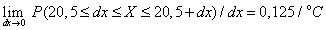
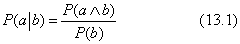

<?xml version="1.0" encoding="UTF-8" standalone="no"?>
<!DOCTYPE html PUBLIC "-//W3C//DTD XHTML 1.1//EN" "http://www.w3.org/TR/xhtml11/DTD/xhtml11.dtd">
<html xmlns="http://www.w3.org/1999/xhtml"><head><meta name="generator" content="DocBook XSL Stylesheets V1.76.1"/></head><body>

<h1 class="title"><a id="id665683"/>Valószínűségi alapfogalmak</h1>

Miután felállítottuk a racionális ágens általános keretét, szükségünk lesz egy formális nyelvre a bizonytalan tudás leírásához és a következtetéshez. Minden olyan jelölésnek, amely a meggyőződésünk fokának leírására szolgál, képesnek kell lennie két fő dolog kezelésére: az egyik a kijelentések jellege, amelyekhez meggyőződési mértéket akarunk rendelni, a másik pedig a meggyőződés mértékének az ágens tapasztalatától való függése. A valószínűség-elmélet itt bemutatott változata az ítéletlogika egy kiterjesztését használja állításaihoz. A tapasztalattól való függés az a priori valószínűségi kijelentések és a feltételes valószínűségi állítások szintaktikai megkülönböztetésében tükröződik. Az a priori valószínűségi kijelentéseket akkor alkalmazzuk, mielőtt még tények birtokába jutnánk, míg a feltételes valószínűségi kijelentések explicit módon tartalmazzák a megszerzett tényeket.

<h2 class="title"><a id="id665690"/>Állítások</h2>

A hiedelmi mértékeket mindig <strong>állítás</strong>okhoz (<strong>proposition</strong>s) rendeljük – amelyek ez és ez a helyzet típusú kijelentések. Az állítások leírására eddig két formális nyelvet – az ítéletlogikát és az elsőrendű logikát – használtuk. Ez az alfejezet egy olyan nyelvet ír le, amelyet a valószínűség-elmélet jellegzetesen használ, és amely valamelyest kifejezőbb az ítéletlogikánál. (A 14.6. alfejezet azokat a módszereket taglalja, amelyek megadják, hogy milyen hiedelmi mértékek tulajdoníthatók az elsőrendű logika egyes kijelentéseinek.)

A nyelv alapeleme a <strong>valószínűségi</strong> vagy <strong>véletlen változó</strong> (<strong>random variable</strong>), ami úgy tekinthető, mint ami egy kezdetben ismeretlen „állapotú” világ egy „részére” vonatkozik. Például a <em>Lyuk</em> a bal alsó bölcsességfogam esetleges lyukasságát mutatja. A véletlen változók a kényszerkielégítési problémáknál megismert CSP-változókhoz és az ítéletlogikánál használt ítéletszimbólumhoz hasonló szerepet játszanak. 

A véletlen változókat mindig nagybetűvel kezdjük. (Ugyanakkor az ismeretlen véletlen változókat változatlanul kis- és egybetűs nevekkel fogjuk jelölni, például: <em>P</em>(<em>a</em>) = 1 – <em>P</em>(¬<em>a</em>).)
<a id="ID_551_552_oldal"/>
Minden valószínűségi változóhoz tartozik egy <strong>értéktartomány</strong> (<strong>domain</strong>), amelyből az értékeit veheti. Például a <em>Lyuk</em> tartománya az 〈<em>igaz</em>, <em>hamis</em>〉 lehetne.[<a id="id665769" href="#ftn.id665769" class="footnote">134</a>] (Az értékeket kisbetűs nevekkel fogjuk jelölni.) Az állítások legegyszerűbb fajtája azt jelenti ki, hogy a valószínűségi változó valamilyen konkrét értéket vesz fel a tartományon belül. Például a <em>Lyuk</em> = <em>igaz</em> azt reprezentálja, hogy nekem valóban lyukas a bal alsó bölcsességfogam.

A véletlen változók – a CSP-változókhoz hasonlóan – tipikusan három csoportba sorolhatók a tartomány fajtájától függően:

<ul class="itemizedlist"><li class="listitem">
(<strong>Boole-típusú</strong>) <strong>logikai véletlen változó</strong>k (<strong>Boolean random variable</strong>s), mint a <em>Lyuk</em>, amelyeknek az 〈<em>igaz</em>, <em>hamis</em>〉 a tartománya. Az olyan állításokat, mint a <em>Lyuk</em> = <em>igaz</em> gyakran rövidítve, csak a kis kezdőbetűs nevével – <em>lyuk</em> – fogjuk jelölni, míg a <em>Lyuk </em>= <em>hamis</em> állítás rövidített jelölése: ¬<em>lyuk</em>.
</li><li class="listitem">
<strong>Diszkrét véletlen változó</strong>k (<strong>discrete random variable</strong>s), amelyek speciális esetben logikai változók is lehetnek, egy <em>megszámlálható</em> tartományból vesznek fel értéket. Például az <em>Időjárás </em>tartománya a 〈<em>napos</em>, <em>esős</em>, <em>felhős</em>, <em>havazik</em>〉 lehet. A tartomány értékeinek egymást kizáróknak és összességében kimerítőknek (teljeseknek) kell lenniük. Ha ez nem okozhat félreértést, akkor a <em>havazik</em> rövidítés fogja jelölni például az <em>Időjárás</em> = <em>havazik</em> állítást.
</li><li class="listitem">
<strong>Folytonos véletlen változó</strong>k (<strong>continuous random variable</strong>s), amelyek valós értéket vehetnek fel. A tartomány lehet akár a teljes valós tengely, akár annak egy részhalmaza, mint a [0, 1] intervallum. Például az az állítás, hogy <em>X</em> = 4,02 azt jelenti ki, hogy az <em>X</em> véletlen változó értéke pontosan 4,02. A véletlen változókra vonatkozó állítások egyenlőtlenségek is lehetnek, mint például <em>X</em> ≤ 4,02.
</li></ul>

Néhány kivételtől eltekintve, mi a diszkrét esetre fogunk koncentrálni.

Az összetett állítások létrehozásához az olyan elemi állítások, mint a <em>Lyuk</em> = <em>igaz</em> vagy a <em>Fogfájás</em> = <em>hamis</em>, bármely szokásos logikai kapcsolat felhasználásával kombinálhatók. Például a <em>Lyuk</em> = <em>igaz</em> ∧ <em>Fogfájás</em> = <em>hamis</em> egy olyan állítás, amelyhez valamilyen hihetőségi (hihetetlenségi) mértéket rendelhetünk. Ahogy az előző bekezdésben leírtuk, a fenti állítást úgy is jelölhetjük, hogy <em>fogszuvasodás</em> ∧ ¬<em>fogfájás</em>.

<h2 class="title"><a id="id665961"/>Elemi események</h2>

Az <strong>elemi esemény</strong> (<strong>atomic event</strong>) jelölés hasznos a valószínűség-elmélet alapjainak megértésében. Egy elemi esemény a világ – amely tekintetében az ágens bizonytalan – állapotának egy <em>teljes</em> leírását jelenti. Úgy is tekinthetjük, mint a világot alkotó összes változóhoz való konkrét érték hozzárendelését. Például, ha a világomat csak a <em>Lyuk </em>és<em> </em>a<em> Fogfájás </em>logikai változók alkotják, akkor pontosan négy különböző elemi esemény létezik; amelyek közül a <em>Lyuk</em> = <em>hamis</em> ∧ <em>Fogfájás</em> = <em>igaz</em> egy esemény.[<a id="id666006" href="#ftn.id666006" class="footnote">135</a>]

Az elemi eseményeknek van néhány fontos tulajdonsága:

<ul class="itemizedlist"><li class="listitem">
Az elemi események <em>egymást kölcsönösen kizáró</em> események – legfeljebb egyikük lehet igaz. Például, nem lehet egyszerre igaz a <em>lyuk</em> ∧ <em>fogfájás</em>,<em> </em>valamint a <em>lyuk </em>∧ ¬<em>fogfájás</em>.
</li><li class="listitem">
Az összes elemi esemény halmaza kimerítő – legalább az egyiknek igaznak kell lennie. Azaz az összes elemi esemény egyesítése logikailag egyenértékű az <em>igaz</em> állítással.
</li><li class="listitem">
Minden egyes elemi esemény maga után vonja következményként az összes állítás igazságát vagy hamisságát függetlenül attól, hogy azok egyszerűek vagy összetettek. Ez a logikai kapcsolatok szokásos szemantikájának alkalmazása révén mutatható meg (lásd 7. fejezet). Például a <em>lyuk</em> ∧ ¬<em>fogfájás</em> elemi esemény következménye a <em>fogszuvasodás </em>igaz volta és a <em>lyuk</em> ⇒ <em>fogfájás</em> hamissága.
</li><li class="listitem">
Bármely állítás logikailag egyenértékű azon elemi események diszjunkciójával, amelyekből az állítás következik. Például a <em>lyuk</em> állítás ekvivalens a <em>lyuk</em> ∧ <em>fogfájás</em> és a<em> lyuk</em> ∧ ¬<em>fogfájás </em>elemi események egyesítésével.
</li></ul>

A 13.4. feladat a fenti tulajdonságok bizonyítását célozza.

<h2 class="title"><a id="id666104"/>A priori valószínűség</h2>

Az <em>a</em> állításhoz tartozó <strong>feltétel nélküli</strong> (<strong>unconditional</strong>) vagy <strong>a priori valószínűség</strong> (<strong>prior probability</strong>) azt a meggyőződési mértéket jelenti, amely <em>bármely más információ hiányában</em> az állításhoz kapcsolható; jelölése <em>P</em>(<em>a</em>). Például ha 0,1 annak az a priori valószínűsége, hogy van lyukas fogam, akkor

<code class="code"><em>P</em>(<em>Lyuk</em> = <em>igaz</em>) = 0,1 vagy <em>P</em>(<em>lyuk</em>) = 0,1-et írhatunk.</code>

Fontos megjegyeznünk, hogy<em> P</em>(<em>a</em>)<em> </em>csak akkor használható, ha nincs semmilyen más információ a birtokunkban. Amint ismertté válik valamilyen új információ, a továbbiakban már <em>a</em> adott új információ melletti<em> feltételes </em>valószínűségével kell következtetnünk. A feltételes valószínűségekkel a következő alfejezet foglalkozik.

Bizonyos esetekben előfordulhat, hogy beszélni szeretnénk egy véletlen változó összes lehetséges értékének valószínűségéről. Ilyen esetekben a <strong>P</strong>(<em>Időjárás</em>) kifejezés használható, amely az időjárás minden egyes állapotához rendelt valószínűségi értékekből képzett <em>vektort</em> jelöli. Következésképpen, ahelyett hogy az alábbi négy egyenletet írnánk le

<code class="code"><em>P</em>(<em>Időjárás</em> = <em>napos</em>) = 0,7</code>

<code class="code"><em>P</em>(<em>Időjárás</em> = <em>esős</em>) = 0,2</code>

<code class="code"><em>P</em>(<em>Időjárás</em> = <em>felhős</em>) = 0,08</code>

<code class="code"><em>P</em>(<em>Időjárás</em> = <em>havazik</em>) = 0,02</code>

elegendő egyszerűen azt írnunk, hogy

<code class="code"><em>P</em>(<em>Időjárás</em>) = 〈0,7, 0,2, 0,08, 0,02〉</code>

Az ilyen kijelentés az <em>Időjárás</em> véletlen változó előzetes <strong>valószínűség-eloszlás</strong>át (<strong>probability distribution</strong>) definiálja.

Olyan kifejezéseket is használni fogunk, mint a <strong>P</strong>(<em>Időjárás</em>, <em>Lyuk</em>), hogy egy véletlen változóhalmaz összes lehetséges kombinációjának valószínűségeit jelölni tudjuk.[<a id="id666296" href="#ftn.id666296" class="footnote">136</a>] Ekkor a <strong>P</strong>(<em>Időjárás</em>, <em>Lyuk</em>) egy 4 × 2-es valószínűségi táblázatot jelent. Ez az <em>Időjárás</em> és<em> Lyuk </em><strong>együttes valószínűség-eloszlás</strong>a (<strong>joint probability distribution</strong>).

Hasznos lehet az is, ha világot leíró véletlen változók teljes halmazáról gondolkozunk. Az olyan együttes valószínűség-eloszlást, amely lefedi a teljes halmazt <strong>teljes együttes valószínűség-eloszlás</strong>nak (<strong>full joint probability distribution</strong>) nevezzük. Például, ha a világ csak a <em>Lyuk, </em>a<em> Fogfájás </em>és az <em>Időjárás</em> változókból áll, akkor a teljes együttes valószínűség-eloszlást a

<code class="code"><em>P</em>(<em>Lyuk</em>, <em>Fogfájás</em>, <em>Időjárás</em>)</code>

adja meg. Ez az együttes valószínűség-eloszlás egy 16 elemű, 2 × 2 × 4-es táblázattal reprezentálható. A teljes együttes valószínűség-eloszlás minden egyes elemi esemény valószínűségét, és így <em>a kérdéses világgal kapcsolatos összes bizonytalanságot meghatározza. </em>A 13.4. alfejezetben látni fogjuk, hogy a teljes együttes valószínűség-eloszlás alapján bármely valószínűségi kérdés megválaszolható.

Folytonos változók esetén az eloszlás nem foglalható össze táblázatos formában, mivel a lehetséges értékek száma végtelen. Ehelyett annak valószínűsége, hogy egy valószínűségi változó egy adott <em>x</em> értéket vesz fel, általában <em>x</em> egy paraméterezett függvényeként definiálható. Például az <em>X</em> véletlen változó jelölje a holnapi hőmérséklet maximumát Berkeleyben. Ezzel a 

<code class="code"><em>P</em>(<em>X</em> = <em>x</em>) = <em>U</em>[18, 26](<em>x</em>)</code>

kijelentés azt a hiedelmet fejezi ki, hogy <em>X</em> egyenletes eloszlást mutat 18 és 26 °C között. (Néhány hasznos folytonos valószínűségi változó definícióját az A) függelékben találjuk meg.) A folytonos valószínűségi változókra vonatkozó valószínűségi eloszlást <strong>valószínűség-sűrűségfüggvény</strong>nek (<strong>probability density function</strong>) nevezzük. A sűrűségfüggvények jelentése különbözik a diszkrét eloszlásokétól. Például a korábbiakban megadott hőmérsékleteloszlásból kiindulva <em>P</em>(<em>X</em> = 20,5) = <em>U</em>[18, 26](20,5) = 0,125/°<em>C</em> <em> </em>adódik. Ez <em>nem </em>azt jelenti, hogy annak az esélye, hogy a holnapi maximális hőmérséklet <em>pontosan </em>20,5 °C lesz 12,5%; ennek a valószínűsége természetesen 0. Technikailag ez azt jelenti, hogy annak a valószínűsége, hogy a kérdéses hőmérséklet a 20,5 °C egy kicsiny környezetébe fog esni, határértékét tekintve egyenlő azzal, hogy a 0,125-öt elosztjuk a szakasz °C-ban megadott szélességével:

Néhány szerző a diszkrét eloszlások és a sűrűségfüggvények jelölésére más szimbólumot használ; mi <em>P</em>-vel fogjuk jelölni mindkettőt, mivel ritkán lehet ezeket összekeverni, és az egyenletek általában azonos formájúak. Jegyezzük meg ugyanakkor, hogy míg a valószínűségek mértékegység nélküli számok, a sűrűségfüggvényeknek van mértékegysége, a fenti példában 1/°C.
<a id="ID_554_oldal"/>

<h2 class="title"><a id="id666486"/>Feltételes valószínűség</h2>

Amint az ágens bizonyos tények birtokába jut a korábban ismeretlen, a tartományra jellemző véletlen változóra vonatkozóan, az a priori valószínűségek többé nem használhatók. Ehelyett a <strong>feltételes</strong> (<strong>conditional</strong>) vagy <strong>a posteriori</strong> (<strong>posterior</strong>) valószínűségeket használhatjuk. Jelölése <em>P</em>(<em>a</em>∣<em>b</em>), ahol <em>a</em> és <em>b </em>tetszőleges állítás lehet.[<a id="id666531" href="#ftn.id666531" class="footnote">137</a>] Értelmezése: <em>a </em>valószínűsége, ha <em>b</em>-t és csak <em>b</em>-t tudjuk. Például,

<code class="code"><em>P</em>(<em>Lyuk</em>∣<em>Fogfájás</em>) = 0,8</code>

azt jelenti, hogy ha egy betegnél megfigyeltük, hogy fogfájása van, és semmilyen más információnk nincs vele kapcsolatban, akkor annak a valószínűsége, hogy szuvas a foga 0,8. Egy <em>P</em>(<em>lyuk</em>) típusú a priori valószínűség tekinthető a <em>P</em>(<em>lyuk</em>∣) feltételes valószínűség speciális esetének, ahol a feltételt a „semmi bizonyíték” jelenti.

A feltételes valószínűségek megadhatók feltétel nélküliek segítségével. A definíció

minden <em>P</em>(<em>b</em>) &gt; 0 esetén igaz. Az egyenletet írhatjuk

<code class="code"><em>P</em>(<em>a</em> ∧ <em>b</em>) = <em>P</em>(<em>a</em>∣<em>b</em>)<em>P</em>(<em>b</em>)</code>

alakban is, amelyet <strong>szorzatszabály</strong>nak (<strong>product rule</strong>) hívunk. A szorzatszabályt talán könnyebb megjegyezni: ez abból következik, hogy <em>a</em> és <em>b</em> együttes teljesüléséhez, szükséges, hogy <em>b</em> igaz legyen, valamint hogy <em>a</em> is igaz legyen<em> b</em> feltétele mellett. A szabályt megadhatjuk fordítva is:

<em>P</em>(<em>a</em> ∧ <em>b</em>) = <em>P</em>(<em>b</em>∣<em>a</em>)<em>P</em>(<em>a</em>)

Bizonyos esetekben könnyebb a konjunkciók feltétel nélküli (a priori) valószínűségeit használni, azonban mi az esetek többségében feltételes valószínűségeket fogunk alkalmazni valószínűségi következtetéseink eszközeként.

A <strong>P</strong> jelölést használhatjuk feltételes eloszlásokra is. <strong>P</strong>(<em>X</em>∣<em>Y</em>) a<em> P</em>(<em>X</em> = <em>xi</em>∣<em>Y</em> = <em>yi</em>) értékeit adja meg minden lehetséges <em>i</em>-re,<em> j</em>-re. Annak példájaként, hogy ez mennyivel tömörebbé teszi a jelölést, képzeljük el a szorzatszabály alkalmazását minden olyan esetre, ahol az <em>a</em> és <em>b</em> állítások <em>X</em> és<em> Y</em> bizonyos értékeit veszik fel. A következő egyenleteket fogjuk kapni:

<code class="code"><em>P</em>(<em>X</em> = <em>x</em>1 ∧ <em>Y</em> = <em>y</em>1) = P(<em>X</em> = <em>x</em>1∣<em>Y</em> = <em>y</em>1) = <em>P</em>(<em>Y</em> = <em>y</em>1)</code>

<code class="code"><em>P</em>(<em>X</em> = <em>x</em>1 ∧ <em>Y</em> = <em>y</em>2) = P(<em>X</em> = <em>x</em>1∣<em>Y</em> = <em>y</em>2) = <em>P</em>(<em>Y</em> = <em>y</em>2)</code>

Mindezt összefoglalhatjuk egyetlen egyenletben is:

<code class="code"><em>P</em>(<em>X</em>, <em>Y</em>) = <em>P</em>(<em>X</em>∣<em>Y)</em>P<em>(Y)</em></code>

Ne felejtsük, hogy ez egy olyan egyenlethalmaz jelölésére szolgál, amely kapcsolatba hozza a táblázatok megfelelő elemeit, és <em>nem</em> a táblázatok mátrix szorzásáról van szó. Csábító, de helytelen a feltételes valószínűségeket bizonytalansággal kiegészített logikai implikációkként tekinteni. Például a <em>P</em>(<em>a</em>∣<em>b</em>) = 0,8 állítást <em>nem lehet </em>úgy értelmezni, hogy amikor csak igaz <em>b</em>, <em>P</em>(<em>a</em>) 0,8-del egyenlő. Ez két okból is téves: először is <em>P</em>(<em>a</em>) mindig <em>a</em> előzetes valószínűségét, és nem a valamilyen tény megléte esetén alkalmazandó utólagos valószínűségét jelöli; másrészről pedig a <em>P</em>(<em>a</em>|<em>b</em>) = 0,8 csak akkor alkalmazható, ha <em>b </em>az <em>egyetlen </em>tény, amelynek birtokában vagyunk. Ha ismerünk egy további <em>c</em> információt is, akkor <em>a</em> hihetőségi mértékét <em>P</em>(<em>a</em>∣<em>b</em> ∧ <em>c</em>) fogja adni, amely akár független is lehet <em>P</em>(<em>a</em>∣<em>b</em>)-tól. Például <em>c</em> megadhatja közvetlenül azt is, hogy <em>a</em> igaz vagy hamis. Ha megvizsgálunk egy beteget, aki fogfájásra panaszkodik, és találunk egy lyukas fogat, akkor a további, <em>lyuk</em> információnak jutottunk birtokába, és így természetesen, arra a következtetésre fogunk jutni, hogy <em>P</em>(<em>lyuk</em>∣<em>fogfájás</em> ∧ <em>lyuk</em>) = 1,0.

 

[<a id="ftn.id665769" href="#id665769" class="para">134</a>]  Egyesek elvárása szerint a tartományt halmazként kellene megadni: {<em>igaz</em>, <em>hamis</em>}. Mi állítások<em> n</em>-eseként írjuk le, mivel a későbbiekben ez megkönnyíti egy rendezés hozzárendelését.

[<a id="ftn.id666006" href="#id666006" class="para">135</a>]  A valószínűség-elmélet számos formája az elemi eseményt, más néven <strong>mintá</strong>t (<strong>sample point</strong>) egy primitívnek tekinti. A véletlen változót pedig, mint egy függvényt definiálja, amelynek bemenete egy elemi esemény, kimenetként pedig a megfelelő tartomány egy értékét adja. Ez a megközelítés talán általánosabb, de ugyanakkor kevésbé intuitív.

[<a id="ftn.id666296" href="#id666296" class="para">136</a>]  Az általános jelölési szabály szerint az eloszlás a nagybetűs változók összes értékét tartalmazza. Azaz, a <strong>P</strong>(<em>Időjárás</em>, <em>lyuk</em>) a valószínűségek egy olyan négyelemű vektorát jelenti, amelyben minden egyes időjárás-állapot valószínűsége szerepel <em>Lyuk </em>=<em> igaz</em> mellett.

[<a id="ftn.id666531" href="#id666531" class="para">137</a>]  A „∣” operátor a lehető legkevesebb előzményt jelenti, azaz a <em>P</em>(<em>a </em>∧ <em>b</em>|<em>c </em>∨ <em>d</em>) <em>P</em>((<em>a </em>∧ <em>b</em>)|(<em>c </em>∨ <em>d</em>))-vel egyenértékű.

</body></html>
