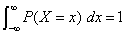

<?xml version="1.0" encoding="UTF-8" standalone="no"?>
<!DOCTYPE html PUBLIC "-//W3C//DTD XHTML 1.1//EN" "http://www.w3.org/TR/xhtml11/DTD/xhtml11.dtd">
<html xmlns="http://www.w3.org/1999/xhtml"><head><meta name="generator" content="DocBook XSL Stylesheets V1.76.1"/></head><body>

<h1 class="title"><a id="id667052"/>Valószínűségi axiómák</h1>

Az eddigiekben az állításokra, az a priori, valamint a feltételes valószínűségi kijelentésekre vonatkozó szintaxist definiáltunk. A továbbiakban meg kell fogalmaznunk a valószínűségi kijelentések valamilyen szemantikáját is. Ezt azokkal az alapvető axiómákkal kezdjük, amelyek a valószínűségi skálát és annak végpontjait határozzák meg:

<ol class="orderedlist"><li class="listitem">
Minden valószínűség 0 és 1 közé esik. Bármely <em>a</em> kijelentésre
</li></ol>

<code class="code">0 ≤ <em>P</em>(a) ≤ 1</code>

<ol class="orderedlist"><li class="listitem">
A biztosan igaz (azaz érvényes) állítások valószínűsége 1, a biztosan hamis (azaz kielégíthetetlen) állításoké pedig 0.
</li></ol>

<code class="code"><em>P</em>(<em>igaz</em>) = 1	   <em>P</em>(<em>hamis</em>) = 0</code>

	Ezután egy olyan axiómára van szükségünk, amely a logikailag összefüggő állításokat kapcsolja össze. A legegyszerűbb, ha a diszjunkcióra vonatkozó valószínűséget az alábbiak szerint definiáljuk:

<ol class="orderedlist"><li class="listitem">
A diszjunkció valószínűsége
</li></ol>

<code class="code"><em>P</em>(<em>a</em> ∨ <em>b</em>) = <em>P</em>(<em>a</em>) + <em>P</em>(<em>b</em>) – <em>P</em>(<em>a</em> ∧ <em>b</em>)</code>

Ez utóbbi szabályt könnyű megjegyezni arról, hogy azok az esetek, ahol <em>a</em> igaz és azok az esetek, ahol <em>b</em> igaz, együtt természetesen lefedik azokat az eseteket, ahol <em>a</em> ∨ <em>b</em> igaz; ugyanakkor a két halmazba eső eseteket összeadva kétszer számoljuk azokat, amelyek a halmazok közös részébe esnek, így ki kell vonnunk <em>P</em>(<em>a</em> ∧ <em>b</em>)-t.

Ezt a három axiómát gyakran nevezik <strong>Kolmogorov-axiómák</strong>nak (<strong>Kolmogorov’s axioms</strong>) az orosz matematikus Andrei Kolmogorov emlékére, akinek a nevéhez fűződik az ezen alapaxiómákból kiinduló valószínűség-elmélet felépítése. Vegyük észre, hogy az axiómák csak az a priori valószínűségekkel, és nem a feltételes valószínűségekkel foglalkoznak; ennek oka, hogy az utóbbiakat már a korábbiakban definiáltuk a (13.1) egyenlet szerint.

<h3 class="title">Fontos</h3>
<strong>Honnan származnak a valószínűségek?</strong>

Vég nélküli viták folytak a valószínűségi számok forrása és értelme körül. A <strong>frekvencionistab</strong>(<strong>frequentist</strong>) álláspont szerint ezek az értékek csak <em>kísérletekből</em> származhatnak: ha 100 ember vizsgálata során az derül ki, hogy 10-nek szuvas a foga, akkor azt mondhatjuk, hogy a szuvas fog valószínűsége körülbelül 0,1. E szemlélet szerint az az állítás, miszerint „a lyuk valószínűsége 0,1” azt jelenti, hogy ha végtelen sok mintát megvizsgálnánk, határértékét tekintve 0,1 lenne annak a résznek a hányada, ahol ezt tapasztalnánk. Tetszőleges, de véges számú minta esetén pedig megbecsülhetjük a valós arányt, valamint kiszámíthatjuk azt is, hogy várhatóan mekkora lesz a becslésünk pontossága.

    Az <strong>objektivista</strong> (<strong>objectivist</strong>) megközelítés szerint a valószínűségek inkább az univerzum valóságos jellemzőinek tekinthetők – ahol egy jellemző a dolgok hajlama bizonyos típusú viselkedésre –, mint egy megfigyelő meggyőződési foka leírásának. Például az, hogy egy nem hamis pénzdarab feldobásánál 0,5-es valószínűséggel fej jön ki, magának a pénzdarabnak a hajlandósága. E szemlélet szerint a frekvencionista mérések ezen hajlandóságok megfigyelésére tett kísérletek. A legtöbb fizikus egyetért abban, hogy a kvantumjelenségek valójában valószínűségiek, de makroszkopikus szinten – például a pénzfeldobásnál – a bizonytalanság a kezdeti feltételek elhanyagolása miatt lép fel, ami látszólag nem konzisztens a hajlandóságalapú szemlélettel.

    A <strong>szubjektivista</strong> (<strong>subjectivist</strong>) szemlélet szerint a valószínűségek inkább az ágens meggyőződésének jellemzésére szolgálnak, és nincs külső fizikai jelentőségük. E szerint az orvos vagy az elemző aszerint találhatja ki a számokat, hogy mondhassa véleményem szerint a lyuk valószínűsége 0,1 körül várható. Kifejlesztettek olyan további, még megbízhatóbb módszereket is – mint például az <a class="xref" href="ch13s03.md#ID_557_558_oldal">„A valószínűségi axiómák használata”</a> részben részletezett fogadási rendszereket –, amelyekkel az emberek valószínűség-hozzárendelését szerették volna kiismerni. A <strong>vonatkoztatási osztály</strong> (<strong>reference class</strong>) probléma jól illusztrálja a szubjektivitás jelenlétét. Képzeljünk el egy frekvencionista orvost, aki meg akarja állapítani annak az esélyeit, hogy egy páciens egy bizonyos betegségben szenved. Ehhez az orvos más, de fontos szempontokból (kor, tünet, esetleg nem tekintetében) azonos betegeket akar figyelembe venni, majd megnézni közöttük az ilyen betegségben szenvedők arányát. Azonban, ha az orvos mindent figyelembe vesz, amit ismer a beteggel kapcsolatban – a grammra pontos testsúlyát, a haja színét, az anyja leánykori nevét stb. – arra az eredményre fog jutni, hogy nincs még egy olyan ember, aki pontosan megegyezne a beteggel, és így nincs olyan vonatkoztatási osztály sem, amelyről kísérleti eredményeket lehetne gyűjteni. Mindez nyugtalanító kérdése a tudományfilozófiának.

    Laplace <strong>közömbösségi elv</strong>e (<strong>principle of indifference</strong>) (Laplace, 1816) szerint a tény tekintetében szintaktikailag „szimmetrikus” állításokhoz azonos valószínűséget kell rendelni. Erre vonatkozóan történtek különböző finomítási javaslatok, amelyek Carnap és más filozófusok azon törekvéseiben csúcsosodtak ki, hogy egy olyan precíz <strong>induktív logiká</strong>t (<strong>inductive logic</strong>) fejlesszenek ki, amely képes bármely állítás helyes valószínűségét tetszőleges megfigyelések alapján meghatározni. Jelenlegi felfogásunk szerint nem létezik különálló induktív logika; inkább úgy gondoljuk, hogy minden ilyen logika egy szubjektív a priori valószínűségi eloszláson alapszik, amelynek hatása a megfigyelések számának növekedésével csökken.

<h2 class="title"><a id="id667272"/>A valószínűségi axiómák használata</h2>

A valószínűségi axiómákból nagyon sok hasznos tény vezethető le. Például a tagadásra vonatkozó jól ismert szabály következik, ha ¬<em>a</em>-val helyettesítjük <em>b</em>-t a harmadik axiómában:

<code class="code">P(a ∨ ¬a) = P(a) + P(¬a) – P(a ∧ ¬a)		 (a 3. axiómából, <em>b</em> = ¬<em>a</em> helyettesítéssel)</code>

<code class="code"><em>P</em>(<em>igaz</em>) = P(<em>a</em>) + <em>P</em>(¬<em>a</em>) –<em> P</em>(<em>hamis</em>)<em>		</em>(logikai ekvivalencia alapján)</code>

<code class="code">1 = P(<em>a</em>) + <em>P</em>(¬<em>a</em>) 				(a 2. axiómából)</code>

<code class="code"><em>P</em>(¬<em>a</em>)	 = 1 –P(a)				(algebrai műveletekkel)</code>
<a id="ID_557_558_oldal"/>
A következtetés harmadik sora önmagában is hasznos tény és kiterjeszthető a Boole-típusú logikai esetből az általános diszkrét esetre. Legyen 〈<em>d</em>1, …, <em>dn</em>〉 a <em>D</em> diszkrét változó értelmezési tartománya. Könnyű megmutatni (13.2. feladat), hogy 

Azaz, egyetlen változó tetszőleges valószínűségi eloszlása összegzésének 1-et kell adnia.[<a id="id667383" href="#ftn.id667383" class="footnote">138</a>] Igaz az is, hogy változók tetszőleges <em>halmazának </em>bármely <em>együttes</em> valószínűségi eloszlását összegezve, eredményül szintén 1-et kapunk: ennek belátására elegendő egyetlen többdimenziós, az eredeti változók értelmezési tartományai Descartes-szorzataként létrehozott tartomány felett értelmezett változót létrehoznunk.

<h3 class="title">Fontos</h3>
Emlékezzünk, hogy bármely <em>a</em> állítás egyenértékű minden olyan elemi esemény diszjunkciójával, ahol <em>a</em> igaz; nevezzük az események ezen halmazát <strong>e</strong>(<em>a</em>)-nak. Emlékezzünk arra is, hogy az elemi események egymást kölcsönösen kizárják, így a 2. axióma szerint az ilyen események konjunkciója nulla. Következésképpen a 3. axiómából a következő egyszerű összefüggésre juthatunk: <em>Egy állítás valószínűsége megegyezik azon elemi események valószínűségeinek összegével, ahol az állítás igaz</em>, azaz

Ez az egyenlet egyszerű módszert kínál bármilyen állítás valószínűségének meghatározására, ha adott az összes elemi esemény valószínűségét meghatározó teljes együttes valószínűség-eloszlás (lásd 13.4. alfejezet). A következő alfejezetekben a valószínűségek kezelésének további szabályait fogjuk származtatni. Mindenekelőtt azonban az axiómák megalapozottságát vizsgáljuk meg.

<h2 class="title"><a id="id668347"/>Ami a valószínűségi axiómákat indokolja</h2>

A valószínűségi axiómák tekinthetők az ágens által elhihető valószínűségi hiedelmek korlátainak. Ez valamennyire hasonlít a logikai esethez, amikor például egy logikai ágens nem hihet egyszerre <em>A-</em>ban, <em>B-</em>ben és ¬(<em>A</em> ∧ <em>B</em>)-ben. De van itt egy további bonyodalom is. A logikai esetben az együttes bekövetkezés definíciójának jelentése szerint a fenti állítások közül legalább egynek <em>hamisnak kell lennie a valóságban, </em>vagyis egy ágens számára ésszerűtlen mindháromban hinni. A valószínűségeket tekintve azonban a kijelentések nem közvetlenül a valóságra vonatkoznak, hanem az ágens saját ismereteire. Akkor miért nem hihet egy ágens a meggyőződések következő – a harmadik axiómát egyértelműen megsértő valószínűség-hozzárendelések – halmazában?

<code class="code"><em>P</em>(<em>a</em>) = 0,4		<em>P</em>(<em>a</em> ∧ <em>b</em>) = 0,0			</code>

<code class="code"><em>P</em>(<em>b</em>) = 0,3		<em>P</em>(<em>a</em> V <em>b</em>) = 0,8			(13.3)</code>

Az effajta kérdés évtizedekig vita tárgya volt azok között, akik a valószínűségek használatát tartották egyedül jogosnak a meggyőződési mértékek kifejezésére, és azok között, akik más megközelítési módokat javasoltak. Itt most egy olyan érvelést mutatunk be a valószínűségi axiómákkal kapcsolatban, amelyet először Bruno de Finetti fejtett ki 1931-ben.

De Finetti érvelésének kulcsa a meggyőződési fok és a cselekvések közötti összefüggés. A gondolat lényege, hogy ha egy ágensnek van valamilyen szintű meggyőződése egy<em> a</em> állítással kapcsolatban, akkor képesnek kell lennie olyan téteket megadni, amelyek mellett mindegy, hogy az <em>a</em> állításra, vagy ellene fogad. Képzeljük el úgy, mint egy játszmát két ágens között: az 1. ágens szerint az én hiedelmem az <em>a</em> eseményben 0,4. A 2. ágens ezután szabadon dönthet, hogy <em>a</em> mellett vagy ellen fogad akkora téttel, amely a nyilatkozott hiedelemfokkal konzisztens. Vagyis a 2. ágens választhatja azt, hogy arra fogad, hogy <em>a</em> esemény bekövetkezik, 4 dollárt téve az 1. ágens 6 dollárjával szemben, vagy tehet 6 dollárt az 1. ágens 4 dollárja ellenében arra fogadva, hogy <em>a</em> nem fog bekövetkezni.[<a id="id668438" href="#ftn.id668438" class="footnote">139</a>] Ha egy ágens meggyőződésében nem tükröződik pontosan a világ ismerete, akkor számíthatunk arra, hogy hosszú távon veszíteni fog a szemben álló ágenssel szemben, akinek a hiedelmei pontosabb képet mutatnak a világ állapotáról.

<h3 class="title">Fontos</h3>
De Finetti ennél sokkal erősebb állítást is bizonyított: <em>ha az 1. ágens olyan meggyőződési mértékekben hisz, amelyek megsértik a valószínűség-számítás axiómáit, akkor létezik olyan stratégia a 2. ágens számára, amely </em><strong>biztosítja</strong>, <em>hogy az 1. ágens </em><strong>minden</strong> <em>alkalommal veszíteni fog.</em> Tehát ha elfogadjuk, hogy egy ágensnek a valószínűségeknek megfelelően kell feltennie a pénzét, akkor azt is el kell fogadnunk, hogy ésszerűtlen olyan meggyőződéseket vallani, amelyek megsértik a valószínűségi axiómákat.

Azt gondolhatjuk, hogy ez a fogadósdi nagyon körmönfont. Mi van például, ha valaki megtagadja, hogy fogadjon? Elrontja-e ez az egész érvelést? Minderre az a válasz, hogy a fogadásos játék elvont modellje annak a döntési helyzetnek, amelyben minden ágens minden pillanatban <em>elkerülhetetlenül</em> részt vesz. Minden cselekvés (beleértve a tétlenséget is) egyfajta fogadás, és a következmény tekinthető a fogadás nyereményének. Épp úgy nem utasíthatjuk vissza a fogadást, mint ahogy nem állíthatjuk meg az idő múlását.

Nem mutatjuk be de Finetti elméletének bizonyítását, de mutatunk rá egy <em>példát. Tegyük fel, hogy az 1. ágens meggyőződése megfelel a </em>(<em>13.3</em>)<em> egyenletnek. A </em>13.2. ábra azt mutatja, hogy ha a 2. ágens azt választja, hogy 4 dollárt tesz <em>a</em>-ra, 3 dollárt <em>b</em>-re és 2 dollárt ¬(<em>a</em> ⋁ <em>b</em>)-re, akkor az 1. ágens mindig veszíteni fog, függetlenül attól, hogy <em>a</em> vagy<em> b</em> fog bekövetkezni.

<a id="id668505"/>
<strong>13.2. ábra - Mivel az 1. ágens meggyőződése nem következetes, ezért a 2. ágens tud úgy téteket tenni, amely <em>a</em> és <em>b</em> kimenetelétől függetlenül biztosítja, hogy az 1. ágens veszítsen</strong>

Más, erősen filozofikus érveléseket is előterjesztettek a valószínűségek használata mellett, amelyek közül a legnevezetesebb Cox és Carnap nevéhez fűződik (Cox, 1946; Carnap, 1950). Lévén a világ olyan, amilyen, a gyakorlati példák sokszor minden bizonyítéknál erősebbek. Így a valószínűség-számításon alapuló következtető rendszerek sikere minden érvelésnél hatékonyabb volt a hitetlenek megtérítésében. A következőkben azt vizsgáljuk meg, hogy az axiómák hogyan használhatók a következtetésben.

 

[<a id="ftn.id667383" href="#id667383" class="para">138</a>]  Folytonos változóknál az összegzést integrállal kell helyettesíteni: 

[<a id="ftn.id668438" href="#id668438" class="para">139</a>]  Érvelhetünk azzal, hogy az ágens döntését a bankviszonyok fogják meghatározni, azaz 1 dollár elvesztése nincs kiegyensúlyozva 1 dollár azonos valószínűség mellett való megnyerésével. Kellően kicsire választva azonban a tétet, ez a probléma elkerülhető. Savage (Savage, 1954) analízise az egész problémát elkerüli.

</body></html>
