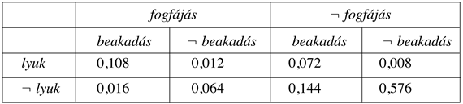
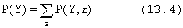
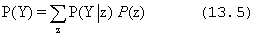
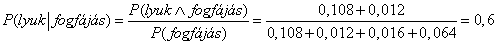
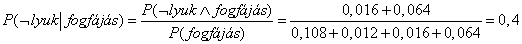
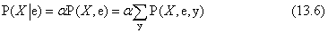
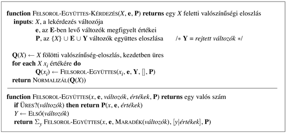

<?xml version="1.0" encoding="UTF-8" standalone="no"?>

<html xmlns="http://www.w3.org/1999/xhtml"><head><meta name="generator" content="DocBook XSL Stylesheets V1.76.1"/></head><body>

<h1 class="title"><a id="id668524"/>Teljes együttes valószínűség-eloszláson alapuló következtetés </h1>

Ebben az alfejezetben a <strong>valószínűségi következtetés</strong> (<strong>probabilistic inference</strong>) egy egyszerű módszerét fogjuk leírni – hogy hogyan határozhatók meg az állítások a<em> </em>posteriori valószínűségekre vonatkozó megfigyelt bizonyítékok alapján. „Tudásbázisként”, a teljes együttes valószínűség-eloszlást fogjuk használni, amelyből az összes kérdésre adandó válasz levezethető. Menet közben számos hasznos, a valószínűségeket tartalmazó egyenletek kezelésére alkalmas módszert is bevezetünk.

Kezdjük egy egészen egyszerű példával, egy olyan tartománnyal, amely mindössze három logikai változóból áll. Ezek: <em>Fogfájás</em>, <em>Lyuk</em>,<em> Beakadás </em>(a fogorvos kellemetlen acélszondája beleakad a fogamba). A teljes együttes eloszlás a 13.3. ábra szerinti 2 × 2 × 2-es táblázatból fog állni.

<a id="id668557"/>
<strong>13.3. ábra - A <em>Fogfájás</em>, <em>Lyuk</em>,<em> Beakadás</em> világ egy teljes együttes valószínűség-eloszlása</strong>

Vegyük észre, hogy az együttes valószínűség-eloszlásban – a valószínűségi axiómáknak megfelelően – a valószínűségek összege 1. Hasonlóképpen, a (13.2) egyenlet közvetlen módot nyújt bármely, egyszerű vagy összetett állítás valószínűségének a meghatározására: egyszerűen azokat az elemi eseményeket kell meghatároznunk, amelyekben az állítás igaz, majd összegeznünk kell a hozzájuk rendelt valószínűségeket. Például, hat olyan elemi esemény van, amelyben a <em>lyuk</em> ∨ <em>fogfájás</em> igaz:

<code class="code"><em>P</em>(<em>lyuk</em> ∨ <em>fogfájás</em>) = 0,108 + 0,012 + 0,072 + 0,008 + 0,016 + 0,064 = 0,28</code>

Az egyik általános feladat a változók egy részhalmaza vagy egyetlen változó fölötti valószínűségi eloszlás kifejezése. Például az első sor bejegyzéseinek összege a <em>lyuk</em> feltétel nélküli vagy <strong>peremeloszlás</strong>át[<a id="id668612" href="#ftn.id668612" class="footnote">140</a>] (<strong>marginal probability</strong>) adja:

<code class="code"><em>P</em>(<em>lyuk</em>) = 0,108 + 0,012 + 0,072 + 0,008 = 0,2</code>

Ezt a folyamatot <strong>marginalizálás</strong>nak (<strong>marginalization</strong>) vagy <strong>kiátlagolás</strong>nak (<strong>summing out</strong>) hívjuk, mivel a <em>Lyuk</em>-on<em> </em>kívüli változókat „kiátlagoljuk”. A következő általános behatárolási szabályt fogalmazhatjuk meg a változók tetszőleges <strong>Y</strong> és <strong>Z </strong>halmaza esetén:

Azaz, egy <strong>Y</strong> feletti eloszlás megkapható, ha az összes többi változót kiátlagoljuk az <strong>Y</strong>-t tartalmazó együttes eloszlásokból a szorzat szabályban

Ezt a szabályt <strong>feltételfeloldás</strong>nak (<strong>conditioning</strong>) hívjuk. A marginalizálás és a feltételfeloldás szabályai előnyöseknek fognak bizonyulni mindenfajta valószínűségi kifejezéseket tartalmazó következtetésben.

A legtöbb esetben valamely változó, bizonyos másokra vonatkozó tények esetén fennálló, <em>feltételes </em>valószínűségének kiszámítása fog bennünket érdekelni. A feltételes valószínűségek meghatározásához, először is alkalmazzuk a (13.1) egyenletet, hogy egy feltétel nélküli valószínűségen alapuló kifejezésre jussunk, majd ezen kifejezés értékét meghatározzuk a teljes együttes eloszlásból. Például a lyuk valószínűségét a fogfájás tény fennállása esetére az alábbiak szerint határozhatjuk meg:

Ellenőrzésképpen kiszámíthatjuk annak valószínűségét, hogy nincs lyuk, de tudjuk, hogy fogfájás igen:

Vegyük észre, hogy a fenti két számításban az 1/<em>P</em>(<em>fogfájás</em>) konstans értékű marad függetlenül attól, hogy a <em>Lyuk</em> mely értékét számítjuk. Valójában ez egy, a <strong>P</strong>(<em>Lyuk</em>∣<em>fogfájás</em>)-t <strong>normalizálás</strong> (<strong>normalization</strong>) konstansnak tekinthető, amely biztosítja, hogy a feltételes valószínűségek összege 1 lesz. A valószínűségekkel foglalkozó fejezetekben az ilyen konstansokat <em>a</em>-val fogjuk jelölni. E jelölés segítségével a két előző kifejezés egybefoglalható:

<code class="code"><em>P</em> (<em>Lyuk</em>∣<em>fogfájás</em>) = <em>α</em><em>P</em> (<em>Lyuk</em>, <em>fogfájás</em>)</code>

<code class="code">   = <em>α</em>[<em>P</em>(<em>Lyuk</em>, <em>fogfájás</em>, <em>beakadás</em>) + <em>P</em>(<em>Lyuk</em>, <em>fogfájás</em>,<em> </em>¬<em>beakadás</em>)]</code>

<code class="code">   = <em>α</em>[〈0,108, 0,016〉 + 〈0,012, 0,064〉 = <em>α</em>〈0,12, 0,08〉 = 〈0,6, 0,4〉</code>

A normalizálás sok valószínűségi számításnál hasznos rövidítésnek bizonyul.

A példából levezethető egy általános következtetési eljárás. Ragaszkodjunk ahhoz az esethez, ahol a keresés egy változót érint. A következő jelölésekre lesz még szükségünk: jelölje <em>X</em> a keresés változóját (a példában ez a <em>Lyuk</em>), <strong>E </strong>jelentse a tény változók halmazát (a példában a <em>Fogfájás</em> az egyetlen ilyen), <strong>e</strong> ezek megfigyelt értékét mutatja és a többi, meg nem figyelt változót <strong>Y</strong> foglalja magában (a példa esetében csak a <em>Beakadás</em> tartozik ide). <strong>P</strong>(<em>X</em>∣<strong>e</strong>)-t keressük, és a következőképpen számíthatjuk ki:

ahol az összegzést az összes lehetséges <strong>y</strong> fölött végezzük (azaz az <strong>Y</strong> meg nem figyelt változók értékeinek összes lehetséges kombinációja esetén). Vegyük észre, hogy az <em>X</em>, <strong>E</strong> és <strong>Y</strong> változó együttesen a változók teljes halmazát alkotja az adott tárgytartományban, így <strong>P</strong>(<em>X</em>, <strong>e</strong>, <strong>y</strong>) egyszerűen a teljes valószínűségi eloszlás egy valószínűségi részhalmaza. Az algoritmust a 13.4. ábra mutatja.

<a id="id668952"/>
<strong>13.4. ábra - A valószínűségi következtetés egy olyan algoritmusa, amely valamely teljes együttes valószínűségi eloszlás bejegyzéseit veszi számba</strong>

Az eljárás ciklusa mind <em>X</em>, mind <em>Y</em> összes értéke fölött fut, számba véve minden olyan elemi eseményt, amely <strong>e</strong> rögzített értéke mellett lehetséges, az együttes valószínűségi tábla alapján összegzi ezek valószínűségeit, és normalizálja az eredményeket.

Ha adott a teljes együttes valószínűségi eloszlás, akkor a <code class="code">FELSOROL-EGYÜTTES-KÉRDEZÉS</code> egy teljes algoritmus, amely alkalmas minden diszkrét változóra vonatkozó valószínűségi lekérdezés megválaszolására. Azonban nem minősíthető jónak: egy <em>n</em> db Boole-típusú logikai változó által leírt tartományban <em>O</em>(2n) méretű bemeneti táblára van szüksége, és a tábla feldolgozása is <em>O</em>(2n) időt igényel. Valós problémák esetén nem csupán három, hanem több száz vagy több ezer véletlen változó figyelembevételére van szükség. Nagyon hamar teljesen kivitelezhetetlenné válik a szükséges hatalmas számú valószínűség definiálása – nem létezik ugyanis olyan tapasztalat, amellyel a táblázat egyes bejegyzései külön-külön becsülhetők lennének.

Ezért a táblázatos formában megadott teljes együttes valószínűségi eloszlás a gyakorlatban nem használható eszköz következtető rendszerek felépítésére (mindemellett a fejezet végén található történeti megjegyzésekben találkozhatunk egy ilyen módszeren alapuló valós alkalmazással). E technikát úgy kell tekintenünk, mint egy elméleti alapot, amelyre a hatékonyabb módszerek épülhetnek. A fejezet további részeiben bemutatjuk azokat az alapötleteket, amelyekre szükségünk lesz a 14. fejezet valós rendszereinek kifejlesztéséhez.

 

[<a id="ftn.id668612" href="#id668612" class="para">140</a>]  Azért hívják így, mert a biztosítási matematikusok/statisztikusok általános gyakorlata szerint a megfigyelt gyakoriságokat a biztosítási táblázatok szélére (margójára) szokták írni.

</body></html>
