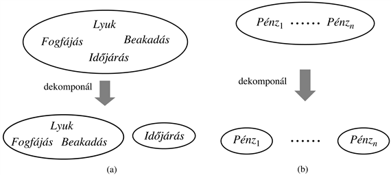

<?xml version="1.0" encoding="UTF-8" standalone="no"?>

<html xmlns="http://www.w3.org/1999/xhtml"><head><meta name="generator" content="DocBook XSL Stylesheets V1.76.1"/></head><body>

<h1 class="title"><a id="id669003"/>Függetlenség</h1>

Bővítsük ki a 13.3. ábrán látható teljes együttes valószínűségi eloszlást egy negyedik, <em>Időjárás</em> változóval. Ezzel a teljes együttes valószínűségi eloszlás <strong>P</strong>(<em>Fogfájás</em>, <em>Beakadás</em>, <em>Lyuk</em>, <em>Időjárás</em>)<em> </em>lesz 32 bejegyzéssel (mivel az <em>Időjárás</em> változónak négy értéke lehet). A teljes eloszlás a 13.3. ábrán mutatott táblázat négy „példányát” – minden egyes időjárástípusra egyet – fogja magában foglalni. Természetes kérdésnek tűnik, hogy vajon ezeknek a táblázatpéldányoknak mi az egymáshoz és az eredeti háromváltozós táblához való viszonyuk? Hogyan függ össze például a <em>P</em>(<em>fogfájás</em>, <em>beakadás</em>, <em>lyuk</em>, <em>Időjárás</em> = <em>felhős</em>) a <em>P</em>(<em>fogfájás</em>, <em>beakadás</em>,<em> lyuk</em>)-kal?

A megválaszolás egyik lehetséges módja a szorzatszabály alkalmazása:

<code class="code"><em>P</em>(<em>fogfájás</em>, <em>beakadás</em>,<em> lyuk</em>, <em>Időjárás</em> = <em>felhős</em>) = <em>P</em>(<em>Időjárás</em> = <em>felhős</em>|<em>fogfájás</em>, <em>beakadás</em>,<em> lyuk</em>)<em>P</em>(<em>fogfájás</em>, <em>beakadás</em>,<em> lyuk</em>)</code>

Amennyiben eltekintünk az isteni hatalommal bíró páciensektől, nem gondolhatjuk komolyan, hogy valakinek a fogászati problémái befolyásolják az időjárást. Ezért ésszerűnek tűnik a következő kijelentés:

<code class="code"><em>P</em>(<em>Időjárás</em> = <em>felhős</em>∣<em>fogfájás</em>, <em>beakadás</em>,<em> lyuk</em>) = <em>P</em>(<em>Időjárás</em> = <em>felhős</em>)	(13.7)</code>

Ebből a következőre következtethetünk:

<code class="code"><em>P</em>(<em>fogfájás</em>, <em>beakadás</em>,<em> lyuk</em>, <em>Időjárás</em> = <em>felhős</em>) = <em>P</em>(<em>Időjárás</em> = <em>felhős</em>)<em>P</em>(<em>fogfájás</em>, <em>beakadás</em>,<em> lyuk</em>)</code>

Hasonló egyenlet írható fel a <strong>P</strong>(<em>Fogfájás</em>, <em>Beakadás</em>,<em> Lyuk</em>, <em>Időjárás</em>)<em> </em>eloszlás minden egyes bejegyzéséhez. Az általános egyenletet pedig a következőképpen írhatjuk fel:

<code class="code"><em>P</em>(<em>Fogfájás</em>, <em>Beakadás</em>,<em> Lyuk</em>, <em>Időjárás</em>) = <em>P</em>(<em>Fogfájás</em>, <em>Beakadás</em>,<em> Lyuk</em>)<em>P</em>(<em>Időjárás</em>)</code>

Ebből következően a négyváltozós, 32 elemes táblázat létrehozható egy 8 és egy 4 elemes táblázatból. A dekompozíció sematikus vázlatát a 13.5. (a) ábra mutatja.

Azt a tulajdonságot, ami alapján a (13.7) egyenletet felírtuk <strong>függetlenség</strong>nek (más szóval <strong>marginális függetlenség</strong>nek vagy <strong>abszolút függetlenség</strong>nek) (<strong>independenc</strong><strong>e</strong>, <strong>marginal independence</strong>,<strong> absolute independence</strong>) nevezzük. Esetünkben az időjárás független bárkinek a fogászati problémáitól. Az <em>a</em> és <em>b</em> állítások függetlensége felírható:

<code class="code"><em>P</em>(<em>a</em>∣<em>b</em>) = <em>P</em>(<em>a</em>) vagy <em>P</em>(<em>b</em>∣<em>a</em>) = <em>P</em>(<em>b</em>) vagy <em>P</em>(<em>a</em> ∧ <em>b</em>) = <em>P</em>(<em>a</em>)<em>P</em>(<em>b</em>)		  (13.8)</code>

A fenti képletek egymással ekvivalensek (13.7. feladat). Az <em>X</em> és <em>Y </em>változók közötti függetlenség a következőképpen fejezhető ki (még egyszer felhívjuk a figyelmet, hogy ezek ekvivalensek):

<code class="code"><em>P</em>(<em>X</em>∣<em>Y</em>) = <em>P</em>(<em>X</em>) vagy <em>P</em>(<em>Y</em>∣<em>X</em>) = <em>P</em>(<em>Y</em>) vagy <em>P</em>(<em>X</em>, <em>Y</em>) = <em>P</em>(<em>X</em>)<em>P</em>(<em>Y</em>)</code>

A függetlenségi állítások általában a tartománnyal kapcsolatos ismereteken alapulnak. Mint korábban láthattuk, ezek jelentősen lecsökkenthetik a teljes együttes eloszlás meghatározásához szükséges információ mennyiségét. Ha a változók teljes halmaza szétbontható független részhalmazokra, akkor a teljes együttes eloszlás felbontható ezen részhalmazok felett értelmezett, egymástól független együttes eloszlásokra. Például <em>n</em> független pénzfeldobás eredményének együttes eloszlása <strong>P</strong>(<em>C</em>1, …, <em>Cn</em>) felírható <em>n</em> egyváltozós <strong>P</strong>(<em>Ci</em>) eloszlás szorzataként. Még kézzelfoghatóbban: a fogászat és a meteorológia függetlensége jó dolog, különben a fogászati gyakorlat mély meteorológiai ismereteket igényelne, és fordítva.

<a id="id669512"/>
<strong>13.5. ábra - Két példa nagyméretű együttes eloszlások kisebb eloszlásokra való felbontására az abszolút függetlenség alapján. (a) Az időjárás és a fogászati problémák függetlenek. (b) A pénzfeldobások függetlenek.</strong>

Amennyiben rendelkezésre állnak, akkor a függetlenségi állítások segíthetnek lecsökkenteni a tartományleírások méretét, valamint a következtetési feladat bonyolultságát. Sajnos azonban a változók teljes halmazait csak nagyon ritkán lehet függetlenség alapján egyértelműen szétválasztani. A függetlenség nem lesz igaz az olyan esetekben, amikor bármilyen, akár indirekt kapcsolat is, de fennáll két változó között. Ezen kívül, a független részhalmazok mérete is lehet egészen nagy – például a fogászat problémaköre egymással összefüggő betegségek tucatjait és tünetek százait takarhatja. Az ilyen típusú problémák kezelésére a függetlenség közvetlen kimondásánál kifinomultabb módszerekre lesz szükségünk.

</body></html>
