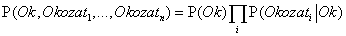

<?xml version="1.0" encoding="UTF-8" standalone="no"?>

<html xmlns="http://www.w3.org/1999/xhtml"><head><meta name="generator" content="DocBook XSL Stylesheets V1.76.1"/></head><body>

<h1 class="title"><a id="id669524"/>A Bayes-tétel és használata</h1>

Az <a class="xref" href="ch13s02.md#ID_554_oldal">„A priori valószínűség”</a> részben definiáltuk a <strong>szorzatszabály</strong>t (<strong>product rule</strong>), és rámutattunk, hogy ez a konjunkció kommutativitása miatt két alakban írható:

<code class="code"><em>P</em>(<em>a</em> ∧ <em>b</em>) = <em>P</em>(<em>a</em> | <em>b</em>)<em>P</em>(<em>b</em>)</code>

<code class="code"><em>P</em>(<em>a</em> ∧ <em>b</em>) = <em>P</em>(<em>b</em> | <em>a</em>)<em>P</em>(<em>a</em>)</code>

A jobb oldalak egyenlőségéből <em>P</em>(<em>a</em>)-val való osztás után következik, hogy

Ezt az egyenletet <strong>Bayes-szabály</strong>ként (<strong>Bayes’ rule</strong>) ismerjük (nevezik Bayes-törvénynek vagy Bayes-tételnek is).[<a id="id669637" href="#ftn.id669637" class="footnote">141</a>] Ez az egyszerű egyenlet az alapja az összes korszerű valószínűségi következtetést alkalmazó MI-rendszernek. A többértékű változókat tartalmazó általánosabb eset a <strong>P </strong>jelölésekkel a következő átírással adható meg:

amelyet ismételten úgy kell értelmezni, hogy egy egyenlethalmazt képvisel, amely egyenletek mindegyike a változók meghatározott értékeire vonatkozik. Lesznek olyan esetek, amikor egy még általánosabb felírást használhatunk, valamilyen <strong>e </strong>háttértény feltételével: 

<h2 class="title"><a id="id669680"/>Bayes tételének alkalmazása: egyszerű eset</h2>

A Bayes-tétel első pillantásra nem tűnik túl használhatónak. Egyetlen feltételes valószínűség kiszámításához három kifejezés – egy feltételes és két feltétel nélküli valószínűség – megadása szükséges.

A gyakorlatban a Bayes-tétel jól használható, mivel gyakran rendelkezünk a fenti három kifejezésre vonatkozó jó valószínűségi becsléssel, miközben a negyediket kell kiszámítanunk. Olyan feladatoknál, mint az orvosi diagnosztika, gyakran ismerjük az ok-okozati kapcsolatok feltételes valószínűségeit, miközben egy diagnózist szeretnénk felállítani. Az orvos tudja azt, hogy az agyhártyagyulladás az esetek mondjuk 50%-ában nyakmerevedést okoz a betegeknél. Az orvos ezenfelül ismer néhány feltétel nélküli tényt is: annak előzetes valószínűsége, hogy egy beteg agyhártyagyulladást kap, 1/50 000, míg annak előzetes valószínűsége, hogy egy betegnek merev a nyaka 1/20. Jelölje <em>s </em>azt az állítást, hogy a betegnek megmerevedett a nyaka, valamint <em>m</em> azt az állítást, hogy a betegnek agyhártyagyulladása van. Ekkor

Vagyis a nyakmerevedésről panaszkodó 5000 beteg közül várhatóan csak egynek lesz agyhártyagyulladása. Vegyük észre, hogy annak ellenére, hogy az agyhártyagyulladásnak igen gyakori tünete (0,5 valószínűséggel) a nyakmerevedés, annak valószínűsége, hogy egy nyakmerevedéses betegnek ténylegesen agyhártyagyulladása van, mégis csekély. Ez abból következik, hogy a nyakmerevedés a priori valószínűsége sokkal nagyobb, mint az agyhártyagyulladásé.

A 13.4. alfejezetben bemutattunk egy eljárást, amely segítségével elkerülhető a tény valószínűségének (példánkban <em>P</em>(<em>s</em>)) megbecsülése, úgy, hogy a lekérdezett változó minden egyes értékéhez (itt <em>m </em>és ¬<em>m</em>) egy utólagos valószínűséget számítunk ki, majd az eredményeket normalizáljuk. Hasonló eljárás alkalmazható, ha a Bayes-tételt használjuk. Ismert, hogy

<code class="code"><em>P</em>(<em>M|s</em>) = α〈<em>P</em>(<em>s|m</em>)<em>P</em>(<em>m</em>), <em>P</em>(<em>s|</em>¬<em>m</em>)<em>P</em>(¬<em>m</em>)〉</code>

Következésképpen ahhoz, hogy ezt a megközelítést használni tudjuk, <em>P</em>(<em>s</em>)<em> </em>helyett <em>P</em>(<em>s</em>∣¬<em>m</em>)-et kell tudnunk becsülni. Nincs ingyenebéd – van, hogy ez könnyebb és van, hogy nehezebb. A normalizált Bayes-tétel általános alakja

<code class="code"><em>P</em>(<em>Y|X</em>) = α<em>P</em>(<em>X\Y</em>)<em>P</em>(<em>Y</em>)			(13.11)</code>

ahol <em>a</em> a normalizáló konstanst jelöli, amely segítségével a <strong>P</strong>(<em>Y|X</em>) elemeinek összegét 1-gyé tudjuk tenni.

<h3 class="title">Fontos</h3>
A Bayes-tétellel kapcsolatban magától értetődő kérdés, hogy miért ismerhetjük a feltételes valószínűséget az egyik irányból, a másik irányból pedig nem. Az agyhártyagyulladás tartományban a doktor tudhatja, hogy a nyakmerevedésből csak minden 5000-dik esetben következik agyhártyagyulladás, vagyis a doktor a tünetektől a kiváltó ok felé, azaz <strong>diagnosztikai</strong> (<strong>diagnostic</strong>) irányban rendelkezik<em> </em>mennyiségi információval. Egy ilyen orvosnak nincs szüksége a Bayes-tétel alkalmazására. Sajnálatos módon azonban a <em>diagnosztikai tudás gyakran sokkal törékenyebbnek bizonyul az ok-okozati összefüggéseknél. </em>Ha például hirtelen agyhártyagyulladás-járvány tör ki, akkor az agyhártyagyulladás előzetes valószínűsége, <em>P</em>(<em>m</em>) megnő. Az az orvos, aki a járványt megelőző statisztikai adatok alapján számította ki <em>P</em>(<em>m|s</em>)-t, nem fogja tudni, hogyan változtassa meg az agyhártyagyulladásra vonatkozó értéket, míg az a doktor, aki a másik három érték segítségével számítja <em>P</em>(<em>m|s</em>)-t, látni fogja, hogy ennek értéke <em>P</em>(<em>m</em>)-mel arányosan meg fog nőni. Még fontosabb azonban, hogy a <em>P</em>(<em>s|m</em>) okozati információ értékét a járvány <em>nem befolyásolja,</em> hiszen ez kizárólag az agyhártyagyulladás lefolyásától függ. Ez a fajta közvetlen ok-okozati és modellalapú tudás alkalmazása teszi a valószínűségi rendszereket döntően robusztussá, amely a valódi világban való felhasználhatósághoz szükséges.

<h2 class="title"><a id="id669888"/>A Bayes-tétel alkalmazása: több együttes tény figyelembevétele</h2>

Láttuk, hogy a Bayes-tétel hasznos lehet az egyetlen tény – például nyakmerevedés – feltételezése melletti valószínűségi kérdések megválaszolásánál. Nevezetesen, megmutattuk, hogy a valószínűségi információ gyakran <em>P</em>(<em>okozat</em>∣<em>ok</em>) formában áll rendelkezésre. Mi történik azonban akkor, ha kettő vagy több tény van a birtokunkban? Például milyen következtetésre juthat a fogorvos, ha az az undok acélszondája lyukra akad a beteg fájó fogában? Ha ismerjük a teljes együttes eloszlást (lásd 13.3. ábra), a válasz kiolvasható:

<code class="code"><em>P</em>(<em>Lyuk</em>∣<em>fogfájás</em> ∧ <em>beakadás</em>) = α〈0,018, 0,016〉 ≈ 〈0,871, 0,129〉</code>

Azt is tudjuk ugyanakkor, hogy ez a megközelítés nagyszámú változó esetén nem használható.

Megpróbálkozhatunk a Bayes-tétel alkalmazásával is, átfogalmazva a kérdést:

<code class="code"><em>P</em>(<em>Lyuk</em>∣<em>fogfájás</em> ∧ <em>beakadás</em>) = <em>α</em><em>P</em>(<em>fogfájás</em> ∧ <em>beakadás</em>∣<em>Lyuk</em>)<em>P</em>(<em>Lyuk</em>)			(13.12)</code>

Ahhoz, hogy ez az átfogalmazás működjön, a <em>Lyuk</em> minden értékére ismernünk kell a <em>fogfájás</em> ∧ <em>beakadás </em>együttes bekövetkezésének<em> </em>feltételes valószínűségét. Noha ez két tényváltozó esetén használható lehet, nagyszámú változó esetén már nem alkalmazható. Ha <em>n</em> figyelembe veendő tényváltozónk van (röntgen, diéta, szájhigiénia stb.), akkor a megfigyelt értékek lehetséges kombinációinak száma 2n, amely esetek mindegyikénél ismernünk kell a feltételes valószínűséget. Ennyi erővel akár vissza is térhetünk a teljes együttes valószínűség-eloszlás használatához. Ez vezetett arra, hogy a kutatók a valószínűség-számítás helyett közelítő módszereket kezdtek el használni több tény együttes figyelembevételénél, mert bár az így kapott válaszok pontatlanok, de kevesebb számolást igényelnek.

A fenti út követése helyett inkább további állításokat kell keresnünk a tárgytartományról, amelyek lehetővé teszik a kifejezések egyszerűsítését. A 13.5. alfejezetben bevezetett <strong>függetlenség</strong> (<strong>independence</strong>) fogalma kínálja a megoldás kulcsát, azonban finomítást igényel. Kellemes lenne, ha a <em>Fogfájás</em> és a <em>Beakadás</em> függetlenek lennének, de nem azok: ha a szonda megakad a fogban, akkor az valószínűleg lyukas, ami várhatóan fájdalmat okoz. Mindemellett, ezek a változók <em>függetlenek, </em>amennyiben a <em>lyuk megléte vagy hiánya adott tény. </em>Mindkettő a lyuk közvetlen következménye, azonban egyiknek sincs közvetlen hatása a másikra: a fogfájás a fogidegek állapotától függ, míg a szonda pontosságát a fogorvos szakértelme határozza meg, amelyben nincs szerepe a fogfájásnak.[<a id="id670018" href="#ftn.id670018" class="footnote">142</a>] Ezt a tulajdonságot matematikailag a következőképpen írhatjuk le

<code class="code"><em>P</em>(<em>fogfájás</em> ∧ <em>beakadás</em>∣<em>Lyuk</em>) = <em>P</em>(<em>fogfájás</em>∣<em>Lyuk</em>)<em>P</em>(<em>beakadás</em>∣<em>Lyuk</em>)		(13.13)</code>

Ez az egyenlet a <em>Lyuk</em> ténye esetén a <em>fogfájás</em> és <em>beakadás</em> között fennálló <strong>feltételes függetlenség</strong>et (<strong>conditional independence</strong>) fejezi ki. (13.13)-at (13.12)-be behelyettesítve megkapjuk a lyuk valószínűségét:

<code class="code"><em>P</em>(<em>Lyuk</em>∣<em>fogfájás </em>∧ <em>beakadás</em>) = <em>α</em><em>P</em>(<em>fogfájás</em>∣<em>Lyuk</em>)<em>P</em>(<em>beakadás</em>) ∣<em>Lyuk</em>)<em>P</em>(<em>Lyuk</em>)</code>

Ezzel ugyanarra az információigényre jutottunk, mint a minden egyes tényt külön használó következtetésnél: a keresés változójának <strong>P</strong>(<em>Lyuk</em>) a priori valószínűségét, valamint minden egyes okozat saját okának fennállása esetén igaz feltételes valószínűségét kell ismernünk.

Két változó, <em>X </em>és <em>Y </em>egy adott <em>Z</em> harmadik melletti feltételes függetlenségének általános definíciójáta következő egyenlet adja:

<code class="code"><em>P</em>(<em>X</em>, <em>Y</em>∣<em>Z</em>) = <em>P</em>(<em>X</em>∣<em>Z</em>)<em>P</em>(<em>Y</em>∣<em>Z</em>)</code>

A fogorvostartományban, például, logikusnak tűnik a <em>Fogfájás</em> és <em>Beakadás</em> között feltételes függetlenséget feltételezni a <em>Lyuk</em> ténye esetén:

<code class="code"><em>P</em>(<em>Fogfájás, Beakadás</em>∣<em>Lyuk</em>) = <em>P</em>(<em>Fogfájás</em>∣<em>Lyuk</em>)<em>P</em>(<em>Beakadás</em>∣<em>Lyuk</em>)	(13.14)</code>

Vegyük észre, hogy ez a kijelentés valamelyest erősebb, mint amit a (13.13) egyenlet fejez ki. Ez utóbbi csak a <em>Fogfájás</em> és <em>Beakadás</em> bizonyos értékeihez rendel függetlenséget. Éppúgy, mint a (13.8) egyenletben az abszolút függetlenségnél, a következő ekvivalens kifejezések is használhatók:

<code class="code"><em>P</em>(<em>X</em>∣<em>Y</em>, <em>Z</em>) = <em>P</em>(<em>X</em>∣<em>Z</em>) és <em>P</em>(<em>Y</em>∣<em>X</em>, <em>Z</em>) = <em>P</em>(<em>Y</em>∣<em>Z</em>)</code>

A 13.5. alfejezetben megmutattuk, hogy a teljes függetlenség bizonyíthatósága esetén a teljes együttes valószínűségi eloszlás szétbontható sokkal kisebb részekre. Ugyanez lesz igaz feltételes függetlenség esetén is. Példának okáért, a (13.14) szerinti kijelentés fennállása esetén, a felbontás a következőt jelentheti:

<code class="code"><em>P</em>(<em>Fogfájás, Beakadás, Lyuk</em>)</code>

<code class="code">= <em>P</em>(<em>Fogfájás, Beakadás</em>∣<em>Lyuk</em>)<em>P</em>(<em>Lyuk</em>) 	(szorzatszabály)</code>

<code class="code">= <em>P</em>(<em>Fogfájás</em>∣<em>Lyuk</em>)<em>P</em>(<em>Beakadás</em>∣<em>Lyuk</em>)<em>P</em>(<em>Lyuk</em>)	(13.14)-et használva</code>

<h3 class="title">Fontos</h3>
Ezzel a módszerrel az eredeti nagy táblázat felbontható három kisebbre. Az eredeti táblázat hét független számot tartalmaz (23–1, mivel a számok összegének 1-et kell adnia). A kisebb táblázatokban öt független szám található (mindegyik feltételes valószínűségi eloszlásra 2 × (21–1), valamint 21–1 a <em>Lyuk</em> előzetes valószínűségi eloszlására). Ez nem tűnik túl nagy győzelemnek, azonban, ha a <em>Lyuk</em> ténye mellett <em>n </em>tünet bizonyul függetlennek, akkor a reprezentáció <em>O</em>(<em>n</em>) nagyságrendben növekszik <em>O</em>(2n) helyett. Következésképpen <em>a feltételes függetlenségi kijelentések lehetővé teszik nagy valószínűségi rendszerek kezelhetőségét, sőt, a feltételes függetlenségi kijelentések gyakrabban rendelkezésre is állnak, mint az abszolút függetlenségre vonatkozók.</em> A <em>Lyuk</em> fogalmilag <strong>szétválaszt</strong>ja (<strong>separate</strong>) a <em>Fogfájás-</em>t<em> </em>és a <em>Beakadás-</em>t, mivel mindkettőnek közvetlen következménye. Nagy valószínűségi tartományok feltételes függetlenségen keresztül lazán kapcsolódó részhalmazokra történő szétbontása a modern MI történetének legnagyobb eredményei közé tartozik.

A fogorvosi eset jó példa az olyan, rendszeresen bekövetkező mintára, ahol egyetlen ok közvetlenül befolyásol számos olyan okozatot, amelyek az ok fennállása esetén feltételesen függetlenek. A teljes valószínűségi eloszlás az alábbiak szerint írható fel:

Az ilyen valószínűségi eloszlásokat <strong>naiv Bayes</strong>-modellnek hívjuk – „naiv”, mert gyakran használják (egyszerűsítésként) olyan esetekben is, ahol az „okozati” változók valójában <em>nem</em> függetlenek az „ok” fennállása esetén. (A naiv Bayes-modellt néha <strong>Bayes-osztályozó</strong>nak (<strong>Bayes classifier</strong>) is hívják némileg meggondolatlanul, ami arra sarkallta az igazi Bayes-következtetést alkalmazókat, hogy a naiv Bayes-modellt <strong>együgyű Bayes</strong>- (<strong>idiot Bayes</strong>) modellnek hívják.) A naiv Bayes-modellek a gyakorlatban akkor is meglepően jól működnek, ha a valószínűségi feltételezés nem igaz. A 20. fejezetben olyan módszereket írunk le, amelyekkel a naiv Bayes-eloszlások megtanulhatók a megfigyelésekből.

 

[<a id="ftn.id669637" href="#id669637" class="para">141</a>]  Az angol irodalomban Bayes’ rule az elnevezése. Strunk és White <em>The Elements of Style </em>c. könyvének 1. oldalán található 1. szabály értelmében a Bayes’ helyett inkább a Bayes’s lenne a helyes jelölés, azonban az előbbit elterjedtebben használják. (Szerencsére ilyen probléma a magyarban nincs. <em>A szerk.</em>)

[<a id="ftn.id670018" href="#id670018" class="para">142</a>]  Feltételezve, hogy a beteg és a fogorvos két különböző személy.

</body></html>
