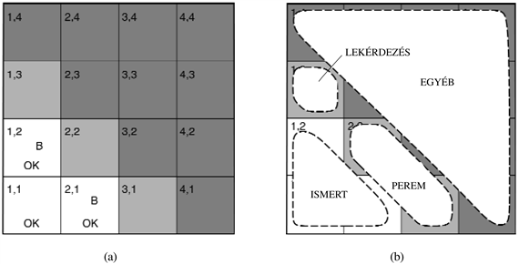

<?xml version="1.0" encoding="UTF-8" standalone="no"?>
<!DOCTYPE html PUBLIC "-//W3C//DTD XHTML 1.1//EN" "http://www.w3.org/TR/xhtml11/DTD/xhtml11.dtd">
<html xmlns="http://www.w3.org/1999/xhtml"><head><meta name="generator" content="DocBook XSL Stylesheets V1.76.1"/></head><body>

<h1 class="title"><a id="id671298"/>A wumpus világ újralátogatása</h1>

E fejezet gondolatai közül sok eredményesen kombinálható a wumpus világ valószínűségi következtetési problémáinak megoldására. (A wumpus világ teljes leírása a 7. fejezetben található.) A wumpus világban fellépő bizonytalanságot az ágens érzékelésének a világra vonatkozóan a csak helyi információt szolgáltató részlegessége okozza. Például a 13.6. ábra egy olyan szituációt ábrázol, amelyben mindhárom elérhető négyzet – [1, 3], [2, 2] és [3, 1] – tartalmazhat csapdát. Egyszerű logikai következtetéssel nem dönthető el, hogy melyik a legvalószínűbben biztonságos négyzet, így a logikai ágens kénytelen véletlenszerűen választani. Látni fogjuk ugyanakkor, hogy egy valószínűségi ágens sokkal sikeresebb, mint egy logikai ágens.

A célunk az lesz, hogy mindhárom négyzetre kiszámítsuk a csapda valószínűségét. (A példa erejéig elfelejtjük a wumpust és az aranyat.) A wumpus világ idevágó tulajdonságai a következők: (1) egy csapda szellőt okoz a szomszédos négyzetekben, és (2) az [1,1]-en kívül minden négyzet 0,2 valószínűséggel tartalmaz csapdát. Első lépésként a számításhoz szükséges véletlen változókat kell meghatároznunk:

<ul class="itemizedlist"><li class="listitem">
Az ítéletlogikához hasonlóan, itt is minden négyzethez egy (<em>C</em><em>i</em>,<em>j</em>) logikai változóra van szükségünk, amelynek értéke akkor és csak akkor igaz, ha az [<em>i</em>,<em>j</em>] négyzet tartalmaz csapdát.
</li><li class="listitem">
Vannak továbbá <em>S</em><em>i</em>,<em>j</em><em> </em>logikai változóink is, amelyek igaz értéke egyértelműen az [<em>i</em>,<em>j</em>] négyzetben tapasztalható szellőre utal; példánkban csak a megfigyelt – esetünkben az [1, 3], [2, 2] és [3, 1] négyzetekre – vonatkozó változókat használjuk.
</li></ul>

A következő lépés a <strong>P</strong>(<em>C</em>1,1,…, <em>C</em>4,4, <em>S</em>1,1, <em>S</em>1,2, <em>S</em>2,1) teljes valószínűségi eloszlás meghatározása. A szorzatszabály alkalmazásával

<code class="code"><em>P</em>(<em>C</em>1,1,…, <em>C</em>4,4, <em>S</em>1,1, <em>S</em>1,2, <em>S</em>2,1) = <em>P</em>(<em>S</em>1,1, <em>S</em>1,2, <em>S</em>2,1 ∣<em> C</em>1,1,…, <em>C</em>4,4)<em>P</em>(<em>C</em>1,1,…,<em> C</em>4,4)</code>

adódik.

<a id="id671482"/>
<strong>13.6. ábra - (a) Az ágens beragad, miután [1, 2]-ben és [2, 1]-ben is szellőt észlel – nincs feltárható biztonságos hely. (b) A négyzetek szétosztása <em>Ismert</em>, <em>Perem</em> és <em>Egyéb</em> csoportokba az [1, 3]-ra vonatkozó lekérdezéshez.</strong>

A dekompozíció nagyon könnyűvé teszi az együttes valószínűségi értékek meghatározását. Az első rész a szellő feltételes valószínűség konfigurációját adja adott csapda konfigurációnál; ennek értéke 1, ahol a szellő szomszédos egy csapdával, minden más esetben 0. A második tag a csapdakonfiguráció előzetes valószínűsége. A négyzetek a többi négyzettől függetlenül 0,2 valószínűséggel tartalmaznak csapdát; következésképpen

Egy <em>n</em> csapdát tartalmazó konfigurációnál ennek értéke 0,2n × 0,816–n.

A 13.6. (a) ábra szerinti helyzetnél a bizonyíték magában foglalja minden meglátogatott négyzetre az ott megfigyelt szellőt (vagy annak hiányát) azzal a ténnyel együtt, hogy a meglátogatott négyzetek nem tartalmaznak csapdát. Ezeket az <em>s</em> = ¬<em>s</em>1,1 ∧ <em>s</em>1,2 ∧ <em>s</em>2,1<em> </em>és <em>ismert</em> = ¬<em>c</em>1,1 ∧ ¬<em>c</em>1,2 ∧ ¬<em>c</em>2,1 rövidítésekkel fogjuk jelölni. A mi számunkra a <strong>P</strong>(<em>C</em>1,3∣<em>ismert</em>,<em> s</em>) típusú lekérdezések megválaszolása érdekes: adott megfigyelések mellett mennyire valószínű, hogy az [1, 3] csapdát tartalmaz?

A válaszhoz követhetjük a (13.6) egyenlet szerinti szabványos megközelítést, amelyet a <code class="code">FELSOROL-EGYÜTTES-KÉRDEZÉS</code> eljárás valósít meg, azaz a teljes együttes valószínűségi eloszlás bejegyzései szerinti összegzést. Jelölje <em>Ismeretlen</em> azt az összetett változót, amelyet a nem <em>Ismert</em> csoportba tartozó négyzetek és a lekérdezett [1, 3] négyzet <em>C</em><em>i</em>,<em>j </em>változói alkotnak. Ezzel a (13.6) egyenletből

A teljes együttes valószínűségeket korábban már meghatároztuk, így készen is vagyunk – kivéve, ha a számítási bonyolultság kérdésével is törődünk. 12 ismeretlen négyzetünk van; így az összegzés 212 = 4096 tagból fog állni. Általánosságban, az összegzés exponenciálisan nő a négyzetek számával.

Az intuíció azt súgja, hogy itt valamit még figyelmen kívül hagyunk. És tényleg, bárki megkérdezheti, hogy a többi négyzet nem lényegtelen-e? A [4, 4] tartalma nincs hatással arra, hogy az [1, 3] tartalmaz-e csapdát! Ez az intuíció valóban helyes. Jelölje <em>Perem</em> azokat a – lekérdezés változójától különböző – változókat, amelyek a meglátogatott négyzetekkel szomszédosak, esetünkben a [2, 2] és a [3, 1]. Továbbá <em>Egyéb</em> legyen a többi ismeretlen négyzet változója; példánkban – ahogy a 13.6. (b) ábra is mutatja – 10 ilyen négyzet van. A kulcs meglátás az, hogy megfigyelt szellők <em>feltételesen függetlenek</em> a többi változótól, ha adottak az <em>ismert</em>, a <em>perem</em> és a <em>lekérdezés</em> változók. A többi, ahogy mondják, már csak egy kis algebra.

A fenti meglátás használatához a lekérdezést olyan alakra hozzuk, amelyben a szellő az összes többi változó feltétele mellett van megadva, majd az egészet egyszerűsítjük a feltételes függetlenség alapján:

ahol az utolsó lépés használja ki a feltételes függetlenséget. E kifejezés első tagja nem függ a többi változótól, így az összegzés belülre vihető:

Függetlenség esetén a (13.15) egyenlethez hasonlóan az előző kifejezés tényezőkre bontható, majd a tényezők sorrendje átrendezhető:

ahol az utolsó lépésben <em>C</em>(<em>ismert</em>)-et belefoglaltuk a normalizáló konstansba, és kihasználtuk, hogy  értéke 1.

Most már csak négy tag van a <em>C</em>2,2<em> </em>és <em>C</em>3,1 peremváltozók feletti összegzésben. A függetlenség és feltételes függetlenség miatt egyáltalán nem szükséges figyelembe vennünk a többi négyzetet. Vegyük észre, hogy a <strong>P</strong>(<em>s</em>∣<em>ismert</em>,<em> C</em>1,3<em>, perem</em>) kifejezés értéke 1, ha a határ megegyezik a szellő érzékelésekkel és minden más esetben 0. Azaz, <em>C</em>1,3 minden értékére azon határváltozók <em>logikai modelljei</em> fölött végezzük az összegzést, amelyek az megfelelnek az ismert tényeknek. (Érdemes ezt összehasonlítani a 7.5. ábra modelljei szerinti számítással.) A modelleket és a hozzájuk kapcsolódó <em>C</em>(<em>perem</em>) a priori<em> </em>valószínűségeket a 13.7. ábra<em> </em>mutatja. Ezzel

<code class="code"><em>P</em>(<em>C</em>1,3∣<em>ismert</em>, <em>s</em>) = <em>α</em>'〈0,2(0,04 + 0,16 + 0,16), 0,8(0,04 + 0,16)〉 ≈ 〈0,31, 0, 69〉</code>

Azaz, az [1, 3] (és a szimmetria miatt a [3, 1]) nagyjából 31% valószínűséggel tartalmaz csapdát. Hasonló számításokból (amelyet az olvasó könnyen elvégezhet) a [2, 2]-re 86%-os valószínűséggel adódik csapda. A wumpus ágensnek határozottan el kell kerülnie a [2, 2]-t!

<a id="id671794"/>
<strong>13.7. ábra - <em>C</em>2,2<em> </em>és <em>C</em>3,1  peremváltozók, az egyes modellek <em>C</em>(<em>perem</em>) értékét mutató konzisztens modelljei: (a) három, két vagy három csapdát jelző modell <em>C</em>1,3 = <em>igaz</em> mellett, és (b) két, egy vagy két csapdát jelző modell<em> C</em>1,3 = <em>hamis </em>mellett.</strong>

Ebben az alfejezetben azt mutattuk meg, hogy még a látszólag bonyolult problémák is pontosan megfogalmazhatók valószínűség-elméleti alapokon, és meg is oldhatók egyszerű algoritmusok segítségével. Hogy <em>hatékony </em>megoldásokat kapjunk, a szükséges összegzéseket a függetlenségekre és feltételes függetlenségekre alapozva egyszerűsítjük. Ezek az összefüggések gyakran egybeesnek a probléma részproblémákra való felbontására vonatkozó természetes felfogásunkkal. A következő fejezetben ilyen összefüggések formális megjelenítésére alkalmazunk módszereket, valamint olyan algoritmusokat fejlesztünk ki, amelyek hatékonyan használhatók e reprezentációk alapján elvégzett valószínűségi következtetések végrehajtására.

</body></html>
