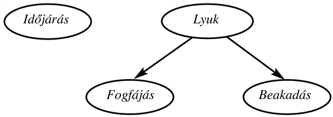
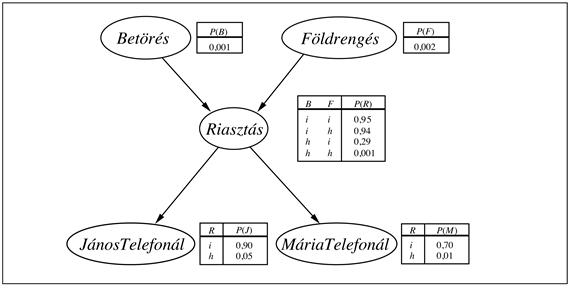

<?xml version="1.0" encoding="UTF-8" standalone="no"?>

<html xmlns="http://www.w3.org/1999/xhtml"><head><meta name="generator" content="DocBook XSL Stylesheets V1.76.1"/></head><body>

<h1 class="title"><a id="id672996"/>14. fejezet - Valószínűségi következtetés</h1>

<em>Ebben a fejezetben ismertetjük, hogyan építhetők olyan következtető rendszerek, amelyek hálós modelleket használnak a bizonytalanságnak a valószínűség-számítás törvényeinek megfelelő kezelésére.</em>

A 13. fejezetben bemutattuk a valószínűség-számítás szintaxisát és szemantikáját. Külön hangsúlyoztuk a függetlenségi és a feltételes függetlenségi kapcsolatok fontosságát a világ valószínűségi reprezentációjának az egyszerűsítésében. Ez a fejezet egy szisztematikus módszert vezet be az ilyen relációk explicit reprezentálására, a <strong>Bayes-háló</strong>k formájában. Ezeknek a hálózatoknak definiáljuk a szintaxisát és szemantikáját, és megmutatjuk, hogyan használhatók fel bizonytalan tudás megragadására természetes és hatékony módon. Ezt követően ismertetjük, hogyan végezhető el a valószínűségi következtetés, ami bár legrosszabb esetben exponenciális komplexitású, a gyakorlatban sok esetben hatékonyan alkalmazható. Leírunk továbbá különböző közelítő következtető algoritmusokat, amelyek gyakran akkor is alkalmazhatók, amikor egzakt következtetés nem lehetséges. Megvizsgálunk olyan módszereket is, hogy hogyan alkalmazható a valószínűség-számítás egy objektumokat és relációkat is tartalmazó világra – azaz az <em>ítéletlogikával</em> szemben az <em>elsőrendű </em>reprezentációkra. Végül áttekintjük a bizonytalan következtetés egyéb alternatív megközelítéseit.

<h1 class="title"><a id="id673018"/>A tudás reprezentálása bizonytalanság esetén</h1>

A 13. fejezetben<em> </em>láttuk, hogy az együttes valószínűség-eloszlás függvény alapján minden kérdés megválaszolható a modellezett tárgytartománnyal kapcsolatban, de a változók számának növekedésével ez általában kivitelezhetetlenné válik. Továbbá az elemi események valószínűségének megadása is igen mesterkélt és nehéz is lehet, hacsak nem áll rendelkezésre nagy mennyiségű adat a valószínűségek statisztikai becsléséhez.

A változók közötti függetlenségi és feltételes függetlenségi relációkkal kapcsolatban azt is láttuk, hogy ezek nagyban csökkenthetik az együttes valószínűség-eloszlás függvény megadásához szükséges valószínűségek számát. Ez a fejezet bevezet egy <strong>Bayes-háló</strong>nak (<strong>Bayesian network</strong>[<a id="id673038" href="#ftn.id673038" class="footnote">143</a>]) nevezett adatstruktúrát a változók közötti függőség leírásához, és <em>bármely</em> együttes valószínűség-eloszlás függvény tömör megadásához.

A Bayes-háló egy irányított gráf, amelyben minden <em>csomóponthoz</em> számszerű valószínűségi információk vannak csatolva. A teljes megadás a következő:

<ol class="orderedlist"><li class="listitem">
A háló csomópontjait valószínűségi változók egy halmaza alkotja. A változók lehetnek diszkrétek vagy folytonosak.
</li><li class="listitem">
Irányított élek (nyilak) egy halmaza összeköt bizonyos csomópontpárokat. Ha létezik nyíl az <em>X</em> csomóponttól az <em>Y</em> csomópontig, azt mondjuk, hogy az <em>X</em> a <em>szülője </em>az <em>Y</em>-nak.
</li><li class="listitem">
Minden <em>Xi</em> csomóponthoz tartozik egy <em>P</em>(<em>Xi</em>∣<em>Szülők</em>(<em>Xi</em>)) feltételes valószínűség-eloszlás, ami számszerűen megadja a szülők hatását a csomóponti változóra.
</li><li class="listitem">
A gráf nem tartalmaz irányított kört (azaz irányított, körmentes gráf – Directed, Acyclic Graph, DAG).
</li></ol>

A háló topológiája – a csomópontok és élek halmaza – megadja a tárgyterületen fennálló feltételes függetlenségi kapcsolatokat, hogy mily módon, azt hamarosan pontosan kifejtjük. Egy helyesen létrehozott hálóban az <em>X</em> csomópontot az <em>Y</em> csomóponttal összekötő nyíl <em>intuitív</em> jelentése rendszerint az, hogy az <em>X</em>-<em>nek közvetlen befolyása</em> <em>van</em> az <em>Y</em>-ra. A tárgyterület szakértője számára általában könnyű eldönteni, hogy milyen <em>közvetlen befolyások</em> teljesülnek egy adott területen – valójában sokkal könnyebb, mint a megfelelő valószínűségeket megadni. Ha pedig a Bayes-háló topológiája kész, már csak az egyes változókhoz tartozó feltételes valószínűség-eloszlásokat kell meghatározni a szülőkkel mint feltételekkel. Látni fogjuk, hogy a topológia és a feltételes eloszlások együttese elegendő, hogy megadja (implicit módon) az összes változó feletti együttes valószínűség-eloszlás függvényt.

Idézzük fel a 13. fejezetben leírt egyszerű világot, amely a <em>Fogfájás</em>, a <em>Lyuk</em>, a<em> Beakadás</em> és az <em>Időjárás</em> változót tartalmazza. Úgy érveltünk, hogy az <em>Időjárás</em> független az összes többi változótól; továbbá, hogy a <em>Fogfájás</em> és a <em>Beakadás</em> feltételesen függetlenek a <em>Lyuk</em> ismeretében. Ezeket a viszonyokat a 14.1. ábrán bemutatott Bayes-háló reprezentálja. Formálisan, a <em>Fogfájás</em> és a <em>Beakadás</em> feltételes függetlenségét a <em>Lyuk</em> ismeretében a <em>Fogfájás</em> és a <em>Beakadás </em>közötti nyíl <em>hiánya</em> jelzi. Szemléletesen, a háló azt a tényt fejezi ki, hogy a <em>Lyuk</em> közvetlen oka a <em>Fogfájás</em>-nak és a <em>Beakadás</em>-nak, további közvetlen okozati kapcsolat azonban nem létezik a <em>Fogfájás</em> és a <em>Beakadás </em>között.

<a id="id673293"/>
<strong>14.1. ábra - Egy egyszerű Bayes-háló, amelyben az <em>Időjárás</em> független a többi három változótól, a <em>Fogfájás</em> és a <em>Beakadás</em> pedig feltételesen függetlenek a <em>Lyuk</em> ismeretében</strong>

Most vizsgáljuk meg a közvetkező példát, ami csak egy árnyalatnyival öszetettebb. Otthonunkban egy új betörésjelzőt szereltek fel. Ez megbízhatóan észleli a betöréseket, de időnként kisebb földrengések esetén is jelez. (Ez a példa Judea Pearltől származik, aki Los Angeles-i lakos; innen ered a földrengések iránti különös érdeklődése.)[<a id="id673320" href="#ftn.id673320" class="footnote">144</a>] Két szomszédunk is van, János és Mária, akik megígérték, hogy felhívnak a munkahelyünkön, ha meghallják a riasztónkat. János mindig felhív minket, ha meghallja a riasztást, de néha összekeveri a telefoncsörgést a riasztó csengésével, és ekkor is telefonál. Mária viszont, mivel szereti hangosan hallgatni a zenét, néha meg sem hallja a riasztót. Mi tehát a hívások bekövetkezte vagy hiánya alapján szeretnénk megbecsülni a betörés valószínűségét. Ezt az egyszerű problémát a<em> </em>14.2. ábrán látható Bayes-háló írja le.

<a id="id673334"/>
<strong>14.2. ábra - Egy tipikus Bayes-háló, amely a topológiát és a feltételes valószínűségi táblákat (FVT) is mutatja. Az FVT-kben <em>B</em>,<em> F</em>,<em> R</em>,<em> J</em> és <em>M</em> szerepel <em>Betörés</em>,<em> Földrengés</em>, <em>Riasztás</em>, <em>JánosTelefonál </em>és <em>MáriaTelefonál</em> helyett.</strong>

Egyelőre hagyjuk figyelmen kívül az ábrán szereplő feltételes eloszlásokat, és összpontosítsunk a háló topológiájára. A betörés háló esetén a topológia azt mutatja, hogy a betörés és a földrengés közvetlenül befolyásolja a riasztó megszólalásának valószínűségét, ellenben János vagy Mária hívásának bekövetkezése csak magán a riasztón múlik. A háló így tartalmazza azon feltevéseinket, hogy ők közvetlenül nem vesznek észre betöréseket, nem vesznek észre kisebb földrengéseket, és nem egyeztetnek hívás előtt.

Megfigyelhető, hogy a hálóban nincsenek olyan csomópontok, amelyek azt írnák le, hogy Mária éppen hangos zenét hallgat, vagy hogy a telefon cseng, és megzavarja Jánost. Ezeket a tényezőket a <em>Riasztás</em> csomóponttól a <em>JánosTelefonál</em> és <em>MáriaTelefonál </em>csomópontig tartó élekhez rendelt bizonytalanság foglalja magában. Ebben mind a lustaság, mind pedig a tudatlanság tetten érhető: rengeteg munka volna olyan tényezők meghatározása, amelyek valószínűbbé vagy kevésbé valószínűvé válnának adott esetekben, és nincs semmilyen ésszerű módszerünk, hogy ezekre vonatkozóan érdemi információt szerezzünk. A valószínűségek valójában a lehetséges körülmények egy <em>potenciálisan végtelen</em> halmazát összegzik, amikor is a riasztó elmulaszt megszólalni (magas páratartalom, elektromos hálózat hibája, lemerült elem, elvágott drót, döglött egér beragadva a csengőbe…), vagy, hogy János és Mária elmulaszt értesíteni minket (ebédelni mentek, szabadságon vannak, időlegesen megsüketültek, egy áthaladó helikopter…). Ezen a módon egy kis ágens is képes megbirkózni egy igen bonyolult világgal, legalábbis közelítőleg. A közelítés mértéke tetszőlegesen javítható további releváns információk bevezetésével.

Most folytassuk a 14.2. ábrán mutatott feltételes eloszlásokkal. Az ábrán minden eloszlás mint <strong>feltételes valószínűségi táblázat</strong> – <strong>FVT</strong> (<strong>conditional probability table</strong>, <strong>CPT</strong>) van feltüntetve. (A táblázatos formát diszkrét változók esetén lehet használni; más reprezentációkat, amelyek már folytonos változóknál is használhatók, a 14.2. alfejezetben írunk le.) Az FVT-táblázatban minden sor az egyes csomóponti értékek feltételes valószínűségét tartalmazza az adott sorhoz tartozó <strong>szülői feltétel</strong> (<strong>conditioning case</strong>) esetén. A szülői feltétel a szülő csomópontok értékeinek egy lehetséges kombinációja (egyfajta elemi esemény, ha úgy tetszik). Az egyes sorokban szereplő számok összegének 1-et kell adnia, mivel az adott változó összes lehetséges értéke szerepel a bejegyzésekben. Bináris változók esetén, ha ismerjük, hogy az igaz érték valószínűsége <em>p</em>, a hamis érték valószínűségének 1 <em>– p</em>-nek kell lennie, így gyakran a második számot elhagyjuk, ahogyan ezt a 14.2. ábrán is tettük. Általánosabban, egy <em>k </em>bináris szülővel rendelkező bináris változó esetén 2<em>k </em>valószínűség adható meg tetszés szerint. Szülő nélküli csomópontok esetén a táblázat csak egyetlen sort tartalmaz, a változó egyes értékeinek a priori valószínűségeit.

 

[<a id="ftn.id673038" href="#id673038" class="para">143</a>]  Az angol nyelvű szakirodalomban a <strong>Bayes-háló</strong> a legelterjedtebb megnevezés, de számos más is létezik: <strong>bizonyosságháló</strong> (<strong>belief network</strong>), <strong>valószínűségi háló</strong> (<strong>probabilistic network</strong>),<strong> okozati háló</strong> (<strong>causal network</strong>),<strong> tudásháló</strong> (<strong>knowledge map</strong>). A statisztikában a <strong>gráfos modell</strong> (<strong>graphical model</strong>) bővebb modellosztályt jelent, ami a Bayes-hálót is magában foglalja. A Bayes-hálók egy kiterjesztésének neve a<strong> döntési háló</strong> (<strong>decision network</strong>) vagy<strong> hatásdiagram</strong> (<strong>influence diagram</strong>) – lásd 16. fejezet.

[<a id="ftn.id673320" href="#id673320" class="para">144</a>]  Judea Pearl meghatározó szerepet játszott a Bayes-hálók egzakt matematikai hátterének és gyakorlati alkalmazhatóságának a vizsgálatában. (<em>A ford.</em>)

</body></html>
