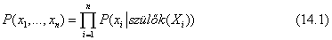
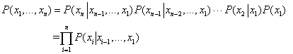
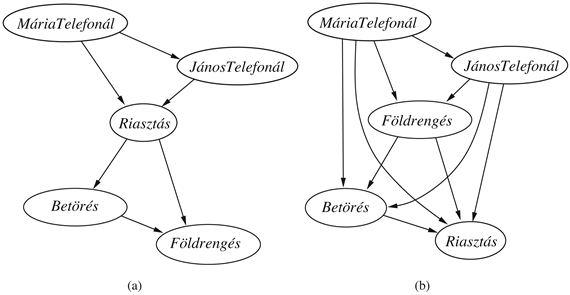
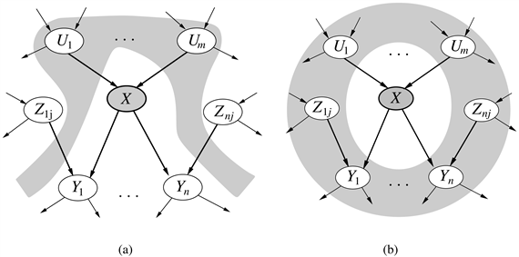

<?xml version="1.0" encoding="UTF-8" standalone="no"?>
<!DOCTYPE html PUBLIC "-//W3C//DTD XHTML 1.1//EN" "http://www.w3.org/TR/xhtml11/DTD/xhtml11.dtd">
<html xmlns="http://www.w3.org/1999/xhtml"><head><meta name="generator" content="DocBook XSL Stylesheets V1.76.1"/></head><body>

<h1 class="title"><a id="id673448"/>A Bayes-hálók szemantikája</h1>

Az előző alfejezetben bemutattuk a hálót, de annak jelentését nem. A Bayes-hálók szemantikáját kétféle módon lehet megérteni. Az első szerint a háló az együttes valószínűség-eloszlás függvény egy leírása. A második szerint a háló feltételes függetlenségekről szóló állítások együttesét írja le. A két szemlélet ekvivalens, de az első inkább abban segít, hogyan <em>hozzunk létre</em> egy hálót, míg a második a következtetési eljárások tervezését segíti.

<h2 class="title"><a id="id673458"/>Az együttes valószínűség-eloszlás függvény leírása</h2>

<a id="ID_581_582_oldal"/>
A Bayes-háló a tárgytartomány teljes leírását adja meg. A benne található információk segítségével az együttes valószínűség-eloszlás függvény bármely bejegyzése kiszámítható.[<a id="id673467" href="#ftn.id673467" class="footnote">145</a>] Az együttes valószínűség-eloszlás függvény egy általános bejegyzése egy teljes – minden egyes változóhoz történő – hozzárendelés konjunkciójának a valószínűsége, úgymint <em>P</em>(<em>X</em>1 = <em>x</em>1 ∧ … ∧ <em>Xn</em> = <em>xn</em>). Erre a továbbiakban a <em>P</em>(<em>x</em>1, …, <em>xn</em>) rövidítést fogjuk használni. Egy bejegyzés értékét a következő egyenlőség adja meg:

ahol a <em>szülők</em>(<em>Xi</em>)<em> </em>a<em> Szülők</em>(<em>Xi</em>)<em>-</em>ben szereplő változók adott értékeinek együttesét jelöli. Így az együttes valószínűség-eloszlás függvényt leíró táblázat minden bejegyzése a Bayes-hálóban szereplő, feltételes valószínűségi táblák (FVT) megfelelő elemeinek a szorzata. Ezzel az FVT-k valójában az együttes valószínűség-eloszlás függvény dekomponált leírását adják meg.	Ennek illusztrálására kiszámítjuk annak az eseménynek a valószínűségét, hogy a riasztó megszólal, de nem volt sem betörés, sem földrengés, azonban János és Mária is telefonál. A kezdőbetűkkel jelölve a változókat:

<code class="code"><em>P</em>(<em>j</em> ∧ <em>m</em> ∧ <em>a</em> ∧ ¬<em>b</em> ∧ ¬<em>e</em>) </code>

<code class="code"><em>	</em>= <em>P</em>(<em>j</em>∣<em>a</em>)<em>P</em>(<em>m</em>∣<em>a</em>)<em>P</em>(<em>a</em>∣¬<em>b </em>∧ ¬<em>e</em>)<em>P</em>(¬<em>b</em>)<em>P</em>(¬<em>e</em>) </code>

<code class="code">	= 0,90 × 0,70 × 0,001 × 0,999 × 0,998 = 0,00062</code>

A 13.4. alfejezetben<em> </em>bemutattuk, hogy az együttes valószínűség-eloszlás függvény alapján a tárgytartománnyal kapcsolatos bármely kérdés megválaszolható. Ha egy Bayes-háló leírja az együttes valószínűség-eloszlás függvényt, akkor ez alapján bármely kérdés megválaszolható, összegezve a releváns együttes bejegyzéseket. A 14.4. alfejezet elmagyarázza, hogy ez hogyan végezhető el, azonban sokkal hatékonyabb módszereket is ismertet.

<strong>Egy módszer Bayes-hálók építésére</strong>

A (14.1) egyenlet definiálja, hogy mit is jelent egy adott Bayes-háló. Azonban arra nézve nem ad felvilágosítást, hogyan <em>építhetünk</em> olyan Bayes-hálót, hogy az általa meghatározott együttes valószínűség-eloszlás függvény az adott tárgytartomány megfelelő leírása legyen. Most megmutatjuk, hogy a (14.1) egyenlet tartalmaz bizonyos feltételes függetlenségi relációkat, amelyeket a tudásmérnök felhasználhat a háló topológiájának meghatározásánál. Elsőként írjuk fel az együttes valószínűség-eloszlás függvényt feltételes valószínűségek szorzataként, felhasználva a szorzatszabályt (lásd 13. fejezet):

<code class="code"><em>P</em>(<em>x</em>1, …, <em>xn</em>) = <em>P</em>(<em>xn</em>|<em>xn–</em>1, …, <em>x</em>1)<em>P</em>(<em>xn–</em>1, …, <em>x</em>1)</code>

Majd ismételten alkalmazzuk ezt a lépést, minden egyes együttes valószínűséget felbontva egy feltételes valószínűségre és egy kisebb együttes valószínűségre. Végezetül egyetlen hosszú szorzatot kapunk:

Ez a <strong>láncszabály</strong>ként (<strong>chain rule</strong>) ismert azonosság valószínűségi változók bármely halmazára fennáll.

Összehasonlítva ezt a (14.1.) egyenlettel láthatjuk, hogy az együttes valószínűség-eloszlás függvény megadása ekvivalens azzal az általános állítással, hogy a háló minden <em>Xi</em> változójára

<code class="code"><em>P</em>(<em>Xi</em>|<em>Xi</em>–1, …, <em>X</em>1) = <em>P</em>(<em>Xi</em>|<em>Szülők</em>(<em>Xi</em>))				(14.2)</code>

feltéve, hogy <em>Szülők</em>(<em>Xi</em>) ⊆ {<em>X</em><em>i</em>–1, …, <em>X</em>1}. Ez utóbbi feltétel a csomópontok bármely olyan sorszámozásával teljesíthető, ami konzisztens a gráf struktúrájából adódó implicit részleges rendezéssel.

<h3 class="title">Fontos</h3>
A (14.2) egyenlet szerint, egy Bayes-háló csak abban az esetben lehet helyes reprezentációja a tárgytartománynak, ha az adott szülők mellett, minden csomópont feltételesen független a csomópontot sorrendezésben őt megelőzőktől. Így a tárgytartomány struktúrájának megfelelő Bayes-háló megépítése során, minden egyes csomóponthoz úgy kell a szülőket megválasztanunk, hogy ez a feltétel teljesüljön. Szemléletesen ez azt jelenti, hogy az <em>Xi</em> csomópont szülei halmazának tartalmaznia kell az {<em>X</em>1, …, <em>X</em>i–1} közül mindazokat a csomópontokat, amelyek <em>közvetlenül befolyásolják</em> <em>Xi</em>-t. Például tételezzük fel, hogy a 14.2. ábrán látható hálót már teljesen befejeztük, csupán a <em>MáriaTelefonál</em> szüleit kell még megválasztanunk. A <em>MáriaTelefonál</em>-t egyértelműen befolyásolja, hogy történt-e <em>Betörés</em> vagy <em>Földrengés</em>, de nem közvetlenül. A helyzettel kapcsolatos ismereteink alapján tudhatjuk, hogy ezek az események csak a riasztó által befolyásolhatják Mária telefonálással kapcsolatos viselkedését. Hasonlóan, ha a riasztó állapota ismert, akkor János hívásának bekövetkezte vagy elmaradása már nincs hatással Mária telefonálására. Formálisan fogalmazva, úgy véljük, hogy a következő feltételes függetlenség teljesül:

<code class="code"><em>P</em>(<em>MáriaTelefonál</em>|<em>JánosTelefonál</em>, <em>Riasztás</em>, <em>Földrengés</em>, <em>Betörés</em>) </code>

<code class="code">	= <em>P</em>(<em>MáriaTelefonál</em>|<em>Riasztás</em>)</code>

<strong>Tömörség és a csomópontok sorrendje</strong>

Amellett hogy egy teljes és nem redundáns reprezentációja a tárgytartománynak, egy Bayes-háló gyakran sokkal <em>tömörebb,</em> mint az együttes valószínűség-eloszlás függvény. Ez a tulajdonsága teszi használhatóvá a sokváltozós tárgyterületek kezelésében. A Bayes-háló tömörsége a <strong>lokálisan strukturált</strong> (<strong>locally structured</strong>) (vagy <strong>ritka</strong> – <strong>sparse</strong>) rendszerek egy igen általános tulajdonságának példája. Egy lokálisan strukturált rendszerben egy komponens csak korlátos számú más komponenssel van kapcsolatban közvetlenül, függetlenül a komponensek teljes számától. Lokális struktúrákhoz általában inkább a lineáris, mint az exponenciális komplexitásnövekedés kapcsolható. A Bayes-háló esetében jogos azt feltételezni, hogy a legtöbb tárgytartomány esetén egy valószínűségi változót csak <em>k</em> számú más változó befolyásol, ahol <em>k</em> konstans. Ha bináris változókat tételezünk fel az egyszerűség kedvéért, akkor az egy csomóponthoz tartozó feltételes valószínűségi tábla megadásához legfeljebb 2k érték szükséges, így a teljes háló <em>n</em>2k értékkel megadható. Ezzel szemben az együttes valószínűség-eloszlás függvény 2n értéket tartalmaz. Egy konkrét példával élve, ha 30 csomópontunk van (<em>n</em> = 30), és mindegyiknek legfeljebb 5 szülője van (<em>k</em> = 5), akkor a Bayes-háló 960 számot igényel, míg az együttes valószínűség-eloszlás függvény több mint egy milliárdot.

Léteznek olyan tárgytartományok, ahol a változók mindegyikét közvetlenül befolyásolhatja az összes többi, így a háló teljesen összekötött. A feltételes valószínűségi táblák megadása ekkor ugyanakkora mennyiségű információt igényel, mint az együttes valószínűség-eloszlás függvény megadása. Bizonyos tárgytartományokban léteznek olyan gyenge függőségek, amiket feltétlenül modellezni kell egy új kapcsolat felvételével. De ha ezek a függőségek igen gyengék, akkor lehet, hogy nem éri meg a háló komplexitását megnövelni a pontosság kismértékű növelésének érdekében. Például a betöréses hálónkkal kapcsolatban kifogásolható az, hogyha földrengés van, akkor Mária és János akkor sem telefonálna, ha hallanák a riasztót, mivel feltételezik, hogy a földrengés okozta. Az, hogy hozzákapcsoljuk-e a <em>Földrengés</em>-t a <em>MáriaTelefonál</em>-hoz és a <em>JánosTelefonál</em>-hoz (és így megnöveljük a táblákat) azon múlik, hogy mennyire fontos pontosabb valószínűségeket kapni, és mennyire költséges meghatározni az extra információt.

<h3 class="title">Fontos</h3>
Azonban még egy lokálisan strukturált problémánál sem egyszerű lokálisan strukturált Bayes-hálót felépíteni. Ugyanis nemcsak azt követeljük meg, hogy minden egyes változót csak néhány másik befolyásoljon közvetlenül, hanem azt is, hogy a háló topológiája valóban mutassa azokat a közvetlen hatásokat a szülők megfelelő megválasztásával. A konstrukciós eljárásunk működése miatt előbb a „közvetlen befolyásolókat” kell a hálóhoz adni, ha azt szeretnénk, hogy szülőknek tudjuk őket választani az általuk befolyásolt csomópontnál. Ezért<em> a helyes sorrend a csomópontok hozzáadásánál az, hogy először az „alapvető okokat” adjuk a hálóhoz, majd a változókat, amelyeket befolyásolnak,</em> és ezt addig folytatjuk, amíg el nem érjük a „leveleket”, amelyeknek már nincs közvetlen okozati hatása más változókra.

Mi történik, ha történetesen rossz sorrendet választunk? Vizsgáljuk meg újra a betöréses példát. Tételezzük fel, hogy a változókat a következő sorrendben adjuk a hálóhoz: <em>MáriaTelefonál</em>, <em>JánosTelefonál</em>, <em>Riasztás</em>, <em>Betörés</em>, <em>Földrengés</em>. Ekkor egy kicsit bonyolultabb hálót kapunk (14.3. (a) ábrán). Az eljárás a következő:

<ul class="itemizedlist"><li class="listitem">
<em>MáriaTelefonál</em> hozzáadása: szülők nincsenek.
</li><li class="listitem">
<em>JánosTelefonál</em> hozzáadása: ha Mária telefonál, az valószínűleg azt jelenti, hogy a riasztó megszólalt, ami természetesen valószínűbbé teszi, hogy János telefonáljon. Így a <em>JánosTelefonál</em>-nak szükségszerűen szülője a <em>MáriaTelefonál</em>.
</li></ul>

<a id="id676026"/>
<strong>14.3. ábra - A háló struktúrája függ a hozzáadás sorrendjétől. A csomópontokat mindegyik hálóhoz felülről lefelé haladva adtuk hozzá.</strong>

<ul class="itemizedlist"><li class="listitem">
<em>Riasztás </em>hozzáadása: nyilvánvaló, ha mindketten telefonálnak, akkor valószínűbb, hogy a riasztó megszólalt, mintha csak egyikük, vagy egyikük sem. Így mind a <em>JánosTelefonál</em>, mind a<em> MáriaTelefonál</em> szükséges mint szülő.
</li><li class="listitem">
<em>Betörés</em> hozzáadása: ha ismerjük a riasztó állapotát, akkor a Jánostól vagy Máriától jövő telefonhívások léte vagy hiánya csupán azt jelezhetik, hogy cseng-e a telefonunk, vagy hogy Mária zenéje hangosra van-e állítva, de a betörésről nem nyújtanak további információt. Azaz
</li></ul>

<code class="code"><em>P</em>(<em>Betörés</em>∣<em>Riasztás</em>, <em>JánosTelefonál</em>, <em>MáriaTelefonál</em>) = <em>P</em>(<em>Betörés</em>∣<em>Riasztás</em>)</code>

Így csak a <em>Riasztás </em>szükséges mint szülő.

<ul class="itemizedlist"><li class="listitem">
<em>Földrengés</em> hozzáadása: ha a riasztó bekapcsolt, akkor valószínűbb, hogy bekövetkezett egy földrengés (mivel a riasztó valamiféle földrengésészlelő). De ha tudjuk, hogy betörés történt, akkor ez megmagyarázza a riasztást, és a földrengés valószínűsége csak picit nagyobb a normálisnál. Így a <em>Betörés </em>és a<em> Riasztás </em>is szükséges mint szülő.
</li></ul>

<h3 class="title">Fontos</h3>
A kiadódó hálónak kettővel több éle van, mint az eredetinek a 14.2. ábrán, és hárommal több valószínűség meghatározását igényli. Ami még rosszabb, hogy néhány kapcsolódás megfoghatatlan viszonyt reprezentál, ami nehéz és nem természetes valószínűségi ítéleteket igényel, például a <em>Földrengés</em> feltételes valószínűségének a megbecslését, a <em>Betörés</em> és a<em> Riasztás </em>feltételekkel. Ez a jelenség igen általános, és kapcsolódik az okozati és diagnosztikai modelleknek a 8. fejezetben bevezetett megkülönböztetéséhez. Ha úgy próbálunk meg egy diagnosztikai modellt megépíteni, hogy a kapcsolatok okozat-ok irányúak (mint például a <em>MáriaTelefonál-</em>tól a <em>Riasztás-</em>ig vagy a <em>Riasztás-</em>tól a <em>Betörés</em>-ig kapcsolat), akkor végül egyébként független okok között kell függést meghatároznunk (és gyakran a különállóan bekövetkező okozatok között is). <em>Ha ragaszkodunk az okozati modellhez, akkor kevesebb értéket kell megadnunk, és az értékeket általában könnyebb meghatározni</em>. Orvosi tárgytartományon például Tversky és Kahneman demonstrálta, hogy orvos szakértők szívesebben hoznak valószínűségi ítéleteket okozati, mint diagnosztikai összefüggések esetén (Tversky és Kahneman, 1982).

A 14.3. (b) ábra a változók igazán szerencsétlen sorrendjét mutatja: <em>MáriaTelefonál</em>, <em>JánosTelefonál</em>, <em>Földrengés</em>,<em> Betörés</em>, <em>Riasztás</em>. Ez a háló 31 önálló valószínűség meghatározását igényli – pontosan annyit, amennyi a teljes együttes valószínűség-eloszlás függvény megadása. Azonban fontos felismerni, hogy a három háló bármelyike képes <em>pontosan ugyanannak az együttes valószínűség-eloszlás függvénynek a reprezentálására</em>. A két utóbbi egyszerűen csak nem reprezentálja az összes feltételes függetlenségi relációt, és így rengeteg szükségtelen érték meghatározására kényszerül.

<h2 class="title"><a id="id676170"/>Feltételes függetlenségi relációk Bayes-hálókban</h2>

<a id="ID_586_oldal"/>
A Bayes-hálókra egy „numerikus” szemantikát adtunk meg a teljes együttes eloszlás reprezentációjának a szempontjából, mint a (14.1) egyenletben. Ezt a szemantikát alkalmazva a Bayes-hálók konstrukciós módszereinek a származtatásánál azt a következményt kaptuk, hogy egy csomópont feltételesen független az őt megelőzőktől, ha a csomópont szülői adottak. Kiderül, hogy más módon is eljárhatunk. Elindulhatunk egy „topológiai” szemantikától, ami a gráf által kódolt feltételes függetlenségi relációkat adja meg, és ezekből származtatjuk a „numerikus” szemantikát. A topológiai szemantikát a következő két egymással ekvivalens meghatározás bármelyike rögzíti:[<a id="id676179" href="#ftn.id676179" class="footnote">146</a>]

<ol class="orderedlist"><li class="listitem">
Egy csomópont feltételesen független a nem <strong>leszármazott</strong>aitól (non-<strong>descendant</strong>s), feltéve, hogy a szülei adottak. Például a 14.2. ábrán <em>JánosTelefonál</em> független a <em>Betörés-</em>től és a <em>Földrengés</em>-től<em>, </em>ismerve a <em>Riasztás</em> értékét.
</li><li class="listitem">
Egy csomópont feltételesen független az összes többi csomóponttól a hálózatban, a szülei, gyermekei és gyermeki szüleinek az ismeretében – azaz a <strong>Markov-takaró</strong>jának (<strong>Markov blanket</strong>) ismeretében. Például, a <em>Betörés</em> független <em>JánosTelefonál</em>-tól és <em>MáriaTelefonál</em>-tól, a <em>Betörés</em>-t és <em>Földrengés</em>-t ismerve.
</li></ol>

Ezeket a meghatározásokat mutatja be a 14.4. ábra. Ezekből a feltételes függetlenségi állításokból és az FVT-kből a teljes együttes eloszlást rekonstruálni lehet; így a „numerikus” szemantika és a „topológiai” szemantika ekvivalens.

<a id="id676277"/>
<strong>14.4. ábra - (a) Az <em>X</em> csomópont feltételesen független a nem leszármazottaitól (<em>Zij</em>-ktől) a szülei (a szürke területen látható <em>Ui</em>-k) ismeretében. (b) Az <em>X</em> csomópont feltételesen független a háló összes többi csomópontjától a Markov-takarójának ismeretében (a szürke terület).</strong>

 

[<a id="ftn.id673467" href="#id673467" class="para">145</a>]  A diszkrét változókra utaló szóhasználat ellenére az állítások analógjai folytonos változók esetén is fennállnak. (<em>A ford.</em>)

[<a id="ftn.id676179" href="#id676179" class="para">146</a>]  Létezik egy további általános topológiai kritérium a <strong>d-elválasztás</strong> (<strong>d-separation</strong>) annak eldöntésére, hogy a csomópontok egy <strong>X</strong> halmaza független-e egy másik <strong>Y</strong> halmaztól egy harmadik <strong>Z</strong> halmaz feltétel esetén. A kritérium elég bonyolult, és nem szükséges a fejezetben az algoritmusok származtatásánál, ezért nem tárgyaljuk. A részletek megtalálhatók Russell és Norvig, valamint Pearl munkáiban (Russell és Norvig, 1995; Pearl, 1988). Shachter egy sokkal szemléletesebb módszert ad a d-elválasztások meghatározásához (Shachter, 1998).

</body></html>
