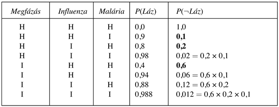
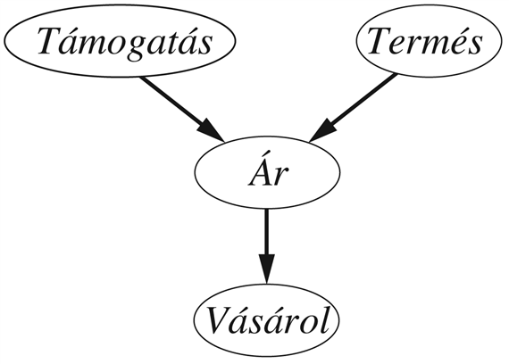
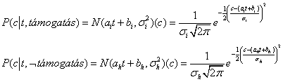
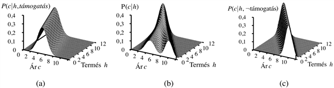
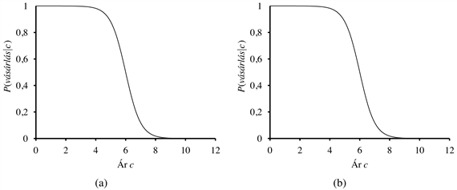
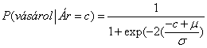

<?xml version="1.0" encoding="UTF-8" standalone="no"?>

<html xmlns="http://www.w3.org/1999/xhtml"><head><meta name="generator" content="DocBook XSL Stylesheets V1.76.1"/></head><body>

<h1 class="title"><a id="id676306"/>Feltételes eloszlások hatékony reprezentációja</h1>

Még ha a szülők maximális száma, <em>k </em>meglehetősen kicsi is, egy csomópont feltételes valószínűségi táblájának kitöltése akár <em>O</em>(2k) számú értéket és az összes lehetséges feltételes esetet figyelembe véve is nagy szakértelmet igényelhet. Valójában azonban az a legrosszabb eset, amikor a kapcsolat a szülők és a gyermek között teljesen önkényes. Általában az ilyen kapcsolatok egy <strong>kanonikus eloszlás</strong>sal (<strong>canonical distribution</strong>) írhatók le, amelyek valamilyen szabványos mintát követnek. Ilyen esetekben a teljes tábla megadható a mintázat és esetleg néhány paraméter meghatározásával – sokkal könnyebben, mint exponenciális számú paraméter megadásával.

A legegyszerűbb példát a <strong>determinisztikus csomópont</strong>ok (<strong>deterministic node</strong>s) szolgáltatják. Egy determinisztikus csomópont értékét a szüleinek az értéke teljesen meghatározza, mindenfajta bizonytalanságtól mentesen. A reláció lehet egy logikai kapcsolat – például ha a szülőcsomópontok azt jelentik, hogy <em>Kanadai</em>, <em>Egyesült Államokbeli</em> és <em>Mexikói</em>, a gyermekcsomópont pedig azt, hogy <em>Észak-Amerikai</em>, akkor a közöttük lévő kapcsolat egyszerűen a szülők diszjunkciója. A reláció lehet numerikus is – például ha a szülőcsomópontok egy gépkocsi különböző árai különböző forgalmazóknál, a gyermekcsomópont pedig az az ár, amit egy legolcsóbbat kereső vevő végezetül fizetne, akkor a gyermekcsomópont értéke a szülők értékeinek a minimuma. Másik példa, ha a szülőcsomópontok az egy tóba bejövő vízmennyiségek (folyók, vízlevezetők, csapadék) és az onnan eltávozó vízmennyiségek (folyók, párolgás, elszivárgás), a gyermek pedig a tó szintjének a megváltozása, akkor a gyermek értéke a kifolyó és befolyó szülők értékeinek a különbsége.

Bizonytalan relációkat gyakran jellemezhetünk úgynevezett „zajos” logikai relációkkal. A mintapélda erre az úgynevezett <strong>zajos-VAGY</strong> (<strong>noisy-OR</strong>) reláció, ami a logikai VAGY reláció általánosítása. Ítéletlogikában kijelenthetjük, hogy a <em>Láz</em> akkor és csak akkor igaz, ha a <em>Megfázás</em> vagy az <em>Influenza</em> vagy a <em>Malária</em> igaz. A zajos-VAGY modell megenged bizonytalanságot, hogy egyes szülők okozhatják-e a gyermekek igaz értékét – az okozati kapcsolat a szülő és gyermek között <em>gátolt</em> lehet, és így lehet, hogy a páciens meg van fázva, de nincs láza. A modell két feltevésre épül. Elsőként feltételezi, hogy az összes lehetséges ok fel van sorolva. (Ez nem annyira szigorú megkötés, mint amilyennek tűnik, mivel mindig létrehozhatunk egy úgynevezett <strong>szivárgáscsomópont</strong>ot (<strong>leak node</strong>), ami „vegyes okokat” fed le.) Másodikként felteszi, hogy bármely szülő gátlása független a többi szülő gátlásától: például akármi is gátolja, hogy a <em>Malária</em> lázat okozzon, ez független attól, hogy mi gátolja az <em>Influenzá</em>-t,<em> </em>hogy lázat okozzon. Ezekkel a feltevésekkel a <em>Láz</em> akkor és csak akkor <em>hamis</em>, ha az összes <em>igaz</em> értékű szülő gátolt, aminek a valószínűsége a gátlás-valószínűségek szorzata. Tételezzük fel, hogy ezek az önálló gátlási valószínűségek a következők:

<code class="code"><em>	P</em>(¬<em>láz</em>∣<em>megfázás</em>, ¬<em>influenza</em>,<em> </em>¬<em>malária</em>) = 0,6</code>

<code class="code"><em>	P</em>(¬<em>láz</em>∣¬<em>megfázás</em>, <em>influenza</em>,<em> </em>¬<em>malária</em>) = 0,2l</code>

<code class="code"><em>	P</em>(¬<em>láz</em>∣¬<em>megfázás</em>,<em> </em>¬<em>influenza</em>,<em> malária</em>) = 0,1</code>

Ekkor – ennyi információból és a zajos-VAGY feltevésből – a teljes FVT-t fel lehet építeni. A következő táblázat azt mutatja, hogy hogyan:

Általánosságban, a zajos logikai relációk, amelyekben egy változó <em>k</em> számú szülőtől függ, <em>O</em>(<em>k</em>) paraméterrel írhatók le, a teljes feltételes valószínűség-eloszlás táblázathoz tartozó <em>O</em>(2k) helyett. Ez sokkal könnyebbé teszi a becslést és a tanulást. Például a CPSC-háló (Pradhan és társai, 1994) zajos-VAGY- és zajos-MAX-eloszlásokat használ a betegségek és tünetek közötti kapcsolatok modellezésére. 448 csomópont és 906 él esetén ez csak 8254 értéket igényel a 133 931 430 helyett, ami egy teljes FVT-ket használó háló esetén lenne szükséges.

<h2 class="title"><a id="id676525"/>Bayes-hálók folytonos változókkal</h2>

Számos valós problémában fordulnak elő folytonos mennyiségek, mint a magasság, tömeg, hőmérséklet és pénz; valójában a statisztika nagy része olyan valószínűségi változókkal foglalkozik, amelyek értéktartománya folytonos. Definíció szerint, a folytonos változóknak végtelen számú értéke lehet, így lehetetlen feltételes valószínűségeket megadni minden egyes értékre. Egy lehetséges módszer a folytonos változók kezelésére, ha elkerüljük őket <strong>diszkretizálás</strong>sal (<strong>discretization</strong>) – azaz felosztjuk a lehetséges értékeket intervallumok adott halmaza szerint. Például, a hőmérsékletet feloszthatjuk (&lt;0°C), (0°C–100°C) és (&gt;100°C) intervallumokra. A diszkretizálás néha adekvát megoldás, de gyakran eredményezi a pontosság jelentős romlását, valamint nagyon nagy FVT-ket. Egy másik megoldás, ha a valószínűség sűrűségfüggvények alapvető családjaiból választunk (lásd A) függelék), amelyek véges számú <strong>paraméter</strong>rel megadhatók. Például, a Gauss- (vagy normál) eloszláshoz <em>N</em>(<em>μ, σ</em>2)(<em>x</em>) a <em>μ</em> átlag és <em>σ</em> 2 szórásnégyzet tartozik mint paraméterek.

Egy diszkrét és folytonos változókat is tartalmazó hálót <strong>hibrid Bayes-háló</strong>nak (<strong>hybrid Bayesian network</strong>) nevezünk. Egy hibrid háló megadásához két újfajta eloszlást kell megadnunk: feltételes eloszlást folytonos változóhoz diszkrét és/vagy folytonos szülők esetén; továbbá feltételes eloszlást diszkrét változókhoz folytonos szülők esetén. Fontoljuk meg a 14.5. ábra egyszerű példáját, amelyben a vásárló valamilyen gyümölcsöt vásárol az ára függvényében, ami viszont a termés mennyiségétől függ és attól, hogy éppen van-e állami támogatás. Az <em>Ár</em> változó folytonos, a szülei pedig folytonosak és diszkrétek; a <em>Vásárol</em> változó diszkrét, és van egy folytonos szülője.

Az <em>Ár </em>változóhoz meg kell adnunk a <strong>P</strong>(<em>Ár</em>∣<em>Termés</em>,<em> Támogatás</em>) eloszlást. A diszkrét szülőt explicit felsorolással kezeljük – azaz megadjuk mind a <em>P</em>(<em>Ár</em>∣<em>Termés</em>,<em> támogatás</em>), mind a <em>P</em>(<em>Ár</em>∣<em>Termés</em>,<em> </em>¬<em>támogatás</em>) valószínűségeket. A <em>Termés </em>kezeléséhez megadjuk, hogy a <em>c</em> ár feletti eloszlása hogyan függ a <em>t Termés </em>folytonos értékétől. Máshogy fogalmazva, az ár eloszlásának a <em>paramétereit</em> a termés <em>t</em> értékének függvényében adjuk meg.
<a id="ID_589_oldal"/>
<a id="id676666"/>
<strong>14.5. ábra - Egy egyszerű háló diszkrét (<em>Támogatás </em>és <em>Vásárol</em>) és folytonos (<em>Termés</em> és <em>Ár</em>) változókkal</strong>

A leggyakoribb választás a <strong>lineáris Gauss-eloszlás</strong> (<strong>linear Gaussian</strong>), amelyben a gyermek Gauss-eloszlású, ahol a <em>μ</em> várható érték lineárisan változik a szülő értékével, és ahol a <em>δ</em> szórás rögzített. Két eloszlásra van szükségünk, a <em>támogatás </em>és a <em>¬támogatás </em>esetére különböző paraméterekkel:

Ebben a példában ekkor, az <em>Ár</em> feltételes eloszlását a lineáris normális eloszlás kiválasztásával és az <em>ai</em>,<em> bi</em>,<em> σi</em>,<em> ah</em>,<em> bh és σh</em> paraméterekkel adhatjuk meg. A 14.6. (a) és (b) ábra mutatják ezt a két kapcsolatot. Figyeljük meg, hogy mindegyik esetben a meredekség negatív, mivel az ár csökken a kínálat növekedésével. (Természetesen a linearitás feltevése azt is jelenti, hogy az ár egy bizonyos pontnál negatív lesz; a lineáris modell csak akkor ésszerű, ha a termés mennyiségét egy szűk tartományra korlátozzuk.) A 14.6. (c) ábra a <em>P</em>(<em>c</em>|<em>t</em>)<em> </em>eloszlást mutatja, átlagolva a <em>Támogatás</em> két lehetséges értéke felett feltételezve, hogy mindegyik a priori valószínűsége 0,5. Ez mutatja, hogy még igen egyszerű modellekkel is, elég érdekes eloszlások reprezentálhatók.

<a id="id676787"/>
<strong>14.6. ábra - Az (a) és (b) grafikonok az <em>Ár</em> valószínűség-eloszlását mutatják a <em>Termés</em> függvényében és a <em>Támogatás</em> igaz és hamis értéke mellett. A (c) diagram a <em>P</em>(<em>Ár</em>∣<em>Termés</em>) eloszlást mutatja, ami a két aleset összegzéseként adódik.</strong>

A lineáris normális feltételes eloszlásnak vannak bizonyos speciális tulajdonságai. Egy csak folytonos, lineáris normális feltételes eloszlású változókat tartalmazó háló együttes eloszlása egy többváltozós normális eloszlás az összes változó felett (lásd 14.5. feladat).[<a id="id676822" href="#ftn.id676822" class="footnote">147</a>] [A többváltozós normális eloszlás egy felület több mint egy dimenzióban, aminek van egy csúcsa az átlagnál (<em>n</em> dimenzióban), értéke pedig ettől távolodva minden irányban csökken.] Ha diszkrét változókat adunk a hálóhoz (feltéve, hogy egyetlen diszkrét változó sem gyermeke egy folytonos változónak), a háló egy <strong>feltételes Gauss</strong>- (<strong>conditional Gaussian</strong>) vagy FG-eloszlást definiál: bármilyen értéket is rendelünk a diszkrét változókhoz, a folytonos változók feletti eloszlás egy többváltozós Gauss-eloszlás lesz.

Most a folytonos szülővel rendelkező diszkrét változók eloszlásával kezdünk foglalkozni. Fontoljuk meg például a <em>Vásárol</em> csomópontot a 14.5. ábrán. Ésszerűnek tűnik azt feltételezni, hogy a vásárló vásárol, ha az ár alacsony, nem vásárol, ha magas, a vásárlás valószínűsége pedig folytonosan változik egy közbenső régióban. Máshogy fogalmazva, a feltételes eloszlás hasonló egy „elmosódott” („soft”) küszöbfüggvényhez. Az elmosódott küszöbök létrehozására egy módszer a standard normális eloszlás <em>integrál</em>jának a használata:

Ekkor a <em>Vásárlás</em> valószínűsége az <em>Ár</em> ismeretében ez lehet

<code class="code"><em>P</em>(<em>vásárol</em>∣<em>Ár </em>=<em> c</em>)<em> </em>=<em> </em>Φ((–<em> c </em>=<em> μ</em>)/<em>σ</em>)</code>

ami azt jelenti, hogy az ár küszöbe <em>μ</em> körül van, és a küszöbrégió szélessége arányos <em>δ</em>-val, illetve, hogy a vásárlás valószínűsége csökken, ahogy az ár növekszik.

<a id="id676923"/>
<strong>14.7. ábra - (a) A <em>Vásárlás </em>valószínűségének probit eloszlása az <em>Ár </em>ismeretében, <em>μ</em> = 6,0 és <em>σ</em> = 1,0 mellett. (b) Logit eloszlás hasonló paraméterekkel.</strong>

<a id="ID_591_oldal"/>
Ezt a <strong>probit eloszlás</strong>t (<strong>probit distribution</strong>) a 14.7. (a) ábra illusztrálja. Alakja azzal az érveléssel igazolható, hogy az alapul szolgáló döntési folyamatnál létezik egy pontos küszöb, de ennek pontos helyét egy véletlen normális eloszlású zaj befolyásolja. A probit modell egy alternatívája a <strong>logit eloszlás</strong> (<strong>logit distribution</strong>), amely a <strong>szigmoid függvény</strong>t (<strong>sigmoid function</strong>) használja egy elmosódott küszöb előállításához:

Ezt a 14.7. (b) ábra mutatja. A két eloszlás hasonlóan néz ki, de valójában a logit sokkal lassabban tart a határértékekhez. A probit gyakran jobban illeszkedik a valódi helyzetekhez, de a logit esetenként matematikailag könnyebben kezelhető, például széles körben használatos a neurális hálókban (lásd 20. fejezet). Mind a probit, mind a logit általánosítható több folytonos szülőre a szülők értékeinek lineáris kombinációját véve. Többértékű diszkrét gyermekre történő kiterjesztéseket a 14.6. feladatban taglalunk.

 

[<a id="ftn.id676822" href="#id676822" class="para">147</a>]  Következésképpen lineáris normális hálókban a következtetés időigénye legrosszabb esetben is csak <em>O</em>(<em>n</em>3), függetlenül a háló topológiájától. A 14.4. alfejezetben látni fogjuk, hogy diszkrét változós hálóban a következtetés NP-nehéz.

</body></html>
