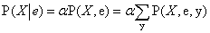
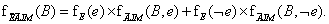

<?xml version="1.0" encoding="UTF-8" standalone="no"?>
<!DOCTYPE html PUBLIC "-//W3C//DTD XHTML 1.1//EN" "http://www.w3.org/TR/xhtml11/DTD/xhtml11.dtd">
<html xmlns="http://www.w3.org/1999/xhtml"><head><meta name="generator" content="DocBook XSL Stylesheets V1.76.1"/></head><body>

<h1 class="title"><a id="id676991"/>Egzakt következtetés Bayes-hálókban</h1>

Az alapvető feladat bármely valószínűségi következtető rendszer számára az, hogy kiszámítsa a <strong>célváltozó</strong>k (<strong>query variable</strong>s) egy halmazának a posteriori valószínűség-eloszlását egy adott megfigyelt <strong>esemény</strong> (<strong>event</strong>) esetén – azaz <strong>bizonyítékváltozó</strong>k (<strong>evidence variable</strong>s) egy halmazához történő érték-hozzárendelés esetén. A 13. fejezetben bevezetett jelölést fogjuk használni: <em>X</em> a célváltozót jelöli; <strong>E</strong> a bizonyítékváltozók <em>E</em>1, …, <em>Em</em> halmazát, <strong>e</strong> pedig a megfigyelt eseményt; <strong>Y</strong> fogja jelölni az (olykor <strong>rejtett változó</strong>knak (<strong>hidden variable</strong>s) nevezett) nem-bizonyítékváltozók <em>Y</em>1, …, <em>Yk</em> halmazát. Így a változók teljes halmaza <strong>X</strong> = {<em>X</em>} ∪ <strong>E</strong> ∪ <strong>Y</strong>. Egy jellemző lekérdezés a <strong>P</strong>(<em>X</em>∣<strong>e</strong>) a posteriori eloszlásra irányul.[<a id="id677112" href="#ftn.id677112" class="footnote">148</a>]

A riasztós hálóban például megfigyelhetnénk azt az eseményt, ahol <em>JánosTelefonál </em>= <em>igaz</em> és <em>MáriaTelefonál</em> = <em>igaz</em>. Ekkor megkérdezhetnénk mondjuk a betörés megtörténtének a valószínűségét:

<code class="code"><em>P</em>(<em>Betörés</em>∣<em>JánosTelefonál</em> = <em>igaz</em>, <em>MáriaTelefonál</em> = <em>igaz</em>) = 〈0,284, 0,716〉</code>

Ebben a fejezetben az a posteriori valószínűségek kiszámítására szolgáló egzakt algoritmusokat tárgyalunk, és átgondoljuk ennek a feladatnak a komplexitását. Kiderül, hogy általános esetben ez kivitelezhetetlen, ezért a 14.5. alfejezet közelítő következtetési módszereket ismertet.

<h2 class="title"><a id="id677164"/>Következtetés felsorolással</h2>

A 13. fejezet elmagyarázta, hogy bármely feltételes valószínűség kiszámítható a teljes együttes eloszlás tagjainak összegzésével. Pontosabban, egy <strong>P</strong>(<em>X</em>∣<strong>e</strong>) lekérdezés megválaszolható a (13.6) egyenlet felhasználásával, amit a jobb követhetőség kedvéért itt megismétlünk:

<h3 class="title">Fontos</h3>
Továbbá, mint ismeretes, a Bayes-háló a teljes együttes eloszlás egy teljes reprezentációját nyújtja. Még pontosabban, a (14.1) egyenlet azt mutatja, hogy az együttes eloszlás <em>P</em>(<em>x</em>,<strong> e</strong>,<strong> y</strong>) tagjai felírhatók a hálóból származó feltételes valószínűségek szorzataiként. Ezért <em>egy lekérdezés megválaszolható a Bayes-háló felhasználásával, kiszámítva a hálóból származó feltételes valószínűségek szorzatainak az összegét</em>.

A 13.4. ábrán a <code class="code">FELSOROL-EGYÜTTES-KÉRDEZÉS</code> algoritmust adtuk meg a teljes együttes eloszlásból felsorolással történő következtetésre. Az algoritmus bemenetként fogadja a <strong>P</strong> teljes együttes eloszlást, és értékeket néz meg benne. Egyszerű módosítással elérhető, hogy az algoritmus egy <em>bn</em> Bayes-hálót fogad bemenetként, és az együttes bejegyzéseket a <em>bn</em> megfelelő FVT-bejegyzéseinek összeszorzásával „nézi meg”.

Vegyük a <strong>P</strong>(<em>Betörés</em>∣<em>JánosTelefonál</em> = <em>igaz</em>, <em>MáriaTelefonál</em> = <em>igaz</em>) lekérdezést. A rejtett változók ennél a kérdésnél a <em>Földrengés</em> és a <em>Riasztás</em>. A (13.6) egyenletből, a kifejezések rövidítése miatt a kezdőbetűket használva, azt kapjuk, hogy[<a id="id677269" href="#ftn.id677269" class="footnote">149</a>] 

A Bayes-hálók szemantikája – (14.1) egyenlet – pedig az FVT-bejegyzések felhasználásával egy kifejezést ad. Az egyszerűség kedvéért ezt csak a <em>Betörés</em> = <em>igaz</em> esetére adjuk meg:

Ennek a kifejezésnek a kiszámításához négy tagot kell összeadnunk, amelyek mindegyikét öt szám összeszorzásával kapjuk. Legrosszabb esetben, amikor majdnem minden változó felett összegezni kell, az algoritmus komplexitása egy <em>n</em> bináris változós háló esetén <em>O</em>(<em>n</em>2n).

A következő egyszerű megfigyeléssel egy javításhoz juthatunk: a <em>P</em>(<em>b</em>) tag állandó, és ki lehet vinni az <em>a</em> és <em>e</em> feletti összegzések elé, a <em>P</em>(<em>e</em>) tag pedig kivihető az <em>a</em> feletti összegzés elé. Így azt kapjuk, hogy

<a id="id677405"/>
<strong>14.8. ábra - A (14.3) egyenletben szereplő kifejezés struktúrája. A kiértékelés fentről lefelé halad, összeszorozva az értékeket az egyes útvonalak mentén, és összegezve a „+” csomópontoknál. Vegyük észre, a <em>j</em>-hez és az <em>m</em>-hez tartozó útvonalak megismétlődését.</strong>

Ez a kifejezés egy ciklussal értékelhető ki, sorban végighaladva a változókon, miközben összeszorozzuk az FVT-bejegyzéseket. Minden összegzésnél, a változó lehetséges értékei szerint is iterálnunk kell. A számítás struktúráját a 14.8. ábra mutatja. Felhasználva a 14.2. ábra értékeit, azt kapjuk hogy <em>P</em>(<em>b</em>∣<em>j</em>,<em>m</em>) = <em>α</em> × 0,00059224. A ¬<em>b</em>-hez tartozó számítást átfutva az <em>α</em> × 0,0014919-et eredményez; így

<a id="id677449"/>
<strong>14.9. ábra - A felsoroló algoritmus Bayes-hálós lekérdezések megválaszolására</strong>

<code class="code"><em>P</em>(<em>B</em>∣<em>j</em>,<em>m</em>) = <em>α</em> 〈0,00059224, 0,0014919〉 ≈ 〈0,284, 0,716〉</code>

Azaz a betörés valószínűsége, ha mindkét szomszéd telefonál körülbelül 28%.

A 14.8. ábra a (14.3) egyenlet kiértékelési folyamatát mutatja, kifejezés fa alakban. A <code class="code">FELSOROL-KÉRDEZ</code> algoritmus a 14.9. ábrán ilyen fákat mélységi rekurzióval értékel ki. Így a <code class="code">FELSOROL-KÉRDEZ</code> tárkomplexitása csak lineáris a változók számában – az algoritmus így hatékonyan, anélkül összegez a teljes együttes eloszlás felett, hogy azt explicit módon megkonstruálná. Sajnos az algoritmus időkomplexitása egy <em>n</em> bináris változós hálónál minden esetben <em>O</em>(2n) – ami jobb, mint az egyszerű megközelítéshez tartozó <em>O</em>(<em>n</em>2n), de még mindig elég nyomasztó. Egy figyelemre méltó dolog a 14.8. ábra fájával kapcsolatban, hogy nyilvánvalóvá teszi a <em>megismételt alkifejezéseket,</em> amelyeket az algoritmus kiértékel. A <em>P</em>(<em>j</em>∣<em>a</em>) <em>P</em>(<em>m</em>∣<em>a</em>) és a <em>P</em>(<em>j</em>∣¬<em>a</em>) <em>P</em>(<em>m</em>∣¬<em>a</em>) szorzatok kétszer kerülnek kiszámításra, <em>e</em> minden értékénél. A következő fejezet egy általános módszert ír le, ami elkerüli az ilyen felesleges újraszámítások elvégzését.

<h2 class="title"><a id="id677566"/>A változó eliminációs algoritmus</h2>

A felsoroló algoritmus lényegesen javítható a 14.8. ábra által szemléltetett ismétlődő számítások kiküszöbölésével. Az ötlet egyszerű: egyszer végezzük el a számítást, és őrizzük meg az eredményeket későbbi használatra. Ez egyfajta dinamikus programozás. Ennek a megközelítésnek több változata is létezik; mi a legegyszerűbbet, a <strong>változó elimináció</strong>s (<strong>variable elimination</strong>) algoritmust mutatjuk be. A változó eliminálás a (14.3) egyenlet típusú kifejezéseket <em>jobbról balra</em> (azaz a 14.8. ábrán<em> lentről felfelé</em>) sorrendben értékeli ki. A köztes eredményeket eltároljuk, és bármely változó feletti összegzés a kifejezésnek csak azon része felett történik meg, amely függ ettől a változótól.

Szemléltessük ezt a folyamatot a betörés háló esetén. Értékeljük ki a következő kifejezést:

Vegyük észre, hogy a kifejezés minden részét megjelöltük a kapcsolódó változó nevével; ezeket <strong>tényező</strong>knek (<strong>factor</strong>s) nevezzük. A lépések a következők:

<ul class="itemizedlist"><li class="listitem">
Az <em>M</em> tényező, <em>P</em>(<em>m</em>∣<em>a</em>) nem igényel <em>M</em> feletti összegzést (mivel <em>M</em> értéke már rögzített). Eltároljuk a valószínűséget <em>a</em> minden értékére egy kételemű vektorban,
</li></ul>

(Az <strong>f</strong>M azt jelöli, hogy <strong>f </strong>létrehozásában <em>M</em>-et felhasználtuk.)

<ul class="itemizedlist"><li class="listitem">
Hasonlóan, tároljuk a <em>J</em>-hez tartozó tényezőt egy kételemű <strong>f</strong>J(<em>A</em>) vektorban.
</li><li class="listitem">
Az <em>A-</em>hoz<em> </em>tartozó tényező, <strong>P</strong>(<em>a</em>∣<em>B</em>, <em>e</em>), ami egy 2 × 2 × 2-es mátrix lesz, <strong>f</strong>A(<em>A</em>, <em>B</em>, <em>E</em>).
</li><li class="listitem">
Most ki kell összegeznünk <em>A-</em>t ennek a három tényezőnek a szorzatából. Ez egy 2 × 2-es mátrixot eredményez, aminek indexei már csak <em>B</em> és <em>E</em> felett futnak. A mátrix nevében <em>A</em>-nál egy felülvonással jelezzük, hogy <em>A</em> már ki lett összegezve:
</li></ul>

Az itt használt szorzást <strong>pontonkénti szorzás</strong>nak (<strong>pointwise product</strong>) nevezik, és hamarosan ismertetjük.

<ul class="itemizedlist"><li class="listitem">
Hasonló módon dolgozzuk fel <em>E</em>-t: kiösszegezzük <em>E</em>-t <strong>f</strong>E(<em>E</em>) és szorzatából: 
</li></ul>

Most pedig kiszámíthatjuk az eredményt egyszerűen összeszorozva <em>B</em> tényezőjét (azaz <strong>f</strong>B(<em>B</em>) = <strong>P</strong>(<em>B</em>)-t) az kiadódott mátrixszal:

A 14.7. (a) feladatban azt kérjük, hogy ellenőrizze, helyes eredményt ad-e ez a folyamat.

A lépések sorozatát megvizsgálva láthatjuk, hogy két alapvető művelet szükséges: tényezőpárok pontonkénti összeszorzása és egy változó kiösszegzése tényezők szorzatából.

A pontonkénti szorzás nem mátrixszorzás és nem is egy elemenkénti szorzás. Két, <strong>f</strong>1 és <strong>f</strong>2 tényezőnek a pontonkénti szorzata egy új <strong>f </strong>tényezőt eredményez, amelynek változóit az <strong>f</strong>1 és <strong>f</strong>2 változóinak az <em>uniója</em> adja. Tételezzük fel, hogy a két tényezőben az <em>Y</em>1, ..., <em>Yk</em> változók közösek. Ekkor azt kapjuk, hogy

<code class="code"><em>f</em>(<em>X</em>1 … <em>Xj</em>, <em>Y</em>1 … <em>Yk</em>, <em>Z</em>1 … <em>Zl</em>) = <em>f</em>1(<em>X</em>1 … <em>Xj</em>, <em>Y</em>1 … <em>Yk</em>)<em>f</em>2(<em>Y</em>1 … <em>Yk</em>, <em>Z</em>1 … <em>Zl</em>)</code>

Ha minden változó bináris, akkor <strong>f</strong>1-nek és <strong>f</strong>2-nek 2j+k és 2k+l eleme van, pontonkénti szorzatuknak pedig 2j + k + l. Például az <strong>f</strong>1(<em>A</em>,<em>B</em>) és az <strong>f</strong>2(<em>B</em>,<em>C</em>) tényezők esetén a lentebb mutatott valószínűség-eloszlással, az <strong>f</strong>1 × <strong>f</strong>2 pontonkénti szorzata <strong>f</strong>3(<em>A</em>, <em>B</em>, <em>C</em>)-vel adott:

Egy változó kiösszegzése tényezők szorzataiból szintén egyértelmű számítás. Az egyetlen észreveendő trükk az, hogy bármely tényező, ami <em>nem</em> függ a kiösszegzendő változótól, az az összegzésen kívülre mozgatható. Például:

Most a pontonkénti szorzat kerül kiszámításra az összegzésen belül, a változót pedig kiösszegezzük a kiadódó mátrixból:

Vegyük észre, hogy mátrixokat <em>nem</em> szorzunk, ameddig nem kell kiösszegeznünk egy változót a kiadódó szorzatból. Annál a pontnál csak azokat a mátrixokat szorozzuk öszsze, amelyek magukban foglalják a kiösszegzendő változót. A pontonkénti szorzás és a kiösszegzés eljárások megléte esetén maga a változó eliminálás algoritmusa, amint azt a 14.10. ábra mutatja, igen egyszerűen felírható.

Nézzünk még egy lekérdezést: <em>P</em>(<em>JánosTelefonál</em>∣<em>Betörés</em> = <em>igaz</em>). Szokásos módon, az első lépés az egymásba ágyazott összegzések felírása:

Ha ezt a kifejezést jobbról balra kiértékeljük, valami érdekeset veszünk észre:  definíció szerint 1-gyel egyenlő. Így ezt eleve kihagyhattuk; a változó <em>M </em>a kérdésre<em> irreleváns</em>. Máshogy fogalmazva, a <em>P</em>(<em>JánosTelefonál</em>∣<em>Betörés</em> = <em>igaz</em>) lekérdezés eredményét nem változtatja meg a <em>MáriaTelefonál</em> eltávolítása a hálóból. Általában, bármely levélcsomópontot eltávolíthatunk, ami nem célváltozó vagy bizonyítékváltozó. Eltávolítás után lehetnek újabb levélcsomópontok, amelyek szintén irrelevánsak lehetnek.

<h3 class="title">Fontos</h3>
Ezt az eljárást folytatva végül szükségszerűen arra jutunk, hogy <em>minden változó, ami nem őse a célváltozónak vagy egy bizonyítékváltozónak, irreleváns a lekérdezésre</em>. A változó elimináló algoritmus ezért az összes ilyen változót eltávolíthatja a lekérdezés kiértékelése előtt.

<a id="id681016"/>
<strong>14.10. ábra - A változó eliminálás algoritmus Bayes-hálós lekérdezések megválaszolására</strong>

<h2 class="title"><a id="id681026"/>Az egzakt következtetés komplexitása</h2>

Megmutattuk, hogy a változóeltávolítás hatékonyabb, mint a felsorolás, mivel elkerüli a számítások megismétlését (ahogyan az irreleváns változókat is kiejti). A változó eliminálás idő- és tárigényét az algoritmus működése alatt létrejövő legnagyobb tényező mérete befolyásolja a legerőteljesebben. Ezt viszont a változók eliminálásának sorrendje és a háló struktúrája határozza meg.

<h3 class="title">Fontos</h3>
A 14.2. ábra betörős hálója a hálóknak azon családjához tartozik, ahol a háló bármely két csomópontja között legfeljebb egyetlen irányítatlan út létezik. Ezeket <strong>egyszeresen összekötött</strong> (<strong>singly connected</strong>) hálóknak vagy <strong>polifá</strong>knak (<strong>polytree</strong>) nevezzük, amelyeknek van egy különösen kellemes tulajdonságuk: <em>az egzakt következtetés idő- és tárkomplexitása a polifákban a háló méretében lineáris</em>. Itt a méret az FVT-bejegyzések számával van definiálva; ha minden egyes csomópont szüleinek a száma egy konstanssal korlátozott, akkor a komplexitás a csomópontok számában is lineáris. Ezek az eredmények bármely – a háló topológiai sorrendjével konzisztens – sorrendezés esetén fennállnak (lásd 14.7. feladat).

<h3 class="title">Fontos</h3>
A <strong>többszörösen összekötött</strong> (<strong>multiply connected</strong>) hálóban (lásd például 14.11. (a) ábra) a változó eliminálás legrosszabb esetben exponenciális idő- és tárkomplexitású lehet, még akkor is, ha a csomópontonkénti szülők száma korlátos. Ez nem meglepő, figyelembe véve, hogy <em>a Bayes-hálókban való következtetés NP-nehéz, mivel ez speciális alesetként tartalmazza az ítéletlogikai következtetést is</em>. Valójában megmutatható (lásd 14.8. feladat), hogy a probléma ugyanannyira nehéz, mint kiszámítani egy ítéletlogikai formula esetén a formulát kielégítő értékadások <em>számát.</em> Ez azt jelenti, hogy ez #P-nehéz („számosság-P-nehéz”), azaz szigorúan nehezebb, mint az NP-teljes problémák. 

Szoros kapcsolat áll fenn a Bayes-hálókban történő következtetés komplexitása és a kényszerkielégítési problémák (CSP) komplexitása között. Amint az 5. fejezetben tárgyaltuk, egy diszkrét CSP megoldásának nehézsége ahhoz kapcsolódik, hogy a kényszergráf mennyire „faszerű”. Olyan mértékek, mint a <strong>hiperfaszélesség</strong> (<strong>hypertree width</strong>), amelyek a CSP megoldási komplexitását határolják, közvetlenül alkalmazhatók Bayes-hálóknál is. Ezenfelül a változó eliminálás algoritmusa általánosítható úgy, hogy kényszerkielégítési problémákat is és Bayes-hálókat is megoldjon.

<h2 class="title"><a id="id681093"/>Csoportosító algoritmusok</h2>

A változó eliminálás algoritmusa egyszerű és hatékony egyedi lekérdezések megválaszolására. Azonban ha a háló összes változójának az a posteriori eloszlását szeretnénk kiszámítani, akkor kevésbé hatékony is lehet. Például egy polifa hálóban <em>O</em>(<em>n</em>) egyenként <em>O</em>(<em>n</em>) költségű lekérdezést kell kiadni, összességében <em>O</em>(<em>n</em>2) időköltséggel. <strong>Csoportosító</strong> (<strong>clustering</strong>) eljárásokkal (amit <strong>egyesítési fa</strong> – <strong>join tree</strong> – algoritmusnak is neveznek) ez az idő <em>O</em>(<em>n</em>)-re csökkenthető. Emiatt ezeket az algoritmusokat gyakran használják kereskedelmi Bayes-hálós eszközökben.

A csoportosítás alapötlete, hogy a háló önálló csomópontjait egyesítjük, klasztercsomópontokat formálva úgy, hogy a kiadódó háló polifa legyen. Például a 14.11. (a) ábrán mutatott, többszörösen összekötött háló egy polifává konvertálható a <em>Locsoló</em> és az <em>Eső</em> csomópontok egy <em>Locsoló</em>+<em>Eső</em>-nek nevezett <strong>klasztercsomópont</strong>ba (<strong>cluster node</strong>) való összevonásával, ahogy azt a 14.11. (b) ábra mutatja. A két bináris csomópontot egyetlen megacsomópont váltotta fel, ami négy lehetséges értéket vesz fel: <em>hh</em>, <em>hi</em>, <em>ih</em>, <em>ii</em>. A megacsomópontnak csak egy szülője van, a bináris <em>Felhős</em> változó, így két feltételes eset létezik.

A háló polifává konvertálása után, egy speciális célú következtetési algoritmust alkalmazunk. Alapvetően az algoritmus egyfajta kényszerterjesztés (lásd 5. fejezet), ahol a kényszerek biztosítják, hogy a szomszédos csoportokban megegyeznek a közös változók a posteriori eloszlásai. Gondos nyilvántartással ez az algoritmus képes <em>O</em>(<em>n</em>) időben – ahol <em>n</em> most a módosított háló mérete – kiszámolni a háló összes nem bizonyíték csomópontjának a posteriori eloszlását. Azonban a probléma NP-nehéz volta nem tűnt el: ha a háló exponenciális idő- és tárigényű a változó eliminálás esetén, akkor a csoportosított hálóhoz tartozó FVT-k megkonstruálása exponenciális idő- és tárigényű lesz.

<a id="id681209"/>
<strong>14.11. ábra - (a) Egy többszörösen összekötött háló feltételes valószínűségi táblákkal. (b) Egy többszörösen összekötött háló csoportosított ekvivalense.</strong>

 

[<a id="ftn.id677112" href="#id677112" class="para">148</a>]  Feltesszük, hogy a célváltozó nincs a bizonyítékváltozók között; amúgy <em>X</em> a posteriori eloszlása a megfigyelt értékre 1 valószínűséget ad. Az egyszerűség kedvéért azt is feltettük, hogy a kérdés egyetlen változóra irányul. Az algoritmusaink könnyen kiterjeszthetők több változó együttesének lekérdezésére.

[<a id="ftn.id677269" href="#id677269" class="para">149</a>]  Egy olyan kifejezés mint a  a <em>P</em>(<em>A = a, E = e</em>) -nek az összegzését jelenti minden lehetséges <em>e</em> értékre. Ez többértelműséget rejt magában, mivel a <em>P</em>(<em>e</em>) jelölést használják mind a <em>P</em>(<em>E </em>= <em>igaz</em>), mind a <em>P</em>(<em>E </em>= <em>e</em>) jelentés kifejezésére, azonban a szándékolt jelentésnek a szövegkörnyezetből ki kell derülnie; egy összegzés esetében az utóbbiról van szó.

</body></html>
