<?xml version="1.0" encoding="UTF-8" standalone="no"?>
<!DOCTYPE html PUBLIC "-//W3C//DTD XHTML 1.1//EN" "http://www.w3.org/TR/xhtml11/DTD/xhtml11.dtd">
<html xmlns="http://www.w3.org/1999/xhtml"><head><meta name="generator" content="DocBook XSL Stylesheets V1.76.1"/></head><body>

<h1 class="title"><a id="id681219"/>Közelítő következtetés Bayes-hálókban</h1>

Az egzakt következtetés nagy, többszörösen összekötött hálókban való kezelhetetlensége miatt, elengedhetetlen közelítő következtetési módszerek átgondolása. Ez a fejezet véletlen mintavételi, <strong>Monte Carlo</strong>-módszereknek is nevezett, eljárásokat ír le, amelyek közelítő válaszokat nyújtanak, ahol a pontosság a generált minták számától függ. 

Az utóbbi években a Monte Carlo-algoritmusok széles körben elterjedtek a számítástudományban olyan mennyiségek megbecslésére, amelyeket nehéz egzakt módon kiszámolni. Például a 4. fejezetben leírt szimulált lehűtés algoritmus egy Monte Carlo-eljárás optimalizációs problémákra. Ebben a fejezetben a mintavételezésnek az a posteriori valószínűségek kiszámításában történő alkalmazásában vagyunk érdekeltek. Algoritmusok két nagy családját írjuk le: a közvetlen mintavételezést és a Markov-láncos mintavételezést. Két másik megközelítést – a variációs módszert és a „hurkos” („loopy”) terjesztést – a fejezet végi megjegyzésekben említjük meg.

<h2 class="title"><a id="id681233"/>Közvetlen mintavételezési módszerek</h2>

Az alapelem minden mintavételi algoritmusban a minták generálása egy ismert valószínűség-eloszlásból. Például egy szabályos érme felfogható egy <em>Érme</em> valószínűségi változónak 〈<em>fej</em>,<em>írás</em>〉 értékekkel és <strong>P</strong>(<em>Érme</em>) = 〈0,5, 0,5〉<em> </em>a priori eloszlással. A mintavétel ebből az eloszlásból pontosan megfelel egy érme dobálásának: 0,5 valószínűséggel <em>fej</em>-et ad, és 0,5 valószínűséggel <em>írás</em>-t. Ha rendelkezésre áll a [0, 1] tartományba eső véletlen számoknak egy forrása, akkor bármely egyváltozós eloszlásból egyszerű dolog mintavételezni (lásd 14.9. feladat).

A véletlen mintavételezési folyamat legegyszerűbb fajtája Bayes-hálók esetén a hálóból generál olyan eseményeket, amelyekhez nem kapcsolódik bizonyíték. Az ötlet az, hogy mintavételezzünk minden változót egymás után, topológiai sorrendben. A valószínűség-eloszlás, amiből az értéket mintavételezzük, feltételesen függ a változó szüleihez már hozzárendelt értékektől. Ez az algoritmus látható a 14.12. ábrán. A működését a 14.11. (a) ábrán látható hálón szemléltetjük, feltételezve egy [<em>Felhős</em>,<em> Locsoló</em>,<em> Eső</em>,<em> VizesPázsit</em>] sorrendezést:

<ol class="orderedlist"><li class="listitem">
Sorsoljunk a <strong>P</strong>(<em>Felhős</em>) = 〈0,5, 0,5〉 eloszlásból; tegyük fel, hogy <em>igaz</em>-at kapunk<em>.</em>
</li><li class="listitem">
Sorsoljunk a <strong>P</strong>(<em>Locsoló</em>∣<em>Felhős</em> = <em>igaz</em>) = 〈0,1, 0,9〉 eloszlásból; tegyük fel, hogy <em>hamis</em>-at kapunk.
</li><li class="listitem">
Sorsoljunk a <strong>P</strong>(<em>Eső</em>∣<em>Felhős</em> = <em>igaz</em>) = 〈0,8, 0,2〉 eloszlásból; tegyük fel, hogy <em>igaz</em>-at kapunk.
</li><li class="listitem">
Sorsoljunk a <strong>P</strong>(<em>VizesPázsit</em>∣<em>Locsoló</em> = <em>hamis</em>, <em>Felhős</em> = <em>igaz</em>) = 〈0,9, 0,1〉 eloszlásból; tegyük fel, hogy <em>igaz</em>-at kapunk.
</li></ol>

Ebben az esetben a <code class="code">PRIOR-MINTA</code> a következő eseményt adja [<em>igaz</em>,<em> hamis</em>,<em> igaz</em>,<em> igaz</em>].

Könnyen látható, hogy a <code class="code">PRIOR-MINTA</code> a háló által meghatározott a priori együttes eloszlásból generál mintákat. Először, legyen <em>SPS</em>(<em>x</em>1, …, <em>xn</em>) annak a valószínűsége, hogy egy adott eseményt legenerál a <code class="code">PRIOR-MINTA</code> algoritmus. <em>Pusztán a mintavételi folyamat alapján</em> felírható, hogy

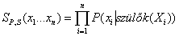

mivel minden mintavételi lépés a szülő értékektől függ.

<a id="id681451"/>
<strong>14.12. ábra - Egy mintavételező algoritmus, amely eseményeket generál egy Bayes-hálóból</strong>

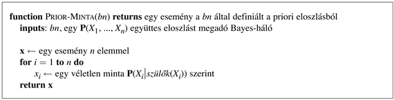

Ez a kifejezés ismerős, mivel – ahogy ezt a (14.1) egyenlet kimondja – ez egyben a valószínűsége is az együttes eloszlás Bayes-hálós reprezentációja szerinti eseménynek is. Arra jutottunk tehát, hogy

<code class="code"><em>SPS</em>(<em>x</em>1…<em>xn</em>) = <em>P</em>(<em>x</em>1…<em>xn</em>)</code>

Ez az egyszerű tény nagyon könnyűvé teszi lekérdezések – minták felhasználásával történő – megválaszolását.

Bármilyen mintavételi algoritmusban a válasz kiszámítása a generálás során előálló minták megszámlálása alapján történik. Tételezzük fel, hogy <em>N</em> teljes mintánk van, és jelölje <em>N</em>(<em>x</em>1, …, <em>xn</em>) az <em>x</em>1, …, <em>xn</em> esemény gyakoriságát. Azt várjuk, hogy ez a gyakoriság határértékben konvergáljon a várható értékéhez a mintavételi valószínűség szerint:

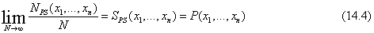

Például gondoljuk meg az előbb generált eseményt: [<em>igaz</em>,<em> hamis</em>,<em> igaz</em>,<em> igaz</em>]. Ennek az eseménynek a mintavételi valószínűsége:

<code class="code"><em>SPS</em>(<em>igaz</em>, <em>hamis</em>, <em>igaz</em>,<em> igaz</em>) = 0,5 × 0,9 × 0,8 × 0,9 = 0,324</code>

Így, <em>N</em> nagy értékeinél azt várjuk, hogy a minták 32,4%-a ez az esemény legyen.

A következőkben, amikor a közelítő egyenlőség jelet („≈”) használjuk, pontosan ilyen értelemben használjuk – azaz a becsült valószínűség egzakttá válik a nagy mintaszámú határesetben. Az ilyen becsléseket <strong>konzisztens</strong>nek (<strong>consistent</strong>) nevezzük. Például bármely részlegesen meghatározott <em>x</em>1,<em> …</em>, <em>xm</em> esemény valószínűségének egy konzisztens becslése a következőképpen kapható meg, ha <em>m</em> ≤ <em>n</em>:

<code class="code"><em>P</em>(<em>x</em>1,…, <em>xm</em>) ≈ <em>NPS</em>(<em>x</em>1<em>,…</em>, <em>xm</em>)/<em>N	</em>				(14.5)</code>

Azaz, az esemény valószínűsége megbecsülhető a mintavételi folyamat által generált összes teljes esemény azon hányadával, amelyek illeszkednek a részlegesen meghatározott eseményre. Például ha generálunk 1000 mintát a locsolós hálóból, és 511-ben közülük az <em>Eső</em> = <em>igaz</em>, akkor az eső becsült valószínűsége 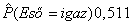.

<strong>Elutasító mintavételezés Bayes-hálókban</strong>

Az <strong>elutasító mintavételezés</strong> (<strong>rejection sampling</strong>) általános módszer minták előállítására egy nehezen mintavételezhető eloszlásból, felhasználva egy könnyen mintavételezhető eloszlást. Legegyszerűbb formájában feltételes valószínűségek kiszámítására – azaz <em>P</em>(<em>X</em>∣<strong>e</strong>) meghatározására használható fel. Az <code class="code">ELUTASÍTÓ-MINTAVÉTELEZÉS</code> algoritmusa a 14.13. ábrán látható. Először a háló által megadott a priori eloszlásból generál mintákat, majd elutasítja azokat, amelyek nem illeszkednek a bizonyítékhoz. Végül, a 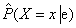 becslés megkapható az <em>X</em> = <em>x</em> előfordulásainak megszámlálásával a megmaradt mintában.

Legyen 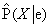 az algoritmus által kiadott becsült eloszlás. Az algoritmus definíciója szerint fennáll, hogy

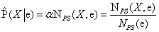

A 14.5 egyenletből kapjuk, hogy

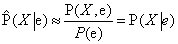

Azaz az elutasító mintavétel az igazi valószínűség konzisztens becslését adja.

<a id="id681769"/>
<strong>14.13. ábra - Az elutasító mintavétel algoritmusa, ami Bayes-hálós lekérdezéseket válaszol meg bizonyítékok esetén</strong>

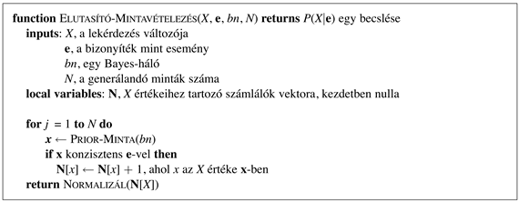

Folytatva a 14.11. (a) ábra szerinti példánkat, tételezzük fel, hogy meg szeretnénk becsülni a <strong>P</strong>(<em>Eső</em>∣<em>Locsoló</em> = <em>igaz</em>)-t, 100 minta felhasználásával. A 100 általunk generált mintából, tegyük fel, hogy 73-ban teljesül, hogy <em>Locsoló</em> = <em>hamis</em>, és így elutasított, míg 27-ben fennáll, hogy <em>Locsoló</em> = <em>igaz</em>; a 27-ből 8-ban <em>Eső</em> = <em>igaz</em>, 19-ben pedig <em>Eső</em> = <em>hamis.</em> Így a

<code class="code"><em>P</em>(<em>Eső</em>∣<em>Locsoló</em> = <em>igaz</em>) ≈ Normalizál(〈8, 19〉) = 〈0,296, 0,704〉</code>

A helyes érték 〈0,3, 0,7〉. A begyűjtött minták szaporodásával a becslés konvergálni fog a helyes értékhez. A becslés szórása az egyes valószínűségeknél arányos lesz 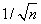-nel, ahol <em>n</em> a becsléshez felhasznált minták száma.

Az elutasító mintavétel legnagyobb hibája, hogy nagyon sok mintát utasít el! Az <strong>e</strong> bizonyítékkal konzisztens minták aránya exponenciálisan egyre kevesebb, ahogy a bizonyítékváltozók száma nő, így az eljárás egyszerűen használhatatlan komplex problémákban.

Vegyük észre, hogy az elutasító mintavétel nagyon hasonló a feltételes valószínűségek becsléséhez, ha közvetlenül a valódi világból történik a becslés. Például a <em>P</em>(<em>Eső</em>∣<em>VörösAzÉgEste </em>= <em>igaz</em>) becslésénél egyszerűen megszámoljuk, milyen gyakran esik az után, hogy az előző este az ég vörös volt – figyelmen kívül hagyva azokat az estéket, amikor az ég nem volt vörös. (Itt a világ maga játssza a mintageneráló algoritmus szerepét.) Nyilvánvalóan, ha az ég nagyon ritkán vörös, akkor ez hosszú időt vehet igénybe, és ez az, ami az elutasító mintavétel gyengesége.

<strong>Valószínűségi súlyozás</strong>

A <strong>valószínűségi súlyozás</strong> (<strong>likelihood weighting</strong>) elkerüli az elutasító mintavételezés gyengeségét azáltal, hogy csak az <strong>e</strong> bizonyítékkal konzisztens eseményeket generál. Az algoritmus működésének a leírásával kezdjük; majd megmutatjuk, hogy helyesen működik – azaz, hogy konzisztens valószínűség becsléseket generál. A <code class="code">VALÓSZÍNŰSÉGI-SÚLYOZÁS</code> (lásd 14.14. ábra) rögzíti az <strong>E</strong> bizonyítékváltozók értékeit, és csak a maradék <em>X</em> és <strong>Y</strong> változókat mintavételezi. Ez garantálja, hogy minden generált esemény konzisztens a bizonyítékkal. Azonban nem minden esemény egyenlő. Mielőtt megállapítanánk a számlálási eredményeket a célváltozó eloszlásában, minden eseményt súlyozunk azzal a valószínűséggel, amely megadja, hogy az esemény mennyire van összhangban a bizonyítékkal. Ezt a valószínűséget az egyes bizonyítékváltozók feltételes valószínűségeinek a szorzatával mérjük, a szüleik ismeretében. Szemléletesen, azoknak az eseményeknek, ahol a bizonyíték valószínűtlennek tűnik, kisebb súlyt kell adni.

Alkalmazzuk az algoritmust a 14.11. (a) ábrán látható háló esetén a <strong>P</strong>(<em>Eső</em>∣<em>Locsoló </em>= <em>igaz</em>, <em>VizesPázsit</em> = <em>igaz</em>) kérdésre. A folyamat a következőképpen halad: először a <em>w</em> súlyt 1,0-ra állítjuk. Aztán generálunk egy eseményt:

<ol class="orderedlist"><li class="listitem">
Sorsoljunk a <strong>P</strong>(<em>Felhős</em>) = 〈0,5, 0,5〉 eloszlásból; tegyük fel, hogy <em>igaz</em>-at kapunk<em>.</em>
</li><li class="listitem">
A <em>Locsoló</em> egy bizonyítékváltozó <em>igaz</em> értékkel. Ezért beállítjuk, hogy
</li></ol>

<code class="code"><em>w </em>← <em>w</em> × <em>P</em>(<em>Locsoló</em> = <em>igaz</em>∣<em>Felhős</em> = <em>igaz</em>) = 0,1</code>

<ol class="orderedlist"><li class="listitem">
Sorsoljunk a <strong>P</strong>(<em>Eső</em>∣<em>Felhős</em> = <em>igaz</em>) = 〈0,8, 0,2〉 eloszlásból; tegyük fel, hogy <em>igaz</em>-at kapunk<em>.</em>

<ol class="orderedlist"><li class="listitem">
A <em>VizesPázsit </em>egy<em> </em>bizonyítékváltozó<em> igaz </em>értékkel. Ezért beállítjuk, hogy
</li></ol>
</li></ol>

<code class="code"><em>	w </em>← <em>w</em> × <em>P</em>(<em>VizesPázsit</em> = <em>igaz</em>∣<em>Locsoló</em> = <em>igaz</em>, <em>Eső</em> = <em>igaz</em>) = 0,099</code>

Itt a <code class="code">SÚLYOZOTT-MINTA</code> az [<em>igaz</em>,<em> igaz</em>,<em> igaz</em>,<em> igaz</em>] eseményt adja ki 0,099 súllyal, és ezt az <em>Eső </em>= <em>igaz</em> esetnél vesszük számításba. A súly alacsony, mivel az esemény egy felhős napot ír le, amikor valószínűtlen, hogy a locsoló be van kapcsolva.

Hogy megértsük, miért is működik a valószínűségi súlyozás, azzal kezdjük, hogy megvizsgáljuk a <code class="code">SÚLYOZOTT-MINTA</code> <em>SWS</em> mintavételi eloszlását. Emlékezzünk, hogy az <strong>E</strong> bizonyítékváltozók értéke (<strong>e</strong>) rögzített. A többi változót <strong>Z</strong>-vel jelöljük, azaz <strong>Z</strong> = {X} ∪ <strong>Y</strong>. Az algoritmus <strong>Z</strong> minden változóját mintavételezi, szülei adott értékei mellett:

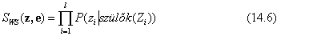

Vegyük észre, hogy a <em>Szülők</em>(<em>Zi</em>) tartalmazhat mind rejtett, mind bizonyítékváltozókat is. A <em>P</em>(<strong>z</strong>) a priori eloszlástól eltérően az <em>SWS</em> eloszlás szentel valamennyi figyelmet a bizonyítéknak is: a mintavételezett értékeket minden <em>Zi</em> esetén befolyásolják a <em>Zi</em> ősei között levő bizonyítékok. Másfelől, <em>SWS</em> kevesebb figyelmet szentel a bizonyítékoknak, mint a <em>P</em>(<strong>z</strong>∣ <strong>e</strong>) valódi a posteriori eloszlás, mivel a mintavételezett értékek minden <em>Zi</em> esetén <em>figyelmen kívül hagyják</em> azokat a bizonyítékokat, amelyek <em>Zi</em>-nek nem ősei.[<a id="id682250" href="#ftn.id682250" class="footnote">150</a>]

A <em>w</em> valószínűségi súly pótolja ki a különbséget a valódi és a kívánt mintavételi eloszlás között. Egy adott <strong>z-</strong>ből és <strong>e-</strong>ből álló <strong>x<em> </em></strong>minta súlya az összes bizonyítékváltozó valószínűségének szorzata a szülei értékei mellett (amelyek közül néhány vagy akár az összes a <em>Zi-</em>k között lehet):

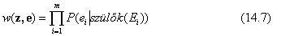

A (14.6) és (14.7) egyenleteket összeszorozva láthatjuk, hogy egy minta <em>súlyozott</em> valószínűsége különösen kényelmes alakú

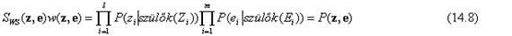

mivel a két szorzat lefedi az összes változót a hálóban, lehetővé téve, hogy az együttes valószínűségre a (14.1) egyenletet használjuk.

<a id="id682323"/>
<strong>14.14. ábra - A valószínűségi súlyozás algoritmusa Bayes-hálóban történő következtetéshez</strong>

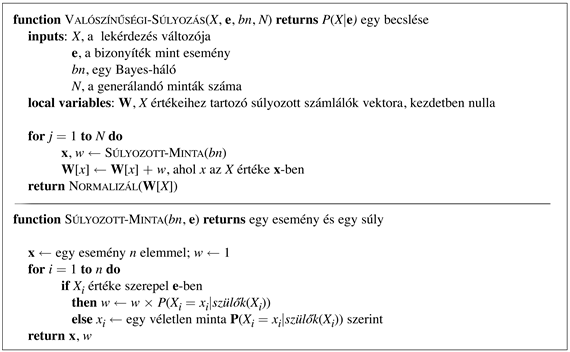

Most már könnyen megmutatható, hogy a valószínűségi súlyozásos mintavétel konzisztens. Az <em>X</em> bármely konkrét <em>x</em> értékére a becsült a posteriori valószínűség a következőképpen számítható ki:

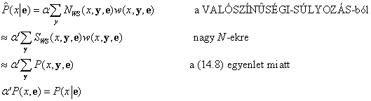

Így a valószínűségi súlyozás konzisztens becsléseket szolgáltat.

Mivel a valószínűségi súlyozás az összes generált mintát felhasználja, sokkal hatékonyabb lehet, mint az elutasításos mintavétel. Azonban a teljesítménye leromlik, amint a bizonyítékváltozók száma növekszik. Ez azért következik be, mert a legtöbb mintának nagyon kis súlya lesz, és így a súlyozott becslést főként a minták azon csekély töredéke határozza meg, amelyek egy elenyésző valószínűségnél jobban illeszkednek a bizonyítékokhoz. A probléma még erőteljesebben jelentkezik, ha a bizonyítékváltozók később fordulnak elő a változó sorrendben, mivel ekkor a minták olyan szimulációk, amelyek kevés hasonlóságot mutatnak a bizonyítékok által sugalmazott valósághoz.

<h2 class="title"><a id="id682357"/>Következtetés Markov-lánc szimulációval</h2>

Ebben a fejezetben a <strong>Markov lánc Monte Carlo</strong> (<strong>MCMC</strong>, <strong>Markov chain Monte </strong><strong>Carlo</strong>) algoritmust ismertetjük, hogy Bayes-hálókban következtethessünk. Először leírjuk, mit is csinál az algoritmus, majd elmagyarázzuk, hogy miért is működik, és miért van ilyen bonyolult neve.

<strong>Az MCMC algoritmus</strong>

Az előző két mintavételi algoritmustól eltérően, amelyek az egyes eseményeket a semmiből generálják, az MCMC minden eseményt az azt megelőző esemény véletlen módosításával generál. Ezért a hálót hasznos úgy elképzelni, mint aminek van egy konkrét <em>jelenlegi állapota,</em> ami minden változóra meghatároz egy értéket. A következő állapot generálása egy <em>Xi</em> nem bizonyítékváltozóhoz tartozó érték véletlenszerű mintavételezésével történik,<em> az Xi Markov-takarójába tartozó változók jelenlegi értékeinek feltétele mellett</em>. (Emlékezzünk vissza az <a class="xref" href="ch14s02.md#ID_586_oldal">„Feltételes függetlenségi relációk Bayes-hálókban”</a> részre: egy változó Markov-takarója a szüleiből, gyermekeiből és gyermekei szüleiből áll.) Az MCMC így véletlen bolyongást végez az állapottérben – a lehetséges teljes érték hozzárendelések terében –, egyszerre egy változót billentve át, de rögzítetten tartva a bizonyítékváltozókat.

Gondoljuk meg a <strong>P</strong>(<em>Eső</em>∣<em>Locsoló</em> = <em>igaz</em>, <em>VizesPázsit</em> = <em>igaz</em>) kérdést a 14.11. (a) ábrán látható háló esetén. A <em>Locsoló </em>és<em> </em>a <em>VizesPázsit</em> bizonyítékváltozók rögzítettek a megfigyelt értékeikre, míg a rejtett <em>Felhős</em> és <em>Eső</em> változók véletlenszerűen inicializáltak – mondjuk az egyik <em>igaz</em>-ra, a másik <em>hamis</em>-ra. Így a kezdeti állapot [<em>igaz</em>,<em> igaz</em>,<em> hamis</em>,<em> igaz</em>]. Ekkor a következő lépéseket hajtjuk végre ismétlődően:

<ol class="orderedlist"><li class="listitem">
A <em>Felhős</em>-t mintavételezzük a Markov-takarójába eső változók jelenlegi értékeinek ismeretében: ebben az esetben a <strong>P</strong>(<em>Felhős</em>∣<em>Locsoló</em> = <em>igaz</em>,<em> Eső</em> = <em>hamis</em>)<em> </em>szerint mintavételezünk. (Hamarosan megmutatjuk, hogyan számítható ki ez az eloszlás.) Tegyük fel, hogy az eredmény <em>Felhős</em> = <em>hamis.</em> Ekkor az új állapot [<em>hamis</em>, <em>igaz</em>, <em>hamis</em>,<em> igaz</em>].
</li><li class="listitem">
Az <em>Eső-</em>t mintavételezzük a Markov-takarójába eső változók jelenlegi értékeinek ismeretében: ebben az esetben a <strong>P</strong>(<em>Eső</em>∣<em>Felhős </em>= <em>hamis</em>,<em> Locsoló</em> = <em>igaz</em>,<em> VizesPázsit</em> = <em>igaz</em>)<em> </em>szerint mintavételezünk. Tegyük fel, hogy ennek eredménye <em>Eső</em> = <em>igaz.</em> Ekkor az új állapot [<em>hamis</em>, <em>igaz</em>,<em> igaz</em>,<em> igaz</em>].
</li></ol>

A folyamat során meglátogatott minden egyes állapot egy olyan minta, ami hozzájárul az <em>Eső</em> célváltozó megbecsléséhez. Ha a folyamat 20 állapotot látogatott meg, ahol az <em>Eső</em> igaz, és 61 állapotot, ahol az <em>Eső</em> hamis, akkor a kérdésre a választ a <code class="code">NORMALIZÁL</code> (〈20, 60〉) = 〈0,25, 0,75〉<em> </em>adja<em>. </em>A<em> </em>teljes algoritmus a 14.15. ábrán látható.

<strong>Miért működik az MCMC?</strong>

<h3 class="title">Fontos</h3>
Most megmutatjuk, hogy az MCMC konzisztens becsléseket szolgáltat az a posteriori valószínűségekre. A fejezet anyaga eléggé technikai jellegű, de az alapállítás egyszerű: <em>a mintavételi folyamat egy olyan „dinamikus egyensúlyban” állapodik meg, amelyben az egyes állapotokban töltött idő hosszú távon számolt hányada pontosan az a posteriori valószínűséggel arányos. </em>Ez a figyelemre méltó tulajdonság a speciális <strong>átmenetvalószínűség</strong> (<strong>transition probability</strong>) miatt áll fent, amely szerint a folyamat egyik állapotból a másikba lép át, ahogyan ezt a feltételes eloszlást a mintavételezett változó Markov-takarója meghatározza.

<a id="id682995"/>
<strong>14.15. ábra - Az MCMC algoritmus Bayes-hálóban történő közelítő következtetéshez</strong>

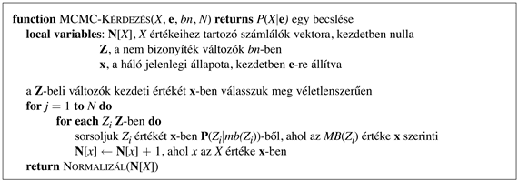

<a id="ID_605_oldal"/>
Legyen <em>q</em>(<strong>x</strong>⟶<strong>x</strong>′) az a valószínűség, hogy a folyamat <strong>x</strong> állapotból <strong>x</strong>′ állapotba lép át. Ez az átmenet-valószínűség definiálja az úgynevezett <strong>Markov-lánc</strong>ot (<strong>Markov chain</strong>) az állapottéren. (A Markov-láncok a 15. és 17. fejezetben is kiemelkedő szerepet játszanak.)

Tegyük fel most, hogy <em>t</em> lépésnyit futtatjuk a Markov-láncot, és legyen πt(<strong>x</strong>) annak a valószínűsége, hogy a rendszer a <em>t</em> időpillanatban az <strong>x</strong> állapotban van. Hasonlóan, legyen π<em>t</em>=1(<strong>x</strong>′) annak a valószínűsége, hogy a rendszer <em>t</em> = 1 időpillanatban <strong>x</strong>′ állapotban van. Ismerve πt(<strong>x</strong>)-et a π<em>t</em>=1(<strong>x</strong>′) kiszámítható úgy, hogy minden olyan állapotra, amiben a rendszer <em>t</em> időpillanatban lehet, összegezzük az állapot valószínűségének és az ebből az állapotból az <strong>x</strong>′-be való átlépés valószínűségének szorzatát:

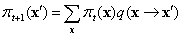

Akkor mondjuk, hogy egy lánc elérte a <strong>stacionárius eloszlás</strong>át (<strong>stationary distribution</strong>), ha πt = π<em>t+</em>1. Jelöljük ezt a stacionárius eloszlást π<em>-</em>vel; az ezt definiáló egyenlet így

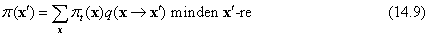

Ha a <em>q</em> átmenet-valószínűség eloszlás eleget tesz néhány alapvető feltevésnek,[<a id="id683161" href="#ftn.id683161" class="footnote">151</a>] akkor bármely <em>q</em> esetén pontosan egyetlen π eloszlás elégíti ki ezt az egyenletet.

A (14.9) egyenlet úgy tekinthető, mint ami azt állítja, hogy az egyes állapotokból a „kilépések” várható értéke (azaz a jelenlegi „populáció”) egyenlő az összes állapotbóli „belépések” várható értékével. Ez a kapcsolat nyilvánvalóan teljesíthető, ha a várható átlépések mindkét irányban ugyanakkorák bármely állapotpár esetén. Ez a tulajdonság a <strong>teljes egyensúly</strong> (<strong>detailed balance</strong>):

<code class="code"><em>π</em>(<em>x</em>)<em>q</em>(<em>x</em>⟶<em>x</em>′) = <em>π</em> (<em>x</em>′)<em>q</em>(<em>x</em>⟶<em>x</em>′)<em>		</em>minden <em>x</em>, <em>x</em>′-re			(14.10)</code>

Megmutathatjuk, hogy a teljes egyensúly maga után vonja a stacionaritást, egyszerűen az <strong>x</strong>-ek felett összegezve a (14.10) egyenletben. Azt kapjuk, hogy

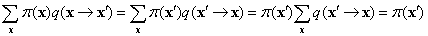

ahol az utolsó lépés abból következik, hogy <strong>x</strong>′-ből biztosan történik átmenet.

Most megmutatjuk, hogy az <code class="code">MCMC-KÉRDEZ</code> mintavételi lépésében megadott <em>q</em>(<strong>x</strong>⟶<strong>x</strong>′)<em> </em>átmenet-valószínűség eleget tesz a teljes egyensúly egyenletének, ahol a stacionárius eloszlás a <em>P</em>(<strong>x</strong>∣<strong>e</strong>), a rejtett változók valódi a posteriori eloszlása. Ezt két lépésben teszszük meg. Először, egy Markov-láncot definiálunk, amelyben minden változót az <em>öszszes</em> többi változóval feltételesen mintavételezünk, és megmutatjuk, hogy ez eleget tesz a teljes egyensúly egyenletének. Majd egyszerűen megállapítjuk, hogy Bayes-hálóknál ez ekvivalens azzal a feltételes mintavételezéssel, hogy a feltétel a változó Markov-takarója (lásd <a class="xref" href="ch14s02.md#ID_586_oldal">„Feltételes függetlenségi relációk Bayes-hálókban”</a> részben).

Legyen <em>Xi</em> a mintavételezett változó, és jelölje  az összes többi rejtett változót. A jelenlegi állapotban az értékük <em>xi</em> és 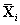. Ha az <em>Xi</em>-nek új <em>xi</em>′ értéket mintavételezünk feltételesen az összes többi változóval, beleértve a bizonyítékot is, akkor

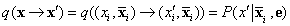

Ezt az átmenet-valószínűséget nevezik <strong>Gibbs-mintavételező</strong>nek (<strong>Gibbs sampler</strong>), ami az MCMC egy nagyon kényelmes alakja.

Most megmutatjuk, hogy a Gibbs-mintavételező teljes egyensúlyban van a helyes a posteriori eloszlása szerint:

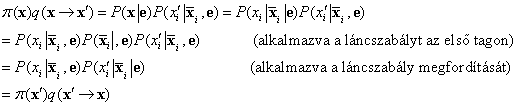

Ahogy az <a class="xref" href="ch14s02.md#ID_586_oldal">„Feltételes függetlenségi relációk Bayes-hálókban”</a> részben kimondtuk, egy változó független az összes többi változótól a Markov-takarójának a feltételében; így:

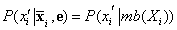

ahol <em>mb</em>(<em>Xi</em>) jelöli az <em>Xi </em>Markov-takarójában, <em>MB</em>(<em>Xi</em>)-ben lévő változók értékeit. Amint a 14.10. feladat mutatja, egy változó valószínűsége a Markov-takarójának ismeretében arányos a változó szüleivel vett feltételes valószínűségének és az egyes gyermekek azok szüleivel vett feltételes valószínűségeinek a szorzatával:

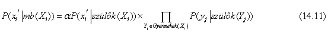

Így egy változó átléptetéséhez az <em>Xi </em>gyermekeinek számával megegyező számú szorzás szükséges.

Itt csupán az MCMC-nek egy egyszerű változatát tárgyaltuk, nevezetesen a Gibbs-mintavételezőt. Legáltalánosabb formájában az MCMC hatékony módszer valószínűségi modellekkel való számolásra, és számos változatát fejlesztették ki, közöttük a 4. fejezetben bemutatott szimulált lehűtés algoritmust, a 7. fejezetben a sztochasztikus kielégíthetőség algoritmust, valamint a 15. fejezetben a Metropolis–Hastings-mintavételezőt.

 

[<a id="ftn.id682250" href="#id682250" class="para">150</a>]  Ideálisan, a <em>P</em>(<strong>z</strong>∣<strong>e</strong>) valódi a posteriori eloszlással megegyező mintavételi eloszlást szeretnénk használni, hogy az összes bizonyítékot figyelembe vegyük. Ez azonban nem tehető meg hatékonyan. Ha lehetne, akkor a kívánt valószínűséget tetszőleges pontossággal közelíthetnénk polinomiális számú mintával. Megmutatható, hogy nem létezhet ilyen polinom idejű közelítő séma.

[<a id="ftn.id683161" href="#id683161" class="para">151</a>]  A <em>q</em> által definiált Markov-láncnak <strong>ergodikus</strong>nak (<strong>ergodic</strong>) kell lennie – azaz lényegében, minden állapotnak elérhetőnek kell lennie bármely másik állapotból, és nem lehetnek szigorúan periodikus ciklusok.

</body></html>
