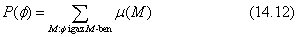
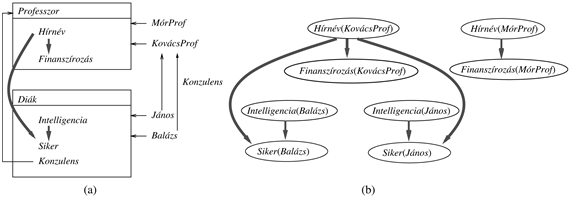
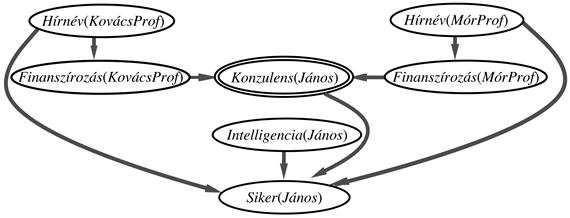

<?xml version="1.0" encoding="UTF-8" standalone="no"?>
<!DOCTYPE html PUBLIC "-//W3C//DTD XHTML 1.1//EN" "http://www.w3.org/TR/xhtml11/DTD/xhtml11.dtd">
<html xmlns="http://www.w3.org/1999/xhtml"><head><meta name="generator" content="DocBook XSL Stylesheets V1.76.1"/></head><body>

<h1 class="title"><a id="id683447"/>Elsőrendű reprezentációk valószínűségi kiterjesztése </h1>

<h3 class="title">Fontos</h3>
A 8. fejezetben kifejtettük az elsőrendű logika reprezentációs előnyeit az ítéletlogikához képest. Az elsőrendű logika objektumok és közöttük lévő relációk létezését veszi alapul, és képes tényeket kifejezni a tárgyterület <em>néhány</em> vagy <em>összes</em> objektumáról. Ez gyakran vezet olyan reprezentációkra, amelyek összehasonlítathatlanul tömörebbek, mint az ekvivalens ítéletlogikai leírások. Márpedig a Bayes-hálók alapvetően az ítéletlogikához kapcsolódnak: a változók halmaza rögzített és véges, és minden változónak rögzített értékkészlete van. Ez a tény korlátozza a Bayes-hálók felhasználhatóságát. <em>Ha sikerül találnunk egy módszert arra, hogy az elsőrendű reprezentációk kifejezőerejét a valószínűség-számítással kombináljuk, várható, hogy ugrásszerűen megnöveljük a kezelhető problémák körét.</em>

<h3 class="title">Fontos</h3>
Ennek a célnak az eléréséhez a következő alapvető felismerés szükséges: az ítéletlogika szemszögéből nézve a Bayes-háló elemi események feletti valószínűségeket határoz meg, amelyek mindegyike a hálózat minden változójára meghatároz egy értéket. Azaz, az ítéletlogika terminológiája szerint egy elemi esemény egy <strong>modell</strong> vagy egy <strong>lehetséges világ</strong>. Az elsőrendű felfogás szerint egy modell (az értelmezésével együtt) meghatározza az objektumok egy tárgykörét, a közöttük fennálló kapcsolatokat, és a tudásbázisbeli konstansok és predikátumok egy megfeleltetését a modellbeli objektumokra és kapcsolatokra. Ezért <em>egy elsőrendű valószínűségi tudásbázisnak az összes lehetséges elsőrendű modell valószínűségét definiálnia kell. </em>Legyen <em>μ</em> (<em>M</em>) a tudásbázis által az <em>M</em> modellhez rendelt valószínűség. Ekkor bármely <em>∅</em> elsőrendű állításnak a <em>P</em>(<em>∅</em>) valószínűségét a szokásos módon kapjuk, összegezve azon lehetséges világok felett, ahol <em>∅ </em>igaz:

Eddig rendben is volna. Azonban van egy probléma: az elsőrendű modellek halmaza végtelen. Ez azt jelenti, hogy (1) az összegzés kivitelezhetetlen, és (2) egy teljes, konzisztens eloszlás meghatározása a világok egy végtelen halmazán igen bonyolult lehet.

Fogadjunk el ezért bizonyos korlátozásokat, legalábbis időlegesen. Nevezetesen, hogy tervezzünk egy olyan korlátozott nyelvet, amelyhez csak véges modell tartozik. Ez számos módon megtehető. Itt a <strong>relációs valószínűségi modell</strong>eket (<strong>relational prob</strong><strong>ability model</strong>s, <strong>RPM</strong>) vagy <strong>RVM</strong>-eket ismertetjük, amelyek a szemantikus hálók (lásd 10. fejezet) és objektumrelációs adatbázisok elméletéből is vettek át elemeket. Egyéb megközelítések az irodalmi és történeti megjegyzésekben szerepelnek.

Az RVM-ek megengednek konstans szimbólumokat, amelyek objektumokat neveznek meg. Például legyen <em>KovácsProf</em> egy professzor neve, <em>János</em> pedig egy diák neve<em>. </em>Minden objektum az osztály egy példánya: például <em>KovácsProf</em> egy <em>Professzor</em> és <em>János</em> egy <em>Diák</em>. Feltesszük, hogy<em> </em>minden konstans szimbólum osztálya ismert.

Függvényszimbólumaink kétfelé lesznek osztva. Az első fajtába tartozók, az <strong>egyszerű függvény</strong>ek (<strong>simple function</strong>s), egy objektumot nem egy másik strukturált objektumra képeznek le, hanem egy értékre egy rögzített értéktartományból, pontosan úgy, ahogy egy valószínűségi változónál. Például az <em>Intelligencia</em>(<em>János</em>)<em> </em>és a <em>Finanszírozás</em>(<em>KovácsProf</em>)<em> </em>lehet <em>magas</em> vagy <em>alacsony</em>;<em> </em>a<em> Siker</em>(<em>János</em>) és a <em>Hírnév</em>(<em>KovácsProf</em>)<em> </em>lehet <em>igaz </em>vagy <em>hamis</em>. Függvényszimbólumok nem alkalmazhatók olyan értékekre, mint az <em>igaz</em> vagy a <em>hamis</em>, így nem lehetséges egyszerű függvények egymásba ágyazása. Ezzel elkerüljük a végtelenség egyik forrását. Egy adott objektumon alkalmazott egyszerű függvény értéke lehet megfigyelt vagy ismeretlen; reprezentációnkban ezek lesznek az elemi valószínűségi változók.[<a id="id683653" href="#ftn.id683653" class="footnote">152</a>]

Megengedünk emellett <strong>komplex függvény</strong>eket (<strong>complex function</strong>s) is, amelyek objektumokat képeznek le más objektumokra. Például a <em>Konzulens</em>(<em>János</em>) lehet <em>KovácsProf</em>. Minden komplex függvénynek van egy megadott értéktartománya és értékkészlete, amik osztályok. Például a <em>Konzulens</em> értéktartománya a <em>Diák</em> és értékkészlete a <em>Professzor. </em>A függvények csak helyes osztályokra alkalmazhatók; például a <em>KovácsProf Konzulens</em>-e nem definiált. Komplex függvények egymásba ágyazhatók: a <em>TanszékVezető</em>(<em>Konzulens</em>(<em>János</em>)) lehet <em>MórProf</em>.<em> </em>Egyelőre feltesszük, hogy minden komplex függvény értéke ismert az összes konstans szimbólumra. Mivel a <em>TB</em> véges, ez maga után vonja, hogy komplex függvények alkalmazásának minden láncolata elvezet a véges számú objektum egyikéhez.[<a id="id683716" href="#ftn.id683716" class="footnote">153</a>]

Az utolsó elem, amire szükségünk van, az a valószínűségi információ. Minden egyszerű függvényhez specifikáljuk a szülők egy halmazát, csakúgy, mint a Bayes-hálóknál. A szülők lehetnek ugyanannak az objektumnak más egyszerű függvényei; például egy <em>Professzor-</em>nak a<em> Finanszírozás</em>-a függhet a <em>Hírnév</em>-től.<em> </em>A szülők lehetnek még <em>kapcsolódó</em> objektumok egyszerű függvényei – például egy diák <em>Sikere</em> függhet a diák <em>Intelligenciá</em>-jától és a diák konzulensének <em>Hírnév</em>-től. Ezek valóban <em>univerzálisan kvantifikált</em> állítások egy osztály minden objektumának szüleiről. Így írhatjuk azt, hogy

<code class="code">∀<em>x  x </em>∈ <em>Diák</em> ⇒ <em>Szülők</em>(<em>Siker</em>(<em>x</em>)) = {<em>Intelligencia</em>(<em>x</em>),<em> Hírnév</em>(<em>Konzulens</em>(<em>x</em>))}</code>

(Kevésbé formálisan a 14.16. (a) ábrához hasonló diagrammokat rajzolhatunk.) Most megadjuk a gyermek feltételes valószínűség eloszlását, ahol a feltételt a szülei jelentik. Például mondhatjuk, hogy:

<code class="code">∀<em>x  x </em>∈ <em>Diák </em>⇒<em> P</em>(<em>Siker</em>(<em>x</em>) = <em>igaz </em>| {<em>Intelligencia</em>(<em>x</em>) = <em>magas</em>,<em> Hírnév</em>(<em>Konzulens</em>(<em>x</em>)) = <em>igaz</em>) = 0,95</code>

Csakúgy, mint a szemantikus hálókban, csatolhatunk feltételes eloszlásokat magához az osztályhoz is, így a példányok <strong>öröklik</strong> (<strong>inherit</strong>) a függéseket és a feltételes valószínűségeket az osztálytól.

<a id="id683869"/>
<strong>14.16. ábra - (a) Egy két osztályt (<em>Professzor</em> és <em>Diák</em>) leíró RVM<em>.</em> Két professzor és két diák van, mindkét diák konzulense <em>KovácsProf. </em>(b) Az (a)-beli RVM Bayes-háló ekvivalense.</strong>

Az RVM nyelv szemantikája felteszi, hogy minden konstans szimbólum egy különálló objektumra hivatkozik – az <strong>egyedi név feltételezés</strong>t (<strong>unique names assumption</strong>) a 10. fejezetben írtuk le. Ezen feltevés mellett és a korábban felsorolt megkötésekkel, meg lehet mutatni, hogy minden RVM valószínűségi változók egy rögzített, véges halmazát generálja, amelyek mindegyike egy egyszerű függvény egy konstans szimbólumra alkalmazva. Ekkor – feltéve, hogy a szülő-gyermek függések <em>körmentesek</em> – megkonstruálhatunk egy ekvivalens Bayes-hálót. Azaz az RVM és a Bayes-háló azonos valószínűségeket határoz meg minden lehetséges világra. A 14.6. (b) ábra mutatja azt a Bayes-hálót, ami a 14.16. (a) ábra RVM-jéhez tartozik. Vegyük észre, hogy az RVM-ben szereplő <em>Konzulens</em> kapcsolatok nincsenek jelen a Bayes-hálóban. Ennek oka, hogy rögzítettek és ismertek. Azonban <em>közvetetten</em> feltűnnek a háló topológiájában; például a <em>Siker</em>(<em>János</em>) szülője a <em>Hírnév</em>(<em>KovácsProf</em>), mivel a <em>Konzulens</em>(<em>János</em>) értéke a <em>KovácsProf</em>. Általában, az objektumok között fennálló relációk meghatározzák az ezen objektumok tulajdonságai között fennálló függőségeket.

Az RVM-ek kifejezési erejének megnövelésére számos módszer kínálkozik. Megengedhetünk <strong>rekurzív függés</strong>eket (<strong>recursive dependencies</strong>) a változók között, hogy bizonyosfajta visszatérő kapcsolatokat kezelni tudjunk. Például tegyük fel, hogy a gyorséttermi ételektől való függőséget egy <em>McGén</em> okozza. Ekkor minden <em>x</em>-re <em>McGén</em>(<em>x</em>) függ a <em>McGén</em>(<em>Apa</em>(<em>x</em>)) és <em>McGén</em>(<em>Anya</em>(<em>x</em>))-től, amelyek viszont függnek a <em>McGén</em>(<em>Apa</em>(<em>Apa</em>(<em>x</em>))) és a <em>McGén</em>(<em>Anya</em>(<em>Apa</em>(<em>x</em>)))-től és így tovább. Bár az ilyen tudásbázisok végtelen változót tartalmazó Bayes-hálókhoz tartoznak, fixpont-egyenletekből olykor megoldásokhoz juthatunk. Például a kiszámítható a <em>McGén</em> egyensúlyi eloszlása, az öröklődés adott feltételes valószínűsége mellett. A rekurzív tudásbázisok egy másik igen fontos családja a 15. fejezetben leírt <strong>időbeli valószínűségi modell</strong>eket (<strong>temporal probability model</strong>s) tartalmazza. Ezekben a modellekben a<em> t</em> időpillanatbeli állapot tulajdonságai a <em>t – </em>1 időpillanatbeli állapot tulajdonságaitól függnek és így tovább.

Az RVM-ek szintén kiterjeszthetők, hogy megengedjenek <strong>kapcsolati bizonytalanság</strong>ot (<strong>relational uncertainty</strong>) is – azaz bizonytalanságot a komplex függvények értékeinél. Például lehet, hogy nem tudjuk, kicsoda a <em>Konzulens</em>(<em>János</em>)<em>.</em> Ekkor a <em>Konzulens</em>(<em>János</em>)<em> </em>egy valószínűségi változó lesz, aminek lehetséges értékei <em>KovácsProf</em> és <em>MórProf.</em> A megfelelő hálót a 14.17. ábra mutatja.

Szintén jelen lehet <strong>azonossági bizonytalanság</strong> (<strong>identity uncertainty</strong>); például esetleg nem tudjuk, hogy <em>Mária </em>és <em>KovácsProf </em>ugyanaz a személy-e. Azonossági bizonytalanság esetén az objektumok és az állítások száma változhat a lehetséges világokban. Annak a világnak, ahol <em>Mária </em>és <em>KovácsProf </em>ugyanaz a személy eggyel kevesebb objektuma van, mint annak a világnak, ahol ők különböző személyek. Ez a következtetési eljárást bonyolultabbá teszi, de a (14.12) egyenlet által lefektetett alapelv érvényben marad: bármely kijelentés valószínűsége jól definiált és kiszámítható. Az azonossági bizonytalanság különösen fontos robotok és beágyazott érzékelőrendszerek esetén, amelyeknek több objektumot is követniük kell. Erre a problémára a 15. fejezetben viszszatérünk.

<a id="id684105"/>
<strong>14.17. ábra - Egy Bayes-háló részlete, ami egy olyan RVM-hez tartozik, amelyben a <em>Konzulens</em>(<em>János</em>)<em> </em>ismeretlen, de vagy <em>KovácsProf</em>, vagy <em>MórProf.</em> A konzulens választása az egyes professzorok finanszírozásától függ. Vegyük észre, hogy a <em>Siker</em>(<em>János</em>) most <em>mind a két</em> professzor <em>Hírnev-</em>étől függ, bár a <em>Konzulens</em>(<em>János</em>)<em> </em>értéke meghatározza, hogy valójában melyiknek is van hatása.</strong>

Vizsgáljuk meg most a következtetés kérdését. Világos, hogy a következtetés elvégezhető az ekvivalens Bayes-hálóban, feltéve, hogy az RVM nyelvet úgy korlátozzuk, hogy az ekvivalens háló véges és rögzített struktúrájú. Ez analóg azzal a módszerrel, ahogy elsőrendű logikai következtetést végezhetünk el ítéletlogikai következtetéssel, az ekvivalens ítéletlogikai tudásbázisban (lásd 9.1. alfejezet). Ahogy a logikai esetben is, az ekvivalens háló túlságosan nagy ahhoz, hogy megkonstruáljuk, különösen ahhoz, hogy kiértékeljük. A sűrű összekötöttség szintén probléma (lásd 14.12. feladat). A közelítő algoritmusok, mint az MCMC (lásd 14.5. alfejezet), ezért igen hasznosak RVM-kben való következtetésre.

Amikor az MCMC-t egy egyszerű RVM-tudásbázisának az ekvivalens Bayes-hálójára alkalmazzuk, ahol a tudásbázis nem tartalmaz kapcsolati vagy azonossági bizonytalanságot, az algoritmus a lehetséges világok teréből mintavételez, amit az objektumok egyszerű függvényeinek értékei határoznak meg. Világosan látható, hogy ez a megközelítés kiterjeszthető a kapcsolati és az azonossági bizonytalanságok kezelésére is. Ebben az esetben a lehetséges világok közötti átmenet lehet, hogy egy egyszerű függvény értékét vagy egy komplex függvényt változtat meg, ami a függési struktúra megváltozásához is vezethet. Az átmenetek szintén megváltoztathatják a konstans szimbólumok közötti azonossági relációkat. Így az MCMC elegáns módszernek tűnik következtetések elvégzésére igen nagy kifejezőerejű, elsőrendű valószínűségi tudásbázisokban.

A kutatás ezen a területen még a kezdeteknél tart, de az egyre nyilvánvalóbb, hogy az elsőrendű valószínűségi érvelés az MI-rendszerek óriási hatékonyságnövekedését eredményezi a bizonytalanság kezelése kapcsán. A potenciális alkalmazások között jelen van a számítógépes látás, a számítógépes nyelvészet, az információ-visszakeresés és a szituációértékelés. Ezen területek mindegyikén az objektumok halmaza – és így valószínűségi változók halmaza – nem ismert előre, így a tisztán „kijelentéseken” alapuló módszerek, mint például a Bayes-hálók, nem képesek a helyzetet teljesen leírni. Ezen módszereket kiegészítették a modellek tere feletti kereséssel, de az RVM-ek egyetlen modellben teszik lehetővé a következtetést ilyen típusú bizonytalanság esetén is.

 

[<a id="ftn.id683653" href="#id683653" class="para">152</a>]  Nagyon hasonló szerepet töltenek be, mint a változómentes atomi mondatok, amelyek a 9.1. alfejezetben leírt ítéletlogikai állításokra való visszavezetési folyamatban generálódnak.

[<a id="ftn.id683716" href="#id683716" class="para">153</a>]  Ez a megkötés azt jelenti, hogy nem használhatunk olyan komplex függvényeket, mint <em>Apa</em> vagy <em>Anya</em>, amelyek potenciálisan végtelen láncokat eredményezhetnének egy ismeretlen objektummal végződve. Ezt a megkötést később újra meggondoljuk.

</body></html>
