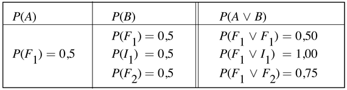

<?xml version="1.0" encoding="UTF-8" standalone="no"?>

<html xmlns="http://www.w3.org/1999/xhtml"><head><meta name="generator" content="DocBook XSL Stylesheets V1.76.1"/></head><body>

<h1 class="title"><a id="id684165"/>Egyéb módszerek a bizonytalan környezetben történő következtetéshez</h1>

Más tudományágak (például fizika, genetika, közgazdaságtan) régóta a valószínűségszámítást részesítették előnyben a bizonytalanság modellezésére.[<a id="id684172" href="#ftn.id684172" class="footnote">154</a>] Pierre Laplace 1819-es megfogalmazásában „A valószínűség-számítás semmi egyéb, mint a józan ész számokban megfogalmazva”. James Maxwell 1850-ben tett kijelentése szerint „a világ igazi logikája a valószínűségek kalkulusa, ami figyelembe veszi a valószínűség nagyságát, ahogy azt minden gondolkodó ember megteszi vagy meg kellene tennie”.

Ezt a régi tradíciót látva talán meglepő, hogy az MI a valószínűség-számítás helyett számos alternatívával kísérletezett. Az 1970-es évekbeli első szakértői rendszerek teljesen figyelmen kívül hagyták a bizonytalanságot, és szigorúan logikai következtetést használtak, de hamar kiderült, hogy ez a legtöbb valós problémánál nem alkalmazható. A szakértői rendszerek következő generációja (különösen az orvosi tárgytartományokban) valószínűségi technikákat használt. A kezdeti eredmények biztatók voltak, de nem voltak skálázhatók nagyobb problémákra a teljes együttes valószínűség-eloszlás megadásához szükséges exponenciális számú érték miatt. (Hatékony Bayes-hálós algoritmusok ekkor még nem voltak ismertek.) Ennek eredményeképpen a valószínűségi megközelítések elvesztették vonzerejüket 1975 és 1988 között, és számos egyéb alternatívát próbáltak ki:

<ul class="itemizedlist"><li class="listitem">
Egy elterjedt nézet szerint a valószínűség-számítás alapvetően numerikus jellegű, míg az emberi ítélethozatal sokkal „kvalitatívabb”. Az bizonyos, hogy nem vagyunk tudatában, hogy különböző fokú bizonyossággal végzünk numerikus számításokat. (Ahogyan a logikai egyesítés elvégzésének sem vagyunk tudatában, mégis úgy tűnik, hogy képesek vagyunk valamilyenfajta logikai érvelésre.) Lehetséges, hogy a bizonyosság valamilyen numerikus fokát közvetlenül tárolják az idegsejtek kapcsolatainak és aktivációinak erősségei. Ebben az esetben ezen erősségek tudatos elérésének a nehézsége nem meglepő. Azt is el kell ismerni, hogy a kvalitatív következtetési mechanizmus a valószínűség-számítási alapokra is felépíthető, így a „nincsenek számok” érv a valószínűségek ellen nem meggyőző. Mindazonáltal néhány kvalitatív módszer igen hasznosnak tűnhet a sajátos tulajdonságaik miatt. Az egyik legjobban tanulmányozott módszer az <strong>alapértelmezéseken alapuló következtetés</strong> (<strong>default reasoning</strong>), ami nem úgy kezeli a következtetetéseket, mint amikben „bizonyos fokig hiszünk”, hanem mint „amikben addig hiszünk, amíg nincs jobb indok valami mást hinni”. Az alapértelmezéseken alapuló következtetés a 10. fejezetben szerepel.
</li><li class="listitem">
<strong>Szabályalapú</strong> (<strong>rule-based</strong>) megközelítésekkel is megpróbáltak bizonytalanságot kezelni. Ezek a módszerek a logikai szabályrendszerek sikereit akarták felhasználni, de hozzáadva minden szabályhoz valamilyen „kiagyalt” <em>ad hoc </em>tényezőt, ami a bizonytalanságot kezeli. Ezeket az eljárásokat az 1970-es évek közepén fejlesztették ki, és igen nagy számú szakértői rendszer alapjául szolgáltak, különösen orvosi és egyéb területeken.
</li><li class="listitem">
Az <strong>ismerethiány</strong> (<strong>ignorance</strong>) (ami a bizonytalansággal bizonyos értelemben szembeállítható) kérdéseit eddig még nem érintettük. Fontoljuk meg egy érme feldobását. Ha tudjuk, hogy az érme szabályos, akkor ésszerűnek tűnik, hogy a fej valószínűsége 0,5. Ha tudjuk, hogy az érme szabálytalan, de nem tudjuk, milyen módon, akkor 0,5 az egyetlen ésszerűnek tűnő valószínűség. Nyilvánvaló, hogy a két eset különböző, de a valószínűségük láthatóan nem különbözteti meg őket. A <strong>Dempster– </strong><strong>Shafer-elmélet </strong>(<strong>Dempster–Shafer theory</strong>)<strong> intervallumérték</strong>eket (<strong>interval-valued</strong>) használ a bizonyosság fokozataira, így reprezentálja az ágens tudását egy állítás valószínűségéről. Más, másodrendű valószínűségeket használó módszereket is tárgyalunk majd.
</li><li class="listitem">
A valószínűség-számítás ugyanazt a lételméleti feltevést használja, mint a logika: az események vagy igazak, vagy hamisak a világban, még ha az ágens bizonytalan is, melyik is áll fenn. A <strong>fuzzy logika</strong> (<strong>fuzzy logic</strong>) kutatói egy másik ontológiát javasoltak, ami megengedi a <strong>meghatározatlanság</strong>ot (<strong>vagueness</strong>) is: azt, hogy egy esemény lehet „valamennyire” igaz. A meghatározatlanság és a bizonytalanság valójában ortogonális témakörök, ahogy azt látni fogjuk.
</li></ul>

A következő három alfejezet ezen megközelítések mindegyikét egy kicsit részletesebben mutatja be. Nem tartalmaznak részletes technikai leírásokat, de a megadott hivatkozások segítséget nyújtanak további részletek eléréséhez.

<h2 class="title"><a id="id684278"/>Bizonytalansági következtetés szabályalapú eljárásokkal</h2>

A szabályalapú rendszerek a logikai következtés gyakorlati és szemléletes rendszerein való korai munkákból alakultak ki. A logikai rendszerek általában, és a logikai szabályalapú rendszerek speciálisan, rendelkeznek az alábbi három tulajdonsággal:

<ul class="itemizedlist"><li class="listitem">
<strong>Lokalitás</strong> (<strong>locality</strong>): logikai rendszerekben, ha van <em>A</em> ⇒ <em>B</em> formájú szabály, akkor a <em>B</em> kikövetkeztethető, ha az <em>A</em> bizonyíték adott, <em>bármely más szabályra való tekintet nélkül</em>. Valószínűségi rendszerekben a Markov-takaróban rendelkezésre álló <em>összes</em> tényt figyelembe kell venni.
</li><li class="listitem">
<strong>Leválasztás</strong> (<strong>detachment</strong>): ha egyszer találtunk egy logikai bizonyítást <em>B</em> állítás kikövetkeztetéséhez, az állítást tetszés szerint felhasználhatjuk, a származtatásától függetlenül. Vagyis <strong>leválasztható</strong> (<strong>detached</strong>) a megokolásaitól. Valószínűségek esetén azonban a bizonyosság bizonyítékának a forrása fontos az elkövetkező következtetésekben.
</li><li class="listitem">
<strong>Igazságfüggvény</strong> (<strong>truth-functionality</strong>): a logikában az összetett kifejezések igazságértéke kiszámítható az alkotóinak igazságértékéből. Valószínűségek kombinálása nem lehetséges ezen a módon, csak szigorú, teljes függetlenségi feltételezések mellett.
</li></ul>

Számos kísérlet történt olyan bizonytalansági következtetések kifejlesztésére, ahol ezek az előnyös tulajdonságok megmaradnak. Az elképzelés szerint a bizonyosság mértékét hozzárendeljük állításokhoz és szabályokhoz, és kifejlesztünk tisztán lokális sémákat a bizonyosságmértékek kombinálására és terjesztésére. A sémák egyben igazságfüggvények, például az <em>A</em> ∨ <em>B</em> bizonyosságmértéke, az <em>A-</em> és <em>B</em>-beli bizonyosságok függvénye.

<h3 class="title">Fontos</h3>
A rossz hír a szabályalapú rendszerek számára, hogy a <em>lokalitás, a leválasztás és az igazságfüggvény egyszerűen nem alkalmas a bizonytalansági következtetés számára. </em>Vizsgáljuk először az igazságfüggvényt. Legyen <em>F</em>1 az az esemény, hogy fejet kapunk egy szabályos érme feldobásakor, legyen <em>I</em>1 az az esemény, hogy ugyanekkor írást kapunk, és legyen <em>F</em>2 az az esemény, hogy fejet kapunk egy szabályos érme második feldobásakor. Világos, hogy mindhárom esemény valószínűsége 0,5, és egy igazságtartó rendszernek ugyanazt az értéket kell hozzárendelnie bármely kettő konjunkciójához. De láthatjuk, hogy a konjunkció valószínűsége függ maguktól az eseményektől is, nem csak a valószínűségektől.

A helyzet még rosszabb, ha bizonyításokat láncolunk. Az igazságfüggvényeken alapuló rendszerekben léteznek <em>A </em>↦ <em>B</em> alakú <strong>szabály</strong>ok (<strong>rule</strong>s), amelyek lehetővé teszik, hogy kiszámítsuk <em>B</em>-beli bizonyosságunk értékét, mint annak függvényét, hogy mennyire hiszünk a szabályban, és mennyire hiszünk <em>A</em>-ban. Ekkor természetesen mind előre-, mind hátrahaladó rendszereket is ki lehet fejleszteni. A szabálybeli bizonyosságunkat konstansnak tételezzük fel, amit általában a tudásmérnök határoz meg, például <em>A</em>↦0,9 <em>B</em>.

Gondoljuk a 14.11. (a) ábrán látható vizes-pázsit szituációra. Ha képesek szeretnénk lenni mind okozati, mind diagnosztikai következtetés elvégzésére, a két alábbi szabályra lesz szükségünk:

<code class="code"><em>Eső</em> ↦<em>VizesPázsit</em>	és	<em>VizesPázsit </em>↦ <em>Eső</em></code>

Ha nem vigyázunk, ez a két szabály visszacsatolásos módon fog működni úgy, hogy az <em>Eső</em>-re vonatkozó bizonyíték megnöveli a <em>VizesPázsit</em>-hoz tartozó bizonyosságot, ami viszont még inkább megnöveli az <em>Eső</em>-höz tartozó bizonyosságot. Nyilvánvaló, hogy bizonytalansági következtető rendszereknek nyilván kell tartaniuk, hogy milyen utakon terjedt a bizonyíték.

Az okok közötti következtetés (vagy kimagyarázás) szintén bonyodalmas. Gondoljuk meg, mi is történik, ha a következő két szabályunk van:

<code class="code"><em>Locsoló </em>↦ <em>VizesPázsit</em>	és	<em>VizesPázsit </em>↦ <em>Eső</em></code>

Tételezzük fel, hogy látjuk a locsolót bekapcsolva. Előreláncolással a szabályainkon keresztül ez megnöveli azt a bizonyosságot, hogy a pázsit vizes, ami viszont megnöveli az esőhöz tartozó bizonyosságot. De ez képtelenség: a locsoló bekapcsolt állapota megmagyarázza a pázsit vizességét, így <em>csökkentenie </em>kell az esőhöz tartozó bizonyosságot. Egy igazságfüggvényen alapuló rendszer úgy viselkedik, mintha a <em>Locsoló</em>↦<em>Eső</em> szabályban is hinne.

Ezen nehézségek mellett hogyan lehetséges, hogy az igazságfüggvényen alapuló rendszereket valaha is hasznosnak tartották? A megoldás abban rejlik, hogy korlátozták a feladatokat körét, és a szabálybázist gondosan úgy tervezték meg, hogy nemkívánatos kölcsönhatások ne következzenek be. A leghíresebb igazságfüggvényen alapuló rendszer bizonytalansági következtetésre a <strong>bizonyossági tényező</strong> (<strong>certainty factor</strong>) modell, amit a <code class="code">MYCIN</code> orvosi diagnosztikai program számára fejlesztettek ki, és széles körben használták szakértői rendszerekben az 1970-es és az 1980-as években. A bizonyossági tényezők majdnem minden alkalmazása vagy tisztán diagnosztikai (mint a <code class="code">MYCIN</code>), vagy tisztán okozati szabálybázist tartalmazott. Továbbá a tények csak a szabálybázis „gyökereinél” léptek be, és a legtöbb szabálybázis egyszeresen összekötött volt. Heckerman megmutatta, hogy ezen feltételek mellett a bizonyossági tényezőkön alapuló következtetés kicsit eltérő változata ekvivalens a polifabeli Bayes-következtetéssel (Heckerman, 1986). Más körülmények között, a bizonyossági tényezők katasztrofálisan helytelen bizonyosságot eredményezhetnek a tények túlzott figyelembevétele miatt. Amint a szabályhalmaz naggyá válik, a szabályok között a nemkívánatos interakciók egyre gyakoribbak, és a felhasználók azt találták, hogy számos szabálynak kell „hangolni” a bizonyossági faktorát, amikor új szabályokkal bővítenek. Szükségtelen mondani, hogy ez a megközelítés már nem ajánlott.

<h2 class="title"><a id="id684531"/>Az ismerethiány reprezentálása: a Dempster–Shafer-elmélet</h2>

A <strong>Dempster–Shafer-elmélet</strong>et (<strong>Dempster–Shafer theory</strong>) azzal a céllal hozták létre, hogy megkülönböztethetővé váljon a <strong>bizonytalanság</strong> (<strong>uncertainty</strong>) és az<strong> ismerethiány</strong> (<strong>ignorance</strong>). Ez az elmélet egy állításnak nem a valószínűségét számítja ki, hanem helyette azt, hogy mennyi annak a valószínűsége, hogy a bizonyíték támogatja az állítást. A bizonyosságnak ezt a mértékét <strong>bizonyosságfüggvény</strong>nek (<strong>belief function</strong>) nevezik, és <em>Bel</em>(<em>X</em>)-szel jelölik.

Most visszatérünk a pénzérmés példánkhoz, a bizonyosságfüggvény bemutatásához. Tételezzük fel, hogy egy rossz kinézetű alak odamegy önhöz és felajánlja, hogy fogadjon 1000 forintba, hogy a következő esetben fej lesz az eredmény. Mivel az érme lehet szabályos, de lehet szabálytalan is, milyen bizonyosságot kell ahhoz az eseményhez rendelni, hogy a következő eredmény fej lesz? A Dempster–Shafer-elmélet szerint mivel nincs bizonyíték egyik esetre sem, így azt kell mondani, hogy a bizonyosság <em>Bel</em>(<em>Fej</em>) = 0 és <em>Bel</em>(¬<em>Fej</em>) = 0. Ez szkeptikussá teszi a Dempster–Shafer-elméletet használó következtető rendszereket, aminek van egy intuitív vonzereje. Most tegyük fel, hogy rendelkezésre áll egy szakértő, aki 90%-os bizonyossággal tanúsítja, hogy az érme szabályos (azaz 90%-ban biztos, hogy <em>P</em>(<em>Fej</em>) = 0,5). Ekkor a Dempster–Shafer-elmélet azt adja, hogy <em>Bel</em>(<em>Fej</em>) = 0,9 × 0,5 = 0,45, és hasonlóan<em> Bel</em>(¬<em>Fej</em>) = 0,9 × 0,5 = 0,45. Ekkor még mindig 10% az a „hiány”, amit a tényeink nem fednek le. „Dempster szabálya” (Dempster, 1968) megmutatja, hogy hogyan kombináljunk tényeket, hogy új <em>Bel</em> értéket kapjunk, Shafer munkája pedig ezt egy teljes számítási modellként fogalmazta meg.

Mint az alapértelmezéses következtetésnél, itt is probléma a bizonyosság és a cselekvések összekapcsolása. Valószínűségek esetén a döntéselmélet szerint, ha <em>P</em>(<em>Fej</em>) = 0,5 és <em>P</em>(¬<em>Fej</em>) = 0,5, akkor (feltéve, hogy nyerni és veszteni 1000 forintot pontosan egymás ellentettjei) a következtető számára közömbös lesz a tét elfogadása vagy elutasítása. Egy Dempster–Shafer-következtető esetén <em>Bel</em>(¬<em>Fej</em>) = 0, és így nincs oka elfogadni, de ugyanakkor <em>Bel</em>(<em>Fej</em>) = 0, és így nincs oka vonakodni sem. Így látható, hogy ebben az esetben a Dempster–Shafer-következtető ugyanarra a következtetésre jutott, hogy hogyan cselekedjen. Sajnos a Dempster–Shafer-elmélet számos más esetben is megenged nem definiált döntéseket, amikor a valószínűségi következtetés konkrét választást eredményez. Valójában a hasznosság fogalma a Dempster–Shafer-modellben még nem kellően tisztázott.

Dempster–Shafer-elmélet egyik értelmezése, hogy egy valószínűségi intervallumot definiál – az intervallum a <em>Fej </em>esetén<em> </em>a szakértő tanúságtétele előtt [0, 1], míg utána [0,45, 0,55]. Az intervallum nagysága hasznos segítséget adhat annak megítélésében, hogy mikor van szükségünk további tényekre: elárulhatja, hogy a szakértő tanúságtétele akkor fog segíteni, ha nem tudjuk, hogy szabályos-e az érme, de nem fog segíteni, ha már tudjuk, hogy az érme szabályos. Azonban nincsenek világos irányelvek ennek megtételére vonatkozóan, mivel nincs világos értelmezés arra, hogy mit is jelent az intervallum szélessége. A Bayes-megközelítésben ez a fajta következtetés könnyen elvégezhető, ha megvizsgáljuk azt, hogy újabb tények begyűjtésével hogyan változna egy bizonyosság. Például a fejek megjelenésével kapcsolatos bizonyosságunkat jelentősen befolyásolná, ha tudjuk, hogy az érme szabályos, és aszimmetrikus súly észrevétele jelentősen befolyásolná azon bizonyosságunkat, hogy az érme szabályos. Egy teljes Bayes-modell magában foglalna ehhez hasonló tényezőkre vonatkozó valószínűségi becsléseket is, megengedve, hogy a „tudatlanságunkat” bizonyosságaink azon megváltozásának mértékével fejezzük ki, amelyek jövőbeli megfigyelések esetén következnének be.

<h2 class="title"><a id="id684668"/>A meghatározatlanság reprezentálása: fuzzy halmazok és logikák</h2>

<h3 class="title">Fontos</h3>
A <strong>fuzzy halmazok elmélete</strong> (<strong>fuzzy set theory</strong>) egy eszköz annak specifikálására, hogy egy objektum milyen mértékben illeszkedik egy bizonytalan leíráshoz. Például fontoljuk meg azt az állítást, hogy „Nóri magas”. Igaz ez akkor, ha Nóri 175 cm magas? A legtöbb ember vonakodna „igent” vagy „nemet” mondani, és inkább azt választaná, hogy „olyasmi”. Látható, hogy ez nem egy külső világra vonatkozó bizonytalanság – mi biztosak vagyunk Nóri magasságában. A probléma az, hogy a „magas” nyelvi kifejezés nem az objektumok éles kettéosztását jelenti – a magasságnak <em>fokozatai</em> vannak. Ezért <em>a legtöbb szerző szerint a fuzzy halmazelmélet egyáltalán nem használható bizonytalansági következtetésekre.</em> Ehelyett a fuzzy halmazelmélet a <em>MagasSzemély</em>-t egy fuzzy predikátumnak tekinti, aminek az igazságértéke inkább egy 0 és 1 közötti érték, mint hogy <em>igaz</em> vagy <em>hamis </em>lenne. A „fuzzy halmaz” név a predikátum értelmezéséből származik, ahogyan implicite definiálja a halmaz tagjait – egy halmazt, aminek nincsenek éles határai.

A <strong>fuzzy logika</strong> (<strong>fuzzy logic</strong>) egy eljárás olyan logikai kifejezésekkel való következtetésre, amelyek fuzzy halmazbeli tagsági állításokat írnak le. Például annak az összetett kifejezésnek, hogy <em>MagasSzemély</em>(<em>Nóri</em>) ∨ <em>Nehéz</em>(<em>Nóri</em>) van fuzzy igazságértéke, ami a kifejezésben lévő komponensek igazságértékeinek a függvénye. Egy összetett kifejezés <em>T</em> fuzzy igazságértékének a kiértékelésére a következő alapvető szabályok szolgálnak:

<code class="code"><em>	T</em>(<em>A</em> ∧ <em>B</em>)	=	min(<em>T</em>(<em>A</em>), <em>T</em>(<em>B</em>))</code>

<code class="code"><em>	T</em>(<em>A</em> ∨ <em>B</em>)	=	max(<em>T</em>(<em>A</em>), <em>T</em>(<em>B</em>))</code>

<code class="code"><em>	T</em>(¬<em>A</em>)	=	1 – <em>T</em>(<em>A</em>)</code>

A fuzzy logika tehát egy igazságfüggvényen alapuló rendszer, és ez komoly nehézségeket okoz. Tegyük fel például, hogy <em>T</em>(<em>MagasSzemély</em>(<em>Nóri</em>)) = 0,6 és <em>T</em>(<em>Nehéz</em>(<em>Nóri</em>)) = 0,4. Ekkor azt kapjuk, hogy <em>T</em>(<em>MagasSzemély</em>(<em>Nóri</em>) ∧ <em>Nehéz</em>(<em>Nóri</em>)) = 0,4, ami elfogadhatónak tűnik, de az is adódik, hogy <em>T</em>(<em>MagasSzemély</em>(<em>Nóri</em>) ∧ ¬<em>MagasSzemély</em>(<em>Nóri</em>)) = 0,4, ami már nem. Világos, hogy a probléma amiatt lép fel, hogy az igazságfüggvényen alapuló megközelítés nem képes kezelni a pozitív és negatív korrelációkat az állítás részei között.

A <strong>fuzzy szabályozás</strong> (<strong>fuzzy control</strong>) egy metodológia olyan szabályozási rendszerek alkotására, amelyekben a valós értékű bemenetek leképezését a kimeneti paraméterekre fuzzy szabályok reprezentálják. A fuzzy szabályozás nagyon sikeresnek bizonyult olyan kereskedelmi termékekben, mint az automatikus sebességváltók, a videokamerák és a villanyborotvák. A kritikusok [lásd például (Elkan, 1993)] úgy érveltek, hogy ezek az alkalmazások azért sikeresek, mert kicsi a szabálybázisuk, nem végeznek többlépéses következtetést, és hangolható paramétereik vannak, amelyek állításával a rendszer teljesítménye javítható. Az a tény, hogy fuzzy műveleteket használnak, mellékes a sikereik szempontjából; a magyarázat egyszerűen az, hogy egy tömör és szemléletes módszert biztosítanak egyenletesen interpoláló, valós értékű függvények megadására.

Voltak arra irányuló kísérletek, hogy a fuzzy logikát a valószínűség-számítás keretein belül értelmezzék. Az egyik elgondolás az, hogy az olyan kijelentéseket, mint „Nóri magas” úgy fogjuk fel, mint egy folytonos rejtett változó, Nóri valódi <em>Magasság</em>-ának diszkrét megfigyeléseit. A valószínűségi modell meghatározza a <em>P</em>(„Megfigyelő állítja, hogy Nóri magas”∣<em>Magasság</em>) valószínűséget, például az <a class="xref" href="ch14s03.md#ID_591_oldal">„Bayes-hálók folytonos változókkal”</a> részben leírt <strong>probit eloszlás</strong> (<strong>probit distribution</strong>) felhasználásával. Ekkor az a posteriori eloszlás Nóri magassága felett a megszokott módon számolható ki, például ha a modell része egy hibrid Bayes-hálónak. Egy ilyen megközelítés természetesen nem igazságfüggvényen alapuló. Például a feltételes eloszlás

<code class="code"><em>P</em>(„Megfigyelő állítja, hogy Nóri magas”∣<em>Magasság</em>,<em> Súly</em>)</code>

kapcsolatot enged meg a magasság és a súly között, ahogyan a megfigyelést okozzák. Így nagyon valószínűtlen, hogy valakit, aki két és fél méter magas és kilencven kilogramm, „magas és nehéz”-nek nevezzünk, bár a „két és fél méter” „magas”-nak és a „kilencven kilogramm” „nehéz”-nek minősül.

A fuzzy predikátumoknak szintén adható egy valószínűségi értelmezés a <strong>valószínűségi </strong><strong>halmaz</strong>okat (<strong>random set</strong>s) felhasználva – azaz olyan valószínűségi változókat, amiknek lehetséges értékei objektumok halmazai. Például a <em>MagasSzemély</em> egy valószínűségi halmaz, amelynek lehetséges értékei emberek halmazai. A <em>P</em>(<em>Magas</em> = <em>S</em>1)<em> </em>valószínűség, ahol <em>S</em>1<em> </em>az embereknek valamely konkrét halmaza, annak a valószínűsége, hogy pontosan ezt a halmazt minősítené „magas”-nak a megfigyelő. Ekkor a „Nóri magas” valószínűsége minden olyan halmaz valószínűségének az összege, amelyben Nóri elemként jelen van.

Mind a hibrid Bayes-hálós megközelítés, mind a valószínűségi halmaz megközelítés úgy tűnik, hogy modellezi a meghatározatlanság egyes vetületeit bizonyosságok felhasználása nélkül. Mindazonáltal számos megválaszolatlan kérdés van a nyelvi megfigyelések és folytonos mennyiségek helyes reprezentációjával kapcsolatban, amely kérdésekkel a fuzzy kutatói közösségen kívül a többség nem foglalkozik.

 

[<a id="ftn.id684172" href="#id684172" class="para">154</a>]  A bizonytalan ismereteket és/vagy bizonytalan következtési formákat tartalmazó következtetéseket a továbbiakban egységesen „bizonytalansági következtetéseknek” nevezzük. (<em>A ford.</em>)

</body></html>
