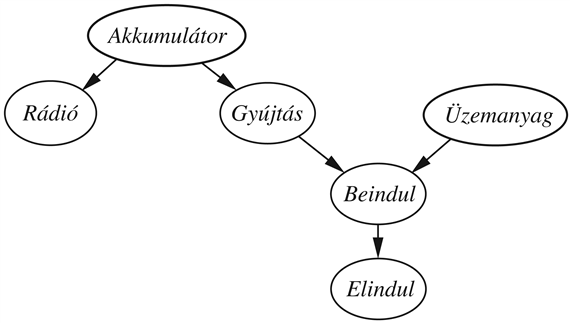

<?xml version="1.0" encoding="UTF-8" standalone="no"?>
<!DOCTYPE html PUBLIC "-//W3C//DTD XHTML 1.1//EN" "http://www.w3.org/TR/xhtml11/DTD/xhtml11.dtd">
<html xmlns="http://www.w3.org/1999/xhtml"><head><meta name="generator" content="DocBook XSL Stylesheets V1.76.1"/></head><body>

<h1 class="title"><a id="id684967"/>Összefoglalás</h1>

Ez a fejezet a <strong>Bayes-háló</strong>kat (<strong>Bayesian network</strong>s) mutatta be, amelyek egy jól kidolgozott reprezentációt jelentenek a bizonytalan tudás számára. A Bayes-hálók nagyjából hasonló szerepet töltenek be, mint amit az ítéletlogika a biztos tudás számára.

<ul class="itemizedlist"><li class="listitem">
A Bayes-háló egy irányított körmentes gráf, aminek csomópontjai valószínűségi változókhoz tartoznak; minden csomóponthoz tartozik egy feltételes eloszlás, ahol a feltételt a csomópont szülei jelentik.
</li><li class="listitem">
A Bayes-hálók tömör módot adnak a tárgyterület <strong>feltételes függetlenség</strong>i (<strong>conditional independence</strong>) kapcsolatainak a reprezentálására.
</li><li class="listitem">
Egy Bayes-háló egy teljes együttes eloszlást specifikál; egy együttes bejegyzést a megfelelő lokális feltételes eloszlásokbeli bejegyzések szorzata határoz meg. Egy Bayes-háló gyakran exponenciálisan kisebb méretű, mint a teljes együttes eloszlás.
</li><li class="listitem">
Számos feltételes eloszlást lehet tömören reprezentálni eloszlások kanonikus családjaival. A <strong>hibrid Bayes-háló</strong>k<strong> </strong>(<strong>hybrid Bayesian network</strong>s), amelyek mind diszkrét, mind folytonos változókat tartalmaznak, sokféle kanonikus eloszlást használnak.
</li><li class="listitem">
A következtetés Bayes-hálókban a célváltozók egy halmaza valószínűség-eloszlásának kiszámítását jelenti, feltéve a tényváltozók egy halmazát. Az egzakt következtetési algoritmusok, mint a <strong>változó eliminálás</strong> (<strong>variable elimination</strong>) feltételes valószínűségek szorzatainak összegét értékelik, amilyen hatékonyan csak lehet.
</li><li class="listitem">
<strong>Polifá</strong>kban<strong> </strong>(<strong>polytree</strong>s) (egyszeresen összekötött hálókban) az egzakt következtetés számítási ideje a háló méretével lineárisan nő. Általános esetben a probléma kezelhetetlen.
</li><li class="listitem">
Sztochasztikus közelítő számítási technikák, mint a <strong>valószínűségi súlyozás</strong> (<strong>likelihood weighting</strong>) és a <strong>Markov lánc Monte Carlo</strong> (<strong>Markov chain Monte Carlo</strong>) módszerek elfogadható becsléseket adnak a hálóbeli valódi a posteriori valószínűségekre, és sokkal nagyobb hálókkal is megbirkóznak, mint az egzakt algoritmusok.
</li><li class="listitem">
A valószínűség-számítás kombinálható az elsőrendű logikából vett reprezentációs ötletekkel, hogy nagyon hatékony rendszereket hozzunk létre bizonytalanság esetén történő következtetéshez. A relációs valószínűségi modellek (RVM-ek) eleget tesznek olyan reprezentációs megkötéseknek, amelyek egy olyan jól definiált valószínűség eloszlást garantálnak, amely egy ekvivalens Bayes-hálóval kifejezhető.
</li><li class="listitem">
Számos egyéb rendszert is javasoltak a bizonytalanság esetén történő következtetéshez. Nagy általánosságban azt lehet mondani, hogy az <strong>igazságfüggvény</strong>en (<strong>truth-functional</strong>) alapuló rendszerek az ilyen érveléshez nem a legmegfelelőbb eszközök.
</li></ul>

<h2 class="title"><a id="id685096"/>Irodalmi és történeti megjegyzések</h2>

A hálók felhasználása valószínűségi információk reprezentálására Sewall Wright munkájával kezdődött el a 20. század elején a genetikai öröklődés analízisével és az állatok növekedési tényezőivel kapcsolatban (Wright, 1921; 1934). Az ő hálóinak egyike látszik ennek a könyvnek a borítóján. I. J. Good, Alan Turinggal együttműködve, olyan valószínűségi reprezentációkat és Bayes következtetési módszereket fejlesztett ki, amelyeket a modern Bayes-hálók előfutárának lehet tekinteni – bár a cikkre nem hivatkoznak gyakran ebben a kontextusban (Good, 1961).[<a id="id685103" href="#ftn.id685103" class="footnote">155</a>] Ugyanez a cikk az eredeti forrása a zajos-VAGY modellnek.

A döntési problémák <strong>hatásdiagram</strong> (<strong>influence diagram</strong>) reprezentációját – ami a valószínűségi változók reprezentációjához egy irányított körmentes gráfot tartalmazott – döntéselemzések során használták az 1970-es évek vége felé (lásd 16. fejezet), de a kiértékelésre csak felsorolást használtak. Judea Pearl fejlesztette ki az üzenetváltó eljárást, a fa hálókban (Pearl, 1982a) és az egyszeresen összekötött (polifa) hálókban (Kim és Pearl, 1983) történő következtetésre, és szemben az akkor népszerű bizonyossági tényezős rendszerekkel, a diagnosztikai helyett a kazuális valószínűségi modellek létrehozásának fontossága mellett érvelt. Az első szakértői rendszer, ami Bayes-hálókat használt, a <code class="code">CONVINCE</code> volt (Kim, 1983; Kim és Pearl, 1987). A későbbi rendszerek között találjuk a mozgatóidegekkel kapcsolatos rendellenességek diagnosztizálására szolgáló <code class="code">MUNIN</code> (Andersen és társai, 1989) és a patológiás helyzetek felderítésére szolgáló <code class="code">PATHFINDER</code> rendszert (Heckerman, 1991). Messze a legtöbbet használt Bayes-hálós rendszerek a Microsoft Windows diagnóziskijavítás moduljai (például a Nyomtató varázsló) (Breese és Heckerman, 1996) és az Office segéd a Microsoft Office-ban (Horvitz és társai, 1998).

Általános Bayes-hálókban történő egzakt következtetésre Pearl fejlesztett ki egy csoportosításon alapuló algoritmust, felhasználva egy konverziót változók csoportjai feletti irányított polifába, amelyben üzenetváltások biztosítják a csoportok közös változói feletti konzisztenciát. Egy hasonló módszer, amit David Spiegelhalter és Steffen Lauritzen fejlesztett ki (Spiegelhalter, 1986; Lauritzen és Spiegelhalter, 1988), egy irányítatlan Markov-hálóba vivő konverzión alapul. Az eljárást a <code class="code">HUGIN</code> rendszerben valósították meg, ami egy hatékony és széles körben használt eszköz a bizonytalansági következtetések esetén (Andersen és társai, 1989). Ross Shachter, a hatásdiagramok kutatói közösségéből, egy egzakt módszert fejlesztett ki, ami a háló célirányos csökkentésén alapul a posteriori megőrző átalakításokat felhasználva.

A fejezetben leírt változó eliminációs módszer Shachter módszeréhez áll legközelebb, amiből a szimbolikus valószínűségi következtetés (SzVK) módszere alakult ki (Shachter, 1990). Az SzVK megkísérli optimalizálni az olyan kifejezési fák kiértékelését, mint amilyen a 14.8. ábrán<em> </em>látható. Az általunk ismertetett algoritmus a Zhang és Poole által kifejlesztetthez áll a legközelebb (Zhang és Poole, 1994; 1996). Irreleváns változók eltávolítására szolgáló kritériumokat Geiger és társai, illetve Lauritzen és társai fejlesztettek ki (Geiger és társai, 1990; Lauritzen és társai, 1990); az általunk megadott kritérium ezeknek egy egyszerű speciális esete. Rina Dechter (Dechter, 1999) mutatta meg, hogy a változó eliminálás ötlete lényegében megegyezik a <strong>nem folytatólagos dinamikus programozás</strong>sal (<strong>nonserial dynamic programming</strong>) (Bertele és Brioschi, 1972). Ez egy algoritmikus megközelítés, amit Bayes-hálókban előálló következtetési problémák széles körére lehet sikerrel alkalmazni. Ilyen probléma például megfigyelések egy adott halmazához a legvalószínűbb magyarázat megkeresése. Ez összekapcsolja a Bayes-hálós algoritmusokat a kényszerkielégítési problémákat megoldó kapcsolódó módszerekkel, és közvetlen módszereket szolgáltat az egzakt következtetés komplexitására a háló hiperfájának a szélessége alapján.

Folytonos valószínűségi változók jelenlétét Bayes-hálókban Pearl, illetve Shachter és Kenley vizsgálta (Pearl, 1988; Shachter és Kenley, 1989); ezek a cikkek kizárólag folytonos változókat tartalmazó hálókat tárgyaltak, amelyek lokális függési modelljei lineáris normális eloszlásúak. Diszkrét változók bevezetését Lauritzen és Wermuth vizsgálta (Lauritzen és Wermuth, 1989), amit a cHUGIN rendszerben meg is valósítottak (Olesen, 1993). A probit eloszlást először Finney vizsgálta (Finney, 1947), szigmoid eloszlásnak nevezve. Az eloszlást széles körben használják diszkrét választási jelenségek modellezésére, és kiterjeszthető több mint két választási lehetőség kezelésére (Daganzo, 1979). A logit eloszlás használatához Bishop ad indoklást (Bishop, 1995).

Cooper mutatta meg, hogy a következtetés általános problémája tetszőleges Bayes-hálóban NP-teljes (Cooper, 1990), Paule Dagum és Mike Luby pedig azt, hogy ennek a közelítő megoldása is NP-teljes (Dagum és Luby, 1993). A tárkomplexitás szintén komoly probléma mind a csoportosító, mind a változó eliminációs módszereknél. A <strong>vágóhalmaz feltételezés</strong>eken (<strong>cutset conditioning</strong>) alapuló eljárás, amit a kényszerkielégítési problémákra az 5. fejezetben mutattunk be, elkerüli az exponenciális méretű táblák létrehozását. Egy Bayes-hálóban a vágóhalmaz a csomópontok azon halmaza, amelyek értékeinek rögzítése esetén a fennmaradó csomópontok függései egy fagráfra egyszerűsödnek, ami már lineáris időben és térben megoldható. A lekérdezést összegzéssel adhatjuk meg a vágóhalmaz minden lehetséges értékadása mellett, így az összes tárigény még mindig lineáris (Pearl, 1988). Darwiche (Darwiche, 2001) egy rekurzívan feltételező algoritmust ad meg, ami tetszőleges tár/idő egyensúlyt tesz lehetővé.

Gyors közelítő algoritmusok Bayes-hálókra való kifejlesztése nagyon aktív terület, a statisztika, a számításelmélet és a fizika határterületén. Az elutasító mintavételezés módszere egy általános, a statisztikában régóta ismert technika; Bayes-hálóknál Max Henrion alkalmazta először, aki <strong>logikai mintavételezés</strong>nek (<strong>logic sampling</strong>) nevezte (Henrion, 1988). A valószínűségi súlyozás, amit Fung és Chang (Fung és Chang, 1989), illetve Shachter és Peot fejlesztettek ki (Shachter és Peot, 1989), egy példája a <strong>fontossági mintavétel</strong> (<strong>importance sampling</strong>) jól ismert statisztikai módszerének. A valószínűségi súlyozás nagymérvű felhasználását az orvosi diagnosztikában Shwe és Cooper jelenti (Shwe és Cooper, 1991). Cheng és Druzdzel a valószínűségi súlyozás adaptív verzióját közlik (Cheng és Druzdzel, 2000), ami akkor is jól működik, ha a bizonyíték a priori valószínűsége nagyon alacsony.

A Markov lánc Monte Carlo (MCMC) módszerek a Metropolis algoritmussal kezdődtek, ami Metropolisnak köszönhető (Metropolis és társai, 1953), ami a 4. fejezetben leírt szimulált lehűtés algoritmusának szintén a forrása. A Gibbs-mintavételezőt Geman és Geman fejlesztette ki irányítatlan Markov-hálókban történő következtetésre (Geman és Geman, 1984). Az MCMC Bayes-hálókban történő alkalmazása Pearlnek köszönhető (Pearl, 1987). A Gilks és társai által összegyűjtött cikkek MCMC-alkalmazások széles skáláját ölelik fel, számos közülük a jól ismert <code class="code">BUGS</code> csomaggal lett kifejlesztve (Gilks és társai, 1996).

A közelítési módszereknek két nagyon fontos családja létezik, amelyeket nem tárgyaltunk a fejezetben. Az első család a <strong>variációs közelítés</strong> (<strong>variational approximation</strong>) módszere, ami mindenfajta komplex számítás egyszerűsítésére felhasználható. Az alapötlet az, hogy az eredeti problémának előállítjuk egy olyan redukált verzióját, ami annyira egyszerű, hogy dolgozni lehessen vele, de amennyire lehet hasonló az eredeti problémához. A redukált probléma leírása tartalmazza a <strong>λ</strong><strong> variációs paraméter</strong>eket (<strong>variational parameter</strong>s), amelyeket úgy állítunk be, hogy minimalizáljon egy <em>D </em>távolságfüggvényt az eredeti és a redukált problémák között, gyakran a ∂<em>D</em>/∂λ = 0 egyenletrendszer megoldásával. Számos esetben pontos felső és alsó korlátok kaphatók. Variációs módszereket régóta használnak a statisztikában (Rustagi, 1976). A statisztikus fizikában a <strong>mezőátlag</strong> (<strong>mean field</strong>) módszer egy speciális variációs módszer, amelyben a modellt alkotó egyes változókat teljesen függetlennek tételezzük fel. Ezt az ötletet felhasználva sikerült kezelni nagy irányítatlan Markov-hálókat (Peterson és Anderson, 1987; Parisi, 1988). A variációs módszerek Bayes-hálókra történő alkalmazásának matematikai megalapozását Saul és társai fejlesztették ki, és ők kaptak a szigmoid hálókra pontos alsó korlát közelítéseket a mezőátlag módszerrel (Saul és társai, 1996). Jaakkola és Jordan úgy terjesztették ki a módszert (Jaakkola és Jordan, 1996), hogy mind az alsó, mind a felső korlát kinyerhető legyen. A variációs módszereket Jordan tekintette át (Jordan, 1999).

A közelítő algoritmusok második családja Pearl fagráfon futó üzenetváltásos algoritmusán alapszik (Pearl, 1982a). Az algoritmust általános hálókra is lehet alkalmazni, ahogy Pearl javasolta (Pearl, 1988). Az eredmények lehetnek helytelenek, és lehet, hogy az algoritmus nem áll le, de számos esetben a szolgáltatott értékek közel vannak a helyes értékekhez. Ez az úgynevezett <strong>bizonyosságterjesztés</strong>es (<strong>belief propagation</strong>) vagy <strong>hurkos terjesztés</strong>es (<strong>loopy propagation</strong>) megközelítés kevés figyelmet kapott, mindaddig, amíg McEliece és társai fel nem figyeltek (McEliece és társai, 1998) arra, hogy az üzenetváltás többszörösen összekötött Bayes-hálókban pontosan megegyezik a <strong>turbó dekódolás</strong> (<strong>turbo decoding</strong>) algoritmus által végzett számítással (Berrou és társai, 1993), ami jelentős áttörést eredményezett a hibajavító kódok tervezésében. Ebből az a következtetés vonható le, hogy a bizonyosságterjesztés gyors is és pontos is a nagyon nagy méretű és nagyon sűrűn összekötött dekódolásra használt hálókban, és ezért lehet, hogy általánosabban is hasznos lehet. Murphy és társai egy kísérletről számoltak be, ahol ez valóban működött (Murphy és társai, 1999). Yedidia és társai további kapcsolatokra mutattak rá a bizonyosságterjesztés és a statisztikus fizika között (Yedidia és társai, 2001).

A valószínűség és az elsőrendű nyelvek közötti kapcsolatot Carnap tanulmányozta (Carnap, 1950). Gaifman, illetve Scott és Krauss megadott egy nyelvet, amelyben valószínűségeket elsőrendű mondatokhoz lehet kapcsolni, és amelyre a modellek valószínűségi mértékek voltak lehetséges világokon (Gaifman, 1964; Scott és Krauss, 1966). Az MI-n belül ezt az ötletet az ítéletlogikára Nilsson, a predikátumlogikára pedig Halpern fejlesztette ki (Nilsson, 1986; Halpern, 1990). A tudásreprezentációs kérdések első kiterjedt vizsgálatát ilyen nyelvek esetén Bacchus végezte (Bacchus, 1990), Wellman és társainak a tanulmánya a korai implementációkat tekinti át (Wellman és társai, 1992), amelyek egy ekvivalens (ítéletlogikai) Bayes-háló létrehozásán alapulnak. Napjainkra a kutatók elkezdték megérteni a <em>teljes</em> tudásbázisok fontosságát, azaz olyan tudásbázisok fontosságát, amelyek akár a Bayes-hálók, egy egyértelmű együttes eloszlást definiálnak az összes lehetséges világ felett. Az erre szolgáló eljárások a logikai programozás valószínűségi verzióin (Poole, 1993; Sato és Kameya, 1997) vagy szemantikus hálókon (Koller és Pfeffer, 1998) alapultak. A fejezetben ismertetett típusú relációs valószínűségi modelleket Pfeffer vizsgálta részletesebben (Pfeffer, 2000). Pasula és Russell mind a relációs, mind az azonossági bizonytalanságot vizsgálta az RVM-ekben és az MCMC következtetés felhasználásában (Pasula és Russell, 2001).

Amint a 13. fejezetben kifejtettük, a korai valószínűségi rendszerek kegyvesztettek lettek az 1970-es években, helyt adva az alternatív módszerek megjelenésének. A bizonyossági tényezőket a <code class="code">MYCIN</code> orvosi szakértői rendszerbeli felhasználásra fejlesztették ki (Shortliffe, 1976), amit egyrészt mérnöki megoldásnak is, másrészt az emberi ítélethozatal modelljének is javasolták, bizonytalanság esetében. A <em>Rule-Based Expert Systems</em> gyűjtemény (Buchanan és Shortliffe, 1984) teljes áttekintést ad a <code class="code">MYCIN</code>-ről és leszármazottairól (lásd még [Stefik, 1995]). David Heckerman megmutatta, hogy a bizonyossági tényezős számítások kicsit módosított verziója már helyes valószínűségeket ad bizonyos esetekben, de más esetekben a bizonyítékok hibát okozó, túlzott figyelembevételére vezet (Heckerman, 1986). A <code class="code">PROSPECTOR</code> szakértői rendszer (Duda és társai, 1979) szabályalapú megközelítést használt, amiben a szabályokat (ritkán tartható) globális függetlenségi feltételezésekkel igazolták.

A Dempster–Shafer-elmélet Arthur Dempster publikációjával kezdődött, amiben a pontszerű valószínűségi értékek általánosítását javasolta intervallumértékekre, és szabályokat javasolt a kombinálásukra (Dempster, 1968). Glenn Shafer későbbi munkája vezetett el a Dempster–Shafer-elmélet és a valószínűség-számítás egymással versengő szemléletéhez (Shafer, 1976). Ruspini a Dempster–Shafer-elmélet és a valószínűség-számítás kapcsolatát elemezte (Ruspini és társai, 1992). Shenoy a Dempster–Shafer bizonyosságfüggvény alapján egy eljárást javasolt a döntéshozatalra (Shenoy, 1989).

A fuzzy halmazokat Lotfi Zadeh dolgozta ki válaszul arra a nehézségre (Zadeh, 1965), hogy egzakt bemeneti értékeket adjunk az intelligens rendszerek számára. Zimmermann leírása (Zimmermann, 2001) részletes bevezetést nyújt a fuzzy halmazok elméletébe; a (Zimmermann, 1999) pedig fuzzy alkalmazásokról szóló cikkek gyűjteménye. Amint korábban említettük, a fuzzy logikát gyakran tekintik a valószínűség-számítás versenytársának, pedig valójában eltérő kérdésekkel foglalkozik. A <strong>lehetőségelmélet</strong>et (<strong>possibility theory</strong>) (Zadeh, 1978) a bizonytalanság kezelésére vezették be fuzzy rendszerekben, és sok közös vonása van a valószínűség-számítással. Dubois és Prade alapos áttekintést nyújt a lehetőségelmélet és a valószínűség-számítás kapcsolatáról (Dubois és Prade, 1994).

A valószínűség-számítás MI-n belüli feltámadása főként a Bayes-hálók felfedezésén múlt, ami módszert adott a feltételes függetlenségek reprezentálására és kihasználására. Ez az újjászületés igen küzdelmes volt; Peter Cheeseman harcias <em>In defense of Probability</em> (Cheeseman, 1985) és a későbbi <em>An Inquire into Computer Understanding</em> (Cheeseman, 1988, megjegyzésekkel) c. cikke ízelítőt ad a vitából. A logika művelőinek egyik legfőbb kifogása az volt, hogy a valószínűség-számítás miatt szükségesnek vélt számítások önelemzéssel nem érhetők el, és egy nem reális pontossági szintet tételeznek fel a bizonytalan tudásunkban. A <strong>kvalitatív Bayes-háló</strong>k (<strong>qualitative probabilistic network</strong>s) (Wellman, 1990a) lehetőséget adnak a Bayes-hálók tisztán kvalitatív absztrakciójára, csupán a változók közötti hatások pozitív és negatív jellegét kihasználva. Wellman megmutatta, hogy számos esetben ennyi információ is elegendő az optimális döntéshozatalhoz a valószínűségi értékek precíz meghatározása nélkül. Adnan Darwiche és Matt Ginsberg munkája kivonatolja a valószínűség-számítás elméletében szerepelő feltételesség és a tények kombinálásának alapvető tulajdonságait, és megmutatja, hogyan lehet ezeket alkalmazni logikai és alapértelmezési következtetésekben (Darwiche és Ginsberg, 1992).

A fejezetben leírt szívbetegség-kezelő rendszer Lucastól származik (Lucas, 1996). A Bayes-hálók más területen történő alkalmazásai között találjuk egyebek között a Microsoftnál végzett fejlesztéseket a felhasználó céljainak kikövetkeztetésére (Horvitz és társai, 1998) és a kéretlen elektronikus levelek szűrésére (Sahami és társai, 1998), az Electric Power Research Institute fejlesztését áramgenerátorok figyelésére és a NASA fejlesztését időkritikus információk megjelenítésére a Mission Controlnál Houstonban (Horvitz és Barry, 1995).

Az MI-n belüli bizonytalansági következtetéssel kapcsolatos számos fontos korai publikáció megtalálható a <em>Readings in Uncertain Reasoning</em> (Shafer és Pearl, 1990) és az <em>Uncertainty in Artifical Intelligence</em> (Kanal és Lemmer, 1986) antológiákban. A Bayes-hálók témakörének fejlődésében a legfontosabb egyedülálló publikáció vitathatatlanul a<em> Probabilistic Reasoning in Intelligent Systems: Networks of Plausible Inference</em> (Pearl, 1988). Több kiváló munka tartalmazza az újabb anyagokat, mint például (Lauritzen, 1996; Jensen, 2001; Jordan, 2003). A valószínűségi következtetéssel kapcsolatos új eredmények mind az MI fő irányait meghatározó főbb lapokban, mint pl. az <em>Artificial Intelligence</em>-ben, mind a specializáltabb folyóiratokban, mint amilyen az <em>International Journal of Approximate Reasoning</em> jelennek meg. A <strong>gráfos modell</strong>ekről (<strong>graphical model</strong>s), amely modellosztály magában foglalja a Bayes-hálókat is, számos cikk statisztikai újságokban jelenik meg. Az <em>Uncertainty in Artificial Intelligence</em> (UAI), a <em>Neural Information Processing Systems</em> (NIPS) és az <em>Artificial Intelligence and Statistics</em> (AISTATS) konferenciák kiadványai kiváló forrásai a legfrissebb kutatásoknak.

<a id="id687550"/>
<strong>14.18. ábra - Egy gépkocsi elektromos és motorikus rendszereinek részeit leíró Bayes-háló. Minden változó bináris, és az <em>igaz</em> érték jelzi a megfelelő funkció helyes működését.</strong>

<h2 class="title"><a id="id687563"/>Feladatok</h2>

<strong>14.1.</strong>

Tekintsük a 14.18. ábrán látható gépkocsi-diagnosztikai hálót.

<ol class="orderedlist"><li class="listitem">
Egészítse ki a hálót a <em>JegesIdő</em> és az <em>IndítóMotor </em>bináris változókkal.
</li><li class="listitem">
Adjon meg ésszerű feltételes valószínűségi táblákat az összes csomópontra.
</li><li class="listitem">
Hány független értéket tartalmaz a teljes együttes valószínűség-eloszlás függvény 8 bináris csomópont esetén, feltételezve, hogy nincs közöttük feltételes függetlenségi reláció?
</li><li class="listitem">
Hány független valószínűségi értéket tartalmaznak az ön hálójának táblázatai?
</li><li class="listitem">
A <em>Beindul</em> feltételes valószínűség eloszlása megadható egy <strong>zajos-ÉS</strong> eloszlással. Írja le ezt az eloszláscsaládot általában és kapcsolatát a zajos-VAGY eloszláshoz.
</li></ol>

<strong>14.2.</strong>

A helyi nukleáris erőműben van egy riasztó, ami érzékeli, ha a hőmérsékletmérő egy adott küszöbértéket meghalad. A mérő a reaktormag hőmérsékletét méri. Tekintse a következő bináris változókat: <em>R</em> (riasztó hangja), <em>HR</em> (hibás riasztó), <em>HM</em> (hibás mérő) és a következő többértékű változókat: <em>M</em> (mérő) és <em>H</em> (egy aktuális belső hőmérséklet).

<ol class="orderedlist"><li class="listitem">
Rajzoljon fel egy Bayes-hálót a tárgytartományra, feltételezve, hogy valószínűbb, hogy a mérő akkor hibásodik meg, ha a hőmérséklet túl magas.
</li><li class="listitem">
A hálózata polifa lett?
</li><li class="listitem">
Tételezze fel, hogy a hőmérsékletnek csak két lehetséges értéke van: normális és magas; és hogy a mérő helytelen hőmérsékletet mér az esetek <em>x</em>%-ában, ha működik, és <em>y</em>%-ában, ha hibás. Adja meg az <em>M</em> feltételes valószínűség-tábláit.
</li><li class="listitem">
Tételezze fel, hogy a riasztó tökéletesen működik, hacsak nem hibás, mely utóbbi esetben egyáltalán nem riaszt. Adja meg az <em>R</em>-hez tartozó feltételes valószínűség-táblát.
</li><li class="listitem">
Tételezze fel, hogy a mérő és a riasztó működik, és a riasztó megszólal. Fejezze ki annak a valószínűségét, hogy a reaktormag hőmérséklete magas a háló feltételes valószínűségeinek a függvényében.
</li></ol>

<strong>14.3.</strong>

Két csillagász – távcsöveiket használva – a világ különböző részein <em>M</em>1 és <em>M</em>2 méréseket végeznek az égbolt egy kis részén látható csillagok számáról (<em>Sz</em>). Általában egy kis <em>e</em> valószínűsége a hibának, ami egy csillagnyi eltérést jelent. Bármelyik távcsővel megtörténhet az is (egy sokkal kisebb <em>f</em> valószínűséggel), hogy nincs rendesen fókuszálva (<em>F</em>1 és <em>F</em>2 események), amely esetben a tudós 3 vagy több csillaggal kevesebb csillagot számlál (ha <em>Sz</em> kisebb mint 3, akkor egyetlen csillagot sem észlel). Tekintsük a 14.19. ábrán<em> </em>látható három hálót.

<ol class="orderedlist"><li class="listitem">
Melyik Bayes-háló reprezentálja helyesen (de nem feltétlenül hatékonyan) a fenti ismereteket?
</li><li class="listitem">
Melyik a legjobb háló? Adjon magyarázatot.
</li><li class="listitem">
Adjon meg egy ésszerű feltételes valószínűségi táblát a <strong>P</strong> (<em>M</em>1∣<em>Sz</em>) értékeire, amikor <em>M</em>1 ∈ {0, 1, 2, 3, 4}<em> </em>és<em> Sz </em>∈ {1, 2, 3}. A feltételes eloszlás minden értékét az <em>e</em> és az <em>f</em> paraméterek függvényében fejezze ki.
</li></ol>

<a id="id687782"/>
<strong>14.18. ábra - Három lehetséges háló a távcsőproblémára</strong>

<ol class="orderedlist"><li class="listitem">
Tételezze fel, hogy <em>M</em>1 = 1 és <em>M</em>2 = 3. Mik a csillagok lehetséges számai, ha a priori nem korlátozzuk <em>Sz</em> értékét?
</li><li class="listitem">
Mi<em> </em>a csillagok <em>legvalószínűbb </em>száma ezen megfigyelések esetén? Magyarázza el ennek kiszámítását, vagy ha nem lehetséges kiszámítani, magyarázza el, milyen további információkra van szükség, és hogy az miként befolyásolná az eredményt.
</li></ol>

<strong>14.4.</strong>

Tekintsük a 14.19. (ii) ábrán látható hálót, és tegyük fel, hogy a két teleszkóp azonosan működik. Legyen <em>M</em>1,<em> M</em>2 ∈ {0, 1, 2, 3, 4}<em> </em>és<em> Sz </em>∈ {1, 2, 3}<em> </em>a 14.3. feladatban megadott<em> </em>szimbolikus FVT-kkel. A felsoroló algoritmus felhasználásával számolja ki a következő valószínűség-eloszlást: <strong>P</strong>(<em>Sz</em>∣<em>M</em>1 = 2, <em>M</em>2 = 2).

<strong>14.5.</strong>

Tekintsük a lineáris Gauss lokális eloszlású hálók családját, amit az <a class="xref" href="ch14s03.md#ID_589_oldal">„Bayes-hálók folytonos változókkal”</a> rész illusztrál.

<ol class="orderedlist"><li class="listitem">
Egy kétváltozós hálóban legyen <em>X</em>1 az <em>X</em>2 szülője, <em>X</em>1-nek legyen normális a priori eloszlása, <strong>P</strong>(<em>X</em>2∣<em>X</em>1) pedig egy lineáris normális eloszlás. Mutassa meg, hogy a <em>P</em>(<em>X</em>1, <em>X</em>2) együttes eloszlás egy többváltozós Gauss-eloszlás, és számolja ki ennek a kovarianciamátrixát.
</li><li class="listitem">
Bizonyítsa be indukcióval, hogy egy általános lineáris Gauss-háló <em>X</em>1, …, <em>Xn</em>-en vett együttes eloszlása szintén többváltozós Gauss-eloszlás.
</li></ol>

<strong>14.6.</strong>

Az <a class="xref" href="ch14s03.md#ID_591_oldal">„Bayes-hálók folytonos változókkal”</a> részben definiált probit eloszlás egy bináris gyermek valószínűség-eloszlását írja le, egyetlen folytonos szülő esetén.

<ol class="orderedlist"><li class="listitem">
Hogyan terjeszthető ki a definíció több folytonos szülő esetére?
</li><li class="listitem">
Hogyan terjeszthető ki, hogy <em>többértékű</em> gyermekváltozóra is alkalmazható legyen? Gondolja végig mind a két esetet, amikor a gyermek értékei sorrendezettek (ahogyan a vezetésnél a sebességfokozat megválasztása a sebesség, a lejtés, a kívánt gyorsulás stb. függvénye), és amikor nem állíthatók sorba (mint például a busz, a vonat vagy a kocsi választása munkába menetelnél). (<em>Segítség</em>: gondoljunk a lehetséges értékek két csoportra osztására, hogy bináris változót szimuláljunk.)
</li></ol>

<strong>14.7.</strong>

Ez a feladat a 14.10. ábrán látható változó eliminációs algoritmusra irányul.

<ol class="orderedlist"><li class="listitem">
A 14.4. alfejezet a változó eliminálást alkalmazza arra a lekérdezésre, hogy 
</li></ol>

<code class="code"><em>P</em>(<em>Betörés</em>∣<em>JánosTelefonál</em> = <em>igaz</em>,<em> MáriaTelefonál</em> = <em>igaz</em>)</code>

Végezze el a jelzett számításokat, és ellenőrizze, hogy helyes-e a válasz.

<ol class="orderedlist"><li class="listitem">
Számolja össze az elvégzett aritmetikai műveletek számát, és hasonlítsa össze a felsorolási algoritmus által elvégzettek számával.
</li><li class="listitem">
Tegyük fel, hogy a háló egy láncot alkot: bináris változók szekvenciáját, ahol <em>Szülők</em>(<em>Xi</em>) = {<em>X</em><em>i</em>–1} <em>i</em> = 2, ..., <em>n</em> esetén. Mi a <strong>P</strong>(<em>X</em>1∣<em>Xn</em> = <em>igaz</em>) kiszámításának a komplexitása a felsorolást használva? És mi, ha változó eliminálást használunk?
</li><li class="listitem">
Bizonyítsa be, hogy a változó eliminálás futásának komplexitása egyszeresen összekötött hálóban lineáris a háló méretében bármely, a háló struktúrájával konzisztens változó sorrendezés mellett.
</li></ol>

<strong>14.8.</strong>

Vizsgáljuk meg az egzakt következtetés komplexitását általános Bayes-hálókban.

<ol class="orderedlist"><li class="listitem">
Bizonyítsa be, hogy bármely 3-SAT probléma redukálható egy egzakt következtetésre egy olyan Bayes-hálóban, amely a konkrét problémát reprezentálja, és így az egzakt következtetés NP-nehéz. (<em>Segítség</em>: gondoljon egy olyan hálóra, amiben minden kijelentésszimbólumhoz, minden klózhoz és a klózok minden konjunkciójához rendre egy-egy csomópont tartozik.)
</li><li class="listitem">
A 3-SAT problémában a kielégítő érték-hozzárendelések számának meghatározása #P-teljes. Bizonyítsa be, hogy az egzakt következtetés legalább ennyire nehéz.
</li></ol>

<strong>14.9.</strong>

Tekintsük egy véletlen minta egy megadott egyváltozós eloszlásból történő generálásának a problémáját. Feltételezhetjük, hogy rendelkezésre áll egy véletlenszám-generátor, ami egyenletes eloszlás szerint 0 és 1 közötti véletlen számokat ad.

<ol class="orderedlist"><li class="listitem">
Legyen <em>X</em> egy diszkrét valószínűségi változó <em>P</em>(<em>Xi</em> = <em>xi</em>) = <em>pi</em> <em>i </em>∈ {1, ..., <em>k</em>} tömegfüggvénnyel. Az <em>X</em> <strong>eloszlásfüggvény</strong>e (<strong>cumulative distribution</strong>) minden lehetséges <em>j</em>-re megadja annak valószínűségét, hogy <em>X </em>∈ {<em>x</em>1, ..., <em>xj</em>}.

Magyarázza el, hogyan számolható ki az eloszlásfüggvény <em>O</em>(<em>k</em>) időben, és hogyan generálhatunk vele egy <em>X</em> eloszlása szerinti mintát. Ez utóbbi megtehető kevesebb mint <em>O</em>(<em>k</em>) időben?
</li><li class="listitem">
Most tegyük fel, hogy <em>N</em> mintát szeretnénk generálni <em>X</em> szerint, ahol <em>N </em>&gt;&gt; <em>k</em>. Magyarázza el, hogyan tehető ez úgy meg, hogy a mintánkénti várható futási idő <em>konstans</em> (azaz független <em>k</em>-tól).
</li><li class="listitem">
Most tekintsünk egy folytonos értékű változót egy parametrikus eloszlással (például normálissal). Hogyan generálhatunk mintákat egy ilyen eloszlásból?
</li><li class="listitem">
Tegyük fel, hogy<em> </em>egy folytonos értékű változót szeretne lekérdezni, és egy olyan mintavételező algoritmust használ a következtetésre, mint a <code class="code">VALÓSZÍNŰSÉGISÚLYOZÁS</code>. Hogyan kellene módosítania a lekérdezés-válaszadás folyamatát?
</li></ol>

<strong>14.10.</strong>

Egy változó <strong>Markov-takaró</strong>ját (<strong>Markov blanket</strong>) az <a class="xref" href="ch14s02.md#ID_586_oldal">„Feltételes függetlenségi relációk Bayes-hálókban”</a> definiáltuk.

<ol class="orderedlist"><li class="listitem">
Bizonyítsa be, hogy a változó független a háló összes többi változójától, ha Markov-takarója ismert.
</li><li class="listitem">
Vezesse le a (14.11) egyenletet.
</li></ol>

<strong>14.11.</strong>

Tekintsük a <strong>P</strong>(<em>Eső</em>∣<em>Locsoló</em> = <em>igaz</em>, <em>VizesPázsit</em> = <em>igaz</em>) lekérdezést a 14.11. (a) ábra szerint, és annak az MCMC módszerrel való megválaszolását.

<ol class="orderedlist"><li class="listitem">
Hány állapota van a Markov-láncnak?
</li></ol>

Számítsa ki a Q <strong>állapotátmenet-mátrix</strong>ot (<strong>transition matrix</strong> Q), ami tartalmazza az összes <em>q</em>(<strong>y</strong>⟶<strong>y</strong>′) értéket minden <strong>y</strong>-ra és <strong>y</strong>′-ra.

<ol class="orderedlist"><li class="listitem">
Mit reprezentál <strong>Q</strong>2, az állapotátemeneti mátrix négyzete?
</li><li class="listitem">
Mi lesz <strong>Q</strong>n, ha <em>n</em> ⟶ ∞?
</li><li class="listitem">
Magyarázza el, hogy hajtsunk végre valószínűségi következtetést Bayes-hálókban, ha <strong>Q</strong>n elérhető. Hatékony módja ez a következtetésnek?
</li></ol>

<strong>14.12.</strong>

Három focicsapat, <em>A</em>, <em>B</em> és <em>C</em> játszik egymás ellen. Minden meccsen két csapat vesz részt, az eredmény pedig győzelem, vereség vagy döntetlen lehet. Minden csapatnak egy rögzített, ismeretlen fokozatú játékszintje van – ami egy 0 és 3 közötti egész érték –, és egy meccs eredménye a két csapat játékszintje közötti különbségtől függ sztochasztikusan.

<ol class="orderedlist"><li class="listitem">
Hozzon létre egy relációs valószínűségi modellt a tárgyterületre, és javasoljon értékeket az összes szükséges valószínűség-eloszlásra.
</li><li class="listitem">
Hozzon létre egy ekvivalens Bayes-hálót.
</li><li class="listitem">
Tegyük fel, hogy az első két meccsen <em>A</em> megveri <em>B</em>-t, <em>C</em>-vel pedig döntetlent játszik. Egy tetszőleges egzakt következtetést felhasználva, számítsa ki a harmadik meccs a posteriori eloszlását.
</li><li class="listitem">
Tegyük fel, hogy <em>n</em> csapat vesz részt a bajnokságon, és minden eredményünk megvan, kivéve az utolsót. Hogyan változik az utolsó meccs megjóslásának a komplexitása az <em>n</em> függvényében?
</li><li class="listitem">
Vizsgálja meg az MCMC alkalmazását ezen a problémán. Milyen gyorsan konvergál az MCMC a gyakorlatban, és hogyan skálázható fel?
</li></ol>

 

[<a id="ftn.id685103" href="#id685103" class="para">155</a>]  I. J. Good vezető statisztikus volt Turing kódfeltörő csapatában a második világháború során. A <em>2001: űrodüsszeia </em>c. művében<em> </em>Arthur C. Clarke Goodnak és Minskynek tulajdonította azokat az áttöréseket, amelyek a HAL számítógép kifejlesztéséhez vezettek (Clarke, 1968a).

</body></html>
