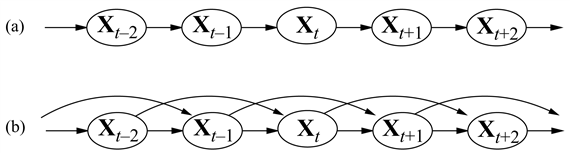
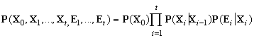
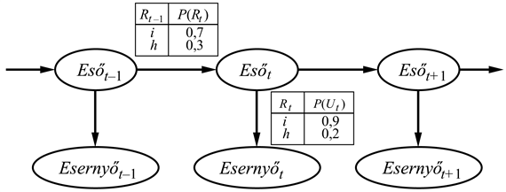

<?xml version="1.0" encoding="UTF-8" standalone="no"?>
<!DOCTYPE html PUBLIC "-//W3C//DTD XHTML 1.1//EN" "http://www.w3.org/TR/xhtml11/DTD/xhtml11.dtd">
<html xmlns="http://www.w3.org/1999/xhtml"><head><meta name="generator" content="DocBook XSL Stylesheets V1.76.1"/></head><body>

<h1 class="title"><a id="id688476"/>15. fejezet - Időbeli valószínűségi következtetés </h1>

<em>Ebben a fejezetben megpróbáljuk értelmezni a jelent, megérteni a múltat és esetleg megjósolni a jövőt, még akkor is, ha igencsak kevéssé kristálytiszta.</em>

A bizonytalan környezetben lévő ágenseknek – a logikai ágensekhez hasonlóan – képesnek kell lenniük környezetük aktuális állapotának nyomon követésére. Ezt a feladatot nehezebbé teszi a részleges és zajos érzékelés, és az a bizonytalanság, ahogyan a környezet az idő előrehaladtával változik. Az ágens a legjobb esetben is a jelenlegi helyzetnek csak egy valószínűségi értékeléséhez képes hozzájutni. Ez a fejezet olyan reprezentációkat és következtetési algoritmusokat ír le, amelyek lehetővé teszik ezt az értékelést, a 14. fejezetben bemutatott ötletekre építve.

Az alapvető megközelítés leírása a 15.1. alfejezetben szerepel: egy változó világot úgy modellezünk, hogy a világ állapotának minden vonatkozására, <em>minden időpillanatban</em> egy valószínűségi változót használunk. Ezen változók közti kapcsolatok írják le az állapot fejlődését. A 15.2. alfejezet meghatározza az alapvető következtetési feladatokat, és leírja az időbeli modellekhez tartozó következtető algoritmusok általános struktúráját. Ezután három különbözőfajta modellt írunk le: a <strong>rejtett Markov-modell</strong>eket (<strong>hidden Markov model</strong>), a <strong>Kalman-szűrő</strong>ket (<strong>Kalman filter</strong>s) és a <strong>dinamikus Bayes-háló</strong>kat (<strong>dynamic Bayesian network</strong>s) (ami mint speciális aleseteket magában foglalja a rejtett Markov-modelleket és a Kalman-szűrőket). Végül a 15.6. alfejezet bemutatja, miként alkotják az időbeli valószínűségi modellek a modern beszédfelismerő rendszerek magját. Ezen modellek mindegyikének létrehozásában központi szerepet tölt be a tanulás, de a tanulási algoritmusok részletes vizsgálata a VI. részre marad.

<h1 class="title"><a id="id688521"/>Idő és bizonytalanság</h1>

A valószínűségi következtetésre szolgáló technikáinkat <strong>változatlan</strong> (<strong>static</strong>) világok esetén fejlesztettük ki, amelyekben minden egyes valószínűségi változónak egyetlen rögzített értéke van. Például egy gépkocsi javításánál feltesszük, hogy ami meghibásodott, az a diagnosztizálás alatt is hibás marad; a feladatunk a gépkocsi állapotának kikövetkeztetése a megfigyelt bizonyítékokból, amelyek szintén változatlanok maradnak.

Most vegyünk fontolóra egy másféle problémát: egy cukorbeteg páciens kezelését. Akárcsak a gépkocsijavítás esetén, rendelkezünk bizonyítékokkal: a jelenlegi inzulinadagok, az élelmiszer-bevitel, a vércukorszint mérésének eredményei és egyéb testi tünetek. A feladat a páciens jelenlegi állapotának értékelése, beleértve az aktuális vércukorszintet és inzulinszintet. Ezeknek az információknak az alapján az orvos (vagy a páciens) döntést hoz a páciens élelmiszer-beviteli és inzulinadagjáról.

A gépkocsijavítás esetétől eltérően, itt a probléma <em>dinamikai</em> vonatkozásai alapvetőek. A vércukorszintek és méréseik idővel gyorsan változhatnak, amit befolyásol a páciens aktuális élelmiszer-bevitele és inzulinadagja, az anyagcsere aktivitása, a napszak és egyéb tényezők. Ahhoz, hogy a bizonyítékok időbeli alakulásából a jelenlegi állapotot megbecsüljük, és egy kezelés kimenetelét megjósoljuk, modelleznünk kell ezeket a változásokat.

Ugyanezek a szempontok számos más esetben is jelentkeznek, egy nemzet gazdasági aktivitásának közelítő és részleges statisztikák alapján történő követésétől, beszédszekvenciák zajos és többértelmű akusztikai mérésekből történő megértéséig. Adódik a kérdés: hogyan lehet az ezekhez hasonló dinamikai helyzeteket modellezni?

<h2 class="title"><a id="id688547"/>Állapotok és megfigyelések</h2>

Az alapvető megközelítés, amit követünk, hasonló a 10. fejezetben leírt szituációkalkulus alapjául szolgáló ötlethez: a változás folyamatát pillanatfelvételek sorozatának tekinthetjük, amelyek mindegyike egy adott pillanatban írja le a világ állapotát. Minden pillanatfelvétel vagy <strong>időpont</strong> (<strong>time slice</strong>) valószínűségi változók egy halmazát tartalmazza, amelyek némelyike megfigyelhető, némelyike pedig nem.

Az egyszerűség kedvéért a továbbiakban fel fogjuk tenni, hogy a változóknak ugyanaz a részhalmaza minden időpontban megfigyelhető (bár az elkövetkezőkben ez teljes mértékben sehol sem szükségszerű). A <em>t</em> időpillanatban nem megfigyelhető változók halmazának a jelölésére <strong>X</strong>t-t fogjuk használni, és <strong>E</strong>t-t a megfigyelhető változók halmazának a jelölésére. A <em>t</em> időpontbeli megfigyelés <strong>E</strong>t = <strong>e</strong><em>t</em> az értékek valamely <strong>e</strong>t halmazára.

Gondoljuk át a következő leegyszerűsített példát: tegyük fel, hogy egy titkos, földalatti létesítmény biztonsági őrei vagyunk. Szeretnénk tudni, hogy vajon aznap esik-e, de a külvilághoz való egyetlen hozzáférésünket az jelenti, hogy reggelenként látjuk, hogy az igazgató esernyővel vagy esernyő nélkül jön be. Minden egyes <em>t</em> napon az <strong>E</strong>t halmaz így egyetlen bizonyítékváltozót tartalmaz, az <em>Ut</em>-t (van-e esernyő), és <strong>X</strong>t az <em>Rt</em>-t, az egyetlen állapotváltozót tartalmazza (esik-e). Más problémákhoz változók nagyobb halmaza tartozhat. A cukorbetegség példájában a bizonyítékváltozók lehetnek a <em>MértVércukort</em> és a <em>Pulzusszámt</em>, és az állapotváltozók lehetnek a <em>Vércukort</em> és a <em>Gyomortartalomt</em>.[<a id="id688667" href="#ftn.id688667" class="footnote">156</a>]

Az időpontok közötti intervallum szintén problémafüggő. A cukorbetegség követésénél az alkalmas intervallum inkább egy óra, mint egy nap. Ebben a fejezetben általában egy rögzített véges intervallumot tételezünk fel, ami azt jelenti, hogy az időpillanatok egész számokkal felcímkézhetők. Feltesszük, hogy az állapotsorozat <em>t</em> = 0-nál kezdődik; és jelentéktelen okokból feltesszük, hogy a bizonyítékok <em>t</em> = 1<em>-</em>nél<em> </em>kezdenek beérkezni, és nem <em>t</em> = 0-nál<em>. </em>Így<em> </em>az esernyős világot az <em>R</em>0, <em>R</em>1, <em>R</em>2, ... állapotváltozók és az <em>U</em>1, <em>U</em>2, ... bizonyítékváltozók reprezentálják. Az <em>a</em> : <em>b</em> jelölést fogjuk használni az egészek <em>a</em>-tól <em>b</em>-ig tartó sorozatának jelölésére (a határokat beleértve), és <strong>X</strong><em>a</em>:<em>b</em> jelöli a változók megfelelő halmazát <strong>X</strong>a-tól <strong>X</strong>b-ig. Például <em>U</em>1:3 az <em>U</em>1, <em>U</em>2, <em>U</em>3 változóknak felel meg.

<h2 class="title"><a id="id688808"/>Stacionárius folyamatok és a Markov-feltétel</h2>

Egy adott problémánál az állapotváltozók és a bizonyítékváltozók halmazának meghatározása után a következő lépés a változók közötti függőségek megadása. Követhetnénk a 14. fejezetben megállapított eljárást, valahogyan sorrendezve a változókat, és kérdéseket feltéve az elődöktől való feltételes függetlenségre, adott szülői halmaz esetén. Egy nyilvánvaló választás, hogy a változókat a természetes idősorrendjük szerint sorrendezzük, mivel az ok általában megelőzi a hatást, és a változókat lehetőleg az ok-okozati sorrendjük szerint vesszük. 

Azonban hamar beleütközhetünk egy akadályba: a változók halmaza nem korlátos, mivel minden időpontra tartalmazza az állapot- és bizonyítékváltozókat. Valójában ez két problémát is felvet: (1) korlátlan számú feltételes valószínűségi táblát kell megadnunk minden változóra, minden időpillanatban; (2) ezek korlátlan számú szülőt tartalmazhatnának. 

Az első problémát megoldja annak feltételezése, hogy a világ állapotának a változásait egy <strong>stacionárius folyamat</strong> (<strong>stationary process</strong>) okozza – azaz egy változási folyamat, amit olyan törvények határoznak meg, amik maguk nem változnak az idővel. (Ne keverjük össze a <em>stacionaritást</em> a <em>statikussággal:</em> egy <em>statikus</em> folyamatban maga az állapot nem változik.) Az esernyős világban ekkor a <strong>P</strong>(<em>Ut</em>|<em>Szülők</em>(<em>Ut</em>)) feltételes valószínűség, hogy az esernyő feltűnik, minden <em>t</em>-re azonos. A stacionaritás feltevésénél ezért csak egy „reprezentatív” időpillanathoz tartozó változók feltételes valószínűségeit kell megadnunk.

A második problémát, a potenciálisan végtelen számú szülő kezelését, az úgynevezett <strong>Markov-feltétel</strong> (<strong>Markov assumption</strong>) elfogadása oldja meg – azaz, hogy a jelenlegi állapot a korábbi állapotoknak csak <em>véges</em> történetétől függ. Ennek a feltevésnek eleget tévő folyamatokat elsőként Andrei Markov orosz matematikus tanulmányozta részletesen. Ezeket a folyamatokat <strong>Markov-folyamat</strong>oknak (<strong>Markov process</strong>es) vagy <strong>Markov-lánc</strong>oknak (<strong>Markov chain</strong>s) neveznek. (A Markov-folyamatok feloszthatók aszerint, hogy az állapottér folytonos vagy diszkrét, illetve hogy az idő folytonos vagy diszkrét. Markov-láncoknak a diszkrét idejű és/vagy diszkrét állapotterű Markov-folyamatokat nevezik – <em>a ford</em>.) A Markov-folyamatok különböző jellemzőkkel rendelkezhetnek; a legegyszerűbb az <strong>elsőrendű Markov-folyamat</strong> (<strong>first-order Markov process</strong>), amelyben a jelenlegi állapot csak az előző állapottól függ, és nem függ egyetlen korábbitól sem. Máshogy fogalmazva, egyetlen állapot ismeretére van szükség, hogy a jövő a múlttól feltételesen független legyen az állapot ismeretében. A jelölésünket felhasználva, a megfelelő feltételes valószínűségi állítás azt mondja ki, hogy minden <em>t</em>-re 

<code class="code"><em>P</em>(<em>X</em>t|<em>X</em>0:<em>t</em>–1) = <em>P</em>(<em>X</em>t|<em>X</em><em>t</em>–1)						(15.1)</code>

Így egy elsőrendű Markov-folyamatban az állapotok időbeli változását leíró szabályokat teljes mértékben tartalmazza a <strong>P</strong>(<strong>X</strong>t|<strong>X</strong>1–<em>t</em>) feltételes eloszlás, amit az elsőrendű folyamat <strong>állapotátmenet-modell</strong>jének (<strong>transition model</strong>) nevezünk.[<a id="id688988" href="#ftn.id688988" class="footnote">157</a>] A 15.1. ábra elsőrendű és másodrendű Markov-folyamatokhoz tartozó Bayes-hálóstruktúrákat mutat.

<a id="id688994"/>
<strong>15.1. ábra - (a) Egy elsőrendű Markov-folyamathoz tartozó Bayes-hálóstruktúra. A reprezentált Markov-folyamatban az állapotot az Xt változók definiálják. (b) Egy másodrendű Markov-folyamat.</strong>

Az <strong>X</strong>t állapotváltozók szüleinek a korlátozásán túl korlátoznunk kell az <strong>Et </strong>bizonyítékváltozók szüleit is. Tipikusan feltesszük, hogy a bizonyítékváltozók egy <em>t</em> időpillanatban csak az aktuális állapottól függnek:

<code class="code"><em>P</em>(<em>E</em>t|<em>X</em>0:<em>t</em>,<em><em> </em>E</em>0:<em>t</em>–1) = <em>P</em>(<em>E</em>t|<em>X</em>t)					(15.2)</code>

A <strong>P</strong>(<strong>E</strong>t|<strong>X</strong>t) feltételes eloszlást <strong>érzékelő modell</strong>nek (<strong>sensor model</strong>) nevezik (vagy néha <strong>megfigyelési modell</strong>nek [<strong>observational model</strong>]), mivel leírja, hogy az „érzékelőket” – azaz a bizonyítékváltozókat – hogyan befolyásolja a világ aktuális állapota. Vegyük észre a függés irányát: a „nyíl” az állapottól az érzékelő értékére mutat, mivel a világ állapota <em>okozza</em> azt, hogy az érzékelők bizonyos értékeket vegyenek fel. Az esernyős világban például az eső okozza az esernyő feltűnését. (A következtetési folyamat természetesen a másik irányban halad; a modellezett függések iránya és a következtetés iránya közötti különbségtétel a Bayes-hálók egyik fő előnye.)

Az állapotátmenet-modellhez és az érzékelő modellhez még meg kell adnunk egy <strong>P</strong>(<strong>X</strong>0) a priori eloszlást a 0. időpontbeli állapotok felett. Ez a három eloszlás, kombinálva a (15.1) és a (15.2)<em> </em>egyenletekben megfogalmazott feltételes függetlenségi állításokkal, biztosítja számunkra a teljes együttes eloszlás meghatározását az összes változó felett. Bármely véges <em>t</em>-re azt kapjuk, hogy

A függetlenségi állítások egy nagyon egyszerű Bayes-hálóstruktúrának felelnek meg, ami az egész rendszert leírja. A 15.2. ábrán látható a háló struktúrája az esernyős példa esetén, beleértve az állapotátmenet- és az érzékelő modellekhez tartozó feltételes eloszlásokat.

Az ábrán lévő struktúra elsőrendű Markov-folyamat feltételezésen alapul, mivel feltesszük, hogy az eső valószínűsége csak attól függ, hogy az előző nap esett-e. Egy ilyen feltevésnek a helyénvalósága magától a tárgyterülettől függ. Az elsőrendű Markov-feltétel kimondja, hogy az állapotváltozók az <em>összes</em> olyan információt tartalmazzák, amely a következő időpontbeli valószínűség-eloszlások megadásához szükséges. Néha ez a feltevés pontosan teljesül – például ha egy részecske <strong>véletlen bolyongás</strong>t (<strong>random walk</strong>) végez az <em>x</em> tengelyen, ±1-gyel változtatva meg a pozícióját minden időpontban, ekkor az <em>x</em> koordinátát használva állapotként, egy Markov-lánc adódik. Gyakran a feltevés csak közelítő, mint amikor az eső jóslása csak az alapján történik, hogy esett-e az előző napon. Két lehetséges javítás létezik, ha a közelítés túlságosan pontatlannak bizonyul:

<ol class="orderedlist"><li class="listitem">
A Markov-folyamat rendjének a megnövelése. Például létrehozhatnánk egy másodrendű modellt, felvéve egy <em>Esőt</em>–2-t mint az <em>Esőt</em> szülőjét, ami lehet, hogy valamivel pontosabb predikciót adna (például Palo Altóban nagyon ritkán esik több mint két napig egyfolytában).
</li><li class="listitem">
Az állapotváltozók halmazának megnövelése. Például felvehetnénk az <em>Évszakt</em> változót, hogy ez lehetővé tegye számunkra az esős évszakok történeti feljegyzéseinek beépítését, vagy hozzáadhatnánk a <em>Hőmérséklett</em>, a <em>Páratartalomt</em> és a <em>Légnyomást</em> változókat, hogy az eső feltételeinek fizikai modelljeit felhasználhassuk.
</li></ol>

<a id="id689235"/>
<strong>15.2. ábra - Az esernyős világot leíró Bayes-hálóstruktúra és feltételes eloszlások. Az álapotátmenet-modell a <em>P</em>(<em>Esőt</em>|<em>Eső</em><em>t</em>–1) feltételes valószínűség-eloszlás, az érzékelő modell a <em>P</em>(<em>Esernyőtt</em>|<em>Esőt</em>).</strong>

A 15.1. feladat annak megmutatását kéri, hogy az első megoldás – a folyamat rendjének a megnövelése – mindig átfogalmazható az állapotváltozók halmazának megnövelésére, változatlanul hagyva a rendet. Vegyük észre, hogy állapotváltozók hozzáadása javíthatja a rendszer előrejelző erejét, de megnöveli a predikciós <em>követelményeket</em> is: ekkor már az új változókat is jósolni kell. Így a változóknak egy „önmagában elégséges” halmazát keressük, ami valójában azt jelenti, hogy meg kell értenünk a modellezett folyamat „fizikáját”. A folyamat pontos modellezése iránti követelmény nyilvánvalóan mérsékeltebb, ha új érzékelőket vehetünk fel (például a hőmérséklet és a nyomás mérésére), amelyek közvetlenül az új állapotváltozókról szolgáltatnak információt.

Gondoljuk meg például egy X–Y síkon véletlenszerűen sétáló robot követésének a problémáját. Egy javaslat az állapotváltozók egy elégséges halmazára ekkor a pozíció és a sebesség lehet: Newton törvényeit felhasználva kiszámolható az új pozíció, és a sebesség megjósolhatatlanul változik. Ha azonban a robot akkumulátorról üzemel, akkor az elem lemerülésének tipikusan van egy szisztematikus hatása a sebesség megváltozására. Mivel ez viszont függ attól, hogy mennyi energia használódott el az összes korábbi manőverben, a Markov-tulajdonság sérül. A Markov-tulajdonságot helyreállíthatjuk egy <em>Akkumulátort</em> feltöltöttségi szintnek mint az <strong>X</strong>t-t alkotó állapotváltozók egyikének a felvételével. Ez segít a robot mozgásának a jóslásában, de ugyanakkor megköveteli az <em>Akkumulátort</em> jóslását az <em>Akkumulátort</em>–1-ből és a sebességből. Bizonyos esetekben ez megbízhatóan megtehető; a pontosság azonban javulna egy, az akkumulátor feltöltöttségét mérő új érzékelő felvételével.

 

[<a id="ftn.id688667" href="#id688667" class="para">156</a>]  Vegyük észre, hogy a <em>Vércukort</em> és a <em>MértVércukort</em> két különböző változó, így kezeljük az aktuális mennyiségek zajos mérését.

[<a id="ftn.id688988" href="#id688988" class="para">157</a>]  Az állapotátmenet-modell a valószínűségi analógja a 7. fejezet logikai frissítő áramkörének és a 10. fejezet követő állapot axiómáinak.

</body></html>
