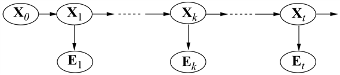

<?xml version="1.0" encoding="UTF-8" standalone="no"?>

<html xmlns="http://www.w3.org/1999/xhtml"><head><meta name="generator" content="DocBook XSL Stylesheets V1.76.1"/></head><body>

<h1 class="title"><a id="id689314"/>Következtetés időbeli modellekben</h1>

Egy általános időbeli modellstruktúra kidolgozása után, most már megfogalmazhatjuk a megoldandó alapvető következtetési feladatokat:

<ul class="itemizedlist"><li class="listitem">
<strong>Szűrés</strong> (<strong>filtering</strong>) vagy <strong>ellenőrző megfigyelés</strong> (<strong>monitoring</strong>). Ez a <strong>bizonyossági </strong><strong>állapot</strong> (<strong>belief state</strong>) kiszámításának a feladata – ami a jelenlegi állapot feletti a posteriori eloszlás, az adott időpontig vett összes bizonyíték ismeretében. Azaz szeretnénk kiszámítani a <strong>P</strong>(<strong>X</strong>t|<strong>e</strong>1:<em>t</em>) mennyiséget, feltéve, hogy a bizonyítékok folyamatos sorozatban érkeznek kezdve a <em>t </em>= 1 időponttól. Az esernyős példában ez az aznapi eső valószínűségének a kiszámítását jelentené, az esernyőhordozó eddigi összes megfigyelésének az ismeretében. A szűrés az, amit egy racionális ágensnek el kell végeznie ahhoz, hogy a jelenlegi állapotot követni tudja, és így racionális döntéseket hozhasson (lásd 17. fejezet). Kiderül, hogy majdnem azonos számítás szolgáltatja a bizonyítéksorozat megfigyelésének a <strong>valószínűség</strong>ét (<strong>likelihood</strong>), <em>P</em>(<strong>e</strong>1:<em>t</em>)-t.
</li><li class="listitem">
<strong>Előrejelzés</strong> (<strong>prediction</strong>). Ez egy <em>jövőbeli</em> állapot feletti a posteriori<em> </em>eloszlás kiszámításának a feladata, az adott időpontig vett összes bizonyíték ismeretében. Azaz, szeretnénk kiszámítani a <strong>P</strong>(<strong>X</strong><em>t</em>+<em>k</em>|<strong>e</strong>1:<em>t</em>) mennyiséget valamely <em>k </em>&gt; 0 esetén. Az esernyős példában ez jelentheti az eső valószínűségének a kiszámítását három napra előre, az esernyőhordozó eddigi összes megfigyelésének az ismeretében. Az előrejelzés hasznos a cselekedetek lehetséges sorozatainak a kiértékelésében.
</li><li class="listitem">
<strong>Simítás</strong> (<strong>smoothing</strong>) vagy <strong>visszatekintés</strong> (<strong>hindsight</strong>). Ez egy múltbeli állapot feletti a posteriori eloszlás kiszámításának a feladata, a jelen időpontig vett összes bizonyíték ismeretében. Azaz szeretnénk kiszámítani a <strong>P</strong>(<strong>X</strong>k|<strong>e</strong>1:<em>t</em>) mennyiséget valamely 0  ≤ <em>k</em> &lt; <em>t</em> esetén. Az esernyős példában ez jelentheti az eső valószínűségének a kiszámítását múlt szerdára, ha ismerjük az esernyőhordozónak a mai napig történő összes megfigyelését. A visszatekintés az állapotnak egy jobb becslését adja, mint ami akkor elérhető volt, mivel több bizonyítékot használ fel.
</li><li class="listitem">
<strong>Legvalószínűbb magyarázat</strong> (<strong>most likely explanation</strong>). A megfigyelések egy sorozatának ismeretében lehet, hogy szeretnénk megtalálni azt az állapotsorozatot, ami a leginkább valószínű, hogy az adott  megfigyeléseket generálta. Azaz szeretnénk kiszámítani az  <em>P</em>(<strong>x</strong>1:<em>t</em>|<strong>e</strong>1:<em>t</em>) értékét. Például ha az esernyő feltűnik az első három nap mindegyikén, és hiányzik a negyediken, akkor a legvalószínűbb magyarázat az, hogy az első három napon esett és a negyediken nem esett. Az erre a feladatra szolgáló algoritmusok számos alkalmazásban hasznosak, ideértve a beszédfelismerést – ahol a cél a szavak legvalószínűbb sorozatának a megtalálása hangok sorozatának ismeretében – és egy zajos csatornán továbbított bináris szekvenciák rekonstrukcióját.
</li></ul>

Ezeken a feladatokon túl szükség van még módszerekre az állapotátmenet- és érzékelő modellek megfigyelésekből<em> </em>történő <em>megtanulására</em>. Csakúgy, mint a statikus Bayes-hálóknál, a dinamikus Bayes-hálós tanulás elvégezhető mint a következtetés mellékterméke. A következtetés egy becslést ad arra, hogy milyen átmenetek következtek be valójában, és milyen állapotok generálták az érzékelők értékeit, és ezek a becslések felhasználhatók a modell frissítésére. A frissített modellek jobb becsléseket adnak, és a folyamat a konvergálásig iterálódik. A teljes folyamat a várhatóérték-maximálás vagy <strong>EM algoritmus</strong> egy esete (lásd 20.3. alfejezet). Figyelemre méltó részlet, hogy a tanulás teljes simítós következtetést igényel szűrés helyett, mivel ez jobb becsléseket ad a folyamat állapotára. Lehet, hogy a szűréssel való tanulás nem konvergál helyesen; gondoljunk például a gyilkosságok felderítésének a megtanulására: a visszatekintés <em>mindig</em> szükséges annak kikövetkeztetéséhez a megfigyelhető bizonyítékok alapján, hogy mi történt a gyilkosság helyszínén.

Az előző szakaszban felsorolt négy következtetési feladatot megoldó algoritmusok először leírhatók általános szinten, függetlenül az alkalmazott modell konkrét típusától. Az egyes modellekhez igazodó javításokat a következő fejezetekben ismertetjük.

<h2 class="title"><a id="id690663"/>Szűrés és előrejelzés</h2>

Kezdjük a szűréssel. Megmutatjuk, hogy ez menet közben egyszerűen, online módon elvégezhető: a <em>t</em>-edik időpillanatig tartó szűrés eredményét ismerve, a <em>t + </em>1-edik időpillanatra az eredmény könnyen kiszámítható az új <strong>e</strong><em>t</em>+1 bizonyítékból. Azaz

<code class="code"><em>P</em>(<em>X</em><em>t</em>+1|<em>e</em>1:<em>t</em>+1) = <em>f</em>(<em>e</em><em>t</em>+1,<em> P</em>(<em>X</em>t|<em>e</em>1:<em>t</em>))</code>

valamely <em>f</em> függvénnyel. Ezt a folyamatot gyakran nevezik <strong>rekurzív becslés</strong>nek (<strong>recursive estimation</strong>). Tekinthetjük a számítást úgy, mint ami valójában két részből áll: elsőként a jelenlegi állapot eloszlását terjesztjük előre <em>t</em>-ről <em>t </em>+ 1-re; azután fogjuk frissíteni, felhasználva az új <strong>e</strong><em>t</em>+1 bizonyítékot. Ez a kétlépéses folyamat elég egyszerűen alakul:

<code class="code"><em>P</em>(<em><em>X</em></em><em>t</em>+1|<em>e</em>1:<em>t</em>+1) = <em>P</em>(<em>X</em><em>t</em>+1|<em>e</em>1:t, <em>e</em><em>t</em>+1)		(felosztva a bizonyítékot)</code>

<code class="code">	=<em> </em>α <em>P</em>(<em>e</em><em>t+</em>1|<em>X</em><em>t</em>+1, <em>e</em>1:<em>t</em>) <em>P</em>(<em>X</em><em>t</em>+1|<em>e</em>1:<em>t</em>)	(a Bayes-szabályt használva)</code>

<code class="code">	=<em> </em>α <em>P</em>(<em>e</em><em>t</em>+1|<em>X</em><em>t</em>+1) <em>P</em>(<em>X</em><em>t</em>+1|<em>e</em>1:<em>t</em>)	(a bizonyíték Markov-tulajdonsága miatt)</code>
<a id="ID_633_oldal"/>
Itt és végig a fejezetben, az α egy normalizációs konstans, ami a valószínűségek 1-re összegzését biztosítja. A második tényező <strong>P</strong>(<strong>X</strong><em>t</em>+1|<strong>e</strong>1:<em>t</em>) reprezentálja a következő állapot egylépéses előrejelzését, és az első tényező ezt frissíti az új bizonyítékkal. Vegyük észre, hogy <strong>P</strong>(<strong>e</strong><em>t</em>+1|<strong>X</strong><em>t</em>+1) közvetlenül kinyerhető az érzékelő modellből. Most a jelenlegi <strong>Xt </strong>állapotot feltételnek véve a következő állapot egylépéses előrejelzéséhez jutunk:

 (kihasználva a Markov-tulajdonságot)(15.3)

Az összegzésen belül az első tényező egyszerűen az állapotátmenet-modell és a második a jelenlegi állapot eloszlása. Így megvan a kívánt rekurzív képlet. A szűrt <strong>P</strong>(<strong>X</strong>t|<strong>e</strong>1:<em>t</em>) becslésre úgy gondolhatunk, mint egy <strong>f</strong>1:<em>t</em> „üzenetre”, amit előre terjesztünk végig a sorozaton, minden átmenetnél az új megfigyeléssel módosítva és frissítve. A folyamat

<code class="code"><em>f</em>1:<em>t</em>+1 = α Előre(<em>f</em>1:<em>t</em>, <em>e</em><em>t</em>+1)</code>

ahol az <code class="code">ELŐRE</code> a (15.3) egyenlet által leírt frissítést hajtja végre.

<h3 class="title">Fontos</h3>
Ha az összes állapotváltozó diszkrét, minden frissítés ideje állandó (azaz <em>t</em>-től független), és a tárigény is állandó. (Ezek az állandók természetesen függnek az állapottér méretétől és a tárgyalt időbeli modell konkrét típusától.) <em>A frissítés idő- és tárigényének állandónak kell lennie, ha egy korlátos memóriájú ágensnek követnie kell az aktuális állapot eloszlását a megfigyelések egy korlátlan sorozata esetén.</em>

Mutassuk be a szűrési folyamatot két lépésen keresztül az alap esernyős példában (lásd 15.2. ábra). Feltesszük, hogy a biztonsági őrünknek van valamilyen a priori hite, hogy a 0. napon esett-e, éppen azelőtt, hogy a megfigyelések sorozata elkezdődik. Tegyük fel, hogy ez <strong>P</strong>(<em>R</em>0) = 〈0,5, 0,5 〉. Most a két megfigyelést a következőképpen dolgozzuk fel:

<ul class="itemizedlist"><li class="listitem">
Az 1. napon az esernyő feltűnik, így <em>U</em>1 = <em>igaz</em>. Az előrejelzés <em>t</em> = 0-ról <em>t</em> = 1-re
</li></ul>

és a <em>t</em> = 1-beli bizonyítékkal való frissítés azt adja, hogy

<code class="code"><em>P</em>(<em>R</em>1|<em>u</em>1) = α<em>P</em>(<em>u</em>1|<em>R</em>1) <em>P</em>(<em>R</em>1) = α〈0,9, 0,2〉〈0,5, 0,5〉</code>

<code class="code">	= α〈0,45, 0,1〉 ≈ 〈0,818, 0,182〉</code>

<ul class="itemizedlist"><li class="listitem">
A 2. napon az esernyő feltűnik, így <em>U</em>2 = <em>igaz.</em> Az előrejelzés <em>t </em>= 1-ről <em>t </em>= 2-re
</li></ul>

a <em>t </em>= 2-beli bizonyítékkal való frissítés pedig azt adja, hogy

<code class="code"><em>P</em>(<em>R</em>2|<em>u</em>1<em>, u</em>2) = α<em>P</em>(<em>u</em>2|<em>R</em>2)<em> P</em>(<em>R</em>2|<em>u</em>1) = α〈0,9, 0,2〉 〈0,627, 0,373〉</code>

<code class="code">	= α〈0,565, 0,075〉 ≈ 〈0,883, 0,117〉</code>

Érzésünk szerint az eső valószínűsége azért növekedett az 1. napról a 2. napra, mert az eső folytatódik. A 15.2. (a) feladat ennek a tendenciának a további vizsgálatát kéri.

Az előrejelzés feladatát tekinthetjük egyszerűen szűrésnek új bizonyíték hozzáadása nélkül. Valójában a szűrési folyamat már magában foglal egy egylépéses előrejelzést és könnyen származtatható a következő rekurzív számítás a <em>t </em>+ <em>k </em>+ 1 állapot előrejelzésére a <em>t </em>+ <em>k</em> előrejelzéséből:

Természetesen ez a számítás csak az állapotátmenet-modellt tartalmazza és nem az érzékelő modellt.

Érdekes meggondolni, hogy mi történik, ahogy egyre távolabbra próbálunk előre jelezni a jövőben. A 15.2. (b) feladat megmutatja, hogy az eső előrejelzett eloszlása a 〈0,5, 0,5〉 fix ponthoz konvergál, ami után a továbbiakban állandó marad. Ez az állapotátmenet-modell által meghatározott Markov-folyamat <strong>stacionárius eloszlás</strong>a (<strong>st</strong><strong>ationary distribution</strong>) (lásd még <a class="xref" href="ch14s05.md#ID_605_oldal">„Következtetés Markov-lánc szimulációval”</a> rész). Rengeteg ismeret gyűlt fel az ilyen eloszlások tulajdonságairól és a <strong>keverési idő</strong>ről (<strong>mixing time</strong>) – ami nagyjából a fix pont eléréséig eltelt idő. Gyakorlati szempontból ez bukásra ítél minden olyan kísérletet, ami a keverési idő kis hányadánál nagyobb számú lépés múlva kísérli meg az aktuális állapot előrejelzését. Minél bizonytalanabb az állapotátmenet-modell, annál rövidebb a keverési idő, és a jövő annál homályosabb.

A szűrésen és az előrejelzésen túl, felhasználhatjuk az előrehaladó rekurziót egy bizonyítéksorozat <em>P</em>(<strong>e</strong>1:<em>t</em>) <strong>valószínűség</strong>ének a kiszámítására is. Ez egy hasznos mennyiség, ha különböző időbeli modelleket szeretnénk összehasonlítani, amelyek ugyanazt a bizonyítéksorozatot állíthatták elő; például a 15.6. alfejezetben különböző szavakat hasonlítunk össze, amelyek ugyanazt a hangsort állíthatták elő. Ehhez a rekurzióhoz felhasználjuk az <em><strong>ℓ</strong></em>1:<em>t</em> = <strong>P</strong>(<strong>Xt,</strong> <strong>e</strong>1:<em>t</em>) valószínűségi (likelihood) üzenetet. Egyszerű feladat azt megmutatni, hogy

<code class="code"><em><em>ℓ</em></em>1:<em>t</em>+1 = Előre(<em><em>ℓ</em></em>1:<em>t</em>, <em>e</em><em>t</em>+1)</code>

Kiszámítva <em><strong>ℓ</strong></em> 1:<em>t</em>-t, az aktuális valószínűséget az <strong>Xt </strong>feletti összegzéssel kapjuk:

<h2 class="title"><a id="id691450"/>Simítás</h2>

Ahogy korábban meghatároztuk, a <strong>simítás</strong> (<strong>smoothing</strong>) múltbeli állapotok feletti eloszlás kiszámításának a folyamata a jelenig tartó bizonyítékok ismeretében; azaz <strong>P</strong>(<strong>X</strong>k|<strong>e</strong>1:<em>t</em>) számítása valamely 0 ≤ <em>k </em>&lt; <em>t</em> esetén (lásd 15.3. ábra). Ez legkényelmesebben két részletben végezhető el – a bizonyíték <em>k</em>-ig és a bizonyíték <em>k </em>+ 1-től <em>t</em>-ig,

<code class="code"><em>P</em>(<em>X</em>k|<em>e</em>1:<em>t</em>) = <em>P</em>(<em>X</em>k|<em>e</em>1:<em>k</em>, <em>e</em><em>k</em>+1:<em>t</em>)</code>

<code class="code">	= α<em> P</em>(<em>X</em>k|<em>e</em>1:<em>k</em>) <em>P</em>(<em>e</em><em>k</em>+1:<em>t</em>|<em>X</em>k, <em>e</em>1:<em>k</em>)	(a Bayes-szabályt használva)</code>

<code class="code">	= α <em>P</em>(<em>X</em>k|<em>e</em>1:<em>k</em>) <em>P</em>(<em>e</em><em>k</em>+1:<em>t</em>|<em>X</em>k)	(a feltételes függetlenséget használva)</code>

<code class="code">= α <em>f</em>1:<em>k</em> <em>b</em><em>k</em>+1:<em>t</em>						(15.6)</code>

ahol definiáltuk<strong> </strong>a <strong>b</strong><em>k</em>+1:<em>t </em>= <strong>P</strong>(<strong>e</strong><em>k</em>+1:<em>t</em>|<strong>X</strong>k) „visszafelé” üzenetet, analóg módon az <strong>f</strong>1:<em>k</em> előre üzenethez. Az <strong>f</strong>1:<em>k</em> előre üzenetet előre szűréssel lehet kiszámolni 1-től <em>k</em>-ig, a (15.3) egyenlet alapján. A <strong>b</strong><em>k</em>+1:<em>t</em><em> </em>visszafelé üzenetről pedig kiderül, hogy egy egyszerű rekurzív folyamattal kiszámítható, ami <em>t</em>-től visszafelé halad:

ahol az utolsó lépés az <strong>e</strong><em>k</em>+1 és az <strong>e</strong><em>k</em>+2:<em>t</em> feltételes függetlenségéből következik az <strong>x</strong><em>k</em>+1 melletti feltétellel. Az összegzésben a három tényezőből az első és a harmadik közvetlenül a modellből megkapható, a második pedig a „rekurzív hívás”. Az üzenetjelölést használva kapjuk, hogy 

<code class="code"><em>b</em><em>k</em>+1:<em>t</em> = Hátra(<em>b</em><em>k</em>+2:<em>t</em>, <em>e</em><em>k</em>+1:<em>t</em>)</code>

ahol a <code class="code">HÁTRA</code> a (15.7) egyenlet által leírt frissítést hajtja végre. Ahogy az előrefelé rekurziónál, az egyes frissítésekhez szükséges idő- és tárigény állandó, és így <em>t</em>-től független itt is.

<a id="id691844"/>
<strong>15.3. ábra - A simítás egy múltbeli <em>k</em> időpontban az állapot a posteriori P(Xk|e1<em>:t</em>) eloszlását számítja ki egy teljes, 1-től <em>t</em>-ig terjedő megfigyelés sorozat ismeretében</strong>

Most láthatjuk, hogy a (15.6) egyenlet<em> </em>mindkét tényezője kiszámítható időbeli rekurzióval, az egyik előrefelé fut 1-től <em>k</em>-ig, és a szűrés (15.3) egyenletét használja, a másik visszafelé fut <em>t</em>-től <em>k</em>+1-ig, és a (15.7) egyenletet használja. Figyeljünk arra, hogy a viszszafelé fázist <strong>b</strong><em>t</em>+1:<em>t</em> = <strong>P</strong>(<strong>e</strong><em>t</em>+1:<em>t</em>|<strong>X</strong>t) = <strong>1</strong>-gyel inicializáljuk, ahol <strong>1 </strong>egy egyesekből álló vektor. (Mivel <strong>e</strong><em>t</em>+1:<em>t</em> egy üres sorozat, a megfigyelésének valószínűsége 1.)

Alkalmazzuk most ezt az algoritmust az esernyős példára, kiszámítva az eső valószínűségének simított becslését <em>t </em>= 1-nél, az első és második nap megfigyeléseinek ismeretében. A (15.6) egyenlet szerint ezt az adja meg, hogy

<code class="code"><em>P</em>(<em>R</em>1|<em>u</em>1, <em>u</em>2) =<em> </em>α <em>P</em>(<em>R</em>1|<em>u</em>1) <em>P</em>(<em>u</em>2|<em>R</em>1)					(15.8)</code>

A korábban leírt előrefelé szűrési folyamatból már tudjuk, hogy az első tényező 〈0,818, 0,182〉. A második tényezőt a (15.7) egyenletbeli visszafelé rekurziót alkalmazva számíthatjuk ki:

Ezt visszahelyettesítve a (15.8) egyenletbe azt kapjuk, hogy a simított becslés az esőre az 1. napon

<code class="code"><em>P</em>(<em>R</em>1|<em>u</em>1<em>, u</em>2) = α 〈0,818, 0,182〉 × 〈0,69, 0,41〉 ≈ 〈0,883, 0,117〉 </code>

Így ebben az esetben a simított becslés nagyobb, mint a szűrt becslés (0,818). Ennek oka az, hogy az esernyő a 2. napon valószínűbbé teszi, hogy esett a 2. napon, és mivel az eső tartósan szokott esni, ez még valószínűbbé teszi, hogy esett az 1. napon.

Mind az előrefelé, mind a visszafelé haladó rekurzió lépésenként állandó időt igényel; így a simítás időkomplexitása <strong>e</strong>1:<em>t</em> bizonyíték esetén <em>O</em>(<em>t</em>). Ez egy konkrét <em>k</em> időlépésbeli simítás komplexitása. Ha a teljes szekvenciát szeretnénk simítani, nyilvánvaló módszer, hogy egyszerűen az egész simítási folyamatot lefuttatjuk minden egyes simítandó időpillanatra. Ez <em>O</em>(<em>t</em>2) időkomplexitást eredményez. Jobb megközelítés a dinamikai programozás nagyon egyszerű alkalmazásával <em>O</em>(<em>t</em>)-re csökkenti a komplexitást. A megoldás kulcsa megjelent az esernyős példa előző elemzésében, ahol az előrefelé szűrés folyamatának eredményeit újra fel tudtuk használni. A lineáris idejű algoritmus kulcsa így az előrefelé szűrés eredményeinek a tárolása az egész sorozatnál. Aztán a visszafelé rekurziót futtatjuk <em>t</em>-től 1-ig, kiszámítva a szűrt becslést minden <em>k</em> lépésnél a kiszámolt <strong>b</strong><em>k</em>+1:<em>t</em><em> </em>visszafelé üzenetből és a tárolt <strong>f</strong>1:<em>k</em><strong> </strong>előrefelé üzenetből. Az algoritmus, amit találóan <strong>előre-hátra algoritmus</strong>nak (<strong>forward-backward algorithm</strong>) neveznek, a 15.4. ábrán látható.

<a id="id692149"/>
<strong>15.4. ábra - Az előre-hátra algoritmus, ami állapotok egy sorozatának az a posteriori valószínűségeit számítja ki adott megfigyelési sorozat ismeretében. Az <code class="code">ELŐRE</code> és a <code class="code">HÁTRA</code> műveleteket rendre a (15.3) és (15.7) egyenletek definiálják.</strong>

A figyelmes olvasó észrevehette, hogy a 15.3. ábrán látható Bayes-hálóstruktúra egy polifa (polytree) a 14. fejezet szóhasználatában. Ez azt jelenti, hogy a csoportosító algoritmus egy nyilvánvaló alkalmazása szintén lineáris idejű algoritmust eredményez, ami a teljes sorozatra kiszámítja a simított becslést. Mára már világossá vált, hogy az előre-hátra algoritmus valójában a csoportosító eljárásokban használt polifa terjesztési algoritmusnak egy speciális esete (bár a kettőt egymástól függetlenül fejlesztették ki).

Az előre-hátra algoritmus alkotja a gerincét azon számítási módszereknek, amelyeket számos zajos megfigyelések sorozatával foglalkozó alkalmazásban használnak, a beszédfelismeréstől a repülőgépek radarkövetéséig. Ahogy leírtuk, két gyakorlati hátránya van. Az első, hogy a tárigénye túl nagy lehet azoknál az alkalmazásoknál, ahol az állapottér nagy, és a sorozatok hosszúak, mivel <em>O</em>(|<strong>f</strong>|<em>t</em>) méretű tárat használ, ahol |<strong>f</strong>|<em> </em>az előrefelé üzenet reprezentációjának a mérete. A tárigény <em>O</em>(|<strong>f</strong>|log<em> t</em>)-re csökkenthető az időkomplexitásnak egy log <em>t</em> tényezővel történő egyidejű megnövelése árán, ahogy a 15.3. feladat mutatja. Bizonyos esetekben (lásd 15.3. alfejezet) egy állandó tárigényű algoritmus használható időbüntetés nélkül.

Az alapalgoritmus második hátránya, hogy a folyamatos (online) működéshez módosítást igényel. Ekkor ugyanis a korábbi időpontokhoz simított becsléseket kell kiszámítanunk, amint folyamatosan új megfigyelések érkeznek a sorozat végéhez. A leggyakoribb követelmény az <strong>állandó időkülönbségű simítás</strong> (<strong>fixed-lag smoothing</strong>), ami a <strong>P</strong>(<strong>X</strong>t–d|<strong>e</strong>1:<em>t</em>) simított becslés kiszámítását jelenti egy rögzített <em>d</em>-re. Azaz a simítást a jelenlegi <em>t</em> időpillanat előtt <em>d</em> lépéssel lévő időpontra végezzük el; <em>t</em> növekedését a simításnak is követnie kell. Nyilvánvaló, hogy lefuttathatjuk az előre-hátra algoritmust a <em>d</em> lépéses „ablakban”, amint egy új bizonyíték adódik, de ez nem tűnik hatékonynak. A 15.3. alfejezetben látni fogjuk, hogy az állandó időkülönbségű simításnál egy frissítés bizonyos esetekben állandó idő alatt megtehető, függetlenül a <em>d</em> időkülönbségtől.

<h2 class="title"><a id="id692265"/>A legvalószínűbb sorozat megtalálása</h2>

<a id="ID_638_oldal"/>
Tegyük fel, hogy a biztonsági őr esernyősorozata a munkája első öt napjában az [<em>igaz</em>, <em>igaz</em>, <em>hamis</em>, <em>igaz</em>, <em>igaz</em>]. Mi a legvalószínűbb időjárás-sorozat, ami ezt megmagyarázza? Az esernyő hiánya a 3. napon azt jelenti, hogy nem esett, vagy azt, hogy az igazgató elfelejtette elhozni? Ha a 3. napon nem esett, talán a 4. napon sem esik (mivel az időjárás nem változik gyorsan), de ekkor az igazgató puszta óvatosságból hozta az esernyőt. Összességében 25 lehetséges időjárás-sorozatot választhatunk. Létezik-e módszer a legvalószínűbb sorozat megkeresésére, az összes felsorolása nélkül?

Az egyik megközelítés, amit kipróbálhatunk a következő lineáris idejű algoritmus: használjuk a simító algoritmust, hogy megtaláljuk az időjárás a posteriori eloszlását minden időpillanatban; majd állítsuk elő a sorozatot minden egyes lépésnél az a posteriori szerinti legvalószínűbb időjárást felhasználva. Egy ilyen megközelítést kötelező gyanakvással kell fogadnia az olvasónak, mivel a szűrés által kiszámított a posteriori eloszlások az <em>egyes</em> időpontok feletti eloszlások, ezzel szemben a legvalószínűbb <em>sorozat</em> megtalálásához az összes időpont feletti <em>együttes</em> valószínűségeket kell figyelembe venni. Az eredmények valójában nagyon különbözők lehetnek (lásd 15.4. feladat).

Lineáris idejű algoritmus azonban <em>létezik</em> a legvalószínűbb sorozat megtalálására, de kicsit több gondolkozást igényel. Ugyanazon a Markov-tulajdonságon alapul, mint ami hatékony algoritmusokat eredményezett a szűrésre és a simításra. A problémáról való gondolkodás legkönnyebb módja, hogy ha minden sorozatot egy <em>útvonalnak</em> tekintünk egy gráfban, aminek a csomópontjai az egyes időpillanatokban a lehetséges <em>állapotok</em>. Egy ilyen gráf látható az esernyős problémára a 15.5. (a) ábrán. Most gondoljuk meg a gráfon keresztül vezető legvalószínűbb út megkeresésének a problémáját, ahol egy út valószínűsége (a likelihood érték) az útvonal menti átmenetek valószínűségeinek és az egyes állapotokban adott megfigyelések valószínűségeinek a szorzata. Koncentráljunk most azokra az útvonalakra, amelyek elérik az <em>Eső</em>5 = <em>igaz</em> állapotot. A Markov-tulajdonság miatt fennáll, hogy az <em>Eső</em>5 = <em>igaz</em> állapotba vezető legvalószínűbb útvonal tartalmazza azt a legvalószínűbb útvonalat, amely valamelyik 4. időpontbeli állapotba vezet, és amit egy átmenet követ az <em>Eső</em>5 = <em>igaz</em>-ba; a 4. időpontbeli állapot pedig, ami része lesz az <em>Eső</em>5 = <em>igaz-</em>ba vezető útnak, az az állapot, amelyik maximalizálja ennek az útvonalnak a valószínűségét.

<h3 class="title">Fontos</h3>
Másképpen fogalmazva, van egy <em>rekurzív kapcsolat az</em> <strong>x</strong><em>t</em>+1 <em>állapotokba vezető legvalószínűbb útvonalak és az </em><strong>xt állapotokba vezető legvalószínűbb útvonalak között</strong>. Ez a kapcsolat olyan egyenletként írható fel, amely az útvonalak valószínűségeit kapcsolja össze:

A (15.9) egyenlet <em>megegyezik</em> a szűrés (15.3) egyenletével, azzal a kivétellel, hogy

<ol class="orderedlist"><li class="listitem">
az <strong>f</strong>1:<em>t</em>= <strong>P</strong>(<strong>X</strong>t<strong>e</strong>1:<em>t</em>) előre üzenet helyett a következő üzenet szerepel:

</li></ol>

ami az <strong>x</strong>t állapotba vezető legvalószínűbb út valószínűségeit adja meg; és

<ol class="orderedlist"><li class="listitem">
a (15.3) egyenletbeli <strong>x</strong>t feletti összegzés helyett a (15.9) egyenletben az <strong>x</strong>t feletti maximalizálás szerepel.
</li></ol>

Így a legvalószínűbb állapotsorozat kiszámítása hasonló a szűréshez: előrefelé végigfut a sorozaton, minden időpontban kiszámítva az <strong>m</strong> üzeneteket a (15.9) egyenlet szerint. A számítás menetét a 15.5. (b) ábra mutatja. Végül ez kiadja az <em>összes</em> végső állapothoz vezető legvalószínűbb útvonal valószínűségét. Így már könnyen kiválasztható a teljes hosszúságú legvalószínűbb sorozat (a vastagon szedettel kiemelt végső állapottól). Az aktuális sorozat azonosításához – szemben azzal, amikor csak a valószínűségét számítjuk ki – az algoritmusnak minden állapotból mutatókat kell nyilvántartania a legjobb hozzá vezető állapothoz (vastagon szedettel látható); a sorozat a mutatóknak a legjobb végső állapottól való visszafelé követésével határozható meg.

<a id="id692494"/>
<strong>15.5. ábra - (a) Az <em>Esőt</em> lehetséges állapotsorozatait tekinthetjük egy átvezető útnak egy gráfon, aminek csomópontjai a lehetséges állapotok az egyes időpontokban. (Az állapotokat négyzetes csomópont jelzi, hogy félreérthetetlenül megkülönböztessük őket egy Bayes-háló csomópontjaitól.) (b) A Viterbi-algoritmus működése az [<em>igaz</em>, <em>igaz</em>, <em>hamis</em>, <em>igaz</em>, <em>igaz</em>] megfigyelési sorozatra. Minden <em>t</em> időpontra feltüntettük az m1:<em>t</em> üzenet értékeit, ami minden egyes <em>t</em> időpontbeli állapothoz megadja a legjobb, benne végződő sorozat valószínűségét. Minden egyes állapothoz egy vastag nyíl is vezet, ami a legjobb elődjét jelzi, a megelőző sorozat valószínűségének és az átmenet valószínűségének a szorzata szerint. A vastag nyilak visszafelé követése az m1:5-beni legvalószínűbb állapotból pedig megadja a legvalószínűbb sorozatot.</strong>

Az előzőleg leírt algoritmust <strong>Viterbi-algoritmus</strong>nak nevezik a megalkotója után. Hasonlóan a szűrési algoritmushoz, ennek a komplexitása is lineáris <em>t</em>-ben, a sorozat hosszában. Azonban eltérően a szűréstől, a tárigénye szintén lineáris <em>t</em>-ben. Ez azért van így, mert a Viterbi-algoritmusban mutatókkal kell nyilvántartani az egyes állapotokhoz vezető legjobb sorozatot.

</body></html>
