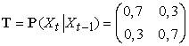
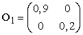
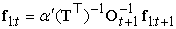
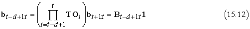
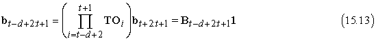
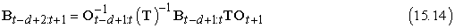
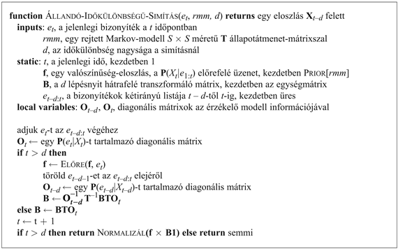

<?xml version="1.0" encoding="UTF-8" standalone="no"?>

<html xmlns="http://www.w3.org/1999/xhtml"><head><meta name="generator" content="DocBook XSL Stylesheets V1.76.1"/></head><body>

<h1 class="title"><a id="id692568"/>Rejtett Markov-modellek</h1>

Az előző fejezet időbeli valószínűségi következtetésre szolgáló algoritmusokat vezetett be egy általános keretben, ami független volt az állapotátmenet- és az érzékelő modellek speciális formájától. Ebben és a következő két alfejezetben, olyan konkrétabb modelleket és alkalmazásokat tárgyalunk meg, amelyek bemutatják az alapalgoritmusok erejét, és bizonyos esetekben további tökéletesítéseket tesznek lehetővé.

A <strong>rejtett Markov-modell</strong>ekkel (<strong>RMM</strong>) (<strong>hidden Markov model</strong>, <strong>HMM</strong>) kezdjük. Egy RMM egy olyan időbeli valószínűségi modell, amelyben a folyamat állapotát egyetlen diszkrét valószínűségi változó írja le. [A modell karakterisztikus tulajdonsága tehát a rejtett állapot, azaz a (sztochasztikus) állapotfejlődés és annak passzív (sztochasztikus) megfigyelése. Az index időértelmezése helyett bármely szekvenciális értelmezés lehetséges, gyakori például az indexnek mint egy egydimenziós pozíciónak az értelmezése is – <em>a ford.</em>] A változó lehetséges értékei a világ lehetséges állapotai. Az előző fejezetben leírt esernyős példa ezért egy RMM, mivel csak egyetlen állapotváltozója van az Esőt. Az RMM keretei között további állapotváltozók csak úgy adhatók hozzá az időbeli modellhez, hogy az összes állapotváltozót egyetlen „megaváltozóba” kombináljuk, amelynek az értékei az egyes állapotváltozók értékeinek minden lehetséges kombinációja. Látni fogjuk, hogy az RMM-ek korlátozott struktúrája lehetővé teszi az összes alapalgoritmus egy nagyon egyszerű és elegáns mátrixos átfordítását.[<a id="id692599" href="#ftn.id692599" class="footnote">158</a>] A 15.6. alfejezet bemutatja az RMM-ek használatát a beszédfelismerésben.

<h2 class="title"><a id="id692605"/>Egyszerűsített mátrix algoritmusok</h2>

Egyetlen, diszkrét <em>Xt</em> állapotváltozó esetén konkrét forma adható az állapotátmenet-modell, az érzékelő modell és az előre és hátra üzenetek reprezentációira. Jelöljük az <em>Xt </em>állapotváltozó értékeit 1, …, <em>S</em> egészekkel, ahol <em>S</em> a lehetséges állapotok száma. A <strong>P</strong>(<em>Xt</em> |<em>X</em>t–1) állapotátmenet-modell ekkor egy <strong>T S</strong> × <em>S</em> mátrix, ahol

<code class="code"><em>T</em>ij = <em>P</em>(<em>Xt </em>= <em>j</em>|<em>X</em>t–1 = <em>i</em>) </code>

Azaz <strong>T</strong>ij az átmenet valószínűsége <em>i</em>-ből <em>j</em>-be. Például az esernyős világban az állapotátmenet-mátrix

Az érzékelő modellt szintén mátrixalakra hozzuk. Ebben az esetben mivel az <em>Et</em> bizonyítékváltozó értéke ismert, mondjuk <em>et</em>, így a modellnek csak azt a részét használjuk, ami az <em>et</em> megjelenésének valószínűségét meghatározza. Minden <em>t</em> időpontra konstruálunk egy <strong>O</strong>t diagonális mátrixot, aminek az átlóbeli elemeit a <em>P</em>(<em>et</em>|<em>Xt </em>= <em>i</em>)<em> </em>értékek adják, a többi értéke pedig 0. Például az esernyős világban az 1. napon az <em>U</em>1 = <em>igaz</em>, így a 15.2. ábra szerint azt kapjuk, hogy

Most oszlopvektort használva az előre és hátra üzenetek reprezentálására, a számítások egyszerű mátrix-vektor műveletekké válnak. A (15.3) előrefelé egyenlet ekkor

<code class="code"><em>f</em>1:<em>t</em> + 1 = α<em>O</em><em>t </em>+ 1<em>T</em> ⊤<em>f</em>1:<em>t	</em>(15.10)</code>

és a (15.7) visszafelé egyenlet pedig

<code class="code"><em>b</em><em>k</em> + 1:<em>t</em><em> = </em><em>TO</em><em>k</em> + 1<em>b</em><em>k</em> + 2:<em>t	</em>(15.11)</code>

Ezekből az egyenletekből látható, hogy az előre-hátra algoritmus (lásd 15.4. ábra) időkomplexitása egy <em>t</em> hosszúságú sorozatra történő alkalmazásnál <em>O</em>(<em>S</em>2<em>t</em>),<em> </em>mivel minden lépés egy <em>S</em> elemű vektor szorzását igényli egy <em>S</em> × <em>S</em> mátrixszal. A tárigény pedig <em>O</em>(<em>St</em>), mivel az előrefelé fázis <em>t</em> darab <em>S</em> méretű vektort tárol el.

Amellett hogy a mátrixos jelölés az RMM-ek esetében a szűrés és a simítás algoritmusaira egy elegáns leírásmódot kínál, ez javított algoritmusokra is jelez lehetőségeket. Az első az előre-hátra algoritmus egy egyszerű változata, ami simítás elvégzését teszi lehetővé <em>állandó</em> tárigény mellett, a sorozat hosszától függetlenül. Az ötlet az, hogy egy konkrét <em>k</em> időpillanatban a simítás mind az <strong>f</strong>1:<em>k</em> előre, mind a <strong>b</strong><em>k</em>+1:<em>t</em> hátra üzenetek egyidejű jelenlétét igényli a (15.6) egyenlet szerint. Az előre-hátra algoritmus ezt úgy biztosítja, hogy az előrefelé fázisban tárolja az <strong>f</strong>-eket, hogy a hátrafelé fázisban elérhetők legyenek. Egy másik módszer szerint ez úgy érhető el, hogy egyetlen menetben mind <strong>f</strong>-et, mind <strong>b</strong>-t ugyanabban az irányban terjesztjük. Például az <strong>f </strong>„előre” üzenet terjeszthető hátrafelé, ha átrendezzük a (15.10) egyenletet, hogy a másik irányban működjön:

A módosított szűrési algoritmus úgy működik, hogy először lefut egy szabványos előre fázis, kiszámítva <strong>f</strong><em>t</em>:<em>t</em>-t (elfelejtve az összes közbenső eredményt), majd lefut egy visszafelé fázis együtt <strong>b</strong>-re<strong> </strong>és <strong>f</strong>-re, kiszámítva a simított becslést minden időpontban. Mivel mindegyik üzenetnek csak egy példánya szükséges, a tárigény állandó (azaz független <em>t</em>-től, a sorozat hosszától). Az algoritmusra egyetlen jelentős megkötés vonatkozik: az állapotátmenet-mátrixnak invertálhatónak kell lennie, és az érzékelő modellben nem lehetnek nullák – azaz minden megfigyelésnek lehetségesnek kell lenni minden állapotban.

A második terület, ahol a mátrixjelölés javítást jelez, a menet közben történő (online) simítás állandó időkülönbözettel. Az a tény, hogy a simítás elvégezhető állandó tárigénnyel azt jelzi, hogy léteznie kell egy hatékony rekurzív algoritmusnak menet közbeni simításra – azaz olyan algoritmusnak amelynek az időkomplexitása független az időkülönbözet hosszától. Tegyük fel, hogy az időkülönbözet <em>d</em>; azaz a simítást <em>t</em> – <em>d</em> időpontban végezzük, ahol <em>t</em> a jelenlegi időpont. A (15.6) egyenlet szerint ki kell számolnunk a <em>t </em>– <em>d</em> időpontra az

<code class="code">α <em>f</em>1:<em>t–d</em> <em>b</em><em>t–d</em>+1:<em>t</em></code>

értékét. Majd amikor az új megfigyelés beérkezik, a <em>t</em> – <em>d</em> + 1 időpontra kell kiszámítanunk az

<code class="code">α <em>f</em>1:<em>t–d</em>+1 <em>b</em><em>t–d</em>+2:<em>t</em>+1</code>

értéket. Hogyan tehető ez meg inkrementálisan? Először is, az <strong>f</strong>1:<em>t</em>–<em>d</em>+1 kiszámítható az <strong>f</strong>1:<em>t</em>–<em>d</em>-ből a szabványos szűrés műveletét használva a (15.3) egyenlet szerint.

A visszafelé üzenet inkrementális kiszámítása trükkösebb, mivel nincs egyszerű kapcsolat a régi <strong>b</strong><em>t–d</em>+1:<em>t</em> visszafelé üzenet és az új <strong>b</strong><em>t–d+2</em>:<em>t</em>+1 visszafelé üzenet között. Ehelyett, a régi <strong>b</strong><em>t–d</em>+1:<em>t</em> visszafelé üzenet  és a sorozat kezdő <strong>b</strong><em>t</em>+1:<em>t</em><em> </em>visszafelé üzenete közötti kapcsolatot fogjuk megvizsgálni. Ennek eléréséhez alkalmazzuk a (15.11) egyenletet <em>d</em> alkalommal, és azt kapjuk, hogy

ahol a <strong>B</strong><em>t</em>–<em>d+</em>1<em>:t</em> mátrix a <strong>T</strong> és az <strong>O</strong> mátrixok sorozatának a szorzata. A <strong>B</strong>-t felfoghatjuk egy „transzformációs operátornak”, ami egy későbbi visszafelé üzenetet egy korábbiba alakít. Egy hasonló egyenlet áll fenn az új visszafelé üzenetekre a következő megfigyelés beérkezése után:

Ha a (15.12) és a (15.13) egyenletben megvizsgáljuk a szorzatokat, láthatjuk, hogy egyszerű kapcsolat van közöttük: a második szorzathoz el kell „osztani” az első szorzatot <strong>TO</strong><em>t</em>–<em>d</em>+1-gyel, és megszorozni az új utolsó elemmel <strong>TO</strong><em>t</em>+1-gyel. Mátrixjelöléssel ekkor a régi és az új <strong>B</strong> mátrixok között egy egyszerű kapcsolat van:

Ez az egyenlet a <strong>B</strong> mátrix egy inkrementális frissítését adja, amely viszont (a (15.3) egyenlet által) lehetővé teszi az új <strong>b</strong>t–d+2:t+1 visszafelé üzenet kiszámítását. A teljes algoritmus, ami az <strong>f</strong> és <strong>B</strong> tárolását és frissítését igényli, a 15.6. ábrán látható.

<a id="id695126"/>
<strong>15.6. ábra - Egy állandó <em>d</em> lépésnyi időkülönbözettel simító algoritmus, folyamatos működésű (online) algoritmusként megvalósítva: egy új időpontbeli megfigyelésre kiadja az új simított becslést</strong>

 

[<a id="ftn.id692599" href="#id692599" class="para">158</a>]  A vektor- és mátrixművelekben járatlan olvasó számára hasznos lehet az A) függeléket átnézni, mielőtt a fejezetben továbbhaladna.

</body></html>
