<?xml version="1.0" encoding="UTF-8" standalone="no"?>

<html xmlns="http://www.w3.org/1999/xhtml"><head><meta name="generator" content="DocBook XSL Stylesheets V1.76.1"/></head><body>

<h1 class="title"><a id="id695139"/>Kalman-szűrők</h1>

Képzeljünk el egy kismadarat, amint a dzsungel sűrűjében repül szürkületkor: a mozgásának csupán rövid, szakaszos felvillanásait pillanthatjuk meg; minden igyekezetünkkel azt próbáljuk megjósolni, hogy hol van most a madár, és legközelebb hol fog felbukkanni, hogy nehogy szem elől tévesszük. Vagy képzeljük azt, hogy a második világháborúban radarkezelők vagyunk, egy gyenge, mozgó radarjelet kémlelve, ami 10 másodpercenként jelenik meg a képernyőn. Vagy, kissé még távolabbra visszalépve, képzeljük magunkat Kepler helyébe, ahogy a bolygók mozgását próbálja rekonstruálni igen pontatlan szögmérések sokaságából, amit rendszertelen és pontatlanul mért intervallumokban rögzítettek. Mindegyik esetben egy fizikai rendszer állapotát próbáljuk megbecsülni (helyet és sebességet például) időben egymást követő zajos megfigyelésekből. A problémát megfogalmazhatjuk egy időbeli valószínűségi modellben való következtetésként, ahol az állapotátmenet-modell a mozgás fizikáját írja le, az érzékelő modell pedig a mérési folyamatot. Ez a fejezet azokat a speciális reprezentációkat és következtetési algoritmusokat vizsgálja, amelyeket ilyen típusú problémákra fejlesztettek ki; a tárgyalt eljárást <strong>Kalman-szűrés</strong>nek (<strong>Kalman filtering</strong>) nevezik, a kidolgozója Rudolf E. Kalman[<a id="id695154" href="#ftn.id695154" class="footnote">159</a>] után.

Világos, hogy több <em>folytonos</em> változóra lesz szükségünk a rendszer állapotának megadásához. Például a madár repülése megadható egy (<em>X</em>, <em>Y</em>, <em>Z</em>) pozícióval és egy (<em>X</em>,<em> Y</em>,<em> Z</em>) sebességgel minden egyes időpillanatban. Szükségünk lesz még alkalmas feltételes sűrűségfüggvényekre az állapotátmenet- és érzékelő modellekhez; a 14. fejezethez hasonlóan, <strong>lineáris Gauss-eloszlás</strong>okat (<strong>linear Gaussian</strong>) fogunk használni. Ez azt jelenti, hogy a következő <strong>X</strong><em>t</em>+1 állapot a jelenlegi <strong>X</strong>t állapot lineáris függvénye, amihez még egy Gauss-zaj adódik, amely feltétel a gyakorlatban igen elfogadhatónak bizonyul. Tekintsük például a madár <em>X</em> koordinátáját, pillanatnyilag figyelmen kívül hagyva a többi koordinátát. Legyen a megfigyelések közötti intervallum Δ, és tételezzünk fel állandó sebességet; ekkor a pozíció frissítésére az adódik, hogy

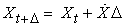

Ha Gauss-zajt adunk hozzá, akkor egy lineáris Gauss-féle állapotátmenet-modellt kapunk:

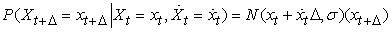

Az <strong>X</strong>t pozíció és 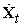 sebességvektorok alkotta rendszerhez tartozó Bayes-hálóstruktúra a 15.7. ábrán látható. Vegyük észre, hogy ez a lineáris Gauss-modellnek egy nagyon speciális alakja; az általános alakot a fejezetben később írjuk le, ami alkalmazások nagyon széles körét fedi le az első bekezdés egyszerű mozgásos példáin túl. Az olvasónak hasznos lehet az A) függelékben átnézni a Gauss-eloszlások egyes matematikai tulajdonságait; a jelenlegi céljainkhoz a legfontosabb, hogy egy <strong>többváltozós Gauss-eloszlás</strong>t (<strong>multivariate Gaussian</strong>) <em>d</em> változó esetén egy <em>d</em> elemű <em><strong>μ</strong></em> átlag és egy <em>d</em> × <em>d</em>-s <strong>Σ</strong> kovarianciamátrix ad meg.

<a id="id695294"/>
<strong>15.7. ábra - Egy Xt hely,  sebesség és Zt helymegfigyelés alkotta lineáris dinamikus rendszerhez tartozó Bayes-hálóstruktúra</strong>

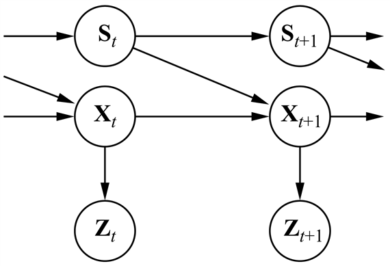

<h2 class="title"><a id="id695328"/>Gauss-eloszlások frissítése</h2>

A 14. fejezetben hivatkoztunk a lineáris Gauss-eloszlások családjának egy alaptulajdonságára: az eloszláscsalád zárt a standard Bayes-hálóbeli műveletekre. Most ezt az állítást pontosítjuk az időbeli valószínűségi modellben végzett szűrés esetére. A megkövetelt tulajdonságok megfelelnek a szűrés (15.3) egyenletben megadott kétlépéses számításának:

<ol class="orderedlist"><li class="listitem">
Ha a jelenlegi <strong>P</strong>(<strong>X</strong>t|<strong>e</strong>1:<em>t</em>) eloszlás Gauss-eloszlás és a <strong>P</strong>(<strong>X</strong><em>t</em>+1|<strong>x</strong>t) állapotátmenet-modell lineáris Gauss-modell, akkor az egylépéses előrejelzés eloszlása 
</li></ol>

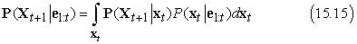

	szintén Gauss-eloszlás.

<ol class="orderedlist"><li class="listitem">
Ha az előrejelzés <strong>P</strong>(<strong>X</strong><em>t</em>+1|<strong>e</strong>1:<em>t</em>) eloszlása Gauss-eloszlás és a <strong>P</strong>(<strong>e</strong><em>t</em>+1|<strong>X</strong><em>t</em>+1) érzékelő modell lineáris Gauss-modell, akkor az új bizonyítékkal, mint feltétellel, a frissített eloszlás
</li></ol>

<code class="code"><em>P</em>(<em>X</em>t+1|<em>e</em>1:t+1) = α<em>P</em>(<em>e</em>t+1|<em>X</em>t+1)<em>P</em>(<em>X</em>t+1|<em>e</em>1:t) 	(15.16)</code>

szintén Gauss-eloszlás.

Így a Kalman-szűrés <code class="code">ELŐRE</code> művelete fogad egy t átlaggal és t kovarianciamátrixszal meghatározott <strong>f</strong>1:<em>t</em> Gauss előre üzenetet, és előállít egy új többváltozós <strong>f</strong>1:<em>t</em>+1<em> </em>Gauss előre üzenetet <em><strong>μ</strong></em><em>t</em>+1 átlaggal és <strong>Σ</strong><em>t</em>+1 kovarianciamátrixszal. Így, ha egy <strong>f</strong>1:0= <strong>P</strong>(<strong>X</strong>0) = <em>N</em>(<em><strong>μ</strong></em>0, <strong>Σ</strong>0) Gauss-eloszlással indulunk, egy lineáris Gauss-modellel való szűrés az állapotokon Gauss-eloszlást eredményez minden időpontban.

<h3 class="title">Fontos</h3>
Ez tetszetős és elegáns eredménynek tűnik, de miért is olyan fontos? Ennek a magyarázata az, hogy a most tárgyalt esethez hasonló néhány speciális esetet kivéve, <em>a szűrés folytonos vagy hibrid (diszkrét és folytonos) hálókkal olyan állapoteloszlásokat generál, amelyek reprezentációja az idővel korlátlanul nő</em>. Ezt az állítást általában nem könnyű bizonyítani, de a 15.5. feladat egy egyszerű példán mutatja be, hogy mi történik.

<h2 class="title"><a id="id695612"/>Egy egyszerű egydimenziós példa</h2>

Azt állítottuk, hogy a Kalman-szűrés <code class="code">ELŐRE</code> művelete egy Gauss-eloszlást egy új Gauss-eloszlásba visz át. Ez új átlag- és kovarianciamátrix kiszámítását jelenti az előző átlagból és kovarianciamátrixból. Az általános (többváltozós) eset frissítési szabályának származtatása igen sok lineáris algebrai lépést igényel, így egyelőre a nagyon egyszerű egyváltozós esetnél maradunk, és később adjuk meg az eredményeket az általános esetre. A számítások még az egyváltozós esetre is unalmasak kissé, de úgy érezzük, hogy érdemes látni őket, mivel a Kalman-szűrő hasznossága olyan szorosan kötődik a Gauss-eloszlások matematikai tulajdonságaihoz.

A tárgyalt időbeli modell egyetlen folytonos <em>Xt</em> állapotváltozós <strong>véletlen bolyongás</strong>t (<strong>random walk</strong>) ír le egy zajos <em>Zt </em>megfigyeléssel. Egy példa lehet erre a „vásárlói bizalom” mutatója, amit modellezhetünk úgy, mint ami havonként egy véletlen Gauss-eloszlású változáson megy át, és amelyet egy véletlen vásárlói kérdőív mér fel, ami szintén Gauss-mintavételi zajt okoz. Az a priori eloszlást gaussinak tételezzük fel 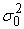 szórásnégyzettel:

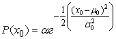

(Az egyszerűség kedvéért ebben a fejezetben ugyanazt az α szimbólumot fogjuk használni minden normalizációs állandó jelölésére.) Az állapotátmenet-modell egyszerűen a jelenlegi állapot egy Gauss-eloszlású módosítását jelenti állandó 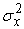 szórásnégyzettel:

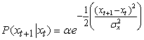

Az érzékelő modell egy Gauss-eloszlású zajt tételez fel 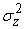 szórásnégyzettel:

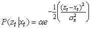

Most, az a priori <em>P</em>(<em>X</em>0) eloszlás ismeretében kiszámíthatjuk az egylépéses előrejelzés eloszlását felhasználva a (15.15) egyenletet:

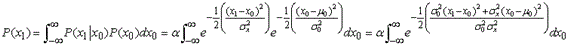

Az integrál igen bonyolultnak néz ki. A továbbhaladás lehetőségét annak észrevétele jelenti, hogy a kitevő két olyan kifejezés összege, amelyek négyzetesek x0-ban, és így az maga is négyzetes x0-ban. Egy egyszerű trükk, amit teljes négyzetté kiegészítésként (completing the square) ismerünk, lehetővé teszi bármely 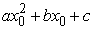<em> </em>átírását egy 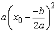  négyzetes tag és egy 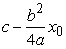 <em>x</em>0-tól független maradék tag összegévé. A maradék tag az integrálból kivihető, így azt kapjuk, hogy

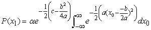

Most az integrál pontosan egy Gauss-eloszlás teljes tartomány feletti integrálja, ami egyszerűen 1-et ad. Így csupán a maradék tag maradt a négyzetesből.

A második kulcslépés annak észrevétele, hogy a maradék tagnak <em>x</em>1<em>-</em>ben négyzetesnek kell lennie; valóban, egyszerűsítés után azt kapjuk, hogy

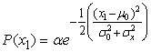

<a id="id695787"/>
<strong>15.8. ábra - A Kalman-szűrés frissítési ciklusának a lépései egy véletlen bolyongás esetén. A véletlen bolyongás a priori eloszlása <em>μ</em>0 = 0,0 és σ 0 = 1,0, az átmenet bizonytalansága σ x = 2,0, az érzékelő bizonytalansága σ z = 1,0, az első megfigyelés pedig <em>z</em>1 = 2,5 (az <em>x</em> tengelyen csillaggal jelölve).Vegyük észre, ahogy a <em>P</em>(<em>x</em>1) előrejelzés ellapul a <em>P</em>(<em>x</em>0)-hoz képest az átmenet bizonytalansága miatt. Vegyük azt is észre, hogy az a posteriori <em>P</em>(<em>x</em>1|<em>z</em>1) kissé balra helyezkedik el a <em>z</em>1 megfigyeléstől, mivel az átlag az előrejelzés és a megfigyelés súlyozott átlaga.</strong>

Azaz az egylépéses előrejelzés eloszlása Gauss-eloszlás, ugyanazzal a <em>μ</em>0 átlaggal, a szórásnégyzet pedig egyenlő az eredeti  szórásnégyzetnek és az átmenet  szórásnégyzetének az összegével. Egy pillanatnyi belegondolás után ez szemléletesen is elfogadhatónak tűnik. 

A frissítés lépésének befejezéséhez még szükséges, hogy az első időpontbeli megfigyelést, <em>x</em>1-t feltételként vegyük számításba. A (15.16) egyenletből erre az adódik, hogy

Most ismét kombináljuk a kitevőket, és négyzetté egészítsük ki (15.6 feladat), azt kapva, hogy

így egy frissítési ciklus után egy új Gauss-eloszlásunk van az állapotváltozóra.

A (15.17) egyenletben a Gauss-alakból láthatjuk, hogy az új átlag és szórás kiszámítható a régi átlagból és szórásból a következőképpen:

A 15.8. ábrán látható egy frissítési ciklus az állapotátmenet- és az érzékelő modell konkrét értékei esetén.

Az előző egyenletpár pontosan ugyanazt a szerepet játssza, mint az <em>általános szűrés egyenlete </em>(15.3) vagy az <em>RMM-szűrés egyenlete </em>(15.10). A Gauss-eloszlások speciális tulajdonsága miatt azonban az egyenleteknek van néhány további érdekes tulajdonsága. Először is, hogy az új <em>μ</em><em>t</em>+1 átlag kiszámítása értelmezhető úgy, mint egyszerűen az új <em>z</em><em>t</em>+1 megfigyelés és a régi <em>μt</em> átlag <em>súlyozott átlaga</em>. Ha a megfigyelés megbízhatatlan, akkor  nagy, és több figyelmet szentelünk a régi átlagnak; ha a régi átlag megbízhatatlan (t2  nagy), vagy a folyamat nehezen megjósolható ( nagy), akkor több figyelmet szentelünk a megfigyelésnek. Másodszor, vegyük észre, hogy a  szórásnégyzet frissítése <em>független a megfigyeléstől</em>. Ezért előre kiszámíthatjuk, hogy mi lesz a szórásnégyzetértékek sorozata. Harmadszor, a szórásnégyzetértékek sorozata gyorsan konvergál egy adott értékhez, ami csak  -től és -től függ, ezáltal lényegesen egyszerűsítve az elkövetkező számításokat (lásd 15.7. feladat).

<h2 class="title"><a id="id696029"/>Az általános eset</h2>

Az előző levezetés szemléletesen bemutatta a Gauss-eloszlásoknak azt az alaptulajdonságát, ami a Kalman-szűrés működését lehetővé teszi: azt a tényt, hogy az exponens négyzetes alakú. Ez nem csak az egyváltozós esetre igaz; a teljes többváltozós Gauss-eloszlás alakja:

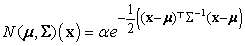

A kitevőben lévő tényezők összeszorzása láthatóvá teszi, hogy a kitevő is négyzetes függvénye az <strong>x</strong>-ben lévő <em>xi</em> valószínűségi változóknak. Ahogy az egyváltozós esetben, a szűrési frissítés megőrzi az állapoteloszlás gaussi voltát.

Elsőként definiáljuk a Kalman-szűrésnél használt általános időbeli modellt. Mind az állapotátmenet-modell, mind az érzékelő modell lineáris transzformációt enged meg additív Gauss-zajjal. Így azt kapjuk, hogy

<code class="code"><em>P</em>(<em>x</em><em>t+</em>1|<em>x</em>t) = <em>N</em>(<em>Fx</em>t, <em>Σ</em>x)(<em>x</em><em>t</em>+1)</code>

<code class="code"><em>P</em>(<em>z</em>t|<em>x</em>t) = <em>N</em>(<em>Hx</em>t, <em>Σ</em>z)(<em>z</em>t)										(15.19)</code>

ahol az <strong>F </strong>és a <strong>Σ</strong>x mátrixok a lineáris állapotátmenet-modellt és az átmeneti zaj kovarianciáját írják le, a <strong>H </strong>és a <strong>Σ</strong>z pedig az érzékelő modell megfelelő mátrixai. Ekkor az átlag és a kovariancia frissítésének az egyenletei a maguk rémisztő valóságában:

<code class="code"><em><em>μ</em>t</em>+1 = <em>F<em>μ</em>t</em> + <em>K</em><em>t</em>+1(<em>z</em><em>t</em>+1 – <em>HF<em>μ</em>t</em>)</code>

<code class="code"><em>Σ</em><em>t</em>+1 = (<em>I</em> – <em>K</em><em>t</em>+1)(<em>FΣ</em>t<em>F</em>⊤ + <em>Σ</em>x)									(15.20)</code>

ahol a <strong>K</strong><em>t</em>+1 = (<strong>FΣ</strong>t<strong>F</strong>⊤ + <strong>Σ</strong>x)<strong>H</strong>⊤(<strong>H</strong>(<strong>FΣ</strong>t<strong>F</strong>⊤ + <strong>Σ</strong>x)<strong>H</strong>⊤ + <strong>Σ</strong>z)-1 mennyiség neve a <strong>Kalman-erősítésmátrix</strong> (<strong>Kalman gain matrix</strong>). Akár hihető, akár nem, ezeknek az egyenleteknek lehetséges egy szemléletes értelmezése. Például, gondoljuk meg a <em><strong>μ</strong></em> állapotátlag-becslés frissítését. Az <strong>F<strong>μ</strong>t </strong>tag a <em>t</em>+1 időpontban előre jelzett állapot, így <strong>HF<strong>μ</strong>t </strong>az előre jelzett megfigyelés. Ezért a <strong>z</strong><em>t</em>+1 – <strong>HF<strong>μ</strong>t </strong> tag az előre jelzett megfigyelés hibáját reprezentálja. Ez van megszorozva a <strong>K</strong><em>t</em>+1 tényezővel az előre jelzett állapot korrigálásához; így a <strong>K</strong><em>t</em>+1 annak mértéke, hogy mennyire kell figyelembe venni az új megfigyelést az előrejelzéshez képest. Ahogyan a (15.18) egyenletben, az a tulajdonság most is fennáll, hogy a szórásnégyzet frissítése független a megfigyeléstől. A <strong>Σ</strong>t<strong> </strong>és a <strong>K</strong>t értékek sorozata ezért előre (offline) is kiszámolható, és a követés közben szükséges konkrét számítások igen mérsékeltek.

Hogy bemutassuk az egyenletek működését egy <em>X</em>–<em>Y</em> síkon mozgó tárgy követésének a problémájára alkalmaztuk őket. Az állapotváltozók az 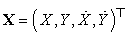, így az <strong>F</strong>,<strong> </strong><strong>Σ</strong>x,<strong> </strong><strong>H</strong> és<strong> Σ</strong> z 4 × 4-es mátrixok. A 15.9. (a) ábrán látható az igazi pályagörbe, a zajos megfigyelések sorozata és a Kalman-szűréssel becsült pályagörbe végig a kovarianciával, amit az egységnyi szórás méretű körvonalak jeleznek. A szűrési folyamat jól teljesít az aktuális mozgás követésében, és ahogy várható, a szórásnégyzet gyorsan beáll egy rögzített értékre.

Ahogyan szűrésre, úgy <em>simításra</em> is származtathatók egyenletek lineáris Gauss-modell esetén. A simítás eredményei a 15.9. (b) ábrán láthatók. Vegyük észre, hogy a helyzetbecslés szórásnégyzete gyorsan lecsökken, a pályagörbe végét leszámítva (itt miért nem?), és hogy a simítással becsült pályagörbe sokkal egyenletesebb.

<a id="id696491"/>
<strong>15.9. ábra - (a) A Kalman-szűrés eredménye egy<em> X–Y </em>síkon mozgó objektumnál, feltüntetve a valódi (balról jobbra haladó) pályagörbét, a zajos megfigyelések egy sorozatát és a Kalman-szűrés alapján becsült pályagörbét. A helybecslések szórásait az oválisok jelzik. (b) A Kalman-simítás eredménye ugyanarra a megfigyelési sorozatra.</strong>

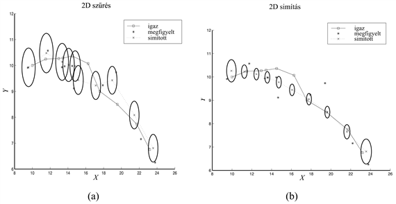

<h2 class="title"><a id="id696504"/>A Kalman-szűrés alkalmazhatósága</h2>

A Kalman-szűrést és kiterjesztéseit alkalmazások széles körében használják. A „klaszszikus” alkalmazás légi járművek és rakéták radar követése. Kapcsolódó alkalmazások között van a tengeralattjárók és földi járművek akusztikai követése, és járművek és emberek képi követése. Egy kissé elvontabb szemlélettel a Kalman-szűrőket részecskék buborékkamrás pályagörbéjének rekonstrukciójára, valamint óceáni áramlások felszíni műholdképek alapján történő rekonstrukciójára használják. Az alkalmazások köre sokkal szélesebb, mint csupán mozgások követése: bármely rendszerre alkalmazható, ami folytonos állapotváltozókkal és zajos megfigyelésekkel jellemezhető. Ilyen rendszerek magukban foglalnak zúzdákat, vegyi üzemeket, nukleáris reaktorokat, növényi ökoszisztémákat és nemzetgazdaságokat.

A Kalman-szűrés alkalmazhatóságának ténye egy rendszerre nem jelenti, hogy az eredmények érvényesek vagy hasznosak lesznek. A feltevések – lineáris Gauss-féle állapotátmenet-modell és érzékelő modell – igen erősek. A <strong>kiterjesztett Kalman-szűrő</strong> (<strong>KKSZ</strong>) (<strong>extended Kalman filter</strong>, <strong>EKF</strong>) megpróbál úrrá lenni a modellezett rendszer nemlineáris tulajdonságain. Egy rendszer nemlineáris, ha az állapotátmenet-modell nem írható le, mint az állapotvektor mátrixszorzata, ahogyan ez a (15.19) egyenletben<em> </em>szerepel. A KKSZ úgy működik, hogy rendszert <strong>x</strong>t-ben<em> lokálisan</em> lineárisként modellezi az <strong>xt </strong>= <em><strong>μ</strong>t</em> környezetében, ahol <em><strong>μ</strong>t</em> a jelenlegi állapoteloszlás átlaga. Ez jól működik „sima”, „jó magaviseletű” rendszereknél, és lehetővé teszi a követőnek, hogy egy olyan Gauss-állapoteloszlást tartson nyilván és frissítsen, ami elfogadható közelítése az igazi a posteriori eloszlásnak.

Azonban mit is jelent, hogy egy rendszer „nem sima” vagy „rossz magaviseletű”? Technikailag ez azt jelenti, hogy jelentős nemlinearitás van jelen a rendszer viselkedésében abban a régióban, ami „közel” van a jelenlegi <em><strong>μ</strong>t</em> átlaghoz (a <strong>Σ</strong>t kovarianciamátrix szerint). Ennek a tulajdonságnak a nem technikai megértéséhez gondoljunk arra a példára, amikor egy dzsungelben szálló madár követésével próbálkoztunk. A madár nagy sebességgel egyenesen egy fatörzs felé tart. A Kalman-szűrő, akár reguláris, akár kiterjesztett a madár pozíciójára, csak Gauss-előrejelzést adhat, és ennek a Gaussnak az átlaga a fatörzs közepére esik, ahogyan a 15.10. (a) ábrán látható. A madár egy elfogadható modellje azonban egy elkerülő műveletet jelezne előre egyik vagy másik oldalra, ahogy az a 15.10. (b) ábrán látható. Egy ilyen modell erősen nemlineáris, mivel a madár döntése nagyon eltérő a fatörzshöz vett pontos pozíciójának függvényében. 

<a id="id696594"/>
<strong>15.10. ábra - Egy fa felé repülő madár (felülnézetben). (a) Egy Kalman-szűrő előrejelzése a madár helyzetére, ami egyetlen Gauss-eloszlás az akadály közepére illesztve. (b) Egy valósághűbb modell számításba veszi a madár elkerülő manővereit, és azt jelzi előre, hogy az egyik vagy a másik oldalon fog elszállni.</strong>

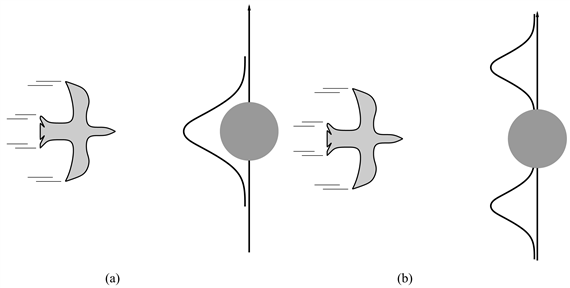

Ilyen példák kezeléséhez nyilvánvalóan egy kifejezőbb nyelvre van szükségünk a modellezett rendszer viselkedésének a reprezentálásához. A szabályozáselmélet területén, ahol olyan problémák, mint például egy repülőgép elkerülő manőverezése ugyanilyen típusú bonyodalmakat vetnek fel, a megszokott megoldás a <strong>váltó Kalman-szűrő</strong> (<strong>switching Kalman filter</strong>). Ebben a megközelítésben, több Kalman-szűrő fut párhuzamosan, mindegyik a rendszer különböző modelljét használva – például egy az egyenes repülésre, egy az éles balra fordulásra és egy az éles jobbra fordulásra. Az előrejelzéseknek egy súlyozott összegét használjuk, ahol a súly attól függ, hogy mennyire illeszkednek az egyes szűrők az aktuális adatokhoz. A következő fejezetben látni fogjuk, hogy ez egyszerűen az általános dinamikus Bayes-háló modell egy speciális esete, amit a 15.7. ábrán látható hálóból egy diszkrét „manőver” állapotváltozó hozzáadásával nyerünk. A váltó Kalman-szűrőket a 15.5. feladat tárgyalja tovább.

 

[<a id="ftn.id695154" href="#id695154" class="para">159</a>]  Rudolf E. Kalman (Kálmán Rudolf) magyar származású matematikus.

</body></html>
