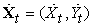
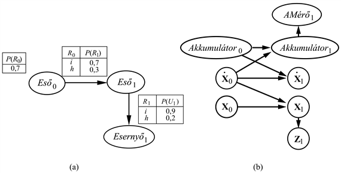
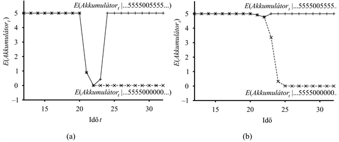
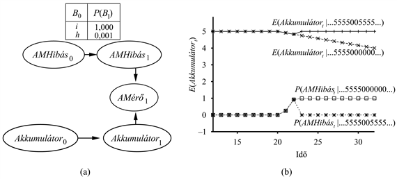
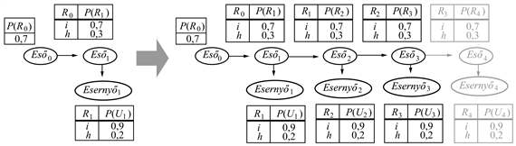
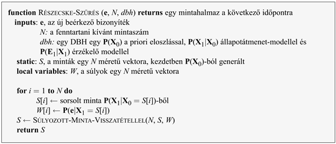
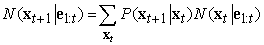

<?xml version="1.0" encoding="UTF-8" standalone="no"?>
<!DOCTYPE html PUBLIC "-//W3C//DTD XHTML 1.1//EN" "http://www.w3.org/TR/xhtml11/DTD/xhtml11.dtd">
<html xmlns="http://www.w3.org/1999/xhtml"><head><meta name="generator" content="DocBook XSL Stylesheets V1.76.1"/></head><body>

<h1 class="title"><a id="id696617"/>Dinamikus Bayes-hálók</h1>

Egy <strong>dinamikus Bayes-háló</strong> vagy <strong>DBH</strong> (<strong>dynamic Bayesian network</strong>, <strong>DBN</strong>) egy olyan Bayes-háló, ami egy a 15.1. alfejezetben leírt típusú időbeli valószínűségi modellt reprezentál. (Ahogy korábban is említettük az index időbeli értelmezése helyett bármely szekvenciális értelmezés lehetséges, gyakori például az indexnek mint egy egydimenziós helyzeti pozíciónak az értelmezése is – <em>a ford.</em>) A DBH-kra már láttunk példákat, a 15.2. ábrán az esernyős hálót és a 15.7. ábrán a Kalman-szűrő hálót. Általában egy DBH minden egyes szeletének tetszőleges számú állapotváltozója (<strong>X</strong>t) és bizonyítékváltozója (<strong>E</strong>t) lehet. Az egyszerűség kedvéért fel fogjuk tenni, hogy a változók és kapcsolataik szeletről szeletre pontosan ismétlődnek, és hogy a DBH egy elsőrendű Markov-folyamatot reprezentál, így minden változónak csak a saját szeletében vagy a közvetlenül megelőző szeletben lehetnek szülei.

<h3 class="title">Fontos</h3>
Nyilvánvaló, hogy minden rejtett Markov-modell reprezentálható mint egy DBH, egyetlen állapotváltozóval és egyetlen bizonyítékváltozóval. Az is fennáll, hogy minden diszkrét változós DBH reprezentálható mint egy RMM; ahogyan a 15.3. alfejezetben megmutattuk, a DBH összes állapotváltozója összekombinálható egyetlen állapotváltozóvá, aminek az értékei az egyes állapotváltozók értékeinek az összes lehetséges együttese. Azonban ha minden RMM egy DBH, és minden DBH átfordítható egy RMM-be, akkor mi a különbség? A különbség abban rejlik, hogy <em>egy komplex rendszer állapotának az őt alkotó változókra történő dekomponálásával a DBH képes kihasználni az időbeli valószínűségi modell ritkaságát</em>. Tegyük fel például, hogy egy DBH-nak 20 bináris állapotváltozója van, amelyek mindegyikének három szülője van az előző szeletben. Ekkor a DBH állapotátmenet-modellje 20 × 23  =160 valószínűségi értéket tartalmaz, míg a hozzátartozó RMM-nek 220 állapota és ezért 240, azaz durván egybillió átmenet-valószínűség értéke van az állapotátmenet-mátrixban. Ez legalább három ok miatt is rossz: először, hogy az RMM maga sokkal több tárat igényel, másodszor, hogy a hatalmas állapotátmenet-mátrix az RMM-következtetést sokkal költségesebbé teszi, harmadszor, hogy ilyen hatalmas számú paraméter megtanulásának problémája a tiszta RMM-modelleket alkalmazhatatlanná teszi nagy problémák esetén. A DBH-k és az RMM-ek közötti kapcsolat nagyjából analóg a hagyományos Bayes-hálók és a teljes táblázatos együttes eloszlások közötti kapcsolathoz.

Már megmutattuk, hogy minden Kalman-szűrő reprezentálható egy DBH-ban folytonos változókkal és lineáris Gauss feltételes eloszlásokkal (lásd 15.7. ábra). Az előző fejezet végén tárgyaltak miatt azzal is tisztában kell lenni, hogy <em>nem</em> minden DBH reprezentálható egyetlen Kalman-szűrő modellel. Egy Kalman-szűrőnél az aktuális állapoteloszlás mindig egy egyedülálló többváltozós Gauss-eloszlás – azaz egyetlen „dudor” egy konkrét helyen. A DBH-k ezzel szemben tetszőleges eloszlást képesek modellezni. Számos valós alkalmazásnál ez a rugalmasság elengedhetetlen. Gondoljuk meg például a kulcsaim jelenlegi helyét. Lehetnek a zsebeimben, az éjjeli szekrényen, a konyhapulton vagy a bejárati ajtóban himbálódzva. Egyetlen Gauss-dudornak, ami ezt az összes helyet magában foglalja, jelentős valószínűséget kell rendelni ahhoz, hogy a kulcsok az előszobában a levegőben vannak. A valós világ olyan aspektusai, mint céltudatos ágensek, akadályok és zsebek „nemlinearitásokat” vezetnek be, amelyek diszkrét és folytonos változók kombinációját igénylik, hogy egy elfogadható modellhez jussunk.

<h2 class="title"><a id="id696686"/>DBH-k létrehozása</h2>

Egy DBH létrehozásához háromfajta információt kell megadni: a <strong>P</strong>(<strong>X</strong>0) a priori eloszlást az állapotváltozók felett; a <strong>P</strong>(<strong>X</strong><em>t</em>+1|<strong>X</strong>t) állapotátmenet-modellt; és a <strong>P</strong>(<strong>E</strong>t|<strong>X</strong>t) érzékelő modellt. Az állapotátmenet- és érzékelő modell megadásához, meg kell adni az egymást követő szeletek közötti és az állapot- és bizonyítékváltozók közötti kapcsolatok topológiáját. Mivel az állapotátmenet- és érzékelő modelleket stacionáriusnak – minden <em>t</em>-re azonosnak – tételezzük fel, a legkényelmesebb egyszerűen az első szeletre megadni őket. Például az esernyős világ teljes DBH-specifikációját megadja az a három csomópontos háló, ami a 15.11. (a) ábrán látható. Ebből a specifikációból a teljes (egyik irányban végtelen) DBH megkonstruálható az első szelet megfelelő másolásával.

Gondoljunk most át egy érdekesebb példát: egy akkumulátorhajtású, az <em>X</em>–<em>Y</em> síkon mozgó robot követesét, ahogyan azt a 15.1. alfejezetben bevezettük. Elsőként szükségünk van állapotváltozókra, amelyek mind az <strong>X</strong>t = (<em>Xt</em>, <em>Yt</em>) pozíció-, mind az  sebességkomponenseket magukban foglalják. Feltételezünk valamilyen pozíciómérő módszert – akár egy rögzített kamerát vagy egy felszíni GPS-t (Global Positioning System) –, ami a <strong>Z</strong>t méréseket eredményezi. A pozíció a következő időpontban a jelenlegi pozíciótól és sebességtől függ, ugyanúgy, mint a standard Kalman-szűrő modellben. A sebesség a következő időpontban a jelen sebességtől és az akkumulátor állapotától függ. Felveszünk még egy <em>Akkumulátort </em>változót az aktuális akkumulátor töltési szintjének reprezentálására, aminek szülői az előző akkumulátorszint és a sebesség, és felveszünk még egy <em>AMérőt</em> változót, ami az akkumulátor töltési szintjét méri. Ez szolgáltatja a 15.11. (b) ábrán látható alapmodellt.

Érdemes részletesebben megvizsgálni az <em>AMérőt</em>-hez tartozó érzékelőmodell tulajdonságait. Tegyük fel az egyszerűség kedvéért, hogy mind az <em>Akkumulátort</em>, mind az <em>AMérőt</em> diszkrét értékeket vehetnek fel 0-tól 5-ig – igen hasonlóan egy tipikus laptop számítógép akkumulátormérőjéhez. Ha a mérő mindig pontos akkor a <strong>P</strong>(<em>AMérőt</em>|<em>Akkumulátort</em>) FVT-nek végig 1,0 valószínűségeket kell tartalmaznia az „átlójában” és 0,0 valószínűségeket máshol. A valóságban a mérésekben a zaj mindig felbukkan. Folytonos mérésekre, egy kis szórású Gauss-eloszlást lehetne ehelyett használni.[<a id="id698679" href="#ftn.id698679" class="footnote">160</a>] A diszkrét változóinknál a Gauss-eloszlást egy olyan eloszlással közelíthetjük, amelyben a hiba valószínűsége a megfelelő módon csökken, így nagy hiba valószínűsége igen kicsi. A <strong>Gauss-hibamodell</strong> (<strong>Gaussian error model</strong>) kifejezést fogjuk használni mind a folytonos, mind a diszkrét változatokra.

<a id="id698700"/>
<strong>15.11. ábra - (a) Az esernyős DBH-hoz tartozó a priori eloszlás, az állapotátmenet-modell és az érzékelő modell megadása. Az összes következő szelet feltevésünk szerint az 1. szelet másolata. (b) Egy <em>X</em>–<em>Y</em> síkon való robotmozgáshoz tartozó egyszerű DBH.</strong>

A robotikában bárki, aki egy kevés gyakorlattal rendelkezik a számítógépes folyamatvezérlésben vagy az automatikus érzékelés más eseteiben, rögtön tanúskodik arról a tényről, hogy a kis mennyiségű mérési hiba gyakran a legkevésbé fontos a problémák között. Ugyanis a valódi érzékelők elromlanak, és amikor egy érzékelő elromlik, akkor nem küld szükségszerűen egy jelet azzal, hogy „Ó, egyébiránt az adat, amit küldök, egy halom zagyvaság.” Ehelyett egyszerűen küldi a zagyvaságot. A meghibásodás legegyszerűbb formáját <strong>átmeneti hibá</strong>nak (<strong>transient failure</strong>) nevezik, amikor az érzékelő alkalmanként elhatározza, hogy valami zagyvaságot küld. Például az akkumulátor szintérzékelőjének lehet olyan szokása, hogy nullát küld, amikor valaki meglöki a robotot, még akkor is, ha az akkumulátor teljesen fel van töltve.

Lássuk, mi történik, amikor egy átmeneti hiba bekövetkezik egy Gauss-hibamodellnél, ami nem tudja kezelni az ilyen hibákat. Tételezzük fel például, hogy a robot csendesen üldögél, és 20 egymást követő mérés az akkumulátoron 5-öt ad. Ezután az akkumulátormérő időleges kiesése miatt a következő mérés eredménye <em>AMérő</em>21 = 0. Mire kell következtetnünk egy egyszerű Gauss-hibamodellből az <em>Akkumulátor</em>21-gyel kapcsolatban. A Bayes-szabály szerint a válasz függ mind a <strong>P</strong>(<em>AMérő</em>21 = 0|<em>Akkumulátor</em>21) érzékelő modelltől, mind a <strong>P</strong>(<em>Akkumulátor</em>21|<em>AMérő</em>1:20) előrejelzéstől. Ha egy nagy érzékelési hiba valószínűsége szignifikánsan kisebb, mint az <em>Akkumulátor</em>21 = 0-ba való átmenet valószínűsége, még ha ez utóbbi nagyon valószínűtlen is, akkor az a posteriori eloszlás nagy valószínűséget fog rendelni a lemerült akkumulátorhoz. Egy második nulla értékű mérési eredmény <em>t </em>= 22-nél ezt a konklúziót majdnem biztossá teszi. Ha az átmeneti hiba aztán eltűnik, és a jelzett érték visszaáll 5-re <em>t </em>= 23-tól, akkor az akkumulátorszint becslése gyorsan vissza fog állni 5-re, szinte varázsütésre. Ezt az eseménysort mutatja be a 15.12. (a) ábra felső görbéje, ami az <em>Akkumulátort</em> várható értékét mutatja idő szerint egy diszkrét Gauss-hibamodellt használva. 

<a id="id698799"/>
<strong>15.12. ábra - (a) Felső görbe: az Akkumulátort várható értékének a pályagörbéje egy olyan megfigyelési sorozatnál, ami csak 5-ösöket tartalmaz, kivéve a 0-kat a t = 21 és a t = 22 időpontokban, egy egyszerű Gauss-hibamodell felhasználásával. Alsó görbe: a pályagörbe, amikor a megfigyelések 0-val folytatódnak t = 21-től. (b) Ugyanez a kísérlet az átmenetihiba-modellel elvégezve. Vegyük észre, hogy az átmeneti hibát jól kezeli, de a végleges hiba túlzott pesszimizmust eredményez.</strong>

<h3 class="title">Fontos</h3>
A helyreállás ellenére előfordul (<em>t</em> = 22-nél), hogy a robot meg van győződve, hogy az akkumulátora lemerült; feltehetően ekkor ki kell küldenie egy segítség jelet, és le kell kapcsolnia. Sajnos a túlegyszerűsített érzékelő modellje tévútra vezette. Hogyan lehet ezt kijavítani? Gondoljunk egy ismerős példára az emberek mindennapos vezetési gyakorlatából: éles kanyarokban vagy meredek hegyeken néha felvillan az „üzemanyagtartály üres” figyelmeztető lámpa. A segélykérő telefon keresése helyett inkább az szokott az ember eszébe jutni, hogy az üzemanyagmérő gyakran igen nagy hibákat ad, amikor az üzemanyag lötyög a tartályban. A történet tanulsága a következő: <em>az érzékelő hibájának helyes kezeléséhez a rendszer érzékelő modelljének tartalmaznia kell a meghibásodás lehetőségét</em>.

Egy érzékelő legegyszerűbb hibamodellje egy bizonyos valószínűséggel megengedi, hogy az érzékelő teljesen helytelen értéket adjon vissza, függetlenül a világ valódi állapotától. Például ha az akkumulátormérő 0-t visszaadva hibázik, azt mondhatjuk, hogy

<code class="code"><em>P</em>(<em>AMérőt </em>= 0|<em>Akkumulátort </em>= 5) = 0,03</code>

ami feltételezhetően sokkal nagyobb, mint az a valószínűség, amit az egyszerű Gauss-hibamodell rendelne hozzá. Hívjuk ezt az <strong>átmenetihiba-modell</strong>nek (<strong>transient failure model</strong>). Hogyan segít ez, amikor a 0 jelzéssel kerülünk szembe? Feltételezve, hogy az az <em>előre jelzett</em> valószínűség, hogy az akkumulátor lemerült, az eddigi jelzések alapján sokkal kisebb, mint 0,03, akkor az <em>AMérő</em>21 = 0 megfigyelés legjobb magyarázata az, hogy az érzékelő időlegesen meghibásodott. Szemléletesen úgy képzelhetjük el a bizonyosságot az akkumulátor feltöltöttségéről, mint aminek van egy bizonyos mennyiségű „tehetetlensége”, ami segít úrrá lenni a mérőjelzés időleges zavarain. A 15.12. (b) ábra felső görbéjén látható, hogy az átmenetihiba-modell képes átmeneti hibákat kezelni a bizonyosság katasztrofális változásai nélkül. 

Ennyit hát az időleges zavarokról. Mi a helyzet az érzékelő állandó meghibásodásával? Sajnos, az ilyenfajta meghibásodások túlságosan is gyakoriak. Ha az érzékelő húsz 5-ös jelzést ad, amit húsz 0-s jelzés követ, akkor az előző bekezdésben leírt átmenetihiba-modell azt fogja eredményezni, hogy a robot fokozatosan azt kezdi hinni, hogy az akkumulátora lemerült, amikor valójában az is lehet, hogy az érzékelő hibásodott meg. A 15.12. (b) ábrán látható alsó görbe mutatja a bizonyosság „pályagörbét” erre az esetre. A <em>t</em> = 25 időpontra – 5 darab 0 jelzésre – a robot meg van győződve, hogy az akkumulátora üres. Nyilvánvaló, hogy jobban szeretnénk, ha a robot azt hinné, hogy az akkumulátor mérője romlott el – ha valóban ez a valószínűbb esemény.

Nem meglepő, hogy egy tartós hiba kezeléséhez szükségünk lesz egy <strong>tartóshiba-modell</strong>re (<strong>persistent failure model</strong>), ami leírja, hogyan működik az érzékelő normális körülmények között és meghibásodás után. Ennek eléréséhez ki kell egészítenünk a rendszer rejtett állapotát egy további változóval, mondjuk egy <em>AMHibás-</em>sal,<em> </em>ami megadja az akkumulátormérő állapotát. A hiba tartós megmaradását egy nyíllal kell modellezni, ami az <em>AMHibás</em>0-t az <em>AMHibás</em>1-hez kapcsolja. Ennek a <strong>megmaradási nyíl</strong>nak (<strong>persistence arc</strong>) olyan FVT-je van, ami minden időlépésben megengedi a meghibásodást egy kis valószínűséggel, mondjuk 0,001-gyel, de leírja, hogy ha egy érzékelő elromlott, akkor az rossz is marad. Amikor az érzékelő rendben van, akkor az <em>AMérő</em> érzékelő modellje megegyezik az átmenetihiba-modellel; amikor az érzékelő rossz, az <em>AMérő</em> mindig 0, függetlenül az akkumulátor aktuális töltöttségétől.

Az akkumulátor érzékelőjének tartóshiba-modellje a 15.13. (a) ábrán látható. A teljesítménye két adatsoron (az időleges zavarjelnél és a tartós meghibásodáson) a 15.13. (b) ábrán látható. Számos dolgot érdemes megfigyelni ezeken a görbéken. Először is, hogy az időleges zavarjelnél az érzékelő hibájának a valószínűsége jelentősen megemelkedik a második 0 jelzés után, de azonnal visszaesik, ahogy egy 5-öst megfigyelt. Másodszor, hogy tartós hibánál az érzékelő hibájának a valószínűsége gyorsan megemelkedik 1 közelébe, és ott marad. Végül, hogy amikortól az érzékelőt hibásnak hiszi, a robot csak azt tételezheti fel, hogy az akkumulátor „normális” sebességgel veszti el töltését, ahogy az <em>E</em>(<em>Akkumulátort</em>|<em>...</em>) fokozatosan csökkenő szintje ezt mutatja.

<a id="id698931"/>
<strong>15.13. ábra - (a) Az érzékelő állapotváltozóját bemutató DBH-részlet. Ez a változó szükséges az akkumulátormérő végleges hibájának a modellezésére. (b) Felső görbék: az Akkumulátort várható értékének a pályagörbéje az „átmeneti hibájú” és a „tartós hibájú” megfigyelési sorozatoknál. Alsó görbék: az AMHibás valószínűségének pályagörbéi a két megfigyelési sorozatnál.</strong>

Eddig csupán felületesen érintettük a komplex folyamatok reprezentálásának problémáját. Az állapotátmenet-modellek változatossága óriási, magában foglalva egymástól olyan távol eső témákat, mint például az emberi endokrin rendszer (hormonális működés) és az autópályákon közlekedő járművek modellezését. Az érzékelő modellezés egymagában is hatalmas terület, de még az olyan nehezen megfogható jelenségek, mint például az érzékelő elállítódása, hirtelen dekalibrálása és a külső körülményeknek (mint az időjárásnak) a hatásai az érzékelő jelzésein is kezelhetők explicit reprezentációkkal a dinamikus Bayes-hálóknál.

<h2 class="title"><a id="id698943"/>Egzakt következtetés DBH-kban</h2>

Miután felvázoltunk néhány ötletet  komplex folyamatok DBH-kkal történő reprezentálásáról, most a következtetés kérdését vizsgáljuk meg. Bizonyos értelemben ezt a kérdést már megválaszoltuk: a dinamikus Bayes-hálók Bayes-hálók, és nekünk már vannak algoritmusaink Bayes-hálóban történő következtetésre. Adott megfigyeléssorozat esetén a teljes Bayes-hálós reprezentáció felépíthető a szeletek megismétlésével, ameddig a háló elég nagy nem lesz a megfigyelések befogadásához, ahogy a 15.14. ábrán látható. Ezt a technikát <strong>kibontás</strong>nak (<strong>unrolling</strong>) nevezik. (Technikailag a DBH ekvivalens egy egy irányban végtelen hálóval, amit végtelen számú kibontással kapunk. Az utolsó megfigyelés után hozzáadott szeleteknek nincs hatása a következtetésre a megfigyelési periódusban, ezért elhagyhatók.) Ha a DBH-t már kibontottuk, alkalmazhatók a következtető algoritmusok: változó eliminálás, egyesítési fa módszere stb. (lásd 14. fejezet).

Sajnos a kibontás naiv alkalmazása nem volna valami hatékony. Ha szűrést vagy simítást szeretnénk elvégezni megfigyelések <strong>e</strong>1:<em>t</em> hosszú sorozatán, akkor a kibontott háló tárigénye <em>O</em>(<em>t</em>) lenne, és korlát nélkül nőne, amint még több megfigyelést adnánk hozzá. Ráadásul ha egyszerűen újra lefuttatjuk a következtető algoritmust minden időpontban, amikor megfigyelés érkezik, a következtetési ideje frissítésenként szintén <em>O</em>(<em>t</em>) szerint fog növekedni.

<a id="id698986"/>
<strong>15.14. ábra - Egy dinamikus Bayes-háló kibontása: a szeletek ismétlődnek befogadva a megfigyelési sorozatot (a halvány csomópontok). További szeleteknek már nincs hatása a megfigyelési perióduson belüli következtetésre. Ha a DBH-t kibontottuk, bármely következtetési algoritmus használható – változó eliminálás, egyesítési fa módszerek és így tovább –, ami a 14. fejezetben szerepel.</strong>

A 15.2. alfejezetre visszatekintve látjuk, hogy állandó idő- és tárigény elérhető a szűrési frissítésnél, ha a számítások rekurzív módon végezhetők. Lényegében a szűrési frissítés (15.3) egyenlete az előző időponthoz tartozó állapotváltozók <em>kiösszegzését</em> <em>(summing out) </em>végzi el, hogy megkapja az új időponthoz tartozó eloszlást. Változók kiösszegzése pedig pontosan az, amit a <strong>változóeliminálás</strong> (<strong>variable elimination</strong>) algoritmusa elvégez (lásd 14.10. ábra), és megmutatható, hogy a változó eliminálás időrendi változókon futva pontosan a szűrés rekurzív frissítésének (15.3) egyenlet szerinti működését utánozza. A módosított algoritmus egyszerre legfeljebb két szeletet tart a memóriában: kezdve a 0. szelettel, hozzáadjuk az 1. szeletet, kiösszegezzük a 0. szeletet, aztán hozzáadjuk a 2. szeletet, aztán kiösszegezzük az 1. szeletet és így tovább. Ezzel a módszerrel elérhető az állandó idő- és tárigény a szűrési frissítésnél. (Ugyanez a teljesítmény elérhető az egyesítési fa algoritmusának megfelelő módosításaival.) A 15.10. feladat kéri ennek a ténynek az ellenőrzését az esernyős hálóra.

Eddig tartottak a jó hírek, most következnek a rosszak: megmutatható, hogy egy frissítés idő- és tárkomplexitásának az „állandója” majdnem minden esetben exponenciális az állapotváltozók számában. Az történik ugyanis, hogy amint a változó eliminálás halad, a tényezők megnőnek, magukban foglalva az összes állapotváltozót (vagy pontosabban azokat az állapotváltozókat, amelyeknek van szülőjük az előző időszeletben). A maximális tényezőméret <em>O</em>(<em>dn</em>+1),<em> </em>a frissítés költsége pedig<em> O</em>(<em>dn</em>+2)<em>.</em>

<h3 class="title">Fontos</h3>
Természetesen ez sokkal kevesebb, mint az RMM frissítésének költsége, ami <em>O</em>(<em>d</em>2<em>n</em>)<em>, </em>de nagyszámú változónál még mindig kivitelezhetetlenül nagy. Ezt a súlyos tényt nehéz elfogadni. Ugyanis a következőt jelenti: <em>annak ellenére, hogy a DBH-k felhasználhatók olyan nagyon komplex időbeli folyamatok reprezentálására, amelyek számos, ritkán összekapcsolt változóval rendelkeznek, nem vagyunk képesek hatékonyan és pontosan következtetni ezekről a folyamatokról</em>. A DBH-modell, ami az összes változó feletti<em> </em>a priori együttes eloszlást reprezentálja, faktorizálható az őt alkotó FVT-kre, de az a posteriori együttes eloszlás a megfigyelési szekvencián vett feltétellel – azaz az előre üzenet – általában már <em>nem</em> faktorizálható. Eddig senki sem talált megoldást erre a problémára, annak ellenére, hogy megoldást a tudomány és mérnöki tervezés fontos területei tudnák nagyon jól hasznosítani. Így közelítő módszerekre kell szorítkoznunk. 

<h2 class="title"><a id="id699082"/>Közelítő következtetés DBH-kban</h2>

A 14. fejezet két következtető módszert írt le: a valószínűségi súlyozást (lásd 14.14. ábra) és a Markov lánc Monte Carlo módszert (MCMC, lásd 14.15. ábra). A kettő közül az első igazítható legkönnyebben a DBH-keretbe. Látni fogjuk azonban, hogy egy gyakorlati módszer kialakulásához a standard valószínűségi súlyozó algoritmuson számos javításra van szükség.

<h3 class="title">Fontos</h3>
Emlékezzünk vissza, hogy a valószínűségi súlyozás a működése során a nem bizonyítékváltozókat mintavételezi azok topológiai sorrendjében, minden mintát azzal a valószínűséggel súlyozva, amennyire egyezik a megfigyelt bizonyítékváltozókkal. Ahogyan az egzakt közelítő algoritmusok esetében is, a valószínűségi súlyozást közvetlenül alkalmazhatnánk egy kibontott DBH-ra, de ugyanazok a problémák jelentkeznének, nevezetesen, hogy a megfigyeléssorozat növekedésével a frissítésenkénti idő- és tárigény növekedne. A probléma az, hogy az alapalgoritmus az egyes mintákat egymás után sorban végigfuttatja a háló teljes hosszában. Ehelyett egyszerűen az összes <em>N</em> mintát együtt futtathatnánk a DBH-n keresztül, szeletenként egyszerre haladva. (Azaz a mintavételeket az újragenerálás költségének elkerülése miatt nyilvántartanánk és fokozatosan frissítenénk – <em>a ford</em>.) A módosított algoritmus illeszkedik a szűrési algoritmus általános mintájához, az<em> N</em> mintával mint előrefelé üzenettel. Az első kulcsgondolat az, hogy ekkor <em>a mintákat magukat használjuk az állapoteloszlás egy közelítő reprezentációjaként</em>. Ez eleget tesz a frissítésenkénti „állandó” időigénynek, bár az állandó értéke a minták számától függ, aminek elég nagynak kell lenni a valódi a posteriori eloszlás elfogadható közelítéséhez. Szintén nincs szükség a DBH kibontására, mivel csak az aktuális és a következő szeletet kell memóriában tartani.

A valószínűségi súlyozás tárgyalásakor a 14. fejezetben rámutattunk, hogy az algoritmus pontossága leromlik, ha a bizonyítékváltozók „lentebbiek” a mintavételezett változóknál, mivel ekkor a minták generálására nincsen hatással a bizonyíték. Egy DBH tipikus struktúráját megnézve – mondjuk az esernyős DBH-t a 15.14. ábrán – látjuk, hogy a korai állapotváltozók mintavételezésénél valóban nem hasznosulnak a későbbi bizonyítékok. Valójában, még tüzetesebben megnézve azt láthatjuk, hogy az <em>állapotváltozók egyikének sincs egyetlen bizonyítékváltozó sem</em> az ősei között! Így, bár az egyes minták súlya függeni fog a bizonyítékoktól, a generált minták aktuális halmaza teljesen független lesz a bizonyítékoktól. Például még ha a főnök mindennap el is hozza az esernyőjét, a mintavételi folyamat ekkor is hallucinálhat véget nem érő kánikulát. A gyakorlatban ez azt jelenti, hogy a minták azon aránya, ami elfogadhatóan közel marad az események valódi sorához, exponenciálisan csökken <em>t</em>-vel, a megfigyelés sorozat hoszszával; máshogy fogalmazva egy adott pontossági szint fenntartásához, a minták számát exponenciálisan növelni kell <em>t</em> függvényében. Mivel egy valós időben működő szűrő algoritmus csak rögzített számú mintát tud használni, a gyakorlatban az történik, hogy igen kis számú frissítési lépés után a hiba határtalanul megnő.

<h3 class="title">Fontos</h3>
Világos, hogy jobb megoldásra van szükségünk. A második kulcsgondolat az, hogy <em>a minták halmazát az állapottér nagy valószínűségű részeire koncentráljuk</em>. Ez megtehető a megfigyelések szerint nagyon alacsony súlyú minták eldobásával, miközben megsokszorozzuk a nagy súlyúakat. Ezen a módon a minták populációja elfogadhatóan közel marad a valósághoz. Ha úgy gondolunk a mintákra, mint egy eszközre az a posteriori<em> </em>eloszlás modellezéséhez, akkor van értelme több mintát használni az állapottér azon részeiben, ahol az a posteriori valószínűség nagyobb.

Az algoritmusok egy családját, a <strong>részecskeszűrés</strong>t (<strong>particle filtering</strong>) pontosan ennek elvégzésére tervezték. A részecskeszűrés a következőképpen működik: először egy <em>N</em> mintájú populációt alkotunk a 0. időpontbeli <strong>P</strong>(<strong>X</strong>0) a priori eloszlás mintavételezéséből. Ezután minden időpontban egy frissítési ciklus ismétlődik:

<ul class="itemizedlist"><li class="listitem">
Minden mintát előreterjesztünk mintavételezve az <strong>x</strong><em>t+</em>1 következő állapot értéket feltéve, hogy a minta aktuális értéke <strong>x</strong>t adott, és felhasználva a <strong>P</strong>(<strong>X</strong><em>t+</em>1|<strong>x</strong>t) állapotátmenet-modellt.
</li><li class="listitem">
Minden mintát súlyozunk azzal a <em>P</em>(<strong>e</strong><em>t+</em>1|<strong>x</strong><em>t+</em>1)<em> </em>valószínűséggel, amit az új bizonyítékhoz rendel.
</li><li class="listitem">
A populációt újra mintavételezzük, hogy egy <em>N</em> mintájú új populációt generáljunk. Minden új mintát a jelenlegi populációból választunk ki; egy konkrét minta kiválasztásának a valószínűsége arányos a súlyával. Az új minták súlyozatlanok.
</li></ul>

Az algoritmus részletesen a 15.15. ábrán látható, és működését az esernyős DBH esetén a 15.16. ábra szemlélteti.

<a id="id699247"/>
<strong>15.15. ábra - A részecskeszűrés algoritmus megvalósítása egy rekurzív frissítési művelettel és állapottal (ami a minták halmaza). A mintavételező lépések mindegyike az aktuális szelet változóinak a mintavételezését jelenti egy topológiai sorrendben, hasonlóan, mint a <code class="code">PRIOR-MINTA</code>-ban. A <code class="code">SÚLYOZOTT-MINTA-VISSZATÉTELLEL</code> művelet megvalósítható <em>O</em>(<em>N</em>) várható futási idővel.</strong>

Megmutatjuk, hogy ez az algoritmus konzisztens – így helyes valószínűségeket ad, ahogy <em>N</em> a végtelenbe tart – meggondolva, hogy mi történik egy frissítési ciklus alatt. Feltesszük, hogy a mintapopuláció a <em>t</em> időpontbeli <strong>f</strong>1:<em>t</em> előre üzenet egy helyes reprezentációjaként indul. Az <em>N</em>(<strong>x</strong>t|<strong>e</strong>1:<em>t</em>) jelölést használva azon minták számára, amelyek az <strong>e</strong>1:<em>t</em> megfigyelések feldolgozása után az <strong>x</strong>t állapotban vannak, azt kapjuk, hogy

<code class="code"><em>N</em>(<em>x</em>t|<em>e</em>1:<em>t</em>) /N = <em>P</em>(<em>x</em>t|<em>e</em>1:<em>t</em>)						(15.21)</code>

nagy <em>N</em>-ekre. Most minden mintát előreterjesztünk mintavételezve az állapotváltozókat a <em>t </em>+ 1 időponban az adott <em>t</em> időponthoz tartozó mintabeli értékek mellett. Az egyes <strong>x</strong>t állapotokból az <strong>x</strong><em>t</em>+1 állapotot elérő minták száma az átmenet-valószínűség és az <strong>x</strong>t populáció számának a szorzata; így az <strong>x</strong><em>t</em>+1 állapotot elérő minták teljes száma

<a id="id699423"/>
<strong>15.16. ábra - A részecskeszűrés frissítési ciklusa az esernyő DBH-nál <em>N </em>= 10 esetén, bemutatva minden egyes állapot mintapopulációját. (a) A <em>t</em> időpontban 8 minta jelez <em>Eső</em>-t és 2 ¬<em>Eső</em>-t. Mindegyiket továbbterjesztjük a következő állapotátmenet-modell szerinti mintavételezésével. A <em>t </em>+ 1 időpontban 6 minta jelez <em>Eső</em>-t és 4 ¬<em>Eső</em>-t. (b) A <em>t </em>+ 1 időpontban ¬<em>Esernyő</em> a megfigyelés értéke. Mindegyik mintát súlyozzuk a mintának a megfigyelésre vett feltételes valószínűségével, amit a körök nagysága jelez. (c) Egy új 10-es mintahalmaz generálódott az aktuális halmazból történő súlyozott sorsolással, 2 olyan mintát eredményezve, ami <em>Eső</em>-t jelez, és 8 olyat, ami ¬<em>Eső</em>-t.</strong>

Most minden egyes mintát súlyozunk a <em>t </em>+ 1 időpontbeli bizonyíték valószínűségével. Egy <strong>x</strong><em>t</em>+1 állapotban lévő minta <em>P</em>(<strong>e</strong><em>t</em>+1|<strong>x</strong><em>t</em>+1)<em> </em>súlyt kap. Az <strong>x</strong><em>t</em>+1 állapotban lévő minták teljes súlya az <strong>e</strong><em>t</em>+1 megfigyelése után ezért

<code class="code"><em>W</em>(<em>x</em><em>t</em>+1|<em>e</em>1:<em>t</em>+1) = <em>P</em>(<em>e</em><em>t</em>+1|<em>x</em><em>t</em>+1<em>)N</em>(<em>x</em><em>t</em>+1|<em>e</em>1:<em>t</em>)</code>

Most a mintavételi lépés jön. Mivel minden egyes minta a súlyával arányos valószínűséggel ismétlődik, az újramintavételezés után az <strong>x</strong><em>t</em>+1 állapotban lévő minták száma arányos az <strong>x</strong><em>t</em>+1 állapotban lévő minták teljes súlyával az újramintavételezés előtt:

Azaz a mintapopuláció egy frissítési ciklus után helyesen reprezentálja a <em>t</em> + 1 időpontbeli előrefelé üzenetet.

A részecskeszűrés így <em>konzisztens,</em> de <em>hatékony-e?</em> A gyakorlat azt mutatja, hogy a válasz igen: a részecskeszűrés, úgy tűnik, az igazi a posteriori eloszlás egy jó közelítését tartja fenn állandó számú mintát használva. Azonban jelenleg nincs elméleti garancia; a részecskeszűrés jelenleg aktívan kutatott terület. Számos javítást és változatot javasoltak, és az alkalmazások köre is egyre bővül. Mivel ez egy mintavételező algoritmus, a részecskeszűrés könnyen felhasználható hibrid és folytonos DBH-kban, lehetővé téve az alkalmazását akár olyan területeken is, mint komplex mintázatok követése videofelvételben (Isard és Blake, 1996) és tőzsdei előrejelzés (de Freitas és társai, 2000).

 

[<a id="ftn.id698679" href="#id698679" class="para">160</a>]  Szigorúan véve egy Gauss-eloszlás problematikus, mivel pozitív valószínűséget rendel nagy negatív töltési szintekhez. A <strong>béta-eloszlás</strong> gyakran jobb választás az olyan változókra, amelyeknek tartománya korlátos.

</body></html>
