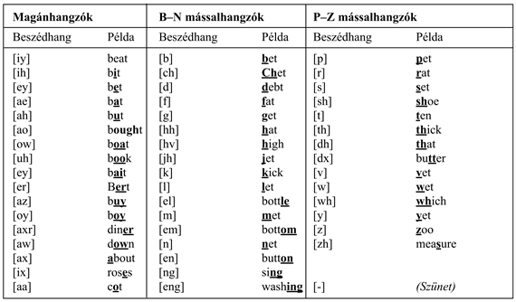

<?xml version="1.0" encoding="UTF-8" standalone="no"?>

<html xmlns="http://www.w3.org/1999/xhtml"><head><meta name="generator" content="DocBook XSL Stylesheets V1.76.1"/></head><body>

<h1 class="title"><a id="id699645"/>Beszédfelismerés</h1>

Ebben az alfejezetben az időbeli valószínűségi modellek egyik legfontosabb alkalmazását, a <strong>beszédfelismerés</strong>t (<strong>speech recognition</strong>) tekintjük át. A feladat egy beszélő által elmondott szósorozat azonosítása az adott akusztikus jelből. A beszéd az emberek közötti kommunikációnak a domináns modalitása, és a megbízható számítógépes beszédfelismerés felmérhetetlenül fontos lenne. Még ennél is hasznosabb volna a <strong>beszédmegértés</strong> (<strong>speech understanding</strong>) – az elhangzott beszéd <em>jelentésének</em> a meghatározása. Ennek tárgyalására a 22. fejezetig kell várnunk.

A beszéd jelenti az első találkozásunkat a valódi érzékelők szolgáltatta adatok nyers, tisztítatlan világával. Ezek az adatok zajosak, a szó szoros értelmében: a <em>zaj</em> lehet háttérzaj és lehet a digitalizálási folyamat okozta melléktermék; eltérések lehetnek a szavak kiejtési módjában még ugyanannál a beszélőnél is; különböző szavak hangzása ugyanaz lehet és így tovább. Ezen okok miatt a beszédfelismerésre mint valószínűségi következtetési problémára kezdtek el tekinteni.

A legáltalánosabb szinten a valószínűségi következtetési problémát a következőképpen definiálhatjuk. Legyen a <em>Szavak</em> egy valószínűségi változó az összes lehetséges szószekvencia felett, ami elhangozhat, és legyen a <em>jel</em> a megfigyelt akusztikusjel-szekvencia. Ekkor az elhangzottak legvalószínűbb értelmezése a <em>Szavak</em> azon értéke, ami maximalizálja a <em>P</em>(<em>szavak</em>|<em>jel</em>) értéket. Amint az gyakori eset, a Bayes-szabály alkalmazása hasznos:

<code class="code"><em>P</em>(<em>szavak</em>|<em>jel</em>) = α<em>P</em>(<em>jel</em>|<em>szavak</em>)<em> P</em>(<em>szavak</em>)</code>

A <em>P</em>(<em>jel</em>|<em>szavak</em>) alkotják az ún. <strong>akusztikai modell</strong>t (<strong>acoustic model</strong>). Ez írja le a szavak hangzását – a „ceiling (mennyezet)” egy lágy „c”-vel kezdődik és ugyanúgy hangzik, mint a „sealing (pecsételés/tömítés/fókavadászat)”. (Az <strong>azonos hangzású</strong> szavakat <strong>homofon</strong> (<strong>homophone</strong>) szavaknak nevezzük.) A <em>P</em>(<em>szavak</em>) értékei képezik az ún. <strong>nyelvi modell</strong>t (<strong>language model</strong>). Ez adja meg az a priori valószínűségét minden egyes kijelentésnek – például hogy a „magas mennyezet (high ceiling)” sokkal valószínűbb szókapcsolat, mint a „magas pecsételés (high sealing)”.

A beszédfelismerő rendszerekben használt nyelvi modellek gyakran igen egyszerűek. A fejezetben később leírt <strong>bigram</strong> (<strong>bigram</strong>) <strong>modell</strong> minden lehetséges esetre megadja annak a valószínűségét, hogy egy szó egy másik szót követ. Az akusztikai modell sokkal bonyolultabb. Az alapjait egy fontos felfedezés alkotja a <strong>fonológia</strong> (<strong>phonology</strong>) (a nyelvi hangok tanulmányozása) területéről, nevezetesen, hogy az emberiség minden nyelve egy 40–50 hangból álló korlátos választékkal él, amelyeket <strong>beszédhang</strong>oknak<strong> </strong>(<strong>phone</strong>s) hívunk. Egy beszédhang nagyjából az a hang, amely egy egyedi mással- vagy magánhangzónak felel meg. A helyzetet komplikálja valamelyest, hogy az olyan betűkombinációk, mint „th” vagy „ng” egyedi beszédhangot eredményeznek, viszont egyes betűk többféle beszédhanghoz vezetnek, a környezetüktől függően (például az „a” betű a „rat” és a „rate” szóban). Az angol nyelv összes beszédhangja, példákkal együtt, a 15.17. ábrán látható. A <strong>fonéma</strong> (<strong>phoneme</strong>) a legkisebb hangi egység, ami önálló jelentéssel bír egy adott nyelv használói számára. Például az angolban a „t” beszédhang a „stick” szóban ugyanaz a fonéma, mint a „t” beszédhang a „tick” szóban, de a thai nyelvben ezek megkülönböztethetők, mint két különböző fonéma.

A beszédhangok létezése lehetővé teszi az akusztikai modell két részre bontását. Az első rész a <strong>kiejtés</strong>t (<strong>pronunciation</strong>) kezeli, és minden egyes szóra megad egy valószínűség-eloszlást az összes lehetséges beszédhangsor felett. Például a „ceiling” szó kiejtése [s iy l ih ng], vagy néha [s iy l ix ng], vagy esetleg [s iy l en]. A beszédhangok közvetlenül nem megfigyelhetők, így nagyjából a beszéd egy olyan rejtett Markov-modellel reprezentálható, aminek <em>Xt</em> állapotváltozója a <em>t</em> időpontban kimondott beszédhang.

Az akusztikai modell második része a beszédhangok akusztikus jelként való megvalósulási módjával foglalkozik: azaz a rejtett Markov-modell <em>Et</em> bizonyítékváltozója adja meg az akusztikus jel <em>t</em> időpontban megfigyelt jellemzőit, és az akusztikus modell adja meg az <em>P</em>(<em>Et</em>|<em>Xt</em>) feltételes valószínűséget, ahol <em>Xt</em> az aktuális beszédhang. A modellnek lehetőséget kell adni eltérésekre a hangmagasságban, a sebességben és a hangerőben, és <strong>jelfeldolgozás</strong>i (<strong>signal processing</strong>) technikákon alapul, hogy olyan jelreprezentációt biztosítson, ami megfelelően robusztus módon kezeli ezeket a fajta eltéréseket.
<a id="ID_661_oldal"/>
<a id="id699909"/>
<strong>15.17. ábra - A DARPA fonetikus ábécé, avagy ARPAbet, amely az amerikai angolban használt beszédhangokat sorolja fel. Számos alternatív felírás létezik, köztük az International Phonetic Alphabet (IPA), mely az összes ismert nyelv beszédhangját tartalmazza.</strong>

A fejezet hátralevő része a modelleket és az algoritmusokat írja le lentről felfelé haladva, az akusztikus jelekkel és a beszédhangokkal kezdve, majd az egyedi szavakkal és végül teljes sorozatokkal folytatva. Befejezésül áttekintjük, hogy ezek a modellek hogyan taníthatók, és mennyire működik jól a kapott rendszer.

<h2 class="title"><a id="id699926"/>Beszédhangok</h2>

A hanghullámok olyan periodikus nyomásváltozások, amelyek a levegőben terjednek. A hang egy mikrofonnal mérhető, aminek membránját elmozdítja a nyomásváltozás, és egy folytonosan változó áramot generál. Az áramerősséget – ami a hanghullám amplitúdójához tartozik – egy analóg-digitális konverter méri diszkrét időintervallumonként a <strong>mintavételi frekvencia</strong> (<strong>sampling rate</strong>) szerint. Beszéd esetén a tipikus mintavételi frekvencia 8 és 16 kHz (azaz 8000-től 16 000-ig másodpercenként) között van. (Jó minőségű zenei felvételeket mintavételeznek 44 kHz vagy még magasabb frekvenciával.) A mérés pontosságát az egyes mintavételi pontokban a <strong>kvantálási tényező</strong> (<strong>quantization factor</strong>) határozza meg; a beszédfelismerők tipikusan 8–12 bitet használnak. Ez azt jelenti, hogy a legkevésbé igényes rendszer, amely 8 kHz-es frekvenciával mintavételez, és 8 bites kvantálást használ, közel fél megabájtot igényel egy egyperces beszéd tárolásához. Ilyen nagy mennyiségű jelinformáció esetén kivitelezhetetlen létrehozni és használni a <em>P</em>(<em>jel</em>|<em>beszédhang</em>) eloszlásokat, így az akusztikus jelnek tömörebb leírásait kell kifejlesztenünk.

Elsőként azt vesszük figyelembe, hogy bár a beszédben a hangfrekvencia akár több kHz-es is lehet, a jel tartalmának a <em>megváltozásai</em> sokkal ritkábban fordulnak elő, talán nem több mint 100 Hz-cel. Ezért a beszédrendszerek a jel tulajdonságait hosszabb időintervallumonként, úgynevezett <strong>keret</strong>enként (<strong>frame</strong>s) összegzik. Egy 10 ms-os (80 minta 8 kHz-es mintavétel mellett) keret elég rövidnek tűnik ahhoz, hogy csak néhány rövid idejű jelenség mosódjon el az összegzési folyamat miatt. Az egyes kereteken belüli folyamatot egy <strong>jellemző</strong> (<strong>feature</strong>) vektorral ábrázoljuk. Például jellemezni akarjuk az energia szintjét számos frekvenciasáv mindegyikében. Más fontos jellemzők a keret globális energiaszintje és a megelőző kerettől számított (energia)különbség. A jellemzők kiemelése a beszédjelből hasonlít egy kicsit arra, ahogy a zenekar játékát figyelve megjegyezzük: „Most a vadászkürtök hangosan és a hegedűk halkan szólnak.” A 15.18. ábrán láthatjuk az átalakítás lépéseit a nyers hangtól a keretek sorozatáig. Figyeljük meg, hogy a keretek átlapolódnak; ez megvéd minket attól, hogy pont a keret határán fellépő fontos akusztikus események információját elveszítsük.

A példánkban csupán három jeggyel rendelkező keretet mutattunk. Valós rendszerek jellemzők tucatjaival vagy akár százaival dolgoznak. Például <em>n</em> darab jellemző esetén, amikor mindegyik 256 lehetséges értéket vehet fel, egy keret egy ponttal adható meg egy <em>n</em>-dimenziós térben, és 256n lehetséges keret létezik. <em>n </em>&gt; 2 esetén kivitelezhetetlen volna a <em>P</em>(<em>jellemzők</em>|<em>beszédhang</em>) eloszlásnak egy explicit táblázatként történő ábrázolása, így további tömörítésre van szükségünk. Két lehetséges megközelítés létezik:

<ul class="itemizedlist"><li class="listitem">
A <strong>vektorkvantálás</strong> (<strong>VK</strong>) (<strong>vector quantization</strong>, <strong>VQ</strong>) módszere felosztja az <em>n </em>dimenziós teret mondjuk 256 partícióra, C1-től C256-ig címkézve. Ekkor az egyes kereteket inkább egy egyedi címkével, mint egy <em>n</em> számból álló vektorral lehet jellemezni. Így a <em>P</em>(<em>VQ</em>|<em>beszédhang</em>) eloszlás táblázatos formája 256 valószínűséget tartalmaz minden egyes beszédhangra. Nagy rendszerekben a vektorkvantálás már nem népszerű.
</li><li class="listitem">
A jellemzők terének diszkretizálása helyett parametrikus folytonos eloszlásokat használhatunk a <em>P</em>(<em>jellemzők</em>|<em>beszédhang</em>) leírásához. Például használhatunk minden beszédhanghoz egy Gauss-eloszlást, beszédhangonként különböző átlaggal és kovarianciamátrixszal. Ez jól működik, ha az egyes beszédhangok akusztikus megvalósulása a jellemzők terében egyetlen területen csoportosul. A gyakorlatban egy hanghoz több területen való csoportosulás is tartozik, és <strong>Gauss-eloszlások keveréké</strong>t (<strong>mixture of Gaussians</strong>) kell használni. Egy keverék <em>k</em> egyedi eloszlás súlyozott összege, így a <em>P</em>(<em>jellemzők</em>|<em>beszédhang</em>) eloszláshoz <em>k</em> súly, <em>k</em> <em>n</em> elemű átlagvektor és <em>k</em> <em>n</em>2 méretű kovarianciamátrix tartozik, ami <em>O</em>(<em>kn</em>2)<em> </em>paraméter minden beszédhangra.
</li></ul>

<a id="id700135"/>
<strong>15.18. ábra - Az akusztikus jel átalakítása keretek sorozatává; mindegyik keretet három akusztikus jellemzővel írunk le</strong>

Természetesen bizonyos információ elvész a feldolgozás során, ami a teljes beszédjeltől egy VK címkéig vagy a keverékparaméterek egy halmazáig tart. A jelfeldolgozás művészete abban rejlik, hogy úgy válasszuk meg a jellemzőket és a tartományokat (vagy a Gauss-eloszlásokat), hogy a hasznos információ vesztesége minimális legyen. Egy adott beszédhang számos módon kiejthető: hangosan vagy halkan, gyorsan vagy lassan, magasan vagy mély hangon, csendben vagy háttérzajban és beszélők sok milliója által, mindegyikőjük különböző kiejtésével és eltérő hangképző szerveivel.[<a id="id700147" href="#ftn.id700147" class="footnote">161</a>]

Még két további finomítást kell elvégeznünk az eddig leírt egyszerű modellen. Az első a beszédhangok időbeli szerkezetével foglalkozik. Normális beszédben a legtöbb beszédhangnak a terjedelme 50–100 ezredmásodperc vagy 5–10 keret. A <em>P</em>(<em>jellemzők</em>|<em>beszédhang</em>) valószínűségi modell ugyanaz ezen keretek mindegyikére, pedig a legtöbb beszédhangnak jelentős belső struktúrája van. Például a [t] egyike a <strong>zárhang</strong>oknak (<strong>stop consonant</strong>s), amelyekben a levegő áramlása megszűnik egy rövid időre egy határozott kibocsátás előtt. Az akusztikus jelet megvizsgálva azt látjuk, hogy egy [t]-nek a kezdete hangtalan, közepén egy kis kirobbanással és (általában) egy sziszegéssel a végén. A beszédhangoknak ez a belső struktúrája egy háromállapotú modellel ragadható meg; minden beszédhangnak van egy kezdeti, közép- és végállapota, és minden állapotnak megvan a saját eloszlása a jegyek felett.

A második finomítás azzal a környezettel foglalkozik, amelyben a beszédhang elhangzik. Egy adott beszédhang hangzását megváltoztathatják a környező beszédhangok.[<a id="id700185" href="#ftn.id700185" class="footnote">162</a>] Emlékezzünk arra, hogy a beszédhangok az ajkak, a nyelv és az álkapocs mozgása és a levegőnek a hangképző szerveken történő kényszerített átáramlása révén keletkezik. Ezen komplex mozgások koordinálásánál, amik másodpercenként öt vagy még több beszédhangot produkálnak, az agy már akkor elindít a második beszédhanghoz tartozó műveletet, mielőtt az első befejeződött volna, így megváltoztatva az egyik vagy mindkét beszédhangot. Például a „sweet (édes)” kiejtésénél az ajkak kerekítettek az [s] előállítása közben számítva  a következő [w]-re. Ezeket a <strong>koartikulációs hatás</strong>okat (<strong>coarticulation effect</strong>s) részlegesen megragadja a <strong>hármashangzó</strong> (<strong>triphone</strong>) modell, amelyben az egyes beszédhangok akusztikai modellje függhet az előző és következő beszédhangtól. Így a [w] a „sweet”-ben úgy írható, hogy [w(s,iy)], azaz [w] egy [s] bal- és egy [iy] jobb-környezetben.

A háromállapotú és hármashangzó modellek együttes hatása megnöveli az időbeli folyamat lehetséges állapotainak a számát az eredeti beszédhang készletbeli <em>n</em> beszédhangról 3<em>n</em>3-ra (az ARPAbet-ben <em>n </em>≈ 50). A tapasztalatok azt mutatják, hogy a megnövelt pontosság bőven ellensúlyozza a következtetés és a tanulás megnövekedett költségeit.

<h2 class="title"><a id="id700226"/>Szavak</h2>

Minden egyes szóra gondolhatunk úgy, mint ami meghatároz egy külön <strong>P</strong>(<em>X</em>1:<em>t</em>|<em>szó</em>) valószínűségi eloszlást, ahol <em>Xi</em> megadja az <em>i</em>-edik keretben a beszédhang állapotát. Tipikusan ezt az eloszlást két részre osztjuk. A <strong>kiejtési modell</strong> (<strong>pronunication model</strong>) egy eloszlást ad meg a beszédhangsorok felett (figyelmen kívül hagyva az ütemet és a kereteket), majd a <strong>beszédhangmodell</strong> (<strong>phone model</strong>) leírja, ahogyan a beszédhangok leképződnek a keretek szekvenciájára.

Gondoljunk arra a szóra, hogy „tomato (paradicsom)”. Gershwin szerint ezt úgy ejtik ki, hogy [t ow m ey t ow] (Gershwin, 1937), én viszont úgy ejtem, hogy [t ow m aa t ow].<em> </em>A 15.19. ábra felső részén látható egy olyan állapotátmenet-modell, ami gondoskodik erről a változatról. A modellen keresztül csak két út létezik, egy, ami a [t ow m ey t ow] beszédhang szekvenciához tartozik, és a másik a [t ow m aa t ow] szekvenciához. Egy út valószínűsége az útvonalat alkotó nyilakon szereplő valószínűségek szorzata:

<code class="code"><em>P</em>([<em>towmeytow</em>]|„tomato”) = <em>P</em>([<em>towmaatow</em>]|„tomato”) = 0,5</code>

A fonetikai változékonyság második forrása a <strong>koartikuláció</strong> (<strong>coarticulation</strong>). Például a [t] beszédhangnál a nyelv a szájpadlásnál helyezkedik el, az [ow]-nál viszont a száj alján. Gyors beszédnél a nyelv sokszor közbülső pozícióba kerül, melynek eredménye inkább a [t ah], és nem a [t ow]. A 15.19. ábra alsó része a „tomato” kiejtésének egy bonyolultabb modelljét mutatja, amely ezt a koartikulációs hatást figyelembe veszi. Ebben a modellben négy különböző út van, és azt kapjuk, hogy:

<code class="code"><em>P</em>([<em>towmeytow</em>]|„tomato”) = <em>P</em>([<em>towmaatow</em>]|„tomato”) = 0,1</code>

<code class="code"><em>P</em>([<em>tahmeytow</em>]|„tomato”) = <em>P</em>([<em>tahmaatow</em>]|„tomato”) = 0,4</code>

Hasonló modelleket lehetne konstruálni minden felismerni kívánt szóhoz.

A háromállapotú beszédhangmodell állapotátmenet-diagramja a 15.20. ábrán látható. A modell egy konkrét beszédhanghoz tartozik, az [m]-hez, de az összes beszédhangnak hasonló topológiájú modellje van. Az ábrán láthatók az egyes beszédhang állapotokhoz kapcsolódó akusztikai modellek is, feltételezve, hogy a jelet egy VK címke reprezentálja. Például a modell szerint <em>P</em>(<em>Et</em> = <em>C</em>1|<em>Xt</em> = [m]Kezdet) = 0,5. Vegyük észre a hurkokat az ábrán; például az [m]Közép állapot 0,9 valószínűséggel fennmarad, ami azt jelenti, hogy az [m]Közép állapot várható időtartama 10 keret. A modellünkben az egyes beszédhangok hossza független a többi beszédhang hosszától; egy kifinomultabb modell képes lenne a gyors és lassú beszédet megkülönböztetni.

Hasonló modelleket hozhatunk létre minden egyes beszédhangra, akár a hármashangzó környezet hatását is figyelembe véve. Minden szómodell, amikor a beszédhangmodellekkel kombináljuk, egy RMM teljes specifikációját adja. A modell megadja a beszédhang állapotok közötti, keretről keretre történő átmeneteknek a valószínűségeit csakúgy, mint az akusztikus jegyek valószínűségeit minden egyes beszédhang állapothoz.

Ha <strong>egyedülálló szavak</strong>at (<strong>isolated words</strong>) szeretnénk felismerni – azaz egyértelmű határokkal rendelkező és mindennemű környezeti összefüggés nélkül kiejtett szavakat –, akkor azt a szót kell megkeresnünk, amelyik maximalizálja azt, hogy

<code class="code"><em>P</em>(<em>szó</em>|<em>e</em>1:<em>t</em>) = α<em>P</em>(<em>e</em>1:<em>t</em>|<em>szó</em>)<em>P</em>(<em>szó</em>)</code>

<a id="id700438"/>
<strong>15.19. ábra - A „tomato” szó két kiejtési modellje. Mindegyik modellt egy átmenetdiagramként ábrázoljuk, amiben az állapotokat körrel jelöljük, a megengedett átmeneteket pedig nyilakkal, rajtuk a kapcsolódó valószínűségekkel. (a) Egy nyelvjárásbeli különbségeket is tekintetbe vevő modell. A 0,5-ös értékek a két szerző preferált kiejtésein alapuló becslések. (b) Egy olyan modell, ami az első magánhangzón egy koartikulációs hatást is figyelembe vesz, megengedve az [ow] vagy az [ah] beszédhangokat.</strong>

<a id="id700448"/>
<strong>15. ábra - Az [m] háromállapotú beszédhang egy RMM-je. Mindegyik állapotnak számos lehetséges kimenetele lehet, különálló valószínűségekkel. A <em>C</em>1, …,<em> C</em>7 VK-címkék önkényesen lettek megválasztva.</strong>

<code class="code"><em>P</em>(<em>szó</em>|<em>e</em>1:<em>t</em>) = α<em>P</em>(<em>e</em>1:<em>t</em>|<em>szó</em>)<em>P</em>(<em>szó</em>)</code>

A <em>P</em>(<em>szó</em>) a priori valószínűség valódi szöveges adatból kapható meg. A <em>P</em>(<em>e</em>1:<em>t</em>|<em>szó</em>) pedig az akusztikus jegyek sorozatának a valószínűsége a szómodell szerint. Ilyen valószínűségek kiszámítását a 15.2. alfejezet tárgyalta; nevezetesen a (15.15) egyenlet egy egyszerű rekurzív számítást definiál, lineáris költséggel <em>t</em>-ben és a Markov-lánc állapotainak számában. A legvalószínűbb szó megtalálásánál ezt a számítást minden lehetséges szóra elvégezhetjük, megszorozzuk az a priori valószínűséggel, és e szerint választjuk ki a legjobb szót.

<h2 class="title"><a id="id700539"/>Mondatok</h2>

Az emberi kommunikációban való részvételhez egy gépnek a <strong>folytonos beszéd</strong>et (<strong>continuous speech</strong>) kell felismernie, és nem pusztán egyedülálló szavakat. Azt gondolhatnánk, hogy a folytonos beszéd nem több, mint szavak sorozata, amelyek mindegyikére alkalmazhatjuk az algoritmust az előző fejezetből. Ez a megközelítés két ok miatt is bukásra van ítélve. Először is, már láttuk (a <a class="xref" href="ch15s02.md#ID_638_oldal">„A legvalószínűbb sorozat megtalálása”</a> részben), hogy a legvalószínűbb szavak sorozata nem a legvalószínűbb együttes szósorozat. Például a <em>Take the Money and Run (Fogd a pénzt és fuss)</em> c. filmben a banki alkalmazott félreérti Woody Allen irkafirka bankrablási üzenetét, és azt „I have a gub (Nálam van a slukker)”-nak olvassa (az „I have a gun, vagyis „Nálam van a stukker” helyett – <em>a ford.</em>). Egy jobb nyelvi modell az „I have a gun”-t javasolná, mint aminek sokkal nagyobb a valószínűsége, még ha a legutolsó szó inkább  „gub”-nak és nem „gun”-nak olvasható. A második probléma, amivel folytonos beszéd esetén szembesülnünk kell, a <strong>szegmentálás</strong> (<strong>segmentation</strong>) – annak az eldöntése, hogy hol van egy szónak a vége, és hol kezdődik a következő. Mindenki, aki megkísérelt egy idegen nyelvet megtanulni, méltányolni fogja a probléma nehézségét: először úgy tűnik, hogy a beszédben a szavak egybefolynak, majd fokozatosan tanulunk meg egyedi szavakat kiemelni a hangok egyvelegéből. Ebben az esetben az első benyomás korrekt: a spektrográfiai elemzés azt mutatja, hogy a folyamatos beszédben a szavak tényleg szünetek nélkül <em>követik</em> egymást. A szavak határait annak ellenére tanuljuk meg megkülönböztetni, hogy a szavakat nem választják szét csendszakaszok.

Kezdjük a nyelvi modellel, aminek a beszédfelismerésben az a feladata, hogy valószínűséget rendeljen minden egyes szósorozathoz. Legyen <em>w</em>1 … <em>wn</em> az <em>n</em> szóból álló szósorozat, és legyen <em>wi</em> a szósorozat <em>i</em>-edik szava, akkor a szósorozat-valószínűséget az alábbi módon írhatjuk:[<a id="id700609" href="#ftn.id700609" class="footnote">163</a>]

Ezen kifejezések többsége igen bonyolult és nehezen becsülhető vagy számítható. Szerencsére a képletet egyszerűbb kifejezéssel is közelíthetjük, miközben a nyelvi modell zömét mégis megragadjuk. Az egyik egyszerű, közkedvelt és hatékony eljárás a <strong>bigram</strong> (<strong>bigram</strong>) <strong>modell</strong>. Ez a modell a <em>P</em>(<em>wi</em>|<em>w</em>1... <em>w</em><em>i</em>–1)-et a <em>P</em>(<em>wi</em>|<em>w</em><em>i</em>–1)-gyel közelíti. Más szóval, feltételezi, hogy a szósorozatokra teljesül az elsőrendű Markov-feltétel. 

A bigram modell nagy előnye, hogy a modell egyszerűen tanítható az egyes szópárok megszámolásával szósorozatok egy reprezentatív korpuszában és a valószínűségek ezen számok alapján történő megbecslésével. Így például, ha az „a” a mintakorpuszban 10 000-szer fordul elő, és a „gun” azt 37-szer követi, akkor <em>P</em>(<em>guni</em>|<em>ai</em>–1) = 37⁄10 000, ahol a  a becsült valószínűség. Az ilyen tanítás befejeztével elvárnánk, hogy az „I have” és az „a gun” valószínűsége relatíve magas legyen, az „I has” és az „an gun” valószínűsége viszont alacsony. A 15<em>.</em>21. ábra a jelen könyv (eredeti angol nyelvű kiadásának)<em> </em>szavaiból számított néhány bigram gyakoriságát mutatja.

<a id="id700719"/>
<strong>15.21. ábra - Az unigram és bigram számlálóknak egy részleges táblázata a jelen könyv (eredeti angol nyelvű kiadásának) szavai alapján. A „the” a leggyakoribb egyedülálló szó 33 508 előfordulással (513 893 összes szóból). A leggyakoribb bigram az „of the”, 3833 előfordulással. Néhány szám nagyobb, mint várható (például 4-szer fordul elő az „on is”), mivel a bigram számlálás figyelmen kívül hagyja az elválasztást: egy mondat végződhet „on”-ra és a következő kezdődhet „is”-zel.</strong>

A modellt ki lehet bővíteni <strong>trigram</strong>má (<strong>trigram</strong>), amely a <em>P</em>(<em>wi</em>|<em>w</em><em>i</em>–1<em>w</em><em>i</em>–2) mennyiségeket használja. Ez egy hatékonyabb nyelvi modell, képes megadni, hogy az „ate a banana (banánt ettem)” valószínűbb, mint az „ate a bandana (kendőt ettem)”. A trigram modellben és kisebb mértékben a bigram és unigram modellekben is problémát jelentenek a nulla értékű számlálók: nem szeretnénk egy szókombinációt lehetetlennek minősíteni pusztán azért, mert nem fordulnak elő a tanító korpuszban. A <strong>simítás</strong> (<strong>smooth</strong><strong>ing</strong>) folyamata ilyen kombinációkhoz egy kis, pozitív valószínűséget rendel. Ezt a <a class="xref" href="ch23.md#ID_952_oldal">„Valószínűségi nyelvi modellek”</a> részben tárgyaljuk.

A bigram és trigram modellek nem annyira kifinomultak, mint a 22. és 23. fejezetben szereplő nyelvi modellek némelyike, de jobban tekintetbe veszik a helyi összefüggések hatásait, és bizonyos helyi szintaxist sikeresen kifejeznek. Például az a tény, hogy az „I has” és a „man have” szópárok alacsony pontszámokat kapnak, az alany-állítmány egyeztetést fejezi ki. A probléma az, hogy ezeket a kapcsolatokat csak helyileg lehet észlelni: „the man have” alacsony pontszámot kap, de a „the man with yellow hat have” nincs büntetve.

Most gondoljuk meg a nyelvi modell és a szómodellek egyesítését, hogy minden szósorozatot megfelelően tudjunk kezelni. Az egyszerűség kedvéért egy bigram nyelvi modellt fogunk feltételezni. Egy ilyen modellel az összes szómodell (ami viszont kiejtési és beszédhangmodellekből áll) egyetlen nagy RMM-modellbe állítható össze. Az egy-szavas RMM-modell egy állapota egy keret, felcímkézve az aktuális beszédhanggal és beszédhangállapottal (például [m]Kezdet); egy folytonos beszédű RMM-ben egy állapot a szóval is fel van címkézve, mint például . Ha minden szónak átlagban <em>p</em> háromállapotú beszédhang szerepel a kiejtési modelljében, akkor <em>W</em> szó esetén a folytonos beszédű RMM-nek 3<em>pW</em> állapota van. Átmenetek bekövetkezhetnek egy adott beszédhangon belül a beszédhang állapotai között, egy adott szó beszédhangjai között, illetve egy szó utolsó állapota és egy másik szó kezdő állapota között. A szavak közti átmenetek a bigram modell szerinti valószínűséggel következnek be.

Ha előállítottuk az egyesített RMM-modellt, akkor a felhasználásával elemezhetjük a folytonos beszédjelet. Különösen a (15.9) egyenletben megadott Viterbi-algoritmusnak vehetjük hasznát a legvalószínűbb állapotsorozat megtalálásában. Ebből az állapotsorozatból már kinyerhető a szósorozat egyszerűen az állapotok szócímkéinek kigyűjtésével. Így a Viterbi-algoritmus a szószegmentálás problémáját úgy oldja meg, hogy dinamikus programozást felhasználva (valójában) egyszerre figyelembe veszi az összes lehetséges szósorozatot és szóhatárt.

Vegyük észre, hogy nem azt mondtuk, hogy „kinyerhető a <em>legvalószínűbb</em> szósorozat”. A legvalószínűbb szósorozat nem szükségképpen az, ami a legvalószínűbb állapotsorozatot tartalmazza. Ez amiatt van így, mert egy szósorozat valószínűsége az összes olyan állapotszekvencia valószínűségének összege, amely konzisztens ezzel a szósorozattal. Két szósorozatot összehasonlítva, mondjuk „a back” és „aback” szósorozatokat, előfordulhat, hogy tíz alternatív állapotsorozat van az „a back”-hez, ezek mindegyike 0,03 valószínűséggel, de csak egyetlen állapotsorozat az „aback”-hez, viszont 0,20 valószínűséggel. A Viterbi-algoritmus az „aback”-t választja, pedig az „a back” valójában valószínűbb.

A gyakorlatban ez a nehézség nem életveszélyes, de elég komoly ahhoz, hogy más módszereket is kipróbáljanak. A legáltalánosabb választás az <strong>A* dekódoló</strong> (<strong>A* decoder</strong>), ami leleményesen használja fel az A* keresést (lásd 4. fejezet) a legvalószínűbb szósorozat megtalálásában. Az ötlet az, hogy minden szósorozatot egy olyan gráfon átvezető útnak fogunk fel, aminek a csomópontjai a szavakkal vannak felcímkézve. Egy csomópont gyermekei az összes olyan szó, amelyek utána következhetnek; így az öszszes <em>n</em> hosszúságú vagy rövidebb mondathoz tartozó gráfnak <em>n</em> szintje van, mindegyik <em>W</em> szélességű, ahol <em>W</em> a lehetséges szavak száma. A bigram modellnél a <em>w</em>1<em> </em>és <em>w</em>2<em> </em>címkéjű<em> </em>csomópontok közti nyílhoz rendelt <em>g</em>(<em>w</em>1,<em>w</em>2) költséget a <em>–</em>log<em>P</em>(<em>w</em>2|<em>w</em>1) definiálja. Ekkor egy sorozat teljes útköltsége

Az útköltség ezen definíciója mellett, a legrövidebb út megtalálása pontosan megegyezik a legvalószínűbb szósorozat megtalálásával. A keresés hatékonyságához egy jó <em>h</em>(<em>wi</em>) heurisztika is szükséges a szósorozat befejezéséhez szükséges költség megbecslésére. Nyilvánvalóan ennek főként a beszédjelnek ahhoz a részéhez kell kapcsolódnia, amit a jelenlegi úton fekvő szavak még nem fedtek le. Eddig még nem született különösebben érdekes heurisztika erre a problémára.

<h2 class="title"><a id="id702740"/>Egy beszédfelismerő építése</h2>

Egy beszédfelismerő rendszer minősége az összes részének a minőségétől függ – a nyelvi modelltől, a szókiejtési modelltől, a beszédhangmodelltől és a jelfeldolgozó algoritmusoktól, amelyek a spektrális jegyeket kinyerik az akusztikus jelből. Megtárgyaltuk, hogyan hozhatunk létre egy nyelvi modellt, és a jelfeldolgozás részletei más könyvekben is megtalálhatók. Így már csak a kiejtési és a beszédhangmodellek maradnak. A kiejtési modellek <em>struktúrája</em> – mint a paradicsom modelljei a 15.19. ábrán – általában kézi fejlesztésű. Nagy fonetikai szótárak most már elérhetők angol és más nyelvekhez, bár a pontosságuk nagymértékben változik. A háromállapotú beszédhangmodell struktúrája minden beszédhangra ugyanaz, mint a 15.20. ábrán látható. Így már csak a valószínűségek maradnak. Honnan szerezhetők be ezek, különösen hogy a modellek paraméterek százezreit vagy akár millióit is igényelhetik?

Az egyetlen elfogadható módszer a modellek tanulása valódi beszédadatból, amiből bizonyosan nincsen hiány. A következő kérdés a tanulás mikéntje. A teljes választ a 20. fejezetben adjuk meg, de a fő elképzeléseket itt is bemutathatjuk. Gondoljuk át a bigram nyelvi modellt; ennek megtanulását már elmagyaráztuk, ami a szópárok gyakoriságának a vizsgálatán alapult valódi szövegben. Megtehető ugyanez mondjuk a beszédhangok átmenet-valószínűségeire is a kiejtési modellben? A válasz igen, de csak akkor, ha valaki veszi a fáradságot, és végigjegyzeteli az összes előforduló szót a helyes beszédhangsorozattal. Ez egy bonyolult és számos hibalehetőséget magában rejtő feladat, de néhány standard adathalmazra elvégezték, amelyek több órás beszédet tartalmaznak. Ha ismerjük a beszédhang-szekvenciát, akkor a kiejtési modell átmenet-valószínűségeit megbecsülhetjük a beszédhangpárokból. Hasonlóan, ha minden keretre ismert a beszédhangállapot – egy még gyötrelmesebb kézi felcímkézés eredményeképpen – akkor megbecsülhetjük a beszédhangmodell átmenet-valószínűségeit is. Ha minden keretben ismerjük a beszédhangállapotot és az akusztikus jegyeket, akkor pedig megbecsülhetjük az akusztikai modellt, akár közvetlenül a gyakoriságokból (a VK modellek esetében) vagy statisztikai illesztési módszerekkel (a Gauss-modellek keveréke esetében; lásd 20. fejezet).

<h3 class="title">Fontos</h3>
A kézi címkézésű adatnak a költsége és a ritkasága, illetve az a tény, hogy az elérhető kézi címkézésű adathalmazok nem feltétlenül reprezentálják a beszélők és az akusztikus feltételek azon típusait, amelyek egy új beszédfelismerési feladatban fellépnek, ezt a megközelítést bukásra ítélik. <em>Szerencsére a <strong>várhatóérték-maximalizálás</strong> vagy <strong>EM algoritmus</strong> (<strong>expectation-maximization</strong>, <strong>EM</strong>) anélkül is megtanulja az RMM átmenetvalószínűségeit és érzékelő modelljeit, hogy címkézett adatot használna. </em>Kézi címkézésű adatokból származó becsléseket felhasználhatunk a modell kezdeti beállítására; ezután az EM következik, és betanítja a modellt az éppen aktuális feladatra. Az ötlet egyszerű: egy adott RMM és egy megfigyeléssorozat esetén, felhasználhatjuk a 15.2. és a 15.3. alfejezet simító algoritmusait az egyes állapot-valószínűségek kiszámítására minden időpontban, illetve egy egyszerű kiterjesztéssel az állapot-állapot párok valószínűségét is az egymást követő időpontokban. Ezeket a valószínűségeket felfoghatjuk bizonytalan címkéknek. A bizonytalan címkékből megbecsülhetünk új átmenet- és érzékelési valószínűségeket, majd az EM eljárás megismétlődik. A módszer minden iterációban bizonyítottan növeli a modell adathoz való illeszkedését, és általában a kezdetben beállított kézi címkézésű becslések értékeinél, a paraméterértékek egy sokkal jobb halmazához konvergál.

A legkorszerűbb beszédfelismerő rendszerek óriási adathalmazokat és hatalmas számítási erőforrásokat használnak fel a modelljeik tanításához. Egyedülálló szófelismerésnél, jó akusztikus feltételekkel (háttérzaj és visszhang nélkül), egy néhány ezres szótárnál és egy beszélő esetén, a pontosság 99% feletti lehet. Folytonos beszédfelismerésnél és több különféle beszélő esetén, a 60–80%-os pontosság az általános, még jó akusztikus körülmények esetén is. Háttérzajnál és telefonos átvitelnél a pontosság tovább romlik. Bár az üzembe helyezett rendszerek évtizedek óta javulnak, számos ötlet még kidolgozásra vár.

 

[<a id="ftn.id700147" href="#id700147" class="para">161</a>]  A duális probléma – a <strong>beszélőazonosítás</strong> (<strong>speaker identification</strong>) pontosan ennek fordítottja, a közös elemeket hagyja el, és az egyéni különbségeket tartja meg, majd megpróbálja a különbségeket az egyéni beszédmodellekhez illeszteni.

[<a id="ftn.id700185" href="#id700185" class="para">162</a>]  Ebben az értelemben a beszéd „beszédhangmodelljét” inkább hasznos közelítésnek kell tekinteni, és nem megváltoztathatatlan törvénynek.

[<a id="ftn.id700609" href="#id700609" class="para">163</a>]  Valóban jobb lenne, ha minden valószínűséget egy adott helyzetre vonatkozó feltétel mellett lehetne figyelembe venni. Kevés beszédfelismerő rendszer él ezzel a lehetőséggel, mert nehéz formálisan meghatározni, hogy mi számít adott helyzetnek.

</body></html>
