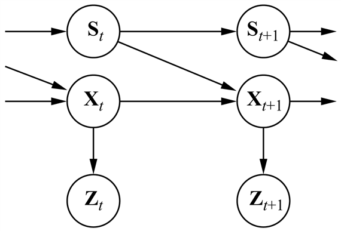

<?xml version="1.0" encoding="UTF-8" standalone="no"?>
<!DOCTYPE html PUBLIC "-//W3C//DTD XHTML 1.1//EN" "http://www.w3.org/TR/xhtml11/DTD/xhtml11.dtd">
<html xmlns="http://www.w3.org/1999/xhtml"><head><meta name="generator" content="DocBook XSL Stylesheets V1.76.1"/></head><body>

<h1 class="title"><a id="id702781"/>Összefoglalás</h1>

Ez a fejezet az ábrázolás és a következtetés általános problémáját tárgyalta időbeli valószínűségi folyamatok esetében. A legfőbb pontok a következők:

<ul class="itemizedlist"><li class="listitem">
A világ változó állapotát valószínűségi változók halmazának a felhasználásával kezeljük, amelyek az állapotot ábrázolják minden időpontban.
</li><li class="listitem">
Kidolgozhatók olyan reprezentációk, amelyek eleget tesznek a <strong>Markov-tulajdonság</strong>nak (<strong>Markov property</strong>), nevezetesen, hogy a jövő független a múlttól a jelen ismeretében. Ez együttesen a folyamat <strong>stacionaritás</strong>ának (<strong>stationary</strong>) feltevésével – azaz azzal, hogy a dinamika az idővel nem változik – nagyban egyszerűsíti a reprenzentációt.
</li><li class="listitem">
Egy időbeli valószínűségi modellt felfoghatunk egy <strong>állapotátmenet-modell</strong> (<strong>transition model</strong>) és egy <strong>érzékelő modell</strong> (<strong>sensor model</strong>) együttesének, ahol az első az állapot alakulását, a második pedig a megfigyelés folyamatát írja le.
</li><li class="listitem">
Időbeli modellekben az alapvető következtetési feladatok a <strong>szűrés</strong> (<strong>filtering</strong>), az <strong>előrejelzés</strong> (<strong>prediction</strong>), a <strong>simítás</strong> (<strong>smoothing</strong>) és a <strong>legvalószínűbb magyarázat kiszámítása</strong> (<strong>most likely explanation</strong>). Ezek mindegyike elvégezhető egyszerű, rekurzív algoritmusokkal, melyek futási ideje a szekvencia hosszában lineáris.
</li><li class="listitem">
Időbeli modellek három családját tanulmányoztuk részletesebben: a <strong>rejtett Markov-modell</strong>eket (<strong>hidden Markov modell</strong>), a <strong>Kalman-szűrő</strong>ket (<strong>Kalman filter</strong>s), és a <strong>dinamikus Bayes-háló</strong>kat (<strong>dynamic Bayesian network</strong>s) (ami magában foglalja a másik kettőt, mint speciális esetet).
</li><li class="listitem">
A <strong>beszédfelismerés</strong> (<strong>speech recognition</strong>) és a <strong>követés</strong> (<strong>tracking</strong>) az időbeli valószínűségi modellek két fontos alkalmazási területe. 
</li><li class="listitem">
Hacsak nincsenek speciális feltételezéseink, mint a Kalman-szűrőknél, egzakt következtetés több állapotváltozó esetén nem kivitelezhető. A gyakorlatban a <strong>részecske</strong><strong>szűrő</strong> (<strong>particle filtering</strong>) algoritmus tűnik egy hatékony közelítő algoritmusnak.
</li></ul>

<h2 class="title"><a id="id702954"/>Irodalmi és történeti megjegyzések</h2>

Számos alapötlet dinamikus rendszerek állapotának a becslésére a matematikus C. F. Gausstól származik, aki egy determinisztikus legkisebb-négyzeteken alapuló algoritmust alkotott meg az égitestek pályájának a megbecslésére csillagászati megfigyelésekből (Gauss, 1809). Az orosz matematikus A. A. Markov fejlesztette ki a később róla elnevezett Markov-feltételezést a sztochasztikus folyamatokat vizsgálva; az elsőrendű Markov-láncot maga Markov alkalmazta először a <em>Jevgenyij Anyegin</em> szövegének betűszekvencia-elemzésénél (Markov, 1913). Jelentős titkosított munka folyt a szűrés problémáján a második világháború alatt folytonos idejű folyamatok esetében (Wiener, 1942) és diszkrét idejű folyamatoknál is (Kolmogorov, 1941). Bár ez a munka fontos technikai fejlődést eredményezett a következő 20 évben, a felhasznált frekvenciatartománybeli reprezentáció több számítást is elég nehézkessé tett. A sztochasztikus folyamatok közvetlen állapottérbeli modellezése egyszerűbbnek bizonyult, ahogy azt Swerling és Kalman munkái megmutatták (Swerling, 1959; Kalman, 1960). Az utóbbi munka vezette be a most Kalman-szűrésnek nevezett technikát előrefelé következtetés elvégzésére lineáris rendszerekben Gauss-zaj mellett. Rauch és társai fontos eredményeket értek el a simításhoz kapcsolódóan, a megkapóan elnevezett Rauch–Tung–Striebel-simítás még ma is szabványtechnika (Rauch és társai, 1965). Számos korai eredményt gyűjtöttek össze a (Gelb, 1974) kiadványban. Bar-Shalom és Fortmann egy modernebb tárgyalást kínál bayesi vonásokkal, miközben számos hivatkozást is ad a hatalmas mennyiségű szakirodalomra (Bar-Shalom és Fortmann, 1988). Chatfield az idősor analízis „klasszikus” megközelítését fedi le (Chatfield, 1989).

A Kalman-szűrés számos alkalmazásában nem csak a bizonytalan érzékeléssel és a dinamikával kell foglalkozni, hanem bizonytalan azonosítással is; azaz ha több objektumot kell megfigyelni, a rendszernek meg kell határozni, hogy melyik megfigyelést melyik objektum generálta, mielőtt az állapotbecsléseket felfrissíthetné. Ez az <strong>adattársítás</strong> (<strong>data association</strong>) problémája (Bar-Shalom és Fortmann, 1988; Bar-Shalom, 1992). Azon esetben, amikor <em>n</em> megfigyelés és <em>n</em> követés van (ami egy igen szelíd eset),<em> </em>a megfigyelések <em>n</em>! lehetséges módon rendelhetők a követésekhez; a helyes valószínűségi kezelés mindet figyelembe venné, ami megmutathatóan NP-teljes (Cox, 1993; Cox és Hingorani, 1994). Az MCMC-alapú polinom idejű közelítő módszerek úgy tűnik, jól működnek a gyakorlatban (Pasula és társai, 1999). Érdekes, hogy az adattársítás problémája egy elsőrendű nyelvben végzett valószínűségi következtetés egy esete; a legtöbb valószínűségi következtetési problémától eltérően, amelyek tisztán ítéletlogikai szinten vannak, az adattársítás objektumokat és azonossági relációt foglal magában. Ezért közvetlenül kapcsolódik a 14. fejezetben említett elsőrendű valószínűségi nyelvekhez. Új kutatások megmutatták, hogy általában az azonosság feletti érvelés és konkrétan az adattársítás elvégezhető az elsőrendű valószínűségi keretben (Pasula és Russell, 2001).

A rejtett Markov-modellt és a kapcsolódó következtető és tanuló algoritmusokat, beleértve az előre-hátra algoritmust, Baum és Petrie fejlesztették ki (Baum és Petrie, 1966). Ettől függetlenül hasonló ötletek megjelentek a Kalman-szűréssel foglalkozó kutatásnál is (Rauch és társai, 1965). Az előre-hátra algoritmus volt az egyik fő előzménye az EM algoritmus általános megfogalmazásának (Dempster és társai, 1977); lásd még 20. fejezet. Az állandó idejű simítás Bindernek és munkatársainak a munkájában jelenik meg, csakúgy mint az „oszd meg és uralkodj” algoritmus, amit a 15.3. feladatban mutatunk be (Binder és társai, 1997b).

A dinamikus Bayes-hálókra tekinthetünk úgy, mint a Markov-folyamatok egy ritka kódolására, és az MI-n belül elsőként a következő munkákban használták fel: (Dean és Kanazawa, 1989b; Nicholson, 1992; Kjaerulff, 1992). A legutóbbi munkák egyike a Hugin Bayes-hálós rendszer általános kiterjesztése, ami dinamikus Bayes-hálók generálásához és szerkesztéséhez biztosítja a szükséges eszközöket. A dinamikus Bayes-hálók népszerűvé váltak különböző komplex mozgási folyamatok modellezésére a számítógépes látás területén (Huang és társai, 1994; Intille és Bobick, 1999). A kapcsolatot az RMM-k és a DBH-k között, illetve az előre-hátra algoritmus és a Bayes-hálós terjesztés között Smyth és társai tisztázták (Smyth és társai, 1997). Egy további egyeségesítés a Kalman-szűrőkkel (és más statisztikai modellekkel) Roweis és Ghahramani munkájában jelenik meg (Roweis és Ghahramani, 1999).

A 15.5. fejezetben leírt részecskeszűrő algoritmusnak különösen érdekes története van. Az első szűrésre szolgáló mintavételi algoritmus a szabályozáselmélet területén született (Handschin és Mayne, 1969), és az újramintavételezés ötlete, ami a részecske- szűrés központi eleme egy szabályozástechnikával foglalkozó orosz folyóiratban jelent meg (Zaritskii és társai, 1975). Később többször újra felfedezték: a statisztika területén mint <strong>szekvenciális fontossági mintavételezésű újramintavételezés</strong> (<strong>SUFM</strong>) (<strong>sequen</strong><strong>tial importance-sampling resampling</strong>, <strong>SIR</strong>) (Rubin, 1988; Liu és Chen, 1998), a szabályozáselmélet területén mint részecskeszűrés (Gordon és társai, 1993; Gordon, 1994), a mesterséges intelligencia területén mint <strong>a legjobb túlélése</strong> (<strong>survival of the fittest</strong>) (Kanazawa és társai, 1995) és a számítógépes látásban mint <strong>sűrítés</strong> (<strong>condensation</strong>) (Isard és Blake, 1996). Kanazawa munkája egy javítást is tartalmazott, az úgynevezett <strong>bizonyítékmegfordítás</strong>t (<strong>evidence reversal</strong>), ami által a <em>t</em> + 1 időpontban az állapot mintavételezése a <em>t</em> időpontbeli állapot és a <em>t</em> + 1<em> időpontbeli bizonyíték</em> feltételek mellett történik (Kanazawa és társai, 1995). Ez lehetővé teszi, hogy a bizonyíték közvetlenül befolyásolja a minták generálását és bizonyítottan csökkenti a közelítési hibát (Doucet, 1997).

A közelítő szűrésre szolgáló módszerek között találjuk a <strong>lecsengő</strong> <strong>MCMC</strong> (<strong>decayed MCMC</strong>) algoritmust (Marthi és társai, 2002) és a faktorizált közelítés módszerét Boyen és társaitól (Boyen és társai, 1999). Mindkét módszer rendelkezik azzal a fontos tulajdonsággal, hogy a közelítési hiba nem nő az idővel. Variációs technikákat (lásd 14. fejezet) szintén fejlesztettek ki időbeli modellekre. Ghahramani és Jordan egy közelítő algoritmust ismertet faktoriális RMM-kre, így olyan DBH-ra, amiben két vagy több függetlenül fejlődő Markov-lánc egy közös megfigyelési folyammal van összekapcsolva (Ghahramani és Jordan, 1997). Jordan és társai számos más alkalmazást is tárgyalnak (Jordan és társai, 1998). A keverési idők tulajdonságait Pak, valamint Luby és Vigoda tárgyalja (Pak, 2001; Luby és Vigoda, 1999).

A beszédfelismerés őstörténete az 1920-as években kezdődött Radio Rexszel, a hangvezérlésű játék kutyával. Rex ugrált az 500 Hz körüli hangfrekvenciákra válaszul, ami az [eh] magánhangzóhoz tartozik a „Rex!”-ben. Kissé komolyabb munka a második világháború után kezdődött. Az AT&amp;T Bell Labsnál egy rendszert építettek egyedülálló számjegyek felismerésére akusztikus jellemzők egyszerű mintaillesztésével (Davis és társai, 1952). A beszédhang átmenet-valószínűségeket először egy, a londoni University College-ban épített rendszerben használtak (Fry, 1959; Denes, 1959). 1971-ben az Egyesült Államok Védelmi Minisztériumának Kutatási Ügynöksége (Defense Advanced Research Project Agency, DARPA) négy ötéves kutatási tervet kezdett el finanszírozni, hogy nagy teljesítményű beszédfelismerő rendszereket fejlesszenek ki. A győztes, és egyben az egyetlen rendszer, ami az 1000 szavas szótáron a kitűzött 90%-os pontosságot elérte, a <code class="code">HARPY</code> rendszer volt a CMU-ról (Lowerre, 1976; Lowerre és Reddy, 1980).[<a id="id703087" href="#ftn.id703087" class="footnote">164</a>] A <code class="code">HARPY</code> végső változatát egy <code class="code">DRAGON</code> nevű rendszerből származtatták, amit egy CMU-s diák, James Baker épített (Baker, 1975). A <code class="code">DRAGON</code> volt az első rendszer, ami RMM-eket használt beszédre. Majdnem egy időben Jelinek az IBM-nél kifejlesztett egy másik RMM-alapú rendszert (Jelinek, 1976). Ettől az időponttól kezdve, a valószínűségi módszerek általában is, de az RMM-ek különösen egyre inkább dominálták a beszédfelismerés kutatását és fejlesztéseit. Az utóbbi éveket a gyarapodó fejlődés, a nagyobb adathalmazok és modellek, és a szigorúbb verseny realisztikusabb beszédhelyzeteken jellemzi. Egyes kutatók megvizsgálták a DBH-k felhasználásának lehetőségét az RMM-ek helyett, azzal a céllal, hogy a DBH-k nagyobb kifejezőerejét kihasználva a beszédképző szervek komplex rejtett állapotából többet tudjanak megragadni (Zweig és Russell, 1998; Richardson és társai, 2000).

A beszédfelismeréshez jó bevezető irodalom (Rabiner és Juang, 1993; Jelinek, 1997; Gold és Morgan, 2000; Huang és társai, 2001). A témához tartozó fontos cikkek gyűjteménye (néhány áttekintő cikket is beleértve) (Waibel és Lee, 1990). Jelen fejezet anyagát Kay, Gawron és Norvig áttekintő munkájára (Kay és társai, 1994), valamint Jurafsky és Martin egyik könyvére alapoztuk (Jurafsky és Martin, 2000). A beszédfelismerésről kutatási eredményeket közölnek a <em>Computer Speech and Language, </em>a<em> Speech Communication</em> és az <em>IEEE Transactions on Acoustics, Speech, and Signal Processing</em> folyóiratok, valamint a <em>DARPA Workshops on Speech and Natural Language Processing </em>kiadványok<em>, </em>továbbá a Eurospeech, az ICSLP és az ASRU konferenciák kiadványai.

<h2 class="title"><a id="id703159"/>Feladatok</h2>

<strong>15.1.	</strong>

Mutassa meg, hogy bármely másodrendű Markov-folyamatot át lehet írni elsőrendű Markov-folyamattá az állapotváltozóknak egy megnövelt halmazát használva. Megtehető-e ez mindig <em>takarékosan,</em> azaz az állapotátmenet-modellt megadó paraméterek számának a növelése nélkül?

<strong>15.2.	</strong>

Ebben a feladatban azt vizsgáljuk, hogy mi történik a valószínűségekkel az esernyős világban, ha az idősorok hossza a végtelenbe tart.

<ol class="orderedlist"><li class="listitem">
Tételezzük fel, hogy a napok olyan végtelen sorát figyeljük meg, amikor az esernyő mindig feltűnik. Mutassa meg, hogy a napok múlásával az eső valószínűsége az aktuális napon monoton növekszik egy határértékhez. Számítsa ki ezt a határértéket.
</li><li class="listitem">
Most gondolja át az <em>előrejelzés</em>-t az egyre távolabbi jövőben, csupán a két első esernyő megfigyelés ismeretében. Először számolja ki a <em>P</em>(<em>R</em>2<em>+k</em> |<em>U</em>1,<em> U</em>2) valószínűséget <em>k</em> = 1…20 esetén, és ábrázolja az eredményeket. A valószínűségnek láthatóan konvergálnia kell egy határértékhez. Számítsa ki a határérték pontos értékét.
</li></ol>

<strong>15.3.	</strong>

Ez a feladat a 15.4. ábrán leírt előre-hátra algoritmus egy tártakarékos változatát fejleszti ki.  A <strong>P</strong>(<strong>X</strong>k|<strong>e</strong>1:<em>t</em>) valószínűséget szeretnénk kiszámítani <em>k</em> = 1, …, <em>t</em>-re. Ezt egy „oszd meg és uralkodj” séma szerint végezzük el.

<ol class="orderedlist"><li class="listitem">
Tételezzük fel az egyszerűség kedvéért, hogy <em>t</em> páratlan, és legyen a felezőpont <em>h</em>  = (<em>t</em>  + 1) /2. Mutassa meg, hogy <strong>P</strong>(<strong>X</strong>k|<strong>e</strong>1:<em>t</em>) kiszámítható <em>k</em>  = 1, …, <em>h</em> esetén csupán az <strong>f</strong>1:0 kezdő előrefelé üzenetet, a <strong>b</strong><em>h</em>+1:<em>t</em> visszafelé üzenetet és az <strong>e</strong>1:<em>h</em> bizonyítékokat ismerve.
</li><li class="listitem">
Mutassa meg, hogy a sorozat második felére is fennáll egy hasonló eredmény.
</li><li class="listitem">
Az (a) és (b) eredmények ismeretében egy rekurzív „oszd meg és uralkodj” algoritmust lehet létrehozni, először előrefelé haladva a sorozaton és aztán visszafelé a végétől, csak a szükséges üzeneteket tárolva középen és a végeken. Aztán az algoritmus lefut mindkét félre. Írja le az algoritmust részletesen.
</li><li class="listitem">
Számítsa ki az algoritmus tár- és időkomplexitását a sorozat hosszának,<em> t</em>-nek a függvényében. Hogyan változik ez, ha felosztjuk a bemenetet két részre?
</li></ol>

<strong>15.4.	</strong>

A <a class="xref" href="ch15s02.md#ID_638_oldal">„A legvalószínűbb sorozat megtalálása”</a> részben vázoltunk egy hibás eljárást a legvalószínűbb állapotszekvencia megtalálására egy adott megfigyelési szekvencia esetén. Az eljárás azon alapul, hogy megkeresi a legvalószínűbb állapotokat minden egyes időpontra, és visszaad egy ezen állapotokból álló sorozatot. Mutassa meg, hogy bizonyos időbeli valószínűségi modellekre és megfigyelési sorozatokra, ez az eljárás egy lehetetlen állapotsorozatot ad vissza (azaz amely sorozatnak az a posteriori valószínűsége nulla).

<strong>15.5.	</strong>

Gyakran szeretnénk megfigyelni egy olyan folytonos állapotú rendszert, aminek a viselkedése megjósolhatatlanul vált <em>k</em> különböző „mód” között. Például egy repülőgép egy rakéta elkerülése közben különböző manővereket hajthat végre, melyeket a rakéta megpróbálhat követni. Egy ilyen <strong>váltó Kalman-szűrő</strong> Bayes-háló reprezentációja a 15.22. ábrán látható.

<ol class="orderedlist"><li class="listitem">
Tételezzük fel, hogy az <em>St</em> diszkrét állapotnak <em>k</em> lehetséges értéke van, illetve, hogy a <strong>P</strong>(<strong>X</strong>0) a priori folytonos állapotbecslés egy többváltozós Gauss-eloszlás. Mutassa meg, hogy a <strong>P</strong>(<strong>X</strong>1) előrejelzés <strong>Gauss-eloszlások keveréke</strong> (<strong>mixture of Gaussians</strong>) – azaz Gauss-eloszlások súlyozott összege, ahol a súlyok 1-re összegződnek.
</li><li class="listitem">
Mutassa meg, hogy<em> </em>ha a jelenlegi folytonos állapot becslése, <strong>P</strong>(<strong>X</strong>t|<strong>e</strong>1:<em>t</em>), <em>m</em> Gauss-eloszlás keveréke, akkor általános esetben a <strong>P</strong>(<strong>X</strong><em>t</em>+1|<strong>e</strong>1:<em>t</em>+1) frissített állapotbecslés <em>km</em> Gauss-eloszlás keveréke lesz.
</li><li class="listitem">
Az időbeli folyamatnak milyen jellegét reprezentálják a súlyok a Gauss-keverékben?
</li></ol>

	Az (a) és (b) eredmények együtt azt mutatják, hogy az a posteriori eloszlás reprezentációja korlátozás nélkül nő, még a váltó Kalman-szűrők esetében is, amelyek a legegyszerűbb hibrid dinamikus modellek.

<strong>15.6.	</strong>

Pótolja a hiányzó lépést a (15.17) egyenlet levezetésében, az első frissítési lépést az egydimenziós Kalman-szűrőnél.

<strong>15.7.	</strong>

Vizsgáljuk meg a szórásnégyzet-frissítés alakulását a (15.18) egyenletben.

<ol class="orderedlist"><li class="listitem">
Ábrázolja a <em>σ t</em>2 értékét a <em>t</em> függvényében, adott <em>σx</em>2 és <em>σz</em>2 értékek mellett.
</li><li class="listitem">
Mutassa meg, hogy a frissítésnek létezik egy <em>σ</em>2 határértéke úgy, hogy
<em>t </em>→ ∞ esetén <em>σt</em>2  → <em>σ</em>2, és számítsa ki ezt a <em>σ</em> 2  értéket.
</li><li class="listitem">
Adjon kvalitatív magyarázatot arra, hogy mi történik, ha <em>σ x</em>2 → 0 és <em>σ z</em>2 → 0.
</li></ol>

<strong>15.8.	</strong>

Mutassa meg, hogyan reprezentálna egy RMM-et egy rekurzív relációs valószínűségi modellként, amint azt a 14.6. fejezetben javasoltuk.

<a id="id703610"/>
<strong>15.22. ábra - Egy váltó Kalman-szűrő Bayes-háló reprezentációja. Az <em>St</em> váltó változó egy diszkrét állapotváltozó, aminek az értéke meghatározza az Xt folytonos állapotváltozók átmeneti modelljét. Minden <em>i</em> diszkrét állapotra a P(X<em>t+</em>1|Xt,<em> St</em> = <em>i</em>) állapotátmenet-modell egy lineáris Gauss-modell, pontosan úgy, mint egy szabályos Kalman-szűrőben. A diszkrét állapotok közti P(<em>S</em><em>t+</em>1|<em>St</em>) állapotátmenet-modellt egy mátrixnak tekinthetjük, ahogyan egy rejtett Markov-modellben.</strong>

<strong>15.9.	</strong>

Ebben a feladatban részletesebben elemezzük az akkumulátorérzékelő tartóshiba-modellt (lásd 15.13. (a) ábra).

<ol class="orderedlist"><li class="listitem">
A 15.13. (b) ábra véget ér <em>t</em> = 32-nél. Írja le kvalitatívan, mi történik <em>t </em>→ ∞ esetén, ha az érzékelő továbbra is 0-t mutat.
</li><li class="listitem">
Tegyük fel, hogy a külső hőmérséklet befolyásolja az akkumulátor érzékelőjét, méghozzá olyan módon, hogy a hőmérséklet emelkedésével az átmeneti hibák valószínűbbekké válnak. Mutassa meg, hogyan egészítené ki a 15.13. (a) ábra DBH-struktúráját, és magyarázza el az esetlegesen szükséges változtatásokat az FVT-kben.
</li><li class="listitem">
Az új hálóstruktúra esetén felhasználhatja-e a robot az akkumulátorméréseket az aktuális hőmérséklet kikövetkeztetésére? 
</li></ol>

<strong>15.10.	</strong>

Gondoljuk meg a változó eliminálás algoritmusának az alkalmazását az esernyős DBH három szeletre történő kibontása esetén a <strong>P</strong>(<em>R</em>3|<em>U</em>1,<em> U</em>2,<em> U</em>3) kérdés megválaszolására. Mutassa meg, hogy az algoritmus komplexitása – a legnagyobb tényező mérete – ugyanaz, függetlenül attól, hogy az eső változókat előrefelé vagy visszafelé sorrendben elimináljuk.

<strong>15.11.	</strong>

A 15.19. ábra „tomato” modellje megengedi a koartikulációt az első magánhangzón két lehetséges beszédhangot kínálva fel. Egy alternatív megközelítés a háromállapotú modell használata, amelyben az [ow(t,m)] beszédhang automatikusan magában foglalja a magánhangzó változását. Rajzoljon egy teljes háromállapotú modellt a „tomato”-ra, ideértve a tájszólásos változatokat.

<strong>15.12.	</strong>

Számolja ki a legvalószínűbb utat a 15.20. ábra RMM-én keresztül a [<em>C</em>1,<em> C</em>2, <em>C</em>3, <em>C</em>4, <em>C</em>5, <em>C</em>6, <em>C</em>7] kibocsátási sorozat esetén. Adja meg ennek valószínűségét is.

 

[<a id="ftn.id703087" href="#id703087" class="para">164</a>]  A versenyben másodikként végző rendszernek, a <code class="code">HEARSAY</code>–II-nek az MI más ágaira volt nagy hatása, mert a <strong>táblaarchitektúrá</strong>t (<strong>blackboard architecture</strong>) használta (Erman és társai, 1980). Ez egy szabályalapú szakértői rendszer volt, több többé-kevésbé független moduláris <strong>tudásforrás</strong>sal (<strong>knowledge source</strong>) rendelkezett, amelyek egy közös <strong>tábla</strong> (<strong>blackboard</strong>) révén kommunikáltak egymással, olvashattak a tábláról és írhattak rá. A táblaarchitektúrát használó rendszerek a modern felhasználói felületek architektúráinak az alapjai.

</body></html>
