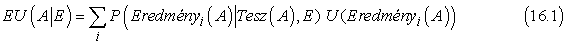

<?xml version="1.0" encoding="UTF-8" standalone="no"?>
<!DOCTYPE html PUBLIC "-//W3C//DTD XHTML 1.1//EN" "http://www.w3.org/TR/xhtml11/DTD/xhtml11.dtd">
<html xmlns="http://www.w3.org/1999/xhtml"><head><meta name="generator" content="DocBook XSL Stylesheets V1.76.1"/></head><body>

<h1 class="title"><a id="id703810"/>16. fejezet - Egyszerű döntések meghozatala</h1>

Ebben a fejezetben láthatjuk, hogyan kell egy ágensnek döntéseket úgy meghoznia, hogy elérje, amit akar – az esetek nagy részében legalábbis.

Ebben a fejezetben visszatérünk a hasznosságelmélet gondolatához, amit a 13. fejezetben vezettünk be. Megmutatjuk a hasznosságelméletnek a valószínűség-számítással való összekapcsolását egy döntéselméleti ágens létrehozásához, amely a meggyőződéseinek és célkitűzéseinek megfelelő racionális döntéseket képes hozni. Az ilyen ágensek képesek döntéseket hozni olyan esetekben is, amikor a bizonytalanság és az ellentétes célok egy logikai ágens számára nem tennék lehetővé a döntést. Egy célorientált ágens valójában az állapotokat két csoportba, egy jó (cél) és egy rossz (nem cél) csoportba sorolja be, míg egy döntéselméleti ágens az állapotok jóságát egy folytonos mértékkel fejezi ki.

A 16.1. alfejezet a döntéselmélet alapvető elveit vezeti be: a várható hasznosság maximálását. A 16.2. alfejezet megmutatja, hogy bármely racionális ágens viselkedése leírható egy hasznosságfüggvény feltételezésével és egy azon alapuló maximálással. A 16.3. alfejezet részletesebben megvizsgálja a hasznosságfüggvény tulajdonságait, különösen ezek kapcsolatát olyan egyedi mennyiségekhez, mint a pénz. A 16.4. alfejezet ismerteti, hogyan lehet a több mennyiségtől függő hasznosságfüggvényeket kezelni. A 16.5. alfejezet leírja a döntéshozó rendszerek megvalósítását. Nevezetesen, bevezetjük a <strong>döntési hálózat</strong>ok (<strong>decision network</strong>s) formalizmust – más néven <strong>hatásdiagram</strong>ot, (<strong>influence diagram</strong>) –, ami kiterjeszti a valószínűségi hálózatokat, hogy a „cselekvéseket” és a „hasznosságokat” is tudják kezelni. A fejezet többi része azokat a kérdéseket vizsgálja, amelyek a döntéselméletnek a szakértői rendszerekkel kapcsolatos alkalmazásakor lépnek fel.

<h1 class="title"><a id="id703840"/>Meggyőződések és kívánságok összekapcsolása bizonytalanság esetén</h1>

Arnauld francia filozófus az 1662-ben írt <em>Port-Royal Logic</em> c. művében azt írta, hogy

Annak megítéléséhez, hogy valaki elérje a jót, és elkerülje a gonoszt, nemcsak a jót és a gonoszt kell önmagában megfontolni, hanem annak valószínűségét is, hogy ezek megtörténnek-e vagy sem; és azt az arányt kell megnézni, amely ezek együtteséhez tartozik.

A kortárs tudományos szövegek inkább hasznosságról beszélnek, mint jóról és gonoszról, de az elvek ugyanazok. Az ágens preferenciáit a világ állapotai között egy <strong>hasznosságfüggvény</strong> (<strong>utility function</strong>) adja meg, ami az egyes állapotok kívánatosságának kifejezésére minden állapothoz egyetlen számot rendel. A hasznosságokat a cselekedetek következményeinek a valószínűségével kombinálva kapjuk az egyes cselekedetekhez tartozó várható hasznosságot.

Egy <em>S</em> állapotnak a döntést meghozó ágens szempontja szerinti hasznosságára az <em>U</em>(<em>S</em>) jelölést fogjuk használni. Mostani vizsgálódásunknál az állapotokat a világ teljes pillanatfelvételeinek fogjuk tekinteni, hasonlóan a 10. fejezetben szereplő <strong>szituáció</strong>khoz (<strong>situation</strong>s). Bár ez egyszerűsíti a kezdeti fejtegetésünket, a hasznosság definiálása minden egyes állapotra külön-külön elég nehézkessé válhat. A 16.4. alfejezetben látni fogjuk, hogy az állapotok hogyan bonthatók fel bizonyos körülmények között a hasznosság hozzárendelése érdekében.

Egy nemdeterminisztikus <em>A</em> cselekvésnek az <em>Eredményi</em>(<em>A</em>) állapotok a lehetséges következményei, ahol az <em>i</em> index a különböző következményeken fut végig. Az <em>A</em> végrehajtása előtt az ágens egy <em>P</em>(<em>Eredményi</em>(<em>A</em>)|<em>Tesz</em>(<em>A</em>), <em>E</em>) valószínűséget rendel minden egyes következményhez, ahol az <em>E</em> az ágens által a világról elérhető tényeket jelöli, és a <em>Tesz</em>(<em>A</em>) egy állítás, hogy az <em>A</em> cselekvés végrehajtódik a jelenlegi állapotban. Ekkor a következő formulával kiszámíthatjuk a cselekvés <em>EU</em>(<em>A</em>|<em>E</em>) <strong>várható hasznosság</strong>át (<strong>expected utility</strong>) adott tények esetén:

A <strong>maximális várható hasznosság</strong> (<strong>MVH</strong>) (<strong>maximum expected utility</strong>,<strong> MEU</strong>) elve azt mondja ki, hogy egy racionális ágensnek azt a cselekvést kell választania, ami maximalizálja az ágens várható hasznosságát. Ha cselekvések egy legjobb sorozatát szeretnénk kiválasztani ennek az egyenletnek a felhasználásával, akkor az összes lehetséges cselekvéssorozatot számba kellene venni, és a legjobbat kiválasztani, ami hosszú sorozatok esetén nyilvánvalóan nem lehetséges. Ezért ez a fejezet egyszerű döntésekre (általában egyetlen cselekvésre vonatkozó döntésekre) koncentrál, és a következő fejezet mutat be új technikákat cselekvéssorozatok hatékony kezelésére. 

Bizonyos értelemben az MVH-elv felfogható a teljes MI meghatározásának. Hiszen egy intelligens ágensnek mindössze annyit kell tennie, hogy kiszámítja a különféle mennyiségeket, maximalizálja a hasznosságot a cselekvései felett, és kész. Ám ez nem jelenti, hogy ezzel a definícióval az MI problémaköre meg lenne <em>oldva!</em>

Ámbár az MVH-elv bármely döntési helyzet esetén meghatározza a helyes cselekvést, a szükséges számítások lehetnek kivitelezhetetlenek, és néha maga a probléma megfogalmazása is bonyolult. A világ kezdeti állapotának ismerete érzékelést, tanulást, tudásreprezentációt és következtetést igényel. A <em>P</em>(<em>Eredményi</em>(<em>A</em>)|<em>Tesz</em>(<em>A</em>), <em>E</em>) kiszámítása a világ teljes okozati modelljét igényli, és – ahogyan azt a 14. fejezetben láttuk – NP-teljes számítást a valószínűségi hálózatokban. Az egyes állapotok <em>U</em>(<em>Eredményi</em>(<em>A</em>)) hasznosságának a kiszámítása gyakran keresést vagy tervezést igényel, mivel az ágens nem tudja, hogy egy állapot mennyire jó addig, ameddig nem tudja, hogy hova is kerülhet ebből az állapotból. Így a döntéselmélet nem csodaszer, ami megoldja az MI-problémát. Másrészről azonban, ez egy olyan keretet ad, amelyben áttekinthető egy MI-rendszer összes részének a beilleszkedése.

<h3 class="title">Fontos</h3>
Az MVH-elv egyértelműen kapcsolódik a 2. fejezetben felvetett teljesítménymértékek elképzeléshez. Az alapötlet nagyon egyszerű. Tekintsük azokat a lehetséges környezeteket, amelyek érzékeléssel és memóriával rendelkező ágenseket tesznek lehetővé, és gondoljuk át azt, hogy milyen lehetséges ágenseket tudnánk tervezni. <em>Ha egy ágens maximalizálja a hasznosságfüggvényét, és az helyesen tükrözi a teljesítmény mértékét, amivel a viselkedését megítélik, akkor ez a lehető legmagasabb teljesítménypontszámot éri el, ha a hasznosságot azon lehetséges környezetek felett átlagoljuk, amelyekbe az ágens kerülhet. </em>Ez az alapvető igazolása az MVH-elvnek. Bár az állítás tautológiának tűnhet, valójában nagyon fontos átmenetet jelent a racionalitás globális, külső kritériumaitól – a múltbeli környezetek felett vett teljesítménytől – egy lokális, belső kritériumig, ami a következő állapotra vonatkozó hasznosságfüggvény maximalizálását jelenti.

Ebben a fejezetben csak az egyszeri vagy <strong>egylépéses döntés</strong>ekkel (<strong>one-shot </strong><strong>decision</strong>s) foglalkozunk, bár a 2. fejezet a teljesítménymértékeket a múltbeli környezetek felett definiálja, amelyek általában számos döntést tartalmaznak. A következő fejezetben, ami a <strong>szekvenciális döntés</strong>ekkel (<strong>sequential decision</strong>s) foglalkozik, megmutatjuk, hogy ez a két nézet hogyan békíthető össze.

</body></html>
