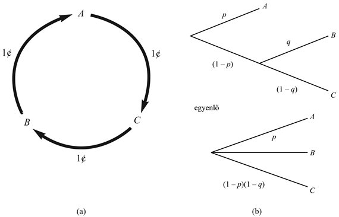
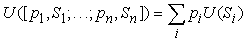

<?xml version="1.0" encoding="UTF-8" standalone="no"?>
<!DOCTYPE html PUBLIC "-//W3C//DTD XHTML 1.1//EN" "http://www.w3.org/TR/xhtml11/DTD/xhtml11.dtd">
<html xmlns="http://www.w3.org/1999/xhtml"><head><meta name="generator" content="DocBook XSL Stylesheets V1.76.1"/></head><body>

<h1 class="title"><a id="id704077"/>A hasznosságelmélet alapjai</h1>

Ránézésre az MVH-elv ésszerű módszernek látszik döntések meghozatalára, de az nem világos, hogy vajon ez-e az <em>egyetlen </em>lehetőség. Végül is, a hasznosság <em>átlagának </em>maximálása miért is lenne olyan különleges? Miért nem maximalizáljuk a lehetséges hasznosságok köbeinek összegét, vagy miért nem minimalizáljuk a lehetséges veszteségek maximumát? Hasonlóan, miért nem cselekedhet az ágens racionálisan, ha csupán az állapotok közötti preferenciáit rögzítené, és nem rendelne hozzájuk numerikus értéket? Végül, egyáltalán miért kell léteznie egy megkövetelt tulajdonságokkal rendelkező hasznosságfüggvénynek? Talán egy racionális ágensnek olyan bonyolult a preferenciarendszere, hogy azt nem lehet ilyen egyszerűen az egyes állapotokhoz rendelt valós számokkal kifejezni.

<h2 class="title"><a id="id704092"/>Megkötések a racionális preferenciákra</h2>

Ezek a kérdések megválaszolhatók, ha leírjuk a preferenciákra vonatkozó azon megkötéseket, amelyekkel egy racionális ágensnek rendelkeznie kell, majd ezután megmutatjuk, hogy az MVH-elv ezekből a megkötésekből levezethető. Az ágens preferenciáit a következő jelöléssel írjuk le:

<code class="code"><em>A</em> ≻ <em>B</em>	<em>A</em> preferált <em>B</em>-hez képest</code>

<code class="code"><em>A</em> ∼ <em>B</em>	az ágens egyformán preferálja <em>A</em>-t és <em>B</em>-t</code>

<code class="code"><em>A</em> ≿ <em>B</em>	az ágens <em>A</em>-t preferálja <em>B</em>-hez képest, vagy egyformán preferálja <em>A</em>-t és <em>B</em>-t</code>

Természetesen tisztázni kell, hogy mit is jelölhet<em> A</em> és <em>B</em>. Ha az ágens cselekvései determinisztikusak, akkor <em>A</em> és <em>B</em> tipikusan a cselekvések konkrét, teljesen specifikált eredményállapotai. Az általánosabb, nemdeterminisztikus esetben <em>A</em> és <em>B</em><strong> szerencsejáték</strong>ok (<strong>lotteries</strong>). Egy szerencsejáték alapvetően egy valószínűségi eloszlás az aktuális következmények halmaza felett (melyek a szerencsejáték „díjai”). Az <em>L</em> szerencsejátékot a <em>C</em>1, …,<em> Cn</em> következményekkel, amelyek <em>p</em>1, …, <em>pn</em> valószínűségekkel következhetnek be, a következőképpen jelöljük:

<code class="code"><em>L</em> = [<em>p</em>1, <em>C</em>1; <em>p</em>2, <em>C</em>2; …<em> pn</em>,<em> Cn</em>]</code>

<a id="id704260"/>
<strong>16.1. ábra - (a) A cserék egy teljes ciklusa, bemutatva, hogy a nemtranzitív <em>A</em> ≻ <em>B</em> ≻ <em>C</em> ≻ <em>A</em> preferenciák irracionális viselkedést eredményeznek. (b) A felbonthatósági axióma.</strong>

(Az egyetlen következménnyel rendelkező szerencsejáték <em>A</em>-val vagy [1, <em>A</em>]-val jelölhető.) Általában egy szerencsejáték bármely következménye lehet egy atomi állapot vagy egy másik szerencsejáték. Az elsődleges kérdés a hasznosságelmélet számára annak megértése, ahogyan az összetett szerencsejátékok közötti preferenciák viszonyulnak ezen szerencsejátékokat meghatározó állapotok közötti preferenciákhoz.

Ennek eléréséhez ésszerű megkötéseket írunk elő a preferenciarelációkra, hasonlóan ahhoz, ahogyan racionális kényszereket vártunk el a meggyőződés mértékeivel kapcsolatban a valószínűség axiómáinak a származtatásánál a 13. fejezetben. Egy ésszerű megkötés, hogy a preferenciák <strong>tranzitív</strong>ak (<strong>transitive</strong>) legyenek: azaz ha <em>A </em>≻ <em>B</em> és <em>B </em>≻ <em>C</em>, akkor elvárhatjuk, hogy <em>A </em>≻ <em>C</em>. A tranzitivitás indoklásaként megmutatjuk, hogy egy ágens, amelynek a preferenciái nem tranzitívak, irracionálisan viselkedne. Tételezzük például fel, hogy egy ágens preferenciái nem tranzitívak: <em>A</em> ≻ <em>B</em> ≻ <em>C </em>≻ <em>A</em>, ahol <em>A</em>, <em>B</em> és <em>C</em> áruk, amik szabadon cserélhetők. Ha az ágensnél jelenleg <em>A</em> van, akkor felkínálhatjuk <em>C</em>-t cserébe <em>A</em>-ért és egy kis pénzért. Ha az ágens jobban szereti <em>C</em>-t, akkor hajlandó lesz pénzt is áldozni <em>C</em> megszerzésére. Ezután felkínálhatjuk <em>B</em>-t <em>C</em>-ért, még több pénzt begyűjtve, és végül elcseréljük <em>B</em>-t <em>A</em>-ért. Ezzel visszaértünk a kezdeti állapotba, azt leszámítva, hogy az ágensnek kevesebb a pénze (16.1. (a) ábra). Ezt a ciklust addig folytathatjuk, ameddig az ágens összes pénze el nem fogy. Indokoltnak látszik azt állítani, hogy az ágens ebben a helyzetben nem cselekedett racionálisan.

A következő hat megkötést a hasznosságelmélet axiómáinak szokás tekinteni. Ezek a preferenciákra és a szerencsejátékokra vonatkozó legnyilvánvalóbb szemantikai megkötéseket határozzák meg.

<ul class="itemizedlist"><li class="listitem">
<strong>Sorrendezhetőség</strong> (<strong>orderability</strong>). Bármely két állapot esetén az ágensnek vagy preferálnia kell az egyiket a másikkal szemben, vagy egyformán preferáltnak kell minősítenie mindkettőt. Azaz az ágens nem kerülheti el a döntést. Ahogyan az <a class="xref" href="ch13s03.md#ID_557_558_oldal">„A valószínűségi axiómák használata”</a> részben tárgyaltuk, egy fogadás visszautasítása az idő folyásának a felfüggesztéséhez hasonló.
</li></ul>

<code class="code">	(<em>A </em>≻ <em>B</em>) ⋁ (<em>B </em>≻ <em>A</em>) ⋁ (<em>A </em>≻ <em>B</em>)</code>

<ul class="itemizedlist"><li class="listitem">
<strong>Tranzitivitás</strong> (<strong>transitivity</strong>). Bármely három állapot esetén, ha az ágens preferálja <em>A</em>-t <em>B</em>-vel szemben, és <em>B</em>-t <em>C</em>-vel szemben, akkor az ágensnek preferálnia kell <em>A</em>-t is <em>C</em>-vel szemben.
</li></ul>

<code class="code">	(<em>A</em> ≻ <em>B</em>) ⋀ (<em>B</em> ≻ <em>C</em>) ⇒ (<em>A</em> ≻ <em>C</em>)</code>

<ul class="itemizedlist"><li class="listitem">
<strong>Folytonosság</strong> (<strong>continuity</strong>). Ha valamely <em>B</em> állapot <em>A </em>és <em>C </em>között helyezkedik el a preferenciák szempontjából, akkor létezik egy <em>p </em>valószínűség, amely mellett a racionális ágens számára közömbössé válik, hogy a biztos <em>B-</em>t<em> </em>kapja, vagy egy olyan szerencsejátékot, amiben <em>p </em>valószínűséggel <em>A</em>, 1 – <em>p</em> valószínűséggel pedig <em>C </em>nyerhető.
</li></ul>

<code class="code"><em>	A</em> ≻ <em>B</em> ≻ <em>C</em> ⇒ ∃<em>p </em>[<em>p</em>, <em>A</em>; 1 – <em>p</em>, <em>C</em>] ∼ <em>B</em></code>

<ul class="itemizedlist"><li class="listitem">
<strong>Helyettesíthetőség</strong> (<strong>substitutability</strong>). Ha egy ágens az <em>A </em>és <em>B </em>szerencsejátékot egyformán preferálja, akkor az ágens két összetettebb szerencsejátékot is egyformán preferál, amelyek csak abban különböznek, hogy az egyikben <em>A B</em>-re van cserélve. Ez a szerencsejátékokbeli valószínűségektől és más kimenetektől függetlenül igaz.
</li></ul>

<code class="code"><em>	A </em>∼ <em>B</em> ⇒ [<em>p</em>, <em>A</em>; 1 – <em>p</em>, <em>C</em>] ∼ [<em>p</em>, <em>B</em>; 1 – <em>p</em>, <em>C</em>]</code>

<ul class="itemizedlist"><li class="listitem">
<strong>Monotonitás</strong> (<strong>monotonicity</strong>). Tételezzük fel, hogy két szerencsejátéknak ugyanaz a két kimenetele van, <em>A </em>és <em>B</em>. Ha az ágens <em>A</em>-t preferálja <em>B</em>-vel szemben, akkor az ágensnek azt a szerencsejátékot kell preferálnia, ami nagyobb valószínűséggel eredményezi <em>A</em>-t (és fordítva is).
</li></ul>

<code class="code">	<em>A</em> ≻ <em>B </em>⇒ (<em>p</em> ≥ <em>q</em> ⇔ [<em>p</em>, <em>A</em>; 1 – <em>p</em>, <em>B</em>] ≿ [<em>q</em>, <em>A</em>; 1 – <em>q</em>, <em>B</em>]</code>

<ul class="itemizedlist"><li class="listitem">
<strong>Felbonthatóság</strong> (<strong>Decomposability</strong>): Összetett szerencsejátékok egyszerűbbekre bonthatók a valószínűség-számítás szabályai szerint. Ezt „a hazárdjáték unalmas” szabálynak nevezték el, mivel ez azt mondja ki, hogy két egymást követő szerencsejátékot össze lehet olvasztani egyetlen ekvivalens szerencsejátékba, ahogyan azt a 16.1. ábra mutatja.[<a id="id704743" href="#ftn.id704743" class="footnote">165</a>]
</li></ul>

<code class="code">	[<em>p</em>, <em>A</em>; 1 – <em>p</em>, [<em>q</em>, <em>B</em>; 1 – <em>q</em>, <em>C</em>]] ∼ [<em>p</em>, <em>A</em>; (1 – <em>p</em>)<em>q</em>, <em>B</em>; (1 – <em>p</em>)(1 – <em>q</em>), <em>C</em>]</code>

<h2 class="title"><a id="id704805"/>És aztán jött a hasznosság</h2>

Vegyük észre, hogy a hasznosságelmélet axiómái nem mondanak semmit a hasznosságról. Kizárólag a preferenciákról szólnak. Azaz a racionális ágens alapvető tulajdonságainak a preferenciákat tételezzük fel. A hasznosságfüggvény létezése a hasznosság- axiómákból <em>következik:</em>

<ol class="orderedlist"><li class="listitem">
A <strong>hasznosság elv</strong> (<strong>utility principle</strong>)
</li></ol>

	Ha az ágens preferenciái eleget tesznek a hasznosság axiómáinak, akkor létezik egy, az állapotokon értelmezett <em>U</em> valós értékű függvény, mellyel <em>U</em>(<em>A</em>) &gt; <em>U</em>(<em>B</em>) akkor és csak akkor, ha <em>A</em> preferált <em>B</em>-vel szemben, és <em>U</em>(<em>A</em>) = <em>U</em>(<em>B</em>) akkor és csak akkor, ha az ágens számára <em>A</em> és <em>B</em> egyformán preferált.

<code class="code"><em>	U</em>(<em>A</em>)  &gt; <em>U</em>(<em>B</em>) ⇔ <em>A </em>≻ <em>B</em></code>

<code class="code"><em>	U</em>(<em>A</em>) = <em>U</em>(<em>B</em>) ⇔ <em>A</em> ∼ <em>B</em></code>

<ol class="orderedlist"><li class="listitem">
A <strong>maximális várható hasznosság elve</strong> (<strong>maximum Expected Utility principle</strong>)
</li></ol>

	Egy szerencsejáték hasznossága az egyes kimenetelek valószínűségeivel szorzott kimenetelhasznosságok összege.

Más szóval, amint a lehetséges kimeneteli állapotoknak a valószínűségei és hasznosságai specifikáltak, az ezeket tartalmazó összetett szerencsejáték hasznossága teljesen meghatározott. Mivel egy nemdeterminisztikus cselekmény kimenetele egy szerencsejáték, ez egy MVH-alapú döntési szabályt jelent a (16.1) egyenlet szerint.

Fontos megjegyezni, hogy a hasznosságfüggvény léte, ami leírja az ágens preferenciáit, nem jelenti azt szükségszerűen, hogy az ágens <em>explicit módon</em> maximalizál egy hasznosságfüggvényt a mérlegelései során. Amint azt a 2. fejezetben megmutattuk, racionális viselkedés számos módon előállítható, némelyik sokkal hatékonyabb, mint
a hasznosság maximalizálásának explicit elvégzése. Az ágens preferenciáinak megfigyelésével azonban lehetségessé válik a hasznosságfüggvény megkonstruálása, ami az ágens elérni szándékozott céljait reprezentálja.

 

[<a id="ftn.id704743" href="#id704743" class="para">165</a>]  A hazárdjáték élvezetét ekkor úgy modellezhetjük, hogy belefoglalhatjuk a hazárdjátékjátszás eseményeit az állapotleírásokba; például a „10 dollár és hazárdjátékjátszás” preferált lehet a „10 dollár hazárdjátékjátszás nélkül”-lel szemben.

</body></html>
