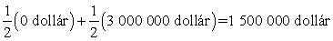
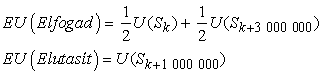
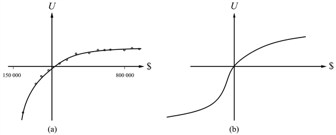
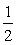

<?xml version="1.0" encoding="UTF-8" standalone="no"?>
<!DOCTYPE html PUBLIC "-//W3C//DTD XHTML 1.1//EN" "http://www.w3.org/TR/xhtml11/DTD/xhtml11.dtd">
<html xmlns="http://www.w3.org/1999/xhtml"><head><meta name="generator" content="DocBook XSL Stylesheets V1.76.1"/></head><body>

<h1 class="title"><a id="id705539"/>Hasznosságfüggvények</h1>

A hasznosság egy függvény, ami valós számokat rendel az állapotokhoz. Vajon ez minden, amit a hasznosságfüggvényről el lehet mondani? Szigorúan nézve, igen, ennyi. A korábban felsorolt megkötéseknek eleget téve az ágensnek tetszőleges preferenciái lehetnek. Például az ágens preferálhatja, hogy a bankbetétjein elhelyezett dollárok száma prímszám legyen; ekkor, ha 16 dollárja volna, 3-at elajándékozna. Lehet, hogy egy 1973-as ütött-kopott Ford Pintót jobban szeret, mint egy csillogó új Mercedest. A preferenciák kapcsolatban állhatnak egymással; például lehet, hogy csak akkor preferál prímszámú dollárt, ha Pintója van, de amikor Mercedese van, akkor a több dollárt jobban szereti, mint a kevesebbet.

Ha az összes hasznosságfüggvény ilyen tetszőleges volna, mint ez, akkor viszont a hasznosságelméletnek nem lenne sok haszna, mivel meg kellene figyelnünk az ágens preferenciáit minden lehetséges körülmény esetén, mielőtt a viselkedésével kapcsolatban bármilyen előrejelzésre is képesek lennénk. Szerencsére az igazi ágensek preferenciái sokkal rendszerezettebbek. Ennek megfelelően szisztematikus módszerek léteznek a hasznosságfüggvények megtervezésére, amelyeket aztán egy mesterséges ágensbe beépítve az ágens a helyes, általunk elvárt viselkedést fogja produkálni.

<h2 class="title"><a id="id705548"/>A pénz hasznossága</h2>

A hasznosságelmélet a közgazdaságtanból származik, a közgazdaságtan pedig egy nyilvánvaló jelöltet kínál a hasznosság mérésére: a pénzt (vagy pontosabban az ágens teljes nettó vagyonát). A pénz majdnem univerzális felcserélhetősége bármely árura és szolgáltatásra azt mutatja, hogy a pénz jelentős szerepet játszik az emberi hasznosságfüggvényekben. (Valójában, a legtöbb ember a közgazdaságtant a pénz tanulmányozásához köti, pedig a <em>közgazdaság</em> szó gyökere a gazdálkodásra vonatkozik, míg jelenleg a hangsúly a választások kezelésén van.)

Ha csak azokat a cselekvéseket vesszük figyelembe, amelyek az ágens pénzmennyiségét befolyásolják, akkor általában az lesz a tapasztalat, hogy az ágens a több pénzt előnyben részesíti a kevesebbel szemben, ha egyéb dolgok egyenlők. Azt mondjuk, hogy az ágens <strong>monoton preferenciá</strong>t (<strong>monotonic preference</strong>) mutat egy adott összegű pénz esetén. Azonban ez nem elegendő annak garantálására, hogy a pénzt egy hasznosságfüggvénynek tekinthessük, mivel ez semmit sem mond azon <em>szerencsejátékok</em> közötti preferenciákról, amelyek kimenetele pénz.

Tételezzük fel, hogy ön győzedelmeskedett a versenytársak felett egy televíziós játékban. A házigazda most választásra kéri fel: elviheti az 1 000 000 dolláros díjat, vagy felteheti egy pénzfeldobásos hazárdjátékon. Ha fej, nem kap semmit, ha írás, akkor kap 3 000 000 dollárt. Ha hasonló a többi emberhez, akkor vonakodna játszani, és zsebre vágná a milliót. Ez irracionális volna?

Feltéve, hogy hisz az érme szabályos voltában, a játék várható pénzügyi értéke (VPÉ) (expected monetary value)   , és az eredeti díj, a VPÉ-je természetesen 1 000 000 dollár, ami kisebb. De ez nem jelenti szükségszerűen, hogy a hazárdjáték elfogadása a jobb döntés. Tételezzük fel, hogy <em>S</em><em>n</em> jelöli az <em>n</em> dollárt birtokló állapotot, és a jelenlegi vagyon <em>k </em>dollár. Ekkor a két cselekedetnek, a hazárdjáték elfogadásának vagy visszautasításának a várható hasznossága:

Annak eldöntéséhez, hogy mit is tegyünk, az egyes kimeneteli állapotokhoz hasznosságot kell rendelnünk. A hasznosság nem közvetlenül arányos a pénzügyi értékkel, mivel a hasznosság – az okozott pozitív változás az életstílusban – az első millió dollár esetén nagyon nagy (vagy legalábbis azt mondják), ezzel szemben a további milliók hasznossága sokkal kisebb. Tételezzük fel, hogy 5-ös hasznosságot rendel a jelenlegi (<em>Sk</em>) pénzügyi helyzethez, 10-et az <em>S</em><em>k</em>+3 000 000 állapothoz, 8-at az <em>S</em><em>k</em>+1 500 000 állapothoz. Ekkor a racionális döntés az elutasítás lenne, mivel az elfogadás várható hasznossága 7,5 (kisebb, mint az elutasításhoz tartozó 8). Most tételezze fel, hogy már van a számláján 500 000 000 dollár (és a játékban való részvétel csak a móka kedvéért történik). Ebben az esetben a hazárdjáték valószínűleg elfogadható, feltéve, hogy a több pénzt preferálja a kevesebbel szemben, mivel az 503-adik millió haszna valószínűleg ugyanakkora, mint az 501-edik millióé.

A valóságos hasznossági függvényekről szóló úttörő jelentőségű tanulmányban Grayson azt találta, hogy a pénz hasznossága majdnem teljesen arányos a mennyiségének <em>logaritmusával</em> (Grayson, 1960). (Ezt először Bernoulli vetette fel [Bernoulli, 1783]; lásd 16.3. feladat.) Egy ilyen görbe, egy bizonyos Beard úré, a 16.2. (a) ábrán látható. A Beard úrtól kapott preferenciák konzisztensek a következő hasznossági függvénnyel:

<code class="code"><em>U</em>(<em>S</em><em>k</em>+<em>n</em>) = –263,31 + 22,09 log(<em>n</em> + 150 000)</code>

az <em>n </em>= –150 000 dollár és <em>n </em>= 800 000 dollár közötti tartományban.

Azt nem tételezhetjük fel, hogy ez egy univerzális hasznosságfüggvénye a vagyoni értéknek, de valószínű, hogy a legtöbb embernek olyan hasznosságfüggvénye van, ami konkáv a pozitív tartományban. Adósságba keveredni általában vészesnek tartott dolog, de a preferenciák a különböző adósságszintek között a pozitív tartománybeli konkávitás megfordulását is mutathatják. Például ha valakinek már van 10 000 000 dollár adósága, akkor lehet, hogy igencsak részt vesz egy olyan pénzfeldobásos hazárdjátékban, ahol 10 000 000 dollár a nyeremény, ha fej, és 20 000 000 dollár a veszteség, ha írás.[<a id="id705676" href="#ftn.id705676" class="footnote">166</a>] Ez egy S alakú görbét eredményez, amit a 16.2. (b) ábra mutat.

<a id="id705682"/>
<strong>16.2. ábra - A pénz hasznossága. (a) Empirikus adat Beard úrtól egy korlátos tartományban. (b) Egy tipikus görbe a teljes tartományban.</strong>

Ha csak a görbe pozitív részét vizsgáljuk, ahol a meredekség csökken, akkor itt bármely <em>L</em> szerencsejáték esetén a várható hasznosság kisebb, mint annak a biztos eseménynek a hasznossága, amikor az átadott pénzügyi érték a várható pénzügyi értékkel egyezik meg.

<code class="code"><em>U</em>(<em>L</em>) &lt; <em>U</em>(<em>S</em><em>VPÉ</em>(<em>L</em>))</code>

Azaz az ilyen alakú görbével rendelkező ágens <strong>kockázatkerülő</strong> (<strong>risk-averse</strong>): előnyben részesít egy biztos eseményt egy szerencsejátékkal szemben, még akkor is, ha a biztos összeg kisebb, mint a szerencsejáték várható pénzügyi értéke. Másfelől, a 16.2. (b) ábrán a nagy adóságokhoz tartozó „elkeseredett” régióban a viselkedés <strong>kockázatkereső</strong> (<strong>risk-seeking</strong>). Azt az értéket, amit az ágens a szerencsejáték helyett elfogad, a játék <strong>determinisztikus ekvivalens</strong>ének (<strong>certainty equivalent</strong>) nevezzük. A tanulmányok azt mutatják, hogy a legtöbb ember elfogad körülbelül 400 dollárt egy olyan szerencsejátékért cserébe, ami  valószínűséggel eredményez 1000 dollárt és 0 dollárt – azaz ennek a szerencsejátéknak a determinisztikus ekvivalense 400 dollár. A szerencsejáték várható pénzügyi értéke és a determinisztikus ekvivalense közötti értéket <strong>biztosítási prémium</strong>nak (<strong>insurance premium</strong>) hívjuk. A kockázatkerülés az alapja a biztosítási üzletágnak, mivel ez azt jelenti, hogy a biztosítási prémium pozitív. Az emberek inkább fizetnek egy alacsonyabb biztosítási díjat, mintsem hogy kockára tegyék a házuk teljes árát egy lehetséges tűzeset miatt. Viszont a biztosítási társaságok szemszögéből a ház teljes ára igen kicsi a cég összes vagyonához képest. Emiatt a biztosító hasznossági görbéje megközelítően lineáris ebben a kicsiny régióban, és a biztosítás a társaságnak alig kerül valamibe. 

Vegyük észre, hogy a <em>kis </em>vagyoni változások az aktuális vagyoni helyzethez képest közel lineárisak a görbe bármely szakaszán. A lineáris görbével rendelkező ágenst <strong>kockázatsemleges</strong>nek (<strong>risk-neutral</strong>) nevezzük. Ezért kis összegű hazárdjátékok esetén kockázatsemlegességet várhatunk el. Egy bizonyos értelemben ez igazolja azt az egyszerűsített eljárást, ami kis összegű szerencsejátékokkal segítette valószínűségek megbecsülését, és igazolta a valószínűség-számítás axiómáit a 13. fejezetben.

<h2 class="title"><a id="id705787"/>Hasznosságskálák és a hasznosság megbecslése</h2>

A hasznosságaxiómák, ha az ágens viselkedési preferenciái rögzítettek, nem határoznak meg egy kitüntetett hasznosságfüggvényt. Például az <em>U</em>(<em>S</em>) hasznosságfüggvényt a következő alakra transzformálhatjuk:

<code class="code"><em>U</em>′(<em>S</em>) = <em>k</em>1 + <em>k</em>2 <em>U</em>(<em>S</em>)</code>

ahol<em> k</em>1 egy állandó és <em>k</em>2<em> </em>egy tetszőleges pozitív állandó. Nyilvánvaló, hogy ez a lineáris transzformáció nem befolyásolja az ágens viselkedését.

<em>Determinisztikus</em> környezetekben, ahol állapotok vannak, és nincsenek szerencsejátékok, a viselkedés nem fog megváltozni semmilyen <em>monoton</em> transzformációra. Például vehetjük a köbét az összes hasznosságnak anélkül, hogy ez a cselekmények preferenciarendezését befolyásolná. Egy determinisztikus környezetben lévő ágens esetén azt mondjuk, hogy az ágensnek <strong>értékfüggvény</strong>e (<strong>value function</strong>) vagy<strong> sorrendezett hasznosságfüggvény</strong>e (<strong>ordinal utility function</strong>) van; a függvény valójában csak az állapotok sorrendezését biztosítja, és nem ad értelmezhető numerikus értékeket. Ezt a különbségtételt láttuk a 6. fejezetben a játékok esetén: determinisztikus játékokban, mint a sakk, a kiértékelő függvények értékfüggvények, míg nemdeterminisztikus játékokban, mint az ostábla, ezek valódi hasznosságfüggvények.

<h3 class="title">Fontos</h3>
<strong>Emberi ítélethozatal és a hibázás lehetősége</strong>

A döntéselmélet egy <strong>normatív elmélet</strong> (<strong>normative theory</strong>): azt írja elő, hogy az ágensnek hogyan <em>kell </em>cselekednie. A közgazdaságtan elméletének alkalmazását nagyban javítaná, ha ez egyben egy <strong>leíró</strong> (<strong>descriptive</strong>) elmélet is volna az aktuális emberi döntéshozatalról. Azonban kísérleti bizonyítékok vannak arra, hogy az emberek szisztematikusan megsértik a hasznosságelmélet axiómáit. Egy példát a pszichológus Tversky és Kahneman adnak a közgazdász Allais példája alapján (Tversky és Kahneman, 1982; Allais, 1953). A kísérleti személyeknek kétszer kell választaniuk, az <em>A</em> és a <em>B </em>szerencsejáték, majd a <em>C </em>és a <em>D </em>szerencsejáték között.

<em>A</em>: 4000 dollár 80% eséllyel		<em>C</em>: 4000 dollár 20% eséllyel

<em>B</em>: 3000 dollár 100% eséllyel		<em>D</em>: 3000 dollár 25% eséllyel

A többség <em>B</em>-t választja <em>A</em>-val szemben, és <em>C</em>-t <em>D</em>-vel szemben. De ha elfogadjuk, hogy <em>U</em>(0 dollár) = 0, akkor az első választás arra utal, hogy 0,8<em>U</em>(4000 dollár) &lt; <em>U</em>(3000 dollár), míg a második választás pontosan a fordítottjára. Másképpen fogalmazva, nincs olyan hasznosságfüggvény, ami ezekkel a választásokkal konzisztens lenne. Az egyik lehetséges következtetés, hogy az emberek egyszerűen irracionálisak a hasznosságelmélet axiómái alapján. Egy alternatív nézet, hogy az elemzés nem veszi figyelembe a <strong>megbánás</strong>t (<strong>regret</strong>) – azt az érzést, amiről az emberek tudják, hogy érezni fognak, ha egy biztos nyeremény (<em>B</em>) helyett egy 80%-os valószínűségű nagyobb nyereményt választanak, majd vesztenek. Más szavakkal, ha <em>A</em>-t választja, 20% esélye van, hogy nem lesz pénze, és úgy érzi magát, mint egy komplett idióta.

Kahneman és Tversky továbbment, és kifejlesztett egy leíró elméletet, ami megmagyarázza, hogy az emberek miért kerülik a kockázatot nagy valószínűségű eseményeknél, viszont miért hajlandók nagyobb kockázatot vállalni valószínűtlen jutalmakkal. A kapcsolat az MI és ezen tapasztalat között az, hogy az ágensünk döntései csak annyira jók, amennyire jók a preferenciák, amin alapulnak. Ha az emberi informátoraink ellentmondásos preferenciákhoz ragaszkodnak, akkor az ágensünk semmit sem tud tenni, hogy konzisztens legyen velük.

Szerencsére, az emberek által hozott preferenciaítéletek gyakran könnyen felülbírálhatók későbbi megfontolások alapján. Keeney és Raiffa egy korai munkájukban a Harvard Business Schoolon a pénz hasznosságának a megbecslése kapcsán a következőt írta (Keeney és Raiffa, 1976, 210. o):

Kísérleti vizsgálatok nagy része mutatta ki, hogy súlyos hiányosságok vannak a becslési protokollban. A kísérleti személyek kicsiben hajlamosak túlságosan kockázatkerülővé válni és ezért… az illesztett hasznosságfüggvények elfogadhatatlanul nagy kockázati prémiumot mutatnak a nagy tartományú szerencsejátékokra. …A kísérleti személyek azonban rendezni tudják az inkonzisztenciájukat, és úgy érzik, hogy valami fontosat tanultak arról, hogyan akarnak viselkedni. Eredményképpen néhányan lemondták a gépjármű baleseti biztosításukat és több időszakos életbiztosítást kötöttek meg.

Az emberi (ir)racionalitás még ma is intenzív vizsgálatok tárgya.

A hasznosságok megbecsülésére egy megoldás, hogy választunk egy skálát a „lehető legnagyobb díj” <em>U</em>(<em>S</em>) = <em>u</em>┬ és a „lehető legnagyobb katasztrófa” <em>U</em>(<em>S</em>) = <em>u</em>⊥ alapján. <strong>Normált hasznosság</strong>ok (<strong>normalized utilities</strong>) esetén a skála <em>u</em>⊥<em> </em>= 0 és <em>u</em>┬<em> </em>= 1. A közbeeső kimenetelek hasznosságának a megbecslése úgy történik, hogy az ágenst megkérik, jelezze a preferenciáját az <em>S </em>kimeneteli állapot és egy [<em>p</em>, <em>u</em>┬; (1 – <em>p</em>),<em> u</em>⊥] <strong>standard szerencsejáték</strong> (<strong>standard lottery</strong>) között. A <em>p </em>valószínűséget addig módosítják, amíg az ágens nem preferálja egyformán<em> S</em>-et és a standard szerencsejátékot. Normalizált hasznosságokat feltételezve <em>S</em> hasznossága <em>p</em>. 

<h3 class="title">Fontos</h3>
Orvosi, szállítási és környezetvédelmi problémáknál, egyebek között, emberek élete forog kockán. Ezekben az esetekben <em>u</em>⊥ a közvetlen halálesethez (esetleg halálesetekhez) hozzárendelt érték. <em>Ámbár senkinek sem könnyű értékeket rendelni emberi életekhez, az tény, hogy szünet nélkül kompromisszumokat kötünk.</em> A repülőgépeket csak adott időközönként vetik alá ellenőrzéseknek, amit az utazások és megtett kilométerek határoznak meg, nem pedig minden utazás után. A költségcsökkentések miatt a gépkocsik karoszszériája viszonylag vékony fémből készül, a balesetek túlélési arányának csökkenése ellenére. Az ólmozott üzemanyag még mindig igen elterjedt, ámbár jól ismert, hogy az egészségre káros. Így paradox módon az az ellenkezés, hogy „az élet pénzben nem kifejezhető”, azt eredményezi, hogy az élet <em>alulértékelt</em>. Ross Shachter egy kormányhivatallal kapcsolatos élményéről számol be, amely hivatal megrendelt egy tanulmányt az azbeszt iskolákból történő eltávolításáról. A tanulmány egy adott pénzösszeget rendelt az iskoláskorú gyerekek életéhez, és úgy érvelt, hogy ezen feltevés mellett a racionális döntés az azbeszt eltávolítása. A kormányhivatal, morálisan felháborodva teljes mértékben elutasította a jelentést. Ezzel egyben az azbeszt eltávolítása ellen is döntöttek.

Történtek próbálkozások arra nézve, hogy kiderítsék, mennyi értéket tulajdonítanak az emberek az életüknek. Az orvosi és biztonsági elemzésekben két elterjedt „pénznemet” használnak, a <strong>mikrohalál</strong>t (<strong>micromort</strong>) (az egymilliomod esélyét az elhalálozásnak) és a <strong>QALY</strong>-t, vagy szabványos minőségű életévet (ami ekvivalens egy évvel, jó vagyoni helyzetben, betegségektől mentesen). Számos, személyek igen széles körét vizsgáló tanulmány azt mutatta, hogy a mikrohalál 20 dollárt ér (1980-ban). Azt már láttuk, hogy a hasznosságfüggvény nemlineáris, ezért ez nem jelenti azt, hogy a döntéshozó megölné magát 20 millió dollárért. Újra hangsúlyozandó, hogy a hasznossággörbe lokális linearitása azt jelenti, hogy a mikrohalál és a QALY értékei kis relatív kockázatok és jutalmak esetén hasznosak.

 

[<a id="ftn.id705676" href="#id705676" class="para">166</a>]  Az ilyen viselkedést elkeseredettnek nevezhetjük, mindazonáltal teljesen racionális, ha valaki kilátástalan helyzetben van.

</body></html>
