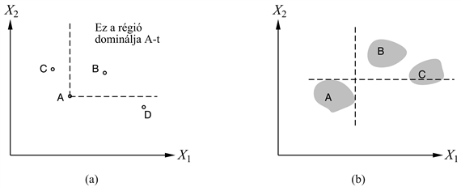
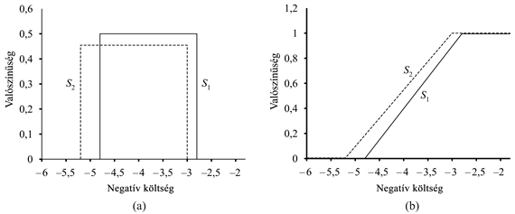
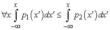
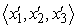
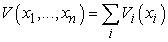

<?xml version="1.0" encoding="UTF-8" standalone="no"?>
<!DOCTYPE html PUBLIC "-//W3C//DTD XHTML 1.1//EN" "http://www.w3.org/TR/xhtml11/DTD/xhtml11.dtd">
<html xmlns="http://www.w3.org/1999/xhtml"><head><meta name="generator" content="DocBook XSL Stylesheets V1.76.1"/></head><body>

<h1 class="title"><a id="id706133"/>Többváltozós hasznosságfüggvények</h1>

A közérdekű ügyeknél történő döntéshozatal mind dollármilliókhoz, mind emberek életéhez és halálához is kapcsolódik. Például annak eldöntésekor, hogy rákkeltő anyagok milyen koncentrációi engedhetők meg a környezetben, a döntéshozóknak mérlegelniük kell a halál megelőzését és azokat a közgazdasági nehézségeket, amelyek bizonyos termékek és folyamatok megszüntetése miatt jelentkezhetnek. Egy új repülőtér elhelyezése esetén meg kell fontolni az építkezés okozta felfordulást; a telkek értékét; a népesebb központoktól való távolságot; a reptér zaját; a biztonsági kérdéseket a helyi földrajzi és az időjárási viszonyok tekintetében és így tovább. Az ehhez hasonló problémákat, ahol a kimenetelt két vagy több attribútum jellemez a <strong>többattribútumú hasznosságelmélet</strong> (<strong>multiattribute utility theory</strong>) kezeli.

Jelölje <strong>X </strong>= <em>X</em>1,<em> X</em>2, …,<em> Xn </em>az attribútumokat, az attribútumértékek vektorát pedig <strong>x </strong>= 〈<em>x</em>1,<em> x</em>2, …, <em>xn</em>〉. Általában minden attribútumról feltételezzük, hogy diszkrét vagy folytonos értékekkel rendelkezik. Az egyszerűség kedvéért feltételezzük, hogy az attribútumokat úgy határoztuk meg, hogy a nagyobb attribútumértékek nagyobb hasznosságértékékhez tartoznak, ha minden más változatlan. Például a repülőtér probléma esetén minél nagyobb a <em>ZajMentesség</em> értéke, annál jobb a megoldás. Bizonyos esetekben szükséges lehet az értéktartomány felosztása, ahol a hasznosságértékek az egyes tartományokban monoton módon változnak.

Elsőként azokat az eseteket vizsgáljuk meg, amikor döntéseket anélkül hozhatunk, hogy az attribútumértékeket egyetlen hasznosságértékké egyesítenénk. Majd azokat az eseteket vizsgáljuk, ahol az egyes attribútumkombinációk hasznosságát nagyon tömören lehet megadni.

<h2 class="title"><a id="id706205"/>Dominancia</h2>

Tételezzük fel, hogy az <em>S</em>1 reptér kevesebbe kerül, kisebb zajjal jár és biztonságosabb is, mint <em>S</em>2. Ekkor az mondjuk, hogy <em>S</em>1<em> </em><strong>szigorúan dominál</strong>ja (<strong>strict dominance</strong>) <em>S</em>2-t. Általában, ha egy lehetőség minden attribútumának kisebb az értéke, mint egy másik lehetőségé, akkor nem szükséges tovább vizsgálódni. A szigorú dominancia gyakran nagyon hasznos, mert leszűkíti a választási lehetőségeket a valódi jelöltekre, bár ritkán eredményez egyetlen választási lehetőséget. A 16.3. (a) ábra egy sematikus helyzetet mutat egy kétattribútumos esetben.

<a id="id706247"/>
<strong>16.3. ábra - Szigorú dominancia. (a) Determinisztikus: A-t szigorúan dominálja B, de sem C, sem D nem. (b) Bizonytalan: A-t szigorúan dominálja B, de C nem.</strong>

Mindez remekül használható determinisztikus esetekben, ahol a tulajdonságértékek biztosan ismertek. De mi történik abban az általános esetben, ahol a cselekvések kimenetele bizonytalan? A szigorú dominancia közvetlen analógiája könnyen megalkotható, ha a bizonytalanság ellenére, <em>S</em>1 minden lehetséges kimenetele szigorúan dominálja <em>S</em>2<em> </em>minden lehetséges kimenetelét. (Ezt mutatja a 16.3. (b) ábra sematikus ábrázolása.) Természetesen ez valószínűleg sokkal ritkábban fordul elő, mint a determinisztikus esetben.

Szerencsére létezik egy használhatóbb általánosítás, az úgynevezett <strong>sztochasztikus dominancia</strong> (<strong>stochastic dominance</strong>), ami valós problémáknál is gyakran előfordul. A sztochasztikus dominanciát könnyebb megérteni egyetlen változó esetében. Tételezzük fel, hogy a reptér költsége az <em>S</em>1 helyen egyenletes eloszlású 2,8 és 4,8 milliárd dollár között, és az <em>S</em>2<em> </em>helyszínen a költség egyenletes eloszlású 3,0 és 5,2 milliárd dollár között. A 16.4. (a) ábra ezen költségek eloszlásait mutatja, ahol a költségek negatív értékként szerepelnek. Ekkor csupán azt az információt ismerve, hogy a hasznosság csökken a költségekkel, azt mondhatjuk, hogy <em>S</em>1 sztochasztikusan dominálja <em>S</em>2-t – azaz <em>S</em>2<em> </em>elhagyható. Fontos felismerni, hogy ez <em>nem </em>következik a várható költségek összehasonlításából. Például ha tudnánk, hogy <em>S</em>1 költsége <em>pontosan</em> 3,8 milliárd dollár, akkor a pénz hasznosságára vonatkozó további információk nélkül <em>nem tudnánk</em> döntést hozni.[<a id="id706340" href="#ftn.id706340" class="footnote">167</a>]

<a id="id706360"/>
<strong>16.4. ábra - Sztochasztikus dominancia. (a) <em>S</em>1 sztochasztikusan dominálja <em>S</em>2-t a költségek vonatkozásában. (b) <em>S</em>1 és <em>S</em>2 negatív költségeinek eloszlásfüggvényei.</strong>

Az attribútumok eloszlásai közötti pontos kapcsolat, amely a sztochasztikus dominancia megállapításához szükséges, legkönnyebben az <em>eloszlásfüggvény</em> megvizsgálásával látható, ahogy azt a 16.3. (b) ábra<em> </em>is illusztrálja. Az eloszlásfüggvény annak a valószínűségét méri, hogy a költség kisebb-e egy adott összegnél, vagy egyenlő vele – azaz az eloszlásfüggvény az eredeti eloszlást integrálja. Ha <em>S</em>1 eloszlásfüggvénye mindig jobbra esik <em>S</em>2<em> </em>eloszlásfüggvényétől, akkor sztochasztikus szemszögből <em>S</em>1 olcsóbb, mint <em>S</em>2. Formálisan, ha az <em>A</em>1<em> </em>és az <em>A</em>2<em> </em>cselekvések a <em>p</em>1(<em>x</em>) és a <em>p</em>2(<em>x</em>) valószínűség-eloszlásokra vezetnek az <em>X </em>attribútumon értelmezve, akkor <em>A</em>1<em> </em>sztochasztikusan dominálja <em>A</em>2-t az <em>X</em>-en, ha

<h3 class="title">Fontos</h3>
A definíció fontosságát az optimális döntés megválasztásában a következő tulajdonság adja: <em>ha A</em>1<em> sztochasztikusan dominálja A</em>2<em>-t, akkor bármely U</em>(<em>x</em>)<em> monoton nem csökkenő hasznosságfüggvény esetén, A</em>1<em> várható hasznossága legalább olyan nagy, mint A</em>2<em> várható hasznossága. </em>Azaz, ha egy cselekvést egy másik cselekvés minden attribútum esetén sztochasztikusan dominál, akkor az első cselekvés figyelmen kívül hagyható.

Úgy tűnhet, hogy a sztochasztikus dominancia meglehetősen matematikai megközelítést igényel, meghatározása pedig nagy mennyiségű, valószínűséggel kapcsolatos számítást. Valójában azonban számos esetben igen könnyen eldönthető. Tételezzük fel például, hogy az építési költség a népesebb központoktól való távolságtól függ. A költség maga bizonytalan, de a nagyobb távolság nagyobb költséget jelent. Ha <em>S</em>1 közelebbi, mint <em>S</em>2, akkor <em>S</em>1 dominálni fogja <em>S</em>2-t a költség tekintetében. Bár ismertetésüktől eltekintünk, de léteznek algoritmusok, amelyek képesek kezelni az ilyen kvalitatív információkat is a bizonytalan változók közötti kapcsolatokról a <strong>kvalitatív valószínűségi háló</strong>k (<strong>qualitative probabilistic network</strong>s) felhasználásával, lehetővé téve, hogy egy rendszer a sztochasztikus dominancia alapján hozzon racionális döntéseket anélkül, hogy bármilyen numerikus értéket használna.

<h2 class="title"><a id="id706570"/>A preferenciák rendszere és a többattribútumos hasznosság</h2>

Tételezzük fel, hogy <em>n</em> attribútumunk van, ahol mindegyiknek <em>d </em>különböző értéke lehet. A teljes <em>U</em>(<em>x</em>1, …, <em>xn</em>) hasznosságfüggvény megadásához legrosszabb esetben <em>dn</em> érték szükséges. Ez a legrosszabb eset abban a helyzetben áll fent, amikor az ágens preferenciáiban nincs semmilyen szabályszerűség. A többattribútumos hasznosságelmélet azon a feltételezésen alapul, hogy a legtöbb hasznosságfüggvény sokkal nagyobb strukturáltsággal rendelkezik. Az elfogadott alapvető megközelítés az, hogy a viselkedés preferenciáiban várható szabályszerűségeket azonosítunk, és az úgynevezett <strong>reprezentációs tétel</strong>eket (<strong>representation theorem</strong>s) felhasználva megmutatjuk, hogy az adott preferenciarendszerrel rendelkező ágens leírható a következő hasznosságfüggvénnyel:

<code class="code"><em>U</em>(<em>x</em>1, …, <em>xn</em>) = <em>f</em>[<em>f</em>1(<em>x</em>1), …, <em>fn</em>(<em>xn</em>)]</code>

ahol <em>f </em>remélhetőleg olyan egyszerű függvény, mint az összeadás. Látható, hogy ez ahhoz hasonló, ahogy a valószínűségi hálókat használtuk az együttes valószínűségeloszlás-függvény felbontására.

<strong>Preferenciák bizonytalanság nélkül</strong>

Kezdjük a determinisztikus esettel. Emlékezzünk vissza, hogy determinisztikus környezetben az ágensnek egy értékfüggvénye van, : a cél ennek a tömör reprezentálása. A determinisztikus preferenciastruktúrában megtalálható alapvető szabályszerűséget <strong>preferenciafüggetlenség</strong>nek (<strong>preference independence</strong>) nevezzük. Két attribútum, <em>X</em>1<em> </em>és <em>X</em>2<em> </em>preferenciálisan független <em>X</em>3-tól, ha a preferencia 〈<em>x</em>1,<em> x</em>2,<em> x</em>3〉 és  között nem függ <em>X</em>3 konkrét értékétől.

Visszatérve a repülőteres problémára, ha egyebek mellett a <em>Zaj</em>, a <em>Költség</em> és a <em>Halálesetek</em> figyelembe veendő attribútumok voltak, felvethető, hogy a <em>Zaj </em>és a <em>Költség </em>preferenciálisan független a <em>Halálesetek</em>-től. Ekkor például, ha előnyben részesítjük azt az állapotot, ahol 20 000 ember lakik a repülési útvonal közelében, és az építési költség 4 milliárd dollár, azzal az állapottal szemben, ahol 70 000 ember lakik a repülési útvonalon, és az építési költség 3,7 milliárd dollár, ha a biztonsági szint mindkét esetben 0,06 haláleset millió utas kilométerenként, akkor a preferenciánk a biztonsági szint 0,13 vagy 0,01 értéke esetében is ugyanaz lenne; és ugyanaz a függetlenség állna fenn bármely más <em>Zaj</em>, <em>Költség</em> értékpárra. Az is nyilvánvaló, hogy a <em>Költség</em> és a <em>Halálesetek </em>preferenciálisan függetlenek a <em>Zaj</em>-tól<em>, </em>és a <em>Zaj </em>és a<em> Halálesetek </em>preferenciálisan függetlenek a <em>Költség</em>-től. Ekkor azt mondjuk, hogy a {<em>Zaj</em>,<em> Költség</em>,<em> Halálesetek</em>} <strong>kölcsönösen preferenciálisan független</strong>ek (<strong>KPF</strong>) (<strong>mutual preferential independence</strong>, <strong>MPI</strong>). A KPF azt állítja, hogy bár lehet, hogy mindegyik attribútum fontos, ez nem befolyásolja a többi attribútum közötti kompromisszumkötést.

A kölcsönös preferenciális függetlenség olyasvalami, mint egy hosszúra sikeredett szókapcsolat, de a közgazdász Debreu egy figyelemre méltó tételének köszönhetően ez alapján az ágens értékfüggvényét nagyon egyszerű formában felírhatjuk (Debreu, 1960):

<h3 class="title">Fontos</h3>
<em>Ha az X</em>1<em>, …, Xn tulajdonságok kölcsönösen preferenciálisan függetlenek, akkor az ágens viselkedési preferenciája leírható a következő függvény maximalizálásával:</em>

<em>ahol minden egyes Vi egy értékfüggvény, amely csak az Xi attribútumnak a függvénye.</em> Például igen valószínű, hogy a repülőtéri döntés meghozható a következő értékfüggvény alapján:

<code class="code"><em>V</em>(<em>Zaj</em>, <em>Költség</em>, <em>Halálesetek</em>) = – <em>Zaj</em> × 104 – <em>Költség </em>– <em>Halálesetek </em>× 1012</code>

Az ilyen típusú értékfüggvényt <strong>additív értékfüggvény</strong>nek (<strong>additive value function</strong>) nevezzük. Az additív értékfüggvények egy teljesen illeszkedő módszert adnak az ágens értékfüggvényének a leírására, és számos valósvilág-beli helyzetben érvényesek. Még ha a KPF nem is teljesül teljes mértékben, ahogy ez az attribútumok szélső értékei esetén megtörténhet, egy additív értékfüggvény még mindig jó közelítését adhatja az ágens preferenciáinak. Ez különösen igaz, ha a KPF csupán azon attribútumtartományokban sérül, amelyek a gyakorlatban csak kis valószínűséggel fordulnak elő.

<strong>Preferenciák bizonytalansággal</strong>

Ha a tárgytartományban bizonytalanság is jelen van, a szerencsejátékok közötti preferenciákat is át kell gondolni, és a hasznosságfüggvény kiadódó tulajdonságait is meg kell érteni, nem csak az értékfüggvényekét. Ennek a problémának a matematikája igen bonyolulttá válik, ezért a főbb eredmények közül csak egyet mutatunk be, hogy érzékeltessük az elérhető eredményeket. Az olvasónak a (Keeney és Raiffa, 1976) irodalmat ajánljuk, ami a terület igen alapos áttekintése.

A <strong>hasznosságfüggetlenség</strong> (<strong>utility independence</strong>) alapvető fogalma a preferenciák függetlenségét terjeszti ki szerencsejátékokra: az attribútumok <strong>X</strong> halmaza hasznosságfüggetlen az attribútumok <strong>Y</strong> halmazától, ha az <strong>X</strong> attribútumokon alapuló szerencsejátékok közötti preferenciák függetlenek az <strong>Y</strong>-beli attribútumokhoz rendelt értékektől. Egy tulajdonsághalmaz <strong>kölcsönösen hasznosságfüggetlen</strong> (<strong>KHF</strong>) (<strong>mutually utility-independent</strong>, <strong>MUI</strong>), ha minden részhalmaz hasznosságfüggetlen a többi attribútumtól. Ismételten értelmesnek tűnik feltételezni, hogy a repülőtéri építkezés attribútumai KHF-ek.

A KHF-ből következik, hogy az ágens viselkedése leírható egy <strong>multiplikatív hasznosságfüggvénnyel</strong> (<strong>multiplicative utility function</strong>) (Keeney, 1974). A szorzatalakú hasznosságfüggvény általános alakját egy példán mutatjuk be három attribútum esetén. Az egyszerűség kedvéért, az <em>Ui</em>(<em>Xi</em>) jelölésére az <em>Ui</em>-t használjuk:

<code class="code"><em>U </em>=<em>k</em>1<em>U</em>1 + <em>k</em>2<em>U</em>2 + <em>k</em>3<em>U</em>3 + <em>k</em>1<em>k</em>2<em>U</em>1<em>U</em>2 + <em>k</em>2<em>k</em>3<em>U</em>2<em>U</em>3 + <em>k</em>3<em>k</em>1<em>U</em>3<em>U</em>1 + <em>k</em>1<em>k</em>2<em>k</em>3<em>U</em>1<em>U</em>2<em>U</em>3</code>

Bár ez nem tűnik egyszerűnek, három, egyenként egyetlen attribútumhoz kapcsolódó hasznosságfüggvényt tartalmaz, és csupán három állandót. Általában az <em>n </em>attribútumot tartalmazó KHF-et kielégítő problémát <em>n </em>számú, egyetlen attribútumú hasznossággal és <em>n </em>számú állandóval lehet modellezni. Minden egyes, egyetlen attribútumot leíró hasznosságfüggvényt a többi attribútumtól függetlenül lehet megtervezni, és ez a kombináció garantáltan előállítja a teljes preferenciarendszert. Hogy tisztán additív függvényt kaphassunk, további feltételek szükségesek.

 

[<a id="ftn.id706340" href="#id706340" class="para">167</a>]  Furcsának tűnhet, hogy az <em>S</em>1 költségéről lévő <em>több </em>információ az ágens döntésképességét <em>csökkenti</em>. A paradoxonra magyarázatot kapunk, ha figyelembe vesszük, hogy az egzakt költséginformáció hiányában meghozott döntés kisebb valószínűséggel a legnagyobb hasznosságú.

</body></html>
