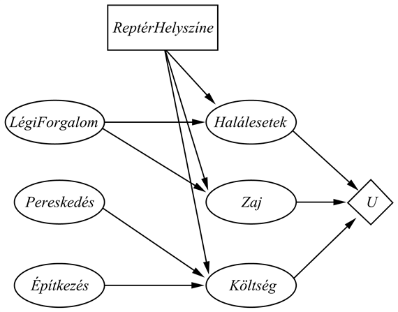
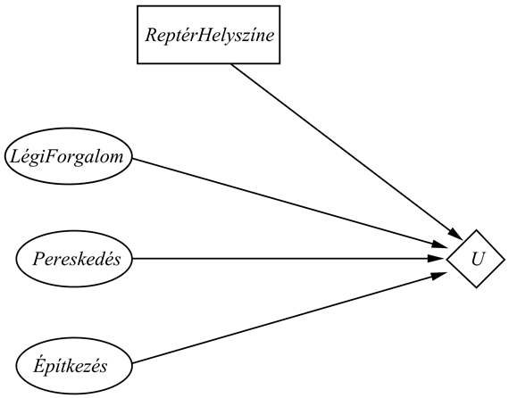

<?xml version="1.0" encoding="UTF-8" standalone="no"?>

<html xmlns="http://www.w3.org/1999/xhtml"><head><meta name="generator" content="DocBook XSL Stylesheets V1.76.1"/></head><body>

<h1 class="title"><a id="id707142"/>Döntési hálók</h1>

Ebben az alfejezetben egy általános mechanizmust fogunk megvizsgálni a racionális döntések meghozatalára. A felhasznált eszközt gyakran <strong>hatásdiagram</strong>nak (<strong>influence diagram</strong>) hívják (Howard és Matheson, 1984), de mi a többet sugalló <strong>döntési háló</strong>k (<strong>decision network</strong>s) elnevezést fogjuk használni. A döntési hálók a cselekvésekhez és a hasznosságokhoz szükséges újabb csomóponttípusok hozzáadásával továbbfejlesztett valószínűségi hálók. A repülőtéri elhelyezési problémát fogjuk használni példának.

<h2 class="title"><a id="id707168"/>Döntési problémák reprezentálása döntési hálókkal</h2>

Egy döntési háló a legáltalánosabb formájában az ágens jelenlegi állapotáról tartalmaz információkat, megadja az ágens lehetséges cselekvéseit, azt az állapotot, amit az ágens cselekvése eredményez, és ennek az állapotnak a hasznosságát. Tehát alapot szolgáltat az olyan hasznosságelvű ágensek megépítéséhez, amilyeneket a 2.4. alfejezetben<em> </em>vezettünk be először. A 16.5. ábra<em> </em>egy döntési hálót mutat a repülőtér helyszíne megválasztásának problémájához. Ez bemutatja a három felhasználásra kerülő csomóponttípust:

<ul class="itemizedlist"><li class="listitem">
A <strong>véletlen csomópont</strong>ok (<strong>chance node</strong>s) (ovális) valószínűségi változókat jelölnek, pont úgy, ahogy a valószínűségi hálókban. Az ágens lehet bizonytalan az építési költségekben, a légi forgalom szintjében és a pereskedés lehetősége miatt, valamint a<em> Halálesetek</em>, a <em>Zaj</em> és a teljes <em>Költség</em> változókban, amelyek mindegyike szintén függ a kiválasztott helyszíntől. Minden egyes véletlen csomópontnak van egy feltételes valószínűségi táblája (FVT), ami a szülőcsomópontok állapotaival indexelt. A döntési hálókban a szülőcsomópontok lehetnek döntési csomópontok és véletlen csomópontok. Kiemelendő, hogy a jelenlegi-állapot véletlen csomópontok bármelyike része lehet egy nagyobb valószínűségi hálónak, ami az építkezés költségét, a légi forgalom nagyságát vagy a perek lehetőségét becsüli meg. 
</li><li class="listitem">
A <strong>döntési csomópont</strong>ok (<strong>decision node</strong>s) (négyszögek)<em> </em>azokat a beavatkozási pontokat reprezentálják, ahol a döntéshozónak lehetősége van a cselekvésre. Ebben az esetben a <em>ReptérHelyszíne </em>különböző értékeket vehet fel a megfontolás alatt álló helyszíneknek megfelelően. A választás befolyásolni fogja a kiadódó költséget, a biztonságot és a repülőtér által keltett zajt. Ebben a fejezetben feltételezzük, hogy egyetlen döntéssel foglalkozunk (azaz egyetlen ilyen csomópont létezik). A 17. fejezet tárgyalja azokat az eseteket, ahol több mint egy döntést kell meghozni.
</li><li class="listitem">
A <strong>hasznosságcsomópont</strong>ok (<strong>utility node</strong>s) (rombusz) az ágens hasznosságfüggvényét reprezentálják.[<a id="id707244" href="#ftn.id707244" class="footnote">168</a>] A hasznosságcsomópontnak szülője az összes olyan változó, amelyek által leírt kimeneteli állapotok közvetlenül befolyásolják a hasznosságot. A hasznosságcsomóponthoz tartozik egy leírás, ami az ágens hasznosságát adja meg egy szülői attribútumokon definiált függvénnyel. A leírás lehet a függvény egy táblázatos megadása, vagy lehet egy parametrikus additív vagy lineáris függvény.
</li></ul>

<a id="id707260"/>
<strong>16.5. ábra - Egy egyszerű döntési hálózat a repülőtér-elhelyezési problémára</strong>

Sok esetben csupán egy egyszerűsített formát használunk. A jelölés ugyanaz marad, de az a véletlen csomópont, ami a kimeneti állapotot jelöli, elmarad. Ehelyett, a hasznosságcsomópontot közvetlenül a jelenlegi állapot csomópontokhoz és a döntési csomóponthoz kötik. Ebben az esetben a hasznosságcsomópont ahelyett, hogy az állapotokon definiált hasznosságfüggvényt reprezentálná, az egyes cselekvésekre vonatkozó várható hasznosságokat reprezentálja, ahogy azt a (16.1) egyenlet definiálja. Ezért az ilyen táblákat <strong>cselekvéshasznosság táblá</strong>knak (<strong>action-utility table</strong>s) nevezzük. A 16.6. ábra<em> </em>a repülőtér probléma cselekvéshasznosság-reprezentációját mutatja.

Láthatjuk, hogy mivel a <em>Zaj</em>, a <em>Halálesetek</em> és a <em>Költség </em>véletlen csomópontok a 16.5. ábrán a jövőbeli állapotokra vonatkoznak, ezek soha nem kaphatnak értéket, mint tényváltozók. Így az egyszerűsített verzió, amiből elhagytuk ezeket a csomópontokat, minden olyan esetben használható, amikor az általánosabb forma használható. Bár az egyszerűsített forma kevesebb csomópontot tartalmaz, az elhelyezés kimeneteleihez kapcsolódó közvetlen leírások elhagyása azt eredményezi, hogy kevésbé rugalmas a körülmények esetleges változásaira. Például a 16.5. ábrán<em> </em>a repülőgép zajszintjében bekövetkező változást a <em>Zaj</em> csomópont feltételes valószínűségi táblájának megfelelő megváltoztatásával lehet modellezni, ezzel szemben a zajszennyezés fontosságának a megváltozását a hasznosságfüggvényben a hasznosságtábla megváltoztatásával modellezhetjük. Másfelől a cselekvéshasznosság diagramban – 16.6. ábra – létrejövő minden ilyenfajta változtatást a cselekvéshasznosság táblázat megváltoztatásának kell tükröznie. Lényegében a cselekvéshasznosság forma az eredeti forma egy <em>szerkesztett</em> verziója.

<h2 class="title"><a id="id707310"/>Döntési hálók kiértékelése</h2>

A cselekvéseket úgy választjuk ki, hogy a döntési hálót kiértékeljük a döntési csomópont minden lehetséges beállítására. Ha egyszer a döntési csomópontot beállítottuk, úgy fog viselkedni, mint egy véletlen csomópont, amit egy tényváltozónak állítottunk be. A döntési háló kiértékelését a következő algoritmus végzi:

<ol class="orderedlist"><li class="listitem">
Állítsa be a tényváltozókat a jelenlegi állapotra.
</li><li class="listitem">
A döntési csomópont minden egyes értékére:

<ol class="orderedlist"><li class="listitem">
Állítsa be a döntési csomópontot erre az értékre.
</li><li class="listitem">
Számítsa ki az a posteriori valószínűségeket a hasznosságcsomópont szüleire, egy szabványos valószínűségi következtető algoritmust használva.
</li><li class="listitem">
Számítsa ki a cselekvés hasznosságát.
</li></ol>
</li><li class="listitem">
Térjen vissza a legnagyobb hasznosságértékkel.
</li></ol>

<a id="id707348"/>
<strong>16.6. ábra - A repülőtér-elhelyezési probléma egy egyszerűsített reprezentációja. A kimeneti állapotokhoz tartozó véletlen csomópontok hatását kiszámítottuk, majd a csomópontokat elhagytuk.</strong>

Ez a valószínűségi hálók következtető algoritmusának egy nyilvánvaló kiterjesztése, és közvetlenül beilleszthető az ágens 13.1. ábrán<em> </em>megadott tervezésébe. A 17. fejezetben<em> </em>látni fogjuk, hogy több egymást követő cselekvés lehetősége a problémát sokkal érdekesebbé teszi.

 

[<a id="ftn.id707244" href="#id707244" class="para">168</a>]  Ezeket a csomópontokat gyakran <strong>értékcsomópont</strong>oknak (<strong>value node</strong>s) nevezik az irodalomban. Mi jobbnak láttuk megtartani a különbséget a hasznosság- és az értékfüggvények között, ahogyan ezt korábban indokoltuk, ezért lehet, hogy a kimeneti állapot egy szerencsejátékot reprezentál.

</body></html>
