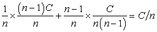
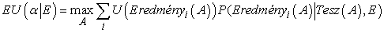
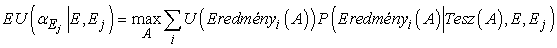
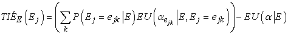
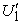
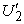
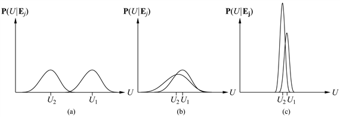
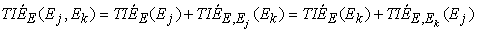
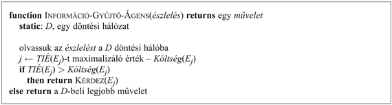

<?xml version="1.0" encoding="UTF-8" standalone="no"?>

<html xmlns="http://www.w3.org/1999/xhtml"><head><meta name="generator" content="DocBook XSL Stylesheets V1.76.1"/></head><body>

<h1 class="title"><a id="id707369"/>Az információ értéke</h1>

<h3 class="title">Fontos</h3>
Az előző elemzésben feltételeztük, hogy minden lényeges információ, de legalábbis minden elérhető információ az ágens rendelkezésére áll. Gyakorlatban ez aligha történhet meg. <em>A döntéshozatal egyik legfontosabb része, hogy tudjuk, milyen kérdést kell feltenni. </em>Például az orvos nem várhatja el, hogy rendelkezésére álljon minden lehetséges diagnosztikai teszt és kérdés eredménye, amikor a páciens először belép a rendelőbe.[<a id="id707381" href="#ftn.id707381" class="footnote">169</a>] A tesztek gyakran költségesek és néha veszélyesek (mind közvetlenül, mind az általuk okozott késedelmek miatt). A fontosságuk két tényezőn múlik: egyrészt azon, hogy jelentősen jobb kezelés válik-e lehetővé a teszteredmények alapján, másrészt a különböző teszteredmények valószínűségén.

Ez az alfejezet az <strong>információérték-elmélet</strong>tel (<strong>information value theory</strong>) foglalkozik, ami lehetővé teszi az ágens számára annak kiválasztását, hogy milyen információt szerezzen meg. Az információ megszerzése <strong>érzékelési cselekvés</strong>ekkel (<strong>sensing action</strong>) történik, ahogy a 12. fejezetben<em> </em>leírtuk. Mivel az ágens hasznosságfüggvénye ritkán vonatkozik az ágens belső állapotaira, jóllehet az érzékelési cselekvés célja a belső állapot megváltoztatása, ezért az érzékelési cselekvéseket az ágens ezt követő műveleteire gyakorolt hatása alapján kell kiértékelnünk. Az információérték-elmélet ezért a többlépcsős döntéshozatal egy speciális fajtája.

<h2 class="title"><a id="id707413"/>Egy egyszerű példa</h2>

Tételezzük fel, hogy egy olajtársaság egy tengeri fúróhely létesítésére szeretne jogokat vásárolni, <em>n</em> darab megkülönböztethetetlen terület közül választva. Tételezzük továbbá fel, hogy kizárólag csak az egyik terület tartalmaz olajat <em>C</em> dollár értékben, és hogy a területek ára C/<em>n</em> dollár. Ha a társaság kockázatsemleges, akkor közömbös lesz számára, hogy vásárol-e területet, vagy sem.

Most tételezzük fel, hogy a szeizmológusok felkínálják a 3-as számú területre vonatkozó kutatásaik eredményét a társaságnak, ami világosan megmutatja, hogy a terület tartalmaz-e olajat, vagy sem. Mennyit legyen hajlandó fizetni a társaság ezért az információért? E kérdés megválaszolásának az a módja, hogy megvizsgáljuk, hogy mit tenne a társaság, ha meglenne az információja:

<ul class="itemizedlist"><li class="listitem">
1/<em>n</em> valószínűséggel a 3-as terület felmérése azt fogja mutatni, hogy a terület tartalmaz olajat. Ebben az esetben a társaság megvásárolja a 3-as területet <em>C</em>/<em>n</em> dollárért, és nyeresége <em>C</em> <em>–</em> <em>C</em>/<em>n </em>= (<em>n</em> <em>–</em> 1)<em>C</em>/<em>n</em> dollár lesz.
</li><li class="listitem">
(<em>n</em> – 1) /<em>n</em> valószínűséggel a felmérés azt fogja mutatni, hogy a terület nem tartalmaz olajat, amely esetben a társaság egy másik területet vásárol meg. Ekkor az olajterület eltalálásának a valószínűsége a többi mező között 1/<em>n</em>-ről 1/ (<em>n</em> – 1)-re változik, így a társaság várható nyeresége <em>C</em>/ (<em>n</em> – 1) – <em>C</em>/<em>n</em> = <em>C</em>/<em>n</em>(<em>n</em> – 1) dollár lesz.
</li></ul>

Most már kiszámíthatjuk a várható nyereséget, ha ismerjük a kutatás eredményét:

Tehát a társaságnak hajlandónak kell lennie, hogy akár <em>C</em>/<em>n</em> dollárt fizessen a szeizmológusnak az információért: az információ annyit ér, mint maga a terület.

Az információ értéke abból a tényből származik, hogy az <em>információval</em> valaki az aktuális helyzetben sokkal alkalmasabb cselekedeteket tud megválasztani. Az információval lehetségessé válik a helyzetek megkülönböztetése, ezzel szemben az információ nélkül a lehetséges helyzetek feletti átlagot nézve kell cselekedni. Általánosan fogalmazva, az információ értékét a várható értékek különbsége definiálja az információ megszerzése előtt és után.

<h2 class="title"><a id="id707551"/>Egy általános képlet</h2>

Az információ értékére egyszerű általános formulát adni. Rendszerint feltesszük, hogy pontos bizonyítékaink vannak egyes <em>E</em><em>j</em> valószínűségi változók értékeiről, így a <strong>teljes információ értéke</strong> (<strong>value of perfect information</strong>) (<strong>TIÉ</strong>) elnevezést használjuk.[<a id="id707581" href="#ftn.id707581" class="footnote">170</a>] Legyen az ágens jelenlegi tudása <em>E</em>. Ekkor az α<em> </em>pillanatnyi legjobb cselekvés értékét a következő definiálja:

és a legjobb cselekvés értéke (az <em>Ej</em> új bizonyíték megszerzése után)

De <em>Ej </em>egy valószínűségi változó, aminek az értéke <em>jelenleg </em>nem ismert, így átlagolnunk kell az összes lehetséges <em>ejk </em>értékre, amelyeket <em>Ej </em>értékeként az <em>Ej</em>-re vonatkozó <em>jelenlegi</em> hiedelmünket felhasználva megkaphatunk. Az <em>Ej </em>megszerzésének értékét a következőképpen definiáljuk:

A formula megértése érdekében gondoljuk át azt az egyszerű esetet, mikor csak két cselekvés, <em>A</em>1<em> </em>és <em>A</em>2 közül lehet választani. A cselekvések jelenleg várható hasznosságai <em>U</em>1 és<em> U</em>2. Az <em>Ej </em>információ új várható hasznosságokat,  -et és -t fog eredményezni a cselekvésekre, de <em>Ej </em>megszerzése előtt már ismerjük a függetlennek feltételezett  <em> </em>és <em> </em>lehetséges értékeinek valószínűség-eloszlásait.

Tegyük fel, hogy <em>A</em>1<em> </em>és <em>A</em>2<em> </em>két különböző utat jelent a hegyeken keresztül, téli időben. <em>A</em>1 egy kényelmes, egyenes autópálya egy alacsony hágón át, míg <em>A</em>2<em> </em>egy tekervényes földút a csúcson keresztül. Csak ezt az információt ismerve <em>A</em>1<em> </em>egyértelműen előnyben részesíthető, mivel elég valószínű, hogy a második utat lavinák zárják le, miközben az első úton valószínűleg nincsenek torlódások. <em>U</em>1<em> </em>ezért egyértelműen nagyobb, mint <em>U</em>2. Az utak aktuális állapotáról <em>Ej </em>műholdjelentéseket kaphatunk, melyek <em> </em>és <em> </em>új várható értékeket adnak az átkelőkre vonatkozóan. A várható hasznosságértékek eloszlását a 16.7. (a) ábra mutatja. Nyilvánvalóan ebben az esetben a költségek miatt nem éri meg a műholdas jelentéseket kikérni, mivel nagyon valószínűtlen, hogy ezek a jelentések a terv megváltozását eredményeznék. A tervek változatlansága mellett azonban az információnak nincs értéke.

Most tételezzük fel, hogy két, kissé eltérő hosszúságú kanyargós földút közül választunk, és súlyosan sérült utasokat viszünk. Ekkor bár lehet, hogy <em>U</em>1<em> </em>és <em>U</em>2<em> </em>elég közel esnek egymáshoz, az <em> </em>és <em> </em> széles tartományon belül vehetnek fel értékeket. Jelentős esélye van annak, hogy a második út tiszta lesz, míg az első le lesz zárva, és ebben az esetben a hasznosságok különbsége nagyon nagy lesz. A <em>TIÉ </em>formula azt jelzi, hogy a műholdjelentéseket megéri kikérni. Ezt a helyzetet a 16.7. (b) ábra mutatja.

<a id="id709815"/>
<strong>16.7. ábra - Három általános eset az információ értékére. Az (a) esetben <em>A</em>1 majdnem teljes bizonyossággal jobb marad <em>A</em>2-höz képest, így az információ nem szükséges. A (b) esetben a választás nem egyértelmű, és az információ döntő fontosságú. A (c) esetben a választás bizonytalan, de igazából nem számít, így az információ is kevésbé értékes.</strong>

Tételezzük most azt fel, hogy nyári időben választunk a két földút közül, amikor
a lavinák igen valószínűtlenek. Ebben az esetben a műholdjelentések azt mutathatják, hogy az egyik útvonal látványosabb, mint a másik, a virágzó hegyi rétek miatt, vagy talán csak nedvesebb az arra kanyargó patakok miatt. Ekkor igen valószínű, hogy ha megkapjuk ezt az információt, megváltoztatjuk a tervünket. Azonban ebben az esetben, a különbség a két út között még mindig igen kicsi, így nem foglalkozunk a jelentések megszerzésével. Ezt a helyzetet a 16.7. (c) ábra mutatja.

<h3 class="title">Fontos</h3>
Összegzésül azt mondhatjuk, hogy <em>az információnak annyiban van értéke, amennyire valószínű, hogy a terv megváltozását okozza, és amennyire az új terv jelentősen jobb lesz, mint a régi.</em>

<h2 class="title"><a id="id709847"/>Az információ értékének tulajdonságai</h2>

Érdekes kérdés, hogy lehetséges-e az, hogy az információ káros – lehet-e az információnak negatív várható értéke? Az a megérzésünk, hogy ez lehetetlen. Végül is legrosszabb esetben az információ egyszerűen figyelmen kívül hagyható, és úgy tehetünk, mintha soha nem kaptuk volna meg. Ezt igazolja a következő tétel, ami bármely döntéselméleti ágensre alkalmazható. <em>Az információ értéke nem negatív:</em>

<code class="code">∀<em>j</em>, <em>E </em> <em>TIÉE</em>(<em>Ej</em>) ≥ 0</code>

A tétel közvetlenül következik a <em>TIÉ</em> definíciójából, a bizonyítást gyakorló feladatként az olvasóra bízzuk (16.12. feladat). Fontos emlékezni arra, hogy a <em>TIÉ</em> a jelenlegi információs állapottól függ, ezért szerepel ez az alsó indexben. Ez megváltozhat, amint több információt szerzünk. Szélsőséges esetben nulla is lehet, ha a kérdéses változó értéke már ismert. Így a <em>TIÉ</em> nem additív. Azaz

<code class="code"><em>TIÉE</em>(<em>Ej</em>, <em>Ek</em>) ≠ <em>TIÉE</em>(<em>Ej</em>) + <em>TIÉE</em>(<em>Ek</em>)		(általánosságban)</code>

Azonban a <em>TIÉ</em> sorrendfüggetlen, aminek intuitíve nyilvánvalónak kell lennie. Azaz,

A sorrendfüggetlenség megkülönbözteti az érzékelési és a hagyományos cselekvéseket, és egyszerűsíti egy érzékelési cselekvéssorozat értékének a kiszámítását.

<h2 class="title"><a id="id709955"/>Egy információgyűjtő ágens megvalósítása</h2>

Egy értelmes ágensnek a felhasználóhoz ésszerű sorrendben kell kérdéseket intéznie, nem szabad lényegtelen kérdéseket feltennie, az információ fontosságát a költségéhez kell viszonyítania, és a megfelelő ponton abba kell hagynia a kérdezősködést. Mindezen képességek elérhetők az információérték használatának a segítségével.

A 16.8. ábra egy olyan ágens teljes vázát mutatja, ami mielőtt cselekedne, képes intelligensen információkat gyűjteni. Időlegesen tételezzük fel, hogy minden megfigyelhető <em>Ej </em>tényváltozóhoz létezik egy hozzárendelt költség, <em>Költség</em>(<em>Ej</em>), ami a bizonyíték tesztek, tanácsadók, kérdések és bármi egyéb módszer segítségével történő megszerzésének a költsége. Az ágens a legértékesebb információt kéri el, a költségeket is figyelembe véve. Feltételezzük, hogy a <em>Kérés</em>(<em>Ej</em>) cselekvés eredménye az, hogy a következő érzékelés az <em>Ej </em>értéket szolgáltatja. Ha nincs olyan megfigyelés, ami megérné a költségét, az ágens egy nem információgyűjtő cselekvést választ ki.

<a id="id710000"/>
<strong>16.8. ábra - Egy egyszerű információgyűjtő ágens váza. Az ágens folyamatosan a legnagyobb információértékű megfigyelést választja, mindaddig, amíg a következő megfigyelés költsége kisebb, mint a várható haszna.</strong>

Az itt megadott ágens az információgyűjtés úgynevezett <strong>rövidlátó</strong> (<strong>myopic</strong>) formáját valósítja meg. Ez azért van, mert az ágens a <em>TIÉ</em> formulát rövidlátó módon használja, azaz úgy számítja ki az információ értékét, mintha csak egyetlen tényváltozót szerezne meg. Ha nincsen olyan tényváltozó, ami sokat segítene, lehet, hogy a rövidlátó ágens kapkodó módon belekezd egy cselekvésbe, pedig jobb lett volna előbb lekérdezni két vagy három változót, és csak aztán cselekedni. A rövidlátó szabályozás ugyanazon a heurisztikán alapul, mint a mohó keresés, és a gyakorlatban gyakran jól működik. (Például kimutatták, hogy diagnosztikai tesztek kiválasztásában jobb a teljesítménye, mint az orvosszakértőknek.) Azonban egy teljesen racionális információgyűjtő ágensnek végig kell gondolnia az összes lehetséges információkérés-szekvenciát, ami egy külső akcióban végződik, és ezeknek a kéréseknek az összes lehetséges kimenetelét. Mivel a második kérés értéke függ az első kérés kimenetelétől, az ágensnek fel kell derítenie a feltételes tervek terét, amint azt a 12. fejezetben leírtuk.

 

[<a id="ftn.id707381" href="#id707381" class="para">169</a>]  Az Egyesült Államokban az egyetlen kérdés, amit ez előtt mindig megkérdeznek, hogy a páciensnek van-e biztosítása.

[<a id="ftn.id707581" href="#id707581" class="para">170</a>]  Egy <em>X</em> változóra vonatkozó nem teljes információt modellezhetünk egy <em>Y</em> változóról szóló teljes információval, ahol az <em>Y</em> változó valószínűségi kapcsolatban van <em>X</em>-szel. Erre ad példát a 16.11. feladat.

</body></html>
