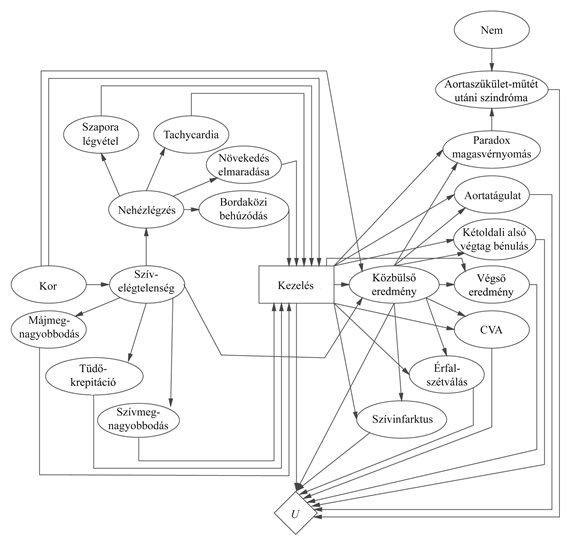

<?xml version="1.0" encoding="UTF-8" standalone="no"?>

<html xmlns="http://www.w3.org/1999/xhtml"><head><meta name="generator" content="DocBook XSL Stylesheets V1.76.1"/></head><body>

<h1 class="title"><a id="id710025"/>Döntéselméleti szakértő rendszerek</h1>

Az 1950-es és az 1960-as években kifejlődött <strong>döntéselemzés</strong> (<strong>decision analysis</strong>) a döntéselmélet alkalmazását tanulmányozza konkrét döntési problémákon. Fő alkalmazási területe a kiemelt fontosságú területeken meghozandó döntések segítése, ahol a tétek igen nagyok, ilyen területek például az üzleti élet, a kormányzati munka, a törvényhozás, a katonai stratégia, az orvosi diagnosztika és a közegészségügy, a mérnöki tervezés és az erőforrás-gazdálkodás. A folyamat magában foglalja a lehetséges cselekvések és kimenetelek gondos tanulmányozását csakúgy, mint a kimenetelek közötti preferenciákét. A döntéselemzésben hagyományosan két szerepet tételeznek fel: a <strong>döntéshozó</strong> (<strong>decision maker</strong>) a kimenetelek közötti preferenciákat határozza meg, a <strong>döntéselemző</strong> (<strong>decision analyst</strong>) pedig a lehetséges cselekvéseket, kimeneteleket veszi számba, és kikérdezi a preferenciákat a döntéshozótól, hogy meghatározza a legjobb cselekvést. Az 1980-as évek elejéig a döntéselemzés célját abban látták, hogy az embereket segítsék olyan döntések meghozatalában, amik a tényleges preferenciáiknak felelnek meg. Manapság egyre több és több döntési folyamat automatizált, és a döntéselemzést annak biztosítására használják, hogy az automatizált folyamatok megfelelően alakuljanak.

Ahogy erről a 14. fejezetben<em> </em>szóltunk, a korai szakértői rendszerekkel kapcsolatos kutatás inkább kérdések megválaszolására irányult, mint döntések meghozatalára. Azok a rendszerek, amelyek cselekvéseket javasoltak a véleménynyilvánítás helyett, valójában ha-akkor szabályokkal érték ezt el, nem pedig a kimenetelek és preferenciák közvetlen reprezentációjával. A valószínűségi hálók megjelenése az 1980-as évek vége körül azonban lehetővé tette olyan nagy rendszerek megépítését, amelyek helyes valószínűségi következtetéseket származtattak a tényekből. A döntési hálók megjelenése azt jelentette, hogy olyan szakértői rendszereket lehet kifejleszteni, amelyek optimális döntéseket javasolnak a felhasználó preferenciáinak és az elérhető tényeknek megfelelően.

Egy rendszer, ami a hasznosságokat közvetlenül tartalmazza, elkerülheti a tanácsadói folyamatok egy gyakori csapdáját: a valószínűség és a fontosság összekeverését. Megszokott módszer volt például a korai orvosszakértői rendszerekben, hogy a lehetséges diagnózisokat a valószínűségük alapján sorba állították, és a legvalószínűbbet jelentették. Sajnos ez végzetes lehet! Általában a páciensek többségénél a két legvalószínűbb diagnózis többnyire az, hogy „semmi baj sincs” és „megfázott”, ha azonban a harmadik legvalószínűbb diagnózis egy páciensnél a tüdőrák, az már aggodalomra ad okot. Nyilvánvaló, hogy a teszteknek és a kezeléseknek mind a valószínűségektől, mind a hasznosságoktól kell függeniük.

A következőkben leírunk egy döntéselméleti szakértői rendszerhez tartozó tudásmérnöki folyamatot. Példaként egy orvosi problémát ismertetünk, amiben kezeléseket kell megválasztani bizonyos veleszületett szívrendellenességek esetén (Lucas, 1996).

A gyermekek 0,8 százaléka szívrendellenességgel születik, ami többnyire <strong>aortaszűkület</strong><strong> </strong>(<strong>aortic coarctation</strong>). Ez a rendellenesség sebészi beavatkozással, érműtéttel (kitágítják az aortát egy ballont helyezve az artériába) vagy gyógyszerrel kezelhető. A feladat a kezelés megválasztása és annak eldöntése, hogy mikor végezzék el: minél fiatalabb egy gyermek, annál nagyobb a kockázata bizonyos kezeléseknek, de túl sokáig sem szabad várni. A problémához egy döntéselméleti szakértői rendszer készíthető egy olyan csapattal, amelynek legalább egy orvosszakértő (egy gyermekkardiológus) és egy tudásmérnök tagja van. A folyamat a következő lépésekre bontható (amelyek összehasonlíthatók a logikai rendszerek tervezésének lépéseivel a 8.4. alfejezetben).

<strong>Alkosson meg egy oksági modellt.</strong> Határozza meg a lehetséges tüneteket, rendellenességeket, kezeléseket és kimeneteleket. Aztán jelezze közöttük haladó nyilakkal, hogy melyik rendellenesség milyen tüneteket okozhat, és melyik kezelés milyen rendellenességekre hatásos. Ezek egy része a tárgyterületi szakértő számára ismert lesz, más részük a szakirodalomból származhatnak. Gyakran a modell jól fog illeszkedni a szakkönyvek leírásaiban szereplő informális diagramokhoz.

<strong>Egyszerűsítse a kvalitatív döntési modellt.</strong> Mivel a modellt kezelések közötti választásra tervezzük használni, és nem más célokra (mint például bizonyos rendellenességek/tünetek kombinációihoz rendelhető együttes valószínűségek kiszámítására), így gyakran elhagyhatunk változókat, amelyek nem befolyásolják a kezelések megválasztását. Gyakran a változókat fel kell bontani vagy össze kell olvasztani, hogy megfeleljen a szakértő gondolkodásmódjának. Például az eredeti aortaszűkületi modellben szerepelt egy <em>Kezelés</em> változó <em>műtét, érsebészet </em>vagy<em> gyógyszeres kezelés</em> értékekkel, és egy önálló változó a kezelés <em>Időzítés-</em>ére. Azonban a szakértőnek nehéz volt ezeket külön kezelni, ezért össze kellett olvasztani, így a <em>Kezelés</em> olyan értékeket vehet fel, mint <em>műtét egy hónapon belül</em>. Ezt a modellt mutatja be a 16.9. ábra. 

<strong>Rögzítse a valószínűségeket.</strong> A valószínűségek betegek adatbázisából, szakirodalmi tanulmányokból vagy szakértők szubjektív becsléseiből származhatnak. Azokban az esetekben, amikor nem megfelelő formában érhetők el a szakirodalomban a valószínűségek, akkor Bayes-szabállyal és vetítéssel számíthatjuk ki a kívánt értékeket. Bebizonyosodott, hogy a szakértők leginkább egy ok hatásának a valószínűségét tudják megbecsülni (például <em>P</em>(<em>nehézlégzés</em>|<em>szívelégtelenség</em>)) sokkal inkább, mint a másik irányban.

<strong>Rögzítse a hasznosságokat.</strong> Kevés számú kimenetel esetén ezek felsorolhatók és egyenként kiértékelhetők. Meghatározhatunk egy skálát a legrosszabbtól a legjobb kimenetelig, mindegyikhez egy numerikus értéket rendelve, például –1000-et az elhalálozáshoz és 0-t a teljes felépüléshez. Ekkor a többi kimenetel már ezen a skálán elhelyezhető. Ezt elvégezheti egy szakértő, de jobb, ha a betegek (vagy gyermekek esetén a szüleik) is részt vesznek ebben, mivel a különböző embereknek különböző preferenciáik vannak. Exponenciálisan sok kimenetel esetén szükségünk van olyan módszerekre, hogy többattribútumú hasznosságfüggvényekkel kombinálhassuk őket. Például feltehetjük, hogy a különböző komplikációk negatív hasznossága additív. 

<strong>Ellenőrizze és</strong><strong> finomítsa a modellt.</strong> A rendszer kiértékeléséhez szükségünk van helyes (bemenet, kimenet) párokra; az úgynevezett <strong>referenciá</strong>kra (<strong>gold standard</strong>), amihez lehet hasonlítani. Ez orvosszakértő rendszerek esetén azt jelenti, hogy összehívjuk az elérhető legjobb orvosszakértőket, néhány beteg esetét megmutatjuk nekik, diagnózis felállítására és kezelési javaslat meghatározására kérjük őket. Majd megnézzük, hogy a rendszer mennyire illeszkedik a javaslataikhoz. Ha csak kevéssé, akkor megpróbáljuk a rosszul teljesítő részeket azonosítani és megjavítani. Hasznos lehet a rendszert „visszafelé” tesztelni. Ahelyett hogy a rendszerbe a tüneteket vinnénk be, és diagnózist kérnék, vigyük be a diagnózist, mint például szívelégtelenség, és vizsgáljuk meg a tünetek, mint például szapora szívverés, jósolt valószínűségeit, és hasonlítsuk ezt össze szakirodalmi adatokkal.

<a id="id710165"/>
<strong>16.9. ábra - Az aortaszűkület hatásdiagramja (Peter Lucas hozzájárulásával)</strong>

<strong>Végezzen érzékenységvizsgálatot. </strong>Ez a fontos lépés azt ellenőrzi, hogy a legjobb döntés érzékeny-e a megadott valószínűségek és hasznosságok kis változására, ehhez szisztematikusan változtassuk meg ezeket a paramétereket, és futtassuk le a kiértékelést újra. Ha kis változások jelentősen eltérő döntést eredményeznek, akkor lehet, hogy megéri több energiát rászánni, hogy pontosabb adatokat gyűjtsünk. Ha minden változtatás ugyanahhoz a döntéshez vezet, akkor a felhasználó biztos lehet, hogy ez a helyes döntés. Az érzékenységvizsgálat különösen fontos lehet, mivel az egyik fő kritikája a szakértői rendszerek valószínűségi megközelítésének, hogy nagyon nehéz a szükséges numerikus valószínűségek megbecslése. Az érzékenységvizsgálat gyakran kimutatja, hogy sok numerikus értéket elég közelítőleg meghatározni. Például bizonytalanok lehetünk a <em>P</em>(<em>tachycardia</em>) a priori valószínűségben, de ha kipróbálunk különböző értékeket erre a valószínűségre, és minden egyes esetben a javasolt cselekmény a hatásdiagram alapján ugyanaz, akkor kevésbé kell foglalkoznunk ezzel az ismerethiánnyal.

</body></html>
