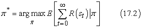

<?xml version="1.0" encoding="UTF-8" standalone="no"?>

<html xmlns="http://www.w3.org/1999/xhtml"><head><meta name="generator" content="DocBook XSL Stylesheets V1.76.1"/></head><body>

<h1 class="title"><a id="id711004"/>17. fejezet - Komplex döntések meghozatala</h1>

<em>Ebben a fejezetben olyan módszereket vizsgálunk meg, amelyekkel eldönthetjük, hogy mit tegyünk a mai napon, feltételezve, hogy holnap is lehetőségünk lesz a cselekvésre.</em>

Ebben a fejezetben a döntéshozatalhoz kapcsolódó számítási kérdéseket tárgyaljuk meg. Míg a 16. fejezetben egyszeri vagy epizodikus döntési problémákkal foglalkoztunk, ahol az egyes cselekvések kimeneteleinek a hasznossága jól ismert volt, a 17. fejezetben <strong>szekvenciális döntési problémá</strong>kkal (<strong>sequential decision problem</strong>s) fogunk foglalkozni, ahol az ágens hasznossága a döntések sorozatától függ. A szekvenciális döntési problémák, amelyek hasznosságot, bizonytalanságot és érzékelést is magukban foglalnak, a keresés és tervezés problémáját általánosítják, melyeket a II., illetve a IV. részben<em> </em>írtunk le. A 17.1. alfejezet kifejti, hogyan definiálhatunk szekvenciális döntési problémákat, a 17.2. és a 17.3. alfejezet elmagyarázza ezek megoldását, hogy optimális viselkedést eredményezzenek, amely kiegyensúlyozza a bizonytalan környezetben meghozott cselekvések kockázatát és jutalmát. A 17.4. alfejezet kiterjeszti ezeket az ötleteket a részlegesen megfigyelhető környezetekre, és a 17.5. alfejezet egy teljes tervezési módot fejleszt ki részlegesen megfigyelhető környezetben lévő döntéselméleti ágensek tervezésére, összekapcsolva a dinamikus Bayes-hálókat a 15. fejezetből a 16. fejezetbeli döntési hálókkal.

A fejezet második része többágenses környezeteket tárgyal. Ilyen környezetekben az optimális viselkedés fogalma sokkal bonyolultabbá válik az ágensek közötti interakció miatt. A 17.6. alfejezet ismerteti a <strong>játékelmélet</strong> (<strong>game theory</strong>) alapötleteit, ideértve azt az elképzelést is, hogy egy racionális ágensnek lehet, hogy véletlenszerűen kell viselkednie. A 17.7. alfejezet azt vizsgálja meg, hogyan tervezhetők olyan többágenses rendszerek, amelyekben az ágensek egy közös célt tudnak megvalósítani.

<h1 class="title"><a id="id711040"/>Szekvenciális döntési problémák</h1>

<h2 class="title"><a id="id711044"/>Egy példa</h2>

Tételezzük fel, hogy egy ágens a 17.1. (a) ábrán látható 4 × 3-as környezetben helyezkedik el. A kezdő állapotból indulva minden időpontban választania kell egy cselekvést. A környezettel való interakció leáll, ha az ágens eléri a +1-gyel vagy a –1-gyel jelölt állapotot. Az egyes helyzetekben az elérhető cselekvések nevei: <em>Fel</em>,<em> Le</em>,<em> Balra</em>, <em>Jobbra</em>. Egyelőre feltételezzük, hogy a környezet <strong>teljesen megfigyelhető</strong> (<strong>fully observable</strong>), azaz az ágens mindig ismeri a helyzetét.

<a id="id711074"/>
<strong>17.1. ábra - (a) Egy egyszerű 4 × 3-as környezet, ami az ágens számára szekvenciális döntési probléma. (b) A környezet állapotátmenet-modelljének illusztrálása: a „szándékolt” kimenetel 0,8 valószínűséggel következik be, de 0,2 valószínűséggel az ágens oldalra mozdul a szándékolt irányhoz képest. A fallal való ütközéskor nincsen mozgás. A két végállapot jutalma a jelzett +1 és –1, az összes többi állapot jutalma –0,04.</strong>

Ha a probléma determinisztikus volna, a megoldás könnyű lenne: [<em>Fel</em>, <em>Fel, Jobbra</em>, <em>Jobbra</em>, <em>Jobbra</em>]. Sajnos a környezet nem maradna mindig szinkronban ezzel a megoldással, mivel a cselekvések megbízhatatlanok. A véletlenszerű mozgás egy általunk elfogadott modelljét a 17.1. (b)<em> </em>ábra mutatja be. Minden cselekvés 0,8 valószínűséggel éri el a kívánt hatását, de a maradék esetben a cselekvések az ágenst a kívánt iránytól jobbra mozgatják. Továbbá, ha az ágens falba ütközik, akkor ugyanazon a mezőn marad. Például ha az (1, 1) kezdő négyzeten áll, a <em>Fel</em> cselekvés az ágenst az (1, 2)-re mozgatja 0,8 valószínűséggel, de 0,1 valószínűséggel a (2, 1)-re kerül, és 0,1 valószínűséggel balra megy, ahol is falnak ütközik és (1, 1)-en marad. Egy ilyen környezetben a [<em>Fel</em>, <em>Fel</em>,<em> Jobbra</em>, <em>Jobbra</em>, <em>Jobbra</em>] sorozat 0,85 = 0,32768 valószínűséggel kerüli meg az akadályokat, és éri el a (4, 3) célállapotot. Igen kis eséllyel az is megtörténhet, hogy a célt a másik úton keresztül éri el, 0,14 × 0,8, ami összességében 0,32776 valószínűséget jelent (lásd 17.1. feladat).

Az egyes állapotokban végrehajtott egyes akcióknak a kimeneti valószínűségeit <strong>állapotátmenet-modell</strong>nek (<strong>transition model</strong>) nevezzük, (vagy csak „modell”-nek, ha nem értelemzavaró). A <em>T</em>(<em>s</em>,<em> a</em>, <em>s</em>′<em>)</em> jelölést fogjuk használni annak a valószínűségnek a jelölésére, hogy az <em>s </em>állapotban az <em>a</em> cselekvés végrehajtása <em>s</em>′<em> </em>állapotot eredményez. Feltesszük, hogy az átmenetek teljesítik a 15. fejezetben megfogalmazott <strong>Markov-tulajdonság</strong>ot, azaz, hogy <em>s</em>′ elérése <em>s</em>-ből csak <em>s</em>-től függ, más korábbi állapotoktól már nem. Egyelőre a <em>T</em>(<em>s</em>,<em> a</em>,<em> s</em>′)<em>-</em>t<em> </em>tekinthetjük a<em> </em>valószínűségek egy<em> </em>nagy háromdimenziós táblázatának. Később, a 17.5. alfejezetben látni fogjuk, hogy az állapotátmenet-modell reprezentálható <strong>dinamikus Bayes-háló</strong>kkal (<strong>dynamic Bayesian network</strong>), csakúgy mint a 15. fejezetben.

Hogy teljessé tegyük a feladat környezetének a definiálását, meg kell adnunk az ágens hasznosságfüggvényét. Mivel a döntési probléma szekvenciális, a hasznosságfüggvény az állapotok sorozatától – a <strong>környezeti történet</strong>től (<strong>environment history</strong>) –  fog függni, nem pedig egyetlen állapottól. A fejezetben később megvizsgáljuk az ilyen hasznosságfüggvények általános megadását; egyelőre egyszerűen kikötjük, hogy az ágens minden <em>s</em> állapotban egy <em>R</em>(<em>s</em>) <strong>jutalmat</strong> (<strong>reward</strong>) kap, ami lehet pozitív vagy negatív, de mindenképpen korlátos. A konkrét példánkban a jutalom minden állapotban –0,04, kivéve a végállapotokat (ahol +1 vagy –1). Egy környezeti történet hasznossága (egyelőre) egyszerűen a kapott jutalmak <em>összege</em>. Például ha az ágens a +1 állapotot 10 lépés után éri el, akkor az összhasznossága 0,6 lesz. A –0,04 negatív jutalom arra ösztönzi az ágenst, hogy minél gyorsabban érje el a (4, 3)-at, így ez a probléma a 3. fejezetbeli keresési problémák egy sztochasztikus általánosítása. Ez más megfogalmazásban úgy hangzik, hogy az ágens nem élvezi az életet ebben a környezetben, és olyan gyorsan ki akar kerülni, amilyen gyorsan csak lehet.

Egy teljesen megfigyelhető környezetben megadott szekvenciális döntési problémát Markov-állapotátmenet-modelljével és additív jutalmakkal <strong>Markov döntési folyamat</strong>nak neveznek (<strong>MDF</strong>) (<strong>Markov decision process</strong>). Egy MDF-et a következő három összetevő határoz meg:

Kezdőállapot: <em>S</em>0

Állapotátmenet-modell: <em>T</em>(<em>s</em>,<em> a</em>,<em> s</em>′)

Jutalomfüggvény:[<a id="id711315" href="#ftn.id711315" class="footnote">171</a>] <em>R</em>(<em>s</em>)

A következő kérdés az, hogyan néz ki egy megoldás a problémára? Azt már láttuk, hogy egy rögzített cselekvéssorozat nem oldja meg a problémát, mivel az ágens végül más állapotba jut a célállapot helyett. Ezért egy megoldásnak minden, az ágens által elérhető állapotra elő kell írnia, hogy az ágens mit tegyen. Egy ilyenfajta megoldás az <strong>eljárásmód</strong> (<strong>policy</strong>). Egy eljárásmódot általában π-vel jelölünk, és a π eljárásmód az <em>s</em> állapotban a π (<em>s</em>) cselekvést javasolja. Ha az ágens egy teljes eljárásmóddal rendelkezik, akkor függetlenül attól, hogy egy cselekvésnek mi is a kimenetele, az ágens mindig tudni fogja, mit tegyen a következő alkalommal.

Egy adott eljárásmód kezdőállapotból induló végrehajtása minden alkalommal egy különböző környezeti történetet eredményez a környezet sztochasztikus volta miatt. Egy eljárásmód minőségét ezért az adott eljárásmód generálta lehetséges környezeti történetek várható hasznosságával mérik. Az <strong>optimális eljárásmód</strong> (<strong>optimal policy</strong>) az az eljárásmód, ami a legnagyobb várható hasznosságot eredményezi. Az optimális eljárásmódot π *-gal jelöljük. A π * ismeretében az ágens úgy dönti el, hogy mit tegyen, hogy figyelembe veszi az aktuális érzékelését, ami az aktuális <em>s</em> állapotot közli vele, majd végrehajtja a π*(<em>s</em>) cselekvést. Az eljárásmód az ágens függvényét explicit módon reprezentálja, és ezért az voltaképpen egy egyszerű reflexágens leírása, amit egy hasznosságalapú ágens által használt információkból számítunk ki.

A 17.1. ábrán mutatott világ optimális eljárását a 17.2. (a) ábra mutatja. Látható, hogy mivel egy lépés költsége meglehetősen kicsi ahhoz a büntetéshez viszonyítva, hogy véletlenül a (4, 2) pozícióra kerülünk, az optimális eljárásmód a (3, 1) állapot esetén óvatos. Inkább egy hosszú kerülő út megtételét javasolja, mint a rövid átvágást a (4, 2) kockáztatásával.

A kockázat és a jutalom egyensúlyának megváltozása függ az <em>R</em>(<em>s</em>) értékétől a nem végső állapotoknál. A 17.2. (b) ábrán az <em>R</em>(<em>s</em>) értékének négy különböző intervallumához tartozó optimális eljárásmódot találhatunk. Ha <em>R</em>(<em>s</em>) ≤ –1,6284, akkor az élet anynyira elviselhetetlen, hogy az ágens egyenesen a legközelebbi kijárathoz tart, annak ellenére, hogy ez –1 értékű. Amikor –0,4278 ≤<em> R</em>(<em>s</em>) ≤ –0,0850, az élet elég kellemetlen; az ágens a +1 állapothoz vezető utat választja, vállalva annak kockázatát, hogy esetleg a –1 állapotba kerül. Nevezetesen az ágens a (3, 1)-ben választja az átvágást. Amikor az élet csak kevéssé bánatos (–0,0221 &lt; <em>R</em>(<em>s</em>) &lt; 0), az optimális eljárásmód nem vállal <em>semmilyen kockázatot</em>. A (4, 1) és (3, 2) állapotokban az ágens teljesen elkerüli a –1 állapotot, így nem tud véletlenül beleesni, még ha ez azt is jelenti, hogy elég sokszor beveri a fejét a falba. Végül, ha <em>R</em>(<em>s</em>) &gt; 0, akkor az élet kifejezetten élvezhető, és az ágens <em>mindkét</em> kijáratot elkerüli. Mindaddig, amíg a (4, 1), (3, 2) és (3, 3) állapotokban a cselekvések azok, amelyek az ábrán láthatók, minden eljárásmód optimális, és az ágens végtelen teljes jutalmat ér el, mivel soha nem lép be a végállapotba. Meglepő módon megmutatható, hogy hat más optimális eljárásmód is létezik az <em>R</em>(<em>s</em>) különböző intervallumaira. A 17.7. feladat kéri majd ezek megkeresését.

<a id="id711458"/>
<strong>17.2. ábra - (a) Egy optimális eljárásmód a sztochasztikus környezetre <em>R</em>(<em>s</em>) = –0,04 esetén nem végállapotoknál. (b) Optimális eljárásmódok <em>R</em>(<em>s</em>) négy különböző értéktartománya esetén.</strong>

A kockázat és a jutalom óvatos egyensúlyozása az MDF-ek egy olyan meghatározó tulajdonsága, ami nem jelentkezik determinisztikus keresési problémáknál; másfelől ez meghatározó tulajdonsága számos valósvilág-beli döntési problémának. Emiatt az MDF-eket számos tudományterületen tanulmányozzák, ideértve az MI-t, az operációkutatást, a közgazdaságtant és a szabályozáselméletet. Algoritmusok tucatjait javasolták optimális eljárásmódok kiszámítására. A 17.2. és 17.3. alfejezetben leírunk a legfontosabb algoritmuscsaládok közül kettőt. Először azonban be kell fejeznünk a hasznosságok és eljárásmódok vizsgálatát a szekvenciális döntési problémák esetében.

<h2 class="title"><a id="id711484"/>Optimalitás szekvenciális döntési problémákban</h2>

A 17.1. ábrán látható MDF-példában az ágens teljesítményét a meglátogatott állapotokban kapott jutalmak összege mérte. Ez a teljesítménymérték nem önkényes, de nem is az egyetlen lehetőség. Ez az alfejezet a lehetséges alternatív teljesítménymértékeket vizsgálja – azaz alternatív hasznosságfüggvényeket a környezeti történéseken, amit úgy jelölünk, hogy <em>Uh</em>([<em>s</em>0, ..., <em>sn</em>]). Az alfejezet a 16. fejezetből származó ötleteken alapul, és a technikai részleteket is bemutatja; a főbb pontokat a végén összegezzük.

<h3 class="title">Fontos</h3>
Az első megválaszolandó kérdés az, hogy <strong>véges horizont</strong> (<strong>finite horizon</strong>) vagy <strong>végtelen horizont</strong> (<strong>infinite horizon</strong>) van a döntéshozatalnál. A véges horizont azt jelenti, hogy létezik egy <em>rögzített</em> <em>N</em> idő, ami után semmi nem érdekes – a játéknak vége, mondhatni. Így <em>Uh</em>([<em>s</em>0, ...,<em> s</em><em>N</em>+<em>k</em>]) = <em>Uh</em>([<em>s</em>0, ..., <em>sN</em>]) minden <em>k</em> &gt; 0 esetén. Például tegyük fel, hogy az ágens (3, 1)-ből indul a 17.1. ábra 4 × 3-as világában, és tegyük fel, hogy <em>N</em> = 3. Ekkor, hogy a +1 állapot elérésének legalább az esélye meglegyen, az ágensnek egyenesen felé kell tartani, és az optimális cselekvés a <em>Fel</em>. Ezzel szemben, ha <em>N</em> = 100, akkor bőségesen van idő a biztonságos utat követni <em>Balra </em>menve. Azaz, <em>véges horizont esetében az optimális cselekvés egy adott állapotban idővel változhat</em>. Azt mondjuk, hogy az optimális eljárásmód véges horizont esetében <strong>nem</strong><strong>-</strong><strong> stacionárius</strong> (<strong>nonstationary</strong>). Rögzített időkorlát hiányában ezzel szemben nincs ok különböző viselkedésre ugyanabban az állapotban más és más időpontokban. Így az optimális cselekvés csak az aktuális állapottól függ, és az optimális eljárásmód <strong>stacionárius</strong> (<strong>stationary</strong>). A végtelen horizontú esethez tartozó eljárásmódok ezért egyszerűbbek, mint a véges horizontú esethez tartozók, és ebben a fejezetben mi főként a végtelen horizontú esettel foglalkozunk.[<a id="id711627" href="#ftn.id711627" class="footnote">172</a>] Vegyük észre, hogy a „végtelen horizont” nem jelenti szükségszerűen azt, hogy az összes állapotsorozat végtelen; mindössze annyit jelent, hogy nincs egy rögzített határ. Nevezetesen, egy végtelen horizontú MDF-ben lehetnek végállapotot tartalmazó véges állapotsorozatok.

A következő eldöntendő kérdés az állapotsorozatok hasznosságának a kiszámítása. Tekinthetjük ezt a kérdést a <strong>többattribútumú hasznosságelmélet</strong> (<strong>multiattribute utility theory</strong>) egy kérdésének (lásd 16.4. alfejezet) azzal, hogy minden <em>si</em> állapotot az [<em>s</em>0, <em>s</em>1, <em>s</em>2, ...] állapotsorozat egy attribútumának veszünk. Egy egyszerű kifejezés eléréséhez, ami az attribútumokból épül fel, fel kell tételeznünk valamilyen preferenciafüggetlenséget. A legtermészetesebb feltevés az, hogy az ágens preferenciái az állapotsorozatok között <strong>stacionárius</strong>ok (<strong>stationary</strong>). A preferenciákra vonatkozó stacionaritás a következőket jelenti: ha két állapotsorozat, [<em>s</em>0, <em>s</em>1, <em>s</em>2,…] és , ugyanazzal az állapottal kezdődik (például ), akkor a két sorozat a preferencia-sorrendjének ugyanannak kell lennie, mint az [<em>s</em>1, <em>s</em>2,…] és az  sorozatoknak. Ez tehát azt jelenti, hogy ha egy holnaptól kezdődő lehetséges jövőbeli eseménysort egy másik eseménysorral szemben preferálunk, akkor ez nem változhat, ha az eseménysor a mai naptól kezdődne. A stacionaritás egy meglehetősen ártalmatlannak tűnő feltevés, nagyon erős következményekkel: bizonyítható, hogy stacionaritás esetén a sorozatokhoz csak kétféle módon rendelhetők hasznosságok:

<ol class="orderedlist"><li class="listitem">
<strong>Additív jutalmak</strong> (<strong>additive reward</strong>s): egy állapotsorozat hasznossága ekkor
</li></ol>

<code class="code"><em>	Uh</em>([<em>s</em>0, <em>s</em>1, <em>s</em>2,...]) = <em>R</em>(<em>s</em>0) + <em>R</em>(<em>s</em>1) + <em>R</em>(<em>s</em>2) + …</code>

	A 17.1. ábra 4 × 3-as világa additív jutalmakat használ. Vegyük észre, hogy az additivitást hallgatólagosan kihasználtuk az utak költségfüggvényeinek felhasználásakor a heurisztikus keresési algoritmusokban (4. fejezet).

<ol class="orderedlist"><li class="listitem">
<strong>Leszámítolt jutalmak </strong>(<strong>discounted reward</strong>s): egy állapotsorozat hasznossága ekkor
</li></ol>

<code class="code"><em>	Uh</em>([<em>s</em>0, <em>s</em>1, <em>s</em>2,...]) = <em>R</em>(<em>s</em>0) + <em>γR</em>(<em>s</em>1) + <em>γ</em>2 <em>R</em>(<em>s</em>2) + …</code>

	ahol a <em>γ</em> <strong>leszámítolási tényező</strong> (<strong>discount factor</strong>) egy 0 és 1 közötti szám. A leszámítolási tényező fejezi ki egy ágens preferenciáját a jelenlegi és a jövőbeli jutalmak között. Amikor <em>γ </em>közel 0, akkor a távoli jövőbeli jutalmakat jelentéktelennek tekinti. Amikor <em>γ </em>értéke 1, akkor a leszámítolt jutalmak pontosan megegyeznek az additív jutalmakkal, így az additív jutalmak a leszámítolt jutalmak speciális esetei. A leszámítolás jó modellnek tűnik mind az állati, mind az emberi időbeli preferenciákra. Egy <em>γ </em>leszámítolási tényező ekvivalens egy (1/<em> γ</em>) – 1<em> </em>kamatlábbal.

A fejezet hátralevő részében leszámítolt jutalmakat fogunk feltételezni, aminek okai hamarosan világosak lesznek, bár néha megengedjük a <em>γ</em> = 1<em> </em>értéket.

A végtelen horizont elfogadása mögött azonban rejlik egy probléma: ha a környezet nem tartalmaz egy végállapotot, vagy ha az ágens soha nem jut végállapotba, akkor az összes környezettörténet végtelen hosszú lesz, és a hasznosságok additív jutalmakkal általában végtelenek lesznek. Abban egyetérthetünk, hogy a +∞ jobb, mint a –∞, de két +∞ hasznosságú állapotsorozat összehasonlítása már bonyolultabb. Három megoldás kínálkozik, amelyek közül kettőt már láttunk:

<ol class="orderedlist"><li class="listitem">
Leszámítolt jutalmakkal egy végtelen sorozat hasznossága <em>véges.</em> Valójában, ha a jutalmakra létezik egy <em>R</em>max korlát és <em>γ</em> &lt; 1, akkor azt kapjuk, hogy

</li></ol>

felhasználva a végtelen mértani sorozat összegképletét.

<ol class="orderedlist"><li class="listitem">
Ha a környezet tartalmaz végállapotokat, <em>és ha garantált, hogy az ágens végül bekerül az egyikbe,</em> akkor soha nem lesz szükségünk végtelen sorozatok összehasonlítására. Egy eljárásmódot, ami garantáltan végállapotba juttat, <strong>véges eljárásmód</strong>nak (<strong>proper policy</strong>) nevezünk. Véges eljárásmódoknál használhatjuk a <em>γ</em> = 1-t (azaz az additív jutalmakat). A 17.2. (b) ábrán látható első három eljárásmód véges, a negyedik azonban nem. Egy nem véges eljárásmód végtelen teljes jutalmat ér el a végállapotoktól való távolmaradással, amikor a nem végállapotok jutalma pozitív. A nem véges eljárásmódokra additív jutalmaknál nem mindig működnek az MDF-eket megoldó alapalgoritmusok, ami jó ok a leszámítolt jutalmak használatára. 
</li><li class="listitem">
Végtelen sorozatok összehasonlítására egy másik lehetőség az időegységenkénti <strong>átlagjutalom</strong> (<strong>average reward</strong>) felhasználása. Tegyük fel, hogy a 4 × 3-as világban az (1, 1) mező jutalma 0,1, míg más nem végállapotoké 0,01. Ekkor egy olyan eljárásmódnak, ami minden tőle telhetőt megtesz, hogy az (1, 1)-ben maradjon, nagyobb lesz az átlagos jutalma, mint annak, amelyik máshol marad. Az átlagos jutalom hasznos kritérium bizonyos problémákra, de az átlagjutalomra tervezett algoritmusok meghaladják e könyv kereteit.
</li></ol>

Összegezve, a leszámítolt jutalmak használata jár a legkevesebb bonyodalommal az állapotsorozatok kiértékelésében. A végső lépés annak megmutatása, hogyan válasszunk az eljárásmódok között, észben tartva azt, hogy egy adott π eljárásmód nem egyetlen állapotsorozatot generál, hanem a legkülönfélébb lehetséges állapotsorozatokat, mindegyiket egy adott valószínűséggel, amit a környezet állapotátmenet-modellje határoz meg. Így egy eljárásmód értéke a (sorozatonként) elért leszámítolt jutalmak <em>várható</em> értéke, ahol a várható érték képzése az összes állapotsorozat felett történik, ami az eljárás végrehajtása esetén előfordulhat. Egy π* optimális eljárásmód ekkor
<a id="ID_713_oldal"/>

A következő két alfejezet algoritmusokat ír le az optimális eljárásmódok megtalálására.

 

[<a id="ftn.id711315" href="#id711315" class="para">171</a>]  Az MDF egyes definíciói megengedik, hogy a jutalom függjön a cselekvéstől és a kimeneteltől is, így a jutalomfüggvény <em>R</em>(<em>s</em>,<em> a</em>,<em> s</em>′)<em> </em>alakú. Ez néhány környezet leírását egyszerűsíti, de a problémát alapvetően nem változtatja meg.

[<a id="ftn.id711627" href="#id711627" class="para">172</a>]  Ez a teljesen megfigyelhető környezetekre igaz. Látni fogjuk, hogy a részlegesen megfigyelhető környezetekben a végtelen horizont esete nem annyira egyszerű.

</body></html>
