<?xml version="1.0" encoding="UTF-8" standalone="no"?>

<html xmlns="http://www.w3.org/1999/xhtml"><head><meta name="generator" content="DocBook XSL Stylesheets V1.76.1"/></head><body>

<h1 class="title"><a id="id713767"/>Értékiteráció</h1>

Ebben az alfejezetben az optimális eljárásmód kiszámítására mutatunk be egy algoritmust, az úgynevezett <strong>értékiteráció</strong>t (<strong>value iteration</strong>). Az alapötlet az, hogy kiszámítjuk minden egyes <em>állapot</em> hasznosságát, majd az állapothasznosságokat felhasználjuk az egyes állapotoknál az optimális cselekvés megválasztásához.

<h2 class="title"><a id="id713786"/>Az állapotok hasznossága</h2>

Az állapotok hasznosságát az állapotsorozatok hasznosságán keresztül definiáljuk. Nagyjából azt mondhatjuk, hogy egy állapot hasznossága a belőle kiinduló állapotsorozatok várható hasznosságával egyenlő. Nyilvánvalóan az állapotsorozatok függnek a végrehajtott eljárásmódtól, így elsőként egy adott π eljárásmódra definiáljuk a hasznosságot, <em>U</em>π(<em>s</em>)-t. Jelöljük <em>st</em>-vel az ágens állapotát a π<em> </em>eljárásmód <em>t</em> lépésnyi végrehajtása után, ekkor azt kapjuk, hogy

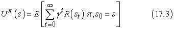

Felhasználva ezt a definíciót, egy állapot valódi hasznossága az <em>U</em>π (<em>s</em>), amit <em>U</em>(<em>s</em>)-sel jelölünk.<em> </em>Ez a a leszámítolt jutalmak várható értéke akkor, amikor az ágens egy optimális eljárásmódot hajt végre. Vegyük észre, hogy az <em>U</em>(<em>s</em>)<em> </em>és az <em>R</em>(<em>s</em>)<em> </em>igen<em> </em>eltérő mennyiségek: az <em>R</em>(<em>s</em>)<em> </em>a „rövid távú” jutalom az <em>s</em>-ben tartózkodásért, míg az <em>U</em>(<em>s</em>)<em> </em>a „hosszú távú” összjutalom <em>s</em>-től kezdve. A 17.3. ábrán láthatók a hasznosságok a 4 × 3-as világban. Látható, hogy a hasznosságok nagyobbak a +1-es kijárathoz közeli állapotoknál, mivel kevesebb lépés szükséges a kijárat eléréséhez.

Az <em>U</em>(<em>s</em>)<em> </em>hasznosságfüggvény lehetővé teszi az ágensnek, hogy a cselekvéseit a 16. fejezetben szereplő maximális várható hasznosság elve alapján válassza meg; azt a cselekvést választja, amelyik maximalizálja a bekövetkező állapot várható hasznosságát:

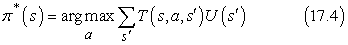

<h3 class="title">Fontos</h3>
Most azonban, ha egy állapot hasznossága a leszámítolt jutalmak várható értékének összege attól a kiindulóponttól kezdve, akkor közvetlen kapcsolat áll fenn egy állapot hasznossága és a szomszédjainak a hasznossága között: <em>egy állapot hasznossága az állapotban tartózkodás közvetlen jutalmának és a következő állapot várható leszámítolt hasznosságának az összege, feltéve, hogy az ágens az optimális cselekvést választja</em>. Azaz egy állapot hasznossága a következő:
<a id="ID_714_oldal"/>
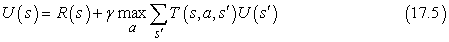

<a id="id713941"/>
<strong>17.2. ábra - Az állapotok hasznosságai a 4 × 3-as világban, <em>γ</em> = 1 és a nem végállapotoknál <em>R</em>(<em>s</em>) = –0,04 esetén</strong>

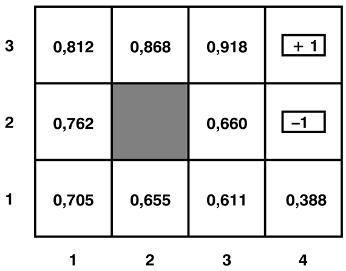

A (17.5) egyenletet <strong>Bellman-egyenlet</strong>nek (<strong>Bellman equation</strong>) nevezik Richard Bellman tiszteletére (Bellman, 1957). Az állapotok hasznosságai – mint a bekövetkező állapotsorozatok várható hasznossága a (17.3) egyenlet szerint – a Bellman-egyenletek egy rendszerének a megoldásai. Valójában ezek egyértelmű megoldások, ahogyan a következő két alfejezetben megmutatjuk. 

Nézzük meg a 4 × 3-as világ Bellman-egyenleteinek egyikét. Az (1, 1) állapothoz tartozó egyenlet:

<code class="code"><em>U</em>(1, 1) = –0,04 + <em>γ</em> max{0,8<em>U</em>(1, 2) + 0,1<em>U</em>(2, 1) + 0,1<em>U</em>(1, 1)	(<em>Fel</em>)</code>

<code class="code">0,9<em>U</em>(1, 1) + 0,1<em>U</em>(1, 2)			(<em>Balra</em>)</code>

<code class="code">0,9<em>U</em>(1, 1) + 0,1<em>U</em>(2,1)			(<em>Le</em>)</code>

<code class="code">0,8<em>U</em>(2, 1) + 0,1<em>U</em>(1, 2) + 0,1<em>U</em>(1, 1)}	(<em>Jobbra</em>)</code>

A 17.3. ábrán látható számok behelyettesítésével azt láthatjuk, hogy a <em>Fel</em> a legjobb cselekvés.

<h2 class="title"><a id="id714055"/>Az értékiteráció algoritmus</h2>

A Bellman-egyenletek képezik az alapját az MDF-ek megoldására szolgáló értékiteráció algoritmusnak. Ha <em>n</em> lehetséges állapot van, akkor <em>n</em> Bellman-egyenlet létezik, mindegyik állapotra egy. Az <em>n</em> egyenlet <em>n</em> ismeretlent tartalmaz – az állapotok hasznosságát. Így a hasznosságok megállapításához ezen egyenletek együttesét szeretnénk megoldani. Azonban van egy probléma: az egyenletek nemlineárisak, mivel a „max” operátor nemlineáris operátor. Míg a lineáris egyenletrendszerek hatékonyan megoldhatók lineáris algebrai eszközökkel, a nemlineáris egyenletrendszerek már problematikusabbak. Ekkor iteratív módszerrel próbálkozhatunk. Kezdéskor tetszőleges kezdeti értékeket választunk a hasznosságoknak, kiszámítjuk az egyenletek jobb oldalát, majd behelyettesítjük a bal oldalra – így frissítve az egyes állapotok hasznosságát a szomszédjainak a hasznosságával. Ezt addig ismételjük, ameddig el nem érünk egy egyensúlyi helyzetet. Jelölje <em>Ui</em>(<em>s</em>)<em> </em>az <em>s</em> állapot hasznosságértékét az <em>i</em>-edik iterációban. A <strong>Bellman-frissítés</strong>nek (<strong>Bellman update</strong>) nevezett iterációs lépés a következőképpen néz ki:

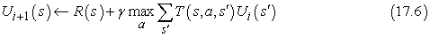

Ha a Bellman-frissítést végtelen sokszor alkalmazzuk, garantált, hogy egyensúlyi helyzetet érünk el (lásd következő alfejezet), és ekkor a végső hasznosságértékeknek a Bellman-egyenletek megoldását kell adniuk. Valójában ezek <em>egyértelmű</em> megoldások is, és a hozzájuk tartozó eljárásmód optimális (amit a (17.4) egyenlettel nyerhetünk). Az algoritmus, amit <code class="code">ÉRTÉKITERÁCIÓ</code>-nak nevezünk, a 17.4. ábrán látható. 

<a id="id714124"/>
<strong>17.4. ábra - Az értékiteráció algoritmus az állapotok hasznosságának kiszámítására. A leállási feltétel a (17.8) egyenletből származik.</strong>

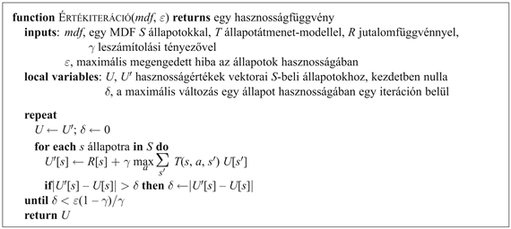

<a id="id714134"/>
<strong>17.5. ábra - (a) A grafikonokon kiválasztott állapotok hasznosságainak a fejlődése látható az értékiteráció felhasználásánál. (b) A szükséges értékiterációk száma (<em>k</em>), hogy a hiba garantáltan legfeljebb <em>ε </em>=<em> cR</em>max legyen, <em>c</em> különböző értékeinél, mint a <em>γ</em> leszámítolási tényező függvénye.</strong>

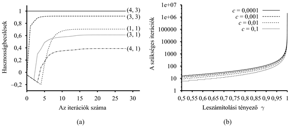

Az értékiterációt alkalmazhatjuk a 17.1. (a) ábra 4 × 3-as világára. Nulla kezdeti értékekről indulva, a hasznosságok alakulása a 17.5. (a) ábrán látható. Vegyük észre, ahogy a (4, 3) állapottól különböző távolságra lévő állapotok negatív jutalmakat halmoznak fel egészen addig, amíg egy bizonyos ponton utat találnak a (4, 3)-hoz, amikortól is a hasznosságok elkezdenek növekedni. Az értékiteráció algoritmusára gondolhatunk úgy, mint lokális frissítések általi <em>információterjesztésre</em> az állapottérben.

<h2 class="title"><a id="id714170"/>Az értékiteráció konvergenciája</h2>

Azt állítottuk, hogy az értékiteráció végül a Bellman-egyenletek egy egyértelmű megoldásához konvergál. Ebben az alfejezetben kifejtjük, miért is történik ez. Ennek során bevezetünk néhány hasznos matematikai fogalmat, és olyan módszereket kapunk, amelyek megbecsülik a hasznosságfüggvény hibáját , ha az algoritmust hamar állítottuk le; ennek hasznosságát az adja, hogy nem kell végtelen hosszan futtatnunk az algoritmust. Az alfejezet a technikai részleteket is bemutatja.

Az értékiteráció konvergenciájának megmutatásában használt alapfogalom az <strong>összehúzás</strong> (<strong>contraction</strong>). Az összehúzás nagyjából egy olyan egyváltozós függvény, ami két különböző bemeneti értékre alkalmazva, két olyan kimeneti értéket ad, amelyek „egymáshoz közelebbiek”, mint az eredeti értékek, legalább egy bizonyos állandó mennyiséggel. Például a „kettővel való osztás” egy összehúzás, mivel bármely két szám elosztása után a különbségük megfeleződik. Vegyük észre, hogy a „kettővel való osztásnak” van egy fix pontja, nevezetesen a nulla, ami a függvény alkalmazásával nem változik. Ebből a példából az összehúzás két fontos tulajdonságát vehetjük észre:

<ul class="itemizedlist"><li class="listitem">
Egy összehúzásnak egyetlen fix pontja van: ha két fix pontja lenne, nem kerülnének egymáshoz közel a függvény alkalmazásakor, így nem is volna összehúzás.
</li><li class="listitem">
A függvény tetszőleges argumentumra történő alkalmazásakor a függvényértéknek közelebb kell kerülniük a fix ponthoz (mivel a fix pont nem mozdul el), így egy öszszehúzás ismételt alkalmazása a fix pontot adja határértékben.
</li></ul>

Most tegyük fel, hogy a Bellman-frissítést (a (17.6) egyenletet) egy <em>B</em> operátornak tekintjük, aminek egyszeri alkalmazása az összes állapot hasznosságát frissíti. Jelölje <em>Ui</em> az összes állapot <em>i</em>-edik iterációbeli hasznosságának a vektorát. Ekkor a Bellman-frissítési egyenletet felírhatjuk úgy, hogy

<code class="code"><em>Ui</em>+1 ← <em>BUi</em></code>

Most egy olyan módszerre van szükségünk, amellyel a hasznosságvektorok távolságát mérhetjük. A <strong>maximum normá</strong>t (<strong>max norm</strong>) fogjuk használni, ami egy vektor hoszszát a legnagyobb komponensének hosszával méri:

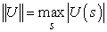

<h3 class="title">Fontos</h3>
Ezzel a definícióval, a két vektor közötti „távolság” ||<em>U</em> – <em>U</em>′|| az összetartozó elemek közötti különbségek maximuma. Az alfejezet fő eredménye a következő: <em>Legyen</em> <em>Ui</em> <em>és két tetszőleges hasznosságvektor.</em> <em>Ekkor</em>

<code class="code">||<em>BUi – BUi</em>′|| ≤ <em>γ</em>||<em>Ui – Ui</em>′||					(17.7)</code>

<em>Azaz, a Bellman-frissítés egy összehúzás egy γ tényezővel a hasznosságvektorok terében. </em>Így az értékiteráció mindig a Bellman-egyenletek egy egyértelmű megoldásához konvergál.

Nevezetesen, a (17.7) egyenletben lecserélhetjük <em>Ui</em>′ -t a valódi <em>U</em> hasznosságokkal, amire <em>BU</em> = <em>U</em>. Ekkor a következő egyenlőtlenséget kapjuk

<code class="code">||<em>BUi – U</em>|| ≤ <em>γ</em>||<em>Ui – U</em>||</code>

Ezért, ha ||<em>Ui – U</em>||-ra mint az <em>Ui</em> becslés <em>hibájára</em> tekintünk, látjuk, hogy a hiba minden iterációban legalább egy <em>γ</em> tényezővel csökken. Ez azt jelenti, hogy az értékiteráció exponenciálisan gyorsan konvergál. A szükséges iterációk számát egy adott <em>e</em> hibahatár eléréséhez a következőképpen számíthatjuk ki: először, a (17.1) egyenlet<em> </em>szerint, az összes állapot hasznossága korlátos ±<em>R</em>max/(1<em> – γ</em>) értékkel. Ez azt jelenti, hogy a maximális kezdeti hiba ||<em>U</em>0 – <em>U</em>|| ≤ 2<em>R</em>max/(1 – <em>γ</em>)<em>.</em> Tegyük fel, hogy <em>N</em> iterációt végzünk ahhoz, hogy a hiba legfeljebb <em>ε</em> értékű legyen. Mivel a hiba minden egyes alkalommal legalább <em>γ</em> -szorosára csökken, annak kell teljesülnie, hogy <em>γN </em>2 <em>R</em>max/(1 – <em>γ</em>) ≤ <em>ε. </em>Ha vesszük a két oldal logaritmusát, az adódik, hogy

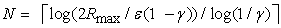

számú iteráció elegendő. A 17.5. (b) ábrán látható, hogyan változik <em>γ </em>függvényében az <em>N</em> különböző értékű <em>ε</em>/<em>R</em>max<em> </em>hányadosok esetében. A jó hír az, hogy az exponenciális gyorsaságú konvergencia miatt <em>N</em> nem függ túlságosan az <em>ε</em>/<em>R</em>max<em> </em>hányadostól. A rossz hír az, hogy <em>N</em> gyorsan nő, ahogy <em>γ </em>közel kerül 1-hez. Így gyors konvergenciát úgy érhetünk el, ha <em>γ -</em>t kicsivé tesszük, de ez valójában az ágensnek rövid távú horizontot biztosít, és az ágens cselekvéseinek hosszú távú hatásait figyelmen kívül hagyhatja. 

Az előző bekezdés hibakorlátja ad bizonyos tájékozódást az algoritmus futási idejét befolyásoló tényezőkről, de gyakran túlságosan óvatos módszert jelent annak eldöntésére, hogy mikor álljon le az iteráció. Az utóbbi célra felhasználhatunk egy korlátot, ami a hibát az egyes iterációkban a Bellman-frissítés nagyságához kapcsolja. Az összehúzási tulajdonságból ((17.7) egyenlet) meg lehet mutatni, hogy ha a frissítés kicsi (azaz egyetlen állapot hasznossága sem változik nagyon), akkor a hiba a valódi hasznosságfüggvényhez képest szintén kicsi. Pontosabban,

<code class="code">ha      ||<em>U</em><em>i</em>+1 – <em>Ui</em>|| &lt; <em>ε</em>(1 – <em>γ</em>)/<em> γ</em>,     akkor     ||<em>U</em><em>i+</em>1 – <em>U</em>|| &lt; <em>ε 	</em>(17.8)</code>

Ez a leállási feltétel szerepel az <code class="code">ÉRTÉKITERÁCIÓ</code> algoritmusában a 17.4. ábrán.

<h3 class="title">Fontos</h3>
Eddig az értékiteráció algoritmusa által visszaadott hasznosságfüggvény hibáját elemeztük<em>. Az ágenst azonban igazán az érdekli, hogyan fog boldogulni, ha egy ilyen döntésfüggvény alapján hoz döntéseket. </em>Tegyük fel, hogy az értékiteráció <em>i</em>-edik iterációja után az ágens a valódi <em>U</em> hasznosságra egy <em>Ui</em> becslést kap, és az <em>Ui</em>-n alapuló egylépéses előrenézés felhasználásával (ahogy a (17.4) egyenletben) megkapja a <em>π</em> <em>i </em>MVH-eljárásmódot. Vajon a kiadódó viselkedés megközelítőleg lesz-e olyan jó, mint az optimális viselkedés? Ez döntő kérdés minden valós ágens számára, és bizonyítható, hogy a válasz igen. Jelölje 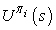 azt a hasznosságot, ami a <em>π i</em> végrehajtásakor adódik <em>s</em>-ből kiindulva. Ekkor az<em> </em>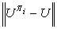 az<em> </em><strong>eljárásmód vesztesége</strong> (<strong>policy loss</strong>) annak a maximális értéke, amit az ágens veszíthet <em>π i</em>-t végrehajtva az optimális <em>π</em> * eljárásmód helyett. A <em>π i</em> eljárásmód veszteségét az <em>Ui</em>-beli hibához a következő egyenlőtlenség kapcsolja:

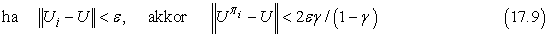

A gyakorlatban sokszor előfordul, hogy <em>π i</em> jóval hamarabb optimálissá válik, mielőtt <em>Ui</em> konvergált volna. A 17.6. ábrán látható, ahogy a 4 × 3-as környezetben a maximális <em>Ui</em>-beli hiba és az eljárásmód vesztesége az értékiteráció folyamatának előrehaladtával nullához közelít, <em>γ</em> = 0,9 értéknél. A <em>π i</em> eljárásmód már <em>i</em> = 4-nél optimális, pedig az <em>Ui</em>-beli maximális hiba még 0,46.

<a id="id714704"/>
<strong>17.6. ábra - A hasznosságbecslés maximális hibája ||<em>Ui</em> – <em>U</em>|| és az eljárásmód vesztesége  az optimális eljárásmódhoz viszonyítva az értékiteráció iterációszámának függvényében</strong>

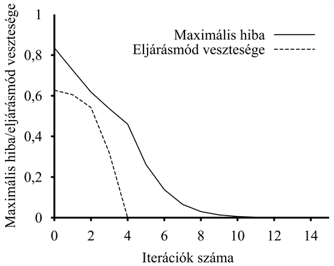

Most már minden rendelkezésünkre áll, hogy az értékiterációt a gyakorlatban is felhasználjuk. Tudjuk, hogy a helyes hasznosságokhoz konvergál, a hasznosság becslésének hibájára korlátokat tudunk adni, ha véges számú iteráció után leállunk, és korlátokat tudunk adni az eljárásmód veszteségére, ami a becsült hasznosságértékekhez tartozó MVH-eljárásmód végrehajtása miatt lép fel. A végső megjegyzés, hogy az összes eredmény feltétele ebben az alfejezetben a <em>γ </em>&lt; 1-gyel való leszámítolás. Ha <em>γ </em>= 1 és a környezet tartalmaz végállapotokat, akkor bizonyos technikai feltételek teljesülése esetén konvergenciaeredmények és hibakorlátok hasonló halmaza származtatható.

</body></html>
