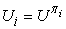
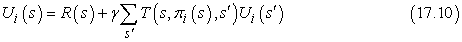
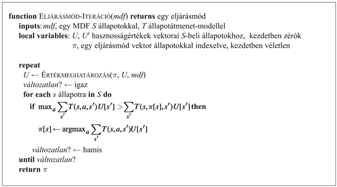
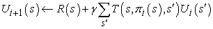

<?xml version="1.0" encoding="UTF-8" standalone="no"?>
<!DOCTYPE html PUBLIC "-//W3C//DTD XHTML 1.1//EN" "http://www.w3.org/TR/xhtml11/DTD/xhtml11.dtd">
<html xmlns="http://www.w3.org/1999/xhtml"><head><meta name="generator" content="DocBook XSL Stylesheets V1.76.1"/></head><body>

<h1 class="title"><a id="id714742"/>Eljárásmód-iteráció</h1>

Az előző alfejezetben megfigyeltük, hogy optimális eljárásmódot akkor is kaphatunk, amikor a hasznosságfüggvény becslése pontatlan. Ha egy cselekvés egyértelműen jobb, mint a többi, akkor a releváns állapotok hasznosságainak a pontos nagyságát nem szükséges precízen tudnunk. Ez a megérzés egy alternatív módot javasol az optimális eljárásmód megkeresésére. Az <strong>eljárásmód-iteráció</strong>s (<strong>policy iteration</strong>) algoritmus egy <em>π</em>0 kezdeti eljárásmódtól indulva a következő két lépést váltogatja:

<ul class="itemizedlist"><li class="listitem">
<strong>Eljárásmód-értékelés</strong> (<strong>policy evaluation</strong>): Egy adott <em>π</em><em>i</em> eljárásmódnál számítsuk ki -t, az egyes állapotok hasznosságát mintha <em>πi</em> volna végrehajtva.
</li><li class="listitem">
<strong>Eljárásmód-javítás</strong> (<strong>policy improvement</strong>): Számítsunk ki egy új <em>π</em><em>i</em>+1 MVH-eljárásmódot, felhasználva az <em>Ui</em>-n alapuló egylépéses előrenézést (mint a (17.4) egyenletben).
</li></ul>

Az algoritmus leáll, amikor az eljárásmód-javítás lépése nem eredményez változást a hasznosságokban. Ennél a pontnál tudjuk, hogy az <em>Ui</em> hasznosságfüggvény a Bellman-frissítés egy fix pontja, így a Bellman-egyenletek egy megoldása, és <em>πi</em>-nek egy optimális eljárásmódnak kell lennie. Mivel csak véges sok eljárásmód létezik a véges állapottérben, és megmutatható, hogy minden iteráció jobb eljárásmódot eredményez, az eljárásmód-iterációnak le kell állnia. Az algoritmus a 17.7. ábrán látható.

Az eljárásmód-javítás lépése nyilvánvalóan egyértelmű, de hogyan valósítsuk meg az eljárásmód-értékelést. Kiderül, hogy ennek elvégzése sokkal egyszerűbb, mint a szabványos Bellman-egyenletek megoldása (amit az értékiteráció végez el), mivel az eljárásmód egy cselekvést minden állapotban rögzít. Az <em>i</em>-edik iterációban a <em>πi</em> eljárásmód a <em>πi</em>(<em>s</em>) cselekvést írja elő. Ez azt jelenti, hogy a (17.5) Bellman-egyenlet egy egyszerűsített változatával állunk szemben, ami az <em>s</em> hasznosságát (<em>πi</em> mellett) a következőképpen kapcsolja a szomszédai hasznosságához:

Például tegyük fel, hogy <em>πi</em> a 17.2. (a) ábrán látható eljárásmód. Ekkor azt kapjuk, hogy <em>πi</em>(1, 1) = <em>Fel</em>, <em>πi</em>(1, 2) = <em>Fel</em> és így tovább, illetve az egyszerűsített Bellman-egyenletek:

<code class="code"><em>Ui</em>(1, 1) = –0,04 + 0,8<em>Ui</em>(1, 2) + 0,1<em>Ui</em>(1, 1) + 0,1<em>Ui</em>(2, 1)</code>

<code class="code"><em>Ui</em>(1, 2) = –0,04 + 0,8<em>Ui</em>(1, 3) + 0,2<em>Ui</em>(1, 2)</code>

<code class="code">…</code>

A lényeges az, hogy ezek az egyenletek lineárisak, mivel a „max” operátort eltávolítottuk. Ha az állapotok száma <em>n</em>,<em> n</em> lineáris egyenlet adódik <em>n</em> ismeretlennel, ami egzakt módon megoldható <em>O</em>(<em>n</em>3) időben standard lineáris algebrai módszerekkel.

<a id="id714986"/>
<strong>17.7. ábra - Az eljárásmód-iterációs algoritmus egy optimális eljárásmód kiszámítására</strong>

<a id="ID_720_oldal"/>
Kis állapotterekre az eljárásmód-kiértékelés egzakt megoldómódszerekkel gyakran a leghatékonyabb megközelítés. Nagy állapotterekre az <em>O</em>(<em>n</em>3)<em> </em>idő megengedhetetlen lehet. Szerencsére nem szükséges egzakt eljárásmód-kiértékelést végezni. Ehelyett elvégezhetünk bizonyos számú egyszerűsített értékiterációs lépést (egyszerűsített, mivel az eljárásmód rögzített), hogy a hasznosságok elfogadhatóan jó becsléséhez jussunk. Az egyszerűsített Bellman-frissítés ehhez a folyamathoz a következő

amit <em>k</em>-szor ismétlünk, hogy a következő hasznosságbecslés előálljon. Az adódó algoritmust <strong>módosított eljárásmód-iteráció</strong>nak (<strong>modified policy iteration</strong>) nevezzük. Ez gyakran sokkal hatékonyabb, mint a szabványos eljárásmód-iteráció vagy értékiteráció.

Az eddig leírt algoritmusok megkövetelik a hasznosságok vagy eljárásmódok összes állapotbeli egyszerre történő frissítését. Megmutatható, hogy ez nem szigorúan szükséges. Valójában minden iterációnál kiválaszthatjuk az állapotok egy <em>tetszőleges</em> részhalmazát, és alkalmazhatjuk rá <em>bármelyik</em> fajta frissítést (eljárásmód-javítást vagy egyszerűsített értékiterációt). Ezt az általánosított algoritmust <strong>aszinkron eljárásmód-iteráció</strong>nak (<strong>asynchronous policy iteration</strong>) nevezzük. A kezdeti eljárásmód és a hasznosságfüggvény adott feltételek melletti megválasztásánál az aszinkron eljárásmód-iteráció garantáltan konvergál az optimális eljárásmódhoz. A feldolgozandó állapotok megválasztásának szabadsága azt jelenti, hogy hatékonyabb heurisztikus algoritmusokat tervezhetünk – például olyan algoritmusokat, amelyek azon állapotok értékének frissítésére koncentrálnak, amelyeket egy jó eljárásmód valószínűleg elér. A valós életben ez nagyon hasznosnak tűnik: ha valakinek nincs szándékában a mélybe vetni magát egy szikláról, akkor nem kell aggódással töltenie az időt a bekövetkező állapotok pontos értékéről.

</body></html>
