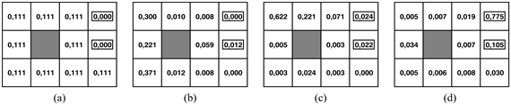
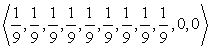
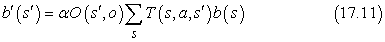
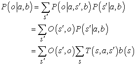
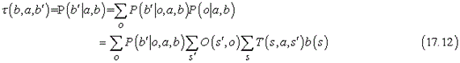
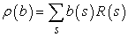

<?xml version="1.0" encoding="UTF-8" standalone="no"?>
<!DOCTYPE html PUBLIC "-//W3C//DTD XHTML 1.1//EN" "http://www.w3.org/TR/xhtml11/DTD/xhtml11.dtd">
<html xmlns="http://www.w3.org/1999/xhtml"><head><meta name="generator" content="DocBook XSL Stylesheets V1.76.1"/></head><body>

<h1 class="title"><a id="id715058"/>Részlegesen megfigyelhető Markov döntési folyamatok</h1>

A Markov döntési folyamatok leírása a 17.1. alfejezetben feltételezte, hogy a környezet <strong>teljesen megfigyelhető</strong> (<strong>fully observable</strong>). E mellett a feltételezés mellett az ágens mindig tudja, hogy melyik állapotban van. Ez együttesen az állapotátmenet-modell Markov-tulajdonságának a feltevésével azt eredményezi, hogy az optimális eljárásmód csak az aktuális állapottól függ. Amikor a környezet csak <strong>részlegesen megfigyelhető</strong> (<strong>partially observable</strong>), a helyzet nem ennyire átlátható. Az ágens nem tudja feltétlenül, hogy melyik állapotban is van, így nem hajthatja végre az adott állapothoz javasolt <em>π</em>(<em>s</em>) cselekvést. Továbbá, egy <em>s</em> állapot hasznossága és az <em>s</em>-beli optimális cselekvés nemcsak <em>s</em>-től függ, hanem attól is, hogy az ágens mennyit tud, amikor <em>s</em>-ben van. Ebből kifolyólag a <strong>részlegesen megfigyelhető MDF</strong>-eket (<strong>RMMDF</strong>) (<strong>partially obs</strong><strong>ervable MDP</strong>s, <strong>POMDP</strong>s) általában sokkal nehezebb dolgoknak tartják, mint a hagyományos MDF-eket. Az RMMDF-ek azonban nem megkerülhetők, mivel a valódi világ is egy RMMDF.

Példaként gondoljuk át újra a 17.1. ábra 4 × 3-as világát, de most tegyük fel, hogy az ágensnek <em>egyáltalán nincsenek érzékelői,</em> és <em>elképzelése sincs</em> arról, hogy hol lehet. Pontosabban, tegyük fel, hogy az ágens kezdeti állapota egyenlő valószínűséggel valamelyike a kilenc nem végállapotnak (17.8. (a) ábra). Világos, hogz ha az ágens tudná, hogy (3, 3)-ban van, akkor <em>Jobbra</em> mozgást hajtana végre; ha <em>tudná</em>, hogy (1, 1)-ben van, akkor <em>Fel</em> mozogna; de mivel bárhol lehet, mit is kellene tennie? Egy lehetséges válasz, hogy az ágensnek először olyan cselekvéseket kell végrehajtani, amelyek csökkentik a bizonytalanságát, és csak ezután kell megpróbálni a +1 kijárat felé tartani. Például ha az ágens öt alkalommal <em>Balra</em> mozgást hajt végre, akkor igen valószínű, hogy a bal oldali falnál van (17.8. (b) ábra). Ezután öt alkalommal <em>Fel</em> mozgást hajt végre, akkor igen valószínű, hogy a felső falnál van, valószínűleg a bal felső sarokban (17.8. (c) ábra). Végül öt <em>Jobbra</em> mozgást hajt végre, ekkor jó eséllyel – körülbelül 77,5%-kal – eléri a +1 kijáratot (17.8. (d) ábra). A <em>Jobbra</em> mozgás ezt követő folytatása az esélyét 81,8%-ra növeli. Ez az eljárásmód így meglepően biztonságos, de ebben az esetben az ágens igen lassan éri el a kijáratot, és a várható hasznossága csupán 0,08 körül van. Az optimális eljárásmód, amit hamarosan leírunk, sokkal jobban teljesít.

<a id="id715168"/>
<strong>17.8. ábra - (a) Az ágens elhelyezkedésének kezdeti valószínűségi eloszlása. (b) Ötszöri <em>Balra</em> mozgás után. (c) Ötszöri <em>Fel</em> mozgás után. (d) Ötszöri <em>Jobbra</em> mozgás után.</strong>

Az RMMDF-ek kezeléséhez először is megfelelően kell őket definiálni. Egy RMMDF-nek az elemei ugyanazok, mint egy MDF-nek – egy <em>T</em>(<em>s</em>,<em> a</em>,<em> s</em>′) állapotátmenet-modell és egy <em>R</em>(<em>s</em>) jutalomfüggvény –, de van egy <em>O</em>(<em>s</em>,<em> o</em>) <strong>megfigyelési modell</strong>je (<strong>observational </strong><strong>model</strong>) is, ami az <em>s</em> állapotban az <em>o</em> megfigyelés érzékelésének a valószínűségét adja meg.[<a id="id715246" href="#ftn.id715246" class="footnote">173</a>] Például az érzékelő nélküli ágensünknek csak egyetlen megfigyelése van (az üres megfigyelés), ami minden állapotban 1 valószínűséggel bekövetkezik.

A 3. és 12. fejezetben nemdeterminisztikus és részlegesen megfigyelhető tervkészítési problémákat tanulmányoztunk, és megállapítottuk, hogy a <strong>hiedelmi állapot</strong> (<strong>belief state</strong>) – az aktuális állapotok halmaza, amelyekben az ágens lehet – kulcsfogalom a megoldások leírására és kiszámítására.

Az RMMDF-ekben a fogalmat kissé finomítjuk. Egy <em>b</em> hiedelmi állapot most egy valószínűség-eloszlás lesz az összes lehetséges állapot felett. Például a 17.8. (a) ábra kezdeti hiedelmi állapota úgy írható, hogy . A <em>b</em> hiedelmi állapot által az aktuális <em>i </em>állapothoz rendelt valószínűséget <em>b</em>(<em>s</em>)-sel jelöljük. Az ágens úgy számíthatja ki a jelenlegi hiedelmi állapotát, mint egy <em>feltételes eloszlást</em> az aktuális állapotok felett, az eddigi megfigyelések és cselekvések sorozatának ismeretében. Ez lényegében a <strong>szűrés</strong>i (<strong>filtering</strong>) feladat (lásd 15<em>. </em>fejezet). A rekurzív szűrési alapegyenlet (lásd (15.3) egyenlet a <a class="xref" href="ch15s02.md#ID_633_oldal">„Szűrés és előrejelzés”</a> részben) megmutatja, hogy hogyan számolhatjuk ki az új hiedelmi állapotot az előző hiedelmi állapotból és az új megfigyelésből. Az RMMDF-eknél a jelölés eltérő, és meg kell gondolni még a cselekvést is, de az eredmény lényegében ugyanaz. Ha <em>b</em>(<em>s</em>) volt az előző hiedelmi állapot, és az ágens az <em>a</em> cselekvést hajtja végre és az <em>o</em> megfigyelést érzékeli, akkor az új hiedelmi állapot a következő:

ahol <em>a</em> egy normalizációs konstans, ami a hiedelmi állapot 1-re összegzését biztosítja. Ezt az egyenletet úgy rövidíthetjük, hogy <em>b</em>′ = <code class="code">ELŐRE</code>(<em>b</em>,<em> a</em>,<em> o</em>).

<h3 class="title">Fontos</h3>
A RMMDF-ek megértéséhez szükséges lényegi meglátás pedig ez: <em>az optimális cselekvés csak az ágens aktuális hiedelmi állapotától függ. </em>Így az optimális eljárásmód leírható a hiedelmi állapotok cselekvésekre történő <em>π</em>*(<em>b</em>)<em> </em>leképzésével. Ez <em>nem</em> függ az ágens <em>aktuális</em> állapotától, amiben tartózkodik. Ez hasznos tulajdonság, mivel az ágens nem ismeri az aktuális állapotát; csupán a hiedelmi állapotát. Ekkor egy RMMDF ágens döntési ciklusa a következő:

<ol class="orderedlist"><li class="listitem">
Adott jelenlegi <em>b</em> hiedelmi állapot esetén hajtsuk végre az <em>a</em> = <em>π</em>* (<em>b</em>) cselekvést.
</li><li class="listitem">
Fogadjuk az <em>o</em> megfigyelést.
</li><li class="listitem">
Állítsuk a jelenlegi állapothiedelmet <code class="code">ELŐRE</code>(<em>b</em>,<em> a</em>,<em> o</em>)-ra, és ismételjük meg a ciklust.
</li></ol>

Most úgy gondolhatunk az RMMDF-ekre, mint amelyek keresést igényelnek a hiedelmi állapotok terében, pontosan úgy, ahogy az érzékelő nélküli és az eshetőségi problémákra vonatkozó módszerek a 3. fejezetben. A fő különbség az, hogy az RMMDF hiedelmi állapot tere <em>folytonos,</em> mivel egy RMMDF hiedelmi állapot egy valószínűségi eloszlás. Például a hiedelmi állapot a 4 × 3-as világ esetében egy pont a 11 dimenziós folytonos térben. Egy cselekvés megváltoztatja a hiedelmi állapotot is, nemcsak a fizikai állapotot, így kiértékelése aszerint az információ szerint történik, amit a cselekvés eredményeként az ágens megszerez. Az RMMDF-ekbe ezért beletartozik az információ értéke is (16.6. alfejezet) mint a döntési probléma egy komponense.

Nézzük meg tüzetesebben a cselekvések kimenetelét. Nevezetesen, számítsuk ki annak valószínűségét, hogy az ágens a <em>b</em> hiedelmi állapotból a <em>b</em>′ hiedelmi állapotba jut az <em>a</em> cselekvés végrehajtása után. Ekkor, ha ismernénk a cselekvést és a <em>bekövetkező megfigyelést,</em> akkor a (17.11) egyenlet a hiedelmi állapot egy determinisztikus frissítését adná: <em>b</em>′ = <code class="code">ELŐRE</code>(<em>b</em>,<em> a</em>,<em> o</em>).<em> </em>Természetesen a bekövetkező megfigyelés még nem ismert, így az ágens a számos lehetséges hiedelmi állapot egyikébe, <em>b</em>′-be kerülhet az előforduló megfigyelés függvényében. Az <em>o</em> érzékelésének valószínűsége, feltéve hogy a <em>b</em>′ hiedelmi állapotban az <em>a</em> cselekvés került végrehajtásra, az összes olyan <em>s</em>′ aktuális állapot feletti összegzéssel adódik, amelyeket az ágens elérhet:

Jelölje <em>τ</em>(<em>b</em>,<em> a</em>,<em> b</em>′) annak a valószínűségét, hogy <em>b</em>-ből <em>b</em>′-be jutunk egy <em>a</em> cselekvéssel. Ennek felhasználásával ekkor 

ahol <em>P</em>(<em>b</em>′|<em>o</em>,<em> a</em>,<em> b</em>)<em> </em>1, ha <em>b</em>′ = <code class="code">ELŐRE</code>(<em>b</em>,<em> a</em>,<em> o</em>),<em> </em>egyébként<em> </em>pedig 0.

<h3 class="title">Fontos</h3>
A (17.2.) egyenletet felfoghatjuk egy állapotátmenet-modellnek a hiedelmi állapot térben. Definiálhatunk egy jutalomfüggvényt is a hiedelmi állapotokra (azaz azon aktuális állapotok várható jutalmát, amelyekben az ágens lehet):

Így láthatóan <em>τ</em>(<em>b</em>,<em> a</em>,<em> b</em>′)<em> </em>és <em>ρ</em>(<em>b</em>) együtt egy <em>megfigyelhető</em> MDF-et definiál a hiedelmi állapotok terén. Továbbá megmutatható, hogy egy <em>π</em>*(<em>b</em>) optimális eljárásmód erre az MDF-re, szintén optimális eljárásmód az eredeti RMMDF-re. Máshogy fogalmazva, <em>egy RMMDF megoldása a fizikai állapottérben redukálható egy MDF megoldására a hozzá tartozó hiedelmi állapot térben.</em> Ez a tény talán kevésbé meglepő, arra gondolva, hogy a hiedelmi állapot definíció szerint az ágens számára mindig megfigyelhető.

Vegyük észre, hogy bár az RMMDF-eket sikeresen redukáltuk az MDF-ekre, a kapott MDF-eknek folytonos (és általában sokdimenziós) állapotterük van. A 17.2. és 17.3. alfejezetekben leírt algoritmusok egyike sem alkalmazható közvetlenül ilyen MDF-ekre. Kiderült, hogy az érték- és eljárásmód-iterációnak kifejleszthetők olyan változatai, amelyek folytonos állapotú MDF-ekre is alkalmazhatók. Az alapötlet az, hogy egy <em>π</em>(<em>b</em>) eljárásmód reprezentálható a hiedelmi állapot tér olyan <em>részeinek</em> egy halmazaként, amelyek mindegyikéhez egy adott optimális cselekvés tartozik.[<a id="id716602" href="#ftn.id716602" class="footnote">174</a>] Az értékfüggvény <em>b</em> különböző lineáris függvényét rendeli az egyes térrészekhez. Minden érték- és eljárásmód-iterációs lépés finomít a térrészek határain, és új térrészeket vezethet be.

Az algoritmus részletei meghaladják a könyv kereteit, de megadjuk a megoldást az érzékelőmentes 4 × 3-as világra. Az optimális eljárásmód a következő:

<code class="code">[<em>Balra</em>,<em> Fel</em>,<em> Fel</em>,<em> Jobbra</em>,<em> Fel</em>,<em> Fel</em>,<em> Jobbra</em>,<em> Fel</em>,<em> Fel</em>,<em> Jobbra</em>,<em> Fel</em>, <em>Jobbra</em>,<em> Fel</em>, …]</code>

Az eljárásmód egy sorozat, mivel ez a probléma determinisztikus a hiedelmi állapotok terében – nincsenek megfigyelések. Azt a „trükköt” alkalmaztuk, hogy az ágens egyetlen <em>Balra</em> mozgással biztosítja, hogy <em>nincs</em> (4, 1)-ben, azért, hogy aztán meglehetős biztonsággal mozoghasson <em>Fel</em> és <em>Jobbra</em> a +1 kijárat eléréséhez. Az ágens a +1 kijáratot 86,6% gyakorisággal éri el, és sokkal gyorsabban, mint az alfejezet elején megadott eljárásmód esetén, így a várható hasznossága 0,38, szemben az előző 0,08-as értékével.

Bonyolultabb RMMDF-eknél, amikor megfigyelések is vannak, nagyon nehéz (valójában PSPACE-beli – azaz valóban nagyon nehéz) közelítőleg optimális eljárásmódokat találni. A problémák néhány tucat változóval gyakran kivitelezhetetlenek. A következő alfejezet egy eltérő közelítő módszert ír le RMMDF-ek megoldására, ami az előrenéző keresésen alapul.

 

[<a id="ftn.id715246" href="#id715246" class="para">173</a>]  A megfigyelési modell alapvetően azonos az időbeli folyamatok <strong>érzékelő modell</strong>jével (<strong>sensor model</strong>) a 15. fejezetből. Ahogyan az MDF-ek jutalomfüggvényénél, a megfigyelési modell szintén függhet a cselekvéstől és a kimeneteli állapottól, de ez most sem egy alapvető változás.

[<a id="ftn.id716602" href="#id716602" class="para">174</a>]  Bizonyos RMMDF-ekre az optimális eljárásmódhoz végtelen számú térrész tartozik, így az egyszerű térrészek listája megközelítés nem működik, és ötletesebb módszerek szükségesek még egy közelítés megtalálásához is.

</body></html>
