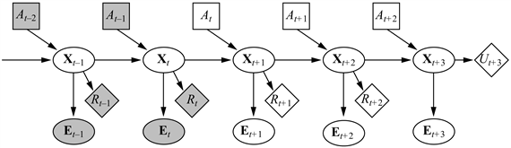
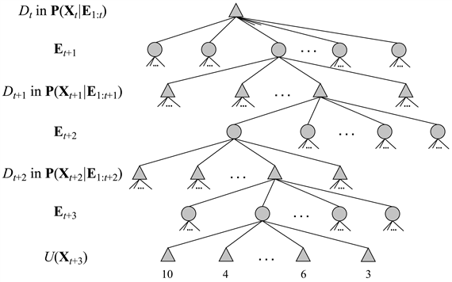

<?xml version="1.0" encoding="UTF-8" standalone="no"?>
<!DOCTYPE html PUBLIC "-//W3C//DTD XHTML 1.1//EN" "http://www.w3.org/TR/xhtml11/DTD/xhtml11.dtd">
<html xmlns="http://www.w3.org/1999/xhtml"><head><meta name="generator" content="DocBook XSL Stylesheets V1.76.1"/></head><body>

<h1 class="title"><a id="id716685"/>Döntéselméleti ágensek</h1>

Ebben a fejezetben egy átfogó szemléletmódot vázolunk fel az ágensek megtervezésére részlegesen megfigyelhető, sztochasztikus környezetek esetén. A tervezés alapelemei már ismertek:

<ul class="itemizedlist"><li class="listitem">
Az állapotátmenet- és megfigyelési modelleket egy <strong>dinamikus Bayes-háló</strong>val (<strong>dynamic Bayesian network</strong>) ábrázoljuk (a 15. fejezetben leírtak szerint).
</li><li class="listitem">
A dinamikus Bayes-háló kiegészült döntési és hasznossági csomópontokkal, amelyek megegyeznek a 16. fejezetben szereplő döntési hálókban használatosakkal. A kirajzolódó modellt <strong>dinamikus döntési háló</strong>nak vagy <strong>DDH</strong>-nak (<strong>dynamic decision network</strong>, <strong>DDN</strong>) nevezzük.
</li><li class="listitem">
Egy szűrési algoritmust használunk az új érzékelések és cselekvések befogadására és a hiedelmi állapot reprezentációjának a frissítésére.
</li><li class="listitem">
Döntéseket hozunk lehetséges cselekvéssorozatok elgondolásával és a legjobb kiválasztásával.
</li></ul>

Egy dinamikus Bayes-háló felhasználásának elsődleges haszna az állapotátmenet- és érzékelő modellek ábrázolásánál az, hogy felbontja az állapotleírást valószínűségi változók egy halmazára, hasonlóan ahhoz, ahogy a tervkészítési algoritmusok logikai ábrázolást vesznek igénybe az állapottér felbontására, amit a keresési algoritmusok használnak. Az ágensterv ezért a 2. fejezetben vázolt hasznosságalapú ágens egy gyakorlati megvalósítása.

Mivel dinamikus Bayes-hálókat használunk, visszatérünk a 15. fejezetbeli jelöléshez, ahol <strong>X</strong>t az állapotváltozók egy halmazát jelölte egy <em>t</em> időpillanatban, <strong>E</strong>t pedig a bizonyítékváltozókat. Így ahol ebben a fejezetben eddig <em>st</em>-t használtunk (a <em>t</em>-beli állapotra), mostantól <strong>X</strong>t-t fogunk használni. A <em>t</em>-beli cselekvést <em>At</em>-vel fogjuk jelölni, így a <em>T</em>(<em>s</em>,<em> a</em>,<em> s</em>′) állapotátmenet-modell ugyanaz, mint a <strong>P</strong>(<strong>X</strong><em>t+</em>1|<strong>X</strong>t, <em>At</em>), és az <em>O</em>(<em>s</em>,<em> o</em>) megfigyelési modell ugyanaz, mint a <strong>P</strong>(<strong>E</strong>t|<strong>X</strong>t). A <em>t</em> időpontban kapott jutalmat jelöljük <em>Rt</em>-vel, és <em>Ut</em>-vel az állapot hasznosságát a <em>t</em> időpontban. E szerint a jelölés szerint egy dinamikus döntési háló a 17.9. ábrán látható módon néz ki.

<a id="id716881"/>
<strong>17.9. ábra - Egy dinamikus döntési háló általános struktúrája. Az ismert értékű változók árnyékoltak. A jelenlegi időpont <em>t</em>, és az ágensnek el kell döntenie, hogy mit tegyen – azaz választania kell egy értéket <em>A</em><em>t</em> számára. A háló három jövőbeli lépésre van kibontva, és a jövőbeli jutalmakat, valamint az előrelátó horizonton lévő állapot hasznosságát ábrázolja.</strong>

A dinamikus döntési hálók tömör leírást biztosítanak nagy RMMDF-ekre, így bármely RMMDF algoritmus bemenetéül szolgálhatnak, ideértve az érték- és eljárásmód-iterációra való módszereket is. Ebben az alfejezetben az előrenéző módszerekre összpontosítunk, amelyek cselekvéssorozatokat képzelnek el a jelenlegi hiedelmi állapottól kiindulva, nagyon hasonlóan a 6. fejezetbeli játékok algoritmusaihoz. A 17.9. ábrán a háló három jövőbeli lépésig elképzelve szerepel; a jelenlegi és a jövőbeli döntések és a jövőbeli megfigyelések és jutalmak mind ismeretlenek. Figyeljük meg, hogy a háló csomópontokat tartalmaz az <strong>X</strong><em>t</em>+1 és<strong> X</strong><em>t</em>+2-beli <em>jutalmakra</em>, de <em>hasznosságot</em> az <strong>X</strong><em>t</em>+3 esetében. Ez azért van így, mert az ágensnek maximalizálnia kell az összes jövőbeli jutalom (leszámítolt) összegét, és <em>U</em>(<strong>X</strong><em>t</em>+3) reprezentálja az <strong>X</strong><em>t</em>+3-hoz tartozó és az összes ezt követő jutalmat. Ahogyan a 6. fejezetben, most is feltesszük, hogy <em>U</em>-nak csak egy közelítő alakja érhető el: ha elérhetők lennének pontos hasznosságértékek, akkor nem lenne szükség 1 lépésnél hosszabb előretekintésre.

A 17.9. ábrán látható DDH-hoz tartozó háromlépéses előrenéző keresési fa egy részét a 17.10. ábra mutatja. Mindegyik háromszög alakú csomópont egy olyan hiedelmi állapot, amiben az ágens egy <em>A</em><em>t</em>+<em>i</em> döntést hoz <em>i</em> = 0, 1, 2, ... esetén. A kerek csomópontok a környezet válaszaihoz tartoznak, nevezetesen hogy milyen <strong>E</strong><em>t</em>+<em>i</em> megfigyelés fog felbukkanni. Látható, hogy nincsen véletlen csomópont, ami a cselekvések kimeneteléhez tartozna. Ez azért van így, mert egy cselekvésnél a hiedelmi állapot frissítése a konkrét kimeneteltől függetlenül determinisztikus.

A hiedelmi állapot az egyes háromszög csomópontoknál kiszámítható egy szűrési algoritmusnak a hozzávezető megfigyelések és cselekvések sorozatán való alkalmazásával. Ezzel a módszerrel, az algoritmus figyelembe veszi azt a tényt, hogy egy <em>A</em><em>t</em>+<em>i</em> döntésnél az ágens számára elérhetők lesznek az <strong>E</strong><em>t</em>+1, ...,<strong> E</strong><em>t</em>+<em>i</em> érzékelések, még ha a <em>t</em> időpontban nem is tudja, hogy ezek az érzékelések mi is lesznek. Ezen a módon a döntéselméleti ágens automatikusan figyelembe veszi az információ értékét és információgyűjtő cselekvéseket hajt végre, ha szükséges.

Egy döntés a keresési fából a levelek hasznosságértékének hátrafelé terjesztésével nyerhető ki, a véletlen csomópontoknál átlagot, a döntési csomópontokban pedig maximumot számítva. Ez hasonló a véletlen csomópontokkal rendelkező játékfákra vonatkozó <code class="code">VÁRHATÓMINIMAX</code> algoritmushoz, kivéve, hogy (1) nem csak levélállapotokban lehet jutalom, és (2) a döntési csomópontok hiedelmi állapotokhoz, és nem aktuális állapotokhoz tartoznak. A <em>d</em> mélységű kimerítő keresés időkomplexitása <em>O</em>(|<em>D</em>|<em>d </em>· |<strong>E</strong>|d), ahol |<em>D</em>| az elérhető cselekvések száma, |<strong>E</strong>| pedig a lehetséges megfigyelések száma. Olyan problémáknál, ahol a <em>γ</em> leszámítolási tényező nincs közel 1-hez, gyakran elegendő sekély keresés az optimálishoz közeli döntés megtalálásához. Az is lehetséges, hogy az átlagszámítás lépését a lehetséges megfigyelések mintavételezésével közelítjük, az összes lehetséges megfigyelés feletti összegzés helyett. Számos más módja van jó közelítő megoldások gyors megtalálásának, de ezeket a 21. fejezetre hagyjuk.

A dinamikus döntési háló alapú döntéselméleti ágenseknek számos előnye van más, egyszerűbb, a korábbi fejezetekben bemutatott ágensfelépítésekhez képest. Nevezetesen, részlegesen megfigyelhető és sztochasztikus környezeteket kezelnek, és könnyen felülbírálják a „terveiket” a váratlan események kezeléséhez. Megfelelő érzékelő modellekkel képesek kezelni az érzékelőmeghibásodást, és képesek megtervezni az információ begyűjtését. Az idő szorításában és komplex környezetekben „teljesítményromlásuk fokozatos”, különböző közelítő technikák kihasználásával. Így jogos a kérdés, hogy mi is hiányzik még? A DDH-alapú algoritmusunknak a legkomolyabb hiányossága az előrefelé kereséstől való függés, ahogyan a II. részbeli állapottér-keresési algoritmusoknak is. A IV. részben elmagyaráztuk, hogy részlegesen rendezett, absztrakt tervek mérlegelésének képessége célirányos kereséssel hogyan biztosította a problémamegoldó képesség lényegi növekedését, különösen a tervkönyvtárakkal összeillesztve. Ezeket a módszereket megkísérelték a valószínűségi területre is kiterjeszteni, de ez eddig nem bizonyult hatékonynak. Egy második, kapcsolódó probléma a DDH nyelv alapvető kijelentéslogikai természete. Szeretnénk, ha az elsőrendű valószínűségi nyelvek elképzeléseit (lásd 14.6. alfejezet) ki tudnánk terjeszteni a döntéshozatal problémájára. A jelenlegi kutatások azt mutatják, hogy ez a kiterjesztés lehetséges, és jelentős előnyöket rejt magában, ahogy ezt a fejezet végi megjegyzéseknél megtárgyaljuk.

<a id="id717080"/>
<strong>17.10. ábra - A 17.9. ábrán látható DDH előrenéző megoldásának egy része</strong>

</body></html>
