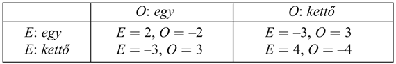
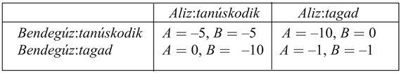
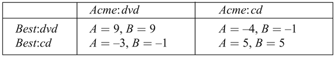

<?xml version="1.0" encoding="UTF-8" standalone="no"?>
<!DOCTYPE html PUBLIC "-//W3C//DTD XHTML 1.1//EN" "http://www.w3.org/TR/xhtml11/DTD/xhtml11.dtd">
<html xmlns="http://www.w3.org/1999/xhtml"><head><meta name="generator" content="DocBook XSL Stylesheets V1.76.1"/></head><body>

<h1 class="title"><a id="id717089"/>Többágenses döntések: a játékelmélet</h1>

Ez a fejezet a bizonytalan környezetbeli döntéshozatalra összpontosított. De mi a helyzet akkor, ha a bizonytalanság más ágenseknek és azok döntéseinek köszönhető? És ha ezeknek az ágenseknek a döntéseit a mi döntéseink befolyásolják? Ezzel a kérdéssel egyszer már foglalkoztunk, amikor a 6. fejezetben a játékokat tanulmányoztuk. Ott azonban többfordulós, teljes információs játékokkal foglalkoztunk, amelyekre a minimax kereséssel optimális lépések találhatók. Ebben az alfejezetben a <strong>játékelmélet</strong> (<strong>game theor</strong><strong>y</strong>) azon vonatkozásait tanulmányozzuk, amelyek felhasználhatók szimultán játékok elemzésére. Egyszerűsítés céljából elsőként olyan játékokat nézünk meg, amelyek csak egy lépés hosszúak. A „játék” szó és az egyetlen lépésre való korlátozás ezt triviálisnak tüntetheti fel, de valójában a játékelméletet nagyon komoly döntéshozatali helyzetekben használják – ideértve a bankcsődeljárásokat, a távközlési frekvenciasávok aukcióját, a termékfejlesztési és ármegállapítási döntéseket, illetve a honvédelmi kérdéseket – olyan helyzetekben, amelyek dollármilliárdok és életek százezreinek a sorsát érintik. A játékelmélet legalább kétféle módon használható fel:
<a id="ID_727_oldal"/>
<ol class="orderedlist"><li class="listitem">
<strong>Ágenstervezés</strong> (<strong>agent design</strong>): A játékelmélet képes elemezni az ágensek döntéseit, és kiszámítani az egyes döntések várható hasznosságát (azon feltevés mellett, hogy más ágensek a játékelmélet szerint optimálisan cselekednek). Például a <strong>kétujjas snóblijá</strong><strong>ték</strong>ban (<strong>two-finger Morra</strong>) két játékos, <em>O </em>és <em>E</em> egyidejűleg felmutatja egy vagy két ujját. Legyen az ujjak összes száma <em>f</em>. Ha <em>f</em> páratlan, akkor <em>O</em> kap <em>f</em> dollárt <em>E</em>-től, és ha <em>f</em> páros, akkor <em>E</em> kap <em>f</em> dollárt <em>O</em>-tól. A játékelmélet képes meghatározni a legjobb stratégiát egy racionális ellenféllel szemben, és az egyes játékosok várható hasznát.[<a id="id717179" href="#ftn.id717179" class="footnote">175</a>]
</li><li class="listitem">
<strong>Működési mód tervezés</strong> (<strong>mechanism design</strong>): Amikor a környezetet számos ágens népesíti be, előfordulhat, hogy a környezet szabályait (azaz a játékot, amit az ágenseknek játszaniuk kell) olyannak határozhatjuk meg, hogy az összes ágens együttes haszna akkor maximális, amikor mindegyik ágens egy saját hasznát maximáló játékelméleti megoldást követ. Például a játékelmélet segíthet olyan protokollok tervezésében az internetes forgalomirányítók számára, hogy minden irányítónak olyan ösztönzői legyenek, hogy a globális átvitel maximális legyen. A működési mód tervezés arra is felhasználható, hogy olyan intelligens <strong>többágenses rendszer</strong>eket (<strong>multiagent system</strong>s) hozzunk létre, amelyek komplex problémákat elosztott módon oldanak meg, anélkül, hogy az egyes ágenseknek ismerniük kellene a megoldandó teljes problémát.
</li></ol>

Egy játékot a játékelméletben a következő alkotóelemek definiálnak:

<ul class="itemizedlist"><li class="listitem">
<strong>Játékos</strong>ok (<strong>player</strong>) vagy ágensek, akik döntéseket hoznak. A legnagyobb figyelem a kétszemélyes játékokra irányult, bár az <em>n</em> személyes játékok <em>n </em>&gt; 2-re szintén gyakoriak. A játékosokra nagybetűs neveket használunk, mint <em>Aliz</em> és <em>Bendegúz</em> vagy <em>O</em> és <em>E</em>.
</li><li class="listitem">
<strong>Cselekvés</strong>ek (<strong>action</strong>s), amiket a játékosok választhatnak. A cselekvéseknek kisbetűs neveket választunk, mint az <em>egy</em> vagy a <em>tanúskodik</em>. Lehet, hogy a játékosok a cselekvéseknek ugyanazt a halmazát érik el, de az is lehet, hogy különbözőt.
</li><li class="listitem">
<strong>Jutalommátrix</strong> (<strong>payoff matrix</strong>), ami az összes játékos cselekvéseinek mindegyik kombinációjára, mindegyik játékos számára megadja a hasznosságot. A jutalommátrix a kétujjas snóblijátékhoz a következő:
</li></ul>

	Például a jobb alsó sarokban az látható, amikor <em>O</em> a kettő cselekvést és <em>E</em> szintén a kettő cselekvést választja, a jutalom <em>E</em>-nek 4, <em>O</em>-nak pedig –4.

Minden játékosnak a játékban választania kell, és aztán végrehajtani egy <strong>stratégiá</strong>t (<strong>strategy</strong>) (ami a 16. fejezetben szereplő eljárásmód elnevezése a játékelméletben). A <strong>tiszta stratégia</strong> (<strong>pure strategy</strong>) egy determinisztikus eljárásmód, ami mindegyik helyzethez előír egy végrehajtandó konkrét cselekvést; az egylépéses játékokban a tiszta stratégia csupán egyetlen cselekvés. A játékok elemzése vezetett el a <strong>kevert stratégiá</strong>k (<strong>mixed strategy</strong>) gondolatához, amely eljárásmódban egy konkrét cselekvés véletlenszerűen kerül kiválasztásra egy adott eloszlásból a cselekvések felett. Azt a kevert stratégiát, ami <em>p</em> valószínűséggel az <em>a</em> cselekvést, egyébként pedig a <em>b</em>-t választja, úgy jelöljük, hogy [<em>p</em>: <em>a</em>;<em> </em>(1 – <em>p</em>): <em>b</em>]. Például a kétujjas snóblijátékban egy lehetséges kevert stratégia a [0,5: <em>egy</em>; 0,5: <em>kettő</em>]. A <strong>stratégiaprofil</strong> (<strong>strategy profil</strong>) egy hozzárendelés, ami mindegyik játékoshoz egy stratégiát rendel; adott stratégiaprofilnál a játék <strong>kimenetel</strong>e (<strong>outcome</strong>) egy numerikus érték mindegyik játékoshoz.

Egy játék<strong> megoldás</strong>a (<strong>solution</strong>) egy olyan stratégiaprofil, amiben minden játékos egy racionális stratégiát fogad el. Látni fogjuk, hogy a játékelméletben a legfontosabb kérdés a „racionális” jelentésének a definiálása akkor, amikor mindegyik ágens csak egy részét választja meg a kimenetelt meghatározó stratégiaprofilnak. Fontos azt felismerni, hogy a kimenetelek a játék egyes meneteinek a konkrét eredményei, míg a megoldások a játék elemzéséhez használt elméleti konstrukciók. Megmutatjuk, hogy bizonyos játékoknak csak a kevert stratégiák között van megoldása. Ez azonban nem jelenti azt, hogy egy játékosnak szó szerint egy kevert stratégiát kell elfogadnia a racionális viselkedéshez.

Gondoljuk át a következő történetet: két állítólagos betörőt, Alizt és Bendegúzt tetten érik egy betörés helyszínéhez közel, és a rendőrség külön-külön kihallgatja őket. Mindketten tudják, hogy ha mindketten beismerik a bűncselekményt, akkor 5 év börtönt kapnak betörésért, de ha mindketten tagadnak, akkor csak 1 évet kapnak lopott holmik birtoklásának enyhébb vádjával. Azonban a rendőrség külön-külön alkut ajánl mindkettőnek: ha a partneredről tanúsítod, hogy egy betörőbanda vezetője, akkor szabadon engednek, míg a partnered 10 évet kap. Ekkor Aliz és Bendegúz az úgynevezett <strong>fogolydilemmá</strong>val (<strong>prisoner’s dilemma</strong>) szembesülnek: tanúskodniuk kell vagy tagadniuk? Racionális ágensként Aliz és Bendegúz is a saját várható hasznosságát akarja maximálni. Tegyük fel, hogy Alizt teljességgel hidegen hagyja partnerének a sorsa, így az ő hasznossága a saját börtönben töltött éveinek számával arányosan csökken, függetlenül attól, hogy mi történik Bendegúzzal. Bendegúz teljesen hasonlóan érez. A racionális döntés meghozatalához mindketten megalkotják a következő jutalommátrixot:

Aliz a következőképpen elemzi a jutalommátrixot: Tegyük fel, hogy Bendegúz tanúskodik. Ha tanúskodom, 5 évet kapok, és 10 évet, ha nem, ebben az esetben a tanúskodás jobb. Másrészről, ha Bendegúz tagad, akkor 0 évet kapok, ha tanúskodom, és 1 évet, ha tagadok, így a tanúskodás ebben az esetben is jobb. Így mindkét esetben számomra jobb tanúskodni, így ez az, amit tennem kell.

Aliz felfedezte, hogy a <em>tanúskodás</em> a játék <strong>domináns stratégiá</strong>ja (<strong>dominant strategy</strong>). Azt mondjuk, hogy egy <em>p</em> játékos egy <em>s</em> stratégiája <strong>erősen dominál</strong>ja (<strong>strongly dominate</strong>) az <em>s</em>′ stratégiát, ha az <em>s</em> kimenetele <em>p</em> számára jobb, mint az <em>s</em>′ kimenetele, a többi játékos minden stratégiaválasztása esetén. Egy <em>s</em> stratégia <strong>gyengén dominál</strong>ja (<strong>weakly dominates</strong>) <em>s</em>′-t, ha <em>s</em> jobb, mint <em>s</em>′ legalább egy stratégiaprofilnál, és nem rosszabb a többiben. Egy domináns stratégia olyan stratégia, ami az összes többit dominálja. Egy erősen dominált stratégiát irracionális követni, és ha létezik, irracionális eltérni a domináns stratégiától. Racionális volta miatt Aliz a domináns stratégiát választja. Már csak egy kevés terminológiára van szükségünk a továbbhaladáshoz: egy kimenetelt <strong>Pareto-optimális</strong>nak (<strong>Pareto optimal</strong>) nevezünk,[<a id="id717511" href="#ftn.id717511" class="footnote">176</a>] ha nincs másik kimenetel, amit az összes játékos preferálna. Egy kimenetel <strong>Pareto-dominált</strong> (<strong>Pareto dominated</strong>) egy másik kimenetel által, ha az összes játékos a másik kimenetelt preferálná.

Ha Aliz okos és racionális, folytatni fogja az érvelést a következőképpen: Bendegúz domináns stratégiája szintén a tanúskodás. Így ő is tanúskodni fog, és mindketten 5 évet kapunk. Amikor mindegyik játékosnak van domináns stratégiája, ezek kombinációját <strong>domináns stratégiai egyensúly</strong>nak (<strong>dominant strategy equilibrium</strong>) nevezzük. Általában egy stratégiaprofil akkor van <strong>egyensúlyi helyzet</strong>ben (<strong>equilibrium</strong>), ha egyik játékos sem nyer stratégiája váltásával, az összes többi játékos stratégiájának változatlansága mellett. Egy egyensúlyi helyzet lényegében egy <strong>lokális optimum</strong> (<strong>local optimu</strong><strong>m</strong>) az eljárásmódok terében: egy csúcs teteje lejtőkkel minden dimenzióban, ahol a dimenziók egy játékos stratégiai választásaihoz tartoznak.

A <em>dilemma</em> a fogolydilemmában az, hogy az egyensúlyi helyzet kimenetele mindkét játékosnak rosszabb, mint az a kimenetel, amit akkor érnének el, ha mindketten megtagadnák a tanúskodást. Másképpen fogalmazva, az egyensúlyi megoldás kimenete Pareto-dominált a (<em>tagad</em>, <em>tagad</em>)-nak a (–1, –1)-es kimenetelével.

Van-e módja Aliznak és Bendegúznak a (–1, –1)-es kimenetelt elérni? Az bizonyosan <em>megengedett lehetőség</em> mindkettőjüknek, hogy megtagadják a tanúskodást, de <em>valószínűtlen</em> lehetőség. Akármelyik játékos is kezdene elmélkedni azon, hogy a <em>tagadást</em> választja, felismeri, hogy jobban teszi, ha a <em>tanúskodik</em>. Az egyensúlyi helyzetnek ez a vonzereje.

<h3 class="title">Fontos</h3>
A matematikus John Nash (1928–) bebizonyította, hogy <em>minden játéknak van egy itt definiált típusú egyensúlyi helyzete</em>. Ezt a tiszteletére most már Nash-egyensúlynak nevezik. Nyilvánvaló, hogy egy domináns stratégiai egyensúly <strong>Nash-egyensúly</strong> (<strong>Nash equilibrium</strong>) (lásd 17.9. feladat), de nem minden játéknak vannak domináns stratégiái. Nash tétele azt mondja ki, hogy egyensúlyi stratégiák akkor is léteznek, ha nincs domináns stratégia.

A fogolydilemmánál csak a (<em>tanúskodik</em>, <em>tanúskodik</em>) stratégiaprofil Nash-egyensúly. Nehezen látható, hogy racionális játékosok hogyan tudják elkerülni ennek a kimenetelét, mivel bármely javasolt nem egyensúlyi megoldásnál legalább egy játékos kísértésben lenne, hogy változtasson a stratégiáján. Játékelméleti kutatók egyetértenek, hogy a Nash-egyensúly fennállása szükséges feltétel egy megoldás fennállásához – bár abban már nem értenek egyet, hogy ez elégséges feltétel-e.

A (<em>tanúskodik</em>,<em> tanúskodik</em>) megoldás könnyűszerrel elkerülhető, ha valamilyen módon megváltoztatjuk a játékot (vagy a játékosokat). Módosíthatjuk például egy olyan iterált játékra, amiben a játékosok tudják, hogy újra találkozni fognak (de az döntő, hogy bizonytalanok legyenek abban, hogy hányszor fognak még újra találkozni). Vagy ha az ágensek morális meggyőződése erősíti az együttműködést és az igazságosságot, megváltoztathatjuk a jutalommátrixot úgy, hogy tükrözze az egyes ágensek többiekkel való együttműködésének a hasznosságát. Később látni fogjuk, hogy az ágens olyan megváltoztatása, hogy a számítási kapacitása korlátos, ahelyett hogy teljesen racionális következtetésre lenne képes, szintén befolyásolja a kimenetelt, mivel azt árulhatja el az egyik ágensnek, hogy a másik racionalitása korlátos.

Most nézzünk meg egy játékot, aminek nincs domináns stratégiája. Az Acme nevű videojáték-hardver gyártójának döntenie kell, hogy a következő játékgép DVD-ket vagy CD-ket használjon. Eközben a videojáték-szoftver gyártójának, Bestnek is döntenie kell, hogy DVD-n vagy CD-n adja ki a következő játékát. A nyereség mindkettőjüknek pozitív, ha egyetértenek, és negatív, ha eltérnek, ahogy a következő jutalommátrixból ez látható:

<h3 class="title">Fontos</h3>
Erre a játékra nincs domináns stratégiai egyensúly, de létezik két Nash-egyensúly: (<em>dvd</em>, <em>dvd</em>) és (<em>cd</em>, <em>cd</em>). Tudjuk, hogy ezek Nash-egyensúlyok, mivel akármelyik játékos is vált egyoldalúan egy különböző stratégiára, az rosszabbul fog állni. Most az ágenseknek a problémája a következő: <em>több elfogadható megoldás is létezik, de ha az egyes ágensek különböző megoldást választanak, akkor a kiadódó stratégiaprofil egyáltalán nem lesz megoldás, és mindkét ágens veszteséget fog elszenvedni. </em>Hogyan egyezhetnek meg egy megoldásban? Egy válasz erre, hogy mindkettőnek a Pareto-optimális megoldást kell választania (<em>dvd</em>, <em>dvd</em>); azaz leszűkíthetjük a „megoldás” definícióját az egyértelmű Pareto-optimális Nash-egyensúlyokra, feltéve, hogy létezik ilyen. Minden játéknak van legalább egy Pareto-optimális megoldása, de egy játéknak lehet több egyensúlyi pontja, de lehet, hogy ezek nem egyensúlyi pontok. Például beállíthatjuk a jutalmakat a (<em>dvd</em>, <em>dvd</em>)-nél 5-re 9 helyett. Ebben az esetben két egyenlő Pareto-optimális egyensúlyi pont létezik. A közöttük való választáshoz az ágensek vagy találgatnak, vagy <em>kommunikálnak</em>, ami vagy egy megállapodás kimondását jelenti, ami sorrendezi a megoldásokat a játék megkezdődése előtt, vagy tárgyalást jelent, hogy egy kölcsönösen előnyös megoldás alakuljon ki a játék folyamán (ami egy többlépéses játék részeként megjelenő kommunikációs cselekvések létét jelentené). A kommunikáció így pontosan ugyanazokból az okokból jelenik meg, mint a többágenses tervezésnél a 12. fejezetben. Az ilyen játékokat, ahol a játékosoknak szükséges kommunikálniuk, <strong>koordinációs játék</strong>oknak (<strong>coordination game</strong>s) nevezzük.

Láttuk, hogy egy játéknak lehet több mint egy Nash-egyensúlya: honnan tudjuk, hogy minden játéknak van legalább egy? Az lehetséges, hogy egy játéknak nincs tiszta stratégiájú Nash-egyensúlya. Gondoljunk át például egy tetszőleges <em>tiszta stratégiájú </em>profilt a kétujjas snóblijátékhoz (<a class="xref" href="ch17s06.md#ID_727_oldal">„Többágenses döntések: a játékelmélet”</a> rész). Ha az ujjak összértéke páros, akkor <em>O</em> szeretne váltani; ha páratlan, akkor pedig <em>E</em> szeretne váltani. Így egy tiszta stratégiájú profil nem lehet egyensúlyi, és kevert stratégiákat kell megnéznünk.

De melyik kevert stratégiát? 1928-ban Neumann kifejlesztett egy módszert az optimális kevert stratégia megkeresésére kétszemélyes zérusösszegű játékokra. A <strong>zérusössze</strong><strong>gű játék</strong>[<a id="id717713" href="#ftn.id717713" class="footnote">177</a>] (<strong>zero-sum game</strong>) olyan játék, amiben a jutalmak a jutalommátrix elemeiben nullára összegződnek. Világos, hogy a snóblijáték ilyen játék. A kétszemélyes zérusösszegű játékoknál tudjuk, hogy a jutalmak egyenlők és ellentétesek, így csak az egyik játékos jutalmait kell figyelembe vennünk, aki a maximáló lesz (ahogy a 6. fejezetben is). A snóblijátéknál az <em>E</em> páros játékost választjuk maximálónak, így a jutalommátrixot az <em>UE</em>(<em>e</em>,<em> o</em>)<em> </em>értékekkel definiálhatjuk – a jutalom <em>E</em>-nek, ha <em>E</em> <em>e</em>-t hajt végre és <em>O</em> <em>o</em>-t.

Neumann módszerét <strong>maximin techniká</strong>nak nevezik, és a következő módon működik:

<ul class="itemizedlist"><li class="listitem">
Tegyük fel, hogy úgy változtatjuk meg a szabályokat, hogy elsőként <em>E</em>-nek kötelező felfedni a stratégiáját, majd <em>O</em> következik. Így egy fordulókon alapuló játékot kapunk, amire a standard <strong>minimax algoritmus</strong>t alkalmazhatjuk a 6. fejezetből. Tegyük fel, hogy ez egy <em>U</em><em>E</em>,<em>O</em> kimenetelt ad. Nyilvánvaló, hogy ez a játék <em>O</em>-nak kedvez, így a játék igazi hasznossága (<em>E</em> szempontjából) legalább <em>U</em><em>E</em>,<em>O</em>. Például ha csak tiszta stratégiákat nézünk, a minimax játékfának a gyökérbeli értéke –3 (lásd 17.11. (a) ábra), így tudjuk, hogy <em>U</em> ≥ –3.
</li><li class="listitem">
Most tegyük fel, hogy a szabályokat úgy változtatjuk meg, hogy elsőként <em>O</em>-nak kötelező felfednie a stratégiáját, majd <em>E</em> következik. Ennek a játéknak a minimax értéke <em>U</em><em>E</em>,<em>O</em>, és mivel ez a játék <em>E</em>-nek kedvez, tudjuk, hogy <em>U</em> <em>legfeljebb</em> <em>U</em><em>E</em>,<em>O</em>. Tiszta stratégiáknál az érték +2 (lásd 17.11. (b) ábra), így tudjuk, hogy <em>U </em>≤ +2.
</li></ul>

Ezt a két érvelést összekapcsolva láthatjuk, hogy a megoldás valódi hasznossága (<em>U</em>) eleget fog tenni annak, hogy

<code class="code"><em>U</em><em>E</em>,<em>O</em> ≤ <em>U </em>≤ <em>U</em><em>O</em>,<em>E</em><em>	</em>	vagy ebben az esetben	     –3 ≤ <em>U </em>≤ 2</code>

<h3 class="title">Fontos</h3>
Az <em>U</em> értékének pontos megállapításához az elemzésünkben át kell térni a kevert stratégiákra. Elsőként vegyük észre a következőt: <em>ha az első játékos felfedte a stratégiáját, a második nem veszthet azzal, hogy tiszta stratégiát követ</em>. Az ok egyszerű: ha a második játékos egy [<em>p</em>: <em>egy</em>; (1 – <em>p</em>): <em>kettő</em>] kevert stratégiát játszik, akkor a várható hasznossága a tiszta stratégiák hasznosságainak, <em>uegy</em>-nek és <em>ukettő</em>-nek egy lineáris kombinációja, <em>(p</em> <em>uegy</em> + (1 – <em>p</em>) · <em>ukettő</em>). Ez a lineáris kombináció nem haladhatja meg az <em>uegy</em> és az <em>ukettő</em> közül a nagyobbat, így a második játékos is játszhat egy tiszta stratégiát.

Ezt az észrevételt emlékezetünkben tartva, a minimax fáknál képzelhetjük azt, hogy a gyökérnél végtelen sok ág van, amelyek az első játékos által választható végtelen sok kevert stratégiához tartoznak. Ezek mindegyike egy kettős elágazású csomóponthoz vezet, amelyek a második játékos tiszta stratégiáihoz tartoznak. Ezeket a végtelen fákat úgy ábrázoljuk véges módon, hogy a gyökérnél egy „parametrizált” választás van:

<ul class="itemizedlist"><li class="listitem">
Ha <em>E</em> lép először, a helyzet a 17.11. (c) ábrán látható. <em>E</em> a gyökérnél [<em>p</em>: <em>egy</em>; (1 – <em>p</em>): <em>kettő</em>]<em> </em>szerint játszik, és <em>O</em> <em>p</em> értéke alapján választ egy lépést. Ha <em>O</em> <em>egy</em>-et választ, a várható jutalom (<em>E</em>-nek) 2<em>p</em> – 3(1 – <em>p</em>) = 5<em>p</em> – 3; ha <em>O</em> <em>kettő</em>-t választ, a várható jutalom –3<em>p </em>+<em> </em>4(1 – <em>p</em>) = 4 – 7<em>p</em>. Ezeket a jutalmakat mint egyeneseket tüntethetjük fel a grafikonon, ahol <em>p</em> 0 és 1 között lehet az <em>x</em> tengelyen, ahogyan az a 17.11. (e) ábrán látható. <em>O</em>, a minimalizáló, mindig az alsót fogja választani a két egyenes közül, amit az ábrán a vastag egyenes jelez. Így a legjobb, amit <em>E</em> tehet a gyökérnél, hogy <em>p</em>-t a metszéspontnál választja meg, aminek értéke:
</li></ul>

<code class="code">	5<em>p</em> – 3 = 4 – 7<em>p    </em>⇒<em>      p </em>= 7/12</code>

A hasznosság <em>E</em> számára ebben a pontban <em>U</em><em>E</em>,<em>O</em> = –1/12.

<ul class="itemizedlist"><li class="listitem">
Ha <em>O</em> lép először, a helyzet a 17.11. (d) ábrán látható. <em>O</em> a gyökérnél [<em>q</em>: <em>egy</em>; (1 – <em>q</em>): <em>kettő</em>]<em> </em>szerint játszik, és <em>E</em> a <em>q</em> értéke alapján választ egy lépést. A jutalmak 2<em>q</em> – 3(1 –<em>q</em>) = 5<em>q</em> – 3 és –3<em>q </em>+<em> </em>4(1 – <em>q</em>) = 4 – 7<em>q</em>.[<a id="id718207" href="#ftn.id718207" class="footnote">178</a>] Ismét látható a 17.11. (f) ábrán, hogy a legjobb, amit <em>O</em> a gyökérnél tehet, hogy a metszéspontot választja:
</li></ul>

<code class="code">	5<em>q</em> – 3 = 4 – 7<em>q     </em>⇒<em>     q</em> = 7/12</code>

A hasznosság <em>E</em> számára ebben a pontban <em>U</em><em>O</em>,<em>E</em> = –1/12.

Most már tudjuk, hogy a játék valódi hasznossága –1/12 és –1/12 között helyezkedik el, azaz pontosan –1/12! (A tanulság az, hogy ebben a játékban jobb <em>O</em>-nak lenni, mint <em>E</em>-nek.) Továbbá, a valódi hasznosságot a [7/12: <em>egy</em>; 5/12: <em>kettő</em>] kevert stratégiával lehet elérni, amit mindkét játékosnak érdemes követnie. Ezt a stratégiát a játék <strong>maximin egyensúly</strong>ának nevezik (<strong>maximin equilibrium</strong>), és ez egy Nash-egyensúly. Vegyük észre, hogy az egyensúlyi kevert stratégia minden komponensének ugyanaz a várható hasznossága. Ebben az esetben mind az <em>egy</em>-nek, mind a <em>kettő</em>-nek ugyanaz a várható hasznossága, –1/12, mint magának a kevert stratégiának.

<h3 class="title">Fontos</h3>
A snóblijátékra vonatkozó eredményünk Neumann általános eredményének egy példája: <em>minden kétszemélyes, zérusösszegű játéknak van egy maximin egyensúlya, amikor kevert stratégiák lehetségesek.</em> Továbbá, egy zérusösszegű játékban minden Nash-egyensúly mindkét játékos számára egy maximin. A maximin egyensúly megtalálásának általános algoritmusa zérusösszegű játékokban kissé bonyolultabb, mint amit a 17.11. (e) és 17.11. (f) ábra sugallhatna. Ha <em>n</em> cselekvés lehetséges, akkor egy kevert stratégia egy pont az <em>n</em> dimenziós térben, és az egyenesek hipersíkok lesznek. Az is lehetséges, hogy a második játékos számára bizonyos tiszta stratégiák másokkal domináltak, így ezek nem optimálisak az első játékos <em>egyetlen</em> stratégiája ellen sem. Az összes ilyen stratégia eltávolítása után (amit lehet, hogy ismétlődően kell elvégezni), az optimális választás a gyökérnél a legmagasabb (vagy a legalacsonyabb) metszéspontja a megmaradt hipersíkoknak. Ennek a választásnak a megtalálása <strong>lineáris programozás</strong>i feladat (<strong>linear programming</strong>): egy célfüggvény maximálása lineáris kényszerek mellett. Ilyen problémák szabványos technikákkal megoldhatók polinomiális időkomplexitással a cselekvések számában (és a jutalomfüggvény megadásához használt bitek számában, ha precízek akarunk lenni).

A kérdés továbbra is megválaszolatlan, mit kell egy racionális ágensnek konkrétan <em>tennie</em> ha a snóblijáték egy menetét játssza? A racionális ágens le fogja vezetni azt a tényt, hogy a [7/12: <em>egy</em>; 5/12: <em>kettő</em>] egy maximin egyensúlyi stratégia, azt fogja feltételezni, hogy egy racionális ellenfélnél ez a tudás kölcsönös. Az ágens használhat egy 12 oldalú kockát vagy egy véletlenszám generátort, hogy e szerint a kevert stratégia szerint sorsoljon, amely esetben a várható jutalom <em>E</em> számára –1/12. Vagy az ágens egyszerűen dönthet úgy, hogy mindig <em>egy</em>-et vagy <em>kettő</em>-t játszik. A várható jutalom bármely esetben –1/12 marad <em>E</em> számára. Érdekes, hogy egy konkrét cselekvés egyoldalú megválasztása nem veszélyezteti a várható jutalmat, de ha a másik ágnes számára ismertté válik egy ilyen egyoldalú döntés, az <em>már befolyásolja </em>a várható jutalmat, hiszen az ellenfél ennek megfelelően igazíthatja a stratégiáját.

<a id="id718377"/>
<strong>17.11. ábra - (a) és (b): Minimax játékfák a kétujjas snóblijátékhoz, ha a játékosok a fordulókban tiszta stratégiát játszanak. (c) és (d): Parametrizált játékfák, ahol az első játékos kevert stratégiát játszik. A jutalmak függnek a kevert stratégia (<em>p</em> és <em>q</em>) valószínűségi paramétereitől. (e) és (f): A valószínűségi paraméter bármely konkrét értékénél a második játékos a két cselekvés közül a „jobbikat” fogja választani, így az első játékos kevert stratágiájának az értékét a vastag vonal jelöli. Az első játékos a kevert stratégia valószínűségi paraméterét a metszéspontnál fogja megválasztani.</strong>

A megoldások (azaz Nash-egyensúlyok) megtalálása nem zéró összegű véges játékokra kissé bonyolultabb. Az általános megközelítés kétlépéses: (1) Soroljuk fel a cselekvések összes lehetséges részhalmazát, amelyek kevert stratégiákat alkothatnak. Például elsőként próbálkozzunk az összes olyan stratégiaprofillal, amelyekben mindegyik játékos egyetlen cselekvést használ, aztán azokkal, amelyekben mindegyik játékos egy vagy két cselekvést használ és így tovább. Ez a cselekvések számában exponenciális, és így csak viszonylag kis játékoknál alkalmazható. (2) Minden (1)-ben felsorolt stratégiaprofilnál ellenőrizzük, hogy az egyensúlyi-e. Ez olyan egyenletek és egyenlőtlenségek egy rendszerének a megoldásával érhető el, amelyek hasonlók a zérusösszegű játékban használtakhoz. Két játékosra ezek az egyenletek lineárisak, és alapvető lineáris programozási technikákkal megoldhatók, de három vagy több játékosnál már nem-lineárisak, és esetleg nagyon nehezen oldhatók meg.

Eddig csak egylépéses játékokat vizsgáltunk. A legegyszerűbb többlépéses játék az <strong>ismétlődő játék</strong> (<strong>repeated game</strong>), amelyben a játékosok újra és újra ugyanazzal a választással szembesülnek, de az egyes alkalmakkor már ismert az összes játékos korábbi választásainak a története. Az ismétlődő játéknál egy stratégiaprofil egy cselekvésválasztást ad meg mindegyik játékos számára, minden időpontban és a korábbi választások minden lehetséges történetére. Ahogyan az MDF-eknél, a jutalmak az időben additívak.

Gondoljuk át a fogolydilemma ismétlődő változatát. Együtt fog-e működni Aliz és Bendegúz, visszautasítva a tanúskodást, azt tudva, hogy újra fognak találkozni? A válasz a találkozás részleteitől függ. Tegyük fel, hogy Aliz és Bendegúz tudja, hogy pontosan 100 menetben játszanak fogolydilemmásat. Ekkor mindketten tudják, hogy a 100. menet nem lesz ismételt játék – azaz, a kimenetelének nincs hatása jövőbeli menetekre –, és ezért ebben a menetben mindketten a domináns stratégiát, a <em>tanúskodás</em>-t választják. De a 100. menet meghatározásával a 99. menetnek nem lehet hatása következő menetekre, így ennek szintén lesz egy domináns stratégiai egyensúlya a (<em>tanúskodik, tanúskodik</em>)-nál. Indukcióval mindkét játékos a tanúskodást fogja választani minden menetben, fejenként összesen 500 év börtönt kapva. Eltérő megoldásokat nyerhetünk az interakció szabályainak a megváltoztatásával. Tegyük fel, hogy minden menet után 99% esélye van, hogy a játékosok újra találkoznak.

Ekkor a menetek várható száma még mindig 100, de egyik játékos sem tudja biztosan, hogy melyik menet lesz az utolsó. Ezen feltételek mellett együttműködőbb viselkedés lehetséges. Például a <em>tagadás</em> mindegyik játékosnak egyensúlyi stratégia<em> </em>mindaddig, amíg<em> </em>a másik játékos nem választ <em>tanúskodás</em>-t. Ezt a stratégiát <strong>örökös büntetés</strong>nek (<strong>perpetual </strong><strong>punishment</strong>) nevezik. Tegyük fel, hogy mindkét játékos ezt a stratégiát fogadta el, és ez kölcsönösen ismert. Ekkor mindaddig, amíg egyik játékos sem választotta a <em>tanúskodás</em>-t, bármely időpontban a várható jövőbeli teljes jutalom mindegyik játékosnak

Az a játékos, aki a <em>tanúskodás</em>-t választja, egy 0 pontszámot nyer –1 helyett a soron következő lépésben, de a teljes várható jövőbeli jutalma a következőre változik:

Ezért egyik lépésnél sincs indíték eltérni a (<em>tagad</em>, <em>tagad</em>)-tól. Az örökös büntetés a fogolydilemma egy „kölcsönösen biztosított megsemmisítési” stratégiája: alighogy az egyik játékos a tanúskodás mellett dönt, ez biztosítja, hogy mindkét játékos nagy veszteséget fog elszenvedni. De ez csak akkor elrettentő, ha a másik játékos elhiszi, hogy ezt a stratégiát fogadtuk el – vagy legalábbis hogy elfogadhattuk.

Vannak más stratégiák, amelyek megbocsátóbbak. A leghíresebb a „<strong>szemet szemért</strong>” (<strong>tit-for-tat</strong>), ami szerint <em>tagadás</em>-sal kell kezdeni, majd megismételni a másik játékos előző lépését az összes elkövetkező lépésben. Így Aliz tagadna, ameddig Bendegúz tagadna, és a Bendegúz tanúskodása utáni lépésben ő is tanúskodna, de visszatérne a tagadáshoz, ha Bendegúz visszatért. Bár nagyon egyszerű, ez a stratégia igen robusztusnak és hatékonynak bizonyult stratégiák széles köre ellen.

Különböző megoldásokat az ágensek megváltoztatásával is kaphatunk, a találkozás szabályainak változtatása helyett. Tegyük fel, hogy az ágensek véges állapotú gépek <em>n </em>állapottal, és egy <em>m</em> &gt; <em>n</em> lépéses játékot játszanak. Az ágensek így nem képesek reprezentálni a hátramaradó lépések számát, így azt ismeretlenként kell kezelni. Így ők nem képesek az indukciós levezetésre, és lehetőségük van a kedvezőbb (<em>tagad</em>,<em> tagad</em>) esetet elérni. Ebben az esetben a tudatlanság áldás – vagy inkább az, hogy elhitessük az ellenféllel, hogy tudatlanok vagyunk. Ezekben az ismétlődő játékokban a sikerünk a másik játékos <em>benyomásán</em> múlik, hogy nyomulósok vagy mamlaszok vagyunk, és nem a valódi tulajdonságunkon.

Az ismétlődő játékok teljesen általános tárgyalása meghaladja a könyv kereteit, de számos helyzetben megjelennek. Például konstruálhatunk egy szekvenciális játékot, ha a 17.1. ábra 4 × 3-as világába két ágenst behelyezünk. Ha kikötjük, hogy nem következik be mozgás, amikor a két ágens ugyanarra a mezőre próbál lépni (ugyanaz a probléma számos forgalmi útkereszteződésben), akkor bizonyos tiszta stratégiák örökre beragadhatnak. Megoldás, ha mindegyik ágens véletlenszerűen választ az előrefelé lépés és a helyben maradás között; a holtpont gyorsan feloldódik, és mindkét ágens boldog lesz. Pontosan ezt teszik az Ethernet-hálózatokban a csomagütközés feloldására.

Az ismétlődő játékok jelenleg ismert megoldási módszerei a 6. fejezetből ismert többfordulós játékok megoldási módszereihez hasonlítanak abban, hogy egy játékfa építhető a gyökértől lefelé, és megoldható a levelektől felfelé. A fő különbség az, hogy egy gyerekcsomópont értékei feletti egyszerű maximum- vagy minimumképzés helyett az algoritmusnak minden szinten meg kell oldania egy kevert stratégiájú játékot, feltételezve, hogy a gyerekcsomópontok már megoldottak, és jól definiált értékük felhasználható.

Az ismétlődő játékokat <em>részlegesen megfigyelhető</em> környezetekben <strong>részleges információ</strong>jú (<strong>partial information</strong>) játékoknak nevezik. A példák között találhatunk olyan kártyajátékokat, mint a póker és a bridzs, amelyekben mindegyik játékos a kártyáknak csak egy részét láthatja, de olyan komolyabb „játékokat” is, mint a nukleáris háborús modellek, ahol egyik fél sem ismeri az ellenfél összes fegyverének a helyzetét. Részleges információjú játékokat a hiedelmi állapotok fájának a vizsgálatával oldanak meg úgy, mint az RMMDF-ekben (lásd 17.4. alfejezet). Fontos különbség az, hogy míg a saját hiedelmi állapotok megfigyelhetők, addig az ellenfél hiedelmi állapotai nem. Ilyen játékokra csak mostanában fejlesztettek ki a gyakorlatban használható algoritmusokat. Megoldások születtek a póker bizonyos egyszerűbb változataira, bebizonyítva, hogy a blöffölés valóban racionális választás egy jól kiegyensúlyozott kevert stratégia részeként. Az ilyen tanulmányokból alakult ki az a lényeges meglátás, hogy a kevert stratégiák nemcsak azért hasznosak, mert valakinek a cselekvését megjósolhatatlanná teszik, hanem azért is, mert minimalizálják annak az információnak a mennyiségét, amit az ellenfél a cselekvések megfigyelésével tanulni képes. Érdekes, hogy annak ellenére, hogy a bridzs játszásához való programok tervezői nagyon is tisztában vannak az információ gyűjtésének és elrejtésének a fontosságával, senki sem javasolta véletlenszerű stratégiák használatát.

A játékelmélet felhasználásának az ágenstervezés szélesebb területén eddig számos akadálya volt. Elsőként vegyük észre, hogy egy Nash-egyensúlyban egy játékos teljes mértékben feltételezi azt, hogy az ellenfél egyensúlyi stratégiát játszik. Ez azt jelenti, hogy a játékos semmilyen elvárását sem képes felhasználni a többi játékos valószínű cselekvésével kapcsolatban, és így lehet, hogy olyan fenyegetések ellen való védekezésre vesztegeti el az értékeit, amelyek soha nem is lépnek fel. A <strong>Bayes–Nash-egyensúly</strong> (<strong>Bayes–Nash equilibrium</strong>) fogalma részben ezt a hiányosságot pótolja: ez egy olyan egyensúly, ami megfelel egy játékos a priori valószínűség-eloszlásának a többi játékos stratégiái felett – másképpen fogalmazva, kifejezi egy játékos elvárásait a többi játékos valószínű stratégiájáról. Másodszor, jelenleg nincs jó módszer a játékelméleti és az RMMDF irányítási stratégiák összekapcsolására. Ezek és más problémák miatt a játékelméletet elsődlegesen inkább olyan környezetek <em>elemzésére</em> használják, amelyek egyensúlyban vannak, a környezetben lévő ágensek <em>irányítása</em> helyett. Hamarosan látni fogjuk, hogy a játékelmélet hogyan segítheti a környezetek tervezését.

 

[<a id="ftn.id717179" href="#id717179" class="para">175</a>]  A snóblijáték az <strong>ellenőrzési játék</strong> (<strong>inspection game</strong>) egy szabadidős változata. Ilyen játékokban az ellenőr megválaszt egy napot egy létesítmény (mint például egy vendéglő vagy egy biológiai fegyvergyár) ellenőrzésére, és a létesítmény működtetője szintén megválaszt egy napot, amikor az összes kellemetlen dolgot elrejti. Az ellenőr győz, ha a napok különböznek, és a létesítmény fenntartója, ha ugyanazok.

[<a id="ftn.id717511" href="#id717511" class="para">176</a>]  A Pareto-optimalitás a közgazdász Vilfredo Paretóról (1848–1923) kapta nevét.

[<a id="ftn.id717713" href="#id717713" class="para">177</a>]  Általánosabb az <strong>állandó összegű játék</strong>ok (<strong>constant-sum game</strong>s) fogalma, amelyekben a játékbeli minden elemnél az összeg egy <em>c</em> állandót ad. Egy <em>n</em> személyes állandó összegű játék egy zérusösszegű játékká konvertálható <em>c</em>/<em>n</em> kivonásával minden jutalomból. Így a sakk, a tradicionális jutalmakkal, mint 1 a győzelemért, ½ a döntetlenért és 0 a veszteségért, technikailag egy állandó összegű játék <em>c</em> = 1-gyel, de könnyen egy zérus- összegű játékká konvertálható, ha minden jutalomból kivonunk ½-et.

[<a id="ftn.id718207" href="#id718207" class="para">178</a>]  Az egy egybeesés, hogy ezek az egyenletek ugyanazok, mint a <em>p</em>-re vonatkozók; az egybeesés amiatt lép fel, mert <em>UE</em>(<em>egy</em>,<em> kettő</em>) = <em>UE</em>(<em>kettő</em>,<em> egy</em>) = –3.<em> </em>Ez<em> </em>azt is megmagyarázza, hogy az optimális stratégia miért ugyanaz mindkét játékosnál.

</body></html>
