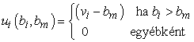

<?xml version="1.0" encoding="UTF-8" standalone="no"?>
<!DOCTYPE html PUBLIC "-//W3C//DTD XHTML 1.1//EN" "http://www.w3.org/TR/xhtml11/DTD/xhtml11.dtd">
<html xmlns="http://www.w3.org/1999/xhtml"><head><meta name="generator" content="DocBook XSL Stylesheets V1.76.1"/></head><body>

<h1 class="title"><a id="id718564"/>Működési mód tervezés</h1>

Az előző alfejezetben azt a kérdést próbáltuk megválaszolni, hogy „Ha adott egy játék, mi a racionális stratégia?” Ebben az alfejezetben azt kérdezzük, hogy „Ha az ágensek racionálisak, milyen játékot tervezzünk?” Pontosabban, egy olyan játékot szeretnénk tervezni, aminek a megoldása az egyes ágensek által követett saját racionális stratégiáik együttese, és ez egy globális hasznosságfüggvény maximálását eredményezi. Ezt a problémát <strong>működési mód tervezés</strong>nek (<strong>mechanism design</strong>) nevezik, vagy néha <strong>inverz játékelmélet</strong>nek (<strong>inverse game theory</strong>). A működési mód tervezés a közgazdaság-tudományok és a politikai tudományok a lényege. Ágensek együttesénél ez annak lehetőségét hordozza magában, hogy játékelméleti működési módokat használva ügyes rendszereket hozunk létre korlátoltabb rendszerek együtteséből – még nem együttműködő rendszerekből is –, nagyon hasonlóan ahhoz, ahogy emberek csoportjai olyan célokat tudnak elérni, amik messze túl vannak az egyéni lehetőségeken.

A működési mód tervezés példái között olcsó repülőjegyek elárverezése, TCP-csomagok számítógépek közötti továbbításához megfelelő útvonal keresése, szigorló orvosok kórházakhoz rendelése, illetve annak eldöntése szerepel, hogy robotfocisták hogyan működjenek együtt a csapattársaikkal. A működési mód tervezés az 1990-es évektől lépett ki az egyetemek falai közül, amikor számos ország, a műsorszóró frekvenciasávok elárverezésének a problémájával szembesülve, dollárszázmilliókat vesztett a lehetséges bevételeiből a gyenge működési mód tervezés eredményeképpen. Formálisan a <strong>működési mód</strong> (<strong>mechanism</strong>) tartalmaz (1) egy nyelvet az ágensek által választható megengedett stratégiák (potenciálisan végtelen) halmazának a leírására és (2) egy <em>G</em> kimeneteli szabályt, ami a jutalmakat határozza meg az ágenseknek megengedett stratégiák egy adott stratégiaprofilja esetén.

Első ránézésre a működési mód tervezés problémája triviálisnak tűnik. Tegyük fel, hogy az <em>U</em> globális hasznosságfüggvény dekomponálódik egyéni <em>Ui</em> ágens hasznosságfüggvények valamely halmazára úgy, hogy <em>U </em>= Σ<em>iUi</em>. Ekkor mondhatnánk azt, hogy ha mindegyik ágens maximálja a saját hasznosságát, ez biztosan a globális hasznosság automatikusan maximálásához fog vezetni. (Például a kapitalizmus egyszeregye szerint, ha egy társadalomban mindenki megpróbál gazdagodni, a társadalom összgazdagsága növekedni fog.) Sajnos ez nem működik. Az egyes ágensek cselekvései befolyásolhatják a többi ágens jólétét oly módon, hogy a globális hasznosság csökken. Erre példa a <strong>közlegelő tragédiája</strong> (<strong>tragedy of commons</strong>), amely helyzetben az egyéni gazdálkodók az összes lábasjószágukat ingyen legeltetik a város közlegelőjén, ezért a közlegelő tönkremegy, és az összes gazdálkodó nagy veszteséget szenved el. Mindegyik gazdálkodó egyénileg racionálisan cselekedett, azzal érvelve, hogy a közlegelő ingyenes, és azzal, hogy bár a közlegelő használata a tönkremeneteléhez vezet, a használatának a mellőzése ezt nem befolyásolja (hiszen mások úgyis használnák). Hasonló érvelések alkalmazhatók a szennyező anyagok kibocsátása esetén a légkör és az óceánok használatára is.

Az ilyen problémák szabványos megközelítése a működési mód tervezésben az, hogy a köztulajdon használatáért mindegyik ágensnél költséget számítunk fel. Általánosabban, azt kell biztosítanunk, hogy minden <strong>külsőség</strong> (<strong>externalities</strong>) – olyan globális hasznosságot befolyásoló tényező, amely az egyéni ágensek tranzakcióiban nincsenek elismerve – különállóan nevesítve megjelenjen. Ebben a nehéz a helyes árak megállapítása. Ennek a megközelítésnek a végletes formája egy olyan működési mód megalkotását jelenti, amelyben mindegyik ágenstől valójában a globális hasznosság maximálását követeljük meg. Ez megoldhatatlanul nehéz feladat az ágens számára, aki sem megbecsülni nem tudja a világ jelenlegi állapotát, sem megfigyelni a cselekvéseinek az összes többi ágensre gyakorolt hatását. A működési mód tervezés ezért olyan működésmódok megtalálására összpontosít, amelyeknél az egyes ágensek döntési problémája könnyen megoldható.

Gondoljuk át először az árveréseket. Az árverés a legáltalánosabb formájában egy működésmód bizonyos áruknak egy ajánlattevő csoport tagjai számára történő eladására. Az árajánlatok, a stratégiák és a kimenetel meghatározza, hogy ki kapja az árukat és mennyit fizet. A mesterséges intelligenciában például az árverések akkor jelennek meg, amikor ágensek egy csoportja eldönti, hogy együttműködjenek-e egy közös terven. Hunsberger és Grosz megmutatta, hogy ez hatékonyan elérhető árveréssel, amiben az ágensek ajánlatokat tesznek a közös tervbeli szerepükre (Hunsberger és Grosz, 2000). Egyelőre olyan árveréseket tekintünk át, amelyekben (1) egyetlen áru van, (2) mindegyik ajánlattevőnek van egy <em>vi</em> hasznosságértéke az árura, és (3) ezek az értékek csak az ajánlattevő számára ismertek. Az ajánlattevők megteszik a <em>bi</em> ajánlataikat, és a legmagasabb ajánlat nyeri el az árukat, de a működésmód határozza meg, hogyan tehetők meg az ajánlatok, és mi a győztes által fizetendő ár (ami nem szükségszerűen <em>bi</em>). Az árverések legismertebb típusa az <strong>angol árverés</strong> (<strong>English auction</strong>), amelyben az árverező mindaddig növeli az áruk árát, amíg csak egyetlen ajánlattevő marad, ellenőrizve közben, hogy vajon az ajánlattevők érdekeltek-e még. Ennek a működésmódnak az a tulajdonsága, hogy a legnagyobb <em>vi</em> értékkel bíró ajánlattevő nyeri el az árukat <em>bm </em>+ <em>d</em> áron, ahol <em>bm</em> a legmagasabb ajánlat az összes többi játékos között, és <em>d</em> az árverező növekménye az ajánlatok között.[<a id="id718707" href="#ftn.id718707" class="footnote">179</a>] Az angol árverésnél az ajánlattevőknek egyszerű domináns stratégiájuk van: addig tegyünk árajánlatokat, ameddig a jelenlegi költség a személyes érték alatt van. Emlékezzünk arra, hogy a „domináns” azt jelenti, hogy a stratégia minden más stratégia ellen működik. Ez viszont azt jelenti, hogy egy játékos a többi stratégiától függetlenül választhatja ezt. Ezért a játékosoknak nem kell időt és energiát vesztegetniük a többi játékos stratégiáján való elmélkedéssel. Egy működésmódot <strong>stratégiamentes</strong>nek (<strong>strategy-proof</strong>) nevezünk, ha a játékosoknak van domináns stratégiája, ami magában foglalja a valódi indítékok felfedését is.

Az angol árverés hátrányos tulajdonsága a nagy kommunikációs költség, így vagy egy szobában kell az árverésnek lezajlania, vagy az összes ajánlattevőnek nagysebességű, biztonságos kommunikációs csatornával kell rendelkeznie. Egy kevesebb kommunikációt igénylő alternatív működésmód a <strong>zárt ajánlatú árverés</strong> (<strong>sealed bid auction</strong>). Ebben minden ajánlattevő egyetlen ajánlatot tesz, és ezt közli az árverezővel, és a legnagyobb ajánlat győz. Ennek a működésmódnak az esetében az a stratégia, aminek az árajánlata a valódi érték, már nem domináns. Ha valakinek az értéke <em>vi</em>,<em> </em>és az elvárása szerint az összes többi játékos maximális ajánlata <em>bm </em>lesz,<em> </em>akkor az árajánlatának a <em>vi </em>és<em> bm</em> + ε közül az alacsonyabbnak kell lennie. A zárt ajánlatú árverés két hátránya, hogy előfordulhat, hogy a legnagyobb <em>vi</em> értékkel bíró játékos nem kapja meg az árukat, illetve az, hogy a játékosoknak fáradozniuk kell a többi játékos stratégiáján való elmélkedéssel. 

A zárt ajánlatú árverés szabályainak kis változtatásával adódik a <strong>zárt ajánlatú második áras árverés</strong> (<strong>sealed bid second-price auction</strong>), ami <strong>Vickrey-árverés</strong> (<strong>Vickrey auction</strong>) néven is ismert.[<a id="id719793" href="#ftn.id719793" class="footnote">180</a>] Az ilyen árveréseknél a győztes a <em>második</em> legmagasabb ajánlati árat fizeti a saját árajánlatának a kifizetése helyett. Ez az egyszerű módosítás teljesen kiküszöböli a szabványos (avagy <strong>első áras</strong>,<strong> first-price</strong>) zárt ajánlatú árverésnél szükséges összetett mérlegeléseket, mivel ekkor a domináns stratégia saját értékű árajánlat. Ennek belátásához vegyük észre, hogy bármely játékos tekintheti az árverést egy kétszemélyes játéknak, figyelmen kívül hagyva az összes játékost, kivéve önmagát és a többi játékos közül a legmagasabb árajánlatot tevőt. Az <em>i.</em> játékos hasznossága a saját <em>bi</em> ajánlata, a <em>vi</em> értéke és a többi játékos legjobb <em>bm </em>ajánlata<em> </em>szempontjából

Annak belátásához, hogy a <em>bi </em>=<em> vi </em>domináns stratégia, vegyük észre, hogy amikor (<em>vi</em> – <em>bm</em>)<em> </em>pozitív, akkor bármelyik ajánlat optimális, ami megnyeri az árverést, és <em>vi </em>megtétele nevezetesen megnyeri az árverést. Másrészt, amikor (<em>vi</em> – <em>bm</em>)<em> </em>negatív, akkor bármelyik ajánlat optimális, ami elveszti az árverést, és <em>vi </em>megtétele nevezetesen elveszti az árverést. Így a <em>vi </em>árajánlat optimális az összes lehetséges <em>bm </em>értékre,<em> </em>és valójában ez csak a <em>vi </em>árajánlatra teljesül. Az egyszerűsége miatt, továbbá mind az árverező, mind az ajánlattevő számára jelentkező minimális számítási igénye miatt a Vickrey-árverést széles körben használják elosztott MI-rendszerek létrehozásában.

Most gondoljuk át az internet forgalomirányítási problémáját. A játékosok a kapcsolódási háló gráfjában az élekhez tartoznak. Minden játékos ismeri egy üzenet küldésének a költségét a saját élén át; ha nincs küldendő üzenet, akkor a költség 0. A cél az, hogy egy üzenet számára megtaláljuk a legolcsóbb utat a kiindulástól a célig, ahol a teljes út költsége az egyes élek költségének az összege. A 4. fejezet számos algoritmust ad az élköltségek ismeretében a legrövidebb út kiszámítására, így minden, amit tennünk kell, az, hogy az egyes ágenseket rávegyük, hogy jelentsék a valódi <em>ci </em>költségüket. Sajnos, ha csupán megkérdezzük az ágenseket, akkor magas költséget fog jelenteni, hogy arra bátorítson, küldjük át az üzenetet máshol. Ki kell fejlesztenünk egy stratégiamentes működési módot. Egy ilyen működési mód, ha minden játékosnak fizetünk egy <em>pi </em>jutalmat, ami a legrövidebb, az <em>i-</em>edik élet nem tartalmazó út hossza mínusz a legrövidebb út (keresési algoritmus által kiszámolt) hossza, ahol az <em>i</em>-edik él költségét 0-nak tételezzük fel.

<code class="code"><em>pi </em>= Hossz(út <em>ci </em>= ∞-nél) – Hossz(út <em>ci </em>= 0-nál)</code>

Megmutatható, hogy e mellett a működési mód mellett a domináns stratégia mindegyik játékosnak a <em>ci</em> őszinte jelentése, illetve, hogy ennek megtétele a legolcsóbb utat fogja eredményezni. E kívánatos tulajdonság ellenére az itt vázolt működésmódot a gyakorlatban nem használják a nagy kommunikációs és központi számítási költség miatt. A működési mód tervezőnek kommunikálnia kell az összes <em>n</em> játékossal, és aztán egy optimalizációs problémát kell megoldania. Ez megérheti, ha a költségek eloszlanának sok üzenet felett, de valós hálózatokban a <em>ci</em> költségek folyamatosan változnának a forgalom torlódása, a gépek üzemképtelenné válása és belépése miatt. Eddig teljesen kielégítő megoldást még nem fejlesztettek ki.

 

[<a id="ftn.id718707" href="#id718707" class="para">179</a>]  Valójában van egy kis esélye, hogy a legnagyobb <em>vi</em> értékkel bíró játékosnak nem sikerül megszereznie az árukat abban az esetben, amikor <em>bm </em>&lt; <em>vi </em>&lt; <em> bm </em>+ <em>d</em>. Annak az esélyét, hogy ez megtörténjen, tetszőlegesen kicsivé lehet tenni a <em>d</em> növekmény csökkentésével.

[<a id="ftn.id719793" href="#id719793" class="para">180</a>]  William Vickreyről elnevezve, aki az 1996-os közgazdasági Nobel-díj kitüntetettje.

</body></html>
