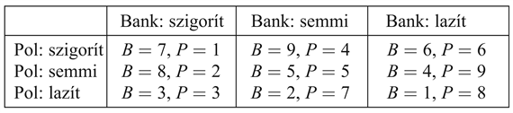

<?xml version="1.0" encoding="UTF-8" standalone="no"?>

<html xmlns="http://www.w3.org/1999/xhtml"><head><meta name="generator" content="DocBook XSL Stylesheets V1.76.1"/></head><body>

<h1 class="title"><a id="id719997"/>Összefoglalás</h1>

A fejezet megmutatta, hogyan használjuk a világról meglévő tudásunkat döntések meghozatalára, még akkor is, amikor egy cselekvés kimenetelei bizonytalanok, és a cselekvésért járó jutalmat nem arathatjuk le csak több cselekvés után. A legfőbb pontok:

<ul class="itemizedlist"><li class="listitem">
A szekvenciális döntési problémákat bizonytalan környezet esetén, más néven <strong>Markov döntési folyamat</strong>okat vagy <strong>MDF</strong>-ket (<strong>Markov decision process</strong>,<strong> MDP</strong>), teljesen definiálja egy cselekvések valószínűségi kimenetelét meghatározó <strong>állapotátmenet-modell</strong> (<strong>transition model</strong>) és az egyes állapotokbeli jutalmakat meghatározó <strong>jutalomfüggvény</strong> (<strong>reward function</strong>). 
</li><li class="listitem">
Egy állapotsorozat hasznossága a sorozathoz tartozó összes jutalom összege, ami lehet az idővel leszámítolt. Egy MDF megoldása egy <strong>eljárás</strong> (<strong>policy</strong>), ami mindegyik ágens által elérhető állapothoz hozzárendel egy döntést. Egy optimális eljárás maximálja a végrehajtása során fellépő állapotsorozatok hasznosságát.
</li><li class="listitem">
Egy állapot hasznossága az azon állapotsorozatok várható hasznossága, amelyek ebből az állapotból kezdődnek, és egy optimális eljárás végrehajtása esetén lépnek fel. Az MDF-k megoldására szolgáló <strong>értékiteráció</strong> (<strong>value iteration</strong>) algoritmusa a működése során az egyenleteket iteratívan oldja meg, az egyes állapotok hasznosságait a szomszédai hasznosságához kapcsolva.
</li><li class="listitem">
Az <strong>eljárásmód-iteráció</strong> (<strong>policy iteration</strong>) felváltva kiszámolja az állapotoknak az aktuális eljáráshoz tartozó hasznosságát, majd az aktuális hasznosságokhoz képest javít az aktuális eljáráson.
</li><li class="listitem">
A részlegesen megfigyelhető MDF-ek vagy RMMDF-ek sokkal nehezebben oldhatók meg, mint az MDF-ek. Megoldásuk során konvertáljuk őket egy olyan MDF-be, amit hiedelmi állapotok folytonos terében definiálunk. Az optimális viselkedés az RMMDF-ekben magában foglalja az információgyűjtést a bizonytalanság csökkentése céljából, és így a jövőbeli jobb döntések meghozatala miatt is.
</li><li class="listitem">
Az RMMDF-környezetekre egy döntéselméleti ágens hozható létre. Az ágens egy <strong>d</strong><strong>inamikus döntési háló</strong>t (<strong>dynamic decision network</strong>) használ az állapotátmenet-modell és megfigyelési modell ábrázolására, a hiedelmi állapotának frissítésére, illetve lehetséges cselekvési sorozatok előre elgondolásához.
</li><li class="listitem">
A <strong>játékelmélet</strong> (<strong>game theory</strong>) olyan szituációkban írja le az ágensek racionális viselkedését, amelyekben több ágens egyidejű interakciója van jelen. A játékok megoldásai Nash-egyensúlyok – olyan stratégiaprofilok, amelyekben egyik ágensnek sincs indítéka a megadott stratégiától eltérni.
</li><li class="listitem">
A <strong>működési mód tervezés</strong> (<strong>mechanism design</strong>) használható fel az ágensek interakcióját megadó olyan szabályok megállapítására, amelyek egy globális hasznosságot az egyéni racionális ágensek tevékenységén keresztül maximálnak. Néha léteznek olyan működésmódok, amelyek ezt a célt úgy érik el, hogy az egyes ágenseknek nem kell meggondolniuk a többi ágens által hozott döntéseket.
</li></ul>

Az MDF-ek és az RMMDF-ek világára vissza fogunk térni a 21. fejezetben, amikor a megerősítéses tanulás módszerét tanulmányozzuk, ami lehetővé teszi az ágens számára, hogy a tapasztalatai alapján javítsa a viselkedését szekvenciális, bizonytalan környezetekben.

<h2 class="title"><a id="id720137"/>Irodalmi és történeti megjegyzések</h2>

Richard Bellman kezdeményezte a szekvenciális döntési problémák modern megközelítési módját, és javasolta a dinamikus programozás módszerét általában és külön az értékiterációval kapcsolatban is (Bellman, 1957). Egy PhD-disszertációban Ron Howard vezette be az eljárásmód-iterációt és az átlagjutalom fogalmát végtelen horizontú problémák megoldására (Howard, 1960). Számos további eredményt Bellman és Dreyfus vezettek be (Bellman és Dreyfus, 1962). A módosított eljárásmód-iteráció van Nunentől, illetve Putermantól és Shintől származik (van Nunen, 1976; Puterman és Shin, 1978). Az aszinkron eljárásmód-iterációt Williams és Baird elemezték, tőlük származik a (17.9) egyenletbeli korlát is az eljárásmód-veszteségre (Williams és Baird, 1993). A leszámítolás technikáját stacionárius preferenciák segítségével megfogalmazva Koopmans dolgozta ki (Koopmans, 1972). A (Bertsekas, 1987; Puterman, 1994; Bertsekas és Tsitsiklis, 1996) könyvek precíz bevezetést adnak a szekvenciális döntési problémákhoz. Papadimitriou és Tsitsiklis az MDF-k számítási komplexitásáról közölnek eredményeket (Papadimitriou és Tsitsiklis, 1987).

Sutton és Watkins nagy hatású munkái, amelyek az MDF-ek megoldására szolgáló megerősítéses tanulási módszerekre irányultak, jelentős szerepet játszottak az MDF-ek megismertetésében az MI-kutatás területén (Sutton és Watkins, 1988), hasonlóan Barto és társainak későbbi áttekintéséhez (Barto és társai, 1995). (Werbos [1977] korábbi munkája számos hasonló ötletet tartalmazott, de nem vált ilyen széles körben elfogadottá.) Az első kapcsolatot az MDF-ek és a mesterséges intelligencia tervezési problémái között Sven Koenig teremtette meg (Koenig, 1991), aki megmutatta hogyan nyújtanak a valószínűségi Strips operátorok egy tömör ábrázolást az állapotátmenet-modellek számára. (Lásd még Wellman, 1990b.) Dean és munkatársai, illetve Tash és Russell munkáikban a nagy állapotterek miatti kombinatorikus problémákon kíséreltek meg úrrá lenni korlátozott keresési horizont és absztrakt állapotok felhasználásával (Dean és társai, 1993); Tash és Russell, 1994). Az információ értékén alapuló heurisztikák felhasználhatók olyan állapottérrészek kiválasztására, ahol a horizont lokális kiterjesztése a döntés minőségének jelentős javulását eredményezi. Ezt a megközelítést használva az ágensek az időkényszerekhez igazíthatják az erőfeszítéseiket, és érdekes viselkedést alakíthatnak ki, mint például a jól ismert „kitaposott utak” használatát az állapottérben való gyors útkeresésnél, elkerülve az optimális döntések újbóli kiszámítását az egyes pontokban. Boutilier és munkatársai mostani munkái propozicionális és elsőrendű kifejezéseken alapuló <em>szimbolikus</em> reprezentációk dinamikus programozásbeli felhasználására összpontosultak, mind az állapotátmenet-modellek, mind az értékfüggvények esetében (Boutilier és társai, 2000; 2001).

Azt a megfigyelést, hogy a részlegesen megfigyelhető Markov döntési folyamatok átalakíthatók hagyományos Markov döntési folyamatokká hiedelmi állapotok felhasználásával, Astrom közli (Astrom, 1965). Az első teljes algoritmust a részlegesen megfigyelhető Markov döntési folyamatok egzakt megoldására Edward Sondik javasolta a PhD-disszertációjában (Sondik, 1971). (Egy későbbi folyóiratcikk [Smallwood és Sondik, 1973] tartalmaz néhány hibát, de jobban elérhető.) Az RMMDF-el kapcsolatos aktuális eredmények áttekintését adja Lovejoy (Lovejoy, 1991). Az első jelentős eredmény az MI területén a Witness-algoritmus volt (Cassandra és társai, 1994; Kaelbling és társai, 1998), ami egy javított változata az RMMDF értékiterációjának. Hamarosan következtek más algoritmusok, köztük egy Hansentól származó megközelítés, ami egy eljárásmódot fokozatosan hoz létre egy végesállapotú automata formájában (Hansen, 1998). Az eljárásmód ezen ábrázolásában a hiedelmi állapotok közvetlenül az automata konkrét állapotaihoz tartoznak. Közelítőleg optimális eljárásmódok az RMMDF-ekhez olyan eljárással hozhatók létre, ahol az előrefelé keresést a lehetséges megfigyelések és cselekvések kimeneteleinek mintavételezésével kombináljuk (Kearns és társai, 2000; Ng és Jordan, 2000). További, az RMMDF-ekre vonatkozó munkákat a 21. fejezetben tárgyalunk.

A dinamikus döntési hálókat használó ágensarchitektúra alapötleteit Dean és Kanazawa javasolták (Dean és Kanazawa, 1989a). Dean és Wellman könyve, a <em>Planning and Control,</em> sokkal részletesebb kapcsolatot teremt a DBH/DDH-modellek és a szűrés klasszikus szabályozáselméletbeli szakirodalma között (Dean és Wellman, 1991). Tatman és Shachter mutatta meg, hogy hogyan alkalmazhatók dinamikus programozási algoritmusok DDH-modellekre (Tatman és Shachter, 1990). Russell különböző módszereket közöl ilyen ágensek felskálázására, és számos nyitott kutatási kérdést fogalmaz meg (Russell, 1998).

A játékelmélet kezdetei a 17. századra nyúlnak vissza, Christiaan Huygens és Gottfried Leibniz javaslataihoz, a versengő és együttműködő emberi interakciók tudományos és matematikai vizsgálatára. A 19. század folyamán számos vezető közgazdász alkotott egyszerű matematikai példákat, hogy a versengési helyzetek konkrét eseteit elemezze. Az első formális eredmények a játékelméletben Zermelótól származnak (Zermelo, 1913) (aki egy évvel korábban a minimax keresés egy – bár hibás – változatát javasolta játékokra). Emil Borel vezette be a kevert stratégia fogalmát (Borel, 1921). Neumann János bizonyította be, hogy minden kétszemélyes, zérusösszegű játéknak van egy maximin egyensúlya a kevert stratégiák körében és egy jól definiált értéke (Neumann, 1928). Neumann együttműködése a közgazdász Oskar Morgensternnel vezetett a <em>Theory of Games and Economic Behavior</em> c. könyv megjelenéséhez 1944-ben, ami a játékelmélet meghatározó könyve. A könyv megjelenése a háború miatti papírhiány miatt késett, míg végül a Rockefeller család egy tagja személyesen támogatta a könyv kiadását.

John Nash, 1950-ben, 21 évesen jelentette meg elgondolásait az általános játékbeli egyensúlyi helyzetekkel kapcsolatban. Az egyensúlyi megoldás általa megadott definíciója, bár Cournot munkáján alapult (Cournot, 1838), úgy vált ismertté, mint Nash-egyensúly. Az 1959-től fellépő skizofréniája miatti hosszú szünet után Nash 1994-ben közgazdasági Nobel-díjat kapott (megosztva Reinhart Seltennel és Harsányi Jánossal).

A Bayes–Nash-egyensúlyt Harsányi közli (Harsányi, 1967) és Kadane és Larkey elemzi (Kadane és Larkey, 1982). A játékelmélet ágensek vezérlésében történő felhasználásának bizonyos kérdéseit Binmore tárgyalja (Binmore, 1982).

A fogolydilemmát mint tantermi példát Albert W. Tucker alkotta meg és Axelrod tárgyalja részletesen (Axelrod, 1985). Az ismétlődő játékokat Luce és Raiffa vezette be (Luce és Raiffa, 1957) mint részleges információjú játékokat (Kuhn, 1953).

Az első gyakorlati algoritmust részleges információjú játékokra az MI területén Koller és munkatársai fejlesztették ki (Koller és társai, 1996); Koller és Pfeffer cikke olvasmányos bevezetést ad a terület általános részeihez és egy működő rendszert ír le szekvenciális játékok ábrázolására és megoldására (Koller és Pfeffer, 1997). A játékelméletet és az MDF-eket a Markov-játékok elméletében egységesíti Littman (Littman, 1994). Shapley valójában már Bellman előtt közölte az értékiteráció algoritmusát (Shapley, 1953), de az eredményei nem váltak ismertté, talán amiatt, hogy nem a Markov-játékok keretei között voltak megfogalmazva. A játékelmélet általános tárgyalását tartalmazzák a (Myerson, 1991; Fudenberg és Tirole, 1991; Osborne és Rubinstein, 1994) művek. 

A köztulajdon tragédiáját, ami működési mód tervezés egy motiváló problémája, Hardin mutatta be (Hardin, 1968). Hurwicz alkotta meg a működési mód tervezés matematikai alapjait (Hurwicz, 1973). Milgrom egy általa tervezett, akár több milliárd dolláros tételekre is szánt árverés működésmódot közöl (Milgrom, 1997). Az árverések a tervezésben (Hunsberger és Grosz, 2000) és az ütemezésben is felhasználhatók (Rassenti és társai, 1982). Varian rövid áttekintést ad a számításelméleti szakirodalomhoz kapcsolódó hivatkozásokkal együtt (Varian, 1995), a Rosenschein és Zlotkin szerzőpárostól pedig egy könyv terjedelmű tárgyalás jelent meg elosztott MI-alkalmazásokról (Rosenschein és Zlotkin, 1994). Az elosztott MI-ben más nevek alatt folynak kapcsolódó munkák, ideértve az együttes intelligenciát (Collective Intelligence), (Tumer és Wolpert, 2000) és a piacalapú szabályozást (market-based control) (Clearwater, 1996). Az árverések számítási vonatkozásairól gyakran az ACM Conferences on Electronic Commerce-en jelennek meg cikkek.

<h2 class="title"><a id="id720175"/>Feladatok</h2>

<strong>17.1.	</strong>

A 17.1. ábra által mutatott 4 × 3-as világ esetén számítsa ki mely négyzetek és milyen valószínűséggel érhetők el az [1, 1]-ből a [<em>Fel</em>,<em> Fel</em>,<em> Jobbra</em>,<em> Jobbra</em>,<em> Jobbra</em>] cselekvéssorozattal. Magyarázza el, hogyan kapcsolódik ez a számítás egy rejtett Markov-modell előre elgondolásához („projecting”).

<strong>17.2.	</strong>

Tegyük fel, hogy egy állapotsorozat hasznosságát a sorozat állapotaiban kapott jutalmak maximumaként definiáljuk. Mutassuk meg, hogy ez a hasznosságfüggvény nem eredményez stacionárius preferenciákat az állapotszekvenciák között. Lehetséges-e mégis olyan hasznosságfüggvényt definiálni az állapotokon, hogy a MVH-döntéshozatal optimális viselkedést adjon?

<strong>17.3.	</strong>

Pontosan konvertálható-e egy véges keresési probléma Markov döntési problémává úgy, hogy az utóbbi optimális megoldása az előzőnek is optimális megoldása legyen? Ha igen<em>, </em>magyarázza el<em> </em>pontosan, hogyan konvertálja a problémát, és hogyan konvertálja a megoldást visszafelé; ha nem, akkor magyarázza el, hogy miért nem (azaz adjon ellenpéldát).

<strong>17.4.	</strong>

Képzeljünk el egy leszámítolatlan MDF-et három állapottal, (1, 2, 3) és sorrendben a következő jutalmakkal –1, –2, 0. A 3-as állapot egy végállapot. Az 1-es és 2-es állapotokban két lehetséges cselekvés van: <em>a</em> és <em>b</em>. Az állapotátmenet-modell a következő:

<ul class="itemizedlist"><li class="listitem">
Az 1-es állapotban az <em>a</em> cselekvés az ágenst a 2-es állapotba mozgatja 0,8 valószínűséggel, míg 0,2 valószínűséggel helyben hagyja.
</li><li class="listitem">
Az 2-es állapotban az <em>a</em> cselekvés az ágenst az 1-es állapotba mozgatja 0,8 valószínűséggel, és 0,2 valószínűséggel helyben hagyja.
</li><li class="listitem">
Mind az 1-es, mind a 2-es állapotban a <em>b</em> cselekvés az ágenst a 3-as állapotba mozgatja 0,1 valószínűséggel, és 0,9 valószínűséggel helyben hagyja.
</li></ul>

Válaszolja meg a következő kérdéseket:

<ol class="orderedlist"><li class="listitem">
Mi<em> </em>határozható meg <em>kvalitatívan </em>az optimális eljárásmódról az 1-es és a 2-es állapotokban?
</li><li class="listitem">
Alkalmazzon eljárásmód-iterációt az optimális eljárásmód, illetve az 1-es és a 2-es állapotok értékének a meghatározására. Minden lépést teljesen illusztráljon. Tegyük fel, hogy a kezdeti eljárásmód mindkét állapotban a <em>b</em> cselekvés.
</li><li class="listitem">
Mi történik az eljárásmód-iterációval, ha a kezdeti eljárásmód mindkét állapotban az <em>a</em> cselekvés? Segít a leszámítolás? Függ-e az optimális eljárásmód a leszámítolási tényezőtől?
</li></ol>

<strong>17.5.	</strong>

Alkalmanként az MDF-ek megadása tartalmaz egy <em>R</em>(<em>s</em>,<em> a</em>) jutalomfüggvényt, ami a véghezvitt cselekvéstől függ, vagy egy <em>R</em>(<em>s</em>,<em> a</em>,<em> s</em>′) jutalomfüggvényt, ami még a kimeneteli állapottól is függ.

<ol class="orderedlist"><li class="listitem">
Írja fel a Bellman-egyenleteket ezt a formalizmust használva.
</li><li class="listitem">
Mutassa meg, hogyan lehet egy <em>R</em>(<em>s</em>,<em> a</em>,<em> s</em>′) jutalomfüggvényt tartalmazó MDF-et átalakítani egy másik, <em>R</em>(<em>s</em>,<em> a</em>) jutalomfüggvényt tartalmazó MDF-be úgy, hogy az optimális eljárásmódok az új MDF-ben pontosan megfeleljenek az eredeti MDF-beli optimális eljárásmódoknak.
</li><li class="listitem">
Most ugyanígy konvertálja az <em>R</em>(<em>s</em>,<em> a</em>)-t tartalmazó MDF-eket <em>R</em>(<em>s</em>)-t tartalmazó MDF-ekbe.
</li></ol>

<strong>17.6.	</strong>

Tekintsük a 17.1. ábrán látható 4 × 3-as világot.

<ol class="orderedlist"><li class="listitem">
Valósítson meg egy olyan környezetszimulátort erre a környezetre, amelyben a környezet földrajzi sajátosságai könnyen megváltoztathatók. Ehhez egy bizonyos forráskód már elérhető a könyv forráskódtárában a világhálón.
</li><li class="listitem">
Hozzon létre egy eljárásmód-iterációt használó ágenst, és mérje meg a teljesítményét a környezetszimulátorban különböző kiindulási állapotokból. Végezzen nagyszámú kísérletet mindegyik kiindulási állapotból, és hasonlítsa össze a futásonként kapott összjutalmak átlagát az állapot hasznosságával (amit a létrehozott algoritmus határozott meg).
</li><li class="listitem">
Kísérletezzen a környezet méretének a megnövelésével. Hogyan változik az eljárásmód-iteráció futási ideje a környezet méretének a változásával?
</li></ol>

<strong>17.7.	</strong>

A 17.1. ábrán mutatott környezetre keresse meg az <em>R</em>(<em>s</em>)<em> </em>függvényre az összes küszöbértéket, azaz azokat az értékeket, amelyek átlépésekor az optimális eljárásmód megváltozik. Ehhez egy módszer szükséges az optimális eljárásmód meghatározásához és egy rögzített <em>R</em>(<em>s</em>)<em> </em>esetén az értékének a kiszámításához. (<em>Segítség</em>: bizonyítsa be, hogy az érték minden rögzített eljárásmódnál <em>R</em>(<em>s</em>)-sel lineárisan változik.)

<strong>17.8.	</strong>

Ebben a feladatban kétszereplős MDF-ekkel foglalkozunk, amelyek a zérusösszegű, többfordulós játékokhoz tartoznak, mint amilyenek a 6. fejezetben szerepelnek. Legyen a két játékos <em>A</em> és <em>B</em>, és legyen <em>R</em>(<em>s</em>) az <em>A</em> játékos jutalma az <em>s </em>állapotban. (<em>B </em>jutalma mindig egyenlő és ellentétes előjelű.)

<ol class="orderedlist"><li class="listitem">
Legyen <em>UA</em>(<em>s</em>) az <em>s</em> állapot hasznossága, amikor <em>A</em> lépése következik <em>s</em>-ben, és legyen <em>UB</em>(<em>s</em>) az <em>s</em> állapot hasznossága, amikor <em>B</em> következik <em>s</em>-ben. Az összes jutalom és hasznosság <em>A</em> szempontjából van megfogalmazva (pontosan úgy, ahogyan a minimax játékfában). Írja fel az <em>UA</em>(<em>s</em>)-t és az <em>UB</em>(<em>s</em>)-t definiáló Bellman-egyenleteket.
</li><li class="listitem">
Magyarázza el, hogyan végezhet kétszemélyes értékiterációt ezekkel az egyenletekkel, és adjon meg egy alkalmas leállási kritériumot.
</li><li class="listitem">
Tekintsük a 6.14. ábrán látható játékot a <a class="xref" href="ch06s08.md#ID_241_oldal">„Feladatok”</a> részben. Rajzolja fel az állapotteret (a játékfa helyett), folytonos vonallal mutatva <em>A</em> mozgásait és szaggatott vonallal <em>B</em> mozgásait. Jegyezze fel minden állapothoz az <em>R</em>(<em>s</em>) értékét. Hasznos lehet az (<em>sA</em>, <em>sB</em>) állapotok elrendezése egy kétdimenziós rácson, <em>sA</em>-t és <em>sB</em>-t „koordinátaként” használva.
</li><li class="listitem">
Most alkalmazza a kétszemélyes értékiterációt a játék megoldására, és származtassa az optimális eljárásmódot.
</li></ol>

<strong>17.9.	</strong>

Mutassuk meg, hogy egy domináns stratégiai egyensúly egy Nash-egyensúly, de ez visszafelé nem igaz.

<strong>17.10.	</strong>

A kő-papír-olló gyerekjátékban mindegyik játékos egyszerre felmutatja a választását, ami kő, papír vagy olló. A papír becsomagolja a követ, a kő kicsorbítja az ollót, az olló elvágja a papírt. A kiterjesztett kő-papír-olló-tűz-víz változatban a tűz üti a követ, papírt és ollót, a kő, papír és olló üti a vizet, és a víz üti a tüzet. Írja fel a jutalmazási mátrixot, és keressen egy kevert stratégiájú megoldást a játékhoz.

<strong>17.11.	</strong>

Oldja meg a háromujjas snóblijátékot.

<strong>17.12.	</strong>

A Nemzeti Jégkorong Szövetségben (National Hockey League) 1999 előtt a csapatok 2 pontot kaptak a győzelemért, 1-et a döntetlenért és 0-t, ha veszítettek. Ez zérusösszegű játék? 1999-ben a szabályokat úgy módosították, hogy egy csapat 1 pontot kap, ha hosszabbításban kap ki. A győztes csapat továbbra is 2 pontot kap. Hogyan változtatja meg ez a módosítás a fenti kérdésekre a válaszokat? Ha törvényes lenne, mikor volna racionális a két csapatnak titokban megegyezni, hogy a rendes játékidőben döntetlent érnek el, és majd a hosszabbításban döntik el a küzdelmet? Tegyük fel, hogy mindegyik csapat számára a kapott pontszámok jelentik a hasznosságot, és hogy létezik egy kölcsönösen ismert <em>p </em>a priori valószínűség, hogy az első csapat hosszabbításban fog nyerni. Milyen <em>p</em> értékekre értene egyet mindkét csapat ezzel az egyezséggel? 

<strong>17.13.	</strong>

A következő jutalommátrix Blindertől származik, amit Bernstein közöl (Blinder, 1983; Bernstein, 1996), a politikusok és a jegybank (Federal Reserve) közötti játékot ábrázolja.

A politikusok lazíthatják vagy szigoríthatják a pénzügyi politikát, míg a jegybank lazíthatja vagy szigoríthatja a monetáris politikát. (És természetesen mindkét oldal választhatja azt, hogy nem tesz semmit.) Mindegyik oldalnak vannak preferenciái, hogy kinek mit kell tennie – egyik oldal sem szeretne rossznak látszani. A mutatott jutalmak egyszerűen sorrendi rangok: 9 az első választásért és végül 1 az utolsóért. Keresse meg a játék Nash-egyensúlyát a tiszta stratégiák között. Ez Pareto-optimális megoldás? Az olvasó esetleg érdemesnek tartja elemezni a jelenlegi kormány politikáját ennek fényében.

</body></html>
