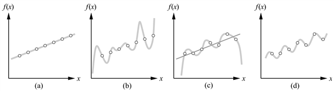

<?xml version="1.0" encoding="UTF-8" standalone="no"?>
<!DOCTYPE html PUBLIC "-//W3C//DTD XHTML 1.1//EN" "http://www.w3.org/TR/xhtml11/DTD/xhtml11.dtd">
<html xmlns="http://www.w3.org/1999/xhtml"><head><meta name="generator" content="DocBook XSL Stylesheets V1.76.1"/></head><body>

<h1 class="title"><a id="id720898"/>Induktív tanulás</h1>

Egy determinisztikus, felügyelt tanulást végző algoritmus bemenetként megkapja az ismeretlen függvény bizonyos bemeneti értékekhez tartozó válaszait, feladata az ismeretlen függvény – vagy ahhoz nagyon közel álló leképezés – előállítása. Formálisan azt mondjuk, hogy egy <strong>minta</strong> (<strong>example</strong>) nem más, mint egy (<em>x</em>, <em>f</em>(<em>x</em>)) értékpár, ahol <em>x</em> a bemeneti érték, míg <em>f</em>(<em>x</em>) az <em>x</em>-re alkalmazott függvény kimeneti értéke. A <strong>tisztán induktív következtetés</strong> (<strong>pure inductive inference</strong>) (vagy<strong> indukció</strong> [<strong>induction</strong>]) feladata a következő:

Adott az <em>f</em>-re vonatkozó minták egy halmaza, ennek alapján határozzunk meg egy <em>h</em> függvényt, amely közelíti <em>f</em>-et.

A <em>h</em> függvényt <strong>hipotézis</strong>nek (<strong>hypothesis</strong>) nevezzük. A tanulás nehézsége elvi szempontból abban áll, hogy nem könnyű egy adott <em>h</em> függvényről megmondani, hogy jól approximálja-e <em>f</em>-et. Egy jó hipotézis jól <strong>általánosít</strong> (<strong>generalize</strong>) – azaz jó becslést kapunk a még nem látott mintákra is. Ez az <strong>induktív következtetés alapproblémája</strong> (<strong>problem of induction</strong>). A problémát már évszázadok óta kutatják, a 18.5. alfejezet egy részmegoldást szolgáltat.
<a id="ID_752_oldal"/>
<a id="id721018"/>
<strong>18.1. ábra - (a) Példa (<em>x</em>, <em>f</em>(<em>x</em>)) értékpárok és egy velük konzisztens lineáris hipotézis. (b) Egy – ugyanazokkal az adatokkal konzisztens – hetedfokú polinom. (c) Egy másik adathalmaz egy pontosan illeszkedő hatodfokú polinommal, illetve egy közelítő lineáris illesztéssel. (d) Egy egyszerű szinuszos illesztés ugyanazokra az adatokra.</strong>

<h3 class="title">Fontos</h3>
A 18.1. ábra ismert példát mutat be: egy adathalmazra egyváltozós függvényt illesztünk. A minták (<em>x</em>, <em>f</em>(<em>x</em>)) értékpárok, ahol mind <em>x</em>, mind <em>f</em>(<em>x</em>) valós értékek. Legyen a <strong>H</strong> <strong>hipotézistér</strong> (<strong>hypothesis space</strong> <strong>H</strong>) – azon hipotézisek halmaza, amelyeket meg fogunk vizsgálni – a legfeljebb <em>k</em>-ad fokú polinomok tere. (Például 3<em>x</em>2 + 2, <em>x</em>17 – 4<em>x</em>3 stb.) A 18.1. (a) ábra valamilyen adatokat és egy az adatokra pontosan illeszkedő egyenes vonalat (elsőfokú polinom) mutat. Ez a vonal itt egy <strong>konzisztens</strong> (<strong>consistent</strong>) hipotézis, mivel valamennyi adatra illeszkedik. A 18.1. (b) ábra egy nagy fokszámú polinomot mutat, amely szintén konzisztens ugyanazokra az adatokra nézve. Ez a két példa illusztrálja az induktív tanulás első komoly megoldandó kérdését: <em>hogyan válasszunk több konzisztens hipotézis közül?</em> Egy lehetséges válasz az ún. <strong>Ockham borotvája</strong>[<a id="id721123" href="#ftn.id721123" class="footnote">182</a>] (<strong>Ockham’s razor</strong>) elv: részesítsük előnyben a <em>legegyszerűbb</em> olyan hipotézist, amely konzisztens az adatokkal. Ez józan intuíciónak tűnik, mivel azok a hipotézisek, amelyek nem egyszerűbbek, mint maguk az adatok, nem nyernek ki semmilyen <em>mintázatot</em> az adatokból. Az egyszerűség definíciója nem könnyű, de értelmesnek tűnik azt mondani, hogy egy elsőfokú polinom egyszerűbb, mint egy 12-ed fokú.

<h3 class="title">Fontos</h3>
A 18.1. (c) ábra egy másik adathalmazt mutat. Ezekre az adatokra nem lehet konzisztens módon egyenest illeszteni, valójában egy hatodfokú polinomra (amely 7 szabad paraméterrel rendelkezik) van szükség a pontos illesztéshez. A halmazban csak 7 adat van, így a polinomnak épp annyi paramétere van, ahány adatpont. Ennek megfelelően úgy tűnik, hogy nem sikerül valamilyen mintázatot találnunk az adathalmazban, így nem várunk jó általánosítóképességet. Jobban járhatunk, ha inkább egy egyszerű egyenest illesztünk, amely ugyan nem konzisztens, de ésszerű becsléseket adhat. Ez azt valószínűsíti, hogy a keresett függvény nem determinisztikus (vagy ami ezzel közelítőleg ekvivalens: a valódi bemeneti minták nem figyelhetők meg teljes pontossággal). <em>Nemdeterminisztikus függvények esetén elkerülhetetlen, hogy kompromisszumot kössünk a hipotézis komplexitása és az adatokhoz való illeszkedés pontossága között.</em> A 20. fejezetben bemutatjuk, hogy ezt a kompromisszumot hogyan lehet a valószínűség-számítás elméletének felhasználásával kialakítani.

Észben kell tartanunk, hogy egy egyszerű, konzisztens hipotézis megtalálásának esélye erősen függ a választott hipotézistértől. A 18.1. (d) ábra bemutatja, hogy a (c) alatti adatokra pontosan illeszthető egy egyszerű<em> ax </em>+<em> b </em>+<em> c </em>sin(<em>x</em>) alakú függvény. Ez a példa jól mutatja a hipotézistér jó megválasztásának fontosságát. Ha olyan hipotézisteret választunk, amely véges fokszámú polinomokat tartalmaz, akkor szinuszos függvényeket nem tudunk pontosan reprezentálni. Így egy olyan tanuló, amelyik ezt a hipotézisteret használja, nem fog tudni szinuszos adatokból tanulni. Egy tanulási problémát <strong>realizálható</strong>nak (<strong>realizable</strong>) nevezünk, ha a hipotézistérnek eleme az igazi függvény, különben a problémát <strong>nem realizálható</strong>nak (<strong>unrealizable</strong>) nevezzük. Sajnos nem mindig tudjuk megmondani, hogy egy tanulási probléma realizálható-e, mivel nem ismerjük a valódi függvényt. Egy lehetőség e korlát túllépésére az a priori tudás felhasználása. Ennek segítségével olyan hipotézisteret alkotunk, amelyről tudjuk, hogy tartalmazza az igazi függvényt. Ezt a témát a 19. fejezetben tárgyaljuk.

<h3 class="title">Fontos</h3>
Egy másik lehetséges megközelítés, hogy a lehető legnagyobb hipotézisteret használjuk. Például miért ne legyen a <strong>H</strong> hipotézisterünk az összes Turing-gépek osztálya? Végül is minden kiszámítható függvény reprezentálható valamilyen Turing-géppel, tehát ez a legjobb, amit tehetünk. Ennek a megközelítésnek az a problémája, hogy nem veszi figyelembe a tanulás <em>számítási komplexitását</em>. <em>Kompromisszumot kell kötnünk a hipotézistér kifejezőképessége és egyszerű konzisztens hipotézisek megtalálásának komplexitása között.</em> Például: egyenesek illesztése az adatokra könnyen megoldható, nagy fokszámú polinomok illesztése nehezebb, Turing-gépek illesztése pedig nagyon nehéz. Ugyanis annak eldöntése, hogy egy adott Turing-gép konzisztens-e az adatokkal, általánosságban még csak nem is lehetséges. Egy másik ok, ami miatt előnyben részesítjük az egyszerű hipotézistereket, hogy az eredményképp kapott hipotézisek használata is egyszerűbb lehet – könnyebb kiszámítani <em>h</em>(<em>x</em>)-et, ha <em>h</em> egy lineáris függvény, mint ha egy tetszőleges Turing-gép programja lenne.

Ezen okokból a legtöbb tanulással foglalkozó eddigi kutatás a viszonylag egyszerű hipotézisreprezentációkra helyezte a fő hangsúlyt. Ebben a fejezetben az ítéletlogikára és az ehhez kapcsolódó nyelvekre koncentrálunk. Az elsőrendű logikai reprezentációt használó tanulás elméletével a 19. fejezet foglalkozik. Látni fogjuk, hogy a kifejezőképesség-komplexitás kompromisszum nem is olyan egyszerű, mint először gondolnánk. Gyakran az a helyzet – mint azt a 8. fejezetben is láttuk –, hogy egy kifejezőnyelv lehetővé teszi az adatokra illesztett <em>egyszerű</em> elméletet, míg a nyelv kifejezőképességének korlátozása azt is jelenti, hogy bármely konzisztens elmélet szükségszerűen bonyolult lesz. A sakk szabályait például egy-két oldalon le tudjuk írni elsőrendű logika segítségével, míg az ítéletlogikával történő leírás több ezer oldalt igényelne. Ilyen esetekben kell arra lehetőségnek lennie, hogy a kifejezőbb nyelven sokkal gyorsabb legyen a tanulás.

 

[<a id="ftn.id721123" href="#id721123" class="para">182</a>]  A 14. századi angol filozófus, William of Ockham után. Ockham nevét gyakran hibásan Occamnak írják, ami talán a francia „Guillaume d’Occam” fordításából ered.

</body></html>
